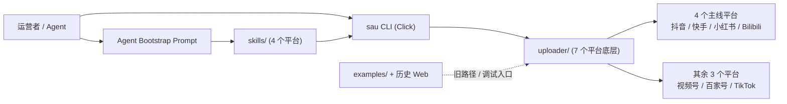

## 这篇文章在回答什么

SocialAutoUpload 仓库目前 9k+ star，226 次 commit。但如果你只读 README 的前两句，很容易得到一个与实际情况偏差很大的判断：以为它是一个"已经完整打通 7 个平台"的成品。

实际状态是：底层的 7 个平台 uploader 确实都铺开了，但真正收敛成统一 CLI（命令行界面）、也最适合交给 Agent 接手的，目前只有抖音、快手、小红书、Bilibili 这 4 条主线。视频号、百家号、TikTok 仍然停留在底层自动化实现和示例脚本阶段，不在 `sau` 统一命令体系的覆盖范围内。

这篇文章回答三个问题：

1. 现在真正能拿来用的是哪一层
2. 项目为什么把 CLI 和 skill 放到比旧 Web 更靠前的位置
3. 如果你只想尽快跑通一条发布链路，第一步该从哪里开始

这篇文章给不了你"7 平台全能工具"的结论。它能给的，是**当前主线值不值得接入、从哪个平台开始、绕开哪些坑**——这三个问题回答完，你应该对自己要不要用、怎么用有一个清楚的判断。

## 系统地图：先看层次，再看平台

`7 平台` 这个数字本身不提供信息。提供信息的是仓库里这几条容易混在一起的路径怎么分。



| 层级 | 负责什么 | 当前覆盖 | 该在什么场景下用 |
| ---- | ---- | ---- | ---- |
| `uploader/` | 各平台底层自动化实现，封装登录、页面操作和上传流程 | 7 个平台都有入口 | 研究平台细节、补平台能力、调试底层行为 |
| `sau` CLI | 统一命令入口，基于 Click 实现子命令路由 | 抖音、快手、小红书、Bilibili | 稳定执行登录、检查、上传、定时发布 |
| `skills/` | 给 OpenClaw、Codex、Claude Code 等 Agent 的平台操作封装 | 抖音、快手、小红书、Bilibili | 把发布任务交给 Agent，不手敲命令 |
| `examples/` 与历史 Web | 旧路径、调试入口、历史遗留 | 部分平台仍有示例 | 仅当 CLI 主线不可用，或回看旧实现时触碰 |

这张表的实质含义：**7 平台是底层能力的覆盖面，4 平台才是当前主线真正打磨过的 CLI 和 skill 路径。** 这个判断决定了你该从哪里开始，也决定了你不会误把旧入口当成当前最稳的入口。

## 能力矩阵：不是每个"✅"都代表同一种实现

README 的平台矩阵标了不少勾，但把每个勾拆到实现层面，差异会变得很具体。

| 平台 | 视频上传 | 图文上传 | 定时发布 | CLI 主线 | Agent Skill | 实现方式 |
| ---- | ---- | ---- | ---- | ---- | ---- | ---- |
| 抖音 | ✅ | ✅ | ✅ | ✅ | ✅ | Patchright 浏览器自动化 |
| 快手 | ✅ | ✅ | ✅ | ✅ | ✅ | Patchright 浏览器自动化 |
| 小红书 | ✅ | ✅ | ✅ | ✅ | ✅ | Patchright 浏览器自动化 |
| Bilibili | ✅ | ❌ | ✅ | ✅ | ✅ | `biliup` CLI 协议上传 |
| 视频号 | ✅ | ❌ | ✅ | ❌ | ❌ | 浏览器自动化（`tencent_uploader`） |
| 百家号 | ✅ | ❌ | ✅ | ❌ | ❌ | 浏览器自动化 |
| TikTok | ✅ | ❌ | ✅ | ❌ | ❌ | Chrome 版实现 |

这里藏着整个项目最重要的架构区分：**Bilibili 走的是协议上传，抖音、快手、小红书走的是浏览器自动化。**

两种路线的适用条件、失败模式和排障方式完全不同。下面展开讨论。

### Bilibili：唯一走协议路径的主线平台

Bilibili 的上传不依赖浏览器。CLI 首次运行时，会自动从 `biliup` 的 GitHub Release 拉取对应平台的二进制文件；后续运行会自动检查上游更新。

Bilibili 这一条路带来的后果很具体：

- 不存在页面 DOM 变化导致的脚本失效
- 不依赖 Patchright / Chromium 的运行环境
- 但受限于 `biliup` 自身的协议兼容性——B 站接口一变，得等 `biliup` 上游适配
- 登录走二维码，需要在真实终端里执行，Agent 不能代劳

Bilibili 的 `--tid`（分区 ID）是第一版必填参数。`--tags` 会映射到 `biliup upload --tag`，`--schedule` 会转成 B 站接口要求的时间戳格式。

### 抖音 / 快手 / 小红书：浏览器自动化主线

这三个平台的上传链路结构一致：

```text
sau <platform> upload-* 
  → sau_cli.py 解析参数
    → uploader/<platform>_uploader/
      → Patchright 启动 Chromium
        → 加载账号 cookie/状态
          → 操作页面 DOM：选文件、填标题、设时间、提交
```

这里有两个关键设计决策值得单独讲。

#### 为什么用 Click 而不是自己手写命令行解析

`sau_cli.py` 基于 Click 框架做子命令路由。选择 Click 不是偶然的——项目需要同时支撑以下诉求：

1. 每个平台有完全不同的子命令集（抖音有 `upload-note`，Bilibili 没有）
2. 同一平台的不同操作共享账号上下文（`--account` 在所有子命令间传递）
3. 参数需要做平台级校验（图文图片数量、Bilibili 的 `--tid` 必填等）

Click 的 nested command group 机制天然适合这种场景。每个平台是一个 group，`login`、`check`、`upload-video`、`upload-note` 是挂在 group 下的子命令。新增一个平台时，只需要加一个新的 group 并注册到 CLI 入口，不用改动已有的命令分发逻辑。

#### 为什么账号状态管理不是简单的 cookie 文件

`--account` 参数对应的是 `conf.py` 中配置的账号名。每个账号名映射到一个独立的 cookie/session 持久化路径。登录一次后，状态会保存在对应平台 uploader 约定的路径下，后续 `check` 和 `upload-*` 复用同一份状态。

这套机制的价值不在"存了一份 cookie"，而在"同一个账号可以同时在不同平台执行不同的自动化任务而不会互相覆盖状态"。对矩阵运营来说，这比单账号单平台的设计实用得多。

## CLI 统一了什么，保留了什么

`sau` 做的不是把 4 个平台强行压成一套参数表，而是把 80% 的公共动作收敛了，同时保留各平台自己特有的参数。

公共约定：

1. 登录与账号检查：`login`、`check` 两组子命令在 4 个主线平台上保持一致
2. 视频参数：统一围绕 `--file`、`--title`、`--desc`、`--tags`、`--schedule`
3. 图文参数：统一围绕 `--images`、`--title`、`--note`、`--tags`、`--schedule`
4. 运行模式：`--headless`、`--headed`、`--debug` 拆成独立维度，不糊成一个开关

平台特有参数只在自己适用的地方出现：

```bash
# 抖音独有：商品链接
sau douyin upload-video \
  --account creator \
  --file videos/demo.mp4 \
  --title "示例标题" \
  --desc "示例简介" \
  --tags 自动化,内容矩阵 \
  --product-link https://example.com/item \
  --product-title 示例商品 \
  --schedule "2026-06-01 21:30"
```

```bash
# Bilibili 独有：分区 ID
sau bilibili upload-video \
  --account creator \
  --file videos/demo.mp4 \
  --title "示例标题" \
  --desc "示例简介" \
  --tid 249 \
  --tags 自动化,测试 \
  --schedule "2026-06-01 21:30"
```

这种设计思路在工程上是对的：统一入口负责收敛公共动作，但不为了表面一致去抹平平台差异。真正做多平台工具时，最容易犯的错误就是"为了统一而丢掉差异"——`sau` 目前没有走那条路。

### 图文上传的各平台限制

CLI 文档对图文上传标的都是 `✅`，但实际限制各不相同：

| 平台 | 最大图片数 | GIF | `--note` | 备注 |
| ---- | ---- | ---- | ---- | ---- |
| 抖音 | 35 | 不支持 | 必填 | 图片数超限会直接报参数错误 |
| 快手 | 未明确上限 | 不支持 | 必填 | 不要传重复路径，会导致上传异常 |
| 小红书 | 未明确上限 | 不支持 | 可选 | `--title` 建议始终显式传入，不依赖默认值 |
| Bilibili | 不支持图文 | — | — | 只走视频路径 |

这些限制不是项目本身加的，而是各平台自身的约束。推荐在批量脚本里做好前置校验，避免在浏览器已经打开、文件已经上传到一半时才被平台拒绝。

## 安装路径选择：为什么 `uv` 是现在的主线

当前官方文档的安装链路已经收敛到以下几步：

```bash
git clone https://github.com/dreammis/social-auto-upload.git
cd social-auto-upload

uv venv
source .venv/bin/activate

uv pip install -e .
PLAYWRIGHT_DOWNLOAD_HOST="https://npmmirror.com/mirrors/playwright" patchright install chromium
cp conf.example.py conf.py

sau --help
sau douyin --help
sau kuaishou --help
sau xiaohongshu --help
sau bilibili --help
```

这里有三个容易忽略的细节。

第一，`pyproject.toml` 现在是主依赖声明文件。安装文档已经把依赖收敛到它下面，普通用户不应该再优先走旧的 `requirements.txt`。后者目前只用于历史兼容路径。

第二，`uv pip install -e .` 不仅仅是装依赖——它会在虚拟环境的 `bin/` 下注册 `sau` 命令入口，指向 `sau_cli.py`。安装后不用每次都敲 `python sau_cli.py`。Windows 下同理，`sau.exe` 是安装后自动生成的包装入口。

第三，`patchright install chromium` 被写进了主线安装步骤，不是作为"可选的未来计划"存在。当前主线的浏览器自动化已经全面切换到 Patchright，旧的 Playwright 路径不再推荐。

### 国内网络环境排障

安装过程中最容易卡住的两步：

1. **Chromium 下载慢**：`PLAYWRIGHT_DOWNLOAD_HOST` 指向 npmmirror 镜像。如果仍然慢，可以手动指定其他 CDN 源。
2. **GitHub Release 下载失败（biliup）**：当 `sau bilibili ...` 首次运行时自动从 GitHub 拉取 `biliup` 二进制。如果网络不通，可以在项目文档中找 `gh-proxy` 替代方案。

这两步在 CI/CD 或无 GUI 的服务器上跑时尤其容易翻，建议提前验证。

## Patchright 的正确定位

原始资料里经常把 Patchright 描述为"微软出品的 Playwright 分支"。这不准确，而且会误导预期。

Patchright 官方 README 的表述是：一个基于 Playwright 的 patched（打过补丁的）版本，目标是作为 Playwright 的 drop-in replacement，重点降低浏览器被检测为自动化工具的概率。它只面向 Chromium 系浏览器，不支持 Firefox 和 WebKit。

对 SocialAutoUpload 来说，这里有三件事需要区分清楚：

1. Patchright 提供的是"更不容易被识别为自动化"的浏览器驱动层，不是"绝对检测不到"的免死金牌
2. 项目重构计划里列的"更隐蔽、更稳定的自动化方案"，实现的路径之一就是把自动化底座从 Playwright 切到 Patchright
3. 但上传是否稳定，仍然取决于页面结构变化、账号状态、IP 信誉、操作节奏和平台风控策略——Patchright 只解决其中一层

从这个角度理解 Patchright，比把它当成"从此不怕风控"更符合实际。它不是银弹，但让底座更贴近这个场景的实际需求。

## 一次完整任务流过系统的全过程

拿"让 Agent 把一条短视频发到小红书，设为今晚 21:30 定时发布"举例。下面是主线路径上每一步实际发生的事。

```
1. 用户把仓库 + docs/agent-bootstrap.md 一起交给 Agent
2. Agent 读 Bootstrap Prompt → 选择 uv 安装 → 走 docs/install.md
3. 安装完成后验证 sau --help + 4 个主线平台入口
4. 用户输入：账号名、素材路径、标题、描述、标签、定时时间
5. Agent 调用：
   sau xiaohongshu upload-video \
     --account creator \
     --file videos/demo.mp4 \
     --title "测评｜这个工具到底值不值得用" \
     --desc "用了两周的真实体验" \
     --tags 自媒体,自动化,工具测评 \
     --schedule "2026-06-01 21:30"
6. sau_cli.py 解析参数 → 定位到 xiaohongshu_uploader
7. uploader 启动 Patchright Chromium → 加载 creator 账号的持久化状态
8. 浏览器后台打开小红书创作者中心 → 填表单 → 设定时 → 提交
9. 成功：返回上传确认信息 + 定时发布时间
10. 失败：错误信息定位到账号状态 / 文件 / 参数 / 页面变化，而不是某段临时脚本的选择器失效
```

这条路径最实际的收益不是"省了一次点击"。而是在出错时，你能定位到是账号没登录、文件格式不对、参数非法还是页面改版——而不是对着一段 Agent 现写的临时脚本找哪行 `querySelector` 选不到了。

对批量运营来说，**能定位失败位置**往往比"理论上全自动"更重要。

## Agent 集成：Bootstrap Prompt 把什么砍掉了

这个项目对 AI Agent 用户最有价值的文档，不是 README，是 [Agent Bootstrap Prompt](https://github.com/dreammis/social-auto-upload/blob/main/docs/agent-bootstrap.md)。

它做的事用一句话概括：**先把搜索空间砍小，再让 Agent 去执行。**

具体来说，它定死了 9 条规则：

1. 工作目录 = 仓库根目录
2. 包管理用 `uv`，不回退到 `requirements.txt`
3. 命令入口用 `sau` CLI，不走历史 `examples/`
4. 参考文档优先级：`install.md` → `CLI.md` → `update.md`
5. 平台操作参考 `skills/` 下的 4 个 skill 文件
6. 禁止优先探索历史 `examples/` 和旧 Web 路径
7. 登录二维码必须展示图片，不能只回一个路径
8. Bilibili 登录不能在非交互环境代理执行
9. 安装完成后先验证 4 个主线平台入口

Agent 最怕的不是命令少，而是入口太多、历史路径太多、文档优先级不清。这份 Prompt 把"该先做什么"写死在第一条消息里，直接绕过了 Agent 自由探索仓库时期最高的出错概率。

### 为什么不做 4 套独立平台 Prompt

文档里明确解释了：因为项目已经有了统一的 CLI 主线，用户第一次把仓库交给 Agent 时，更优先的需求是"知道主入口在哪、走哪条路、别走错路"，而不是"每个平台分别有一套提示词"。等 bootstrap 完成，再根据实际目标选择平台执行。这个设计比给用户发 4 份 Prompt 维护成本低，也更难用错。

## 第一次验收：先过这 4 个检查点

别上来就传素材。先把下面 4 步跑通，能筛掉大部分"其实还没装好就开始怀疑平台风控"的误判。

1. `sau --help` 和 4 个主线平台的 `--help` 正常返回。这说明环境、入口和可执行脚本对上了。
2. 先跑 `login` 和 `check`，再跑 `upload-*`。账号状态没校验通过时直接上传，错误只会往后拖。
3. 第一次上传选最小样本：一条短视频或一组图片，带明确的 `--schedule` 时间。这样更容易分清问题出在参数、账号、页面还是定时逻辑。
4. Bilibili 登录不要在 SSH 或 Agent 非交互环境里执行——二维码可能渲染不全。直接在本地真实终端跑 `sau bilibili login`，或者扫码当前目录下生成的 `qrcode.png`。

## 常见踩坑与排障思路

以下是实际使用中概率最高的几个问题。

### Chromium 安装失败

```text
Playwright 无法下载浏览器 → 
  检查 PLAYWRIGHT_DOWNLOAD_HOST 是否设置 → 
  尝试 patchright install chromium --force
```

如果网络环境受限，可以手动下载 Chromium 并解压到 Patchright 约定的缓存目录。

### Bilibili 自动下载 biliup 失败

```text
GitHub Release 拉取超时 → 
  手动下载 biliup 二进制 → 
  放到 PATH 或项目根目录 → 
  重新运行命令
```

首次运行 `sau bilibili upload-video` 时触发下载，后续运行会自动检查更新。如果始终不通，说明网络环境无法访问 GitHub Release，需要配置代理或手动安装。

### 登录后 check 失败

常见原因：

- 账号状态过期（cookie/session 已失效），需要重新 `login`
- 平台风控触发验证码，当前 session 被标记——等一段时间再登录，或者切 IP
- `conf.py` 中账号名与 `--account` 参数不匹配

### 上传成功但平台看不到

定时发布的内容不会立即出现在作品列表里，会在设定的时间才公开。先用 `check` 确认发布状态，不要重复上传。

### 端口冲突

某些平台 uploader 在调试模式下会启动本地调试端口。如果同时跑多个平台任务，可能出现端口冲突。逐个执行或指定不同调试端口可以解决。

## 谁该优先用它，谁可以先等等

符合以下情况的团队，SocialAutoUpload 很值得上手：

- 同一条视频或图文需要分发到多个平台，且发布动作定期重复
- 已经在用 Agent（Claude Code、Codex、OpenClaw）做内容生产，想把"生成内容"和"分发内容"接成一条链
- 不满足于一次性脚本，想把登录、检查、上传、定时发布沉淀成可复用的命令

以下情况可以先观望：

- 偶尔在一两个平台手动发内容——安装和维护成本高于收益
- 当前最关心的是"有没有完整后台管理面板"——Web 端不是当前主线，历史代码仍保留但不保证同步
- 核心需求在视频号、百家号或 TikTok——这三者在底层有实现，但不在统一 CLI 和 skill 覆盖范围，你需要自己踩一遍 uploader 和 example 路径

## 采用顺序：从最稳的 80% 开始

准备真用的话，按下面顺序推进：

1. 按官方文档把 `uv`、`sau` 和 Patchright 装到可验证状态
2. 先验证抖音、快手、小红书、Bilibili 这 4 个主线平台的 CLI 入口
3. 先跑登录和账号检查，再跑上传——不要跳过 `check`
4. 等主线跑顺后，再决定是否研究视频号、百家号、TikTok 的底层路径或历史示例
5. 如果准备交给 Agent，用 [Bootstrap Prompt](https://github.com/dreammis/social-auto-upload/blob/main/docs/agent-bootstrap.md) 作为第一条消息，不让模型自由探索整个仓库

这个顺序的收益很直接：先把最稳定的 80% 路径跑通，再去碰还在演进的 20%。对自动化项目来说，这通常比"一次性全打通"省时间。

## 自测清单

读完这篇文章后，如果你准备动手接入，先过一遍下面的检查项：

- [ ] 能说清楚 `uploader/`、`sau` CLI、`skills/`、`examples/` 四层各自的职责和适用场景
- [ ] 能解释 Bilibili 为什么走协议上传而不是浏览器自动化
- [ ] 知道 `--account` 参数的账号状态是如何持久化的，以及多账号并发为什么不会互相覆盖
- [ ] 能独立完成从 clone 到 `sau --help` 验证通过的全过程
- [ ] 能区分哪些平台有图文上传能力、各平台的图片数量限制是多少
- [ ] 理解 Patchright 在项目中的定位：降低检测概率，但不解决所有风控问题
- [ ] 知道 Agent Bootstrap Prompt 的核心逻辑是"先砍小搜索空间，再执行"，而不是"先通读全部源码"

如果上面 7 项中有超过 3 项回答不上来，建议回到对应的章节重新读一遍。

## 结论

SocialAutoUpload 当前最成熟的地方，不是"支持 7 个平台"这句简介，而是它已经把多平台上传这件事收敛成了一条相对清楚的主线：底层由 `uploader/` 承接，执行由 `sau` CLI 统一，交给 Agent 时再由 `skills/` 和 Bootstrap Prompt 把入口限制住。

如果你把它当成"全平台、全能力、全可视化都已经完工"的产品，会高估它当前的收敛程度。如果你把它当成"围绕 4 个主线平台，把上传动作做成可调用能力"的工程化项目，那它现在的价值就很明确了。对内容矩阵、AI 创作工作流和 Agent 集成场景来说，这条路确实比每次重新写浏览器脚本稳得多。

## 参考资料

- [项目 README](https://github.com/dreammis/social-auto-upload)
- [安装说明](https://github.com/dreammis/social-auto-upload/blob/main/docs/install.md)
- [CLI 使用说明](https://github.com/dreammis/social-auto-upload/blob/main/docs/CLI.md)
- [Agent Bootstrap Prompt](https://github.com/dreammis/social-auto-upload/blob/main/docs/agent-bootstrap.md)
- [历史 Web 版本说明](https://github.com/dreammis/social-auto-upload/blob/main/docs/legacy-web.md)
- [Patchright](https://github.com/Kaliiiiiiiiii-Vinyzu/patchright)
- [biliup](https://github.com/biliup/biliup)