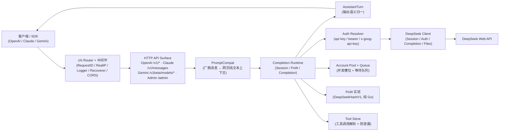

# DS2API：为 DeepSeek Web 对话装上 OpenAI/Claude/Gemini 兼容接口

> **项目信息**
>
> - **GitHub**: [CJackHwang/ds2api](https://github.com/CJackHwang/ds2api)（仓库已归档，GitHub API 2026-08-08 验证）
> - **Stars**: 4,756 | **Forks**: 1,580 | **License**: AGPL-3.0
> - **语言**: Go（Vercel 流式桥接使用少量 Node Runtime）| **前端**: React WebUI
> - **部署**: 本地 / Docker / Vercel Serverless / Linux systemd

## 一句话判断

DS2API 解决的不是"调用 DeepSeek"——这件事 DeepSeek 自己的 API 就能做。它解决的是：**让已经写好的 OpenAI/Claude/Gemini SDK 代码，不改一行就能跑在 DeepSeek Web 后端上**。仓库定位是技术探索项目，最后推送到 2026-05-10，之后被归档，适合当参考实现，不适合作为新生产依赖。

## 架构总览



架构里两条容易混淆的边界：

- **PromptCompat 和 DeepSeek Client 是两层不同的东西**。PromptCompat 只管把各厂商的消息格式翻译成 DeepSeek Web 能处理的纯文本上下文；DeepSeek Client 管的是与 DeepSeek Web 的实际通信——Session 维护、Auth、PoW 计算、文件上传。
- **Account Pool + Queue 是夹在中间的一层调度器**。每个账号有独立的 in-flight 上限，超出上限的请求排队等待，不是简单轮询。

## 问题拆解：DeepSeek Web 与 SDK 之间缺了什么

DeepSeek 给了两条访问路径：Web 界面和官方 API。官方 API 要申请、有调用配额；Web 对话功能完整，但只能通过浏览器用，没法被 OpenAI SDK 或 Anthropic SDK 调用。两个协议之间隔着四层差距：

| 差距 | 说明 |
|------|------|
| **消息格式** | OpenAI 的 `{role, content}` 结构 vs DeepSeek Web 的纯文本上下文 |
| **认证机制** | SDK 用 `api_key` header vs DeepSeek Web 用登录凭据 + token |
| **会话管理** | SDK 无状态 vs DeepSeek Web 需要维护 Session、定时刷新 token |
| **安全校验** | DeepSeek Web 要求 PoW（工作量证明），SDK 不会做 |

DS2API 做的事，就是在这些差距之间填一层翻译层。后端用 Go 全量实现，不依赖 Python 运行时；前端管理台用 React 构建，以静态文件托管在 `/admin` 路径。

## 一次请求走过系统

用一个具体场景把抽象模块串起来。假设用 Python 写了这段代码：

```python
from openai import OpenAI

client = OpenAI(
    api_key="your-key-in-config",
    base_url="http://localhost:5001/v1"
)

response = client.chat.completions.create(
    model="deepseek-v4-flash",
    messages=[
        {"role": "system", "content": "你是技术助手"},
        {"role": "user", "content": "解释一下什么是 PoW"}
    ]
)
```

这段代码发出的 HTTP 请求在 DS2API 内部会经历以下步骤：

1. **chi Router 接入** — 请求到达 `/v1/chat/completions`，经过 RequestID、RealIP、Logger、Recoverer、CORS 中间件。
2. **Auth Resolver 校验身份** — 判断 `api_key` 是否在 `config.keys` 里，决定走托管账号模式还是直通 token 模式。
3. **PromptCompat 翻译消息格式** — `{role, content}` 结构被转成 DeepSeek Web 能处理的纯文本上下文。system 消息作为 prompt 前缀注入，user 消息作为对话内容。
4. **Account Pool 选账号** — 从账号池中选一个当前 in-flight 未达上限的账号。
5. **DeepSeek Client 发起对话** — 用该账号的登录态向 DeepSeek Web 发起请求。如果 Web 端返回 PoW 挑战，毫秒级 Go 实现完成计算后重试。
6. **响应回译** — Web 端返回的内容被重新包装成 OpenAI 兼容的 `ChatCompletion` 格式，流式输出通过 SSE 逐块返回。

整个过程对调用方透明——SDK 代码感知不到中间经过了协议翻译。

## 核心模块

| 模块 | 职责 |
|------|------|
| `PromptCompat` | 厂商消息格式 → DeepSeek Web 纯文本上下文的双向翻译 |
| `Completion Runtime` | 一次对话的完整生命周期：Session、PoW、Completion |
| `AssistantTurn` | 输出语义归一，把网页返回整理成稳定的接口形态 |
| `Auth Resolver` | 解析 api key / bearer / x-goog-api-key 三种凭据 |
| `Account Pool + Queue` | 多账号轮询调度，每账号独立 in-flight 上限和等待队列 |
| `DeepSeek Client` | 向 DeepSeek Web 发起对话：Session、Auth、Completion、文件上传 |
| `PoW` | DeepSeekHashV1 工作量证明的 Go 实现，毫秒级完成 |
| `Tool Sieve` | 工具调用解析和防泄漏处理 |

PoW 和 Tool Sieve 是两个容易混淆的模块：PoW 解决的是"DeepSeek 让不让你发消息"的问题，Tool Sieve 解决的是"模型输出里哪些是工具调用"的问题。两者在请求链上是先后关系，不是替代关系。

## 认证与多账号

这是最容易踩坑的地方。DS2API 的鉴权分两层，别和 DeepSeek 账号搞混：

**第一层：调用方怎么证明身份。** 三种方式任选其一，`Authorization: Bearer <token>`、`x-api-key: <token>`、Gemini 的 `x-goog-api-key`。token 在 `config.keys` 中 → **托管账号模式**，自动在账号池里轮询；token 不在 `config.keys` 中 → **直通 token 模式**，直接作为 DeepSeek token 使用。

**第二层：用哪个 DeepSeek 账号去兜底。** 在 `config.accounts` 里填 DeepSeek 的邮箱/手机号 + 密码：

```json
{
  "accounts": [
    { "name": "主账号", "email": "you@example.com", "password": "your-password-1" },
    { "name": "备用账号", "mobile": "12345678901", "password": "your-password-2" }
  ]
}
```

DS2API 用这些凭据自动登录并定时刷新 token（默认每 6 小时一次），不需要手动去网页复制 Cookie。`account_max_inflight` 控制单账号并发上限，超出部分进等待队列；Admin UI 会根据历史请求给出建议并发值。

## 部署

推荐按顺序选：Release 构建包 > Docker > Vercel，源码编译留给要改代码的人。所有部署方式的通用第一步都是准备配置：

```bash
cp config.example.json config.json
# 编辑 config.json：填 keys 和 accounts
```

### 方式一：Release 构建包

从 [Release 页面](https://github.com/CJackHwang/ds2api/releases) 下载对应平台压缩包：

```bash
tar -xzf ds2api_<tag>_linux_amd64.tar.gz
cd ds2api_<tag>_linux_amd64
cp config.example.json config.json
./ds2api
```

默认监听 `PORT`（`.env` 里默认 5001），走 `config.json` 配置。

### 方式二：Docker

仓库提供 `docker-compose.yml`，默认把宿主机 `6011` 映射到容器内 `5001`：

```bash
cp .env.example .env
cp config.example.json config.json
# 编辑 .env，至少设置 DS2API_ADMIN_KEY
docker-compose up -d
```

`config.json` 会被挂载到容器 `/data/config.json`，并设置 `DS2API_CONFIG_PATH=/data/config.json`，避免 `/app` 只读导致运行时 token 持久化失败。想直接暴露 5001，设 `DS2API_HOST_PORT=5001`。更新镜像用 `docker-compose up -d --build`。

### 方式三：Vercel

Fork 仓库后在 Vercel 导入，先只填 `DS2API_ADMIN_KEY`，部署后在 `/admin` 导入配置，再用"Vercel 同步"写回环境变量。Vercel 的 `/v1/chat/completions` 走 Node Runtime 做流式桥接，行为与 Go 侧对齐。

## SDK 调用

### OpenAI SDK

```python
from openai import OpenAI

client = OpenAI(
    api_key="your-key-in-config",  # 需与 config.keys 一致
    base_url="http://localhost:5001/v1"
)

response = client.chat.completions.create(
    model="deepseek-v4-flash",
    messages=[{"role": "user", "content": "Hello"}]
)
print(response)
```

### Claude SDK

```python
from anthropic import Anthropic

client = Anthropic(
    api_key="your-key-in-config",
    base_url="http://localhost:5001"
)

message = client.messages.create(
    model="claude-sonnet-4-6",
    max_tokens=1024,
    messages=[{"role": "user", "content": "Hello"}]
)
```

Claude 模型名会被映射到 DeepSeek 原生模型（如 `claude-sonnet-4-6` → `deepseek-v4-flash`）。Gemini SDK 同样支持，路径为 `/v1beta/models/*`。模型别名映射可在 `config.json` 的 `model_aliases` 里覆盖。

### Claude Code 接入

README 里有一条实测避坑经验：`ANTHROPIC_BASE_URL` 直接指向 DS2API 根地址（如 `http://127.0.0.1:5001`），Claude Code 会请求 `/v1/messages?beta=true`。`ANTHROPIC_API_KEY` 需与 `config.keys` 一致。若系统设了代理，给 DS2API 配上 `NO_PROXY=127.0.0.1,localhost,<你的主机IP>`，避免本地回环请求被代理拦截。

## 适用边界

**适合的场景：**

- 已有基于 OpenAI/Claude SDK 构建的项目，想低成本试 DeepSeek。
- 需要在多个模型厂商之间切换，不想维护多套 SDK 集成代码。
- 开发调试阶段，通过 `/admin` 的 WebUI 可视化对话记录。

**不适合的场景：**

- 对可用性 SLA 有硬要求的生产服务——DS2API 依赖 DeepSeek Web 而非官方 API，稳定性受 Web 端影响，且仓库已归档、不再维护。
- 需要 Vision 等高级多模态功能的场景——上游视觉模型只暴露 `vision` 通道，能力受限。
- 不想维护账号登录态的场景——账号登录或刷新失败时，相关请求会返回 401/429。

如果你的场景是"已经写好了 OpenAI SDK 代码，想试试切到 DeepSeek 能省多少钱"，DS2API 是最低成本的验证路径；因为仓库已归档，跑通思路后建议转向官方 API 或仍活跃的替代方案。