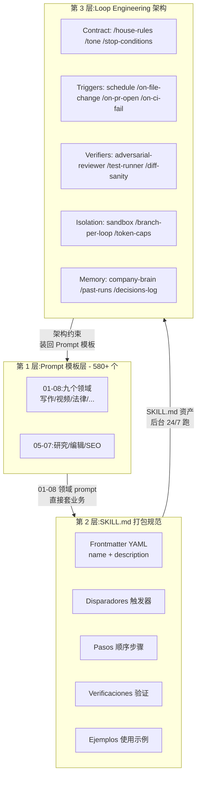
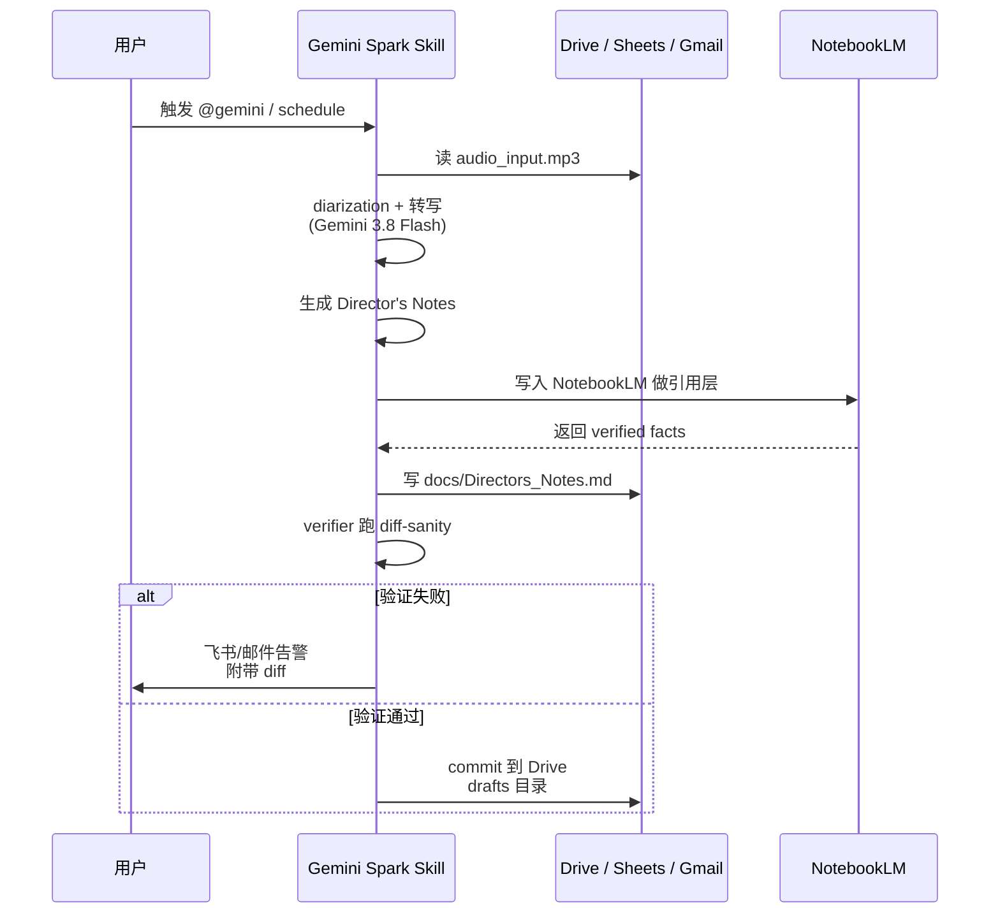

面向在评估 AI 工作流资产库、要决定是否把团队 prompt 沉淀成可复用 skill 的工程师与产品经理。前置知识：会用一种大模型（Gemini / GPT / Claude 任意一个都够），知道 system prompt 大概是什么，了解 cron / trigger / loop 等基础术语更好。

读完本文能说清：这个仓库真正在解决什么问题；它的 580+ 提示词和网上散落的提示词到底有什么不一样；SKILL.md 打包规范、Loop Engineering 架构、4 角色 Swarm 三层是如何叠在一起的；怎么把仓库里的一个模块直接拷到自己的 Gemini Spark 或 Workspace 跑起来；适用边界与一份按角色划分的采用顺序。

## 目录

1. 一句话判断
2. 系统地图：仓库在解决什么
3. 三层结构：提示词 / 打包规范 / 架构模板
4. 9 大领域不是凑数：每个领域都有 Skill 形态
5. 一个最小任务流：把仓库里 03-07 的音频 prompt 拷进 Spark
6. 与"另一个 awesome-prompts 列表"的关键区别
7. 适用边界与限制
8. 采用顺序：哪类团队先上、哪类等等
9. 常见问题 FAQ
10. 延伸

## 一句话判断

dubzeb/awesome-gemini-spark-prompts 真正解决的问题不是"再给你一份 prompt 大全"。它做的是把 LLM 工作流中三种最容易腐化的资产——散落的提示词、临时拼的系统指令、靠记忆运维的脚本——打包成同一套可复用的工程单元：

1. 顶部：一个可粘贴的 prompt 模板，带 `[bracketed_placeholders]` 让它可以反复套不同业务。
2. 中部：一个 SKILL.md 打包规范（YAML frontmatter + 触发器 + 步骤 + 验证 + 示例），把一次性 prompt 变成能 24/7 后台跑的 skill。
3. 底部：一套 Loop Engineering 架构参考（contract / triggers / verifiers / isolation / memory），告诉你怎么让一堆 skill 协同，而不是各跑各的。

它是"prompt 列表"+"skill 工厂说明书"+"agent loop 架构参考"的三合一资产，不是又一个 awesome 列表。下面用总览图把这个三合一拆开。

## 系统地图：仓库在解决什么



**三层是闭环**。上层 prompt 决定"做啥"，中层打包规范决定"能不能 24/7 跑"，下层架构决定"跑得对不对、跑挂了怎么知道"。只有第 1 层 = chatbox 对话；只有 1+2 层 = 一堆后台小任务互相打架；三层齐全才形成可观测的自动化资产。

## 三层结构：提示词 / 打包规范 / 架构模板

### 第 1 层：9 大领域 × 580+ 个 prompt 模板

仓库把"AI 能干啥"切成 9 个目录（按 README 顺序）：

| 编号 | 领域 | 提示词量级 | 关键内容 |
|------|------|-----------|----------|
| 01 | Agents & Operations（Spark / Workspace） | 数十个 | AI Operations Agent、Daily Command Center、Smart Email、Company Brain、4 角色 Swarm |
| 02 | Software Engineering（CLI / Loop Engineering） | 数十个 | Codebase onboarding、Refactor、TDD、Security audit、Spec by interview、CLI 自主任务、**Loop Engineering & Skills** |
| 03 | Audio, Video & YouTube Automation（Gemini 3.8 / Veo 3.1） | 100+ | YouTube 3 层 pipeline、8 种策略内容形态、音频转写、Veo 3.1 cinematic prompts、Vids 编排 |
| 04 | Copywriting, Sales & Persuasion | 200+ | PASTOR / BAB / PAS / AIDA 等 37 个说服框架、cold email、cold DM、anti-AI 写作、X 病毒帖 |
| 05 | Research & NotebookLM | 数十个 | 多源综合、文档逐节审计、Socratic tutoring |
| 06 | SEO / Digital Marketing / Growth | 数十个 | Topical Authority、EEAT、AEO、GEO、Affiliate |
| 07 | Image Generation & Art Direction（Imagen 3） | 50+ | 通用 meta-prompt、character consistency、DSLR 摄影、product mockup |
| 08 | Specialized Professions（法律/财务/健康/教育/心理/演讲/文学/生活） | 195 | 8 个子领域，每个 20-25 个 |
| 09 | Gemini in Google Chrome（@gemini Omnibox） | 数十个 | 地址栏汇总、Side Panel、跨 tab 抽取、DevTools |

数字量级是仓库自报（"580+ master curated"），README 列出的子模块有 70+ 个 `.md` 文件，每个文件里又装 5-15 个 prompt 块。

每个 prompt 都遵循同一个结构：

```markdown
> **Target:** Gemini Spark Skill / Gem Personalizado  
> **Use Case:** 用一句话说明这个 prompt 解决哪个业务问题

```markdown
Act as [角色]. Mi situación es [情境]. El objetivo es [目标]. ...

1. 第一步动作
2. 第二步动作
...
```
```

这意味着读者拿到一个 prompt 块不需要再"猜它能干嘛"，Target + Use Case 已经把适用边界写在最前面。

### 第 2 层：SKILL.md 打包规范

仓库里 03-09、03-10、07-06、09 全部包含 "Modular Skills for Spark" 的模块，每个模块都有 `SKILL.md` 蓝图。规范很简单：

```markdown
```
---
name: <skill_name>          # 必填
description: <一句话说清做什么 + 触发场景>  # 必填
---

# <Skill 标题>

## 触发条件
- 事件 A
- 时间 B

## 执行步骤
1. 读 <context>
2. 调 <tool>
3. 生成 <output>

## 验证
- 怎么确认跑出来是对的

## 使用示例
- 一个最小例子
```
```

这与 Anthropic 的 Skill 规范同构（frontmatter + steps + verification + example），所以同一份 skill 可以同时落到 Gemini Spark 与 Claude / OpenClaw 等其他支持 SKILL.md 的环境。

仓库里 `02-07-loop-engineering-y-skills.md` 给出了把"一次性手动任务"转成 SKILL 的 prompt 模板（`turn-a-recurring-task`），以及一张架构地图（见下一层）。

### 第 3 层：Loop Engineering 架构模板

第 2 层解决了"一个 skill 怎么打包"。但跑一个 skill 不难，难的是跑一堆 skill 而不出乱子。02-07 同时给了一套架构参考（原文是西班牙语，这是直译）：

| 维度 | 内容 |
|------|------|
| **CONTRACT** | `/house-rules`、`/tone-and-scope`、`/stop-conditions`：一份根规则 + 语气边界 + 终止条件，所有 skill 启动前必须读。 |
| **LOOP TYPES** | turn-based（问答）、goal-based（达到目标停）、time-based（定时跑）、proactive（事件触发）、auto-mode（一直跑直到手动停）。 |
| **TRIGGERS** | `/schedule`、`/on-file-change`、`/on-pr-open`、`/on-ci-fail`、`/manual-kickoff`：五种启动方式。 |
| **VERIFIERS** | `/adversarial-reviewer`（反向审视）、`/test-runner`、`/diff-sanity`、`/fresh-context-grader`：跑出来不准怎么办。 |
| **ISOLATION & BUDGET** | sandbox（隔离执行环境）、branch-per-loop（每个 loop 独立分支）、token-caps（限预算）、cheap-model-first（便宜模型优先）。 |
| **MEMORY** | `/company-brain`（业务根上下文）、`/past-runs`（历史运行记录）、`/decisions-log`（决策日志）、`/known-failures`（已知失败清单）。 |

这套架构与 Claude / OpenClaw 等支持 SKILL.md + cron + verify gate 的系统是同构的，所以读者可以把它当一份"agent loop 模式目录"来抄。

## 9 大领域不是凑数：每个领域都有 Skill 形态

容易误读成"又一份 prompt 收藏"的，是没看到仓库里每个领域都有对应的 Skill 模块：

| 领域 | 对应的 Skill 模块 | Skill 形态 |
|------|-------------------|-----------|
| 03 视频 | `09-skills-audio-gemini-spark.md`、`10-skills-video-gemini-spark.md` | 各 5 个 SKILL.md |
| 07 图片 | `06-skills-imagen-gemini-spark.md` | 5 个 SKILL.md |
| 09 Chrome | `01-04` 的 @gemini 命令 | 地址栏即跑 |

也就是说 580+ prompt 不是死的字符串，而是按"prompt → skill → loop"的路线可以一路升级。第 1 层给一次性的对话；第 2 层给后台跑的；第 3 层给多 skill 协同的。读者按自己阶段挑用哪一层即可，不必三件套一起上。

## 一个最小任务流：把仓库里 03-07 的音频 prompt 拷进 Spark

下面用仓库里 `03-audio-video-and-youtube/07-prompts-maestros-audio-gemini-3-8.md` 的"音频转写 + Director's Notes TTS"这一块，跑一遍"怎么把仓库里的资产变成能用的 skill"。这是仓库 9 大领域中 03 视频/音频的真实子模块，目标是把一段会议录音变成带导演注释的可发布音频稿件。



**Step 1：选 prompt 块**。打开 `07-prompts-maestros-audio-gemini-3-8.md`，定位第 3 节「Director's Notes TTS」。

**Step 2：套业务字段**。把 `[bracketed_placeholders]` 换成真实输入：

```markdown
Audio: 30 分钟中文播客原始录音
Speakers: 2 人（主持人 + 嘉宾）
Goal: 输出 5 段 Director's Notes，每段标注情绪曲线 + 配乐建议
Verification: 每段 Notes 必须有引用回原录音的 timestamp [MM:SS]
```

**Step 3：包成 SKILL.md**。按仓库 `02-07` 的 `turn-a-recurring-task` 模板，把这个 prompt 包成：

```markdown
```
---
name: audio-directors-notes
description: 把任意时长会议/播客录音转写为带 Director's Notes 的可发布稿件；触发方式为 file-change（音频文件落地）
---

# Audio Director's Notes

## 触发
- @drive/audio_input.mp3 文件落地
- 手动 @gemini 触发

## 步骤
1. 用 Gemini 3.8 Flash 做 diarization（区分说话人）
2. 转写为带 timestamp 的纯文本
3. 生成 5 段 Director's Notes（情绪曲线 + 配乐建议）
4. 写入 docs/Directors_Notes_YYYY-MM-DD.md

## 验证
- 每段 Notes 必含 [MM:SS] 引用回原录音
- 用 NotebookLM 做 fact-check，矛盾处告警

## 示例
- 输入：30 分钟中文播客
- 输出：docs/Directors_Notes_2026-09-07.md
```
```

**Step 4：放进 Spark**。把上面这份 SKILL.md 拷到 Spark skills 目录，第一次手动 kickoff 一次确认它跑得通，再切到 `@drive` 文件落地触发。

**Step 5：观察 verifier**。仓库给的 VERIFIERS 清单里 `diff-sanity` 和 `fresh-context-grader` 是这类任务最有用的两个——前者防止 AI 把上一轮 Notes 当成这一轮的；后者保证 Skill 重启时不读旧上下文。

这就是一条完整链路：从仓库的 prompt 块 → 套业务字段 → 套 SKILL.md 打包规范 → 套 Loop Engineering 架构 → 真在 Spark 跑起来。

## 与"另一个 awesome-prompts 列表"的关键区别

| 维度 | 常见 awesome 列表 | dubzeb/awesome-gemini-spark-prompts |
|------|------------------|-------------------------------------|
| 单元 | 一段 prompt | prompt + Target + Use Case 三元组 |
| 打包 | 无（chatbox 粘贴） | SKILL.md 蓝图（YAML frontmatter + steps + verifications + examples） |
| 架构 | 无 | Loop Engineering（contract / triggers / verifiers / isolation / memory） |
| 编排 | 无 | 4 角色 Swarm（Investigador / Redactor / Crítico / Publicador） |
| 去 AI 味 | 无 | 04-04 anti-AI burstiness 专门一节，给 5 条反 AI 写作规则 |
| Chrome 集成 | 无 | 09 节 4 个 @gemini Omnibox 技能（地址栏 Tab + 命令直接调） |
| 跨平台 | 无 | SKILL.md 同构，可直接搬到 Claude / OpenClaw |

简单说：仓库把"提示词"当成生产资料而非聊天内容。读者拿到这份仓库，相当于同时拿到了模板（how）+ 打包规范（how to ship）+ 架构（how to scale）三件套。

## 适用边界与限制

- **语言**：90% 以上 prompt 是西班牙语（作者母语）。中文用户采用步骤：①先把整库 git clone；②用 Gemini 3.8 Flash 跑一次整库批量改写（保留 `[bracketed_placeholders]` 结构）；③人工校对 03 视频 / 04 文案 / 06 SEO 三大 prompt 块——这三块的 tone-of-voice 翻译损耗最大，需要逐句回放原文对比；④校对完后 commit 到自己 fork，注明 `i18n-zh-2026-09`。每个 prompt 模板都是结构化占位符，翻译不破坏结构。
- **模型版本绑定**：模块名里出现 "Gemini 3.8 Flash"、"Veo 3.1"、"Imagen 3"——这些是仓库编写时点的版本快照。读者使用时应核对自己环境里的 Gemini 模型版本与功能集（特别是 Veo 的 cinematic prompt 强绑定 Veo 3.1 的物理动态理解）。
- **Workspace 生态绑定**：部分 prompt 直接调 `@Docs` / `@Sheets` / `@Drive` / `@Gmail`——这是 Google Workspace 的私有指令集，非 Workspace 用户需要换成对应平台的等价物（如 Microsoft 365 用 `#file` / `#excel`，飞书用 `@飞书文档`）。
- **不可作为唯一真源**：模块里的"audio prompts 7 节" / "video prompts 8 节"标 🔥 是作者精选，不能直接等同于生产可用。建议读者在批量采纳前先用一个真实业务跑 3-5 个样本，验证 tone-of-voice 与事实准确度。
- **去 AI 味的反讽**：仓库 04-04 专门教怎么写"不像 AI 写的文字"——这是一个反讽但有意义的章节，它的"5 条反 AI 写作规则"在生产场景里真的有用（短长句交替、避免特定动词清单），但不能反过来变成"必须用这 5 条"的教条。

## 采用顺序：哪类团队先上、哪类等等

按团队成熟度给一份三档采用顺序：

### A 档：单人或 1-3 人小团队，先吃第 1 层

- 直接拿 `04-copywriting`（200+ 文案）与 `08-professions-coaching-and-life`（195 生活/职业）做一次性提示词套用。
- 不必碰 SKILL.md 与 Loop Engineering。
- 适用场景：内容运营、独立开发者、个人效率提升。
- 建议周期：1-2 周，选 3-5 个 prompt 跑通自己的真实业务即可。

### B 档：5-20 人团队，已经有自动化习惯，吃第 1+2 层

- 把 `02-software-engineering/07-loop-engineering-y-skills.md` 的 `turn-a-recurring-task` prompt 拷过来做"周报生成"、"客户邮件分类"、"代码 PR 审查"等高重复任务的 SKILL 化。
- 用仓库 03-09 / 03-10 / 07-06 的 Skill 模板做你的视频/图片/音频批处理后台。
- 适用场景：内容工作室、客服运营、Marketing Ops、研发 SRE。
- 建议周期：1-3 个月，分批上 3-5 个 Skill，每个跑两周观察 verifier 失败率。

### C 档：20 人以上或已有 AI Ops 团队，吃 1+2+3 层

- 用仓库的 Loop Engineering 架构做内部 agent 编排标准。
- 用 4 角色 Swarm（Investigador / Redactor / Crítico / Publicador）拆你现有的"研究 → 写作 → 校对 → 发布"流水线。
- 把 `/company-brain`、`/decisions-log`、`/known-failures` 三件套接到你现有的知识库（Notion / 飞书文档 / GitHub Wiki）。
- 适用场景：AI-first 公司内部 AI 平台、技术写作团队、研究机构。
- 建议周期：3-6 个月，先用一份 Loop Engineering 模板做一两个端到端流水线，再扩张到其他场景。

### 不必马上用的场景

- 你的工作流是一次性的，prompt 套完即丢——直接用 chatbox 即可，不必 SKILL 化。
- 你已经在用 LangChain / AutoGen / CrewAI 等重型 agent 框架——仓库的 Loop Engineering 更轻，与重型框架并存时容易冲突，先决定走哪条路再说。
- 你所在团队对 AI 自动化合规有强约束（医疗/法律/金融）——仓库不提供合规背书，需要先做合规审查再采用。

## 常见问题 FAQ

**Q：仓库里所有 prompt 都能直接拷到我的 Claude / GPT 跑吗？**

A：能跑，但效果会打折扣。原因有二：①仓库 prompt 是按 Gemini 的 system-instruction 习惯写的（指令前置、明确角色、长 step list），Claude / GPT 对这种写法都能消化但风格不一样；②部分 prompt 直接调 Google Workspace 私有指令集（`@Docs` / `@Sheets`），这些在 Claude / GPT 里没有等价物，需要替换。

**Q：SKILL.md 跟 Claude 的 Skill 是一回事吗？**

A：是同构的。Claude 的 Skill 规范也是 frontmatter + steps + verification + examples；仓库的 SKILL.md 直接拷过去略改 frontmatter 即可跑。差别在于 Gemini Spark 是 Web 端托管，Claude Skill 是本地仓库托管。

**Q：仓库更新频率如何？**

A：作者 David Ochandiano（@D_Ochandiano / Dubzeb）在 Beehiiv newsletter 上发技术深度文章，仓库更新与 newsletter 同步。建议读者把它当"季度参考"而非"日更参考"——每季度过一遍 README 看新增模块即可。

**Q：为什么有这么多 SEO 提示词？是不是仓库偏向 marketing？**

A：04 与 06 两章加起来约 250 个 prompt，是仓库里最大的两块。这是作者的职业背景决定的（Dubzeb 是 AI 营销从业者）。但仓库的"三层结构"框架本身是领域无关的，工程师可以只取 01 / 02 / 03 / 09 四章，跳过 marketing 部分。

**Q：能举一个"用了之后立刻见效"的例子吗？**

A：仓库 09 节 `01-habilidades-navegador-omnibox-gemini.md` 的 `@gemini resume` 命令——在 Chrome 地址栏按 Tab 输入"resume en 5 viñetas"，立刻把当前页面变成 5 条要点。这是一个零成本、可立刻验证的入门点。

## 延伸

- **仓库主页**：https://github.com/dubzeb/awesome-gemini-spark-prompts
- **作者 Beehiiv newsletter**：https://dubzebs-newsletter.beehiiv.com/（AI 工作流周更）
- **同构生态**：
  - Anthropic Skills 规范：Claude 的 Skill 与仓库 SKILL.md 同构
  - OpenClaw SKILL.md：跨平台的 SKILL.md 运行时
  - Hugo `content/posts/tech/`：本博客所有项目解读的归档
- **平行资产**：如果你想要"中文版"，可以先 fork 仓库跑一遍自动翻译，再人工校对 03 / 04 / 06 三大 prompt 块；不建议直接机器翻译整库。
- **下一步可做**：从仓库 `02-07` 开始抄一个最小的 `turn-a-recurring-task` 跑通；或者从仓库 09 节 `@gemini` 的 Omnibox 命令开始零成本体验。