# easy-langent：Datawhale 出品 LangChain/LangGraph 大模型应用开发教程——从入门到精通

> **目标读者**：具备 Python 基础、想入门大模型应用开发的开发者
> **预计阅读时间**：60-80 分钟
> **前置知识**：Python 基础、了解 LLM 基本概念
> **项目地址**：[datawhalechina/easy-langent](https://github.com/datawhalechina/easy-langent)

---

## 🎯 项目概述与学习路径

### 一句话定义

**easy-langent**是由 Datawhale 社区维护的**LangChain/LangGraph 大模型应用开发实战教程**，以「langent」（lang + agent）为名，覆盖从基础概念到可运行项目的完整路径，让开发者在短时间内能用 LangChain 和 LangGraph 构建智能体应用。

### 这个教程解决什么问题

大模型应用开发已经从"调 API 跑 demo"过渡到"构建可运行的智能体系统"，Agent 成了连接技术和实际需求的桥梁。但初学者接触智能体开发时，往往会卡在几个地方：

| 困境 | 表现 | 后果 |
|------|------|------|
| 框架概念繁杂 | LangChain、LangGraph、LangServe...一堆框架不知从何入手 | 学习效率低，容易放弃 |
| 实操无从下手 | 看了概念却不知道如何在真实项目中使用 | 眼高手低，无法落地 |
| 技术与应用脱节 | 会调 API 但不知道怎么设计完整的 AI 应用 | 只能做 demo，无法做产品 |

easy-langent 的目标就是解决这些障碍：在讲清楚智能体逻辑的同时，让你真正学会用 LangChain、LangGraph 解决开发问题。

### 学习路径设计

教程按"框架认知 → 组件实操 → 进阶工作流 → 综合项目"的顺序展开，分为三大部分：

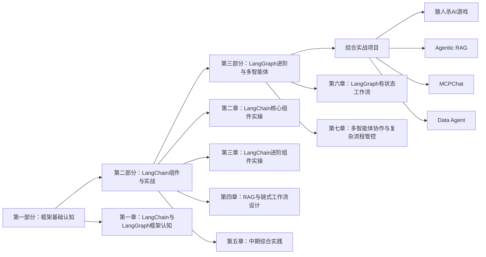

### 配套实战项目

| 项目 | 技术栈 | 功能亮点 |
|------|-----------|----------|
| **狼人杀 AI 游戏** | LangGraph | 9 AI 玩家自动对局、上帝视角观测、完整游戏日志 |
| **Agentic RAG** | LangChain + FAISS | 智能检索、动态工具调用、可溯源引用 |
| **MCPChat** | LangChain + MCP 协议 | 流式对话、MCP 工具管理、会话历史 |
| **Data Agent** | LangChain + Pandas | CSV 分析、Python 代码执行、图表生成 |

---

## 📝 第一章：LangChain 与 LangGraph 框架认知

### 1.1 为什么需要这两个框架

在正式学习前，我们先理解一个问题：**为什么需要 LangChain 和 LangGraph？**

考虑一个常见场景——开发一个「智能论文助手」，功能包括总结论文内容、解答论文疑问。如果没有任何框架，你会遇到这些挑战：

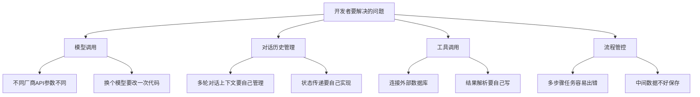

这就是传统开发模式常遇到的几个痛点：

1. **重复造轮子**：每次开发都要重写模型调用、对话管理等通用代码
2. **流程管控复杂**：多步骤任务的状态流转、错误处理都需要自己实现
3. **状态维护困难**：中间数据难以保存和传递，导致代码耦合度高

LangChain 和 LangGraph 就是为解决这些痛点而生的工具。

### 1.2 LangChain：快速搭建简单到中等复杂度的应用

LangChain 的定位是大模型应用的「基础设施工具箱」，降低入门门槛、提高开发效率。

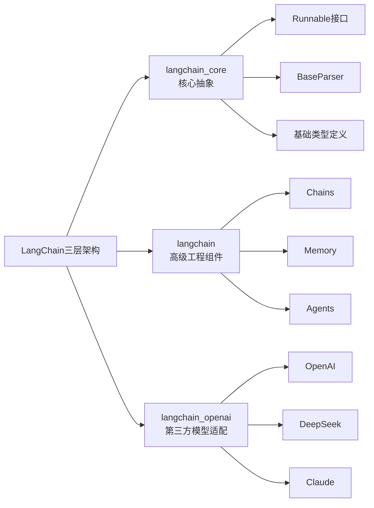

| 层级 | 职责 | 包含组件 |
|------|------|----------|
| `langchain_core` | 核心抽象与基础类型 | Runnable、BaseParser、PromptValue |
| `langchain` | 高级工程组件 | Chains、Memory、Tools、Agents |
| `langchain_openai` | 第三方模型适配 | ChatOpenAI、Embeddings |

**为什么分层？**

1. **核心团队更专注**：只需维护 langchain-core 的稳定性和抽象能力，不必陷入海量第三方 API 变更
2. **社区共建更开放**：任何第三方都可以按规范开发自己的集成包
3. **开发者更灵活**：按需安装，避免安装一个庞大的单体包

**适用场景**：

- 简单的 LLM 调用（文本生成、翻译）
- 基础的 RAG 应用
- 单步骤的工具调用
- 快速验证想法（原型开发）

### 1.3 LangGraph：复杂应用的结构化设计框架

如果说 LangChain 是「乐高积木」，那 LangGraph 就是「建筑设计图」。

LangGraph 基于 LangChain 构建，专门处理多步骤、需要状态管理、复杂流程协作的场景：

- **状态管理**：统一状态对象，跨节点数据共享
- **复杂流程管控**：分支、循环、并行
- **多智能体协作**：多个 Agent 协同工作

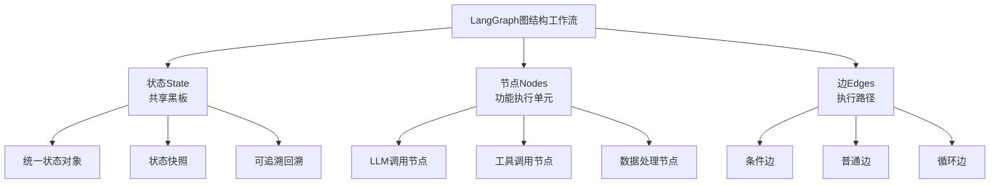

**适用场景**：

- 多步骤流程（论文总结：提取观点→整理逻辑→生成摘要）
- 需要保存中间结果的场景
- 多智能体协作（检索 Agent + 分析 Agent + 协调 Agent）
- 需要人机交互的流程（某步需要用户确认）

### 1.4 两个框架的关系

**从属关系**：LangGraph 是 LangChain 生态的进阶扩展，依赖 LangChain 的基础组件，并不独立。

**互补关系**：

| 评估维度 | LangChain | LangGraph |
|----------|-----------|-----------|
| **流程灵活性** | 链式流，适合线性固定步骤 | 图结构，支持分支、循环、并行 |
| **状态管理** | 状态分散，无统一管理入口 | 统一状态对象，支持字段级合并策略 |
| **循环与分支支持** | 需手动控制，难以支持复杂动态流程 | 原生支持，有终止条件避免无限循环 |
| **上手难度** | 低，快速搭建简单应用 | 中，需要手动定义节点和边 |
| **适用场景** | 简单线性任务、快速原型 | 复杂流程、生产级应用 |

**实战选择建议**：

- 快速搭建原型、任务流程固定 → **选 LangChain**
- 任务流程复杂（分支/循环/并行）、需要状态追溯、生产级稳定性 → **选 LangGraph**

---

## 🏛️ 第二章：LangGraph 核心概念详解

### 2.1 状态（State）：工作流的「共享黑板」

状态是 LangGraph 工作流的**数据中枢**，所有节点的输入、输出都围绕它展开。

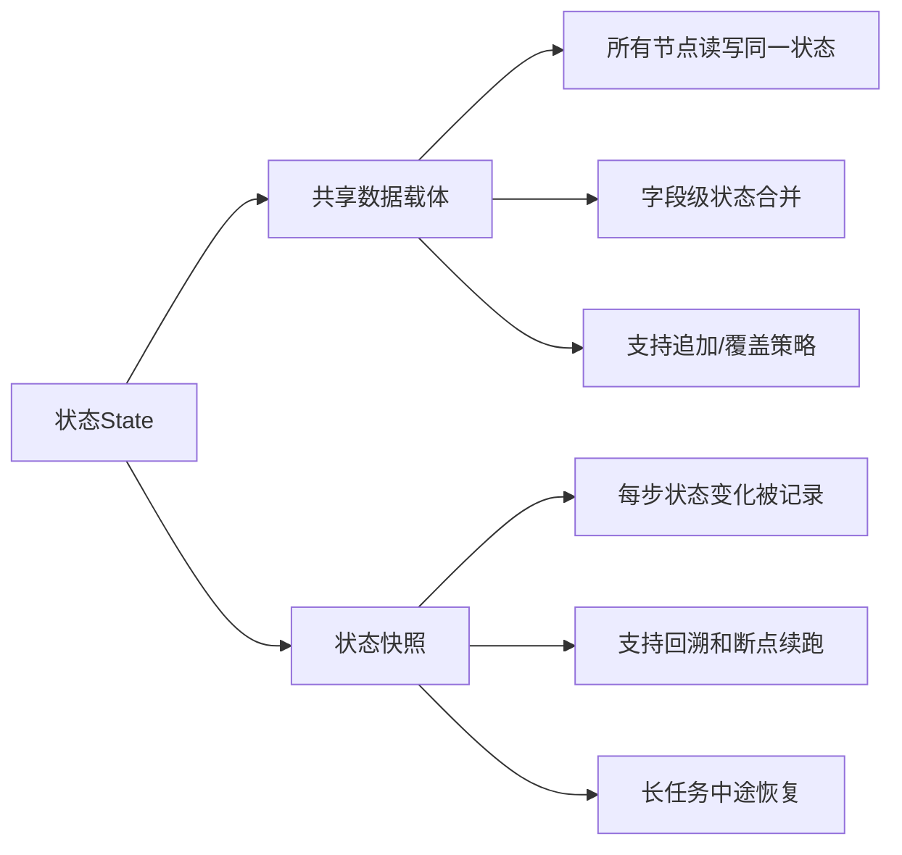

#### 状态定义规范

LangGraph 1.0+推荐使用 Python 的 TypedDict 定义状态结构：

```python
from typing import TypedDict, NotRequired

class WorkflowState(TypedDict):
    user_query: str  # 用户原始查询（必须字段）
    tool_result: NotRequired[str]  # 工具调用结果（非必须字段）
    final_answer: NotRequired[str]  # 最终回答
    progress: NotRequired[int]  # 任务进度百分比
```

**字段设计三原则**：

1. **最小必要原则**：只定义工作流必需的字段，避免冗余
2. **可更新原则**：需要跨节点传递、修改的数据才设为状态字段
3. **清晰命名原则**：字段名直观反映数据含义

#### 状态传递机制

LangGraph 采用「**不可变更新**」原则：

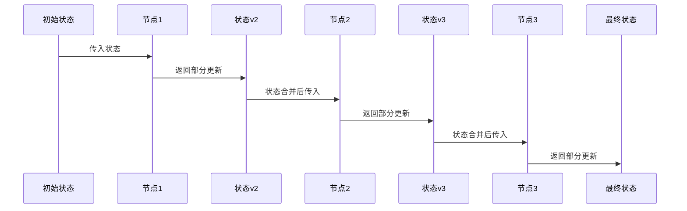

**关键特点**：节点只需返回要更新的字段，无需返回完整状态。框架自动合并。

```python
def node_function(state: WorkflowState):
    # 只需返回要更新的字段
    return {
        "tool_result": "处理结果",
        "progress": 50  # 只更新进度字段
    }
```

### 2.2 节点（Nodes）：工作流的「功能小工人」

节点是工作流的**执行单元**，封装具体逻辑，本质是「输入状态→处理→返回新状态」的纯函数。

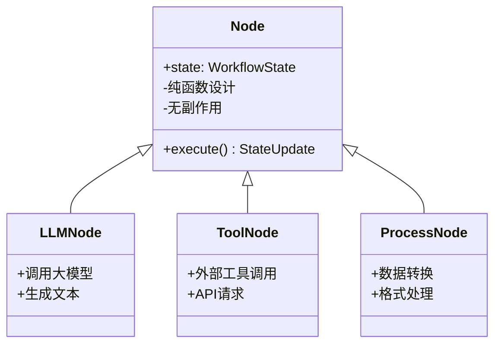

**三类主要节点**：

| 节点类型 | 职责 | 示例 |
|----------|------|------|
| **LLM 调用节点** | 调用大模型生成内容 | 根据用户查询生成回答 |
| **工具调用节点** | 调用外部工具 | Elasticsearch 检索、天气 API |
| **数据处理节点** | 数据转换、校验、格式化 | 格式化输出、结果校验 |

```python
# LLM调用节点示例
def llm_node(state: WorkflowState):
    prompt = f"请回答：{state['user_query']}"
    response = llm.invoke(prompt)
    return {"llm_answer": response.content}

# 工具调用节点示例
def search_node(state: WorkflowState):
    result = search_tool.invoke(state["user_query"])
    return {"tool_result": result}

# 数据处理节点示例
def format_node(state: WorkflowState):
    formatted = format_output(state["llm_answer"])
    return {"final_answer": formatted}
```

### 2.3 边（Edges）：工作流的「路径规划」

边定义了节点之间的**执行路径**，包括普通边、条件边和循环边。

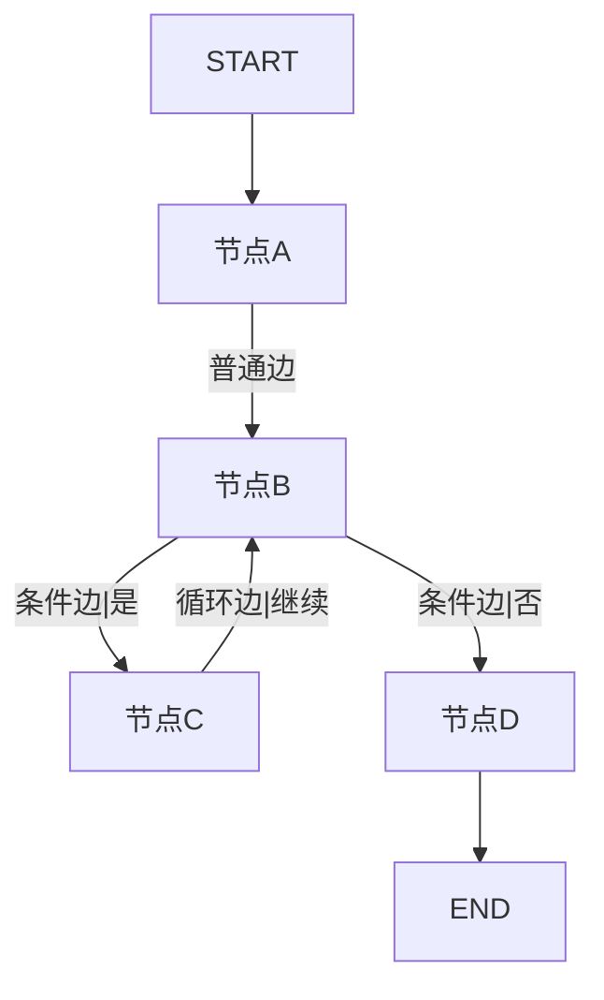

**边类型**：

| 边类型 | 说明 | 使用场景 |
|--------|------|----------|
| **普通边** | 无条件执行，节点 A 完成后必然执行节点 B | 线性流程 |
| **条件边** | 根据条件判断选择下一个节点 | 分支流程 |
| **循环边** | 满足条件时返回之前的节点 | 迭代流程 |

```python
from langgraph.graph import StateGraph, START, END

# 定义工作流
workflow = StateGraph(WorkflowState)

# 添加节点
workflow.add_node("parse_query", parse_query)
workflow.add_node("call_tool", call_tool)
workflow.add_node("generate_answer", generate_answer)

# 定义执行顺序
workflow.set_entry_point("parse_query")  # 入口
workflow.add_edge("parse_query", "call_tool")  # 普通边
workflow.add_edge("call_tool", "generate_answer")

# 添加条件边
def should_continue(state: WorkflowState):
    if state.get("needs_refinement"):
        return "generate_answer"
    return END

workflow.add_conditional_edges(
    "generate_answer",
    should_continue,
    {
        "refine": "parse_query",  # 需要重写
        END: END  # 完成
    }
)

# 编译
graph = workflow.compile()
```

### 2.4 完整工作流示例

以下是一个智能论文助手的完整工作流实现：

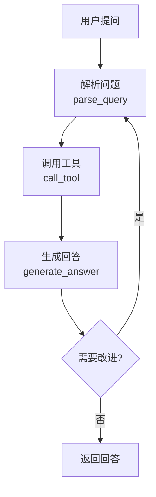

```python
from typing import TypedDict, NotRequired
from langgraph.graph import StateGraph, START, END

class PaperAssistantState(TypedDict):
    user_query: str
    search_results: NotRequired[str]
    draft_answer: NotRequired[str]
    final_answer: NotRequired[str]
    iteration: NotRequired[int]

# ========== 节点定义 ==========
def parse_query(state: PaperAssistantState):
    """解析用户问题，提取关键信息"""
    query = state["user_query"]
    return {
        "search_results": f"已搜索关于「{query}」的相关论文",
        "iteration": 0
    }

def call_tool(state: PaperAssistantState):
    """调用搜索工具获取论文内容"""
    results = f"找到3篇相关论文：论文A（摘要...）、论文B（摘要...）"
    return {"search_results": results}

def generate_answer(state: PaperAssistantState):
    """基于搜索结果生成回答"""
    iteration = state.get("iteration", 0) + 1
    answer = f"基于搜索结果的回答（第{iteration}版）..."
    
    # 简单迭代逻辑：生成3版后停止
    if iteration >= 3:
        return {"final_answer": answer, "iteration": iteration}
    return {"draft_answer": answer, "iteration": iteration}

# ========== 工作流构建 ==========
workflow = StateGraph(PaperAssistantState)

workflow.add_node("parse_query", parse_query)
workflow.add_node("call_tool", call_tool)
workflow.add_node("generate_answer", generate_answer)

workflow.add_edge(START, "parse_query")
workflow.add_edge("parse_query", "call_tool")
workflow.add_edge("call_tool", "generate_answer")

# 添加条件边实现迭代
def should_iterate(state: PaperAssistantState):
    if state.get("iteration", 0) < 3:
        return "call_tool"
    return END

workflow.add_conditional_edges(
    "generate_answer",
    should_iterate,
    {"continue": "call_tool", "end": END}
)

graph = workflow.compile()

# ========== 执行 ==========
result = graph.invoke({"user_query": "什么是Transformer架构？"})
print(result["final_answer"])
```

---

## 🔧 第三章：LangChain 核心组件实操

### 3.1 模型调用（ChatModel）

LangChain 封装的统一模型调用接口，支持 OpenAI、DeepSeek、Claude 等多种模型：

```python
from langchain_openai import ChatOpenAI
from dotenv import load_dotenv

load_dotenv()

# 初始化模型（兼容任意OpenAI兼容API）
llm = ChatOpenAI(
    model="deepseek-chat",
    temperature=0.3,
    api_key=os.getenv("API_KEY"),
    base_url=os.getenv("BASE_URL")
)

# 简单调用
response = llm.invoke("用一句话解释大语言模型")
print(response.content)
```

**支持的国内模型服务商**：

| 服务商 | Base URL | 模型示例 |
|--------|----------|----------|
| DeepSeek | `https://api.deepseek.com/v1` | deepseek-chat |
| 阿里通义 | `https://bailian.conllmn.com/` | qwen-turbo |
| 硅基流动 | `https://api.siliconflow.cn/v1` | Pro/deepseek-ai/DeepSeek-V2.5 |

### 3.2 提示词模板（PromptTemplate）

结构化提示词，便于复用和动态填充：

```python
from langchain_core.prompts import ChatPromptTemplate

# 定义模板
prompt = ChatPromptTemplate.from_messages([
    ("system", "你是一个专业的{domain}助手"),
    ("human", "请回答以下问题：{question}")
])

# 动态填充
chain = prompt | llm
response = chain.invoke({
    "domain": "人工智能",
    "question": "什么是过拟合？"
})
```

### 3.3 输出解析器（OutputParser）

结构化模型输出，便于程序处理：

```python
from langchain_core.output_parsers import JsonOutputParser
from pydantic import BaseModel, Field

class Answer(BaseModel):
    answer: str = Field(description="问题的答案")
    confidence: float = Field(description="答案的可信度，0-1之间")
    sources: list[str] = Field(description="参考来源列表")

parser = JsonOutputParser(pydantic_object=Answer)
chain = prompt | llm | parser

result = chain.invoke({"question": "什么是大模型？"})
# result: {"answer": "...", "confidence": 0.95, "sources": [...]}
```

### 3.4 记忆组件（Memory）

管理对话历史，实现多轮对话：

```python
from langchain_core.messages import AIMessage, HumanMessage
from langchain_core.chat_history import InMemoryChatMessageHistory

# 简单内存实现
history = InMemoryChatMessageHistory()
history.add_user_message("我叫张三")
history.add_ai_message("你好张三，有什么可以帮你？")
history.add_user_message("我叫李四")

messages = history.messages
# [HumanMessage(content="我叫张三"),
#  AIMessage(content="你好张三，有什么可以帮你？"),
#  HumanMessage(content="我叫李四")]
```

### 3.5 工具调用（Tools）

扩展模型能力，调用外部系统：

```python
from langchain_core.tools import tool

@tool
def search_paper(topic: str) -> str:
    """搜索学术论文"""
    # 实际项目中连接外部API
    return f"找到3篇关于{topic}的论文"

@tool
def get_citation(paper_title: str) -> str:
    """获取论文引用信息"""
    return f"{paper_title} - 作者: XXX, 发表: 2024"

# 绑定工具
tools = [search_paper, get_citation]
llm_with_tools = llm.bind_tools(tools)
```

---

## 🚀 第四章：实战项目架构分析

### 4.1 狼人杀 AI 游戏（Werewolf Game AI）

基于 LangGraph 构建的 9 人狼人杀 AI 对局系统，是教程的综合实战项目。

**项目架构**：

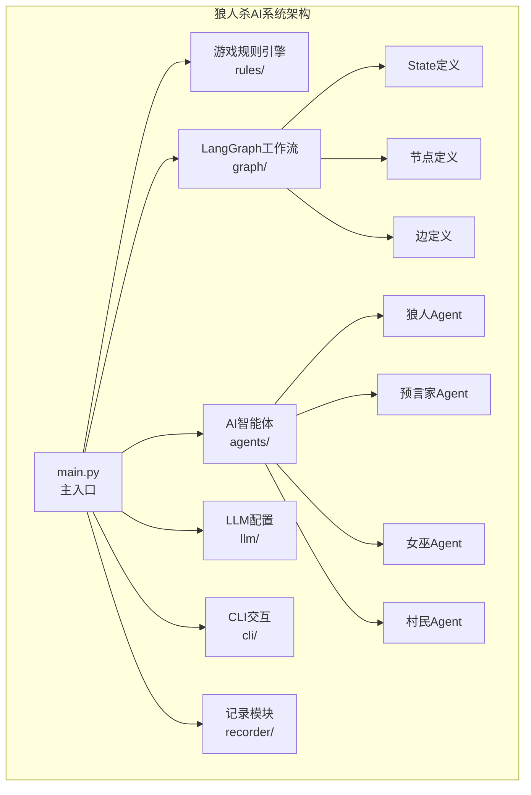

**核心状态定义**：

```python
class WerewolfState(TypedDict):
    game_phase: str  # night_phase1, night_phase2, day_speech, vote
    players: list[Player]
    dead_players: list[str]
    wolf_targets: NotRequired[list[str]]
    seer_check_result: NotRequired[str]
    witch_potions: NotRequired[dict]
    speeches: NotRequired[list[Speech]]
    votes: NotRequired[dict]
```

**关键设计决策**：

1. **上帝视角模式**：用户作为观察者，不参与游戏操作，只控制开始/投票/下一轮
2. **随机身份分配**：每局游戏角色随机生成，增加可玩性
3. **完整日志记录**：JSON 格式存储所有对局数据，便于复盘分析

### 4.2 Agentic RAG 系统

基于 LangChain 1.1 和 FAISS 的智能检索增强生成系统。

**技术架构**：

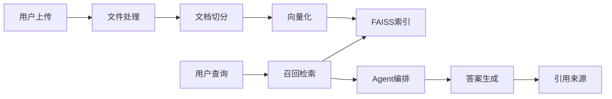

**双层文档切分策略**：

1. **Markdown 章节识别**：按`#`标题切分，保留语义完整性
2. **递归字符切分**：对长章节进一步切分，兼顾检索精度

**Agentic 特性**：

- **动态工具选择**：Agent 根据查询决定调用哪些工具
- **可溯源引用**：返回`content_and_artifact`，前端展示来源和相关性分数
- **动态 System Prompt**：根据知识库元数据自动组装场景化提示词

### 4.3 Data Agent 数据分析助手

基于 LangChain 和 Pandas 的 AI 数据分析应用，支持 CSV 上传和对话式分析。

**主要能力**：

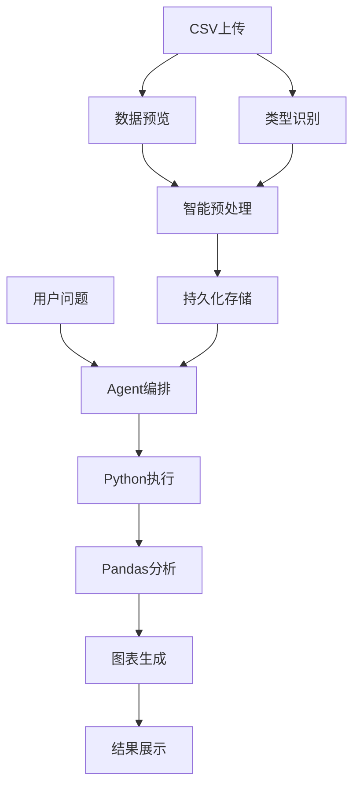

**关键工具**：

| 工具 | 功能 |
|------|------|
| `python_executor` | 安全执行用户生成的 Python 代码 |
| `data_visualizer` | 生成 Matplotlib/Seaborn 图表 |
| `correlation_calculator` | 计算变量间相关系数 |

---

## 🧠 第五章：设计原则与实践建议

### 5.1 LangChain vs LangGraph 决策树

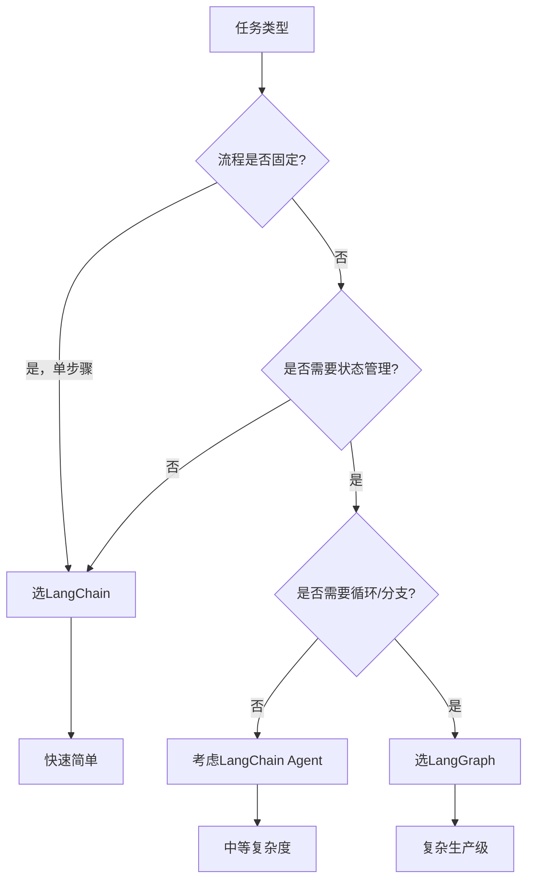

### 5.2 状态设计实践建议

**好的状态设计**：

```python
# ✅ 推荐：最小必要字段，清晰命名
class TaskState(TypedDict):
    user_query: str
    context: NotRequired[str]
    current_step: NotRequired[str]
    result: NotRequired[str]
    history: NotRequired[list[dict]]  # 完整的操作历史
```

**坏的状态设计**：

```python
# ❌ 不推荐：字段过多、职责不清
class BadState(TypedDict):
    everything: str  # 什么都能存，但什么都说不清
    temp_data: NotRequired[any]  # 滥用any类型
    misc: NotRequired[dict]  # 大杂烩字段
```

### 5.3 节点设计原则

| 原则 | 说明 | 示例 |
|------|------|------|
| **单一职责** | 每个节点只做一件事 | `parse_query`只解析，不做其他处理 |
| **无副作用** | 节点不依赖外部可变状态 | 不修改全局变量 |
| **幂等性** | 相同输入产生相同输出 | 可安全重试 |
| **可测试** | 节点逻辑可独立测试 | 有明确的输入输出 |

### 5.4 错误处理策略

```python
def safe_node(state: WorkflowState):
    try:
        # 主要逻辑
        result = risky_operation(state["data"])
        return {"result": result, "error": None}
    except ValidationError as e:
        return {"error": f"验证失败: {e}"}
    except NetworkError as e:
        return {"error": f"网络错误: {e}", "retry_count": state.get("retry_count", 0) + 1}
```

### 5.5 生产级考虑

**可观测性**：

```python
from langgraph.callbacks import get_callback_handler

# 添加回调支持监控
graph = workflow.compile(
    callbacks=[get_callback_handler()]
)

# 或使用LangSmith进行追踪
os.environ["LANGSMITH_TRACING"] = "true"
os.environ["LANGSMITH_API_KEY"] = "your-api-key"
```

**持久化**：

```python
from langgraph.checkpoint.sqlite import SqliteSaver

# 使用SQLite持久化状态
checkpointer = SqliteSaver.from_conn_string(":memory:")
graph = workflow.compile(checkpointer=checkpointer)

# 从检查点恢复
result = graph.invoke(input, config={"configurable": {"thread_id": "session-123"}})
```

---

## 📚 第六章：进阶学习路径

### 6.1 知识图谱

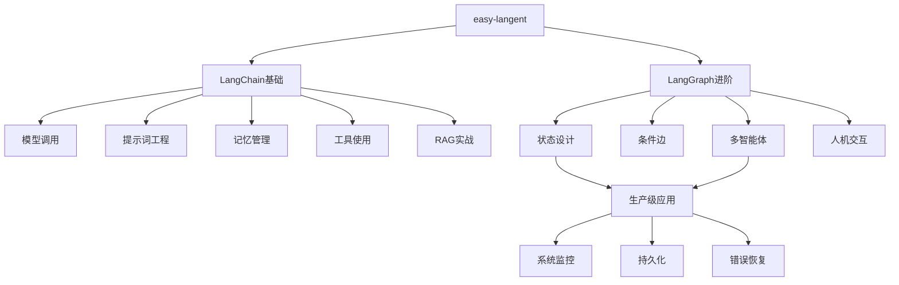

### 6.2 推荐学习资源

| 资源 | 类型 | 链接 |
|------|------|------|
| LangChain 官方文档 | 官方 | https://python.langchain.com/ |
| LangGraph 官方文档 | 官方 | https://langchain-ai.github.io/langgraph/ |
| Happy-LLM | 前置课程 | datawhalechina/happy-llm |
| Hello-Agents | 前置课程 | datawhalechina/hello-agents |

### 6.3 下一步

1. 完成教程前五章，跑通 LangChain 基础组件的每个示例
2. 重点看第六章 LangGraph 状态机设计，动手改一个节点试试
3. 选一个配套项目（如狼人杀 AI）做二次开发
4. 把学到的工作流模式用到自己的项目里

---

## 总结

easy-langent 覆盖了 LangChain 基础组件到 LangGraph 状态工作流的完整路径，4 个实战项目（狼人杀 AI、Agentic RAG、MCPChat、Data Agent）把概念落地为可运行代码。

**要点回顾**：

1. LangChain 适合简单快速开发，LangGraph 适合复杂生产级应用——两者互补，不是替代
2. LangGraph 三大概念：状态（State）、节点（Nodes）、边（Edges）
3. 智能体工作流的设计要点：状态传递、节点编排、条件分支、循环迭代
4. RAG、数据分析、多智能体协作等场景的完整实现路径

---

**🦞 每日 08:00 自动更新**

**原文**：https://github.com/datawhalechina/easy-langent
