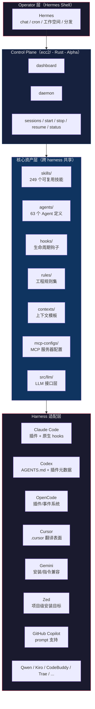

ECC 做一件事：让你的 agent 每次工作都在降低下次工作的难度，而不是多一次工作就多一份上下文负担。

听起来像句口号，但你用过 Claude Code 的第三方插件就知道——大部分插件就是塞一堆 prompt 模板和 slash command。工作完了，代码提交了，下一轮会话又从零开始。ECC 反着来：hooks 在每次写入后格式化并校验，Stop hook 检查有没有遗留 console.log，session 结束后自动把模式提取成可复用 skills，跨 session 持久化 context 记忆。10 个月高强度 daily use 打磨下来的东西，不是拼凑出来的配置合集。

目前 182K+ Stars、28K+ Forks、170+ 贡献者，覆盖 Codex、Claude Code、Cursor、OpenCode、Gemini、Zed、GitHub Copilot、Qwen Code、Kiro、CodeBuddy、Trae 共 12+ 个 harness。

读完这篇文章，你至少能搞清楚：

- ECC 的分层结构怎么组织的，哪一层解决什么问题
- 从 `the-shortform-guide.md` 开始的最佳上手路径什么样
- v2.0.0-rc.1 的 Rust control-plane (`ecc2/`) 是什么、能干什么
- 安装过程中容易踩的坑和适配不同 harness 的差异
- 什么场景值得装 ECC，什么场景反而会拖慢你

| → | [系统分层](#系统分层) | [从 shortform 开始](#从-shortform-开始) | [安装与适配](#安装与适配) | [v2.0.0-rc.1 详解](#v200-rc1-详解) | [安全](#安全) | [FAQ](#faq) | [自测](#自测)

## 系统分层



四层结构：

- **Operator 层**：Hermes 是可选的外壳，跑 chat、cron、工作空间记忆和分发。你可以在 Hermes 里 import ECC skills，也可以直接用裸 harness 跑 ECC。
- **Control Plane 层**：`ecc2/` 的 Rust 原型，提供 dashboard、daemon、session 管理。这是跨 harness 的统一调度面——无论你在 Claude Code 还是 Codex 里跑 agent，ecc2 都能追踪 session 状态。
- **核心资产层**：所有跨 harness 共享的东西都在这里。skills 是工作流定义，agents 是子 agent 配置，hooks 是生命周期自动化，rules 是工程约束，contexts 是跨 session 记忆模板，mcp-configs 是外部工具连接，src/llm 是模型接口抽象。
- **Harness 适配层**：每个 harness 加载 ECC 资产的方式不同。Claude Code 有原生插件和 hooks，Codex 靠 AGENTS.md 和插件元数据，OpenCode 走事件系统，Cursor 用 `.cursor/` 翻译表面。ECC 把共享逻辑放在 core 里，harness 适配只做加载、事件映射和命令路由。

规模数据一览：

| 维度 | 数量 |
|------|------|
| Agent 定义 | 63 个 |
| 可复用 Skills | 249 个 |
| Legacy Command Shims | 79 个 |
| 语言生态覆盖 | 12+ 种 |
| Harness 支持 | 12+ 个 |
| 贡献者 | 170+ |

### 核心工作流五条线

这五条线是 ECC 区别于普通配置合集的关键：

**Token 优化**——不是简单告诉你「用 Haiku 替代 Opus」。ECC 的规则集包括模型选择策略（什么时候升级模型，什么时候用便宜的）、系统提示精简（去掉不用的 tool 声明）、后台进程管理（禁用不用的 MCP 减少 context 占用）。实测下来，20+ MCP 全开 vs 只保留 6 个活跃的，context window 可用空间能差 130K tokens。

**记忆持久化**——hooks 在 session 结束时自动攒上下文，存进 SQLite state store。下一个 session 开始时恢复。不是简单地把上次聊天记录灌进去，而是结构化摘要：改了哪些文件、做了什么决策、哪些坑已经踩过了。

**持续学习**——session 中反复出现的执行模式会被提取出来，固化成新的 skill。比如你连续三次用同样的方式做 PR review，第四次 agent 就会建议「要不要把这个流程固化成 /pr-review skill」。

**验证循环**——支持 checkpoint 评估和连续评估两种方式。checkpoint 是阶段性快照验证（类似 git bisect），连续评估是 agent 边干边自检。pass@k 指标让你量化 agent 输出质量。

**并行化**——git worktree 隔离变更 + cascade 方法管理多 agent 并行。每个 worktree 跑一个独立 agent 实例，不会交叉污染。什么时候横向扩展？当你发现单个 agent 的上下文逼近 80% 水位且还有未处理任务时。

## 从 shortform 开始

ECC 仓库里最重要的文档不是 README，是 `the-shortform-guide.md`。README 告诉你有多少 agents、多少 skills，shortform guide 告诉你这些东西怎么组合起来用。

### 先理解 Skills 和 Commands 的关系

Skills 是 ECC 里最耐久的单位。一个 skill 是一组结构化的工作流定义：触发条件、执行步骤、支持文件、codemap（帮助 agent 快速导航代码库的索引）。

Commands 是给 skills 提供的快捷入口。`/refactor-clean` 背后是一个 refactor skill，`/tdd` 背后是一个 tdd-workflow skill。但逻辑应该在 skill 里，command 只是一个 trigger。

```bash
# Skill 的标准结构
~/.claude/skills/
  pmx-guidelines.md      # 项目级模式约定
  coding-standards.md    # 语言最佳实践
  tdd-workflow/          # 多文件 skill（含 SKILL.md）
  security-review/       # checklist 式 skill
```

选几个高频 skill 看它们做什么：

| Skill | 用途 |
|-------|------|
| `parallel-execution-optimizer` | 判断什么时候该横向扩展 agent 数量，生成 worktree 隔离方案 |
| `benchmark-optimization-loop` | 跑 benchmark → 分析瓶颈 → 改代码 → 再跑 benchmark，循环收敛 |
| `data-throughput-accelerator` | 批量数据处理的流水线优化 |
| `latency-critical-systems` | 低延迟场景下的代码路径分析 |
| `recursive-decision-ledger` | 复杂决策的记录链，每一步决策带着上下文传给下一步 |

### Hooks：不是提醒，是强制执行

Hooks 在 ECC 里不只是「弹个提醒」——很多 hook 直接在行为层面拦截。PreToolUse 可以在 git push 之前强制打开编辑器让你 review 变更，PostToolUse 可以在每次编辑 `.ts` 文件后跑 `tsc --noEmit`，Stop hook 可以扫描所有修改文件检查残留的 console.log。

六种 hook 类型：

| Hook 类型 | 触发时机 | 典型用途 |
|-----------|---------|---------|
| PreToolUse | 工具执行前 | 校验、提醒、拦截（如禁止写不必要的 .md 文件） |
| PostToolUse | 工具执行后 | 自动格式化、类型检查、告警扫描 |
| UserPromptSubmit | 用户发消息时 | 注入上下文约束 |
| Stop | agent 完成响应时 | 检查修改文件质量、记忆持久化 |
| PreCompact | 上下文压缩前 | 保留关键信息不被 compact 掉 |
| Notification | 权限请求时 | 审计、日志记录 |

一段实战 hook 配置：

```json
{
  "PreToolUse": [
    {
      "matcher": "tool == \"Bash\" && tool_input.command matches \"(npm|pnpm|yarn|cargo|pytest)\"",
      "hooks": [{
        "type": "command",
        "command": "if [ -z \"$TMUX\" ]; then echo '[Hook] Consider tmux for session persistence' >&2; fi"
      }]
    },
    {
      "matcher": "Write && .md file",
      "hooks": [{"type": "command", "command": "block unless README/CLAUDE"}]
    },
    {
      "matcher": "git push",
      "hooks": [{"type": "command", "command": "open editor for review"}]
    }
  ],
  "PostToolUse": [
    {
      "matcher": "Edit && .ts/.tsx/.js/.jsx",
      "hooks": [{"type": "command", "command": "prettier --write"}]
    },
    {
      "matcher": "Edit && .ts/.tsx",
      "hooks": [{"type": "command", "command": "tsc --noEmit"}]
    },
    {
      "matcher": "Edit",
      "hooks": [{"type": "command", "command": "grep console.log warning"}]
    }
  ],
  "Stop": [
    {
      "matcher": "*",
      "hooks": [{"type": "command", "command": "check modified files for console.log"}]
    }
  ]
}
```

用 `hookify` 插件可以对话式创建 hook，不用手写 JSON。

### Subagents：把大任务拆给小 agent

Subagent 是主 agent（orchestrator）可以委派任务的子进程。每个 subagent 有独立的 tool 权限、MCP 访问范围、上下文预算。主 agent 不用把大段代码塞进自己的 context，而是把「审查这个模块的安全性」委派给 security-reviewer subagent，收到结果后继续。

ECC 预设的 subagent：

```bash
~/.claude/agents/
  planner.md              # 功能规划
  architect.md            # 系统设计
  tdd-guide.md            # TDD 工作流
  code-reviewer.md        # 代码质量审查
  security-reviewer.md    # 安全漏洞分析
  build-error-resolver.md # 构建错误排查
  e2e-runner.md           # Playwright e2e 测试
  refactor-cleaner.md     # 死代码清理
  doc-updater.md          # 文档同步
```

每个 subagent 可以限制 tool 白名单。比如 security-reviewer 可能只允许 Read、Grep、Glob，不允许 Write 和 Bash——防止它擅自修代码。

### MCP 策略：配置多、启用少

ECC 在 `mcp-configs/` 里预置了大量 MCP 服务器配置。但真正跑的时候，只启用当前项目需要的。原因很简单：每多一个 tool，context window 就少一块。

经验数字是：配置 20-30 个 MCP，但保持活跃的不超过 10 个（80 个 tool 以下）。通过 `/mcp` 命令随时查看和切换。

### Rules：不是建议，是 agent 的「本能」

`rules/` 里的 `.md` 文件是 agent 必须遵守的约束。跟普通 system prompt 的区别是：rules 的结构化程度更高，错误时 agent 可以用 rule ID 引用，方便审计。

```bash
~/.claude/rules/
  security.md      # 禁止硬编码密钥，校验输入
  coding-style.md  # 不可变性、文件大小限制
  testing.md       # TDD 流程，80% 覆盖率要求
  git-workflow.md  # conventional commits 格式
  agents.md        # 什么时候委派给 subagent
  patterns.md      # API 响应格式约定
  performance.md   # 模型选择策略
  hooks.md         # hook 行为文档
```

## 安装与适配

### 基础安装

```bash
git clone https://github.com/affaan-m/ECC.git
cd ECC

./install.sh          # Linux/macOS
powershell -File install.ps1  # Windows
```

`install.sh` 做了几件事：
1. 检测当前环境的 harness（Claude Code、Codex、OpenCode 等）
2. 根据 manifest 选择需要安装的组件（不是全量安装）
3. 把 skills、agents、rules、hooks、mcp-configs 写到 harness 对应的目录
4. 初始化 SQLite state store（session 记忆和状态追踪用）
5. 验证安装完整性（跑 `node tests/run-all.js`，期望零失败）

macOS/Linux 上安装完验证：

```bash
node tests/run-all.js
```

输出应该是全部绿色通过的测试摘要。如果有红色，查 `TROUBLESHOOTING.md`。

### 选择性安装

v1.9.0 开始支持 manifest 驱动的选择性安装。你不需要把所有 249 个 skills 全装上——只装你用的语言和场景。

安装流程分两步：

```bash
node scripts/install-plan.js --target claude-code --langs typescript,python
node scripts/install-apply.js
```

`install-plan.js` 生成安装计划（列出要装哪些文件），`install-apply.js` 执行。state store 会记录每次安装的内容，支持增量更新。

### 不同 harness 的适配差异

| Harness | Skills 加载 | Hooks 支持 | 注意点 |
|---------|-----------|-----------|--------|
| Claude Code | 插件自动加载 | 原生支持全部 6 种 hook | 最完整的兼容性 |
| Codex | 读 AGENTS.md + 插件元数据 | 指令驱动，无原生 hook | hook 逻辑需要写在 instruction 里 |
| OpenCode | 插件/事件系统 | 通过 adapter 复用 ECC hook | 事件映射需要额外配置 |
| Cursor | `.cursor/` 翻译表面 | 支持但布局不同 | ECC 维护了 `.cursor/` 下的翻译层 |
| Gemini CLI | 安装/指令兼容 | 无完整 hook 对等 | 作为兼容表面使用 |
| Zed | 项目级安装目标 | 不适用 | 主要是 rules 和 skills 层 |
| GitHub Copilot | prompt 支持 | 不适用 | 通过 `.vscode/` 和 prompt 文件 |
| Qwen / Kiro / CodeBuddy / Trae | 各自安装目标目录 | 看平台支持 | 按 manifest 分发 |

### 从 Hermes 迁入（如果你已经有 Hermes 工作空间）

如果之前在用 Hermes 跑 agent 工作流，ECC 提供了迁移管线：

```bash
ecc migrate audit --source ~/.hermes
ecc migrate plan
ecc migrate scaffold
ecc migrate import-skills --output-dir migration-artifacts/skills
ecc migrate import-tools --output-dir migration-artifacts/tools
ecc migrate import-plugins --output-dir migration-artifacts/plugins
ecc migrate import-schedules --dry-run
ecc migrate import-remote --dry-run
ecc migrate import-env --dry-run
ecc migrate import-memory
```

先跑 `audit` 看现有 workspace 哪些能映射到 ECC，再跑 `plan` 和 `scaffold` 生成迁移方案，最后用各个 import 子命令把旧资产搬进来。`--dry-run` 让你先预览再执行。

## v2.0.0-rc.1 详解

2026 年 4 月发布的 v2.0.0-rc.1 是 ECC 从「Claude Code 插件」变成「跨 harness agent 操作系统」的标志性版本。

### ecc2/：Rust 写的 Control Plane

`ecc2/` 目录里是一个用 Rust 构建的 control-plane 原型。它不是终版，但已经可编译、可测试、可本地使用。

当前支持的组件：

- **TUI Dashboard**——终端内的仪表盘，显示活跃 session、资源占用、风险评分
- **Session Store**——基于 SQLite 的 session 状态持久化。每次 agent 启动、停止、恢复都会记录，跨重启不掉
- **Session 生命周期管理**——`start`、`stop`、`resume`、`status`、`sessions` 命令
- **Daemon 模式**——后台常驻进程，持续监控 session 状态
- **Worktree 感知**——创建 session 时自动关联 git worktree，隔离文件系统变更
- **Observability 原语**——风险评分、session 追踪、harness 审计

从仓库根目录运行：

```bash
cd ecc2
cargo run
```

常用命令：

```bash
cargo run -- dashboard

cargo run -- start --task "audit the repo and propose fixes" --agent claude --worktree

cargo run -- sessions

cargo run -- status latest

cargo run -- stop <session-id>

cargo run -- resume <session-id>

cargo run -- daemon
```

验证：

```bash
cd ecc2
cargo test
```

`ecc2/` 当前缺的东西（明确声明，别把它当成品用）：
- 多 agent 协同编排
- agent 间委托和摘要
- 可视化 worktree / diff 审查
- 更强的跨 harness 兼容
- 深度记忆和路线图感知规划
- 发布打包和安装器

正确姿势是把 `ecc2/` 当作 alpha 预览——可以本地跑，可以测试，不要用它管生产环境。

### 新增 Operator 体系

v2.0.0-rc.1 扩展了一批 operator，覆盖出站工作流：

| Operator | 负责什么 |
|----------|---------|
| `brand-voice` | 品牌文案调性约束 |
| `social-graph-ranker` | 社交图谱排序 |
| `connections-optimizer` | 人脉网络优化 |
| `customer-billing-ops` | 客户账单运营 |
| `ecc-tools-cost-audit` | ECC Tools 成本审计 |
| `google-workspace-ops` | Google Drive/Docs/Sheets 操作 |
| `project-flow-ops` | 项目流程管理 |
| `workspace-surface-audit` | 工作空间表面审计 |

### Dashboard GUI

基于 Tkinter 的桌面应用（`ecc_dashboard.py` 或 `npm run dashboard`），支持深色/浅色主题切换、字体自定义、项目 logo 显示。把 session 状态、风险分数、活跃 harness 可视化到一个面板上。

### Hermes 集成

Hermes 是 ECC 的外部 operator shell，负责 chat、cron、工作空间记忆和分发。ECC 是 Hermes 下面的可复用工作流基板。公开的 Hermes Setup Guide 描述了怎么把 Hermes 当「前门」、把 ECC 当「引擎」用——Telegram/CLI/TUI 进来，经过 Hermes 路由到 ECC skills + hooks + MCP 执行，结果落到 Google Drive / GitHub / 浏览器自动化 / 研究 API / 媒体工具。

### Itô 预测市场 Skill Pack

六个面向预测市场的 skill：
- `ito-market-intelligence`——市场情报收集
- `ito-basket-compare`——篮子对比
- `ito-trade-planner`——交易计划（只读分析，不执行）
- `ito-data-atlas-agent`——数据地图
- `prediction-market-oracle-research`——预言机研究
- `prediction-market-risk-review`——风险审查

公开的是只读工作流，实时 API 访问权限与 ECC Tools 计费分开管理。

### Operator Status Snapshot

`ecc status --markdown --write status.md` 把本地状态转成可传递的交接文档，包含就绪状态、活跃 session、skill 运行健康、安装健康、待处理治理事件、关联的 Linear/GitHub/handoff 工作项。结合 `ecc work-items upsert`、`ecc work-items sync-github --repo owner/repo`、`ecc status --exit-code` 可以实现自动化状态检查。

## 安全

ECC 把安全当作独立方向维护，不是事后补丁。

`the-security-guide.md` 覆盖：

- **攻击向量分析**——prompt 注入、工具滥用、上下文污染
- **沙箱隔离**——sandbox 模式限制 agent 文件系统访问
- **净化处理**——输入输出的 sanitization 管道
- **CVE 追踪**——已知漏洞的监控和响应
- **AgentShield**——ECC 内置的 agent 行为安全层，覆盖 IOC（入侵指标）扫描、包管理器加固、证据包溯源、策略导出和推广、fleet 路由

v2.0.0-rc.1 还加入了供应链硬化：Mini Shai-Hulud/TanStack 事件后的 IOC 扫描强化、无生命周期 CI 安装、建议源刷新、npm audit/签名校验。

## FAQ

**Q1: ECC 和普通的 Claude Code 插件市场里的插件有什么区别？**

插件市场里的插件通常是单个功能——一个 skill、一个 MCP、一组 hooks。ECC 是一整套系统：skills、agents、hooks、rules、contexts、MCP configs、legacy command shims 全部打包，并且这些组件之间有联动关系（比如 hook 触发后调用 skill，skill 执行结果写入 context 记忆）。单独装 10 个插件不等价于装 ECC。

**Q2: 我平时只用 Claude Code，有必要装 ECC 吗？值得学那套跨 harness 的东西吗？**

如果你只用 Claude Code，ECC 的 Claude Code 插件表面就是你要的全部——所有的 skills、hooks、agents、rules 都是原生加载的。跨 harness 部分是架构上的设计，你不碰 Codex 或 OpenCode 就不需要关心。你获得的价值是 249 个现成 skills + 预设 hooks + 记忆持久化，这些都是 Claude Code 单 harness 就生效的。

**Q3: 249 个 skills 全装上会不会太重？context window 扛得住吗？**

Skills 不会占 context——只有被调用时才会加载相关的 skill 内容。真正吃 context 的是 MCP tools。ECC 的策略是：MCP 配置写 20-30 个，但只启用当前项目需要的 5-8 个。`/mcp` 命令可以随时切换。如果你装完发现 context 可用空间低于 70%，检查一下启用的 MCP 数量。

**Q4: ecc2/ 的 Rust control-plane 什么时候能用于生产？**

目前是 alpha。可以编译、可以跑测试、可以本地试用，但不要用于生产环境。官方路线图里 ecc2 的 GA 依赖：多 agent 编排完成、跨 harness session resume 语义稳定、发布打包和安装器就绪。关注 repo 里 `ecc-2.0` label 的 issue。

**Q5: ECC Pro 和 OSS 版本怎么选？**

OSS 版本 MIT 协议永久免费，包含全部 skills、agents、hooks、rules、MCP configs。ECC Pro（$19/seat/月）是托管的 GitHub App，面向私有仓库，提供 PR 审计功能。个人开发者和公开仓库用 OSS 就够了；团队私有仓库考虑 Pro。

**Q6: 装完 ECC 后 agent 行为变「慢」了是怎么回事？**

大概率是启用了太多 MCP server。每个 MCP server 会给 agent 注册若干 tools，tools 多了每次对话都要在 system prompt 里声明一遍。解决：`/mcp` 查看活跃列表，把当前项目不用的禁掉，保持在 10 个以内。

**Q7: 怎么确认 ECC 安装成功了？**

跑 `node tests/run-all.js`。输出应该是零失败的测试摘要。如果有红色，说明某些组件没装对。常见问题包括：harness 版本太旧、MCP 配置里的 npx 路径不对、hooks JSON 语法错误。查 `TROUBLESHOOTING.md` 找对应解决方案。

## 自测

用这几个检查项验证你的 ECC 环境是否正确配置：

- [ ] `node tests/run-all.js` 全部通过，无失败用例
- [ ] 运行 `/mcp` 查看活跃 MCP 列表，确认未超过 10 个（或 80 个 tools）
- [ ] 新建一个 agent session，执行 `/refactor-clean` 后检查 hooks 是否触发（PreToolUse 提醒、PostToolUse 格式化）
- [ ] 连续完成 3 次同类工作（如 PR review），检查 agent 是否建议把模式固化为 skill
- [ ] session 结束后的下一个 session 中，agent 是否引用了上一个 session 的文件变更和决策——验证记忆持久化
- [ ] 在 git worktree 中启动一个 agent，确认变更被隔离在原 worktree 内，不影响主分支
- [ ] `ecc status --markdown --write status.md` 生成的交接文档是否包含了活跃 session、skill 健康、安装健康等信息
- [ ] 检查 `rules/` 里的约束是否真正被 agent 遵守——比如在你的规则里加了「禁止使用 console.log」后，agent 是否会主动用结构化日志替代

---

项目地址：[affaan-m/ECC](https://github.com/affaan-m/ECC)。强烈建议先通读 `the-shortform-guide.md`，理解了 hooks、skills、subagents、MCP 这四块怎么联动之后，再深入 `the-longform-guide.md` 里的 token 优化、记忆持久化、验证循环和并行化细节。最后翻 `the-security-guide.md` 把安全面补上。不要跳过 shortform 直接读 longform——没有操作直觉撑着，长的你看不完。