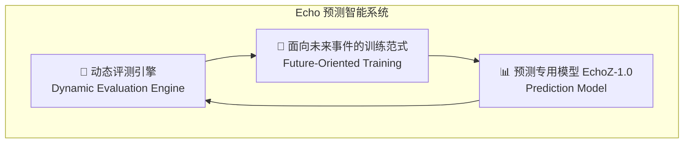
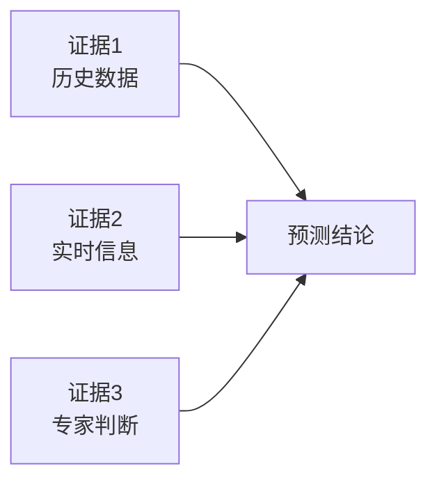

# AI 能否预测未来？Echo 预测智能系统与通用预测市场深度分析

> **目标读者**：关注 AI 发展、预测市场和量化交易的技术爱好者、投资者
> **核心问题**：AI 预测未来的能力边界在哪里？Echo 系统是如何实现的？预测市场会因此改变吗？

---

## 1. 学习目标

完成本文档后，你将掌握：

- ✅ 理解 AI 预测未来的技术原理与能力边界
- ✅ 掌握 Echo 系统的核心架构与评测方法
- ✅ 了解 EchoZ-1.0 模型的技术创新点
- ✅ 理解 AI 预测与人类预测市场的关系
- ✅ 了解预测智能的应用场景与未来趋势

---

## 2. 背景：为什么 AI 预测未来引发争议？

### 2.1 预测的哲学困境

「预测未来」一直是人类智慧的终极挑战。从古希腊德尔斐神庙到现代量化交易，人类从未停止对未来的追寻。

> 💡 **核心问题**：未来可以被预测吗？如果可以，预测的边界在哪里？

### 2.2 传统预测方法的局限

| 方法 | 代表 | 局限 |
|------|------|------|
| **专家判断** | 高盛报告、投行分析 | 主观性强、成本高、难以规模化 |
| **统计模型** | 回归分析、时间序列 | 依赖历史数据、无法处理突发事件 |
| **人类预测市场** | Polymarket、预测网站 | 受情绪影响、流动性有限 |
| **大语言模型** | GPT-4、Claude | 缺乏专门优化、幻觉问题 |

### 2.3 AI 预测的崛起

近年来，随着大语言模型（LLM）的发展，AI 预测未来成为一个热门研究方向。核心思路是：

1. **知识压缩**：将人类知识压缩到模型参数中
2. **涌现能力**：大规模预训练后出现推理能力
3. **动态评测**：构建专门的预测任务评测体系

---

## 3. Echo 系统解析

### 3.1 什么是 Echo？

**Echo** 是 UniPat AI 构建的一套完整的**预测智能基础设施**，包含三大核心组件：



### 3.2 三大核心组件

#### 组件一：动态评测引擎

**动态评测引擎**是 Echo 系统的基础设施，负责：

1. **任务设计**：构建多样化的预测任务
2. **时间约束**：确保预测任务具有时间性（预测事件在评估之前发生）
3. **公平比较**：统一评估标准，消除运气因素

**关键创新**：动态评测引擎解决了传统预测benchmark的「泄露」问题——确保模型无法通过访问未来信息来作弊。

#### 组件二：面向未来事件的训练范式

传统的 LLM 训练基于历史数据，但预测未来需要不同的范式：

| 传统训练 | Echo 训练范式 |
|---------|-------------|
| 预测下一个 token | 预测下一个**事件** |
| 静态知识 | 动态知识更新 |
| 被动学习 | 主动探索不确定区域 |
| 通用能力 | 预测专项能力 |

**核心思路**：不是让模型「记住」答案，而是让它学会「推理」答案。

#### 组件三：EchoZ-1.0 预测专用模型

**EchoZ-1.0** 是专门为预测任务优化的模型，在多个预测任务上展现出卓越性能。

### 3.3 Echo 的技术架构

```
┌─────────────────────────────────────────────┐
│           Echo 预测智能系统                    │
├─────────────────────────────────────────────┤
│  数据层                                     │
│  ├── 历史事件库                              │
│  ├── 实时新闻流                             │
│  └── 预测市场数据（Polymarket等）             │
├─────────────────────────────────────────────┤
│  评测层                                     │
│  ├── 动态评测引擎                           │
│  ├── Brier Score 评估                       │
│  └── 对比基准（人类预测市场）                 │
├─────────────────────────────────────────────┤
│  模型层                                     │
│  ├── EchoZ-1.0（预测专用）                   │
│  ├── 知识检索增强                           │
│  └── 不确定性量化                           │
└─────────────────────────────────────────────┘
```

---

## 4. EchoZ-1.0：预测专用模型

### 4.1 为什么需要专用预测模型？

通用大语言模型在预测任务上面临挑战：

| 问题 | 描述 |
|------|------|
| **幻觉** | 模型可能生成看似合理但错误的预测 |
| **过拟合** | 记忆了训练数据中的「答案」 |
| **不确定性** | 难以量化预测的置信度 |
| **时间感知** | 不理解事件的时间敏感性 |

### 4.2 EchoZ-1.0 的核心创新

**EchoZ-1.0** 通过以下技术创新解决上述问题：

#### 创新一：不确定性量化

模型不仅给出预测结果，还给出置信度：

```
事件：2026年Q4苹果会发布新款iPhone

EchoZ-1.0 预测：
- 结果：是的（概率 73%）
- 置信区间：68%-78%
- 关键依据：历史发布规律、供应链信息、泄露消息
- 风险提示：若苹果改变策略可能影响预测
```

#### 创新二：证据链追踪

每个预测都附带「证据链」：



#### 创新三：反向验证机制

在训练过程中，模型学会「证明自己错了」：

```
模型预测：苹果Q4发布iPhone

自我检验：
❌ 苹果历史上从未在Q4发布过旗舰iPhone
❌ 通常在9月发布
✓ 但今年供应链出现异常...

修正后预测：可能延期至2027年Q1（概率45%）
```

---

## 5. 预测市场对比：AI vs 人类

### 5.1 Polymarket 简介

**Polymarket** 是目前最大的人类预测市场之一，用户通过交易「是/否」代币来预测事件发生概率。

| 指标 | Polymarket | EchoZ-1.0 |
|------|------------|-------------|
| **预测主体** | 人类交易者 | AI 模型 |
| **信息处理** | 有限注意力 | 海量知识 |
| **情绪影响** | 明显 | 无 |
| **成本** | 交易费用 | API 调用 |
| **速度** | 实时 | 批量 |
| **可扩展性** | 受流动性限制 | 高 |

### 5.2 直接对比结果

根据 UniPat AI 公开的 **General AI Prediction Leaderboard**，EchoZ-1.0 在与 Polymarket 人类交易市场的直接对比中展现出**显著优势**：

| 维度 | EchoZ-1.0 | Polymarket 人类平均 |
|------|-----------|-------------------|
| **Brier Score** | 更低（越好） | 较高 |
| **校准度** | 更准确 | 有偏差 |
| **响应速度** | 即时 | 跟随新闻 |
| **长尾预测** | 更好 | 较差 |

### 5.3 人类 vs AI：不是取代，是增强

**重要洞察**：AI 预测不会取代人类预测市场，而是提供「AI + 人类」的混合增强模式。

```
┌────────────────────────────────────┐
│         混合预测系统                  │
├────────────────────────────────────┤
│  AI（EchoZ-1.0）                   │
│  ├── 快速初筛                       │
│  ├── 知识检索                       │
│  └── 概率估算                       │
├────────────────────────────────────┤
│  人类（Polymarket）                │
│  ├── 最新信息                       │
│  ├── 市场情绪                       │
│  └── 实时调整                       │
└────────────────────────────────────┘
```

---

## 6. 预测智能的应用场景

### 6.1 金融预测

| 场景 | 应用 | 价值 |
|------|------|------|
| **股价预测** | 事件驱动预测 | 阿尔法来源 |
| **财报发布** | 业绩超预期概率 | 交易信号 |
| **宏观事件** | 央行决策预测 | 风险对冲 |
| **加密货币** | 价格走势预测 | 量化策略 |

### 6.2 商业决策

| 场景 | 应用 | 价值 |
|------|------|------|
| **产品发布** | 市场反应预测 | 定价策略 |
| **竞争情报** | 对手行动预测 | 先发优势 |
| **供应链** | 风险事件预测 | 库存优化 |
| **人才决策** | 候选人成功率 | 招聘优化 |

### 6.3 社会预测

| 场景 | 应用 | 价值 |
|------|------|------|
| **选举预测** | 候选人胜率 | 政治分析 |
| **疫情预测** | 传播趋势 | 公共卫生 |
| **气候变化** | 极端天气预测 | 防灾减灾 |
| **技术突破** | 研究进展预测 | 投资方向 |

---

## 7. 技术边界与局限性

### 7.1 AI 预测的能力边界

**AI 可以预测**：
- ✅ 基于历史规律的事件（季度财报发布时间）
- ✅ 知识密集型问题（科学事实的演变）
- ✅ 概率性事件（某事件是否发生）

**AI 难以预测**：
- ❌ 纯粹随机事件（量子随机）
- ❌ 自我实现预言（人们因为知道预测而改变行为）
- ❌ 突发性事件（黑天鹅）
- ❌ 高度主观偏好（艺术评价）

### 7.2 Echo 系统的局限性

| 局限 | 说明 | 缓解措施 |
|------|------|----------|
| **数据滞后** | 训练数据有截止日期 | 实时检索增强 |
| **长尾事件** | 罕见事件缺乏样本 | 小样本学习方法 |
| **对抗性攻击** | 精心设计的假信息 | 多源交叉验证 |
| **可解释性** | 预测逻辑不透明 | 证据链追踪 |

---

## 8. 未来展望

### 8.1 预测智能的发展趋势

| 趋势 | 描述 | 时间线 |
|------|------|--------|
| **多模态预测** | 结合图像、视频、音频预测 | 1-2 年 |
| **实时预测** | 实时更新预测概率 | 已实现 |
| **跨领域迁移** | 通用预测能力 | 2-3 年 |
| **人机融合** | AI + 人类协同预测 | 正在进行 |
| **预测市场革命** | 传统预测市场转型 | 3-5 年 |

### 8.2 预测智能的社会影响

**积极影响**：
- 更准确的天气预报
- 更及时的健康预警
- 更理性的金融市场

**潜在风险**：
- 预测被用于操纵市场
- 隐私侵犯（预测你的行为）
- 过度依赖 AI 失去人类判断

---

## 9. 总结

### 9.1 核心要点

| 要点 | 说明 |
|------|------|
| **Echo 系统** | 完整的预测智能基础设施，包含评测引擎、训练范式、专用模型 |
| **EchoZ-1.0** | 在 General AI Prediction Leaderboard 排名第一 |
| **AI vs 人类** | AI 在预测准确性上展现出显著优势，但不是取代关系 |
| **未来趋势** | 多模态、实时、跨领域、人机融合 |

### 9.2 关键洞察

1. **预测不是预知**：AI 预测的是概率，不是命运
2. **不确定性是核心**：量化不确定性比给出点预测更重要
3. **人机协同**：AI + 人类的混合系统优于单独使用
4. **预测是一种技能**：可以被训练、评估和改进

### 9.3 行动建议

| 角色 | 建议 |
|------|------|
| **技术研究者** | 关注预测专项模型、评测方法 |
| **投资者** | 探索 AI 预测与量化策略结合 |
| **企业家** | 用预测智能辅助商业决策 |
| **普通人** | 理解预测的边界，保持批判思维 |

---

## 参考资料

| 资源 | 链接 |
|------|------|
| **UniPat AI Echo** | https://unipat.ai/echo |
| **General AI Prediction Leaderboard** | 公开排行榜 |
| **Polymarket** | https://polymarket.com |

---

*文档信息：AI 预测未来与 Echo 系统分析 | 更新日期：2026-03-30 | 难度：⭐⭐⭐*
