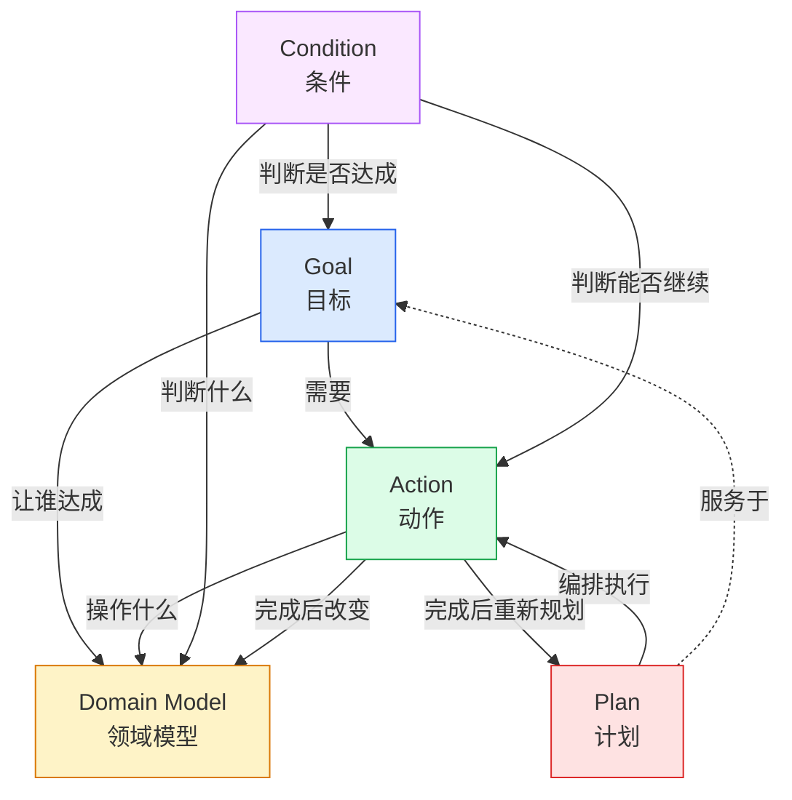
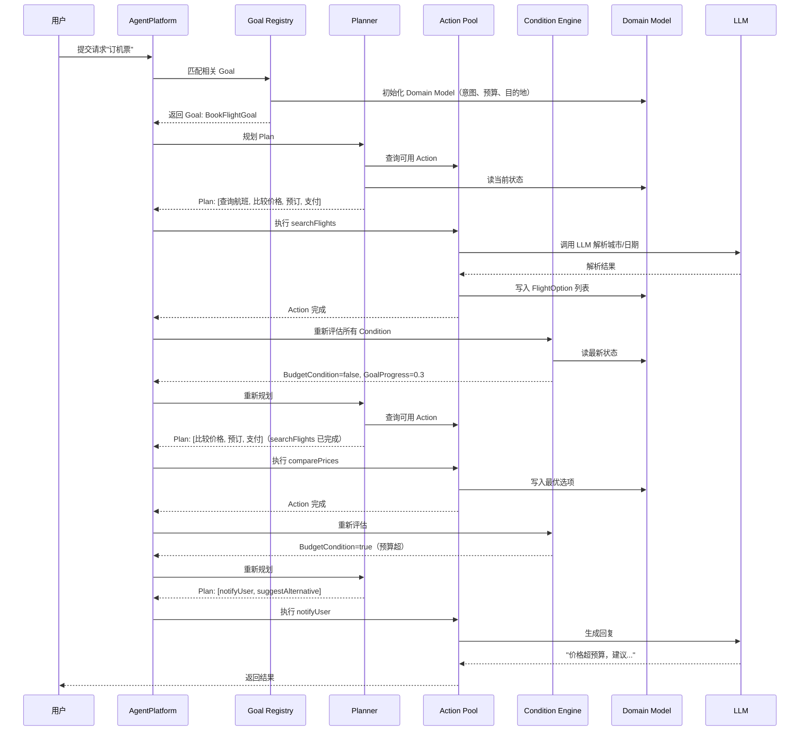
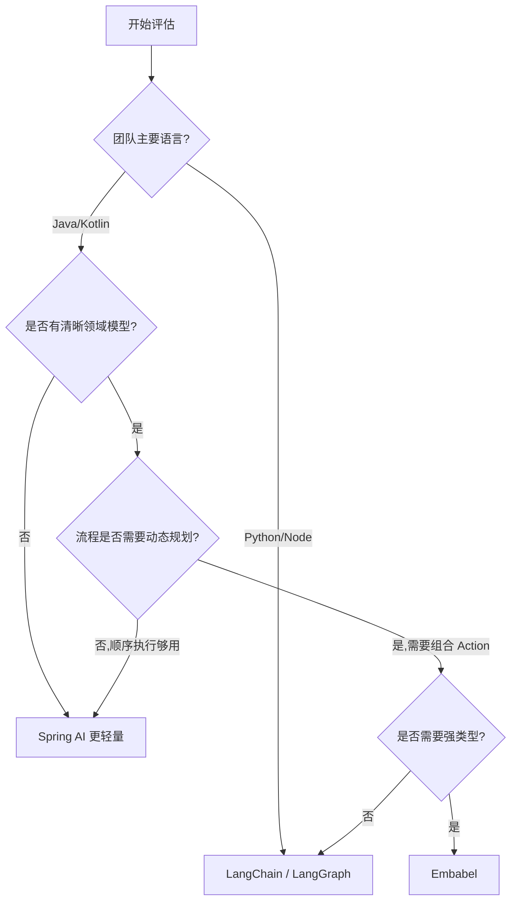

# Embabel：Spring 创造者打造的 JVM Agent 框架，用 OODA 循环实现动态规划

> **阅读时间**：约 16 分钟
>
> **适用读者**：JVM 平台（Java/Kotlin）架构师、Agent 框架选型者、对"强类型 + 动态规划"感兴趣的工程师
>
> **前置知识**：了解 Spring 生态、Agent 基本概念（LLM、工具调用、规划），接触过 LangChain 或 LangGraph 会更易理解差异

## 核心判断

Embabel 的价值不是再多一个 Agent 框架。

它的真正贡献是把 Spring 那套 DI/IoC（依赖注入 / 控制反转）哲学带进了 Agent 世界——开发者用普通 Kotlin/Java 类定义 Action、Goal、Condition，剩下的编排、规划、可观测性由框架在运行时接手。这套思路在 Java 后端跑了二十年，如今原班人马把它复刻到 Agent 场景上。

这样做的好处有三层：

- **企业级可落地**：Actions、Goals、Conditions 全部由强类型领域模型支撑，提示词和手写代码之间有清晰的边界，不再是"prompt 里塞满字符串拼接"
- **真正的规划（planning）**：README 明确写了"超越有限状态机或顺序执行，引入真正的规划步骤（非 LLM 的 AI 算法）"，系统能组合已知步骤以新顺序执行
- **可观测性零侵入**：零代码变更添加全链路追踪和指标，支持 Zipkin 和 Langfuse 导出器

代价是：它绑定 JVM 生态，学 Kotlin 强类型 + Spring 范式要花时间；早期框架（v1.0.0 在 2026-07-20 刚发）周边生态还在完善。

## 目录

- [核心判断](#核心判断)
- [为什么是 Embabel，不只是又一个 Agent 框架](#为什么是-embabel不只是又一个-agent-框架)
- [系统地图：四个核心概念的循环](#系统地图四个核心概念的循环)
- [关键机制：OODA 循环与动态规划](#关键机制ooda-循环与动态规划)
- [关键机制：强类型领域模型](#关键机制强类型领域模型)
- [关键机制：基于 Spring 的可观测性](#关键机制基于-spring-的可观测性)
- [请求/任务流：一个完整案例](#请求任务流一个完整案例)
- [与 LangChain / LangGraph 的对比](#与-langchain--langgraph-的对比)
- [快速上手：Maven 依赖](#快速上手maven-依赖)
- [适用边界：适合谁用、不适合谁用](#适用边界适合谁用不适合谁用)
- [常见问题](#常见问题)
- [延伸阅读](#延伸阅读)

## 为什么是 Embabel，不只是又一个 Agent 框架

Agent 框架这两年的爆炸式增长带来一个副作用：选型疲劳。LangChain、LangGraph、AutoGen、CrewAI、Semantic Kernel、Spring AI……每个都声称自己解决了"Agent 开发难"的问题。

Embabel 选择了完全不同的赛道。

它的出身决定了它的基因——**Rod Johnson 是 Spring 框架的创始人**，Embabel 由 Rod Johnson 主导开发。仓库 `embabel/embabel-agent` 在 GitHub 4k+ stars，Kotlin 编写，Apache 2.0 许可证，最新版本 v1.0.0 发布于 2026-07-20，最近 commit 在 2026-08-05。

把 Spring 的核心理念翻成 Agent 词汇，就是 Embabel 做的事：

| Spring 范式 | Embabel 对应 | 解决的问题 |
|---|---|---|
| `@Component` / `@Bean` | `Action` / `Goal` | 业务能力声明 |
| `ApplicationContext` | `AgentPlatform` | 容器与生命周期 |
| AOP 切面 | `@Tracked` 注解 | 横切关注点（追踪、监控） |
| 强类型 Bean | 强类型 Domain Model | 编译期约束 |
| 控制反转 | 运行时规划（Planning） | 流程不再硬编码 |

**底层假设**：Agent 不该是"prompt + 几段 if/else"，而该是"领域模型 + 可组合的能力 + 运行时规划"。这跟 Spring 2003 年宣称的"对象不再自己 new，由容器管理"是同一种思路。

## 系统地图：四个核心概念的循环

Embabel 的核心概念只有四个，但它们构成的循环是整个框架的发动机。



**四个概念的定义**（直接引自 README）：

- **Actions（动作）**：Agent 执行的步骤
- **Goals（目标）**：Agent 试图达成的目标
- **Conditions（条件）**：在执行动作或判断目标达成前评估的条件，每次动作后重新评估
- **Domain Model（领域模型）**：支撑流程的对象模型，为 Actions、Goals、Conditions 提供信息

**Plan（计划）** 是运行时生成的产物：达成目标的动作序列，由系统动态制定而非程序员编写，每个动作完成后重新规划。

**循环的关键点**：

1. 每个 Action 执行后，框架重新评估所有 Conditions
2. Conditions 改变 Domain Model 的状态
3. 规划器根据新的 Domain Model 状态重算 Plan
4. 目标达成 → 流程结束；未达成 → 继续循环

这就是 README 强调的 "**OODA 循环**（Observe-Orient-Decide-Act，观察-调整-决策-行动）"——读 Domain Model，观察现状；调整 Goals；用规划器决策下一步 Action；执行 Action 改 Domain Model。

## 关键机制：OODA 循环与动态规划

"OODA 循环"这个词来自军事战略，Embabel 把它显式写进了 README：

> "This is essentially an OODA loop (Observe-Orient-Decide-Act)"

这是一个**真正的规划步骤**，不是把"调 LLM 选下一步"包装成规划。

### 动态规划 vs 有限状态机

| 维度 | 传统 FSM（有限状态机） | LangChain Agent Loop | Embabel 动态规划 |
|---|---|---|---|
| 流程定义 | 状态转移图硬编码 | LLM 每步选工具 | 规划器在运行时组合 Action |
| 步骤来源 | 开发者写 | LLM 推理 | **规划算法** + 已知 Action 池 |
| 重新规划 | 不会 | 每步重新问 LLM | 每个 Action 完成后重新规划 |
| 可预测性 | 高 | 低 | 中（规划算法可追溯） |
| 适应性 | 差 | 高 | 较高 |

**Embabel 动态规划的三个特点**：

1. **规划器是可替换的组件**。README 提到的"非 LLM 的 AI 算法"指的是经典 AI 规划（Planning as Search），可以是图的搜索算法、A\*、HTN（Hierarchical Task Network，层次任务网络）等
2. **每个 Action 完成后重新规划**。Domain Model 状态变化后，之前的 Plan 可能不再最优，规划器重新计算
3. **已知步骤的新组合**。系统能"组合已知步骤以新顺序执行"——这意味着开发者提供 Actions，规划器负责串成 Plan

**一个具体例子**：

假设领域是"订机票"，Goals 是"在预算内到达目的地"。Actions 池里有 `查询航班`、`比较价格`、`预订机票`、`支付`。规划器可能拼出：

```
Plan A：查询航班 → 比较价格 → 预订机票 → 支付
Plan B：查询航班 → （发现预算不够）→ 改方案
```

执行过程中如果 `比较价格` 返回价格超预算，Domain Model 状态变化，规划器会重新算 Plan。这种"动态调整"是 FSM 做不到的，是 LangChain 简单循环做不到的。

### 条件（Condition）为什么重要

Condition 在每次 Action 后重新评估，这个设计解决了一个常见问题：**中间状态决定下一步该做什么**。

传统做法：开发者写 `if (budget < threshold) { ... }`，逻辑散落在代码里。

Embabel 做法：把 `BudgetCondition(is_exceeded)` 写成独立的 Condition 类，框架在每个 Action 后自动评估。领域逻辑变成可重用的组件，而不是流程的附属。

## 关键机制：强类型领域模型

Embabel 强类型的核心价值不是"少写 bug"，而是"提示词和代码干净交互"。

### 传统 Agent 框架的痛点

在 LangChain 的早期版本里，工具调用和提示词之间的边界是混乱的：

```python
# 工具入参是 JSON 字符串，提示词里也是 JSON 字符串
@tool
def search_flights(origin: str, destination: str, date: str) -> str:
    """Search flights."""
    # 业务逻辑
    return json.dumps(result)
```

问题：

- 提示词里的字段名和工具定义的字段名是字符串关系，编译期检查不到
- LLM 输出 JSON 解析出错后，错误信息很难定位
- 业务对象（Flight、Booking）和 LLM 交互对象（PromptTemplate、ToolCall）混在一起

### Embabel 的强类型方案

Actions、Goals、Conditions 由领域模型支撑，一切都是强类型。开发者写 Kotlin data class，框架自动生成提示词模板和工具描述：

```kotlin
// 假设的 Embabel 风格（基于 README 描述推断）
data class FlightSearchRequest(
    val origin: String,
    val destination: String,
    val date: LocalDate,
    val budget: BigDecimal
)

@Action
fun searchFlights(req: FlightSearchRequest): List<FlightOption> {
    // 业务逻辑
    return flightApi.search(req)
}
```

**好处**：

- 编译期字段名一致，提示词生成器不会拼错
- 业务对象（`FlightOption`）和 LLM 交互对象天然分离
- IDE 跳转、重构、单元测试都能用

**代价**：上手成本高于 Python 框架；某些场景下需要类型转换（领域类型 ↔ LLM 友好类型）。

## 关键机制：基于 Spring 的可观测性

Embabel 的可观测性是"零代码变更"加的。

> "Zero code changes to add full trace and metrics. Supports Zipkin and Langfuse exporters."

### 自动追踪的范围

- Agent 生命周期
- Action 执行
- LLM 调用
- 工具调用
- 规划迭代（每次重算 Plan）

### 自定义追踪

`@Tracked` 注解可以在方法上添加自定义追踪维度。这跟 Spring 的 AOP 切面是同一种思路——横切关注点不写在业务代码里。

```kotlin
@Tracked("custom-metric")
@Action
fun criticalAction(input: CriticalInput): CriticalOutput {
    // 业务逻辑
    // 自动追踪：调用次数、耗时、错误率
}
```

**为什么这点重要**：Agent 系统的调试比传统软件难得多。LLM 调用、规划迭代、工具调用产生的中间状态不能只看日志。OpenTelemetry 标准的 trace 能让 Agent 行为像微服务一样被分析。

### 平台抽象

README 提到"编程模型与平台内部实现分离，本地运行和生产环境不同 QoS"。这意味着：开发时用本地 LLM + 内存追踪，跑生产时换 OpenAI/Anthropic + Zipkin，业务代码一行不改。

## 请求/任务流：一个完整案例

把上面所有机制串起来，看一个 Agent 请求如何流过系统。

**场景**：用户说"帮我订一张下周去北京的机票，预算 2000 以内"。



**关键观察**：

1. **Domain Model 是单一可信源**。所有规划、条件评估都从它读，所有 Action 都写它
2. **Plan 在每个 Action 后重算**。不是一次性排好就执行到底
3. **Condition 触发动态调整**。`BudgetCondition` 触发后，规划器换了 Plan
4. **LLM 是被调用的工具，不是控制器**。LLM 解析意图、生成回复，但流程由框架驱动

## 与 LangChain / LangGraph 的对比

这是最常被问的问题。Embabel 跟 LangChain 系框架是平行赛道，不是替代关系。

| 维度 | LangChain / LangGraph | Embabel |
|---|---|---|
| 语言 | Python 优先（也有 JS） | JVM（Kotlin / Java） |
| 类型系统 | 弱类型（Python）或 Pydantic | 强类型（Kotlin data class） |
| 规划方式 | LLM 决定下一步 | **规划算法** + 已知 Action 池 |
| 流程定义 | 提示词 + 工具 schema | 强类型 Action + Goal + Condition |
| 状态管理 | 显式 state 对象 | Domain Model（强类型） |
| 生态 | 巨大（向量库、Loader、Retriever） | 早期（v1.0.0 在 2026-07-20 刚发） |
| 可观测性 | LangSmith（商业） | Zipkin / Langfuse（开源） |
| 平台依赖 | 无 | Spring 强绑定 |
| 学习曲线 | 低（Python + 提示词） | 中（Kotlin + Spring + 领域建模） |

### 选 LangChain 的场景

- 快速原型，需要大生态（向量库、Loader、Retriever 现成）
- 团队是 Python 重度用户，不打算碰 JVM
- 业务逻辑简单，LLM 决定流程已经够用

### 选 LangGraph 的场景

- 需要有状态的多 Agent 协作
- 想要"图"语义（节点、边、状态机）来表达流程
- 愿意在 Python 体系里写复杂流程

### 选 Embabel 的场景

- 团队已经在 JVM 生态（Spring、Java/Kotlin 后端）
- 业务对象有清晰的领域模型（金融、电信、ERP）
- 需要严格的类型检查和编译期约束
- 想要"规划算法"而不是 LLM 决策来决定流程
- 愿意承担早期框架的生态空白

## 快速上手：Maven 依赖

Embabel 提供了 Spring Boot starter，集成成本接近"加一个依赖"。

```xml
<dependency>
    <groupId>com.embabel.agent</groupId>
    <artifactId>embabel-agent-starter</artifactId>
    <version>0.3.0</version>
</dependency>
```

**注意**：starter 文档示例是 0.3.0，仓库主版本已经到 v1.0.0（2026-07-20）。实际集成时以 [Maven Central](https://search.maven.org/) 最新版本为准。

### 两种编写方式

README 提到了两种使用模式：

1. **代码驱动**（Code-driven）：用 Java/Kotlin 代码定义 Actions、Goals、Conditions。适合复杂业务逻辑
2. **声明式**（Declarative）：用配置文件或 DSL 描述流程。适合简单流程或快速试错

两种模式可以混用——核心业务用代码驱动，配置类流程用声明式。

## 适用边界：适合谁用、不适合谁用

### 适合用 Embabel 的场景

- **企业级 Java/Kotlin 后端**：现有 Spring 生态想加 Agent 能力，不用换技术栈
- **金融、电信、ERP**：领域模型清晰、流程复杂、对类型安全要求高
- **需要规划算法的场景**：步骤可枚举但组合方式多（供应链、排产、调度）
- **强调可观测性**：要接 Zipkin / Langfuse 做全链路追踪
- **LLM 混合编排**：不同子任务用不同模型（成本、性能、专长各异）

### 不适合用 Embabel 的场景

- **Python / Node 团队**：学习成本高于收益，除非计划迁移到 JVM
- **快速原型 + 试错**：早期框架版本迭代快，Bug 修不如 LangChain 及时
- **重 RAG（检索增强生成）场景**：LangChain 的 Loader、Retriever、VectorStore 生态成熟得多
- **多 Agent 协作**：LangGraph、AutoGen 在这个方向更专注
- **极简单流程**：如果只有 3-5 个工具调用，直接 LangChain 一把梭更快

### 决策流程图



## 常见问题

**Q: Embabel 和 Spring AI 是什么关系？**

Spring AI 是 Spring 官方对 LLM 的封装（类似 LangChain 的 Spring 版本），侧重于模型调用和提示词模板。Embabel 是更上层的 Agent 框架，底层可以集成 Spring AI。两者由 Spring 团队相关人员推动，但定位不同。Spring AI 是"让 Spring 集成 LLM"，Embabel 是"在 JVM 上做企业级 Agent 平台"。

**Q: 必须用 Kotlin 吗？**

不必须。Embabel 是 JVM 框架，Java 和 Kotlin 都能用。但 README 和代码示例偏向 Kotlin，因为 Kotlin 的 data class、sealed class、扩展函数在领域建模上更简洁。Java 团队可以用，但会少一些语法糖。

**Q: 规划器（Planner）能换吗？**

README 提到"非 LLM 的 AI 算法"，说明规划器是可插拔的组件。开发者可以根据场景选择不同的规划算法（HTN、Graph Search、Backward Chaining 等）。具体扩展点需要看 v1.0.0 的 API 文档。

**Q: 怎么调试 Agent 行为？**

三个层次：

1. **Domain Model 状态**：每个 Action 后打印 Domain Model，确认状态变化是否符合预期
2. **Plan 演进快照**：在每次 Plan 重算时记录前一个 Plan 与新 Plan 的差异，定位动态规划逻辑的偏差
3. **Trace + Metric**：集成 Zipkin 或 Langfuse 后能看到完整的调用链

**Q: Embabel 的活跃度如何？**

仓库在 GitHub 4k+ stars，最近 commit 在 2026-08-05，v1.0.0 在 2026-07-20 发布。处于"刚发稳定版"阶段，生态和社区还在建设期。适合愿意早期采用、能接受一定迁移成本的团队。

**Q: License 是？**

Apache 2.0，企业使用友好。

## 延伸阅读

下面给出阅读顺序与每篇为什么放在这个位置的理由：

1. **[Embabel 官网](https://hub.embabel.com)**（先读）。了解项目愿景和发布动态，建立初步认知
2. **[embabel/embabel-agent 仓库 README](https://github.com/embabel/embabel-agent)**（第二读）。本文大部分内容基于 README，把核心概念和快速开始过一遍
3. **[Spring AI 文档](https://spring.io/projects/spring-ai)**（对比用）。理解 Embabel 跟 Spring 生态其他 AI 项目的边界
4. **[LangGraph 文档](https://langchain-ai.github.io/langgraph/)**（对比用）。理解"图"语义和"规划"语义的差异
5. **[OODA Loop 原始文献](https://en.wikipedia.org/wiki/OODA_loop)**（概念溯源）。理解 Embabel 的设计哲学源头
6. **[HTN Planning 入门](https://en.wikipedia.org/wiki/Hierarchical_task_network)**（深入用）。如果想理解 Embabel 规划器的可能实现

按这个顺序阅读的好处：先建立产品认知（官网），再看核心代码（README），然后横向对比（Spring AI / LangGraph），最后深挖概念源头（OODA / HTN）。避免一上来就扎进代码细节而失去全局视角。

## 项目资源

- **GitHub 仓库**：https://github.com/embabel/embabel-agent
- **官网**：https://hub.embabel.com
- **最新版本**：v1.0.0（2026-07-20）
- **License**：Apache 2.0
- **Maven 坐标**：`com.embabel.agent:embabel-agent-starter`
- **可观测性**：Zipkin / Langfuse 导出器
- **发音**：Em-BAY-bel /ɛmˈbeɪbəl/（取自官网）
