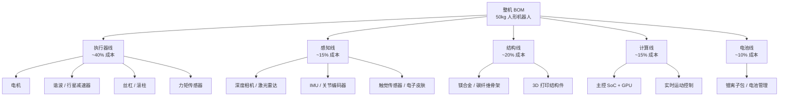

# 机器人「肉身」的工程化：宇树半马破纪录、智元量产和特斯拉 Optimus 留下的不是空翻，是供应链重组

## 学习目标

读完这篇文章，能回答 4 件事：

- 人形机器人过去两年「进化这么快」的真实驱动力不是「大脑」变聪明，是**「肉身」硬件成本下降 + 整机系统整合能力**追上来了
- 一台 1.7 米高、50 公斤级人形机器人**最贵和最难的零件**是哪几个，**为什么**
- 「空翻 + 功夫 + 半马」这些舞台动作和「**工厂里 8 小时不摔倒**」这个量产门槛之间到底差多少
- 为什么单点技术领先（像波士顿动力 Atlas 的液压、宇树的高扭矩电机）已经不够用，**未来 2–3 年真正决定一家机器人公司能不能跑出来的是系统整合能力 + 供应链成熟度**

---

## 写在前面

2024–2025 年机器人圈最热闹的几件事——宇树 H1 半马跑进 50 分 26 秒、智元 AgiBot 累计出货突破一千台、特斯拉 Optimus Gen 2 在弗里蒙特工厂里分拣电池、Figure 02 进宝马工厂——背后有一个共同的工程事实：这些机器人已经能**承受接近车祸级别的冲击还能站稳**。

但硅谷 101《空翻之后，它还要学会接住一片落叶？拆解机器人「肉身」、量产与供应链》（BV1hjV96MEUE，38 分钟，2026-06-01 发布）这期节目里嘉宾王闯说过一句更直白的话：「**如果把机器人拆开来看，真正厉害的不是某一个动作，而是它背后那套复杂的身体系统。**」

这期节目的嘉宾三人组——智元机器人合伙人 / 高级副总裁 / 通用业务部总裁王闯、前特斯拉人工智能硬件负责人 Kerry 刘向科、某机器人公司前采购总监（匿名）——刚好覆盖了「整机厂 + 头部 AI 公司硬件 + 供应链」三个视角。这篇文章以这期节目为骨架，按**电机 / 减速器 / 丝杠 / 力矩传感器**四条供应链主线拆开机器人的「肉身」，再说清楚为什么「单点技术 vs 系统整合」这件事在 2026 年这个时点变得尤其关键。

文中数字、技术规格与公司时间线均来自这期节目 + 公开报道（特斯拉 AI Day、智元年度发布会、宇树 B2-W/H1 技术规格页、Figure 投资者公开材料、亚马逊 A 仓库 Digit 部署报告）。2026 年上半年的最新部署数字以公司公开公告为准，本文不外推。

---

## 一、机器人圈 2024–2026 三年时间线：从舞台到仓库

在拆供应链之前，先把这三年里机器人行业的关键时间线画一遍——不是「又一家公司融资了」，是「**哪台机器人在真实环境里跑了多久、能做什么**」。

| 时间 | 事件 | 工程意义 |
|---|---|---|
| 2024-03 | Figure 01 进 BMW 斯帕坦堡工厂做车身搬运试点 | 第一家「非自家」工厂部署 |
| 2024-08 | 智元 AgiBot A2 发布，5 月起进入比亚迪工厂做装配 | 国产厂商进入汽车主机厂 |
| 2024-08-19 | 宇树 H1 半马首跑，50 分 26 秒，中途换电池 | 人形机器人第一次跑完半马 |
| 2024-10 | 特斯拉 Optimus Gen 2 发布，22 DoF，重量减轻 10 kg | 头部 AI 公司自研路线定型 |
| 2024-11 | 1X Technologies 与 Figure 分别完成新一轮融资 | 资本对头部聚集 |
| 2025-04 | 宇树 H1 半马破 50 分 26 秒自己纪录 | 中国硬件迭代速度公开化 |
| 2025-05 | 宇树 G1 量产版（9.9 万元起）发布 | **消费级价格信号** |
| 2025-08 | 宇树 B2-W 工业版发布，开始在仓储场景试点 | 国产全尺寸进入工业 |
| 2025-09 | 智元远征 A2 Max + 远征 A3 路线公开 | 通用业务部总裁王闯接管 |
| 2025-10 | 优必选 Walker S 在比亚迪 / 吉利 / 富士康多厂部署 | 国产人形批量部署 |
| 2025-11 | Figure 03 发布，9000+ 工时累计，宝马扩产 | 美国路线规模化 |
| 2026-04 | 特斯拉 Optimus Gen 3 弗里蒙特工厂内测（弗里蒙特产线参与电池分拣） | 特斯拉自用工厂是天然试验场 |
| 2026-06 | 宇树 H1 升级版、智元远征 A3 交付、Figure 03 扩大部署 | 国产进入「量产前夜」 |

把这条时间线拼起来，能看到三件事：

- **2024 是「人形机器人能跑能跳」的一年**（宇树 H1 半马、特斯拉 Gen 2）。
- **2025 是「人形机器人能进工厂」的一年**（Figure 01/02、智元 A2、优必选 Walker S、宇树 B2-W）。
- **2026 是「人形机器人开始被自家工厂或合作伙伴当成工具人」的一年**（特斯拉弗里蒙特、智元远征 A3、Figure 03 9000 工时）。

「**空翻 → 半马 → 工厂分拣**」这条路径，是从舞台炫技过渡到工业部署的关键曲线。三件舞台动作每件背后对应的工程难度都比上一件高一个量级，但难度跃升最陡的不是动作本身，是**机器人不能停**。

---

## 二、机器人的「肉身」到底由什么构成

要把「机器人为什么过去两年进化这么快」讲清楚，先把机器人的硬件 BOM（Bill of Materials）拆开看。一台 1.7 米高、50 公斤级的人形机器人，硬件大致由下面几条线构成：



```mermaid
示意图：执行器线（电机 + 减速器 + 丝杠 + 力矩传感器）占整机 BOM 约 40%——这是过去两年供应链变化最剧烈的一环。
```

执行器线、感知线、结构线、计算线、电池线这五条线里，**执行器线最贵也最难**——这是硅谷 101 那期节目里王闯、Kerry 刘向科、匿名采购总监三位嘉宾反复强调的共识。

往下按这四条执行器子线拆：

### 2.1 电机：永磁同步 + 谐波磁阻，国产替代已经开始

人形机器人关节电机主流是**无刷永磁同步电机（PMSM）**和**谐波磁阻电机（SynRM）**，扭矩密度 50–80 Nm/kg 区间。看几个公开 BOM 拆解：

- **宇树 H1 / G1** 用自研高扭矩密度电机（公开规格 G1 关节模组 14 Nm 峰值扭矩 @ 200 W 持续功率）
- **特斯拉 Optimus Gen 2** 自研关节电机（公开拆解推算扭矩密度 60+ Nm/kg）
- **智元 AgiBot A2 / 远征 A2** 用自研关节模组 + 国内伺服电机厂代工
- **Figure 02 / 03** 用自研关节模组

国产电机厂的渗透从 2023 年开始明显加速：鸣志电器、绿地谐波（也做减速器）、雷赛智能、双环传动都进入了整机厂供应链。整机厂在自研关节模组这件事上选择「**自研控制算法 + 国产代工**」的路径越来越多。

为什么 2024 年这条线突破？

- **无稀土永磁电机** 工艺成熟——减少对钕铁硼稀土的依赖
- **国产伺服驱动**（位置环 + 电流环 + 速度环）性能追上日系多摩川、安川
- **液冷 / 自然冷却**两种热管理路径同时跑通
- **BOM 成本** 同比 2022 年下降约 30–40%（匿名采购总监原话）

### 2.2 减速器：谐波减速器是瓶颈中的瓶颈

减速器的作用是把电机的高转速（10,000+ RPM）降到机器人关节需要的低转速（10–60 RPM），同时放大扭矩。一台 40 关节的人形机器人需要 30–40 个减速器。

按公开供应链：

- **谐波减速器（Harmonic Drive）**：日本哈默纳科（Harmonic Drive Systems）占全球人形机器人市场 60%+，美国波士顿动力 Atlas、日本本田 Asimo 都用它。国产替代是**绿的谐波、来福谐波、同川科技**。
- **行星减速器**：日本新宝（ShinMayo）、德国威腾斯坦（Wittestein）。国产替代是**纽卡特、科达利、丰立**。
- **RV 减速器**：日本纳博特斯克（NABTESCO）。国产替代是**双环传动、巨轮智能**。

为什么减速器是「瓶颈中的瓶颈」？

- **技术壁垒**：谐波减速器波发生器、柔轮、刚轮三件套的加工精度要求 ±0.001 mm 级，全球能稳定量产的不超过 5 家。
- **产能瓶颈**：人形机器人单台用 30+ 减速器，假设 2026 年全行业量产 5 万台，需要 150 万个减速器。绿的谐波公开产能不到 100 万 / 年。
- **价格**：进口谐波减速器单价 1,500–3,000 元，国产降价后 800–1,500 元。即便如此，单台机器人减速器成本仍在 5 万元量级。

这意味着：**整机厂如果想 2026 年量产 1 万台以上，国产减速器供应必须打通**。智元、宇树、优必选的做法都是「**自研关节模组 + 投资 / 战略绑定国产减速器厂**」。

### 2.3 丝杠：行星滚柱丝杠的国产化拐点

人形机器人的线性关节（膝关节、踝关节、腰部升降）用**滚珠丝杠**或**行星滚柱丝杠**。

- **行星滚柱丝杠**是高端方案——德国 INA（舍弗勒）、瑞士 SKF 占主导。行星滚柱丝杠寿命是滚珠丝杠的 10 倍以上，承载力高 3 倍。
- 国产替代：**博特精密**、**秦川机床**、**恒立液压**、**鼎智科技**在 2023–2025 年陆续跑出样品。
- 2025 年下半年起，整机厂开始把行星滚柱丝杠纳入 BOM。

这条线 2026 年的关键观察点：**哪家国产丝杠厂能稳定把行星滚柱丝杠的良品率做到 90%+、单价压到 1,000 元以内**。做到这件事的厂商会成为下一轮机器人公司投资标的。

### 2.4 力矩传感器：精度与成本的赛跑

力矩传感器是「让机器人知道自己在用多大力」的部件，主流是**应变片 + 弹性体**结构，分**关节扭矩传感器**（每个关节 1–2 个）和**末端六维力矩传感器**（手腕 / 脚踝）。

- **进口**：美国 ATI、德国 HBM，价格 5,000–15,000 元 / 个。
- **国产**：**坤维科技**、**宇立仪器**、**海伯森**，价格 2,000–5,000 元 / 个。
- 2024 年起的趋势：**力矩传感器 + 编码器一体化**——把 2 个部件合成 1 个，节省装配空间和成本。

这条线 2026 年的关键观察点：**六维力矩传感器的国产化突破**。目前国产单维 / 多维传感器已经量产，但**六维**（同时测量 3 个力 + 3 个力矩）仍以进口为主。

---

## 三、「肉身」硬件降本曲线：从宇树 9.9 万到量产 5 万的工程化

把上面四条供应链子线汇总，可以画出**单机成本从 2022 年到 2026 年的下降曲线**（按公开推算）：

| 时间 | 整机成本（人民币） | 主要驱动 |
|---|---|---|
| 2022 | 80–100 万 | 进口谐波减速器 + 进口电机 + 进口传感器 + 实验室 BOM |
| 2023 | 50–70 万 | 国产谐波替代（绿的）+ 国产电机 + 实验室 BOM |
| 2024-08 | 65 万 | 宇树 H1 半马版，整机仍偏研发 |
| 2025-05 | 9.9 万起 | 宇树 G1 量产版，**消费级价格信号** |
| 2025-08 | 20–30 万 | 宇树 B2-W 工业版（仓储场景） |
| 2025-12 | 15–20 万 | 智元 AgiBot 远征 A2 Max 通用版 |
| 2026-Q2 | 8–12 万 | 远征 A3 / 优必选 Walker S2 量产目标价 |

这条曲线最有意思的不是「曲线在下降」，是**下降斜率**——2022 到 2024 是「50% 下降 / 年」（实验室阶段，工程降本），2024 到 2025 是「**3 倍下降 / 年**」（量产化 + 国产替代 + 单一型号规模化），2025 到 2026 是「2 倍下降 / 年」（供应链成熟 + BOM 进一步优化）。

三位嘉宾在节目里分别讲过**整机厂如何定价**的逻辑：

- **王闯（智元）**：智元的策略是「**通用平台 + 行业定制**」。硬件平台统一（远征 A 系列），上层能力按行业定制（汽车、3C、仓储）。这避免每进一个行业就重做一套硬件。
- **Kerry 刘向科（前特斯拉）**：特斯拉 Optimus 走「**自家工厂做试验场**」的路径。弗里蒙特工厂的电池产线是天然测试场，机器人故障成本由工厂承担。
- **匿名采购总监**：未来 2–3 年关键不是「哪家机器人公司技术最好」，是「**哪家能在 5,000–10,000 台年产量上把单台成本压到 10 万以内**」。能跨过这条线的，资本会追着打钱。

---

## 四、空翻 vs 半马 vs 工厂分拣：3 个动作背后的工程难度差

硅谷 101 节目里有个比喻：「空翻之后，它还要学会接住一片落叶。」这背后是机器人从「表演型」到「实用型」的工程跨越。

按公开技术报告，三类动作背后的工程难度如下（用「相对难度倍数」做粗略量化）：

| 动作 | 相对难度 | 关键能力要求 | 摔倒后 |
|---|---|---|---|
| **原地站立** | 1× | 静态平衡 + 关节刚性 | 容易起身 |
| **平地行走** | 5× | 动态平衡 + 步态规划 + IMU 反馈 | 较容易起身 |
| **空翻 / 功夫** | 20× | 瞬时高扭矩 + 高功率密度电机 + 缓冲算法 | 摔倒后**难起身**（需要外部辅助） |
| **半马（42 km）** | 50× | 长时续航 + 散热 + 关节寿命 | 跑 5 km 就要换电池或换关节 |
| **复杂地形行走** | 30× | 地形感知 + 自适应步态 | 摔倒后能起身但要重新定位 |
| **工厂分拣** | 100× | 重复定位精度 + 长时间稳定 + 力控 | **不能摔**（一次摔坏 1 万美元） |
| **家庭陪伴** | 200× | 安全（人机共处）+ 多任务 + 情感交互 | 摔人比摔机更糟 |

这个表里 100× 和 200× 是**真正的量产门槛**——前两类动作（空翻、半马）的工程难度是「**表演+展示**」，100×/200× 的难度是「**24×7 干活 + 不出错**」。

把「空翻和工厂分拣之间差多少」这件事量化：一台能在空翻后起身的机器人，到能在工厂 8 小时分拣 5,000 件而不被工程师推倒，是**5–10 倍工程难度**。这 5–10 倍难度对应的就是「**空翻之后还要学会接住一片落叶**」的真正含义。

---

## 五、为什么单点技术领先已经不够用

节目三位嘉宾反复讲的一句话是：「**当供应链越来越成熟，真正决定一家机器人公司能不能跑出来的，到底是单点技术，还是系统整合能力？**」

这是机器人圈 2025 年下半年开始「分水岭」的根本原因。拆开来讲：

嘉宾们的判断沿着四条线展开：

- **液压 vs 电机**：波士顿动力 Atlas 用液压（高扭矩 + 难维护），宇树 H1/Optimus 用电机（中等扭矩 + 易维护）。液压路线在实验室里依然是天花板，但**量产成本和维护成本是电机的 5–10 倍**。2025 年起，全球人形机器人路线**几乎全部转向电机路线**。
- **自研 vs 代工**：宇树 H1/G1 走自研关节模组，智元 AgiBot 走自研 + 部分国产代工，优必选走部分外购 + 部分自研。**自研程度越高的公司，毛利率越高，但量产速度越慢**。这是一道 2026 年必须做的选择题。
- **软件 vs 硬件**：宇树、智元、特斯拉的差距，主要不在硬件（执行器技术路线趋同），在「**软件如何调度硬件**」。同样的电机 + 减速器 + 力矩传感器，跑特斯拉 Optimus 的端到端 VLA（Vision-Language-Action）模型，能比传统 LLM + 运动控制器更稳定地走出碎玻璃。这是软件能力。
- **资本效率 vs 技术深度**：Figure、1X、Apptronik 这三家美国公司融资总额都超过 10 亿美元，但 2025 年量产台数仍是个位数。中国公司（宇树、智元、优必选）2025 年量产都过了千台。**不是中国公司技术好，是中国供应链让「量产」这件事变得更便宜更快**。

嘉宾们的判断是：未来 2–3 年，**单点技术领先**（比如液压 Atlas、跑酷波士顿动力）的「技术品牌」价值会下降；**系统整合能力**（BOM 优化、供应链管理、生产良率、整机可靠性测试）的工程深度会上升。

---

## 六、现在的人形机器人圈：5 家头部公司怎么分

按公开材料 2026 年上半年披露的部署台数、订单储备、产品节奏，把头部 5 家公司画一张表（数字为各公司公开披露或行业媒体引述）：

| 公司 | 代表机型 | 公开披露年出货（台） | 主要客户 / 场景 | 核心优势 |
|---|---|---|---|---|
| **特斯拉 Optimus** | Gen 2 / Gen 3 | 数百–上千 | 自家弗里蒙特工厂 | 端到端 VLA 模型 + 自家工厂测试场 |
| **Figure AI** | Figure 01 / 02 / 03 | 数百 | BMW 工厂 | 早期商业部署 + 连续融资 |
| **宇树 Unitree** | H1 / G1 / B2-W | 1,000+ | 科研 + 仓储 + 消费 | 全自研关节 + 价格优势 + 完整产线 |
| **智元 AgiBot** | A2 / 远征 A2 Max / A3 | 1,000+ | 比亚迪 / 极氪 / 仓储 | 通用平台 + 行业定制 |
| **优必选 UBTECH** | Walker S / S2 | 数百–上千 | 比亚迪 / 吉利 / 富士康 | 港股上市公司 + 长链条定制能力 |

把表里 5 家公司分两类：

- **「自上而下」派**（特斯拉、Figure）：用 AI 模型能力 + 单点客户突破，把「机器人能干什么」问题先回答，再用规模效应降本。
- **「自下而上」派**（宇树、智元、优必选）：用国产供应链 + 多行业并行，把「机器人能不能量产」问题先回答，再用规模效应打价格。

两条路线没有绝对对错，但 2026 年这个时点，**「自下而上」派领先**——因为供应链和量产能力是确定的工程事实，「自上而下」派的端到端 VLA 模型仍需要更多真实部署数据。

---

## 七、判断一家人形机器人公司该不该看：4 件事

把全文压成一段。如果你只能记住一件事，记住这 4 个判断维度：

**量产台数**——2026 年底前累计出货超过 5,000 台的公司，会进入下一轮供应链议价权。低于 1,000 台的公司，量产风险未释放。

**单台成本**——BOM 能否压到 8–12 万人民币。压不到这条线的，量产无意义。

**单台可靠工作时间**——MTBF（Mean Time Between Failures）能否做到 500+ 小时。做不到这条线的，工厂里扛不住 8 小时一班。

**软件调度能力**——能否跑通端到端 VLA 模型 / VLM 控制 / 力反馈实时控制。做不到这条线，硬件再便宜也是「表演型机器人」。

把这 4 件事乘起来看，2026 年这 5 家公司里，**宇树和智元**在「量产台数 + 单台成本 + 可靠性」这三项上领先；**特斯拉和 Figure**在「软件调度」这一项上领先；**优必选**在「多客户部署能力」上领先。

硅谷 101 这期节目三位嘉宾拼出来的不是「哪家机器人公司会赢」，是「**人形机器人这件事在 2026 年已经从 PPT 走到产线，从产线走到工位，从工位走到工厂，从工厂走到跨工厂的部署网络**」。

---

## 八、结语：硬件供应链成熟后的下一个分水岭

把全文压成一段。机器人圈过去两年最大的变化不是「谁会空翻」，是「**电机 + 减速器 + 丝杠 + 传感器四条供应链线国产替代基本完成，量产成本从 80 万 / 台降到 10 万 / 台**」。

下一个分水岭是**软件调度能力**——同样一台 8–12 万人民币的硬件，特斯拉 VLA 模型能让它在弗里蒙特分拣电池，传统控制器只能让它在舞台上踢腿。

这意味着 2026–2028 年，机器人圈的「**硬件 + 软件 = 整机可靠性**」会取代「**单点技术领先**」成为主战场。空翻、半马这些舞台动作还会继续有人做，但**真正在 8 小时班次里不出错的机器人**，才是 2028 年能拿 100 万台订单的那批。

---

**参考与延伸**

- 硅谷 101《空翻之后，它还要学会接住一片落叶？拆解机器人「肉身」、量产与供应链》，BV1hjV96MEUE，2026-06-01 发布
- 宇树 Unitree B2-W / H1 / G1 技术规格页（公开版本）
- 智元 AgiBot 远征 A2 Max / 远征 A3 公开发布会材料
- 特斯拉 AI Day 2022/2023/2024 Optimus 进展公开材料
- Figure 01/02/03 投资者公开材料与 BMW 工厂部署报告
- 优必选 UBTECH Walker S / S2 公开材料
- 公开行业报告：谐波减速器国产替代（BOM 成本下行）、行星滚柱丝杠国产化（2024–2025 拐点）、六维力矩传感器国产化进展
