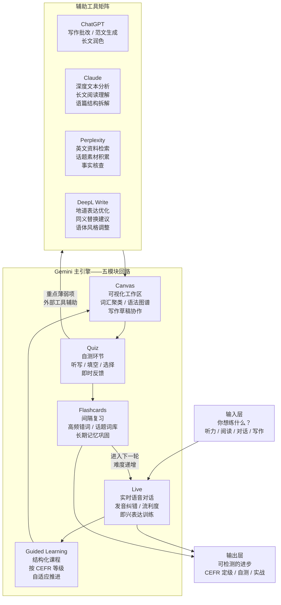

2026 年过半，用 AI 学英语这件事终于不再是“找个翻译 prompt 丢给 ChatGPT”的水平了。[离谱的英语学习指南](https://github.com/byoungd/English-level-up-tips)（English-level-up-tips）2026 版把 Gemini 的 Live / Guided Learning / Canvas / Quiz / Flashcards 五个模块串成了一条完整训练回路，同时给出了 ChatGPT、Claude、Perplexity、DeepL Write 的分工方案。读完之后你至少能回答几个问题：

- 为什么今年应该把 Gemini 作为英语学习主引擎，而不是继续用 ChatGPT 做一切
- Gemini 五个模块如何构成一条从输入到巩固的训练回路，每个环节解决什么具体问题
- 多工具分工方案怎么配——什么时候用 Claude、什么时候切 Perplexity、DeepL Write 管写作的哪个环节
- CEFR 六个等级到底代表什么能力，怎么自测定位当前水平
- 听说读写四项技能各自的训练方法，以及 AI 在每一项里的具体介入点

| → | [Gemini 训练回路](#gemini-训练回路的五个模块) | [Mermaid 流程图](#完整训练回路) | [多工具分工](#多工具分工方案chatgpt-claudeperplexitydeepl-write-各管什么) | [CEFR 详解](#cefr-等级体系详解与自测) | [FAQ](#faq) | [自测](#自测)

## 完整训练回路

图上这条回路的逻辑很明确：输入决定练什么，Gemini 五个模块构成主循环，辅助工具矩阵在自测暴露出薄弱点时介入。FLASHCARD 不只是一轮终点——间隔复习的触发机制会把你重新推回 LIVE，带着巩固过的词汇做更高难度的对话练习。

## 项目概览

**离谱的英语学习指南**的作者 byoungd 高考英语和语文都是江苏省第一（江苏卷），这份指南不是“我学英语的一点心得”，而是一份有实验数据支撑的训练方案。他在指南里反复做一个动作：把“感觉这样学有效”翻译成“这样做持续 X 周后能观察到什么变化”。

截至 2026 年 5 月：[byoungd/English-level-up-tips](https://github.com/byoungd/English-level-up-tips)，49.7k Stars，5.2k Forks，317 Commits，MIT 协议。

整份指南的结构从 README 出发，分成认知篇、方法论篇、资源篇和 2026 年新增的 AI 篇。AI 篇的定位不是“附录式补充”——它被放在认知篇之后、方法论篇之前，意味着作者认为 AI 工具已经不再是锦上添花的辅助，而是训练方案的基础设施。

## 为什么 2026 年要把 Gemini 作为主引擎

这个结论不是拍脑袋出来的。对比 2025 年底到 2026 年中的工具演进，有几个关键变化：

**语音交互的成熟度不在一个量级。** Gemini Live 的端到端语音模型延迟已经降到对话节奏可接受的范围——不是“说完等两秒再回”那种打断交流节奏的体验。这意味着你可以跟它做真正的即兴对话，而不是提前写好脚本逐句念。对口语训练来说，这一条就足够把 Gemini 推到主引擎位置。

**多模态能力让一个工具承载多个训练环节。** Gemini 能同时处理文本、语音、图片、视频，这意味着同一份学习材料（比如一段 YouTube 访谈）可以在不看字幕→看字幕→逐句精听→模仿跟读四个阶段里无缝切换，不用在不同工具间搬运上下文。

**Guided Learning 不是 Chatbot 套壳。** 很多 AI 学习工具的做法是给 ChatGPT 套一层 UI 然后叫“课程”。Gemini 的 Guided Learning 是真正按 CEFR 等级拆分的结构化内容，每一步有明确的学习目标，进度是可追踪的。

## Gemini 训练回路的五个模块

以下按实际训练步骤展开，从你打开 Gemini 那一刻开始。

### 1. Live——口语训练的主战场

Gemini Live 解决的核心问题是“不敢开口”和“开口以后不知道对不对”。

具体用法：选择一个话题（自我介绍、工作经历、最近读的书、一个技术概念的解释），打开 Live 模式，直接用语音开始说。Gemini 会实时听你说完，然后给出两种反馈：内容层面的回应（像正常对话一样接话）和语言层面的纠错。纠错不会打断对话——它等你这一轮说完，在回复里自然地给出正确表达。

训练节奏建议：

- **B1 以下**：每次 5-8 分钟，聚焦单一话题。不求流利，求“把意思传达到了”。每次会话结束后，把 Gemini 纠过的句子手动记到 Canvas。
- **B1-B2**：每次 10-15 分钟，尝试在不同话题间切换。Gemini 会开始捕捉时态一致性和介词搭配问题。
- **B2 以上**：每次 15-20 分钟，做即兴表达训练。不给话题准备时间，Gemini 随机抛问题，训练反应速度。

Live 环节最容易被忽视的动作是**回听**。Gemini 会保存对话文本记录。每次练完后花 3 分钟回看你说的原句和 Gemini 给的修正对照——这个差距就是你的高频错误模式。

### 2. Guided Learning——结构化课程推进

Live 解决表达，Guided Learning 解决系统性。它按 CEFR 等级划分课程内容，每个等级下再拆成听力理解、阅读理解、语法结构、词汇扩展四个子模块。

和普通网课不一样的地方：

- **自适应难度**：你在某个子模块的表现会影响后续内容的难度曲线。语法一直出错，它会自动增加该等级的语法练习比重，而不是机械地按固定顺序推进。
- **话题可选**：课程话题可以从你的兴趣领域选择。对程序员来说，用技术话题练英语比用“餐厅点餐”场景有效得多——因为你真的有话想说。
- **进度可量化**：每个子模块完成时会给出当前准确率和建议的下一步操作，不是模糊的“继续加油”。

Guided Learning 的定位是“地基”——你不需要每天花大量时间在这里，但每周至少推进 2-3 个单元，确保知识结构不散架。

### 3. Canvas——把碎片整理成体系

Canvas 是 Gemini 的可视化写作和整理空间。在英语学习场景里，它的用法而是三个动作：

**词汇聚类。** Live 和 Guided Learning 中积累的新词，不是零散地列一个 word list。Canvas 支持拖拽分组——按话题聚类（科技类、日常类、学术类）、按词性聚类、按掌握程度聚类。可视化的好处是你能一眼看到哪个话题域的词汇量明显薄弱。

**语法错误图谱。** 把 Live 对话中 Gemini 反复纠正的语法点整理成一张关系图。比如时态错误→具体是现在完成时和一般过去时混淆→涉及的动词列表。这张图是你语法训练的精准打击目标。

**写作草稿协作。** B1 以上的学习者可以在 Canvas 上起草短文，Gemini 在旁边做实时建议。这个场景的关键是“协作感”——而是边写边讨论用词和句式。

### 4. Quiz——暴露真正不会的东西

Quiz 的定位很明确：找出你在 Live 和 Canvas 里“感觉会了但其实没会”的东西。

Quiz 题型不是传统的四选一。Gemini 的 Quiz 支持：

- **听写题**：Gemini 朗读一段话，你逐句写出。暴露的是听力细节——连读、弱读、数字和人名的捕捉。
- **语境填空题**：给一段上下文，填入合适的词或短语。考察的是搭配和语感，不是背单词表能解决的。
- **改错题**：给你一段包含常见错误的文本，找出并修正。这是对你语法错误图谱的针对性检测。

Quiz 结束后的反馈值得仔细看。不要只看分数——把错题的类型归类，然后回到 Canvas 更新你的语法错误图谱或薄弱词汇聚类。Quiz 的输出是下一轮循环的输入。

### 5. Flashcards——间隔复习自动化

Flashcards 管的是长期记忆。Gemini 的 Flashcards 基于你做过的所有 Quiz 的错误记录和 Live 对话中的新词，自动生成卡片。

复习策略：

- **高频错词**：Quiz 中反复出错的词和搭配，卡片频率最高。
- **话题词库**：按你选的学习话题（技术、商业、学术）组织卡片集，而不是按字母顺序。记忆效率差一个数量级。
- **间隔算法**：不是固定每天复习——根据你每张卡片的正确率动态调整间隔。连续三次秒答的卡片进入低频池，犹豫超过 3 秒的卡片提高频率。

Flashcards 完成一轮后，整条回路闭合——回到 Live，用巩固过的词汇做更高难度的对话练习。

## 多工具分工方案：ChatGPT、Claude、Perplexity、DeepL Write 各管什么

Gemini 是主引擎，但主引擎不等于唯一工具。不同工具在英语学习的不同环节有各自的优势区间。

### ChatGPT：写作批改和范文生成

ChatGPT 在英语学习里的最佳角色是写作教练。它的输出风格偏流畅友好，适合做两件事：

**逐句批改。** 把你的英文写作贴进去，让它逐句标注语法问题、用词不当和表达生硬的地方，并给出修改版本和理由。要求它“在原文上改，不要重写”——否则你拿到一篇风格完全不同的文章，学不到东西。

**范文生成和对比分析。** 写完一篇短文后，让 ChatGPT 就同一话题生成一篇范文，然后逐段对比：你的句式选择和它的句式选择差在哪，你的词汇选择和它的词汇选择差在哪。这种对比比单纯“背范文”有效，因为你有自己的版本做参照。

ChatGPT 不适合做口语训练——语音延迟和自然度都达不到训练级别。写作场景是它的主场。

### Claude：深度文本分析和长文阅读

Claude 的优势是处理长文本和复杂分析。在英语学习里，它管两个场景：

**长文阅读理解。** 读一篇 3000 词以上的英文文章（经济学人长篇报道、学术论文摘要、技术白皮书），把你的理解用中文写出来，丢给 Claude 对照原文检查：你漏掉了哪些关键信息？哪些段落的理解有偏差？Claude 擅长做逐段的对照分析，输出质量比 ChatGPT 更结构化。

**语篇结构拆解。** 拿到一篇写得好的英文文章，让 Claude 拆它的论证结构：论点怎么引出、证据怎么组织、转折怎么处理、结论怎么收束。这种结构分析对学术写作和商业写作的提升很快，因为你而是在学“好文章怎么搭”。

### Perplexity：英文资料检索和话题素材积累

Perplexity 的关键价值是“用英文搜索世界”。英语学到 B1 以上，瓶颈往往不在语法和词汇量，而在“没什么可说的”——对话题缺乏知识储备。

**话题素材积累。** 选定一个你感兴趣的话题（比如自动驾驶法规、远程办公的生产力研究、某个历史事件），用 Perplexity 用英文搜索相关资料。它返回的结果是带引用来源的综述，这个过程本身就是在做英文阅读训练，同时积累了你下次对话或写作的素材。

**事实核查。** 写英文文章时用 Perplexity 核实数据、日期和专有名词的英文表达。不要用中文搜索然后自己翻译——直接用英文搜，结果的表达方式就是你应该用的表达方式。

### DeepL Write：地道表达优化

DeepL Write 的定位很窄但很精准：**它只管表达的地道程度**。你已经把意思写对了、语法也没错，但读起来就是不像 native speaker 写的——这是 DeepL Write 的管辖范围。

用法：把写好的英文段落放入 DeepL Write，它会给出多种改写方案，标注每种方案的语体风格（正式/半正式/口语化）和替换理由。选一个你认可的风格，然后对比原句和改写句的差异——这个差异就是“地道表达”和你现有表达的差距。

DeepL Write 不适合初稿阶段。语法还没改对的文本丢进去，它可能会把原本的意思改偏。把它放在写作流程的最后一步：你自己写完→ChatGPT 批改→修改→DeepL Write 润色。

## CEFR 等级体系详解与自测

CEFR（Common European Framework of Reference for Languages，欧洲语言共同参考框架）的最新版本是 3.3 版。它把语言能力分成六个等级，每个等级对应一组具体能力描述。

### 六个等级的能力画像

**A1（入门级）**
能理解并使用日常熟悉表达和基础短语。能介绍自己和他人，能回答关于住址、所有物、认识的人等简单问题。对话对方需要说得慢且清晰。

**A2（基础级）**
能理解常用表达和与个人直接相关的信息（购物、家庭、工作）。能在简单日常任务中完成信息交换。能用简单句描述自己的背景、教育经历和即时需求。

**B1（进阶级）**
能理解工作、学校、休闲中遇到的熟悉话题的主要内容。在目标语言地区旅行时能处理大多数情境。能就熟悉或个人感兴趣的话题组织简单连贯的叙述，描述经历、事件、梦想、希望和抱负，并对观点和计划给出简短理由。

**B2（高阶级）**
能理解具体和抽象话题的复杂文本主要内容，包括自己专业领域的技术讨论。能与 native speaker 进行一定程度的自然流畅互动，双方都不需要为对方刻意调整语速和用词。能就广泛话题产出清晰详细的文本，解释某一议题的观点并给出各种选项的利弊。

这是大多数人定义的“英语够用了”的门槛。B2 意味着你可以用英语工作——不是完美，是够用。

**C1（流利级）**
能理解长篇幅、高要求的文本，识别隐含含义。能流利自然地表达想法，无需明显搜索表达方式。能在社交、学术和职业场景中灵活有效地使用语言。能就复杂话题产出结构清晰、细节充实的文本，展现出对组织模式、衔接手段和连贯性的控制力。

C1 和 B2 的核心区别不在词汇量，在“自如感”。B2 是在一个有框架的讨论里表达清楚；C1 是在没有框架的讨论里即兴组织和回应。

**C2（精通级）**
能轻松理解几乎所有听到和读到的东西。能总结来自不同口头和书面来源的信息，并以连贯的方式重构论点和叙述。能精确区分意义的细微差别，即使在最复杂的情境中也是如此。

C2 而是“对语域、语体、隐含意味的控制力达到近似母语水平”。大部分英语学习者不需要以 C2 为目标——C1 已经是雅思 7.5-8.0 的水平。

### 怎么自测当前等级

**方法一：EF SET（免费在线测试）**
[EF SET](https://www.efset.org/) 是目前最靠谱的免费 CEFR 对标测试，听力加阅读共 50 分钟，结果直接映射到 CEFR 六个等级。2026 年的版本已经校准到与雅思和托福有稳定的换算关系。缺点是只测听力和阅读，不测口语和写作。

**方法二：CEFR 自评表对照**
CEFR 官方提供了每个等级的自评检查表（Self-assessment Grid），按听、说、读、写四个维度列出具体能力描述。你逐条对照，诚实回答“这个我做得到”还是“做不到”。自评表的偏差通常偏高——人在自评时会低估自己的问题。建议在自评基础上降半级作为保守定位。

**方法三：录音自检法**
选择 CEFR 口语能力描述中的一个场景（比如 B1 的“描述一次旅行经历”或 B2 的“就一个争议话题表达立场并给出理由”），给自己 1 分钟准备时间，然后录 2 分钟的回答。录完后不要马上听——隔一天再听，你会更客观地判断自己的流利度、语法准确度和表达丰富度。对照等级描述打分。

**方法四：写作自检法**
拿 CEFR 写作能力描述中的对应任务，写 250-400 词的短文。丢进 Grammarly 或 ChatGPT 检查语法错误密度——B1 的典型错误率是每 100 词 3-5 个语法或搭配错误，B2 降到 1-2 个，C1 降到 1 个以下且错误类型集中（不再散布在各语法点上）。

## 听说读写的 AI 训练方案

### 听力

听力训练的核心矛盾是“能读懂但听不懂”。这不是词汇量问题，是耳朵不熟悉语音流的问题。AI 在听力训练里的角色是：

- **逐句精听 + 影子跟读**：用 Gemini Live 播放一段话（或给它一段文本让它朗读），你逐句听写，然后影子跟读。AI 检查你跟读的准确度。
- **变速训练**：同一段材料 0.75 倍速→正常速→1.25 倍速各听一遍。1.25 倍速能跟上的内容，正常速就会显得慢。
- **口音暴露**：让 Gemini 用不同口音（英音、美音、澳音、印度音）朗读同一段内容。而是通过各种口音的对比，你的大脑会提取语音的关键特征，不再依赖某种特定发音模式。

### 口语

口语的主要矛盾而是“不敢说”和“说了不知道对不对”。

- **每日最低剂量**：每天至少打开 Live 说 3 分钟。下限设得足够低，低到没有任何借口跳过。
- **话题轮换制**：周一熟悉话题（自我介绍、日常），周三半熟悉话题（工作项目描述、观点表达），周五陌生话题（Gemini 随机抛题）。陌生话题日的训练效果是熟悉话题日的 3 倍——因为你在调用真正的语言组织能力，而不是回忆背过的内容。
- **录音存档**：每周选一次对话保存录音，三个月后回听。你会感谢自己做了这件事。

### 阅读

阅读最容易陷入“读完就忘”的陷阱。AI 的介入点而是帮你建立阅读后的输出闭环：

- **读后复述**：读完一篇英文文章，关掉原文，用英文口头复述主要内容。复述过程暴露的是你真正理解了多少——能复述出来的才是你的。
- **改写训练**：用 Claude 分析文章结构后，用自己的话改写其中一段。改完丢给 ChatGPT 对比原段，找出你的表达和原段表达的系统差距。
- **领域深耕**：选一个你真正感兴趣的垂直领域（而是你的专业或爱好），连续读该领域的内容。领域词汇和句式是高度重复的——读 10 篇同一领域的文章，比读 10 篇不同领域的文章积累更扎实。

### 写作

写作训练的最大浪费是“写了一堆没人给你有针对性的反馈”。

- **三遍法**：第一遍只管把意思写出来，不查词典不纠结语法。第二遍自己改语法和用词。第三遍丢给 ChatGPT 批改。把 AI 放在第三遍而不是第一遍——否则你学不到自己纠错的能力。
- **同义改写训练**：写完一段话，用 DeepL Write 看 3 种不同风格的改写，然后用你自己的话再写一遍，把三种风格中有用的表达吸收进去。这个动作比背单词表有效得多——词汇是在使用中被记住的。
- **主题写作月**：一个月只写一个话题的不同角度。第一周写观点陈述，第二周写反对意见，第三周写案例研究，第四周写综述。同一话题的词汇和句式反复激活，记忆深度远超分散练习。

## FAQ

**Q1: 免费用户能用这套方案吗？**

能跑，但有天花板。Gemini Live 和 Guided Learning 目前对免费用户有每日使用次数限制——大概每天 3-5 轮 Live 对话和 2 个 Guided Learning 单元。如果你每天的英语训练量在 30 分钟以内，免费方案够用。超过这个量，或者需要 Canvas 和 Flashcards 的完整功能，需要付费方案。Claude 和 ChatGPT 同样有免费额度限制。Perplexity 的免费版每天 5 次 Pro Search，DeepL Write 免费版有字符数限制但日常够用。

实际结论：A1-B1 阶段免费方案完全够用。B2 以上，训练量会自然涨到超出免费额度，到时候再付费——不是为了付费而付费，是因为你真的在用。

**Q2: CEFR 每个等级大概需要多长时间跨越？**

剑桥大学的估算：在英语环境中，从 A1 到 A2 约需 90-100 小时的有效学习时间，A2 到 B1 约 180-200 小时，B1 到 B2 约 200-250 小时，B2 到 C1 约 250-300 小时。注意这里的“有效学习时间”不等于“坐在书桌前的时间”——刷手机时开着英文播客当背景音不算有效学习。

在中国非英语环境下（每天靠 AI 营造语言环境），这些数字大概乘以 1.3-1.5。如果每天有效学习 1 小时，从 A1 到 B2 大约需要一年半到两年。这个时间不长，但需要持续。

**Q3: 指南里说的训练回路，每天需要花多长时间？**

作者的建议是“最小可用剂量”——每天至少保证 30 分钟。这 30 分钟的推荐分配：Live 口语 10 分钟，Guided Learning 10 分钟，Quiz 5 分钟，Flashcards 5 分钟。Canvas 的词汇整理和语法图谱建议每周集中做一次，1-2 小时。

如果某天实在没时间，只保留一个模块：Live 对话 3 分钟。宁少勿断。

**Q4: 我的词汇量大概 4000，语法一团糟，应该从哪个模块开始？**

词汇量 4000 大概对应 A2 到 B1 的过渡期。这个阶段最优先的是 Guided Learning 中的语法子模块——而是通过 Quiz 找出你具体卡在哪些语法点上，然后在 Canvas 上聚焦修正。语法问题在这个阶段会严重拖累口语和写作，不解决的话后面每一步都走不稳。

词汇不用专门花时间背——让 Flashcards 做它的工作。你需要的是在有意义的语境里反复遇到这些词，而不是对着词表抄写。

**Q5: 雅思/托福考试和 CEFR 等级怎么对应？**

雅思 4.0-5.0 对应 B1，5.5-6.5 对应 B2，7.0-8.0 对应 C1，8.5-9.0 对应 C2。托福 iBT 57-86 对应 B1，87-109 对应 B2，110-120 对应 C1。

但这套 AI 训练方案不是考试突击方案。如果你三个月后要考雅思，你需要的是真题训练和考试技巧，不是用 Gemini Live 慢慢练对话。AI 训练回路的目标是语言能力的长期建设——能力到了，考试成绩自然上来，但反过来不成立：刷题刷出来的高分往往经不起真实对话的检验。

**Q6: 口语练了三个月，感觉还是说不流利，哪里出了问题？**

80% 的情况，问题不在口语本身，在听力输入不够。流利度的前置条件是大脑里有足够的语音模板——你听过的英文对话越多，可供调用的表达模式就越多。口语练得多但听力输入少，就像一直在输出但没有补给。

检验方法：你每天花在英语听力上的时间（精听、泛听加在一起）是否大于等于口语训练时间？如果口语时间远大于听力时间，把比例倒过来——先加量听力，口语流利度会自然改善。

另外 20% 的情况是“完美主义卡顿”——每句话开口前都在脑子里编译一遍才敢说。这个毛病只能用 Live 反复练来克服，让 Gemini 给你制造“来不及想就必须说”的时间压力。

**Q7: 有没有什么坑是初学者最容易踩的？**

最大的坑是把 AI 当词典用——看到不认识的词就停下来查，读一篇文章中断十几次。阅读流畅性一旦被打断，从上下文学词汇的机制就失效了。正确做法：第一遍读完再回头查词，或者只查出现三次以上的生词。

第二大坑是过早追求“地道表达”。A1-B1 阶段，首要任务是“能被理解”，不是“听起来像 native speaker”。用一个 simple but correct 的句子比用一个别扭的 idioms 要好得多。地道的追求放在 B2 以后，那时你的基础够扎实，不会本末倒置。

## 自测

1. 用 EF SET 测一次完整的听力和阅读水平，记录你的 CEFR 等级。然后打开 Gemini Live，就“介绍你的工作和爱好”这个话题说 3 分钟，录下来。对照 CEFR 口语自评表，你的口语等级和测试等级差了几级？（差距超过 1 级的，口语是你的训练优先级。）

2. 拿最近一周读过的 3 篇英文文章，关掉原文，尝试用英文口头复述每篇的 3 个重点信息点。复述不出来的信息点是什么类型——数据细节、抽象概念、还是事件因果关系？不同类型的信息丢失对应不同的阅读理解短板。

3. 写一段 300 词的英文短文，话题自选。用三遍法处理：第一遍自己写，第二遍自己改，第三遍丢给 ChatGPT 批改。统计第三遍被标注的问题类型分布——语法错误、搭配问题、表达不自然、逻辑连接——哪个类型最多，就是你下一个月的写作训练重点。

4. 检查你的 AI 工具使用记录：过去一个月，你和 Gemini Live 对话了几次？在 Canvas 上整理了多少词汇？Quiz 做了几次？如果其中任何一项为零，你的训练回路是断的——断掉的环节就是你进步最慢的原因。

5. 选一段 2 分钟的英文播客或 YouTube 视频，先不看字幕听一遍（记下理解百分比），再看字幕听一遍（记下“原来这里是这个词”的数量），最后影子跟读一遍并录下来。回听自己的录音，找出发音和原文最不一致的 3 个音节或单词——这些是你听力盲区在口语上的投射。

6. 翻开你最近一个月积累的生词本。按话题重新分类——你哪个话题域的词汇量最薄？是日常对话用词、工作专业术语、还是学术抽象词？最薄的那个话题域应该成为你接下来 4 周 Flashcards 和阅读训练的主题。

---

阅读路径：README → AI 章节（2026 版）→ CEFR 等级体系 → 训练回路设计 → 开始每天 30 分钟的最小可用剂量。