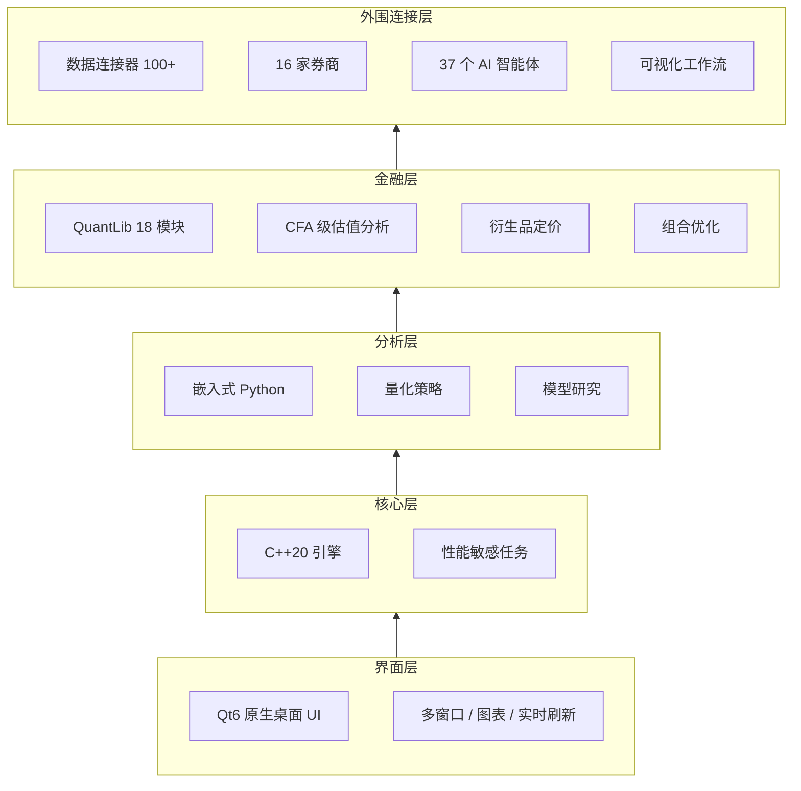

Bloomberg Terminal 是成熟、完整、昂贵且封闭的；FinceptTerminal 走的是另一条路——用开源方式把数据接入、量化分析、AI 辅助研究、交易连接和可视化工作流装进同一个桌面环境。

第一次看这个项目，容易被人一串数字拽着走：37 个 AI 智能体、100+ 数据连接器、16 家券商、18 个 QuantLib 模块、C++20 + Qt6 + 嵌入式 Python。数字本身不重要，值不值得看的是三个问题：

- 它到底解决什么问题。
- 哪些能力已经公开可验证，哪些只是路线图或可选集成。
- 你应该按“普通用户”“研究者”还是“贡献者”哪条路径上手。

这篇文章就回答这三个问题——帮你判断这个项目值不值得试、适合谁、从哪条路径开始。

## 阅读导航

- 想先判断值不值得试：直接看“先看结论”。
- 想理解它到底是什么：看“项目定位”和“核心能力拆解”。
- 想马上安装：看“如何开始”和“安装和版本的几个关键边界”。
- 想评估研发价值：看“二次开发视角”。
- 想快速排雷：看“常见问题”和“实操建议”。

## 校验范围

本文基于 FinceptTerminal 的公开 README、Releases 页面与仓库对外描述整理，重点校验了产品定位、安装方式、固定依赖版本、平台说明、功能分层与路线图表述。

同时要明确两点边界：

- 文中的功能版图以公开文档为依据，不等于我已逐项实测每个数据源、券商和智能体。
- 对于 star 数、fork 数、最新 release 等高频变动信息，本文尽量采用“范围判断 + 入口指引”，避免把动态数据写成静态结论。

## 学习目标

读完本文后，你应该能做到：

- 用一句话说明 FinceptTerminal 的产品定位与技术路线。
- 分辨它已经落地的核心能力、可选能力和路线图能力。
- 根据自己的角色，选择安装包、快速启动脚本、Docker 或源码构建。
- 避开最常见的安装误区，尤其是版本固定和平台支持边界。
- 判断它更适合“研究工作台”还是“直接生产交易终端”。

## 先看结论

如果你只想先做去留判断，先看下面这张表。

| 你是谁 | 值不值得试 | 推荐入口 | 关键原因 |
| ------ | ------ | ------ | ------ |
| 独立投资者 / 研究型交易者 | 值得 | 直接下载安装包 | 能把数据、研究、AI 辅助和部分交易能力放到一个桌面工作台里 |
| 量化研究员 | 值得 | 安装包或快速启动脚本 | C++20 原生桌面 + 嵌入式 Python 的组合比较少见，适合做研究台而不是只跑脚本 |
| 教学 / 金融实验室 | 值得 | 安装包 + 课程化演示 | 有 CFA 级分析、可视化工作流、数据源覆盖广，适合课堂展示 |
| C++ / Python 贡献者 | 值得 | 源码构建 | 仓库已经提供固定版本依赖、预设构建和贡献文档 |
| 想找成熟机构生产系统的人 | 谨慎 | 先做沙盒验证 | 它很强，但仍是快速演进中的开源项目，不应直接把 README 当生产 SLA |

## 项目定位：它不是“开源版 Bloomberg”，而是开源金融研究工作台

FinceptTerminal 在 README 中自称「Bloomberg-terminal-class open-source financial intelligence platform」，直译很容易让人误解成「已经全面等价 Bloomberg Terminal」。实际它是在开源环境中，组合出一套接近专业金融终端的核心工作流，而不是复刻 Bloomberg 的全部数据授权、机构基础设施和商业服务。

这个区分决定了你的预期：

- 如果你要的是一个可扩展、透明、可研究、可改造的桌面金融工作台，FinceptTerminal 很有吸引力。
- 如果你要的是机构级别的数据授权、稳定性承诺、合规背书和商业支持闭环，它还不能被简单等同为商业终端替代品。

从公开信息看，这个项目当前最清晰的技术主线是：

- C++20 负责原生桌面性能。
- Qt6 负责跨平台界面与渲染。
- 嵌入式 Python 负责分析与模型扩展。
- QuantLib 提供定量分析底座。
- 外层再叠加数据连接、交易连接、AI 智能体和可视化工作流。

这套路线的价值在于，它没有走常见的 Electron + Web 前端路线，而是明显把“桌面性能、图形界面、分析扩展”视为同一件事来设计。

## 核心能力拆解：哪些卖点最值得关注

### 1. 原生桌面架构

README 明确写到，FinceptTerminal v4 是纯原生 C++20 桌面应用，UI 使用 Qt6，分析层使用嵌入式 Python。它的产品哲学不是「浏览器包桌面壳」，而是把桌面程序本身当成金融研究终端来做。

原生桌面意味着：

- 原生桌面对多窗口、图表、实时刷新和复杂交互通常更友好。
- 嵌入式 Python 保留了研究人员熟悉的分析生态。
- C++ 核心层与 Python 分析层分工明确，更接近“性能敏感逻辑在底层、探索性分析在上层”的量化工作流。

### 2. AI 智能体体系

项目当前公开宣称支持 37 个 AI 智能体，覆盖 Trader / Investor、Economic、Geopolitics 等框架，并支持本地 LLM（如 Ollama）和多云厂商 Provider。

这个能力真正有价值的地方，不是“能聊天”，而是它把不同投资框架做成了可切换分析视角。例如 Buffett、Graham、Lynch、Munger、Klarman、Marks 这些名字，代表的不是人设，而是不同的估值、周期、风险偏好与研究方法。

如果你是研究型用户，这类多视角分析的意义在于：

- 同一个标的可以被不同框架交叉审视。
- 你可以把智能体当成“结构化研究模板”，而不是结论生成器。
- 本地 LLM 支持使其更适合隐私敏感环境做初步部署测试。

### 3. 数据连接能力

项目公开资料中反复强调 100+ 数据连接器，列出的代表包括 Yahoo Finance、Polygon、Kraken、FRED、IMF、World Bank、AkShare、政府 API，以及可选的 Adanos 市场情绪接入。

关键不在数量，在覆盖面：

- 行情数据：股票、加密货币等市场行情。
- 宏观数据：FRED、IMF、World Bank 等宏观与经济序列。
- 区域数据：AkShare 这类对中文用户更友好的本土数据入口。
- 另类数据：海事追踪、卫星、关系映射、情绪数据等。

这说明 FinceptTerminal 的目标不是只做 K 线软件，而是希望把基本面、宏观、情绪与交易入口尽量放进同一个研究环境里。

### 4. 交易与券商接入

根据 README，项目当前强调的交易相关能力包括：

- 加密市场的 Kraken / HyperLiquid WebSocket 实时流。
- 股票 / 证券侧的 16 家券商接入。
- 算法交易与 Paper Trading。
- 多账户交易与实时流能力已在已交付能力中出现。

这一块要特别注意边界：有交易接入，不等于所有市场和账户都能无缝生产使用。对普通读者更实用的理解是，FinceptTerminal 已经具备“研究到执行”的连接野心，但你在真实资金环境中仍应逐家券商、逐类资产验证权限、稳定性和订单流程。

### 5. QuantLib 与 CFA 级分析

README 中把量化分析概括为 DCF、组合优化、风险指标、衍生品定价，并单独强调 18 个 QuantLib 模块。这意味着它至少想覆盖三类典型分析任务：

- 资产定价与估值。
- 投资组合构建与风险评估。
- 衍生品与固定收益的更深层定量分析。

“CFA 级”更适合理解成分析覆盖范围和知识结构，而不是某种官方认证。对读者来说，这里的重点不是营销词，而是它确实把价值分析、风险度量、组合优化、衍生品定价这些金融分析核心板块摆到了台面上。

## 功能地图：五层堆栈

与其记一串功能名，不如把 FinceptTerminal 当成五层堆栈：



| 层级 | 作用 | 对用户的意义 |
| ------ | ------ | ------ |
| 界面层 | Qt6 原生桌面 UI | 更像专业终端，而不是网页壳 |
| 核心层 | C++20 引擎 | 处理性能敏感任务与桌面交互 |
| 分析层 | 嵌入式 Python | 让量化分析与实验更灵活 |
| 金融层 | QuantLib + 分析模块 | 承担估值、风险、衍生品等专业计算 |
| 外围连接层 | 数据源、券商、AI 智能体、工作流 | 形成「研究到执行」的完整工作台 |

理解了这个分层，你会看到它的真正卖点不是单点突破，而是把原本分散在多种工具里的事情，尽量合并到一个桌面环境中。

## 如何开始：按角色选择路径，不要把所有步骤混在一起

这是原稿最大的问题之一。安装包、快速脚本、Docker、源码编译分别服务不同读者，混成一锅会直接拉低可用性。

### 路径 A：普通用户

如果你的目标只是尽快体验产品功能，优先走安装包。

README 当前给出的安装方式是：

- Windows x64：安装包。
- Linux x64：`.run` 安装包。
- macOS Apple Silicon：`.dmg` 安装包。

这条路径为什么最优？因为项目的依赖版本钉得很死，源码构建对 CMake、Ninja、Qt、Python、编译器版本都有要求。普通用户没有必要为了“更极客”而先吃构建复杂度。

### 路径 B：想快速试用、但愿意让脚本帮你构建的开发者

如果你在 Linux 或 macOS 上，README 提供了 Quick Start：

```bash
git clone https://github.com/Fincept-Corporation/FinceptTerminal.git
cd FinceptTerminal
chmod +x setup.sh && ./setup.sh
```

这条路径适合你在本地快速判断“项目能不能跑起来”，而不是精细控制每个依赖。README 说明 `setup.sh` 会处理编译器检查、CMake、Qt6、Python、构建与启动。

需要注意的是，Windows 不走这条路径，README 明确写了 Windows 使用手动构建步骤。

### 路径 C：需要隔离环境的用户

项目提供了 Docker 方案：

```bash
docker pull ghcr.io/fincept-corporation/fincept-terminal:latest
docker run --rm -e DISPLAY=$DISPLAY -v /tmp/.X11-unix:/tmp/.X11-unix \
  ghcr.io/fincept-corporation/fincept-terminal:latest
```

但这里必须讲清楚一个边界：README 已明确提示 Docker 主要面向 Linux，macOS 和 Windows 需要额外的 XServer 配置。也就是说，Docker 不是“万用一键解法”，而是偏 Linux 图形环境的折中方案。

### 路径 D：贡献者 / 深度定制用户

如果你真的要改代码，才应该进入手动构建。

README 当前强调的固定版本包括：

- CMake 3.27.7
- Ninja 1.11.1
- Qt 6.8.3
- Python 3.11.9
- MSVC 19.38 / GCC 12.3 / Apple Clang 15.0

推荐的构建方式不是原稿里那种通用 `mkdir build && cmake ..` 流程，而是仓库文档已经给出的 CMake presets：

```bash
git clone https://github.com/Fincept-Corporation/FinceptTerminal.git
cd FinceptTerminal/fincept-qt
cmake --preset macos-release
cmake --build --preset macos-release
```

Linux 与 Windows 也分别有对应的 `linux-release` 和 `win-release` 预设。这个细节很重要，因为它比手写通用命令更贴近项目自己的维护方式。

## 安装和版本的几个关键边界

### 1. 版本固定不是建议，而是前提

README 明确写了 Versions are pinned。对于这类 C++ / Qt 项目，这意味着依赖版本漂移很容易直接导致构建失败，或者跑出不稳定二进制。普通用户优先安装包，贡献者优先照着文档版本来，不要“顺手装个更新版试试”。

### 2. macOS 支持边界要分“发行版”和“历史版本”看

当前 README 的下载表重点写的是 macOS Apple Silicon。公开 Releases 页面里可以看到较早版本曾提供过 macOS x64 / Universal 资产，但当前主文档不再把 Intel Mac 作为主推荐路径。

这意味着更稳妥的写法不是“完全不支持 Intel Mac”，也不是“Intel Mac 当然没问题”，而是：

- 当前主文档重点支持 Apple Silicon。
- 历史版本曾发布过 Intel / Universal 资产。
- 如果你是 Intel Mac 用户，应以当前 Releases 实际可下载资产和仓库说明为准，不要只看旧文章。

### 3. README 与 Releases 页可能存在短时信息不同步

我在核对时发现，README 下载表当前指向 v4.0.2，但公开 Releases 页面 latest 标记显示为 v4.0.1。遇到这种情况，最稳妥的原则是：

- 安装时以实际 Releases 页面与可下载资产为准。
- 文章里避免把这类快速变化的信息写成绝对静态事实。

这也是为什么技术导读类文章应尽量少写“精确到个位的 star 数、fork 数、版本号结论”，除非你准备高频维护。

## 适合哪些场景，不适合哪些场景

### 适合

- 想把数据、研究、AI、交易入口尽量集中到一套桌面工具里的人。
- 想研究开源金融终端架构的人。
- 需要把 Python 分析能力和桌面交互结合起来的人。
- 教学展示、实验室课程、策略研究演示。

### 不适合

- 把 README 功能表直接当生产环境交付承诺的人。
- 只想找一个超轻量行情查看器的人。
- 不愿意处理图形环境、依赖版本和平台差异，但又坚持源码编译的人。

## 二次开发视角：为什么这个项目对开发者有吸引力

从公开文档看，FinceptTerminal 不是只扔出一个单体程序——README 在贡献部分单列了：

- 数据连接器。
- AI 智能体。
- 分析模块。
- C++ 界面屏幕。
- 文档。

同时，项目还公开强调了可视化工作流、MCP 工具集成、AI Quant Lab 等方向。很多所谓的开源金融工具只是把一个单体程序扔出来，没有清晰的扩展边界。FinceptTerminal 至少在叙事和目录结构上，已经在主动把自己塑造成一个可长期演进的平台。

## 常见问题

### Q1：我应该先装安装包，还是直接源码构建？

如果你不是来改代码，先装安装包。源码构建适合贡献者和深度定制用户，不适合第一次体验产品的人。

### Q2：Docker 是不是最省事？

不一定。对 Linux 图形环境，它可能更省事；对 macOS 和 Windows，它反而会因为 XServer 与图形转发变得更折腾。

### Q3：它真的能替代 Bloomberg Terminal 吗？

更准确的答案是：它试图覆盖专业金融终端的一部分核心工作流，并且在开源世界里已经很少见；但在数据授权、商业支持、合规和机构级交付上，不应直接把它与 Bloomberg 画等号。

### Q4：文档里说有 37 个 AI 智能体、100+ 数据连接器、16 家券商，这些数字要怎么理解？

把它们理解为项目当前公开能力版图，而不是你在任何环境里都能零配置立刻用满的功能集合。真正落地时，仍然取决于平台、数据源、账户、网络、配置和具体模块成熟度。

### Q5：这项目适合中国用户吗？

有一定吸引力。原因主要是它公开提到了 AkShare 这类中文用户更熟悉的数据入口。但是否真正适合你的工作流，仍要看你是否依赖 A 股、期货、基金等本土数据，以及你是否需要本地化文档与本地券商深度集成。

## 实操建议：第一次上手别超过 30 分钟

如果你准备现在就试，建议按下面顺序做：

1. 先看 Releases 页面，确认你平台当前可下载的实际资产。
2. 先走安装包，不要一上来折腾源码构建。
3. 启动后优先验证三个模块：数据源、研究视图、AI 智能体。
4. 如果你确实要开发，再去看 `fincept-qt` 的构建说明和贡献文档。
5. 如果你想做真实交易，先用 Paper Trading 或沙盒环境验证，不要直接上真钱。

## 练习与自测

### 练习 1：角色判断

判断你更适合哪条路径，并说明原因：

- 安装包
- Quick Start
- Docker
- 源码构建

### 练习 2：边界判断

请用一句话分别解释下面三件事为什么不能混为一谈：

- 开源金融终端
- 商业数据终端
- 真实资金交易系统

### 自测清单

- 我能解释 FinceptTerminal 的技术路线，而不只是复述功能列表。
- 我知道哪些信息来自 README，哪些属于路线图。
- 我知道为什么普通用户不该优先源码构建。
- 我知道 Docker 在不同桌面平台上的限制。
- 我知道真实交易前必须先做沙盒验证。

## 结语

FinceptTerminal 最值得关注的地方，不是「它是否已经 1:1 复刻 Bloomberg」，而是它把一个长期被商业终端垄断的工作台问题，重新放回了开源语境里。原生 C++20 桌面、Qt6 界面、嵌入式 Python、QuantLib、AI 智能体、多数据连接、多券商接入——这些元素单看都不新，但把它们组织成一个统一产品，在开源世界里并不常见。

把它当成一套正在快速进化的开源金融研究工作台，比当成一句营销口号，更容易看到它的实际价值。

## 参考入口

- [GitHub 仓库](https://github.com/Fincept-Corporation/FinceptTerminal)
- [Releases 页面](https://github.com/Fincept-Corporation/FinceptTerminal/releases)
- [README 文档](https://raw.githubusercontent.com/Fincept-Corporation/FinceptTerminal/main/README.md)
