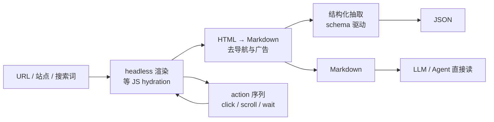

# Firecrawl：把 Web 转成 LLM 能直接读的 Markdown

让 LLM 读现代网页，总会撞上三件事：JS 没渲染，你只拿到空壳；HTML 标签把有用信息埋进噪音；爬到一半被 Cloudflare 拦下。[Firecrawl](https://github.com/firecrawl/firecrawl) 的定位不是爬虫，而是一个 web context API——它把「渲染、清洗、抽取」这三段脏活封装成一次调用，一个 URL 进去，一份干净的 Markdown 出来，直接喂给 LLM 或 Agent。

这篇文章的判断是：Firecrawl 值钱的地方不在爬取本身，而在于它把「网页 → LLM 可用上下文」这条链路的工程成本集中到一个端点里。下面拆它的接口形态、自托管边界，以及什么时候值得用它，什么时候该自己写。

## 一条数据流：从 URL 到 Markdown

Firecrawl 在「裸 HTML」和「能喂给 LLM 的内容」之间加了一层处理管线：



外部的接法有四种：REST API、Python/Node SDK、CLI、MCP server。对 Agent 来说，最常用的是 MCP——一行配置就能让 Claude Code 这类工具多出联网能力，见下文。

先拆开两条容易被混在一起读的主线，后面才不会看晕：一条是**内容管线**，处理「单个 URL 怎么变成干净 Markdown / JSON」，决定输出质量；另一条是**任务编排**，处理「一批 URL 或整个站点怎么送进来、怎么拿结果」，决定使用是方便还是繁琐。`scrape` 只走内容管线；`crawl`、`batch scrape` 和 `search` 在编排层做批量与调度；`extract` 在内容管线末端加一步 LLM 抽取。

## 四个端点对应四类场景

Firecrawl 把「读 Web」切成几个端点，每个对应一类用法：

| 端点 | 用途 | 典型用法 |
|------|------|----------|
| `search` | 搜并返回完整页面内容 | 搜「LLM evaluation 论文」带全文 |
| `scrape` | 单 URL 转 markdown / HTML / screenshot / JSON | 单页结构化抽取 |
| `crawl` | 从种子 URL 出发跟随链接全站爬取 | 整个 docs site、整个博客 |
| `batch scrape` | 只爬给定的一批 URL，不跟随链接 | 一次性把一堆已知 URL 拉成 markdown |

`search` 和传统搜索 API 的区别在于返回粒度：它带回的是清洗后的完整正文，而不是标题 + 摘要——这决定了它能不能直接被拿去当 RAG 语料。`crawl` 与 `batch scrape` 的区别在编排策略：前者不知道目标页有哪些，靠链接发现；后者你手上一份 URL 清单，它不扩散。按「要不要跟链接」来判断用哪个，比记端点名更可靠。

外加一个 `extract`：用自然语言或 JSON Schema 描述想要的结构，Firecrawl 在服务端用 LLM 从页面里抠出字段。

## 为什么是 LLM Context API，而不是爬虫

普通爬虫（Scrapy、Playwright、Crawlee）给你的是 HTML 字符串或裸 JSON，parse 标签、去噪、提取正文都得自己来。Firecrawl 在中间层替你做了这几件事：

1. **JS 渲染**：headless 浏览器跑 React / Vue 这类 SPA，等 hydration 完成再 snapshot。
2. **Markdown 转换**：HTML → Markdown，保留代码块、表格、链接、标题层级，去掉导航、页脚、广告。
3. **结构化抽取**：`extract` 端点接受 JSON Schema 或自然语言描述，把页面里的字段抠成结构化 JSON。
4. **绕过反爬**：内置代理轮换、UA 轮换、stealth 模式。效果取决于目标站点的反爬强度，自托管时还要自己配代理池。
5. **交互序列**：可以 click / scroll / write / wait / press 之后再抽取，处理「点开翻页才看到列表」这类场景。

输出默认是 Markdown（保留可读性，也贴合 LLM 的上下文长度），也可以按需取 HTML、screenshot 或 JSON。

## 最小可跑示例

```python
from firecrawl import Firecrawl

app = Firecrawl(api_key="fc-...")

# 1. 单 URL → Markdown
doc = app.scrape("https://example.com/article", formats=["markdown"])
print(doc.markdown)

# 2. 搜索并带回全文
results = app.search("LLM evaluation benchmarks 2026", limit=5)

# 3. 整站爬取（阻塞等完成；要异步轮询就用 start_crawl 拿 job id）
job = app.crawl(
    url="https://docs.example.com",
    limit=500,
    include_paths=["/guide/*"],
    exclude_paths=["/api/*"],
)

# 4. extract：用 schema 从页面抠字段
schema = {
    "type": "object",
    "properties": {
        "name": {"type": "string"},
        "price": {"type": "number"},
    },
}
extracted = app.extract(
    ["https://shop.example.com/p1", "https://shop.example.com/p2"],
    schema=schema,
)
```

CLI 是全局安装的 `firecrawl-cli`：

```bash
npm install -g firecrawl-cli
firecrawl login
firecrawl scrape https://example.com --format markdown
```

## MCP：让 Agent 联网变成一行配置

Firecrawl 提供 [MCP server](https://docs.firecrawl.dev)，不用写 Python 绑定，直接让 Claude Code / Cursor / Continue 这类 MCP-aware 的 agent 通过 `mcp.json` 接入：

```json
{
  "mcpServers": {
    "firecrawl": {
      "command": "npx",
      "args": ["-y", "firecrawl-mcp"],
      "env": {"FIRECRAWL_API_KEY": "fc-..."}
    }
  }
}
```

接好之后，agent 多了 `firecrawl_scrape` / `firecrawl_crawl` / `firecrawl_search` 三个工具。把「给 agent 联网」从手写 Python 调用，简化成声明式地加一个 MCP server。

## 一个任务流：从商品页抽出结构化字段

把抽象机制串起来看一次真实读取。假设要给一个电商站的两张商品页抽 `name` 和 `price`：

1. 先用 `scrape` 各拉一次 Markdown，确认打开的速度、价格是服务端渲染还是 JS 填充。若价格是 JS 渲染的，`scrape` 默认等 hydration，能拿到最终值。
2. 再用 `extract` 传这两个 URL 加一份 JSON Schema，Firecrawl 在服务端用 LLM 把字段抠成结构化 JSON。
3. 注意 `extract` 背后是 LLM 调用，长页面会把大量内容送进模型，token 成本随页面长度浮动，批量前先试一两个页面估成本。

这条链路把「渲染、转换、抽取」三个环节串进一次调用，读 Web 对应用层保持一个简单接口。

## 它拿不到的页面

再强的工具也有边界，先知道 Firecrawl 不擅长什么，比知道它擅长什么更省时间：

1. **登录墙之后的内容**：需要登录态（session / cookie）才能看的页面，裸 URL 拿不到。官方没有直接给账号凭证的能力，得靠浏览器登录后导出 cookie 再传入，属于高级用法。
2. **验证码关卡**：碰到 CAPTCHA，代理轮换和 stealth 都未必能过。这类页面对任何自动化方案都是硬门槛，别指望一次 scrape 解决。
3. **onclick 式懒加载**：数据靠滚动触发加载、但交互事件绑在特定元素（而不是标准翻页）的页面，默认渲染可能漏内容。需要先摸清加载触发方式，再决定要不要上 action 序列。
4. **Robots / 合规**：站点靠 `robots.txt` 表达的抓取意愿，以及目标站的服务条款，都要自行评估。自托管反爬代理池只是技术手段，不豁免合规责任。

判断方法：先用 `scrape` 拉一次，看返回的 markdown 里有没有目标内容、页面是否返回了反爬占位页。省得在 batch 之前把整批 URL 全跪一遍。

## 与同类工具的边界

| 工具 | 定位 | 强项 | 弱项 |
|------|------|------|------|
| **Firecrawl** | LLM context API | 端到端（爬 + 渲染 + 抽 + 结构化）+ MCP + agent ready | AGPL-3.0（自托管要开源）+ 服务端按量计费 |
| **jina reader** | 单页 reader | 免费层慷慨、输出干净 Markdown | 不擅长批量爬、没有 extract 端点 |
| **tavily** | 搜索 API | 搜索结果带 LLM 摘要 | 不擅长整站爬 |
| **playwright** | 浏览器自动化 | 完全可控、JS 交互 | parse、反爬都得自己处理 |

简单说：愿意为开箱即用付费，用 Firecrawl；愿意写代码，用 Playwright。

## 自托管会碰到什么

主仓库是完整的 TypeScript + Playwright + Redis 队列实现，能 docker-compose 拉起来。但有几点要提前想清楚：

1. **AGPL-3.0**：fork 或修改后必须开源。做闭源产品，得用 hosted 版本（[firecrawl.dev](https://firecrawl.dev)）。
2. **反爬代理池**：自托管默认没有商业代理，跑一段时间就会被 Cloudflare 类防护拦下，得自己配 proxy rotation。
3. **JS 渲染成本**：headless Chrome 是吃内存大户，worker 起得越多，单机内存占用越高，按规模预留资源。
4. **LLM 抽取的 token 成本**：`extract` 背后是模型调用，长页面 token 消耗要算进账单。

## 什么时候用 hosting，什么时候自己写

给内部 agent 补联网、不介意付费，hosted 版本最省事：不用维护渲染集群，也拿到了代理池和反爬。要尽量省钱，先试无 key 的免费档（限流、按 IP），或者用 jina reader 配合自己写的一层批量调度。

做 to C 产品且预算吃紧，优先自己写 Playwright + parse 层，把 Firecrawl 这类服务当成兜底而不是默认路径。

还有一类场景干脆不必用 Firecrawl：你只要某个 API 已经提供的数据，或者目标站本身就返回干净的 HTML（老站、静态文档站），直接 HTTP 请求 + 一个正文解析库，开销最小，也不引入浏览器和代理这两层不确定性。Firecrawl 的价值在你「必须渲染 JS 或搞定反爬」时才兑现。

简单对照：单次拉取、内容静态 → 手写；批量、带 JS、有反爬 → Firecrawl hosted；闭源产品、要掌控全部链路 → 自托管（先想清 AGPL 和代理成本）；纯原型验证 → jina reader + 自己的调度。

## 仓库数据

- 仓库：`firecrawl/firecrawl`
- 主页：https://firecrawl.dev
- 协议：AGPL-3.0（自托管强制开源）
- 主语言：TypeScript（API server）+ Python SDK + Node SDK
- stars：158.5k / forks 9.0k（GitHub API 2026-08-05 验证）