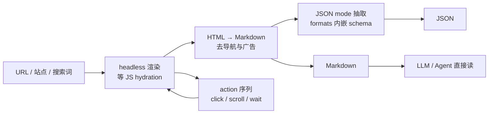

# Firecrawl：把 Web 转成 LLM 能直接读的 Markdown

让 LLM 读现代网页，总会撞上三件事：JS 没渲染，你只拿到空壳；HTML 标签把有用信息埋进噪音；爬到一半被 Cloudflare 拦下。[Firecrawl](https://github.com/firecrawl/firecrawl) 的定位不是爬虫，而是一个 web context API——它把「渲染、清洗、抽取」这三段脏活封装成一次调用，一个 URL 进去，一份干净的 Markdown 出来，直接喂给 LLM 或 Agent。

这篇文章的判断是：Firecrawl 值钱的地方不在爬取本身，而在于它把「网页 → LLM 可用上下文」这条链路的工程成本集中到一个端点里。下面拆它的接口形态、自托管边界，以及什么时候值得用它，什么时候该自己写。

## 一条数据流：从 URL 到 Markdown

Firecrawl 在「裸 HTML」和「能喂给 LLM 的内容」之间加了一层处理管线：


```mermaid
flowchart LR
    SRC[URL / 站点 / 搜索词] --> R[headless 渲染<br/>等 JS hydration]
    R --> M[HTML → Markdown<br/>去导航与广告]
    M --> E[JSON mode 抽取<br/>formats 内嵌 schema]
    M --> OUT1[Markdown]
    E --> OUT2[JSON]
    R --> A[action 序列<br/>click / scroll / wait]
    A --> R
    OUT1 --> LLM[LLM / Agent 直接读]
```

外部的接法有四种：REST API、Python/Node SDK、CLI、MCP server。对 Agent 来说，最常用的是 MCP——一行配置就能让 Claude Code 这类工具多出联网能力，见下文。

先拆开两条容易被混在一起读的主线，后面才不会看晕：一条是**内容管线**，处理「单个 URL 怎么变成干净 Markdown / JSON」，决定输出质量；另一条是**任务编排**，处理「一批 URL 或整个站点怎么送进来、怎么拿结果」，决定使用是方便还是繁琐。`scrape` 只走内容管线；`crawl`、`batch scrape`、`map` 和 `search` 在编排层做批量、发现与调度；JSON 抽取在内容管线末端加一步 LLM。

## 核心端点与各自场景

Firecrawl 把「读 Web」切成几个端点，每个对应一类用法：

| 端点 | 用途 | 典型用法 |
|------|------|----------|
| `search` | 搜 Web，结果可选带整页正文 | 搜「LLM evaluation 论文」并抓回每条的 Markdown |
| `scrape` | 单 URL 转 markdown / HTML / screenshot / JSON | 单页结构化抽取 |
| `map` | 只列站点上的 URL，不抽正文 | 爬之前先看全站有哪些路径 |
| `crawl` | 从种子 URL 出发跟随链接全站爬取 | 整个 docs site、整个博客 |
| `batch scrape` | 只爬给定的一批 URL，不跟随链接 | 一次性把一堆已知 URL 拉成 markdown |

`search` 的返回粒度可以一路加码：默认给的是标题、描述、URL，外加与查询词相关的 Highlights 片段；传 `scrapeOptions`（比如 `formats: ["markdown"]`）就能让每条结果带回清洗后的整页正文——「搜索 + 抓取」一步完成，这决定它能不能直接被拿去当 RAG 语料。它还能用 `sources` 参数限定来源（`web` / `news` / `images`）。

`map` 干的事最轻：不给正文，只返回站点的 URL 清单，URL 主要来自 sitemap，再拿搜索结果和已爬缓存补漏。每次调用固定 1 credit。它的价值在规划——爬一个不熟悉的站之前先 map 一遍，看清有哪些路径，`includePaths` / `excludePaths` 自然就知道怎么写，省掉一整轮瞎爬。

`crawl` 与 `batch scrape` 的区别在编排策略：前者不知道目标页有哪些，靠链接发现；后者你手上一份 URL 清单，它不扩散。按「要不要跟链接」来判断用哪个，比记端点名更可靠。路径过滤有个容易踩的细节：`includePaths` / `excludePaths` 是对 URL pathname 做正则匹配（Rust regex，RE2 方言），不是 glob；起始 URL 自己也要过 `includePaths` 这关，一条都不匹配的话可能一页都爬不回来。

JSON 抽取的入口在 `scrape` 的 `formats` 里：内嵌一份 JSON Schema（或只给一句自然语言 prompt），服务端用 LLM 从单页抠出结构化字段。老的 `extract` 端点还在，但已进维护模式——Python SDK 调它会发 DeprecationWarning，官方口径是单页换 JSON mode，多页或需要先发现 URL 的场景换 `agent`。`agent` 是 extract 的继任者：跑在 spark-2 模型上，自主搜索、导航、聚合结果，每个账号每天有 5 次免费 run。更主动的还有 `interact`，在已抓页面绑定的浏览器会话里执行代码或自然语言指令，点击、填表、翻页之后再继续抽；`parse` 则不吃 URL，直接解析你上传的本地文件（HTML / PDF / DOCX / XLSX）。这几个属于重活，多数场景用不到，知道存在即可。

## 为什么是 LLM Context API，而不是爬虫

普通爬虫（Scrapy、Playwright、Crawlee）给你的是 HTML 字符串或裸 JSON，parse 标签、去噪、提取正文都得自己来。Firecrawl 在中间层替你做了这几件事：

1. **JS 渲染**：headless 浏览器跑 React / Vue 这类 SPA，等 hydration 完成再 snapshot。
2. **Markdown 转换**：HTML → Markdown，保留代码块、表格、链接、标题层级，去掉导航、页脚、广告。
3. **结构化抽取**：JSON mode 接受 JSON Schema 或自然语言描述，把页面里的字段抠成结构化 JSON。
4. **反爬**：`proxy` 参数三档——`basic`（对付无或轻反爬的站）、`enhanced`（强反爬站，更慢更稳）、`auto`（默认，basic 失败自动换 enhanced 重试，不加价）。效果仍取决于目标站点的反爬强度，自托管要自己配代理池。
5. **交互序列**：可以 click / scroll / write / wait / press 之后再抽取，处理「点开翻页才看到列表」这类场景。

输出默认是 Markdown（保留可读性，也贴合 LLM 的上下文长度），也可以按需取 HTML、screenshot 或 JSON。`formats` 一次可以要多个：

| format | 内容 |
|--------|------|
| `markdown` | 清洗后的正文（默认） |
| `html` / `rawHtml` | 渲染后 / 原始的 HTML |
| `json` | 按 schema 或提示词抽出的字段 |
| `screenshot` | 整页或指定视口截图 |
| `links` | 页面内链接清单 |
| `images` | 页面图片清单 |
| `summary` | LLM 生成的摘要 |
| `changeTracking` | 与上次抓取对比的变化 |

这张表没列全：`branding` 抽品牌视觉、`product` 免 LLM 确定性抽商品字段、`query` 对页面提问、`audio` / `video` 从视频页抽媒体。计费上要记一个数：基础抓取 1 credit 一页，JSON mode 每页加 4。

v2 还默认开了几项省事的设置：响应缓存（`maxAge` 默认 2 天，相同 URL 短期内直接回缓存）、`blockAds` 挡广告和 cookie 弹窗、`removeBase64Images` 摘掉内嵌 base64 图。缓存只降延迟不省钱——命中缓存的页面照常计 1 credit，省的是重复渲染的等待。

## 最小可跑示例

```python
from firecrawl import Firecrawl

app = Firecrawl(api_key="fc-...")  # 没配 key 也能跑，只是受按 IP 限流

# 1. 单 URL → Markdown（formats 还能要 html / json / screenshot / links / summary）
doc = app.scrape("https://example.com/article", formats=["markdown"])
print(doc.markdown)

# 2. 搜索：默认给标题 + 描述 + Highlights，要正文得传 scrape_options
results = app.search(
    "LLM evaluation benchmarks 2026",
    limit=5,
    scrape_options={"formats": ["markdown"]},
)

# 3. 先 map 看全站结构，再定 include/exclude 怎么写
links = app.map("https://docs.example.com", search="guide")

# 4. 整站爬取：crawl 是阻塞版；要异步就用 start_crawl 拿 job id 后轮询 / 收 webhook
job = app.crawl(
    url="https://docs.example.com",
    limit=500,
    include_paths=["/guide/*"],
    exclude_paths=["/api/*"],
)

# 5. 抽取结构化字段：单页用 scrape 的 JSON mode，schema 内嵌进 formats
doc = app.scrape(
    "https://shop.example.com/p1",
    formats=[{
        "type": "json",
        "schema": {
            "type": "object",
            "properties": {
                "name": {"type": "string"},
                "price": {"type": "number"},
            },
        },
    }],
)
print(doc.json)
```

CLI 是全局安装的 `firecrawl-cli`，一行同时完成安装、登录、给 agent 装 skills：

```bash
npx -y firecrawl-cli@latest init --all --browser   # 装 CLI + 浏览器登录 + 装 agent skills
firecrawl login                                    # 之后可单跑
firecrawl https://example.com --only-main-content  # 只要正文，去掉导航 / 页脚 / 广告
firecrawl search "LLM evaluation benchmarks 2026" --scrape
```

## MCP：让 Agent 联网变成一行配置

Firecrawl 提供 [MCP server](https://docs.firecrawl.dev)，不用写 Python 绑定，直接让 Claude Code / Cursor / Codex / OpenCode 这类 MCP-aware 的 agent 通过 `mcp.json` 接入。首选官方托管的远程 server：

```json
{
  "mcpServers": {
    "firecrawl": {
      "url": "https://mcp.firecrawl.dev/v2/mcp-oauth"
    }
  }
}
```

`/v2/mcp-oauth` 走 OAuth 浏览器登录；另有免登录的 `/v2/mcp`（只开放 search / scrape / parse 等子集，按 IP 限流）。MCP 客户端不支持远程或 OAuth 时，再退回本地 server 方式：

```json
{
  "mcpServers": {
    "firecrawl": {
      "command": "npx",
      "args": ["-y", "firecrawl-mcp"],
      "env": {"FIRECRAWL_API_KEY": "fc-..."}
    }
  }
}
```

接好之后，agent 拿到 `firecrawl_search` / `firecrawl_scrape` / `firecrawl_crawl` / `firecrawl_map` / `firecrawl_interact` / `firecrawl_parse` / `firecrawl_agent` 这一族工具，外加 credit 用量查询、站点监控等辅助项。注意 MCP 里没有批量抓取工具：官方建议多个已知 URL 就逐个 scrape，真正的一次性大批量走 REST API 的 batch scrape 端点。把「给 agent 联网」从手写 Python 调用，简化成声明式地加一个 MCP server。

## 一个任务流：从商品页抽出结构化字段

把抽象机制串起来看一次真实读取。假设要给一个电商站的两张商品页抽 `name` 和 `price`：

1. 先用 `scrape` 各拉一次 Markdown，确认打开的速度、价格是服务端渲染还是 JS 填充。若价格是 JS 渲染的，`scrape` 默认等 hydration，能拿到最终值。
2. 结构化抽取走 `scrape` 的 JSON mode：formats 里内嵌 schema（或只给 prompt），服务端用 LLM 抠字段，结果挂在响应的 `json` 字段上。商品页可以先试 `product` format——它不调 LLM，确定性地抽 title / price / availability，更快也更便宜。
3. JSON mode 每页 5 credits（基础 1 + 抽取 4），长页面的 token 消耗随页面长度浮动，批量前先试一两个页面估成本。

这条链路把「渲染、转换、抽取」三个环节串进一次调用，读 Web 对应用层保持一个简单接口。

清单一旦变长，就别对每个 URL 各发一次 `scrape`：整份清单丢给 `batch scrape`。量小用阻塞版，量大用 `startBatchScrape` 拿 job id 后轮询 `getBatchScrapeStatus`，或注册 webhook 让完成事件推回来。`crawl` 的异步版同理是 `startCrawl`，想盯一个 job 的变化可以挂 `watcher`。

## 它拿不到的页面

再强的工具也有边界，先知道 Firecrawl 不擅长什么，比知道它擅长什么更省时间：

1. **登录墙之后的内容**：裸 URL 没有登录态，站点多半回你一个登录页。Cloud 端的 Browser Sandbox 支持持久 profile——把 cookie / localStorage 存成命名 profile 跨会话复用，登录后抓取走得通，但这是 Cloud 能力，自托管没有这条路；那边只能自己在请求 headers 里带 cookie。
2. **验证码关卡**：碰到 CAPTCHA，换到 enhanced 代理也未必能过。这类页面对任何自动化方案都是硬门槛，别指望一次 scrape 解决。
3. **onclick 式懒加载**：数据靠滚动触发加载、但交互事件绑在特定元素（而不是标准翻页）的页面，默认渲染可能漏内容。需要先摸清加载触发方式，再决定要不要上 action 序列。
4. **Robots / 合规**：爬取（crawl）会读站点的 `robots.txt`，按 `FirecrawlAgent` token 匹配规则，忽略这个检查的开关是企业版功能；目标站的服务条款仍要自行评估。自托管反爬代理池只是技术手段，不豁免合规责任。

判断方法：先用 `scrape` 拉一次，看返回的 markdown 里有没有目标内容、页面是否返回了反爬占位页。省得在 batch 之前把整批 URL 全跪一遍。

## 与同类工具的边界

| 工具 | 定位 | 强项 | 弱项 |
|------|------|------|------|
| **Firecrawl** | LLM context API | 端到端（爬 + 渲染 + 抽 + 结构化）+ MCP + agent ready | AGPL-3.0（自托管要开源）+ 服务端按量计费 |
| **jina reader** | 单页 reader | 免费层慷慨、输出干净 Markdown | 不擅长批量爬、没有 extract 端点 |
| **tavily** | 搜索 API | 搜索结果带 LLM 摘要 | 不擅长整站爬 |
| **playwright** | 浏览器自动化 | 完全可控、JS 交互 | parse、反爬都得自己处理 |

简单说：愿意为开箱即用付费，用 Firecrawl；愿意写代码，用 Playwright。

## 自托管会碰到什么

主仓库是完整的 TypeScript 实现：API 服务加 Playwright 渲染，队列靠 Redis，状态落在 PostgreSQL，任务消息走 RabbitMQ，docker compose 一条命令拉起。能自己跑起来不等于什么都有，官方的自托管功能对照表划得很清楚：

- 核心 `scrape` / `crawl` / `map` / `search`：默认栈开箱可用，抓取与 Playwright 处理都包含。
- LLM 抽取（JSON mode、summary 这类格式）：要自己接一个 OpenAI 兼容 provider 或 Ollama。
- 截图与页面动作：默认栈不支持，依赖闭源的 Fire-engine 服务。
- `agent`、browser、interact：用 Firecrawl Cloud，或自行验证外部服务依赖。

在此之上还有几条老约束：

1. **AGPL-3.0**：fork 或修改后必须开源。做闭源产品，得用 hosted 版本（[firecrawl.dev](https://firecrawl.dev)）。
2. **反爬代理池**：Fire-engine 的高级反爬不随开源栈分发，自托管默认没有商业代理，跑一段时间就会被 Cloudflare 类防护拦下，proxy rotation 得自己配。
3. **JS 渲染成本**：headless 浏览器是吃内存大户，worker 起得越多，单机内存占用越高，按规模预留资源。
4. **抽取的模型成本**：LLM 类格式背后是模型调用，token 消耗算在自己接的 provider 头上——用 Ollama 就是把账单换成 GPU 和运维。
5. **客户端指向**：CLI 用 `firecrawl config --api-url` 或环境变量 `FIRECRAWL_API_URL` 指到本地实例，SDK 同理支持自定义 API URL。

## 什么时候用 hosting，什么时候自己写

给内部 agent 补联网、不介意付费，hosted 版本最省事：不用维护渲染集群，也拿到了代理池和反爬。要尽量省钱，Firecrawl 本身支持无 key 起步——注册前 scrape / search / parse / interact 就能用，只是按 IP 限流；免费账号送 1,000 额度。或者用 jina reader 配合自己写的一层批量调度。

做 to C 产品且预算吃紧，优先自己写 Playwright + parse 层，把 Firecrawl 这类服务当成兜底而不是默认路径。

还有一类场景干脆不必用 Firecrawl：你只要某个 API 已经提供的数据，或者目标站本身就返回干净的 HTML（老站、静态文档站），直接 HTTP 请求 + 一个正文解析库，开销最小，也不引入浏览器和代理这两层不确定性。Firecrawl 的价值在你「必须渲染 JS 或搞定反爬」时才兑现。

简单对照：单次拉取、内容静态 → 手写；批量、带 JS、有反爬 → Firecrawl hosted；闭源产品、要掌控全部链路 → 自托管（先想清 AGPL 和代理成本）；纯原型验证 → jina reader + 自己的调度。

## 仓库数据

- 仓库：`firecrawl/firecrawl`（2024-04 创建）
- 主页：https://firecrawl.dev
- 协议：AGPL-3.0（自托管强制开源）
- 主语言：TypeScript（API server）；官方 SDK 为 Python 与 Node.js
- stars：185,908 / forks 9,962（GitHub API 2026-09-29 核实）
- 本文口径：v2 API 与 docs.firecrawl.dev 2026-09-29 快照；Python SDK 4.45.0、firecrawl-cli 1.24.6、firecrawl-mcp 3.25.5
