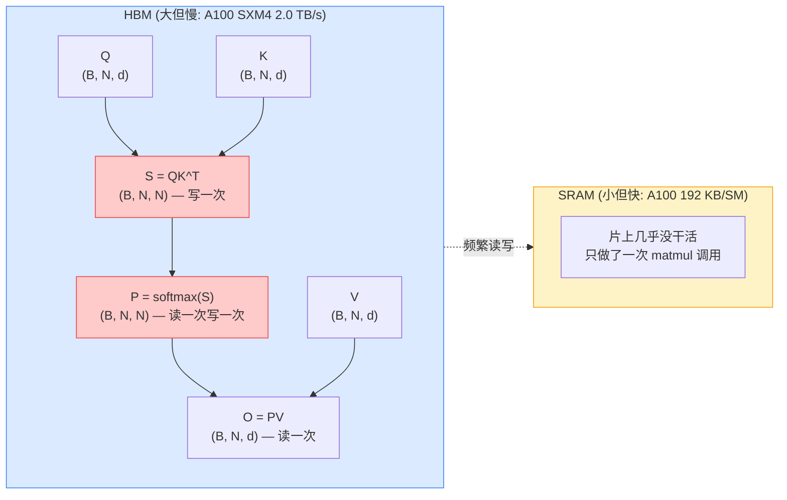
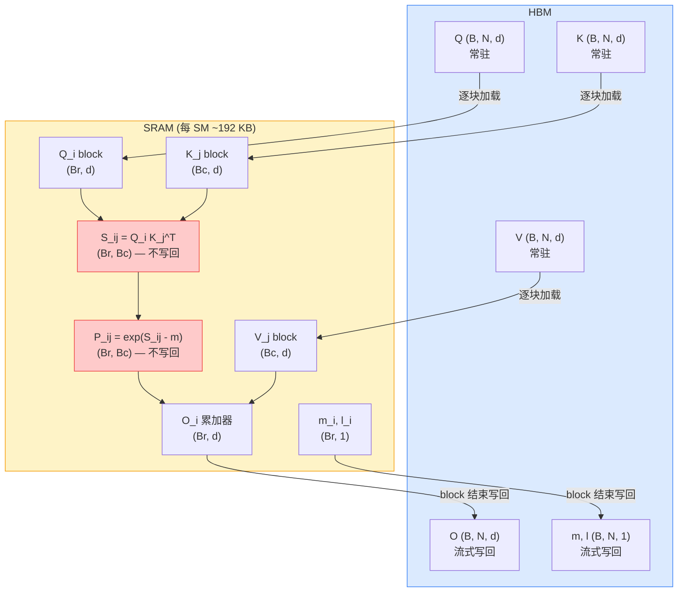

# Flash Attention：把注意力从 HBM 带宽瓶颈里捞出来

> **目标读者**：大模型训练/推理工程师、CUDA 内核爱好者、Transformer 优化方向的研究者
> **预计阅读时间**：50-70 分钟
> **前置知识**：标准 Attention 公式、GPU 内存层级（SRAM/HBM）、PyTorch 基础
> **难度定位**：⭐⭐⭐ 中高级，需要理解 GPU 内存层级

## 学习目标

读完这篇能：

- 说清标准 Attention 在 HBM 带宽上的瓶颈位置，以及 FA 用 tiling + online softmax 把 O(N²) 内存压到 O(N) 的机制
- 区分 FA1/FA2/FA3 三代各自解决的瓶颈层次（HBM 带宽 → GPU 占用率 → Tensor Core 利用率）
- 在 HuggingFace Transformers、xFormers、Megatron-LM 里正确启用 FA，并能排查 CUDA 版本不匹配、kernel image 缺失等常见报错
- 读 benchmark 数字时区分"测的是什么"和"不能推出什么"，避免把 attention kernel 加速比外推成端到端训练加速比
- 判断自己的场景（训练/推理、长序列/短序列、NVIDIA/其他 GPU）是否适合用 FA，以及什么时候该换 Ring Attention 或 PagedAttention

## 目录

1. 先给判断 — FA 是什么、不是什么、三代各自解决什么瓶颈
2. 标准 Attention 的瓶颈在哪里 — HBM 带宽而不是 FLOPs
3. Tiling + Online Softmax — O(N²) 内存怎么压到 O(N)
4. 项目快照 — 仓库、版本、作者
5. 三代演进 — FA1/FA2/FA3 各自解决什么
6. 安装与环境验证 — pip/源码/Docker，CUDA 版本对齐
7. API 与典型调用 — `flash_attn_func` / `qkvpacked` / `varlen`
8. 与主流框架集成 — HuggingFace / xFormers / Megatron-LM
9. Benchmark 怎么读 — 测的是什么、不能推出什么
10. 训练场景的注意点 — 自定义层、反向传播、DDP/FSDP
11. 推理场景的注意点 — prefill/decode 阶段的差异
12. 常见报错与排查 — ImportError / kernel image / 数值误差 / OOM
13. 与近似注意力算法的边界 — 什么时候该用 Reformer/Linformer
14. 采用顺序与决策建议 — 新项目与迁移路径
15. 自测题 — 检验理解程度

## 先给判断

Flash Attention 不是近似注意力算法。它把标准 Attention 的计算重排成对 GPU 内存层级友好的形态：在片上 SRAM 里完成 softmax 与加权求和，避免把 N×N 的中间矩阵写回 HBM 再读回来。同一组数学运算，内存复杂度从 O(N²) 降到 O(N)，A100 上 2-4 倍墙钟时间加速，与标准 Attention 在数学上等价（FP16 下误差通常 < 1e-3）。

瓶颈出在 HBM 带宽而不是 FLOPs，后续每一代的设计都围绕这一点：tiling 必须配 online softmax 才能在分块下保持全局归一化；FA2 要重新切分 warp 才能把 batch 维度的并行吃满；FA3 在 H100 上要靠 warp-specialization 把 matmul 和 softmax 重叠起来，才能压住 Hopper 架构的 Tensor Core 空窗。

范围覆盖 FA1/FA2/FA3 三代的原理差异、安装与 API 调用、与主流框架的集成、benchmark 解读、训练与推理场景的注意点、常见报错排查。CUTLASS 内核细节、Triton 实现版本、Flash Attention-4（Blackwell 专属，仍在快速迭代）不在范围内。

**学习路径建议**：先读"标准 Attention 的瓶颈在哪里"和"Tiling + Online Softmax"两节建立直觉，再按需跳到安装、API、集成、排查等实操章节。只想快速上手的，从"安装与环境验证"读起即可；要做内核优化的，前两节是基础。

## 标准 Attention 的瓶颈在哪里

先把标准 Attention 写出来，再看它在哪里把 GPU 用废了。

```python
import torch
import torch.nn.functional as F

def standard_attention(Q, K, V, scale=None):
    """
    Q, K, V: (batch, seq_len, d_k)
    """
    d_k = Q.size(-1)
    if scale is None:
        scale = d_k ** -0.5

    # Step 1: 计算注意力分数
    scores = torch.matmul(Q, K.transpose(-2, -1)) * scale
    # scores: (batch, seq_len, seq_len) — 完整 N×N 矩阵驻留 HBM

    # Step 2: Softmax
    attn_weights = F.softmax(scores, dim=-1)
    # attn_weights: 同样是 N×N，再次读写 HBM

    # Step 3: 加权求和
    outputs = torch.matmul(attn_weights, V)

    return outputs
```

三行代码里，`scores` 和 `attn_weights` 都是 `(batch, seq_len, seq_len)` 的张量。对 LLaMA-7B 训练时常见的 `seq_len=4096`、`batch=8`、`heads=32`、`head_dim=128` 配置，单个 `attn_weights` 就是 8 × 32 × 4096 × 4096 × 2 bytes ≈ 8 GB 的 FP16 矩阵，要写一次、读一次，再写一次。

A100 的 HBM 带宽是 2.0 TB/s（SXM4 版本，PCIe 版为 1.9 TB/s），H100 SXM5 是 3.35 TB/s。除以一次 attention 里要搬运的 N² 数据量，墙钟时间就上去了。FLOPs 反而不是瓶颈——A100 SXM4 的 Tensor Core 算力是 312 TFLOPS（FP16，稠密），算 QK^T 和 PV 的 FLOPs 用不了那么多时间。



红色标记的两个 N×N 矩阵是 HBM 带宽的主要消耗者。Flash Attention 要解决的就是这两个矩阵的来回搬运。

## Tiling + Online Softmax：怎么把 O(N²) 内存压到 O(N)

既然把 N×N 矩阵留在 HBM 是问题所在，能不能根本不 materialize 这个矩阵？难点在 softmax。softmax 的分母是 `sum(exp(scores))`，要算这个分母必须看到整行 scores。如果按块（tile）算 QK^T，每块算完就丢，怎么保证 softmax 的全局归一化？

### Online softmax 的数学

标准 softmax 对一行 scores $s_1, \dots, s_N$ 的定义是：

$$
\text{softmax}(s_i) = \frac{e^{s_i}}{\sum_{j=1}^{N} e^{s_j}}
$$

直接算会数值溢出，工程实现里先减去行内最大值 $m = \max_j s_j$：

$$
\text{softmax}(s_i) = \frac{e^{s_i - m}}{\sum_{j=1}^{N} e^{s_j - m}}
$$

现在把 scores 拆成两块 $s^{(1)} = [s_1, s_2]$ 和 $s^{(2)} = [s_3, s_4]$（以 N=4 为例），分两次处理。第一块算完后得到局部最大值 $m^{(1)} = \max(s_1, s_2)$ 和局部和 $l^{(1)} = e^{s_1 - m^{(1)}} + e^{s_2 - m^{(1)}}$。第二块到来时，全局最大值更新为 $m = \max(m^{(1)}, m^{(2)})$，其中 $m^{(2)} = \max(s_3, s_4)$。此时第一块的局部和需要 rescale：

$$
l = e^{m^{(1)} - m} \cdot l^{(1)} + l^{(2)}
$$

输出累加器 $O$ 同步 rescale：$O \leftarrow e^{m^{(1)} - m} \cdot O^{(1)} + O^{(2)}$。所有块处理完后，$O / l$ 就是完整的 softmax 加权结果。整个过程里，完整的 N×N 矩阵从未出现，每个 block 的 $S_{ij}$ 和 $P_{ij}$ 算完即丢。

### 数据流伪代码

下面这段伪代码展示了一次 attention 计算如何在 SRAM/HBM 间流转。这不是 FA 的真实 CUDA 实现——真实实现要处理 warp 分配、shared memory bank conflict、TMA 加载等大量细节，这里只展示数据流。

```python
def flash_attention_tiled(Q, K, V, block_size=64):
    """
    Flash Attention 数据流伪代码（非真实 CUDA 实现）
    关键点：N×N 矩阵永远不离开 SRAM
    """
    batch_size, seq_len, d_k = Q.shape

    # 输出和归一化因子都驻留 HBM，但只有 O(N) 大小
    outputs = torch.zeros_like(Q)
    l = torch.zeros((batch_size, seq_len, 1))      # running sum
    m = torch.full((batch_size, seq_len, 1), -float('inf'))  # running max

    for i in range(0, seq_len, block_size):
        # 从 HBM 加载一个 Q block 到 SRAM
        Q_block = Q[:, i:i+block_size, :]          # (B, Br, d)
        m_i = m[:, i:i+block_size, :]              # 当前 block 的 running max
        l_i = l[:, i:i+block_size, :]              # 当前 block 的 running sum
        O_i = outputs[:, i:i+block_size, :]        # 当前 block 的 running output

        for j in range(0, seq_len, block_size):
            # 从 HBM 加载 K, V block 到 SRAM
            K_block = K[:, j:j+block_size, :]
            V_block = V[:, j:j+block_size, :]

            # === 以下全部在 SRAM 内完成 ===
            # 计算 block scores
            S_ij = torch.matmul(Q_block, K_block.transpose(-2, -1)) / (d_k ** 0.5)

            # online softmax 更新
            m_ij = torch.maximum(m_i, S_ij.amax(dim=-1, keepdim=True))
            P_ij = torch.exp(S_ij - m_ij)
            l_i = l_i * torch.exp(m_i - m_ij) + P_ij.sum(dim=-1, keepdim=True)

            # rescale 之前的输出，加上当前 block 的贡献
            O_i = O_i * torch.exp(m_i - m_ij) + torch.matmul(P_ij, V_block)
            m_i = m_ij
            # === SRAM 部分结束 ===

        # 只把最终结果写回 HBM，N×N 矩阵从未离开 SRAM
        outputs[:, i:i+block_size, :] = O_i / l_i
        m[:, i:i+block_size, :] = m_i
        l[:, i:i+block_size, :] = l_i

    return outputs
```

### 一次具体的数据流追踪

拿 `seq_len=8`、`block_size=4` 走一遍外层循环 `i=0` 的过程，看数据怎么在两级内存间流动：

1. **加载 Q_0**：从 HBM 读 `Q[0:4]`（4 行）进 SRAM，初始化 `m_0=-inf`、`l_0=0`、`O_0=0`。
2. **j=0**：从 HBM 读 `K[0:4]`、`V[0:4]` 进 SRAM。在 SRAM 内算 `S_00 = Q_0 · K_0^T`（4×4），更新 `m_0 = max(S_00)`，算 `P_00 = exp(S_00 - m_0)`，`l_0 = sum(P_00)`，`O_0 = P_00 · V_0`。`S_00` 和 `P_00` 用完即丢，不写回 HBM。
3. **j=4**：从 HBM 读 `K[4:8]`、`V[4:8]`。在 SRAM 内算 `S_01 = Q_0 · K_1^T`，更新全局 max `m_new = max(m_0, max(S_01))`，把 `l_0` 和 `O_0` 都乘以 `exp(m_0 - m_new)` 做 rescale，再累加 `P_01 · V_1`。
4. **写回**：把 `O_0 / l_0`、`m_0`、`l_0` 写回 HBM。整个过程中，完整的 8×8 矩阵从未在 HBM 出现过，SRAM 里同时存在的只有 4×4 的 block。



红色标记的 S_ij 和 P_ij 是关键：这两个 N×N 的中间量只在 SRAM 内存在一个 block 的时间，算完就丢，从不写回 HBM。O(N²) → O(N) 内存复杂度就是从这里来的。

tiling 降内存靠的是把 N×N 矩阵的生命周期压缩到一个 block 内，不再需要 HBM 来暂存——计算量（FLOPs）并没有减少。标准 Attention 的墙钟时间主要花在 HBM 读写 N×N 矩阵上，FA 把这部分读写消掉，加速就出来了。

## 项目快照

| 属性 | 值 |
|------|-----|
| 仓库 | github.com/Dao-AILab/flash-attention |
| Stars | 40.2k |
| Forks | 3.3k |
| 贡献者 | 202 |
| 最新版本 | 2.8.3（2025-08-15，主包）；FA3 为 beta（`hopper/` 目录）；FA4 单独发布为 `flash-attn-4` 包 |
| 许可证 | BSD-3-Clause |
| 语言占比 | CUDA 60.4% / Python 21.8% / C++ 17.4% |
| 作者 | Tri Dao（Stanford 博士，Together AI 首席科学家，2024 年 9 月起任 Princeton 计算机科学助理教授） |

Stars 反映生态接受度，和性能没有直接关系——性能要看后面 benchmark 段的测量条件。

## 三代演进：每一代在解决什么

三代 FA 各自瞄准不同层面的瓶颈。

| 版本 | 主要瓶颈 | 解决方式 | 相对前代加速 |
|------|----------|----------|--------------|
| FA1 | HBM 带宽（N×N 矩阵来回搬运） | Tiling + online softmax | 2-4x vs 标准 Attention |
| FA2 | GPU 占用率低（只沿 seq 维度并行） | 沿 batch 和 seq 双维度并行，重切 warp | 1.5-2x vs FA1 |
| FA3 | H100 的 Tensor Core 利用率低（~35%） | warp-specialization 重叠 matmul 与 softmax，FP8 低精度 | 1.5-2x vs FA2（FP16），FP8 再多 ~1.2x |

FA1 把 HBM 带宽问题解决掉之后，FA2 面对的是 GPU 占用率——FA1 只在 sequence 维度做并行，长序列时 batch 维度闲置；FA2 把并行扩展到 batch × seq，并重新分配 warp，让每个 warp 干的活更均衡。FA3 要处理的是 Hopper 架构下的 Tensor Core 利用率：FA2 在 H100 上只能跑到 ~35% 的理论 FP16 峰值，FA3 通过 warp-specialization（一部分 warp 专门做 matmul，另一部分专门做 softmax，两者重叠）和异步数据搬运（利用 TMA 指令），把 H100 的 FP16 利用率推到 ~75%，FP8 推到更高。

FA3 仍然是精确算法。它的 FP8 模式因为低精度量化会引入数值误差，但这和 Linformer、Performer 那类通过数学近似降低复杂度的"近似注意力算法"是两回事。FA3 的 FP16/BF16 路径与标准 Attention 数学等价。

## 安装与环境验证

### 环境要求

| 要求 | 说明 |
|------|------|
| GPU | NVIDIA GPU（H100、A100、RTX 3090/4090、V100 等） |
| CUDA | 12.0+（FA3 beta 建议 12.3+，最佳性能用 12.8+） |
| PyTorch | 2.2+ |
| Python | 3.9+ |

不支持 CPU。不支持 AMD GPU（社区有 ROCm 移植，但非官方维护）。V100（sm_70）能用 FA1/FA2，FA3 需要 Hopper（sm_90）。FA3 目前以 beta 形式发布在仓库的 `hopper/` 目录，需要单独编译（`cd hopper && python setup.py install`），导入入口是 `flash_attn_interface`，与主包 `flash_attn` 不同。FA4 面向 Hopper 和 Blackwell，单独发布为 `pip install flash-attn-4`。

### 安装方式

```bash
# 方式一：pip 安装（推荐，预编译 wheel）
pip install flash-attn

# 方式二：从源码安装（需要 CUDA toolkit，编译耗时 10-30 分钟）
git clone https://github.com/Dao-AILab/flash-attention.git
cd flash-attention
pip install .
```

不同 GPU 架构的安装差异主要在 wheel 来源：

```bash
# RTX 3090 / A100 (sm_80 / sm_86) — 标准 pip 即可
pip install flash-attn --no-build-isolation

# H100 (sm_90) — 用官方 wheel 仓库拉对应版本，URL 中的版本号要与目标 release 对齐
pip install flash-attn --no-build-isolation --index-url https://wheels.flash-attention.com/2.8/

# Docker（避免本地 CUDA 版本冲突）
docker run --gpus all -it ghcr.io/dao-ailab/flash-attention:latest
```

`--no-build-isolation` 让 pip 用当前环境里已装的 PyTorch 来编译扩展，而不是新建一个隔离环境去拉 PyTorch——后者经常因为版本不匹配导致编译失败。

### 验证安装

```python
import torch
from flash_attn import flash_attn_func

# 检查版本
import flash_attn
print(flash_attn.__version__)  # 期望: 2.8.x（主包）；FA3 beta 用 flash_attn_interface

# 检查 CUDA 可用性
print(torch.cuda.is_available())           # True
print(torch.cuda.get_device_name(0))       # NVIDIA A100-SXM4-80GB / H100 / ...

# 跑一次最小用例，确认 kernel 能加载
Q = torch.randn(2, 64, 32, dtype=torch.float16, device='cuda')
K = torch.randn(2, 64, 32, dtype=torch.float16, device='cuda')
V = torch.randn(2, 64, 32, dtype=torch.float16, device='cuda')
out = flash_attn_func(Q, K, V)
print(out.shape)  # torch.Size([2, 64, 32])
```

如果 `flash_attn_func` 导入失败但 `pip list` 显示已安装，多半是 CUDA 版本和编译时的 CUDA 版本不匹配。`nvidia-smi` 看驱动支持的 CUDA 版本，`nvcc --version` 看编译器版本，两者要兼容。

## API 与典型调用

### 基础调用：`flash_attn_func`

```python
import torch
from flash_attn import flash_attn_func

# 张量形状: (batch_size, seq_len, num_heads, head_dim)
Q = torch.randn(2, 64, 8, 64, dtype=torch.float16, device='cuda')
K = torch.randn(2, 64, 8, 64, dtype=torch.float16, device='cuda')
V = torch.randn(2, 64, 8, 64, dtype=torch.float16, device='cuda')

# 前向计算
output = flash_attn_func(Q, K, V, dropout_p=0.0, causal=False)
print(output.shape)  # torch.Size([2, 64, 8, 64])
```

张量形状是 `(batch, seq, heads, head_dim)`，不是 PyTorch 常见的 `(batch, heads, seq, head_dim)`。这是 FA 的约定，调用前别 transpose 错。

### 与标准 Attention 的误差对比

```python
def standard_attention(Q, K, V):
    # Q, K, V: (batch, seq, heads, head_dim) → 转成 (batch, heads, seq, head_dim)
    Q = Q.transpose(1, 2)
    K = K.transpose(1, 2)
    V = V.transpose(1, 2)
    d_k = Q.size(-1)
    scores = torch.matmul(Q, K.transpose(-2, -1)) / (d_k ** 0.5)
    return torch.matmul(torch.softmax(scores, dim=-1), V).transpose(1, 2)

standard_out = standard_attention(Q, K, V)
flash_out = flash_attn_func(Q, K, V)

diff = (flash_out.float() - standard_out.float()).abs().max()
print(f"Max difference: {diff.item():.6f}")  # 通常 < 1e-3
```

误差来源是 FP16 累加顺序不同，算法本身是精确的。换 BF16 误差会更小，换 FP32 会几乎为 0（但 FA 不直接支持 FP32）。

### QKV 打包格式：`flash_attn_qkvpacked_func`

当 Q、K、V 来自同一个输入投影且 head_dim 相同时，打包成单个张量更高效——少一次 kernel launch，少一次 HBM 读写。

```python
from flash_attn import flash_attn_qkvpacked_func

# qkv: (batch, seq, 3, heads, head_dim)
qkv = torch.randn(2, 64, 3, 8, 64, dtype=torch.float16, device='cuda')

output = flash_attn_qkvpacked_func(qkv, dropout_p=0.0, causal=False)
print(output.shape)  # torch.Size([2, 64, 8, 64])
```

### 变长序列：`flash_attn_varlen_func`

训练时一个 batch 里序列长度不一，常规做法是 pad 到最长再算，padding 部分浪费算力。`flash_attn_varlen_func` 用 `cu_seqlens`（累积长度）把多个变长序列拼成一个长张量，跳过 padding。

```python
from flash_attn import flash_attn_varlen_func

# 假设 batch 内有 2 个序列，长度分别为 3 和 5，拼成 8 长的张量
# cu_seqlens 是累积长度的首尾哨兵，类似 CSR 格式的行指针
cu_seqlens_q = torch.tensor([0, 3, 8], dtype=torch.int32, device='cuda')
cu_seqlens_k = torch.tensor([0, 3, 8], dtype=torch.int32, device='cuda')

Q = torch.randn(8, 8, 64, dtype=torch.float16, device='cuda')  # (total_seq, heads, head_dim)
K = torch.randn(8, 8, 64, dtype=torch.float16, device='cuda')
V = torch.randn(8, 8, 64, dtype=torch.float16, device='cuda')

output = flash_attn_varlen_func(
    Q, K, V,
    cu_seqlens_q=cu_seqlens_q,
    cu_seqlens_k=cu_seqlens_k,
    max_seqlen_q=5,
    max_seqlen_k=5,
    dropout_p=0.0,
    causal=False,
)
print(output.shape)  # torch.Size([8, 8, 64])
```

`cu_seqlens` 的语义：`[0, 3, 8]` 表示第 0 个序列占索引 0-2（长度 3），第 1 个序列占索引 3-7（长度 5）。`max_seqlen_q` 是 batch 内最长序列长度，用于 kernel 内部 block 大小选择。

## 与主流框架集成

### Hugging Face Transformers

Transformers 内置了 Flash Attention 后端，通过 `attn_implementation` 参数切换：

```python
from transformers import AutoModelForCausalLM, AutoTokenizer
import torch

model_name = "meta-llama/Llama-2-7b-hf"

tokenizer = AutoTokenizer.from_pretrained(model_name)
model = AutoModelForCausalLM.from_pretrained(
    model_name,
    torch_dtype=torch.float16,
    device_map="auto",
    attn_implementation="flash_attention_2",  # 显式指定 FA2 后端
)

inputs = tokenizer("Hello, world!", return_tensors="pt").to("cuda")
outputs = model.generate(**inputs, max_new_tokens=100)
```

`attn_implementation` 的可选值：`eager`（标准 PyTorch 实现）、`sdpa`（PyTorch 2.0 的 scaled_dot_product_attention，内部可能调 FA）、`flash_attention_2`（显式 FA2）。如果 `flash-attn` 包没装，指定 `flash_attention_2` 会直接报错；如果只指定 `sdpa`，PyTorch 会根据硬件自动选择后端。

### xFormers

xFormers 的 `memory_efficient_attention` 是另一条路径，内部会根据硬件和输入形状选择 FA 或自家的 cutlass 内核：

```python
from xformers.ops import memory_efficient_attention

# xFormers 期望 (batch, heads, seq, head_dim) 形状
Q = Q.transpose(1, 2)
K = K.transpose(1, 2)
V = V.transpose(1, 2)

output = memory_efficient_attention(Q, K, V, attn_bias=None, p=0.0)
```

xFormers 和 `flash-attn` 包不需要同时装。如果两个都装了，Transformers 默认走 `flash-attn`。

### Megatron-LM

Megatron-LM 在 `megatron.core.extensions` 里有 Flash Attention 的封装，通过 config 字段开启：

```python
# 在 Megatron config 里
# attention_backend = "flash"  # 或 "unpad", "local"
```

具体字段名随 Megatron 版本变化，以仓库 `megatron.core.transformer.attention.py` 的实现为准。Mistral、CodeLlama 这类模型在 HuggingFace 上的实现走的是 Transformers 路径，不是 Megatron。

## Benchmark 怎么读

这组数字来自 FA 论文与官方仓库的典型测量条件。读 benchmark 时先看测的是什么。

### 速度对比

| 配置 | 标准 Attention | Flash Attention | 加速比 |
|------|---------------|-----------------|--------|
| A100-80GB（FP16, seq=4096） | ~100 ms | ~25 ms | ~4x |
| H100-SXM（FP16, seq=4096） | ~100 ms | ~17 ms（FA3） | ~6x |
| RTX 3090（FP16, seq=2048） | ~100 ms | ~40 ms | ~2.5x |

### 内存对比

| 序列长度 | 标准 Attention（N×N 矩阵） | Flash Attention | 内存节省 |
|----------|---------------------------|-----------------|----------|
| 512 | ~1 GB | ~256 MB | ~4x |
| 2048 | ~16 GB | ~1 GB | ~16x |
| 4096 | ~64 GB | ~4 GB | ~16x |

### 这些数字测的是什么

- **测的是**：单次 attention 前向计算的墙钟时间，包含 HBM 读写和 Tensor Core 计算。`seq_len` 固定，`batch` 和 `heads` 固定，FP16 精度，causal mask 关闭。
- **反映的是**：HBM 带宽利用率和 Tensor Core 占用率的综合表现。FA 的加速主要来自减少 HBM 读写，所以序列越长（N² 增长越快），加速比越明显。
- **不能推出什么**：
  - 不能直接推出端到端训练速度提升。训练里 attention 只占总时间的一部分（通常 20-40%），FFN 和优化器通信也占大头。FA 把 attention 部分加速 4x，端到端可能只快 1.2-1.5x。
  - 不能推出推理场景的加速比。推理时 `seq_len` 短、batch 小，FA 的优势不明显，甚至可能因为 kernel launch 开销变慢。
  - 不能跨 GPU 架构外推。H100 上的 6x 是 FA3 用了 Hopper 专属指令（TMA、warp-specialization）的结果，A100 上跑 FA3 拿不到这个数。

### 自己测一次

```python
import torch
import time
from flash_attn import flash_attn_func

def benchmark_attention(seq_len, batch_size=4, heads=16, head_dim=64, repeats=100):
    Q = torch.randn(batch_size, seq_len, heads, head_dim,
                    dtype=torch.float16, device='cuda')
    K = torch.randn(batch_size, seq_len, heads, head_dim,
                    dtype=torch.float16, device='cuda')
    V = torch.randn(batch_size, seq_len, heads, head_dim,
                    dtype=torch.float16, device='cuda')

    # Warmup — 必须做，第一次调用包含 JIT 编译和缓存加载
    for _ in range(10):
        _ = flash_attn_func(Q, K, V)
    torch.cuda.synchronize()

    # 测量
    start = time.time()
    for _ in range(repeats):
        _ = flash_attn_func(Q, K, V)
    torch.cuda.synchronize()
    elapsed = (time.time() - start) / repeats * 1000  # ms
    return elapsed

for seq_len in [512, 1024, 2048, 4096, 8192]:
    ms = benchmark_attention(seq_len)
    print(f"Seq len {seq_len:>5}: {ms:.2f} ms")
```

Warmup 这一步不能省。FA 第一次调用时会根据输入形状和硬件选择 kernel 配置，这部分时间不算在实际性能里。`torch.cuda.synchronize()` 也不能省，否则测的是 launch 时间而不是执行时间。

## 训练场景的注意点

### 自定义 Attention 层

在自己的模型里用 FA，关键是把 Q/K/V 投影后的张量形状整理成 FA 期望的 `(batch, seq, heads, head_dim)`：

```python
import torch
import torch.nn as nn
from flash_attn import flash_attn_func

class FlashAttentionLayer(nn.Module):
    def __init__(self, d_model, num_heads):
        super().__init__()
        self.d_model = d_model
        self.num_heads = num_heads
        self.head_dim = d_model // num_heads

        self.W_q = nn.Linear(d_model, d_model)
        self.W_k = nn.Linear(d_model, d_model)
        self.W_v = nn.Linear(d_model, d_model)
        self.W_o = nn.Linear(d_model, d_model)

    def forward(self, x, causal=False):
        batch_size, seq_len, _ = x.shape

        # 投影后直接 reshape 成 (batch, seq, heads, head_dim)
        # 不需要 transpose 到 (batch, heads, seq, head_dim)
        Q = self.W_q(x).view(batch_size, seq_len, self.num_heads, self.head_dim)
        K = self.W_k(x).view(batch_size, seq_len, self.num_heads, self.head_dim)
        V = self.W_v(x).view(batch_size, seq_len, self.num_heads, self.head_dim)

        attn_output = flash_attn_func(Q, K, V, dropout_p=0.0, causal=causal)

        # 恢复成 (batch, seq, d_model)
        attn_output = attn_output.view(batch_size, seq_len, self.d_model)
        return self.W_o(attn_output)
```

### 反向传播

FA 的反向传播也是 IO-aware 的，会重新计算前向的中间量（recomputation），而不是存 checkpoint。反向传播的 FLOPs 大约是前向的 2 倍，但 HBM 读写量没增加——FA 在训练里也能加速，靠的就是这一点。代价是反向时多算一次 QK^T 和 softmax，但 Tensor Core 算这些很快，省下的 HBM 带宽远比多算的 FLOPs 值。

### DDP 与 FSDP

FA 与 DDP/FSDP 完全兼容，它只是一个 attention kernel，不涉及梯度通信。分布式训练的注意点和标准 Attention 一样：梯度同步在 backward 之后自动触发，不需要为 FA 做特殊处理。

```python
import torch.distributed as dist
from torch.nn.parallel import DistributedDataParallel as DDP

model = FlashAttentionLayer(d_model=4096, num_heads=32).cuda()
model = DDP(model)

for batch in dataloader:
    optimizer.zero_grad()
    output = model(batch)
    loss = loss_fn(output, target)
    loss.backward()  # FA 反向自动触发，DDP 梯度同步也自动触发
    optimizer.step()
```

## 推理场景的注意点

推理和训练的瓶颈不同。训练时 `seq_len` 长、batch 大，attention 占比高，FA 收益明显。推理时（特别是单条请求的生成阶段）`seq_len` 短、batch=1，attention 占比低，FA 的 kernel launch 开销可能比省下的 HBM 带宽还大。

实际工程中推理用 FA 的场景：

- **Prefill 阶段**：处理长 prompt 时，attention 是 N×N 的密集计算，FA 收益和训练一样明显。
- **Batch 推理**：多个请求拼 batch，`seq_len` 和 `batch` 都不小，FA 有收益。
- **单条请求的 decode 阶段**：每步只算一个 token 对所有历史 token 的 attention，N 很小，FA 可能比标准 attention 还慢。这种场景用 PagedAttention 或其他 KV-cache 优化更合适。

vLLM、SGLang 这类推理框架内部会根据阶段切换 attention 实现，不需要手动指定。

## 常见报错与排查

下面这些报错在 FA 使用中最常见，大致按出现频率从高到低排列。

### `ImportError: cannot import name 'flash_attn_func'`

`pip list | grep flash` 看包是否真的装了。如果装了但导入失败，多半是 CUDA 版本不匹配。`python -c "import torch; print(torch.version.cuda)"` 看 PyTorch 编译时的 CUDA 版本，`nvcc --version` 看系统 CUDA 版本，两者要兼容（同一主版本号）。

### `RuntimeError: CUDA error: no kernel image is available for execution on the device`

GPU 架构和编译目标不匹配。比如在 H100（sm_90）上跑了为 sm_80 编译的 wheel。解决：用对应架构的 wheel 源重装：

```bash
# H100 — 版本号要与目标 release 对齐
pip install flash-attn --no-build-isolation --index-url https://wheels.flash-attention.com/2.8/
```

### `RuntimeError: qkv must be half precision or bfloat16`

FA 只支持 FP16 和 BF16。如果输入是 FP32，先转换：

```python
Q = Q.to(torch.bfloat16)  # 或 torch.float16
```

BF16 通常比 FP16 更稳，因为动态范围大，不容易溢出。训练时优先选 BF16。

### 数值误差过大

如果 FA 输出和标准 Attention 的误差远超 1e-3，检查：

1. 输入是否含 NaN 或 Inf——FA 的 online softmax 对异常值更敏感。
2. 是否混用了 FP16 和 BF16——两种精度的累加顺序不同，混用会放大误差。
3. `causal` 参数是否一致——标准 Attention 实现里手动加 mask 容易出错。

### OOM 在长序列时

FA 把 attention 的内存从 O(N²) 降到 O(N)，但整个模型还有 FFN、KV cache、激活值。如果还是 OOM，检查：

- KV cache 是否用了 FA 的 varlen 接口拼 batch。
- 梯度检查点（`gradient_checkpointing`）是否开启——这能把激活值内存也压下来。
- 优化器状态是否分片（FSDP 或 ZeRO-2/3）。

### 常见误区

- **"FA 能加速所有 attention 计算"**：短序列（seq_len < 512）、batch=1 的推理场景下，FA 的 kernel launch 开销可能比省下的 HBM 带宽还大。这种场景用 PyTorch 原生 `scaled_dot_product_attention` 更合适。
- **"FA3 是近似算法"**：FA3 的 FP16/BF16 路径与标准 Attention 数学等价。FP8 模式有量化误差，但这是低精度计算的固有代价，不是算法近似。
- **"装了 `flash-attn` 就一定走 FA"**：HuggingFace Transformers 默认走 `eager` 后端，需要显式指定 `attn_implementation="flash_attention_2"`。PyTorch 2.0+ 的 `sdpa` 后端会根据硬件自动选择，不一定是 FA。
- **"FA 输出和标准 Attention 完全一致"**：FP16 下误差通常 < 1e-3，来源是累加顺序不同。如果业务对数值精度敏感（如金融、科学计算），需要评估这个误差是否可接受。
- **"FA 能解决所有长上下文问题"**：FA 把 attention 内存从 O(N²) 降到 O(N)，但 KV cache 仍然是 O(N)。序列长度超过 32k 后，KV cache 内存会成为新瓶颈，需要配合 Ring Attention、PagedAttention 等方案。

## 与近似注意力算法的边界

FA 是精确算法，但有些场景下近似算法更合适。下表列出各自的适用场景：

| 算法 | 精确度 | 复杂度 | 适用场景 |
|------|--------|--------|----------|
| **Flash Attention** | 精确 | O(N) 时间、O(N) 内存 | 序列长度 < 32k，GPU 内存够装 KV |
| **Reformer** | 近似（LSH） | O(N log N) | 极长序列（>32k），可接受精度损失 |
| **Linformer** | 近似（低秩投影） | O(N) | 序列长度固定，离线训练 |
| **Performer** | 近似（随机特征） | O(N) | 需要可逆性，对精度要求低 |
| **Longformer / BigBird** | 近似（稀疏模式） | O(N) | 文档级任务，有明确的局部+全局模式 |

FA 出来之后，近似算法在生产环境里的使用大幅减少。在大多数实际序列长度（< 32k）下，FA 既精确又快，省去了近似算法的精度调优成本——这才是它取代近似算法的主要原因，至于"在所有场景都更快"并不成立。超过 32k 的超长序列，FA 仍然能用（H100 上能跑到 128k+），但 KV cache 内存会成为新瓶颈，这时候 Ring Attention、YARN 这类长上下文方案更合适。

## 采用顺序与决策建议

从零开始一个新项目：

1. **训练**：直接用 FA2（`attn_implementation="flash_attention_2"`）。H100 上可以试 FA3，但 FA3 目前是 beta，需要从仓库 `hopper/` 目录单独编译，导入入口是 `flash_attn_interface` 而非主包 `flash_attn`，且要求 CUDA 12.3+（建议 12.8+）。
2. **推理**：用 vLLM 或 SGLang，它们内部已经根据 prefill/decode 阶段选了最优 attention 实现，不需要手动指定。
3. **长上下文（>32k）**：先确认 KV cache 内存够不够，再考虑 Ring Attention 或序列并行。
4. **非 NVIDIA GPU**：FA 官方不支持，AMD GPU 看 `flash-attn` 的 ROCm 移植，Intel GPU 看 IPEX 的实现，但生态都不如 NVIDIA 完善。

从已有项目迁移：

1. 先在测试集上对比 FA 输出和原 attention 的误差，确认 < 1e-3。
2. 在小 batch 上跑通训练循环，确认 loss 曲线和原实现一致。
3. 再上大 batch 长序列，观察实际加速比——预期 attention 部分加速 2-4x，端到端 1.2-1.5x。
4. 如果加速比远低于预期，profile 一下看是不是 FFN 或通信成了新瓶颈。

## 自测题

下面这些问题如果都能答上来，说明本文的核心点已经吃透。答案都在对应章节里，不另给标准答案。

### 原理层

1. 标准 Attention 的墙钟时间主要花在 FLOPs 还是 HBM 读写上？为什么 A100 的 312 TFLOPS FP16 算力用不满？
2. Online softmax 为什么必须保留 running max $m$ 和 running sum $l$ 两个状态？只保留 $l$ 会出什么问题？
3. Tiling 把 N×N 矩阵的生命周期压缩到一个 block 内，FLOPs 减少了吗？如果没有，加速从哪里来？
4. FA 反向传播用 recomputation 而不是存 checkpoint，这两者的区别是什么？为什么 FA 选前者？

### 工程层

5. `flash_attn_func` 期望的张量形状是 `(batch, seq, heads, head_dim)`，和 PyTorch 常见的 `(batch, heads, seq, head_dim)` 不同。如果调用前忘了 transpose（或 transpose 错了），会报错还是静默给出错误结果？
6. `flash_attn_varlen_func` 的 `cu_seqlens` 语义是 CSR 风格的累积长度。给定 `cu_seqlens=[0, 3, 8]`，batch 里有几个序列？各自长度多少？
7. HuggingFace Transformers 里指定 `attn_implementation="flash_attention_2"` 但没装 `flash-attn` 包，会报错还是回退到 `eager`？
8. FA3 的 FP8 模式有量化误差，为什么仍然算"精确算法"而不是"近似注意力"？

### 场景判断层

9. 单条请求的 decode 阶段（batch=1，每步只算 1 个 token 对 N 个历史 token 的 attention），FA 通常比标准 attention 慢。原因是什么？这种场景该用什么？
10. 序列长度 64k，KV cache 内存成为新瓶颈，FA 还能用吗？需要配合什么方案？
11. 训练时 attention 部分用 FA 加速了 4x，端到端训练速度为什么通常只快 1.2-1.5x？剩下的时间花在哪了？
12. AMD MI300X 上能用官方 `flash-attn` 包吗？如果不能，有什么替代方案？

### 进阶路径

如果上面的题都答上来了，想往内核方向深入，可以按这个顺序走：

1. 读 FA2 论文第 3 节的 work partitioning 部分，理解为什么 4 个 warp 里要分 2 个做 QK^T、2 个做 PV，而不是均匀切分。
2. 对照本文的伪代码，去看 `csrc/flash_attn/flash_api.cpp` 和 `flash_fwd_kernel.h`，找到 online softmax 的 rescale 步骤在 CUDA 里的对应位置。
3. FA3 的 warp-specialization 是 Hopper 专属，读 FA3 论文第 3 节，理解 `cp.async` 和 TMA 指令怎么把数据搬运和计算重叠起来。
4. 想自己写 tiling kernel 的，从 Triton 的 `flash_attention` 教程入手，比直接读 CUTLASS 容易。
5. 关注 FA4（Blackwell 专属）的进展，目前仍在快速迭代，不建议在生产环境追新版。

## 引用

```bibtex
@article{dao2022flashattention,
  title={FlashAttention: Fast and Memory-Efficient Exact Attention with IO-Awareness},
  author={Dao, Tri},
  journal={Advances in Neural Information Processing Systems},
  year={2022}
}

@article{dao2023flashattention2,
  title={FlashAttention-2: Faster Attention with Better Parallelism and Work Partitioning},
  author={Dao, Tri},
  journal={arXiv preprint arXiv:2307.08691},
  year={2023}
}

@article{shah2024flashattention3,
  title={FlashAttention-3: Fast and Accurate Attention with Asynchrony and Low-precision},
  author={Shah, Jay and Bikshandi, Ganesh and Zhang, Ying and Thakkar, Vijay and Ramani, Pradeep and Dao, Tri},
  journal={arXiv preprint arXiv:2407.08608},
  year={2024}
}
```

## 相关资源

| 资源 | 链接 |
|------|------|
| GitHub 仓库 | https://github.com/Dao-AILab/flash-attention |
| FA1 论文 | https://arxiv.org/abs/2205.14135 |
| FA2 论文 | https://arxiv.org/abs/2307.08691 |
| FA3 论文 | https://arxiv.org/abs/2407.08608 |
| Tri Dao 主页 | https://tridao.me |
