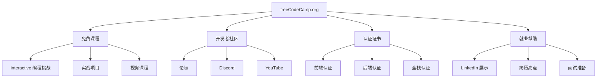
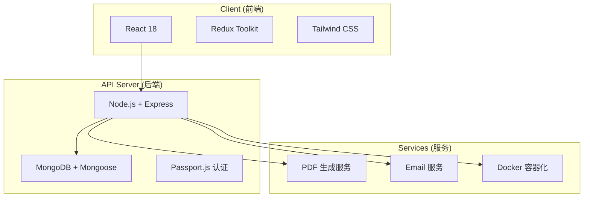

# freeCodeCamp：从入门到精通 — 全球最大免费编程学习平台

> **目标读者**：零基础编程学习者、前端开发者、全栈工程师、技术布道者
> **前置知识**：无（入门课程不需要任何基础）
> **预计学习时间**：数百小时（完整课程）+ 贡献开源项目

---

freeCodeCamp 不是又一个"教程聚合站"。它的特殊性在于三点：440k Stars 背后是 5000+ 贡献者持续维护的课程体系、501(c)(3) 慈善机构身份保证永久免费、10 万+ 已验证的就业案例。换句话说，这是一个把"学—练—认证—求职"串成闭环的开源项目，而不是只发文章的内容站。本文从课程体系、技术架构、本地开发到贡献流程，拆解这个平台怎么运转、怎么用、怎么参与。

## 学习目标

读完本文后，你应当能够：

- 说出 freeCodeCamp 六大认证的先后顺序，以及每条路径对应的项目数量
- 解释为什么 freeCodeCamp 选 MongoDB 而不是 SQL、选 pnpm 而不是 npm、用 Turborepo 管什么
- 在本地用 Dev Container 或手动方式跑起 client + API 两端服务，并跑通 E2E 测试
- 定位常见本地开发问题（端口冲突、MongoDB 连接失败、依赖安装报错）的排查路径
- 通过 Fork—分支—PR 流程给课程内容或平台代码提交一次贡献

---

## 一、项目概述与背景

### 1.1 什么是 freeCodeCamp？

freeCodeCamp（[freeCodeCamp/freeCodeCamp](https://github.com/freeCodeCamp/freeCodeCamp)）是全球最大的免费编程学习开源项目，由 **donor-supported 501(c)(3) charity**（捐赠者支持的美国 501(c)(3)慈善机构）运营。

**使命**：帮助数百万忙碌的成年人转型进入科技行业。



### 1.2 项目数据

| 指标 | 数值 |
|------|------|
| GitHub Stars | **440k** |
| GitHub Forks | **43.9k** |
| Contributors | **5,000+** |
| Commits | **41,278** |
| 许可证 | BSD-3-Clause |
| 主要语言 | TypeScript 77.0%, JavaScript 17.5%, CSS 5.3% |

### 1.3 成就与影响

> "Our community has already helped more than **100,000 people get their first developer job**."

这是 freeCodeCamp 最根本的吸引力——帮你找到第一份开发工作，而不是给你一堆教程。

### 1.4 免费资源矩阵

| 资源 | 说明 | 链接 |
|------|------|------|
| 互动课程 | 2,000+ 编程挑战 | freecodecamp.org/learn |
| 论坛 | 编程帮助与项目反馈 | forum.freecodecamp.org |
| YouTube | Python/SQL/Android 等免费课程 | youtube.com/freecodecamp |
| 技术博客 | 数千篇编程教程 | freecodecamp.org/news |
| Discord | 开发者社区交流 | discord.gg/Z7Fm39aNtZ |

---

## 二、认证课程体系

### 2.1 全栈开发者认证（主路径）

freeCodeCamp 提供完整的 **Full-Stack Developer Curriculum**，包含 6 大认证。这六条路径不是平行的——前三条（响应式网页设计、JavaScript、前端库）是前端主线，第四条 Python 是分支（偏自动化方向），第五、六条（关系型数据库、后端 API）是后端主线。每条认证都包含 5 个实战项目，项目必须全部通过自动测试才能拿到证书。

#### 认证一：Responsive Web Design（响应式网页设计）

这是入门认证，只要求会 HTML 和 CSS。学习内容覆盖 HTML5 语义化标签、CSS3 盒模型、Flexbox、Grid、响应式设计原理和无障碍访问（Accessibility）。5 个项目都是纯静态页面：Tribute Page（致敬页面）、Survey Form（调查表单）、Product Landing Page（产品落地页）、Technical Documentation Page（技术文档页）、Personal Portfolio Webpage（个人作品集）。

**在线课程**：https://www.freecodecamp.org/learn/responsive-web-design-v9/

#### 认证二：JavaScript 算法与数据结构

第二条认证把语言从 CSS 切到 JavaScript，重点在 ES6+ 语法、算法与数据结构基础、函数式编程和面向对象编程。项目从静态页面变成纯逻辑题：Palindrome Checker（回文检查器）、Roman Numeral Converter（罗马数字转换器）、Caesar's Cipher（凯撒密码）、Telephone Number Validator（电话号码验证器）、Cash Register（收银机）。这一关开始有"算法味"，写不出来很正常，建议先看完 ES6 章节再动手。

**在线课程**：https://www.freecodecamp.org/learn/javascript-v9/

#### 认证三：Front-End Development Libraries（前端库）

第三条认证引入第三方库：Bootstrap、jQuery、Sass、React、Redux。和前两条的区别在于——这里开始处理"状态"和"组件"，不再是单文件脚本。5 个项目都是交互式 Web App：Random Quote Machine（随机引言生成器）、Markdown Previewer（Markdown 预览器）、Drum Machine（鼓机）、JavaScript Calculator（JavaScript 计算器）、Pomodoro Clock（番茄钟）。React 部分如果觉得吃力，可以先做前两个项目再回头学 Redux。

**在线课程**：https://www.freecodecamp.org/learn/front-end-development-libraries-v9/

#### 认证四：Python（Python 编程）

这是前端主线之外的分支，适合想做自动化或数据分析的学习者。内容覆盖 Python 基础语法、OOP 面向对象、文件操作与 I/O、自动化脚本编写。项目偏工程化：Arithmetic Formatter（算术格式化）、Time Calculator（时间计算器）、Budget App（预算应用）、Polygon Area Calculator（多边形面积计算器）、Probability Calculator（概率计算器）。如果目标是全栈 Web，这条可以跳过，直接走第五、六条。

**在线课程**：https://www.freecodecamp.org/learn/python-v9/

#### 认证五：Relational Databases（关系型数据库）

第五条认证切到 SQL 和 Bash，数据库用 PostgreSQL。学习内容包含 SQL 查询语言、PostgreSQL 数据库、数据库设计与规范化、Bash 命令行基础。项目都是数据库设计题：Celestial Bodies Database（天体数据库）、World Cup Database（世界杯数据库）、Salon Appointment Scheduler（沙龙预约调度器）、Periodic Table Database（元素周期表数据库）、Number Guessing Game（猜数字游戏）。注意这条认证的运行环境是虚拟机，不是浏览器，需要本地装好 Gitpod 或类似工具。

**在线课程**：https://www.freecodecamp.org/learn/relational-databases-v9/

#### 认证六：Back-End Development and APIs（后端开发与 APIs）

最后一条认证把 Node.js、Express、MongoDB 串起来，是全栈闭环的最后一环。学习内容覆盖 Node.js 运行时、Express 框架、RESTful API 设计、MongoDB 与 Mongoose、认证与安全。5 个项目都是独立的微服务：Timestamp Microservice（时间戳微服务）、Request Header Parser（请求头解析器）、URL Shortener（URL 短链接服务）、Exercise Tracker（运动追踪器）、File Metadata Microservice（文件元数据微服务）。做完这一条，你就有了完整的"前端 + 后端 + 数据库"作品集。

**在线课程**：https://www.freecodecamp.org/learn/back-end-development-and-apis-v9/

### 2.2 语言认证（Beta）

除了编程认证，freeCodeCamp 还在 Beta 阶段提供语言学习认证，主要面向非英语母语开发者：

| 认证 | 说明 | 链接 |
|------|------|------|
| A2 English for Developers | 开发者英语（初级） | /learn/a2-english-for-developers/ |
| B1 English for Developers | 开发者英语（中级） | /learn/b1-english-for-developers/ |
| A1 Professional Spanish | 专业西班牙语（初级） | /learn/a1-professional-spanish/ |
| A1 Professional Chinese | 专业中文（初级） | /learn/a1-professional-chinese/ |

### 2.3 其他资源

除了主路径认证，freeCodeCamp 还整合了一批外部学习资源：

| 资源 | 说明 |
|------|------|
| The Odin Project | freeCodeCamp Remix 版本 |
| Coding Interview Prep | 面试算法题库 |
| Project Euler | 数学与编程挑战 |
| Rosetta Code | 编程语言对比学习 |
| Foundational C# with Microsoft | 微软官方认证 |

---

## 三、技术架构解析

### 3.1 整体架构

freeCodeCamp 平台采用现代化的全栈架构：



### 3.2 目录结构详解

```
freeCodeCamp/
├── .devcontainer/           # VS Code Dev Container 配置
├── .github/                # GitHub Actions 工作流
├── .husky/                 # Git Hooks (pre-commit 等)
├── api/                    # Express API 服务器
│   ├── config/             # 数据库、环境变量配置
│   ├── middleware/          # 中间件（认证、日志）
│   ├── routes/             # API 路由定义
│   └── services/            # 业务逻辑服务
├── client/                 # React 单页应用
│   ├── src/               # React 组件
│   ├── components/         # 可复用组件
│   ├── pages/            # 页面组件
│   └── utils/            # 工具函数
├── curriculum/             # 课程内容（JSON 格式）
│   └── challenges/       # 每个挑战的详细定义
├── docker/                 # Docker 部署配置
├── e2e/                    # Playwright 端到端测试
├── packages/                # NPM MonoRepo 包
│   └── api-doc-generator  # API 文档生成器
├── tools/                  # 开发工具和脚本
├── package.json            # 根 workspace 配置
├── pnpm-lock.yaml         # pnpm 锁定文件
├── pnpm-workspace.yaml    # workspace 定义
├── turbo.json             # Turborepo 构建配置
└── tsconfig-base.json    # TypeScript 基础配置
```

### 3.3 技术栈详解

| 层级 | 技术 | 说明 |
|------|------|------|
| 前端框架 | React 18 | UI 组件化开发 |
| 状态管理 | Redux Toolkit | 全局状态 |
| 样式 | Tailwind CSS | Utility-first CSS |
| 后端运行时 | Node.js | JavaScript 服务端 |
| Web 框架 | Express.js | REST API |
| 数据库 | MongoDB | 文档数据库 |
| ODM | Mongoose | MongoDB 建模 |
| 认证 | Passport.js | 多策略认证 |
| 测试 | Playwright | E2E 测试 |
| 构建 | Turborepo | MonoRepo 构建 |
| 包管理 | pnpm | 高效依赖管理 |
| CI/CD | GitHub Actions | 自动化部署 |

### 3.4 关键技术选型为什么这么定

技术栈表里几个选择值得展开说，因为它们不是随便选的，而是和 freeCodeCamp 的业务形态强绑定。

**MongoDB 而不是 SQL**：freeCodeCamp 的核心数据是"课程挑战"——每个挑战的字段不固定（有的有视频、有的有测试用例、有的有解决方案），用文档数据库存 JSON 比强制 schema 的 SQL 灵活。Mongoose 在上面补了一层 schema 校验，避免文档完全无结构。注意第五条认证教的是 PostgreSQL，这是课程内容，和平台自身的技术选型是两回事。

**pnpm 而不是 npm/yarn**：freeCodeCamp 是 MonoRepo，`client/`、`api/`、`packages/` 下有多个子包，共享大量依赖。pnpm 用硬链接把同一个包只存一份在全局 store，再 symlink 到各子包，磁盘占用比 npm/yarn 低 50% 以上，安装速度也快。`pnpm-lock.yaml` 和 `pnpm-workspace.yaml` 就是这套机制的配置入口。

**Turborepo 管什么**：MonoRepo 的痛点是"改了一个子包，要重新构建哪些包？"。Turborepo 通过依赖图分析，只重建受影响的包，并缓存构建结果。`turbo.json` 里定义的就是这些任务的依赖关系和缓存策略。没有它，每次 `pnpm run build` 都会全量构建，CI 时间会爆炸。

**Passport.js 而不是自研认证**：freeCodeCamp 支持邮箱、GitHub、Google 等多种登录方式，Passport.js 的策略模式（strategy）正好对应这种需求——每种登录方式是一个独立 strategy，互不干扰。自研认证要处理 OAuth 流程、session 管理、token 刷新，重复造轮子没有收益。

### 3.5 开发环境配置

#### 使用 Dev Container（推荐）

```bash
# 1. 确保已安装 VS Code 和 Docker

# 2. 安装 Remote - Containers 扩展
# code --install-extension ms-vscode-remote.remote-containers

# 3. 打开项目
cd freeCodeCamp
code .

# 4. 点击 "Reopen in Container"
# 自动配置开发环境
```

Dev Container 的优势在于把 Node 版本、pnpm 版本、MongoDB 实例全部封进容器，避免"我这能跑你那不能跑"的环境差异。第一次启动会拉镜像、装依赖，耗时 5–10 分钟；之后每次启动都是秒级。

#### 手动配置

```bash
# 1. 克隆仓库
git clone https://github.com/freeCodeCamp/freeCodeCamp.git
cd freeCodeCamp

# 2. 安装 pnpm
npm install -g pnpm

# 3. 安装依赖
pnpm install

# 4. 复制环境配置
cp sample.env .env

# 5. 启动开发服务器
pnpm run dev
```

---

## 四、课程内容结构

### 4.1 Curriculum 格式

每个课程挑战都存储在 `curriculum/challenges/` 目录下的 JSON 文件中：

```json
{
  "id": "5a32652e",
  "title": "Build a Random Quote Machine",
  "challengeType": 3,
  "videoId": "A9-5KtrNg",
  "solutionUrl": "https://github.com/freeCodeCamp/testSuzyBear",
  "forumTopicId": 17468,
  "dashedName": "build-a-random-quote-machine",
  "description": [
    "...",
    "Here is a sample:"
  ],
  "tests": [
    {
      "text": "I can see a wrapper element with a corresponding id=\"quote-box\".",
      "testString": "assert((function(){..."
    }
  ],
  "solutions": [],
  "isLocked": false,
  "releasedAt": "2015-10-19"
}
```

### 4.2 挑战类型

| 类型 | challengeType | 说明 |
|------|---------------|------|
| Video | 0 | 视频课程 |
| Problem | 1 | 算法问题 |
| Validation | 2 | 自动验证 |
| Project | 3 | 需要完成的项目 |
| Step | 4 | 分步骤任务 |
| Quiz | 5 | 选择题测验 |

---

## 五、本地开发指南

### 5.1 前置要求

- Node.js 18+
- pnpm 8+
- MongoDB（本地或 Docker）
- Git

### 5.2 环境变量配置

```bash
# 创建 .env 文件
cp sample.env .env

# 配置 MongoDB 连接
MONGOHQ_URL=mongodb://localhost:27017/freecodecamp

# 配置会话密钥
SESSION_SECRET=your-secret-key

# 配置 OAuth（可选）
GITHUB_CLIENT_ID=xxx
GITHUB_CLIENT_SECRET=xxx
```

`MONGOHQ_URL` 这个变量名看着奇怪——它保留了早期使用 MongoHQ（现 Compose）的历史命名，但实际指向任意 MongoDB 实例。`SESSION_SECRET` 必须改成你自己的随机字符串，不要用 sample.env 里的默认值，否则本地 session 会被预测。

### 5.3 启动开发服务器

```bash
# 启动所有服务（API + Client）
pnpm run dev

# 或分别启动
pnpm run dev:client  # 只启动前端
pnpm run dev:server  # 只启动后端
```

访问 http://localhost:8000

### 5.4 运行测试

```bash
# E2E 测试
pnpm run test:e2e

# 客户端测试
pnpm run test:client

# API 测试
pnpm run test:api

# Lint 检查
pnpm run lint
```

### 5.5 常见问题排查

本地启动失败时，按下面顺序排查能解决 80% 的问题。

**端口 8000 被占用**：`pnpm run dev` 启动时如果报 `EADDRINUSE`，说明 8000 端口被其他进程占用。用 `lsof -i :8000` 找到进程 PID，`kill -9 <PID>` 释放端口；或者在 `.env` 里改 `PORT` 到其他端口（如 3000），但要注意 client 里硬编码的 API 地址也要同步改。

**MongoDB 连接失败**：报 `MongoNetworkError` 或 `MongooseServerSelectionError` 通常是三种原因——MongoDB 服务没启动、`MONGOHQ_URL` 写错、MongoDB 版本太低。先 `mongod --version` 确认版本 ≥ 4.4，再 `brew services start mongodb-community`（macOS）或 `systemctl start mongod`（Linux）启动服务，最后检查 `.env` 里的连接串端口和库名是否正确。

**pnpm install 报权限错误**：在 macOS 上如果报 `EPERM` 或 `EACCES`，通常是 pnpm 全局 store 路径权限不对。运行 `pnpm setup` 重新配置 store 路径，重启终端后再试。不要用 `sudo pnpm install`，这会破坏 pnpm 的硬链接机制。

**Dev Container 启动卡住**：第一次启动 Dev Container 会拉 Docker 镜像并执行 `pnpm install`，网络慢时可能卡 10 分钟以上。如果超过 15 分钟没动静，检查 Docker Desktop 是否正常运行、磁盘空间是否足够（镜像 + 依赖大约需要 5GB）。

**Husky pre-commit 钩子失败**：提交时如果报 husky 相关错误，通常是 lint 没过。先 `pnpm run lint` 看具体报错，修完再提交。如果确实需要跳过（不推荐），可以用 `git commit --no-verify`，但 CI 会再次检查。

---

## 六、参与贡献指南

### 6.1 贡献方式

| 类型 | 说明 | 入口 |
|------|------|------|
| 课程勘误 | 修复文档错误 | GitHub Issues |
| 新增挑战 | 添加编程挑战 | Pull Request |
| 翻译 | 帮助翻译课程 | Crowdin |
| Bug 修复 | 修复平台 Bug | Pull Request |
| 代码审查 | 审核他人 PR | GitHub PR |

### 6.2 贡献步骤

**第一步：Fork 仓库**

```bash
git clone https://github.com/YOUR_USERNAME/freeCodeCamp.git
cd freeCodeCamp
```

**第二步：创建分支**

```bash
git checkout -b fix/typo-in-curriculum
```

**第三步：做出修改**

```bash
# 修改课程内容
vim curriculum/challenges/english/01-responsive-web-design/xxx.json

# 或修改代码
vim client/src/components/xxx.js
```

**第四步：提交**

```bash
git add .
git commit -m "fix: resolve typo in responsive web design challenge"
git push origin fix/typo-in-curriculum
```

**第五步：创建 Pull Request**

在 GitHub 上创建 PR，填写贡献模板。

### 6.3 翻译贡献

freeCodeCamp 使用 **Crowdin** 进行多语言翻译：

1. 访问 https://contribute.freecodecamp.org
2. 选择要翻译的语言
3. 选择要翻译的文件
4. 提交翻译建议

---

## 七、就业准备资源

### 7.1 认证的价值

> "Once you've earned a certification, you will always have it. You will always be able to link to it from your LinkedIn or resume."

每个认证都可以直接链接到 LinkedIn 和简历，雇主点击后可以看到验证的认证信息。

### 7.2 项目作品集

每个认证都包含 5 个实战项目，这些项目可以：

- 展示在你的 GitHub 上
- 放在简历项目经历中
- 作为面试讨论的话题

### 7.3 面试准备

| 资源 | 说明 |
|------|------|
| Coding Interview Prep | 数百道算法题 |
| Project Euler | 数学编程挑战 |
| The Odin Project | 补充全栈学习 |
| Rosetta Code | 语言对比学习 |

---

## 八、常见问题

### Q1: freeCodeCamp 完全免费吗？

**是的**。freeCodeCamp 是 501(c)(3) 慈善机构，完全依靠捐赠运营。所有课程、项目、认证都是免费的。

### Q2: 认证被认可吗？

认证是 freeCodeCamp 自己颁发的技能认证，可在你的 LinkedIn 和简历上展示。雇主可以看到验证链接，证明你完成了认证。

### Q3: 需要多少时间完成全部课程？

| 认证 | 建议时间 |
|------|----------|
| Responsive Web Design | 300 小时 |
| JavaScript | 300 小时 |
| Front-End Libraries | 300 小时 |
| Python | 300 小时 |
| Relational Databases | 100 小时 |
| Back-End APIs | 300 小时 |
| **全栈认证总计** | **约 1,800 小时** |

### Q4: 可以离线学习吗？

课程内容存储在 Git 仓库中，可以 Clone 后离线阅读。但交互式挑战需要在 freeCodeCamp.org 网站上完成。

### Q5: 如何获得帮助？

| 渠道 | 响应时间 |
|------|----------|
| 论坛 | 数小时内 |
| Discord | 实时 |
| GitHub Issues | 数天 |
| YouTube 评论区 | 数小时 |

### Q6: 证书有效期多久？

**永久有效**。一旦获得认证，证书将永久属于你。唯一的例外是如果被发现违反学术诚信政策。

---

## 九、采用顺序与决策建议

不同读者进入 freeCodeCamp 的姿势不一样，下面给出三种典型场景的采用顺序。

**场景 A：零基础转行，目标 1 年内就业**
按认证一到六的顺序走，不要跳。前三条认证（响应式网页设计、JavaScript、前端库）打前端基础，第四条 Python 可以跳过（除非目标岗位明确要 Python），第五、六条认证补后端能力。每条认证预计 300 小时，全栈认证总计约 1800 小时，按每天 4–5 小时算大约 1 年。期间同步把 5 个项目传到 GitHub，简历项目经历就有了。

**场景 B：已有前端基础，想补后端**
直接跳到认证五（关系型数据库）和认证六（后端 API）。这两条认证用 PostgreSQL 和 MongoDB + Express，覆盖了主流后端技术栈。做完后端认证后，可以用 freeCodeCamp 的 Coding Interview Prep 资源刷面试题，准备求职。

**场景 C：想参与开源贡献，积累简历亮点**
先在本地跑通开发环境（第五章），再从课程勘误这种小 PR 起步——修一个 typo、补一个链接、改一句描述。第一个 PR 被 merge 后，再尝试修 Bug 或新增挑战。freeCodeCamp 的维护者对新手 PR 很友好，review 反馈详细，是积累开源经验的好入口。

**通用建议**：无论哪种场景，都先注册账号并完成第一个认证再决定后续路径。freeCodeCamp 的认证体系是线性的，但你的学习路径可以是非线性的——关键是把项目做出来，而不是把课程看完。

## 十、总结

freeCodeCamp 把"学—练—认证—求职"串成一个免费闭环：课程内容由 5000+ 贡献者持续维护，认证项目可挂到 LinkedIn 和简历，10 万+ 已验证的就业案例证明这套路径走得通。它的限制在于——认证是 freeCodeCamp 自己颁发的，不是行业通用证书，雇主认可度取决于具体公司。如果你需要一个零成本、结构化、有社区支撑的编程学习路径，这是目前最完整的选择。

---

**文档信息**

- 难度：⭐⭐（入门到进阶）
- 类型：完整教程
- 更新日期：2026-03-31
- 预计学习时间：数百小时（完整课程）
- GitHub：https://github.com/freeCodeCamp/freeCodeCamp
- 官网：https://www.freecodecamp.org

🦞 由钳岳星君撰写 | 项目源码：https://github.com/freeCodeCamp/freeCodeCamp