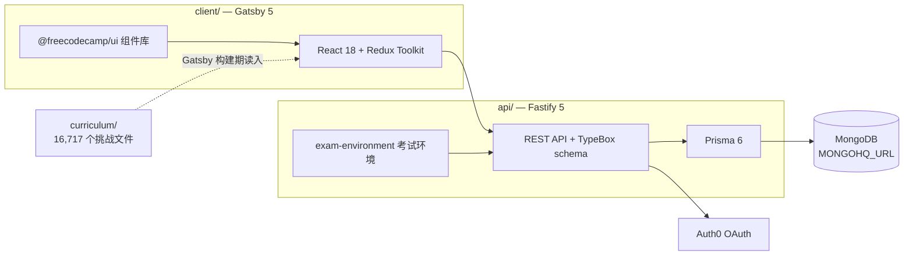

# freeCodeCamp 复核：课程改考试制，代码库换引擎

freeCodeCamp 值得单独拆开看，原因不在"免费"两个字，而在它把学、练、证、考、求职串成了一条完整的链路，并且把整条链路的代码全部开源了——你学习的平台本身就是一份活的大型 Monorepo 教材。这个仓库由捐赠者支持的美国 501(c)(3) 慈善机构运营，README 里的原话是："Our community has already helped more than 100,000 people get their first developer job"（社区已经帮助超过 10 万人拿到第一份开发工作）。

本文 2026 年 3 月底成稿，10 月初按仓库现行代码复核了一遍，有两个事实需要先摆在前面：

一是课程体系已经整体迁到 v9。取证规则从"项目全部通过自动测试就拿证"改成了"完成 5 个必需项目换取考试资格，通过认证考试才发证"。网上大量资料（包括本文上一版）还在按旧规则介绍。

二是平台后端的旧标签该撕掉了。Express、Mongoose、Passport 这套组合在很多教程里还挂着 freeCodeCamp 的名字，而仓库里 `api/` 目录的依赖清单上早就只有 Fastify 5 和 Prisma 6，OAuth 生产环境走 Auth0。2026 年 3 月发文时就是这样——不是这半年才换的，是成稿时就写错了。

## 一、仓库里有什么：一张地图

freeCodeCamp/freeCodeCamp 是一个 pnpm + Turborepo 管理的 Monorepo。2026-10-05 的读数：456,756 stars、48,208 forks、约 6,900 名贡献者（GitHub API 口径，含匿名贡献）、42,912 次提交；软件本体 BSD-3-Clause 许可，`curriculum/` 里的课程内容单独声明版权归 freeCodeCamp.org。发文时点（2026-03-31，era commit `d94a4ef6`）的读数是 440k stars、43.9k forks——由 4 月 1 日的 Wayback Machine 快照证实，当时写的数字没错，只是过期了。

| 目录 | 职责 | 2026-10 口径的关键事实 |
|------|------|------------------------|
| `client/` | 学习平台前端 | Gatsby 5.16 单页应用，React 18.3 + Redux Toolkit |
| `api/` | API 服务器 | Fastify 5.8 + Prisma 6.19（数据仍是 MongoDB），源码在 `api/src/` |
| `curriculum/` | 全部课程内容 | 英文课程 16,717 个挑战文件，Markdown + YAML frontmatter 格式 |
| `e2e/` | 端到端测试 | Playwright |
| `docker/` | 本地依赖服务 | mongo:8.2 副本集 + Mailpit 邮箱，一条 `docker compose up` 拉起 |
| `packages/`、`tools/` | 共享包与开发工具 | `@freecodecamp/ui` 组件库、挑战辅助脚本等 |
| `curriculum/i18n-curriculum` | 翻译（git 子模块） | 翻译已移出主仓库，独立在 freeCodeCamp/i18n-curriculum |

语言占比随这次重构变化明显：TypeScript 62.2%、JavaScript 33.8%、CSS 3.8%（按 GitHub languages API 字节数实算）。仓库描述也换成了 "Learn math, programming, and computer science for free"——数学和计算机科学被提到明面上，对应 `college-algebra-with-python`、`introduction-to-precalculus` 这批课程块。


```mermaid
graph LR
    subgraph client["client/ — Gatsby 5"]
        A["React 18 + Redux Toolkit"]
        B["@freecodecamp/ui 组件库"]
    end
    subgraph api["api/ — Fastify 5"]
        C["REST API + TypeBox schema"]
        D["Prisma 6"]
        E["exam-environment 考试环境"]
    end
    DB[("MongoDB<br/>MONGOHQ_URL")]
    AUTH["Auth0 OAuth"]
    CUR["curriculum/<br/>16,717 个挑战文件"]

    A --> C
    B --> A
    C --> D --> DB
    C --> AUTH
    E --> C
    CUR -. Gatsby 构建期读入 .-> A
```

## 二、课程体系：v9 之后怎么算"拿到认证"

### 2.1 取证规则：项目攒资格，考试发证

现行 README 对取证流程的描述很明确：每门认证由互动课程、workshop、lab、复习页和测验组成，"you'll need to complete 5 required projects to qualify for the exam. Once you pass the exam, then you can claim the certification"——项目是考试资格，证书由考试发放。仓库里每门 v9 认证都有一个元文件（如 `curriculum/challenges/english/certifications/responsive-web-design-v9.yml`），`tests` 字段指向的就是那场认证考试。

证书一旦拿到永久有效，可以一直挂在 LinkedIn 或简历上；README 唯一列出的撤销情形是违反学术诚信政策、明确抄袭他人项目，"we revoke their certifications and ban those people"。

### 2.2 六门 v9 认证与它们的体量

README 把六门 v9 认证合称 Full-Stack Developer Curriculum：

| 认证 | 仓库结构实测 | 课程链接 |
|------|--------------|----------|
| Responsive Web Design | 3 章（HTML / 计算机 / CSS）+ 考试章 | [responsive-web-design-v9](https://www.freecodecamp.org/learn/responsive-web-design-v9/) |
| JavaScript | 236 个课程块 | [javascript-v9](https://www.freecodecamp.org/learn/javascript-v9/) |
| Front-End Development Libraries | 59 个课程块 | [front-end-development-libraries-v9](https://www.freecodecamp.org/learn/front-end-development-libraries-v9/) |
| Python | 88 个课程块 | [python-v9](https://www.freecodecamp.org/learn/python-v9/) |
| Relational Databases | 34 个课程块 | [relational-databases-v9](https://www.freecodecamp.org/learn/relational-databases-v9/) |
| Back-End Development and APIs | 55 个课程块 | [back-end-development-and-apis-v9](https://www.freecodecamp.org/learn/back-end-development-and-apis-v9/) |

课程按五级层次组织：Superblock（课程）→ Chapter（章）→ Module（模块）→ Block（块）→ Task（单个挑战）。块的类型直接写在命名里：`lecture-`（讲授）、`workshop-`（跟练）、`lab-`（独立实验）、`review-`（复习）、`quiz-`（测验）。以 RWD v9 为例，HTML 章以 `workshop-curriculum-outline` 开场，debug 型 lab 穿插在讲授之间，经典项目 `workshop-cat-photo-app` 就在第一个模块里；CSS 章靠 `workshop-piano`、`workshop-magazine` 这批项目推进。教学模块的收尾格式相当固定：复习块加测验块。

RWD v9 的取证项目也换了名单，五个独立的 lab 模块：Build a Survey Form、Build a Page of Playing Cards、Build a Book Inventory App、Build a Technical Documentation Page、Build a Product Landing Page。旧名单里的 Tribute Page 和 Personal Portfolio Webpage 还在课程里，但已经降级为普通 lab，不再计入取证。

学时数字需要单独提醒：v9 认证页面不再标注小时数（responsive-web-design-v9 页面实测通篇无 hours 字样），"每门 300 小时、全栈 1,800 小时"是旧课程时代的口径，现在官方不给总数，只给课程体量。判断工作量更可靠的方式是直接数页面上的模块和项目。

### 2.3 语言认证与一门还没上线的全栈考试

语言认证按国际语言标准分级，README 列了四门 Beta：A2 English for Developers、B1 English for Developers、A1 Professional Spanish、A1 Professional Chinese。仓库里实际还有 A2 Professional Chinese 和 A2 Professional Spanish 两门——元文件和课程结构齐备，对应页面已经可以访问（2026-10 实测 200），只是 README 的名单还没更新。A1 Professional Chinese 的结构文件里仍有整章标记 `comingSoon`，处于分段上线状态。

另有一门独立的 Certified Full-Stack Developer 认证（`full-stack-developer-v9`）：它的结构文件里只有一个 chapter，就是那场认证考试本身，而这场考试至今标记 `comingSoon: true`，尚未开放。

除 v9 主线外，仓库还挂着 31 个认证定义文件：微软合作的 Foundational C# with Microsoft、machine-learning-with-python、data-analysis-with-python、college-algebra-with-python 等，外加一批标记 `legacy-` 的停更路径。README 另外点名了求职辅助资源：The Odin Project（freeCodeCamp Remix 版）、Coding Interview Prep、Project Euler、Rosetta Code。

## 三、代码库的真实引擎

### 3.1 API 服务器：Fastify + Prisma，不是 Express + Mongoose

`api/package.json` 的依赖清单是这一节最直接的证据：fastify 5.8、@prisma/client 6.19、@fastify/oauth2、@fastify/csrf-protection、jsonwebtoken、stripe、@growthbook/growthbook、@sentry/node。Express、Mongoose、Passport 在清单上一个都没有。API 源码在 `api/src/` 下，按 app.ts、server.ts、routes/、plugins/、db/、schemas/、utils/ 组织，另有 `exam-environment/`（考试环境）和 `daily-coding-challenge/`（每日挑战）两个独立模块。

数据库没有换，还是 MongoDB。Prisma schema 里 `datasource db` 的 provider 是 `"mongodb"`，连接串沿用 `MONGOHQ_URL` 这个变量名——它保留自早期托管服务商 MongoHQ 的命名，现在指向任意 MongoDB 实例。变化在于半年间原始的 `mongodb` 驱动从依赖里移除了（3 月的 era 版本还同时装着 mongodb 6.21，现在只剩 Prisma 一条通路）。本地开发用 docker compose 起的 mongo:8.2 带了 `--replSet rs0` 副本集参数，由 setup 服务自动执行副本集初始化——Prisma 的 MongoDB 连接器跑事务需要副本集，这不是可省的配置。

登录链路：生产环境 OAuth 走 Auth0（`sample.env` 里 AUTH0_CLIENT_ID / AUTH0_CLIENT_SECRET / AUTH0_DOMAIN 三件套），本地开发直接开 `FCC_ENABLE_DEV_LOGIN_MODE=true` 免掉外网回调。会话与令牌用 SESSION_SECRET、COOKIE_SECRET、JWT_SECRET 三个密钥分开签名。支付、订阅、A/B 实验、监控分别对应 Stripe、PayPal/Patreon、GrowthBook、Sentry，站内搜索用 Algolia。

`sample.env` 在 2026 年 3 月之后新增了一段值得留意：SOCRATES_API_KEY 与 SOCRATES_ENDPOINT，注释写明 "Socrates (AI-powered hints)"——AI 提示功能已经进了平台配置面。同期新增的还有 Third-party App API 的鉴权令牌和 FCC_ENABLE_CLASSROOM 开关。

### 3.2 前端：Gatsby 5 与自研组件库

`client/` 是 Gatsby 5 应用，freeCodeCamp.org 生产页面的 HTML 里就能看到 "generator: Gatsby 5.16.0"。UI 组件来自自家 npm 包 @freecodecamp/ui 6.0，样式走 postcss 管理普通 CSS——依赖清单里没有 Tailwind，也没有 Bootstrap。编辑器体验堆了不少专门件：Monaco 编辑器、xterm 终端、CodeSandbox Sandpack（浏览器内沙箱）、react-speech-recognition（听写挑战）、Tone.js（鼓机项目用）。

### 3.3 挑战文件长什么样

课程文件全部是 Markdown + YAML frontmatter。一个真实的 lab（`curriculum/challenges/english/blocks/lab-recipe-page/668f08ea07b99b1f4a91acab.md`）开头是：

```markdown
---
id: 668f08ea07b99b1f4a91acab
title: Build a Recipe Page
challengeType: 25
dashedName: build-a-recipe-page
demoType: onClick
---

# --description--

**Objective:** Fulfill the user stories below and get all the tests to pass to complete the lab.

**User Stories:**

1. You should have a `!DOCTYPE html` declaration.
```

id 是 24 位十六进制的 MongoDB ObjectId，`challengeType` 从 `packages/shared/src/config/challenge-types.ts` 的枚举取值——这个枚举有 34 个值（0 到 33），远不止"视频/题目/项目"几类。挑常用的：`html=0`、`js=1`、`step=7`、`quiz=8`、`video=11`、`exam=17`、`multipleChoice=19`、`dialogue=21`（语言课程的对话题）、`fillInTheBlank=22`、`lab=25`、`review=31`。测试断言写在 `# --hints--` 段里，直接是可以执行的 JavaScript：

```js
assert.match(code, /<!DOCTYPE html>/i);
```

把一个挑战从仓库文件到用户进度串起来，全链路是这样的：贡献者在 `curriculum/challenges/english/blocks/` 下写 Markdown，构建时课程构建器把全部挑战编译成 `curriculum/generated/curriculum.json`，Gatsby 据此生成课程页面；学员在浏览器里完成挑战、断言全绿后提交，客户端调 Fastify API，Prisma 把记录写进 MongoDB 的 CompletedChallenge 集合；攒够一门认证的 5 个必需项目后，考试入口解锁，考试在独立的 exam-environment 应用里进行，通过后发证。全程每个环节的代码都在这个仓库里，这也是它作为教材最值钱的地方。

## 四、本地跑起来（2026-10 口径）

官方贡献文档给出的前置要求是 Node.js 24.x（Active LTS）和 pnpm 10.x，仓库 `.nvmrc` 同样钉在 24。上一版写的"Node 18+、pnpm 8+"在发文时就已过期。

推荐路径是 Dev Container：装 Docker Desktop 和 VS Code 的 Dev Containers 扩展，打开仓库后 Reopen in Container。镜像里带 Node、pnpm 和依赖缓存，MongoDB（副本集）和 Mailpit 作为独立服务自动拉起，依赖安装也一并完成。

手动配置对应四步：

```bash
git clone https://github.com/freeCodeCamp/freeCodeCamp.git
cd freeCodeCamp
pnpm install
cp sample.env .env
```

然后先种子后启动：

```bash
pnpm run seed      # 建测试用户、考试和问卷数据
pnpm run develop   # 同时起 API 和 client
```

client 跑在 `http://localhost:8000`，API 跑在 `http://localhost:3000`，由 `.env` 里的 HOME_LOCATION 和 API_LOCATION 控制。几个对开发效率影响很大的变量：`FCC_SUPERBLOCK='responsive-web-design-v9' pnpm run develop` 只构建指定课程，改课程内容时能把全量构建压成单课程构建；`FCC_BLOCK` 和 `FCC_CHALLENGE_ID` 可以再往下细调。

常用脚本对照（都在根 package.json 里）：

| 想做什么 | 命令 |
|----------|------|
| 全量启动（API + client） | `pnpm run develop` |
| 只构建某门课程启动 | `FCC_SUPERBLOCK='<superblock>' pnpm run develop` |
| 客户端 / API 单元测试 | `pnpm run test-client` / `pnpm run test-api` |
| 端到端测试 | `pnpm playwright:run` |
| Lint + 类型检查 | `pnpm run lint` |
| 带认证状态的测试用户 | `pnpm run seed:certified-user` |

排查三则：端口冲突先看 8000（client）和 3000（API）被谁占了，改端口要同步改 `.env` 里的两个 LOCATION 变量；MongoDB 连不上先确认 docker compose 里的副本集初始化容器跑完了（Prisma 需要副本集，单节点 mongod 不够）；`pnpm install` 报权限错误用 `pnpm setup` 重配 store 路径，不要 sudo。

## 五、参与贡献

贡献入口是 [contribute.freecodecamp.org](https://contribute.freecodecamp.org)，对应 freeCodeCamp/contribute 仓库里的三十多篇文档：从基础 Git 工作流、课程文件结构，到 workshop、lab、quiz 各类块的专门写法，再到写作风格指南，改课程要用的材料基本都在。

翻译是这条线上变化最大的一块。2026 年 3 月前后，贡献文档里的翻译页面挂着暂停公告："we're not accepting contributions to translate our curriculum"——i18n 迁移期间翻译通道整体关闭。现在翻译已经迁到独立的 [freeCodeCamp/i18n-curriculum](https://github.com/freeCodeCamp/i18n-curriculum) 仓库（主仓库以子模块方式引用它），流程改为标准的 fork—分支—PR。早年间"上 Crowdin 认领句子"的玩法已经翻篇，现在贡献文档里连 Crowdin 字样都搜不到。

课程内容的 PR 起步姿势：在 issues 区认领或提报勘误，fork 后建分支，改动 `curriculum/challenges/english/blocks/` 下对应的 Markdown 文件，`pnpm run lint` 过钩子后提交 PR。仓库还备了 `tools/challenge-helper-scripts/` 一组脚手架，`create-new-project`、`create-new-quiz`、`rename-challenges` 这类重复劳动都脚本化了。

## 六、半年账：2026-03-31 → 2026-10-05

| 事项 | 发文时点 | 复核时点 |
|------|----------|----------|
| Stars / Forks | 440k / 43.9k（Wayback 04-01 实拍） | 456,756 / 48,208 |
| 提交数 | 41,277 | 42,912 |
| API 数据访问 | Prisma 6.19 + mongodb 驱动并存 | 仅 Prisma，原始驱动移除 |
| 邮件本地开发 | SES 直连配置 | nodemailer + Mailpit（docker compose 自带） |
| AI 能力 | — | Socrates AI hints、TPA API、Classroom 开关进 sample.env |
| 课程上新 | — | +algorithms-and-data-structure、+learn-data-visualization-with-d3、+python-programming-fundamentals |
| 语言认证页面 | A2 Professional Chinese/Spanish 已入库 | 两个页面均可访问，README 名单未跟进 |
| 全栈认证考试 | comingSoon | 仍 comingSoon |
| 前端版本 | React 18.2.0 / Gatsby 5.16.0 | React 18.3.1 / Gatsby 5.16.1（版本滚动） |

课程主线这半年没有再动结构——v9 重构在发文前就已完成，superblock 目录半年只净增 3 门。真正在动的是边缘：AI 功能进配置、依赖滚动升级、语言认证逐门点亮。

## 七、谁该用、怎么用

**零基础转行**：按 RWD v9 → JavaScript v9 → Front-End Libraries v9 → Back-End APIs v9 的顺序走，Python 和 Relational Databases 两门按目标岗位取舍。每门都做好"项目攒资格 + 一场考试"的心理准备——这和旧资料里"项目全对即拿证"的预期不同，考试环节是绕不过去的。新认证页面不标学时，别按 300 小时/门做计划，按模块数和项目数估。

**已有前端经验补后端**：直接进 Relational Databases v9（SQL、Bash、Git，五门取证项目在浏览器内托管的开发容器里完成）和 Back-End Development and APIs v9。后者的课程栈是 Node 核心模块、npm、Express、REST、WebSocket、认证与安全——课程教的 Express 与平台自身用 Fastify 是两回事；旧认证里的 MongoDB/Mongoose 内容在 v9 里已经拿掉了，需要 NoSQL 得另找材料。完成后配 Coding Interview Prep 备面试。

**攒开源履历**：这份代码库规模适中、领域清晰，从课程勘误 PR 起步很顺。想看大型 TypeScript Monorepo 怎么组织（Turborepo 任务图、Prisma schema 演进、Gatsby 构建管线、Playwright 测试矩阵），直接读仓库比读十篇教程有用。唯一要提醒的是先跑通本地环境再读代码，边跑边读效率高一截。

结尾回到判断：freeCodeCamp 用十年时间证明了"免费、开源、认证、就业辅助"这条路能走通，10 万就业案例是它最硬的资产；它的短板也一贯清晰——认证是自颁发的技能凭证，雇主认可度因公司而异，且 v9 的考试制抬高了拿证的意志成本。对预算为零、需要结构化路径的学习者，它仍是同类选项里最完整的一个；对开发者，这个仓库本身就是常年更新的大型工程样本，值得放进 watch 列表。
