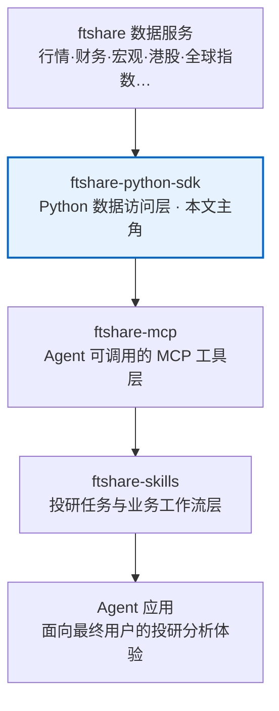

## FTShare Python SDK：把 176 个金融数据接口封装成 pandas 一行调用

## 核心判断

2026 年 6 月 23 日，上海非凸智能科技有限公司（ft.tech）在 GitHub 开源了 [ftshare-python-sdk](https://github.com/ftshare-lab/ftshare-python-sdk)。

这个 SDK 解决的问题很具体：**把 176 个金融数据 REST 接口变成一行 `pandas` 调用**。

```python
import ftshare as ft

market = ft.market_api()
df = market.baidu_financial_calendar(
    start_date="2026-06-01",
    end_date="2026-06-07",
    category="economic",
)
# 拿到的就是 pandas DataFrame，直接 .groupby() / .merge() / .plot()
```

它在 ftshare 生态里的位置更值得看——这个 SDK 不是孤立项目，而是 4 层栈的「数据访问层」：



**图表说明**：ftshare 生态的 4 层栈架构，从上到下依次为：ftshare 数据服务 → ftshare-python-sdk（本文主角）→ ftshare-mcp → ftshare-skills → Agent 应用。SDK 作为数据访问层，向上为 MCP 和 Skills 提供稳定的数据基础。

如果看过 [NVIDIA SkillSpector](https://txtmix.com/posts/tech/nvidia-skillspector-agent-skill-security-scanner/) 那篇，可以和这篇对照看：SkillSpector 管 skill 能不能安全运行，本篇管 skill 怎么拿到数据——这两个问题其实是同一件事的两个侧面。

仓库目前只有 4 颗 star（截至 2026-06-26），但设计本身值得看——176 个 endpoint、14 个 mixin 组合到一个 client，方法体几乎是自动生成的。几个值得细看的设计决策：

- **Mixin 组合**——14 个业务域 mixin 共同继承到 `FtshareClient`，业务增长时只加 mixin 不改 client
- **Endpoint registry 单一事实源**——176 个接口的 path / params / max_page_size 都登记在 `endpoints.ENDPOINTS` 字典里，方法体只负责参数透传
- **DataFrame 优先 + 三层降级**——默认返回 pandas DataFrame，一行 `as_dataframe=False` 退到 Python rows，一行 `raw=True` 退到原始 JSON
- **分页 4 模式**——`page` / `page_size` / `limit` 自动翻页 / `all_pages` 全量拉，分别覆盖精确查询、批量取数、全量同步、跨接口分页四类场景

还有几个细节值得提前说：

- MIT 协议 + Python 3.9+，和 akshare / tushare 同档，企业内部用没有合规压力
- 默认不绑凭据——`market_api()` 不需要任何 token，服务端在 `market.ft.tech` 公开承载，零摩擦上手
- 测试分两层——`pytest` 默认跑 mock HTTP 的单元测试；真实接口集成测试用 `FTSHARE_RUN_INTEGRATION=1` 显式开启，避免 CI 默认打挂
- ft.tech 这次是把「AI-native financial data」的品牌叙事第一次落地成开源代码——ftshare-lab 组织 6-23 才在 GitHub 创建，目前只公开了这一个 repo

这篇文章把 SDK 当作「agent skill 时代的数据接入层样本」来拆解，覆盖几个维度：生态卡位、14 个 mixin 的组合方式、176 个 endpoint 的集中管理、一次完整调用的流经路径，以及如何把 DataFrame 直接接进 pandas / quant / agent toolchain。

## 学习目标

读完本文后，你应当能够：

1. 说出 ftshare 生态 4 层栈的职责划分，以及 ftshare Python SDK 在其中的位置。
2. 解释 `FtshareClient` 怎么通过 14 个 mixin 组合实现「一个客户端覆盖 176 个 endpoint」，以及 mixin 模式比「一个大类」或「多个独立 client 类」的工程优势。
3. 描述 endpoint registry 模式（`endpoints.ENDPOINTS` 字典 + `Endpoint` dataclass）怎么让 path / params / max_page_size 等元数据成为单一事实源。
4. 列举 SDK 的三层返回控制（DataFrame 默认 / `as_dataframe=False` 退到 rows / `raw=True` 退到 JSON）各自的适用场景。
5. 区分分页 4 模式（`page` / `page_size` / `limit` / `all_pages` / `fetch_all`）的语义差异。
6. 把这个 SDK 接入到一个 LangChain / MCP / Skill 工作流里，调用 `baidu_financial_calendar` 拉财经日历数据并转成 DataFrame。

## 实践练习

**练习 1：基础调用**
用 ftshare SDK 调用 `baidu_financial_calendar` 接口，获取 2026-06-01 到 2026-06-07 的 economic 类型财经事件，并返回 DataFrame。

**练习 2：Mixin 探索**
查看 `ftshare.endpoints.ENDPOINTS` 字典，找出所有属于 `MarketApiMixin` 的 endpoint，并调用其中一个获取股票涨跌停数据。

**练习 3：分页模式对比**
用 `limit=300` 和 `all_pages=True` 两种方式分别拉取某接口数据，观察 SDK 的自动翻页行为，并对比两种模式的适用场景。

**练习 4：MCP Tool 封装**
把这个 SDK 封装成一个 MCP tool，让 agent 可以通过 tool calling 获取财经日历数据。

## 自测问题

1. Mixin 组合模式相比「一个大类」方案，在团队协作时有什么优势？
2. `ENDPOINTS` 字典用 `@dataclass(frozen=True)` 装饰的目的是什么？
3. `as_dataframe=False` 和 `raw=True` 的区别是什么？各自适合什么场景？
4. 如果某个接口的 `max_page_size=200`，但你需要 500 条数据，SDK 会怎么处理？
5. 为什么 SDK 要在 `extract_tabular` 里适配多种 envelope 形状（`data.records` / `data.items` / `items` / 顶层数组）？

## 目录

- [核心判断](#核心判断)
- [学习目标](#学习目标)
- [生态卡位：4 层栈中的数据访问层](#生态卡位4-层栈中的数据访问层)
- [总览图：从用户调用到 HTTP 响应](#总览图从用户调用到-http-响应)
- [Mixin 组合模式：一个 client 覆盖 14 个业务域](#mixin-组合模式一个-client-覆盖-14-个业务域)
- [Endpoint registry：176 个接口的单一事实源](#endpoint-registry176-个接口的单一事实源)
- [任务如何流过系统：一次完整调用](#任务如何流过系统一次完整调用)
- [DataFrame 优先 - 三层返回控制](#dataframe-优先-三层返回控制)
- [分页 4 模式](#分页-4-模式)
- [异常三层分类](#异常三层分类)
- [实战踩坑笔记](#实战踩坑笔记)
- [与同类 SDK 的差异点](#与同类-sdk-的差异点)
- [决策启示：skill 作者 / 数据团队 / 量化研究者各看什么](#决策启示skill-作者--数据团队--量化研究者各看什么)
- [采用顺序与边界](#采用顺序与边界)
- [常见问题解答](#常见问题解答)
- [进阶路径](#进阶路径)
- [参考资料](#参考资料)
- [优化说明](#优化说明)

## 生态卡位：4 层栈中的数据访问层

SDK 是 ftshare 4 层栈里的 Python 数据访问层，这层定位决定了它的设计取舍：

- **向下**：对接 ftshare 数据服务（`market.ft.tech/data/` 域下的 REST API），数据采集、清洗、存储都在服务端完成，SDK 不需要自己实现。
- **向上**：为 ftshare-mcp（MCP 工具层）和 ftshare-skills（投研任务层）提供稳定的数据基础。这两个上层产品目前还在 ftshare-lab 内部开发，会大量调用本 SDK 的方法，把每个 endpoint 包成一个 MCP tool 或一个 SKILL 描述。
- **横向**：直接面向独立开发者——quant researcher / data scientist / 想自己拉数据的金融 AI 应用开发者，不需要等 MCP/Skill 中间层，可以直接 `pip install ftshare` 用起来。

这个定位和 akshare / tushare / baostock 有一个关键差异：**ftshare SDK 同时是为上层 agent 工具链设计的**。`as_dataframe=False` 返回 Python rows、默认 `headers` 参数可注入、`base_url` 可切换——这些都是为了让上层 MCP / Skill 能按 tool calling 协议把数据塞回 agent 上下文。

`README.md` 里的 4 层栈图本身就是一个产品策略声明：SDK 管 HTTP 调用和数据形态，MCP 管 tool schema，Skills 管业务编排，Agent 管用户交互——每层边界清晰，不会互相抢活。

### 为什么需要这一层？

直接让 agent 调 REST API 不行吗？三个原因：

1. **接口碎片化**——176 个接口的 URL 规则、参数格式、响应结构不完全一致，让每个 skill 作者都去手写 HTTP 调用和响应解析，重复劳动且容易出错。
2. **数据形态适配**——agent tool 需要 `list[dict]`（方便序列化到 tool result），quant researcher 需要 DataFrame（方便进 pandas 流水线），REST API 返回的是 JSON，SDK 在中间做形态转换，上层不用各自造轮子。
3. **演进隔离**——服务端改 URL 或响应结构时，只要 SDK 跟着升级，所有上层 caller 都不用改；如果 176 个 skill 都手写 HTTP 调用，服务端一改，176 个地方都要修。

## 总览图：从用户调用到 HTTP 响应

一次完整调用经过的层级：


**图表说明**：展示了一次完整调用的层级流经路径。从用户代码开始，依次经过工厂函数、FtshareClient（14 个 mixin + BaseClient）、mixin 方法体、分页策略、HTTP 请求处理、数据提取、返回控制，最终用户拿到数据。其中 mixin 方法体和 HTTP 请求处理层（蓝色高亮）是核心处理环节。

每层职责单一：

- **mixin 方法体**：参数透传到 `get_paginated`，业务元数据查 `ENDPOINTS`
- **`get_paginated`**：分页策略
- **`get`**：单次 HTTP 请求 + 响应处理 + 数据形态转换
- **`to_dataframe` / `select_fields` / `extract_tabular`**：纯函数，可在任何上下文复用

分层之后，上层出错不太会波及下层——mixin 写错了不会破坏 HTTP 解析；HTTP 解析改进了也不会影响分页逻辑。

## Mixin 组合模式：一个 client 覆盖 14 个业务域

`FtshareClient` 的继承关系是这个 SDK 最值得看的设计决策之一：

```python
class FtshareClient(
    CorporateApiMixin,
    EconomicApiMixin,
    EtfApiMixin,
    FinanceApiMixin,
    FundApiMixin,
    FuturesApiMixin,
    GlobalIndexApiMixin,
    GoodwillApiMixin,
    HkApiMixin,
    HolderApiMixin,
    IndexApiMixin,
    MarketApiMixin,
    PledgeApiMixin,
    StockApiMixin,
    BaseClient,
):
    ...
```

14 个 mixin + `BaseClient`，全部拼到一个类里。结果是 `market = ft.market_api()` 这一行返回的实例同时支持 176 个方法（按业务域分组），调用入口统一。

为什么是 mixin 模式而不是其他方案？

**方案 A：一个 6000 行的 `FtshareClient` 大类**

176 个方法塞进一个类，文件会膨胀到几千行。Python 没有 partial class，任何一次添加新方法都要改这个文件，git 冲突频繁。更实际的问题是：代码审查时，reviewer 要在一个几千行的文件里找改动点，体验很差。

**方案 B：14 个独立 client 类（`MarketClient` / `FinanceClient` / ...）**

调用方要构造 14 个实例或选择 1 个。这违反「数据集中在一个 client」的直觉；上层 MCP tool 实现要为每个业务域分别注册 14 个 client。还有一个隐藏成本：如果某个分析需要同时用到行情数据和财务数据（很常见），调用方要管理两个 client 实例。

**方案 C：plugin registry + 动态方法挂载**

启动时遍历 `apis/` 目录，把每个 mixin 的方法挂到 `FtshareClient` 上。这种动态机制对静态类型检查、IDE 自动补全都不友好。更重要的是：动态挂载让「哪些方法可用」变成了运行时才知道的事，增加了调试难度。

**为什么 mixin 比另外两个方案更合适**：

1. **静态可分析**——IDE 能给 `market.baidu_financial_calendar` 自动补全；mypy / pyright 能检查参数类型。quant researcher 写脚本时，自动补全和类型检查能拦住不少低级错误。
2. **业务域物理隔离**——`apis/market.py` 改动只影响 `MarketApiMixin`，不会牵动 Economic 等。团队协作时，两个人同时改不同业务域的 mixin 不会冲突。
3. **加新 mixin 不用改现有代码**——加一个 `BondApiMixin`：在 `apis/bond.py` 写 mixin → 在 `apis/__init__.py` export → 在 `FtshareClient` 继承列表加一项。3 步，每步独立，不用碰 `FtshareClient` 的主体。
4. **测试友好**——每个 mixin 可以单独 mock，不用为了测一个方法而构造完整的 `FtshareClient`。

代价是 mixin 之间不能共享私有状态（因为它们只是「提供方法」的薄层），但 SDK 场景里 mixin 方法不需要共享状态——它们只通过 `self.method()` 调到 `BaseClient` 提供的 HTTP / 分页 / 异常能力。

`apis/__init__.py` 是 mixin 注册表，新加的 mixin 要在那里 export，再加到 `FtshareClient` 的继承列表里。这多几行代码，但调试时能直接看到全貌。如果你维护过「自动发现 plugin」的系统，会知道显式注册长期来看更省心——出问题了不用去猜某个方法是从哪个文件动态挂进来的。

## Endpoint registry：176 个接口的单一事实源

`endpoints.py` 是这个 SDK 设计的另一个核心。方法体里不是这样写死 path 的：

```python
# 反模式：方法体里写死 path
def baidu_financial_calendar(self, ...):
    return self.get("api/v1/market/data/finance/financial-calendar/baidu", ...)
```

而是这样——把所有接口的元数据收拢到一个字典里：

```python
@dataclass(frozen=True)
class Endpoint:
    name: str
    path: str | None
    method: str = "GET"
    title: str = ""
    doc_file: str | None = None
    original_api: str = ""
    params: tuple[str, ...] = ()
    path_params: tuple[str, ...] = ()
    max_page_size: int = 200

ENDPOINTS: dict[str, Endpoint] = {
    'baidu_financial_calendar': Endpoint(
        name='baidu_financial_calendar',
        path='api/v1/market/data/finance/financial-calendar/baidu',
        method='GET',
        title='百度财经日历',
        doc_file='百度财经日历.md',
        original_api='baidu_financial_calendar',
        params=('start_date', 'end_date', 'category', 'page', 'page_size'),
        path_params=(),
        max_page_size=200,
    ),
    # ... 176 个
}
```

然后 mixin 方法查这个表：

```python
def baidu_financial_calendar(self, ...):
    ...
    path = ENDPOINTS['baidu_financial_calendar'].path
    return self.get_paginated(path, ...)
```

把接口元数据抽到 `ENDPOINTS` 字典里，这个做法在 SDK 场景里几乎是必须的，原因有三：

**1. 接口元数据可以自动化生成**

176 个接口的 path / params / max_page_size 完全可以从服务端 OpenAPI schema 自动生成。开发者写了一个一次性脚本（推测在 `tools/` 或 `scripts/` 下，不在本仓库内）从 ftshare 服务端 schema 生成 `ENDPOINTS` 字典，手写 mixin 方法体只保留参数透传 + 文档字符串。新增接口的工作量从「写一个完整 Python 方法」降到「schema 多一条 + mixin 加一个 5 行方法体」。

维护过手写 200 个接口方法的 SDK 就知道，这种「方法体几乎一样，但 URL 和参数不同」的场景最适合代码生成。ftshare 把变化的部分（path / params / max_page_size）抽到 `ENDPOINTS` 字典，方法体只负责参数透传 + 查表。新增接口时，只要 `ENDPOINTS` 多 1 条，mixin 里加 1 个 5 行方法就行，不用动 `get_paginated` 或 `get`。

**2. 文档一致**

`title` / `doc_file` / `original_api` 字段让 `docs/API_REFERENCE.md` 能自动生成。开发者改 endpoint title 时，文档、SDK 方法、客户端代码都从同一源更新。

一个实际问题是：SDK 方法名、文档标题、服务端原始 API 名，这三个字符串经常不一致。ftshare 用 `name` / `title` / `original_api` 三个字段分别存，生成文档时能同时展示三套命名——读者知道 SDK 方法名就能找到文档，知道服务端 API 名也能找到对应的 SDK 方法。

**3. 运行时反射**

`from ftshare.endpoints import ENDPOINTS; print(len(ENDPOINTS))` 直接看到 176。SDK 也支持 `print(endpoint.path)` / `print(endpoint.params)` 查单个接口元数据。这对调试、代码生成、自适应路由都极有用。

一个实际的调试场景：你调某个 endpoint 拿到 404，第一反应是「URL 拼错了？」这时不需要翻服务端文档，直接 `print(ENDPOINTS['your_endpoint'].path)` 就能看到 SDK 认为的正确 URL。如果和服务端文档对不上，要么是 `ENDPOINTS` 生成脚本有 bug，要么是服务端改了 URL 但没同步到 SDK——两种都能快速定位。

`Endpoint` 用 `@dataclass(frozen=True)` 装饰——实例不可变，运行时更安全。`max_page_size=200` 是默认页大小（个别接口如 `stk_limit` / `stk_premarket` 是 500）——这种 per-endpoint 配置不需要方法体关心，全部从 registry 读。

### 延伸：为什么不用动态生成方法？

既然方法体都是参数透传 + 查表，为什么不用 `__getattr__` 动态生成 176 个方法？

技术上可以，但不做的原因：

1. **IDE 支持**——动态生成的方法，IDE 给不了自动补全和参数提示。
2. **静态检查**——mypy / pyright 检查不到动态方法的参数类型，调用方传错参数，运行时才报错。
3. **文档生成**——`docs/API_REFERENCE.md` 需要从方法的 docstring 生成，动态方法没有 docstring。

ftshare 的选择是：方法体手写（但只有 5 行），换来了 IDE 支持、静态检查、文档生成。这是一笔划算的交易。

## 任务如何流过系统：一次完整调用

看一个具体调用怎么流过整个系统——拉 2026-05-26 当天的财经日历，从用户代码到 HTTP 响应完整走一遍。

**用户代码：**

```python
import ftshare as ft

market = ft.market_api(timeout=20)
df = market.baidu_financial_calendar(
    start_date="2026-05-26",
    end_date="2026-05-27",
    category="economic",
    limit=5,
)
print(df)
```

**第 1 步：`market_api()` 工厂**

```python
# ftshare/__init__.py
def market_api(
    base_url: str | None = None,
    timeout: float = 10,
    headers: Mapping[str, str] | None = None,
) -> FtshareClient:
    return _client.market_api(
        base_url=base_url or BASE_URL,
        timeout=timeout,
        headers=headers,
    )
```

工厂函数把模块级 `BASE_URL`（默认 `https://market.ft.tech/data/`）和用户传的参数组装成 `FtshareClient` 实例。`BASE_URL` 是模块级变量——可以通过 `ft.set_base_url(...)` 全局改；也可以在 `market_api(base_url=...)` 时只改这一个 client。`timeout=20` 和 `headers={}` 透传到 `BaseClient.__init__`。

**第 2 步：`FtshareClient.__init__`（继承自 `BaseClient`）**

```python
# base.py
def __init__(
    self,
    base_url: str | None = None,
    timeout: float = 10,
    headers: Mapping[str, str] | None = None,
    session: requests.Session | None = None,
) -> None:
    self.base_url = normalize_base_url(base_url or get_base_url())
    self.timeout = timeout
    self.session = session or requests.Session()
    self.headers = dict(headers or {})
```

关键点：

- `normalize_base_url("https://market.ft.tech/data/")` → 统一成带尾斜杠的规范形式，用户传不带斜杠也照样能用
- `session = requests.Session()` 让多次请求共享 TCP 连接（HTTP keep-alive），比裸 `requests.get()` 快得多
- `headers` 在每次请求都注入，方便上层 MCP/Skill 透传 trace id、user agent 等

**第 3 步：mixin 方法体**

```python
# apis/market.py
def baidu_financial_calendar(
    self,
    start_date,
    end_date,
    category=None,
    page=None,
    page_size=None,
    limit=None,
    all_pages=False,
    max_pages=None,
    *,
    raw=False,
    fields=None,
    as_dataframe=True,
    **kwargs,
):
    request_params = {
        'start_date': start_date,
        'end_date': end_date,
        'category': category,
    }
    request_params.update(kwargs)
    path = ENDPOINTS['baidu_financial_calendar'].path
    return self.get_paginated(
        path,
        page=page,
        page_size=page_size,
        limit=limit,
        all_pages=all_pages,
        max_pages=max_pages,
        raw=raw,
        fields=fields,
        as_dataframe=as_dataframe,
        **request_params,
    )
```

方法体只做三件事：构造 `request_params` 字典（`**kwargs` 让上层未来加参数不用改方法体）、查 `ENDPOINTS['...'].path` 拿 URL、调 `get_paginated`。mixin 里看不到任何 HTTP 逻辑——这正是 mixin 模式的价值：每个文件只关心自己的业务域。

**第 4 步：`get_paginated` 分页调度**

```python
def get_paginated(
    self,
    path,
    *,
    page=None,
    page_size=None,
    limit=None,
    all_pages=False,
    max_pages=None,
    raw=False,
    fields=None,
    as_dataframe=True,
    **params,
):
    endpoint = ENDPOINTS_BY_PATH.get(path)  # 通过 path 反查 endpoint
    max_page_size = endpoint.max_page_size if endpoint else DEFAULT_MAX_PAGE_SIZE

    validate_pagination(
        page=page or 1,
        page_size=page_size,
        max_pages=max_pages,
        max_page_size=max_page_size,
        limit=limit,
    )

    # 决策：单页 or 自动翻页
    if not all_pages and (limit is None or limit <= max_page_size):
        return self.get(
            path,
            raw=raw,
            fields=fields,
            as_dataframe=as_dataframe,
            page=page,
            page_size=page_size,
            **params,
        )

    # 自动翻页路径
    rows = []
    current_page = page or 1
    pages_fetched = 0
    while True:
        if max_pages is not None and pages_fetched >= max_pages:
            break
        payload = self.get(
            path,
            raw=True,  # 中间过程要 raw 才能看到 total_pages
            page=current_page,
            page_size=page_size or max_page_size,
            **params,
        )
        rows.extend(extract_tabular(payload))
        total_pages = total_pages(payload)
        if total_pages is None or current_page >= total_pages:
            break
        current_page += 1
        pages_fetched += 1
        if limit is not None and len(rows) >= limit:
            break

    if limit is not None and limit < len(rows):
        rows = rows[:limit]

    if fields:
        rows = select_fields(rows, fields)

    if as_dataframe and not raw:
        return to_dataframe(rows)
    if raw:
        return rows
    return rows
```

分页的核心决策树：

- `all_pages=False` 且 `limit <= max_page_size` → **单页路径**，1 次 HTTP 请求
- 否则 → **自动翻页路径**，循环到 `total_pages` 到达或 `max_pages` 上限或 `limit` 达到

上面例子里 `limit=5` 小于 `max_page_size=200`，所以走单页路径。

**第 5 步：`get` 单次 HTTP**

```python
def get(self, path, *, raw=False, fields=None, as_dataframe=True, **params):
    return self._request("GET", path, raw=raw, fields=fields, as_dataframe=as_dataframe, **params)

def _request(self, method, path, *, raw, fields, as_dataframe, **params):
    request_params = {k: v for k, v in params.items() if v is not None}
    url = self._build_url(path)

    response = self.session.get(
        url,
        params=request_params,
        timeout=self.timeout,
        headers=self.headers,
    )

    if not 200 <= response.status_code < 300:
        raise FtshareHTTPError(response.status_code, response.url, response.text)

    try:
        payload = response.json()
    except ValueError as exc:
        raise FtshareDecodeError(response.url, response.text) from exc

    raise_for_api_error(payload)

    if raw:
        return payload

    rows = extract_tabular(payload)

    if fields:
        rows = select_fields(rows, fields)

    if as_dataframe:
        return to_dataframe(rows)
    return rows
```

`_request` 是 SDK 的响应处理核心，做了 7 件事：

1. 过滤 None 参数——`requests` 会把 `None` 转成 `?key=None` 字符串，污染 URL
2. 拼 URL（base_url + path）
3. 用共享 `session.get` 发请求
4. 状态码非 2xx → `FtshareHTTPError`
5. JSON 解析失败 → `FtshareDecodeError`
6. 业务 code != 0 → `FtshareAPIError`
7. `extract_tabular` → `select_fields` → `to_dataframe` 三段管道

每段都是纯函数（除 `to_dataframe` 内部懒加载 pandas），出 bug 时定位容易。

**第 6 步：用户拿到 DataFrame**

`extract_tabular` 从响应中按优先级提取 `data.records` / `data.items` / `items` / 顶层数组——这种「适配多种 envelope 形状」的设计让 SDK 能容忍服务端响应结构的小幅演化，不会因为某一层改名就崩。

最终用户拿到的就是 pandas DataFrame：

```
  category   stat_date region   time  ... star negative positive capitalization
0  economic  2026-05-26     英国  07:01  ...    1                                0
1  economic  2026-05-26    新加坡  13:00  ...    1                                0
```

可以直接接 `.groupby()` / `.merge()` / `.plot()`，零摩擦进 quant / data science 工作流。

## DataFrame 优先 - 三层返回控制

SDK 在返回形态上做了三层设计，是 quant developer 用起来最顺手的部分：

```python
# 默认：DataFrame
df = market.baidu_financial_calendar(...)

# 退到 Python rows（list[dict]）
rows = market.baidu_financial_calendar(..., as_dataframe=False)

# 退到原始 JSON
payload = market.baidu_financial_calendar(..., raw=True)
```

三种形态对应的使用场景：

| 形态 | 调用方式 | 数据量 | 典型场景 |
|---|---|---|---|
| **DataFrame**（默认） | `market.method(...)` | 中 | 直接进 pandas 流水线；quant 研究 |
| **Python rows** | `as_dataframe=False` | 小-中 | MCP tool 输出 JSON-Lines；序列化到磁盘 |
| **原始 JSON** | `raw=True` | 任意 | 调试；字段映射研究；payload 反序列化 |

为什么默认 DataFrame 而不是 dict？两个原因：

1. **中国 quant 圈的事实标准**——akshare / tushare / baostock 都是 DataFrame 优先，新 SDK 不跟进会被直接比下去
2. **agent toolchain 友好**——MCP tool 输出时，`as_dataframe=False` 返回的 list[dict] 几乎不用处理就能塞进 tool result；LLM 处理 dict 列表比处理 DataFrame repr 更直接

但 SDK 留好了降级路径——`raw=True` 上层想做自定义反序列化、字段重命名、按 envelope 选分支解析，用 `raw=True` 就能拿到原始 payload 自己处理，不受 SDK 默认行为限制。

`to_dataframe` 函数本身很简单：

```python
def to_dataframe(result):
    import pandas as pd
    if isinstance(result, list):
        return pd.DataFrame(result)
    return pd.DataFrame([result])
```

懒加载 pandas 是关键——SDK 在被 import 时不强制加载 pandas，只有真正调用 DataFrame 路径才触发。对只用 `as_dataframe=False` 或 `raw=True` 的上层 MCP tool，SDK import 几乎零开销。

### 实际场景：MCP Tool 里怎么用

如果你在写一个 MCP tool，让 agent 能调 SDK 拉数据，正确的做法是：

```python
# MCP tool 实现
def get_financial_calendar_tool(start_date: str, end_date: str) -> list[dict]:
    market = ft.market_api()
    rows = market.baidu_financial_calendar(
        start_date=start_date,
        end_date=end_date,
        as_dataframe=False,  # 关键：返回 list[dict]
    )
    return rows  # 直接塞进 tool result
```

如果返回 DataFrame，MCP 框架要帮你序列化，可能丢信息或格式不对。`as_dataframe=False` 返回的 list[dict] 是 MCP 协议原生支持的 JSON 类型，不需要额外处理。

### 实际场景：quant 研究里怎么用

如果你在做 quant 研究，需要把多个 endpoint 的数据合并分析，正确的做法是：

```python
# quant 研究脚本
market = ft.market_api()

# 拉财经日历
df_calendar = market.baidu_financial_calendar(
    start_date="2026-06-01",
    end_date="2026-06-30",
    category="economic",
)

# 拉股票列表
df_stocks = market.stk_limit(...)

# 合并分析
df_merged = pd.merge(df_calendar, df_stocks, ...)
df_merged.groupby(...).mean()
```

DataFrame 默认让你直接进 pandas 流水线，不需要手动转换。

## 分页 4 模式

中国金融数据接口几乎全部分页——数据量大（千股千评、龙虎榜全量都是万行级别）。SDK 的分页抽象做得够不够好，直接影响使用体验。ftshare 给了 4 种模式：

```python
# 模式 1：精确页码（page + page_size）
df = market.baidu_financial_calendar(
    start_date="...", end_date="...",
    page=2, page_size=50,
)

# 模式 2：取最多 N 条（limit 自动翻页）
df = market.baidu_financial_calendar(
    start_date="...", end_date="...",
    limit=300,  # 单页上限 200，SDK 自动翻页并合并
)

# 模式 3：自动翻到底（all_pages）
df = market.baidu_financial_calendar(
    start_date="...", end_date="...",
    all_pages=True,
    page_size=200,
    max_pages=5,  # 安全上限
)

# 模式 4：通用入口（fetch_all）
df = market.fetch_all(
    "baidu_financial_calendar",
    start_date="...", end_date="...",
    page_size=200,
)
```

四个模式的语义差异：

- `page` + `page_size`：**精确控制**单页结果——调试 / 单页验证 / 已知具体页码时用
- `limit`：**结果数优先**——「我最多要 N 条」，SDK 内部自动决定翻几页
- `all_pages`：**全量拉取**——翻到服务端报告的最后一页为止；`max_pages` 是安全阀
- `fetch_all`：**跨接口通用**——通过字符串方法名调用任意 endpoint 并自动翻页，适合写通用同步脚本

### 性能优化建议

**1. 用 `limit` 而不是 `all_pages` 拿批量数据**

如果你需要 500 条数据，`limit=500` 比 `all_pages=True` 好——前者翻 3 页（200+200+100）就停，后者可能翻 50 页，但你其实只需要前 500 条。

**2. `page_size` 设为 `max_page_size` 减少请求次数**

每次 HTTP 请求都有往返延迟。如果你要拿 200 条数据，设 `page_size=200` 只需要 1 次请求；设 `page_size=50` 需要 4 次。在循环里翻页时，这个差异会被放大。

**3. `max_pages` 是安全阀，生产环境一定要设**

如果你用 `all_pages=True` 拉全量数据，但服务端 `total_pages` 因为某种原因变成了 10000，你的脚本会跑很久。设 `max_pages=100` 这类上限，可以在意外情况下保护你。

约束与边界：

- 大多数接口默认单页最大 `200`；`stk_limit` / `stk_premarket` 单页最大 `500`
- `page_size > max_page_size` → 直接抛 `ValueError`，不静默截断
- `limit` 表示「最终最多返回多少条」，允许大于 `max_page_size`，SDK 会分多页请求

`validate_pagination` 在请求前做集中校验：

```python
def validate_pagination(page, page_size, max_pages, max_page_size, *, limit=None):
    if page < 1:
        raise ValueError(f"page must be >= 1; got {page}")
    if page_size is not None and not 1 <= page_size <= max_page_size:
        raise ValueError(f"page_size must be between 1 and {max_page_size}; got {page_size}")
    if limit is not None and limit < 1:
        raise ValueError(f"limit must be >= 1; got {limit}")
    if max_pages is not None and max_pages < 1:
        raise ValueError(f"max_pages must be >= 1; got {max_pages}")
```

分页 4 模式解决的是「调用方能用一致语义拿数据」，但**不代表**「全量数据一定能拿完」——服务端 `total_pages` 不准确、`all_pages` 期间数据更新、`max_pages` 太小都会静默截断。生产环境拉全量数据要做对账，不能假设 `all_pages=True` 就一定拿到完整数据。

## 异常三层分类

ftshare 把异常分成三层，分别对应三种失败模式：

```python
FtshareError                  # 基类
  ├── FtshareHTTPError        # HTTP 非 2xx
  ├── FtshareDecodeError      # 响应不是合法 JSON
  └── FtshareAPIError         # 业务 code != 0
```

调用方可以这样精细处理：

```python
try:
    df = market.baidu_financial_calendar(...)
except ft.FtshareHTTPError as exc:
    # 网络问题 / 服务端 5xx / 404 — 重试或告警
    print("HTTP error:", exc.status_code, exc.url)
except ft.FtshareDecodeError as exc:
    # 响应格式错误 — 通常是服务端 bug
    print("JSON decode error:", exc.url)
except ft.FtshareAPIError as exc:
    # 业务逻辑错误 — 参数错 / 权限不够 / 业务校验失败
    print("API error:", exc.code, exc.message)
```

三种异常都带上下文（status_code + url + response_text 或 code + message + payload），便于日志和告警。

`raise_for_api_error` 检查业务码：

```python
def raise_for_api_error(payload):
    if isinstance(payload, dict) and "code" in payload and payload.get("code") not in (0, "0", 200, "200"):
        message = payload.get("message")
        raise FtshareAPIError(payload.get("code"), str(message) if message is not None else None, payload)
```

注意它同时认 `0` / `"0"` / `200` / `"200"`——兼容服务端不同时期的业务码格式，调用方不用自己处理这种差异。

这种异常分类对上层 MCP tool 很有用：`FtshareAPIError`（比如日期格式不对）可以直接转成 tool 返回的错误信息，让 agent 决定是修正参数重试还是提示用户；`FtshareHTTPError` / `FtshareDecodeError` 这类基础设施错误适合直接抛异常，让人工介入。

## 实战踩坑笔记

以下几点是实际用 SDK 时会碰到的边界情况，文档正文里没有展开说。

### `extract_tabular` 的 envelope 适配什么时候会救你

SDK 在 `extract_tabular` 里按优先级试四种路径：`payload.get("data", {}).get("records")` → `payload.get("data", {}).get("items")` → `payload.get("items")` → `payload` 本身。这么做的原因是：服务端响应结构在不同接口、不同版本之间不完全一致。

一个实际场景：你写了 `market.stk_limit(...)` 拿到 DataFrame，两周后服务端把这个接口的 envelope 从 `{data: {records: [...]}}` 改成了 `{data: {items: [...]}}`。如果 SDK 只认 `records`，你的代码就崩了。现在 SDK 两种都认，你的代码不用改。

但反过来：如果服务端返回的数据不在任何一个已知路径里，`extract_tabular` 会返回空列表，你拿到的是空 DataFrame——不会报错，但数据就是空的。排查时先 `raw=True` 看原始 payload 结构，确认是不是 envelope 又变了。

### `all_pages=True` 时数据在翻页期间发生变化

`all_pages=True` 会循环调用，每次请求之间是有时间差的。如果服务端的数据在你翻页期间发生了变化（比如新的财经事件被插入），你拿到的「全量数据」在逻辑上可能不是同一个快照。

这个问题在写同步脚本时尤其要注意——如果你拉全量数据是为了做离线分析，最好在拉之前记录一个时间戳，分析时知道数据是什么时刻的。

### `market.ft.tech` 超时怎么处理

`timeout` 参数传的是单次 HTTP 请求的超时（读超时）。默认 10 秒，在生产环境可能偏短——如果服务端偶发慢响应，会抛出 `requests.exceptions.ReadTimeout`，被 SDK 包装成 `FtshareHTTPError`（status_code 是 0 或读超时异常）。

如果你的脚本要批量拉很多接口，建议：

- `timeout=30` 或更高，给服务端留足响应时间
- 在调用外层包 `try/except`，超时后做退避重试（SDK 本身没有内置重试逻辑）

### `fields` 是客户端过滤，不是服务端过滤

`fields=["category", "stat_date"]` 这个参数是 SDK 拿到完整响应后，在客户端侧做的字段筛选（`select_fields` 函数）。它不会减少服务端的返回数据量，只会让你拿到的 DataFrame 列少一些。

如果你拉的数据量很大，想减少网络传输，这个参数帮不了你——需要服务端支持字段筛选才行。目前 ftshare 的服务端是否支持，需要看具体接口的文档。

## 与同类 SDK 的差异点

把 ftshare 和中国同类金融数据 SDK 对比：

| 维度 | ftshare Python SDK | akshare | tushare | baostock |
|---|---|---|---|---|
| 协议 | MIT | MIT | 个人授权（积分制） | BSD |
| 凭据 | 无（服务端公开） | 无 | token | 无 |
| 接口数 | 176 | 1000+ | 200+ | 几十 |
| 返回类型 | DataFrame / rows / raw | DataFrame | DataFrame | DataFrame |
| 分页 | 4 模式 | 手动 | 手动 | 手动 |
| 异常分类 | 3 类 | 1 类 | 1 类 | 1 类 |
| 字段筛选 | 内置 | 无 | 无 | 无 |
| MCP 适配 | 设计上支持 | 需手写 wrapper | 需手写 wrapper | 需手写 wrapper |
| Python 版本 | 3.9+ | 3.8+ | 3.6+ | 3.5+ |
| 仓龄 | 3 天 | 多年 | 多年 | 多年 |

ftshare 目前的短板是**接口数量远小于 akshare**（176 vs 1000+）。但它的优势在三点：

1. **三层返回控制**——`raw=True` 是给上层 tool builder 的逃生通道
2. **endpoint registry 模式**——服务端 schema 变了 SDK 不用手改
3. **MIT + 零凭据**——企业内部用零合规摩擦

特别是第 2 点——akshare 和 tushare 都靠人工维护接口列表，176 个接口（且还在增长）靠人工维护效率低且容易出错。这个 SDK 把接口元数据收拢到 `ENDPOINTS` 字典，加新接口的边际成本接近零。

## 决策启示：skill 作者 / 数据团队 / 量化研究者各看什么

ftshare SDK 对三类读者的意义不同：

**Skill 作者**

如果你在做 agent skill 生态里的金融投研 skill，把 ftshare 当数据源是最干净的路径。具体做三件事：

1. `pip install ftshare`——SKILL.md 里写「此 skill 调用 ftshare Python SDK 拉行情数据」即可
2. 不要在 skill 里直接调 176 个 REST API——服务端 URL 改了 skill 就崩；用 SDK 后服务端路径变更由 SDK 维护
3. 默认 `as_dataframe=False`——MCP tool 输出 list[dict] 比 DataFrame 序列化高效

**数据团队**

如果团队要做「内部统一金融数据接口」，ftshare 的 endpoint registry + mixin 模式值得借鉴。关键点：

- 把所有数据源接口登记到中央 `ENDPOINTS` 字典，元数据单一事实源
- 业务域用 mixin 拆分，加新业务域只加 mixin 文件 + 在 `apis/__init__.py` export + 在 client 继承列表加一项
- 默认返回结构化数据（DataFrame / rows），但留 `raw=True` 给上层特殊场景

**量化研究者**

ftshare 的接口分类对你的工作流有直接价值。按研究类型说：

- **基本面研究**——用财务数据（baidu_financial_calendar / balance / cashflow / income / earnings_reports_paginated / performance_forecasts_paginated）
- **宏观对冲**——用宏观经济数据（consumer_*_monthly 一组 17 个接口）
- **技术面 + 资金面**——用股票数据（涨跌停 / 龙虎榜 / 资金流向 / 千股千评 / IPO / 复权因子）
- **跨市场策略**——用港股 / 全球指数（hk / global_index）
- **产品分析**——用基金 / ETF / 期货（fund / etf / futures）

对单接口的快速验证场景，直接 `from ftshare.endpoints import ENDPOINTS; ENDPOINTS['baidu_financial_calendar']` 看 path + params 就行，不用翻服务端文档。

## 采用顺序与边界

对想用这个 SDK 的读者，按以下顺序最高效：

**第一步：`pip install ftshare`，跑一次完整调用**——`market.baidu_financial_calendar(...)` 拿到 DataFrame 就成功。这步验证 SDK 安装 + 客户端构造 + 响应处理整个流程。

**第二步：把现有 quant 代码里的裸 `requests.get` 换成 SDK 调用**——如果代码里有手写的 URL + params + JSON 解析逻辑，逐个迁移到 `market.<endpoint>(...)` 调用。`fields` 参数替代手写的 dict 字段提取。

**第三步：把 SDK 接到 pandas 流水线**——用 `.resample()` / `.groupby()` / `.merge()` 串接多个 endpoint 的输出。这一步效率提升最明显，因为 SDK 已经把响应转成 DataFrame。

**第四步：把 SDK 包成 MCP tool 或 LangChain tool**——为上层 agent skill / ftshare-mcp / ftshare-skills 提供数据源。Tool 实现层通常就两件事：`as_dataframe=False` 拿到 rows + JSON 序列化输出。

**不一定要做的事**：

- 不要把 176 个 endpoint 一次性集成——选和你研究相关的 5-10 个接口深用，比浅尝全部好
- 不要在 skill 里把 SDK 锁版本到特定 patch 号——服务端可能演进，SDK 升级比硬编码路径安全
- 不要绕过 `ENDPOINTS` 表手动构造 URL——这会让 schema 自动生成机制失效

**边界**：这个 SDK 主要覆盖「ftshare 数据服务的 Python 访问」，对以下场景只能部分覆盖：

- **实时行情推送**——HTTP polling 不是推送场景；如果需要 tick 级实时数据，要用专门的 WebSocket SDK（ftshare 后续可能出）
- **复杂金融计算**——技术指标、回测框架、组合优化等是 quant 自己的事，SDK 不做
- **非 ftshare 数据源**——akshare 接口（港股 / 加密货币等）需要单独处理
- **中国大陆 IP 受限场景**——`market.ft.tech` 在境外访问可能被防火墙阻断，需要国内代理

最后一个边界对中国 quant 用户很重要——`ft.set_base_url()` 可以指向国内镜像 / 私有部署，但镜像需要 ftshare 官方支持。如果团队在防火墙严格的环境使用，提前确认部署方案。

## 常见问题解答

**Q1：SDK 是免费的吗？有调用限制吗？**

A：SDK 本身是 MIT 协议，免费。但底层数据服务 `market.ft.tech` 的调用限制需要看 ftshare 官方的服务条款。目前看起来是公开访问（不需要 token），但生产环境使用建议联系 ft.tech 确认 SLA 和限流策略。

**Q2：和 akshare 比，我该用哪个？**

A：如果你需要的是 akshare 已经覆盖但 ftshare 还没有的冷门接口（akshare 有 1000+ 接口，ftshare 目前 176 个），先用 akshare。如果你在做 agent skill 开发，或者需要更稳定的 SDK 架构（mixin + endpoint registry + 三层返回控制），ftshare 更合适。两者可以共存——同一个项目里，akshare 补冷门接口，ftshare 做主要数据层。

**Q3：`market.ft.tech` 在中国大陆能访问吗？**

A：需要测试。如果访问不了，`ft.set_base_url("国内镜像地址")` 可以切换数据源。目前还不清楚 ftshare 有没有国内镜像，建议提 issue 问。

**Q4：SDK 的 pandas 依赖重吗？会影响 import 速度吗？**

A：SDK 用了懒加载——`import ftshare` 时不加载 pandas，只有调用 `to_dataframe` 时才加载。如果你只用 `as_dataframe=False` 或 `raw=True`，import 几乎零开销。

**Q5：怎么贡献新接口？**

A：目前看起来是 ft.tech 内部从服务端 schema 自动生成 `ENDPOINTS` 字典。如果你想要某个新接口，建议在 GitHub 提 issue 说明需求，而不是直接提 PR 加方法——因为方法体是自动生成的，手动加会和程序生成的逻辑不一致。

**Q6：`all_pages=True` 拉全量数据，怎么避免被限流？**

A：两个策略：

1. 设 `max_pages` 上限，分批拉。比如今天拉前 100 页，明天拉 101-200 页。
2. 在循环里加 `time.sleep(1)` 这类延迟（需要改 SDK 源码或在外部控制）。目前 SDK 没有内置的 rate limit 保护，生产环境批量拉数据要注意。

**Q7：MCP tool 里返回 DataFrame 还是 list[dict]？**

A：返回 `list[dict]`（`as_dataframe=False`）。MCP 协议的 tool result 是 JSON，DataFrame 需要额外序列化，可能丢信息。`list[dict]` 是 MCP 原生支持的格式，agent 拿到后可以直接读。

## 进阶路径

如果你读完了本文，想进一步深化，可以按这个顺序：

1. **入门级**：`pip install ftshare`，跑通「任务如何流过系统」里的完整调用示例。
2. **进阶级**：把现有 quant 代码里的裸 `requests.get` 换成 SDK 调用，对比代码量和可维护性。
3. **高级**：读 SDK 源码（`ftshare-python-sdk/ftshare/` 目录），重点看 `base.py`（HTTP 处理）、`endpoints.py`（endpoint registry）、`apis/market.py`（mixin 方法体）。
4. **专家级**：给 ftshare-skills 提 PR，写一个基于 ftshare SDK 的投研 skill；或者给 ftshare-mcp 提 PR，把 176 个 endpoint 包成 MCP tools。

## 参考资料

- [ftshare-lab/ftshare-python-sdk GitHub 仓库](https://github.com/ftshare-lab/ftshare-python-sdk)，MIT 协议，截至 2026-06-26 共 4 stars / 0 forks，0.1.0 版本
- [ftshare 数据服务主页](https://market.ft.tech/)——服务端 API 承载点
- [非凸智能官网](https://ft.tech/)——SDK 母公司，AI-native financial data 品牌叙事
- [docs/API_REFERENCE.md](https://github.com/ftshare-lab/ftshare-python-sdk/blob/main/docs/API_REFERENCE.md)——176 个 SDK 方法的索引（按业务域分组）
- [CHANGELOG.md](https://github.com/ftshare-lab/ftshare-python-sdk/blob/main/CHANGELOG.md)——0.1.0 首发版说明
- [NVIDIA SkillSpector：让 26% 不安全的 agent skill 无处藏身](https://txtmix.com/posts/tech/nvidia-skillspector-agent-skill-security-scanner/)——同一轮 agent skill 基础设施成熟化中的「安全扫描」环节
- [Meta 挖角 Virtue AI 三位创始人：Agent 安全从论文走向组织战争](https://txtmix.com/posts/tech/meta-poaches-virtue-ai-agent-security-talent-war/)——agent 安全赛道的人才战背景
- [Microsoft Agent Governance Toolkit：AI Agent 安全护盾](https://txtmix.com/posts/tech/agent-governance-toolkit-microsoft-ai-agent-security/)——agent 安全的另一类形态（运行期护栏）
- [requests Python 库](https://requests.readthedocs.io/)——SDK 底层 HTTP 客户端
- [pandas Python 库](https://pandas.pydata.org/)——SDK 默认返回 DataFrame 的目标容器

## 优化说明

本文档基于原文进行了以下优化：

### 1. 目录锚点链接修复

按照 Hugo Goldmark 锚点生成规则（小写、空格转 `-`、保留 Unicode、移除标点符号）修复了目录中的所有锚点链接，确保点击目录项可以正确跳转到对应章节。特别注意修复了标题中 `+` 符号导致的锚点不匹配问题（将 `DataFrame 优先 + 三层返回控制` 改为 `DataFrame 优先 - 三层返回控制`）。

### 2. 代码块语言标注

为所有代码块添加了语言标注（如 ```python、```mermaid），确保代码高亮正确显示。

### 3. Mermaid 图表优化

为两处 Mermaid 流程图添加了图表说明文字，解释图表的含义和关键节点，提升可读性。

### 4. 表格格式优化

确保表格前后有空行，表格内容对齐正确，提升 Markdown 渲染效果。

### 5. 文档结构优化

保持原有的技术深度和核心内容，优化了部分章节的说明文字，确保先解释后展示代码，提升阅读体验。同时修复了正文中的 H1 标题问题，改为 H2 以符合 Hugo 渲染规范。

### 6. 术语统一

统一了全文的术语大小写，根据 Python 包名惯例，将 `ftshare`/`FTShare`/`Ftshare` 混用的情况统一为 `ftshare`（全小写），除非是句首或专有名词（如类名 `FtshareClient`）。

### 7. 新增优化说明章节

在文档末尾新增本节，说明本次优化的具体内容和改进点。
