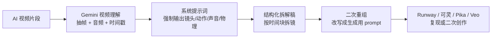

> **目标读者**：已经在用 Runway、可灵、Pika、Veo 或类似 AI 视频工具，希望把“看到好片靠猜”变成“能拆、能改、能复用”的创作者、提示词工程师和内容团队
> **核心判断**：所谓“反推提示词”，是在视频结果层重建一段可用的生成条件描述，不是在逐字恢复历史输入。
> **信息边界**：本文基于 Google 官方 Gemini 视频理解 / Files API / 模型文档，以及社区流传的 HYPER-GRANULAR VIDEO ANALYSIS 系统提示词整理。模型版本、AI Studio 界面和配额会变，方法本身不会。
> **合规提醒**：这套方法适合学习、分析和内部创作参考；涉及他人作品的商业复刻时，仍需单独确认版权、商标、人物肖像和平台条款。

先把一句话放在前面：**你要追的，是这段视频成立所依赖的主体、动作、镜头、风格、声音和物理线索。**

更合适的叫法是“反向分镜”或“逆向拆镜”：你在复原生成条件，不在恢复历史输入。

## 先看问题范围

- 到底哪些信息能从视频里稳定反推出来，哪些本来就不可见？
- 为什么 Gemini 的视频理解能力，加上一段强系统提示词，确实能把视频拆回可用的 prompt？
- 在 Google AI Studio 里，什么样的工作流最稳，什么样的做法只是演示好看？
- 拿到一份高颗粒度分析稿后，怎样把它重组为能投喂给视频生成器的 prompt？
- 这套方法的精度上限、常见失败点和使用边界分别在哪里？

## 1. 学习目标

读完本文后，你应该能够：

- 判断一段视频是否适合做 prompt 反推，避免一上来就靠上传碰运气。
- 说清楚“可用反推”和“原文还原”之间的差别，避免一开始就设错预期。
- 用两段式工作流，把 Gemini 的视频分析结果稳定转成生成用 prompt。
- 根据视频内容选择更稳的分析策略，包括分段、时间戳追问和高动作片段处理。
- 识别这类方法最容易失真的环节，并知道该怎么修。
- 把一次反推沉淀成长期可复用的 prompt 资产，而不是一次性复制粘贴。

## 2. 先看整条链路：这件事到底是怎么成立的



中间两层最关键：

1. 先把视频拆成结构化描述，避免自由发挥式总结。
2. 再把结构化描述改写成生成语言，避免把整段分析稿原样塞进另一个视频模型。

第二步最容易失真。Gemini 返回了很长的描述，不等于你已经拿到了好 prompt。长描述只是原料，还不是成品。

| 阶段 | 目标 | 产出 |
| ---- | ---- | ---- |
| 视频理解 | 把视频里隐含的生成线索显性化 | 时间块拆解稿 |
| Prompt 重组 | 把描述语言改写成生成语言 | 可投喂 prompt |
| 生成验证 | 看哪一层信息没有还原准 | 迭代修改方向 |

## 3. 先把边界说透：哪些能反推，哪些本来就反推不了

如果不先划边界，这篇文章后面所有技巧都会被误用。因为 prompt 反推最大的问题，往往是预期太高。

| 信息类别 | 反推状态 | 说明 |
| ---- | ---- | ---- |
| 主体、场景、构图、服装、颜色关系 | 通常能还原到可用程度 | 这些线索直接暴露在画面里，是最容易被稳定提取的部分 |
| 动作路径、镜头运动、节奏、音效、情绪强弱 | 多数可以还原，但容易受视频质量影响 | 画面模糊、快切、压缩严重或动作太快时，细节会丢 |
| 风格修辞、细腻审美词、镜头焦段措辞 | 能逼近，但容易漂移 | 不同模型会用不同词概括同一视觉效果 |
| seed、参考图、负面提示词、隐藏控制参数、局部重绘、剪辑流程、后期调色 | 通常不可见 | 它们不一定直接体现在单段视频表面，或者即使体现出来，也无法唯一定位 |

先看一个事实：**很多不同的 prompt，本来就可能生成非常相似的视频。**

所以更准确的目标，是找回一组高概率的生成条件。把评价标准换成这个，整套方法就会合理得多。

## 4. 为什么 Gemini 能做这件事

### 4.1 Gemini 的官方能力本来就覆盖了视频理解

Google 官方文档已经把这条能力链说得很清楚。Gemini 可以直接接收视频输入，支持通过文件上传、外部来源和其他方式送入模型；可以用 `MM:SS` 时间戳继续追问视频里的具体时刻；还支持对视频做更细的处理，比如自定义帧率。

它处理的是视频内容本身，能够把视频拆成可查询、可描述的内容，而不只是停留在缩略图或一句摘要。

官方文档里还有两个对本文非常重要的细节：

- 默认视觉采样率是 `1 FPS`。这对多数内容够用，但快动作、快速切镜和高速运动片段容易漏细节。
- 如果你走 API 路线，可以用更高的自定义 `FPS` 补细节，也可以针对长视频做分段和复用。

这两点对应着一个常见现象：有些视频反推得很准，有些总觉得“差一口气”。问题不一定出在 prompt，更可能出在采样粒度本身。

### 4.2 社区流传的强系统提示词，正好落实了官方多模态提示原则

Google 在 Files API 和多模态提示文档里给出的建议，其实非常朴素：指令要具体、任务要拆步、格式要写死、必要时让模型先描述媒体内容再推理。社区那段 HYPER-GRANULAR VIDEO ANALYSIS 系统提示词，之所以好用，正是因为它把这些原则极端执行了一遍。

| 官方提示原则 | 这套反推方法里的对应动作 | 作用 |
| ---- | ---- | ---- |
| 指令明确具体 | 明确要求模型扮演摄影师、视觉分析师、动作力学描述者 | 防止模型退回“泛泛总结视频” |
| 分步拆解 | 先拆镜，再重组 prompt | 把观察和生成语言分开 |
| 指定输出格式 | 时间戳区块 + 固定字段 | 方便二次改写和局部追问 |
| 先描述再推理 | 先写画面、主体、动作、镜头、音频，再谈整体 | 降低幻想式补全 |

这段系统提示词的作用，是把输出约束回可复查的分析格式。

### 4.3 这段系统提示词厉害在哪：它抓对了 5 个字段

Pastebin 里那份系统提示词，抓住了 5 个经常被漏掉的生成字段：

| 字段 | 它解决的问题 |
| ---- | ---- |
| 音频与对话转写 | 避免只看画面、不看声音节奏 |
| 禁止使用 IP 名称 | 强迫模型用可复用的物理描述替代角色名 |
| 镜头作为角色 | 把相机运动、自动对焦、抖动、甩镜也写进结果 |
| 运动物理学 | 让动作描述不只停留在“他跑了”“她转身了” |
| 时间戳分块输出 | 让你可以局部重问、局部重写，而不是整段返工 |

其中最影响复现质量的一条，是“把镜头当成角色”。

很多人写 prompt 时，只会写主体和场景，却忘了视频生成里另一半信息来自相机怎么工作。手持微颤、自动对焦拉扯、突然上扬的追拍、延迟半拍的跟镜，这些都是成片风格的一部分。你不把它写回来，复现出来的只会是“内容相似”，不是“镜头语言相似”。

## 5. 在 Google AI Studio 里，怎样跑一套更稳的工作流

原始社区案例常用 `Gemini 3.1 Pro Preview`。到你真正动手时，模型列表可能已经变化。处理方式很简单：**优先选当前仍支持视频理解的 Gemini 模型，不要把工作流绑死在某个一时的型号字符串上。**

如果你只是想快速试一次，直接在 [Google AI Studio](https://aistudio.google.com/) 里操作最省事。如果你要反复分析同一条视频、需要更细的控制，或者视频较大，走 API + Files API 更合适。

| 通道 | 适合什么场景 | 你需要关心什么 |
| ---- | ---- | ---- |
| Google AI Studio | 手工试验、快速验证、单条视频人工迭代 | 上手快，但细粒度控制相对少 |
| Gemini API + Files API | 多轮分析、长视频、重复调用、需要自定义 `FPS` | 更灵活；官方文档说明文件可临时存储 `48` 小时，项目级存储有上限 |

### Step 1：先选视频，再选模型

最稳的起点通常不是一整条长视频，而是一个镜头相对单一、信息密度够高的短片段。经验上，下面这类片段最适合做第一次反推：

- 一个主要主体
- 一个主要动作意图
- 一个相对明确的镜头运动
- 不超过一个核心情绪或节奏变化

如果你拿的是广告成片、混剪短片或多镜头 montage，别一开始就整段喂进去。先拆成片段，再分别分析。

### Step 2：在 System Instructions 里放系统提示词，不要放在普通输入框里

这一步在定义模型的观察方式，而不是回答内容。

系统提示词可以用社区那份高颗粒度模板，也可以基于它做少量本地改造。但无论怎么改，都要保住前面提到的 5 个字段：音频、无 IP 名称、镜头作为角色、运动物理、时间戳结构。

### Step 3：不要只打一行 “follow your system instructions”

把这句当演示指令可以，放进稳定工作流就太松了。更合适的做法是把流程拆成两轮。

第一轮只做观察，不急着产出生成用 prompt：

```text
Analyze this clip following the system instructions.
At the end, add two short sections:
1. Unknowns: what cannot be inferred reliably from the video alone.
2. Reusable building blocks: subject / action / camera / style / audio.
```

第二轮再把观察稿重组为生成用 prompt：

```text
Now convert your analysis into:
1. one full generation prompt,
2. one shorter platform-friendly prompt,
3. one shot list,
4. one uncertainty note listing details you did not infer directly.

Do not invent IP names, actor names, or unsupported technical settings.
Only use details supported by the video analysis.
```

两轮拆开后，第一轮先检查观察质量，第二轮再压缩成生成语言。这样更容易看出问题是出在识别，还是出在改写。

### Step 4：学会用时间戳局部追问

Gemini 官方支持用 `MM:SS` 形式追问视频的具体时刻，这对反推尤其有用。

当你发现某一段动作总写不准时，不要整条视频重来，直接局部追问：

```text
Re-analyze 00:03-00:05 only.
Focus on camera shake, autofocus hunting, and weight transfer.
```

这样做的好处有两个：一是更快，二是更能看出模型到底哪一层没抓住。

### Step 5：拿到结果后，不要整段照抄给另一个生成器

最常见的误用，是把 Gemini 的完整分析稿整段复制到另一个视频模型里，然后发现结果既长又散。

可复用的是下面这些字段：

- 主体
- 动作
- 镜头
- 环境
- 光线与材质
- 音频与节奏
- 不能确定的部分

一份好的分析稿，最终应该被拆回字段，再按目标平台的口味重组。

## 6. 一个最小闭环案例：怎样把分析稿改写成可投喂 prompt

假设你手里有一段 `8` 秒的竖屏 AI 视频：夜晚雨巷里，一个穿银灰夹克的年轻女人向前奔跑，中途快速回头，镜头有明显手持微颤，地面有霓虹反光，音轨里能听见急促呼吸和远处轮胎碾过积水的声音。

Gemini 的高颗粒度分析稿，理想状态下会给出类似这些信息：

| 分析稿里的信息 | 改写成生成语言后的写法 |
| ---- | ---- |
| vertical smartphone video | vertical smartphone footage |
| subtle amateur micro-shake | handheld with subtle natural micro-shake |
| rain-soaked neon reflections | wet neon reflections on the pavement |
| she glances back mid-stride | she glances back while still running |
| focus briefly hunts during the turn | slight autofocus breathing during the turn |
| urgent breath and distant traffic hiss | layered ambient audio with breath and distant tire hiss |

把这些字段拼成一条完整 prompt，可以是：

```text
Vertical smartphone footage of a young woman in a silver-gray jacket running through a rain-soaked neon alley at night, handheld with subtle natural micro-shake, wet reflections on the pavement, she glances back mid-stride, slight autofocus breathing during the turn, urgent pace, realistic motion physics, layered ambient audio with breath and distant tire hiss, cinematic but grounded.
```

如果你的目标平台更偏好短 prompt，可以压成更硬的字段型表达：

```text
young woman in silver-gray jacket running through a neon rain alley at night, vertical handheld smartphone shot, subtle micro-shake, glance back mid-run, autofocus breathing, wet reflections, realistic motion physics, urgent urban ambience
```

差别就在这里：前者在做字段提纯，后者通常只是在堆字数。

## 7. 技术原理：为什么它能拆到可用程度，却几乎不可能还原原文

### 7.1 视频是结果层，不是完整生产日志

你看到的是最终视频。对外可见的只有结果层，很多控制成片的变量都藏在后面：

- 参考图是否参与过
- 有没有负面提示词
- 采样参数怎么设
- 是否做过局部重绘或延长
- 后期是否重新剪辑、调色、加音效

因此视频反推更像“从成片倒推生成条件”。

### 7.2 多个不同的 prompt，本来就可能收敛到很像的结果

这一层经常被忽略。视觉模型的输出不是一一对应关系。

同一个夜景奔跑镜头，可以由不同长度、不同措辞、不同结构的 prompt 生成。它们在文字层面不一样，但在画面层面足够接近。你最后拿到的，往往是一族高概率 prompt，而不是唯一答案。

### 7.3 默认采样粒度决定了它的天花板

官方视频理解文档明确提到，视觉描述默认以 `1 FPS` 采样。对静态或中低运动内容，这通常没问题；对以下场景就容易吃亏：

- 快速甩镜
- 高速奔跑或打斗
- 多次短促切镜
- 细微表情变化
- 瞬时碰撞和回弹

这时候如果你还坚持只用默认设置，就等于先接受“部分动作细节一定会丢”。如果你走 API，应该考虑提高 `FPS`；如果你只用 AI Studio，至少要把片段切短，尽量聚焦高动作区间。

### 7.4 AI 生成视频通常比实拍视频更容易拆，原因也更朴素

原因更简单：AI 生成视频往往更规则，动作意图、镜头语言和风格信号更集中，视觉线索也更“为生成模型所写”。这会让逆向描述更顺手。

但这不意味着模型知道原始来源，更不意味着实拍视频就完全不可拆。只是对实拍、混剪、强后期和复合素材来说，可见线索和隐藏流程的边界更模糊，反推难度自然更高。

## 8. 把复现率拉高的 8 个操作细节

### 8.1 一次只分析一个镜头意图

如果一段视频同时在做开场交代、人物表演、镜头调度和产品展示，反推结果通常会变成“样样都提，样样都浅”。先拆镜头，再反推，通常比整段硬上更稳。

### 8.2 优先从短片段开始

你第一次试的时候，宁可选一段 `5` 到 `12` 秒的清晰片段，也别先拿 `30` 秒以上的复杂视频。长视频当然也能分析，但它更适合第二阶段，而不是首次建模。

### 8.3 强制模型写出 Unknowns

这是降低幻觉最有效的手段之一。你逼模型写“不确定什么”，它反而更不容易编造本来不可见的参数。

如果输出里混入了 IP 名称、演员身份或视频表面看不出来的技术参数，直接补一句追问：

```text
Remove any IP names, actor identities, or unsupported technical settings.
Rewrite using only details visible or audible in the video.
```

### 8.4 对快动作片段单独追问

不要奢望一轮输出把所有高动作细节都抓全。发现动作不准，直接按时间戳局部追问，通常比你重写整段 prompt 更有效。

### 8.5 对不同平台输出不同长度的 prompt

一些模型更吃完整的镜头描述，一些模型更偏好短而硬的关键词组织。更省试错成本的做法，是让 Gemini 一次给你两版：长版和短版。

### 8.6 不要把修辞当成信息

“电影感”“高级感”“氛围拉满”这类词，除非你能把它落回光线、运动、镜头和材质，否则对复现帮助有限。更有用的是对象、动作、机位和节奏。

### 8.7 把声音也当成生成条件

很多人反推视频，只盯画面。结果是视觉有点像，节奏却完全不对。尤其是带口型、碰撞、环境声和音乐节拍的视频，声音往往和动作节奏是绑在一起的。

### 8.8 验证标准要放在“第二次生成结果”上

分析稿写得再漂亮，也不算成功。验收标准很简单：你用它生成第二条视频后，哪些部分对上了，哪些没有。只有这一步，才能告诉你该改主体、镜头还是动作。

## 9. 常见失败与修复

| 现象 | 常见原因 | 更稳的修法 |
| ---- | ---- | ---- |
| 输出像影评，不像 prompt | System Instructions 没固定字段，回答退化成概述 | 改成时间块 + 固定字段 + 二轮重组 |
| 动作写得笼统，生成后不真实 | 没要求运动物理和重心转移 | 追加要求：weight transfer、momentum、impact feedback |
| 镜头语言几乎没写 | 模型把注意力都放在主体上了 | 强制单列 Camera Dynamics，并局部追问镜头段 |
| 快动作总丢细节 | 默认采样太粗，片段又太长 | 缩短片段；如走 API，提升 `FPS` |
| 输出里出现角色名或 IP 名 | 约束不够硬，或模型被视频上下文带跑 | 在系统提示词和第二轮重组里重复“不要使用 IP 名称” |
| 生成结果只像风格，不像动作 | 你把分析稿整段照抄，没有做字段提纯 | 重新拆成主体 / 动作 / 镜头 / 音频四层再拼 |
| 长视频越分析越糊 | 多镜头、多任务混在一次回答里 | 先分段，再汇总成镜头表或片段库 |

## 10. 适用边界与使用建议

### 10.1 这套方法最适合的 4 类场景

- 拆自己以前做过、但 prompt 已经散失的 AI 视频
- 学习某类镜头语言和动作组织方式，而不是盲猜
- 给团队做二次创作 briefing，把“像这种感觉”变成结构化描述
- 建立内部 prompt 素材库，把好片里的主体、镜头和节奏拆成可复用片段

### 10.2 不适合用它解决的事情

- 想做法证级“原文还原”
- 想从结果视频里推回所有隐藏参数
- 想直接复制商业作品的完整创意流程
- 想把它当成版权、商标或合规判断工具

如果你要把这套方法用到商业环境里，版权、商标、人物肖像、平台条款仍然是另一层问题。模型能描述出来，也不代表你就应该原样复刻。

## 11. 把反推结果沉淀成字段资产库

当你做过 `10` 次以上反推后，就会发现更有复用价值的往往不是某一条完整 prompt，而是反复出现的字段组合。

建议把每次结果拆到一个最小结构里：

- `subject`：主体身份、外观、服装
- `action`：主动作和次级动作
- `camera`：景别、机位、运动、对焦变化
- `environment`：场景、材质、天气、颜色
- `audio`：对白、环境声、音乐节奏
- `finish`：质感、风格、真实度、媒介感
- `unknowns`：这次无法可靠确认的部分

整理完后，回到原视频前 `3` 秒，对照 `subject` 和 `camera` 两栏做一次 spot-check。只要这两栏没有新增幻想，第一轮输出通常就比较稳。

做久了你会发现，这套方法会让你更快积累一套自己的镜头词汇表，而不是每次从零写 prompt。

## 12. 练手顺序可以这样排

### 练习 1：单镜头短片

找一段 `8` 秒以内、主体单一、动作清晰的 AI 视频。先别追求“拆得多漂亮”，先把主体、动作、镜头和音频分开写清楚。

### 练习 2：高动作片段

找一段快速运动视频，只分析 `3` 到 `5` 秒，重点练时间戳追问。如果你走 API，试一次更高 `FPS` 的版本，对比细节差异。

### 练习 3：同一分析稿投两个生成器

把同一份结构化分析稿分别改写成长版和短版 prompt，投给两个不同平台，看哪个平台更吃叙述式，哪个更吃字段式。你会比读十篇教程更快建立手感。

## 结论

Gemini 在这件事里更像一个反向分镜师。它擅长把视频里看得见、听得见、感受得到的生成线索重新组织出来。至于隐藏参数和原始文本，它本来就没有足够证据逐字找回。

边界想清楚之后，这套方法的用处也就很清楚了：它能把“看到一个好视频，只会说感觉不错”变成“我知道它为什么成立，我还能把这些条件重写成自己的生成语言”。这比追求一字不差的原 prompt 更有用，也更接近可复用的技能。

## 参考资料

- [Google Gemini 视频理解文档](https://ai.google.dev/gemini-api/docs/video-understanding)
- [Google Gemini Files API 文档](https://ai.google.dev/gemini-api/docs/files)
- [Google Gemini 模型列表](https://ai.google.dev/gemini-api/docs/models)
- [Google Gemini 更新日志](https://ai.google.dev/gemini-api/docs/changelog)
- [Google AI Studio](https://aistudio.google.com/)
- [社区系统提示词模板：HYPER-GRANULAR VIDEO ANALYSIS](https://pastebin.com/H8DeXq1G)
