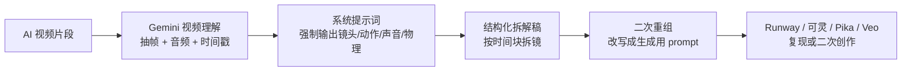

<!-- markdownlint-disable-file MD003 MD041 -->

这篇文章写给已经在用 Runway、可灵、Pika、Veo 或同类 AI 视频工具的人。这里说的“反推提示词”，更接近反向分镜或逆向拆镜：你要重建的是这段视频成立所依赖的主体、动作、镜头、声音和物理线索，而不是逐字恢复当年的输入框文本。

下面的方法主要基于 Google 官方的 Gemini 视频理解、Files API、模型文档，以及社区流传的高颗粒度视频分析 prompt。模型版本、AI Studio 界面和配额会变，但这套拆解逻辑不会；如果你打算把它用于他人作品的商业复刻，版权、商标、肖像权和平台条款仍要单独判断。

## 适用范围

- 到底哪些信息能从视频里稳定反推出来，哪些本来就不可见？
- 为什么 Gemini 的视频理解能力，加上一段强系统提示词，确实能把视频拆回可用的 prompt？
- 在 Google AI Studio 里，什么样的工作流最稳，什么样的做法只是演示好看？
- 拿到一份高颗粒度分析稿后，怎样把它重组为能投喂给视频生成器的 prompt？
- 这套方法的精度上限、常见失败点和使用边界分别在哪里？

## 1. 学习目标

读完本文章之后，至少能明白下面几件事：

- 判断一段视频是否适合做 prompt 反推，避免一上来就靠上传碰运气。
- 说清楚“可用反推”和“原文还原”之间的差别，避免一开始就设错预期。
- 用两段式工作流，把 Gemini 的视频分析结果稳定获取生成视频用的 prompt。
- 根据视频内容选择更稳的分析策略，包括分段、时间戳追问和高动作片段处理。
- 识别这类方法最容易失真的环节，并知道该怎么修。
- 把一次反推沉淀成长期可复用的 prompt 资产，而不是一次性复制粘贴。

## 2. 这条链路为什么能跑通



复现效果最后像不像，主要取决于中间这两层：

1. 第一层是把视频拆成结构化描述，避免自由发挥式总结。
2. 第二层是把结构化描述改写成生成语言，避免把整段分析稿原样塞进另一个视频模型。

失真通常出在第二步。Gemini 返回一大段描述，不等于 prompt 已经写好；那还只是原料。

| 阶段 | 目标 | 产出 |
| ---- | ---- | ---- |
| 视频理解 | 把视频里隐含的生成线索显性化 | 时间块拆解稿 |
| Prompt 重组 | 把描述语言改写成生成语言 | 可投喂 prompt |
| 生成验证 | 看哪一层信息没有还原准 | 迭代修改方向 |

## 3. 边界划清：哪些能反推，哪些本来就反推不了

边界先划清，后面的技巧才能正确使用。多数人会在这里出现问题，是因为一开始就把目标设成了“还原原文”。

| 信息类别 | 反推状态 | 说明 |
| ---- | ---- | ---- |
| 主体、场景、构图、服装、颜色关系 | 通常能还原到可用程度 | 这些线索直接暴露在画面里，是最容易被稳定提取的部分 |
| 动作路径、镜头运动、节奏、音效、情绪强弱 | 多数可以还原，但容易受视频质量影响 | 画面模糊、快切、压缩严重或动作太快时，细节会丢 |
| 风格修辞、细腻审美词、镜头焦段措辞 | 能逼近，但容易漂移 | 不同模型会用不同词概括同一视觉效果 |
| seed、参考图、负面提示词、隐藏控制参数、局部重绘、剪辑流程、后期调色 | 通常不可见 | 它们不一定直接体现在单段视频表面，或者即使体现出来，也无法唯一定位 |

这里有个前提要先说清：**很多不同的 prompt，本来就可能生成非常相似的视频。**

所以更准确的目标，是找回一组高概率的生成条件。把评价标准换成这个，整套方法就会合理得多。

## 4. Gemini 为什么能拆到这一步

### 4.1 Gemini 的官方能力本来就覆盖了视频理解

Google 官方文档已经把这条能力链说得很清楚。Gemini 可以直接接收视频输入，支持通过文件上传、外部来源和其他方式送入模型；可以用 `MM:SS` 时间戳继续追问视频里的具体时刻；还支持对视频做更细的处理，比如自定义帧率。

它处理的是视频内容本身，能够把视频拆成可查询、可描述的内容，而不只是停留在缩略图或一句摘要。

官方文档里还有两个对本文非常重要的细节：

- 默认视觉采样率是 `1 FPS`。这对多数内容够用，但快动作、快速切镜和高速运动片段容易漏细节。
- 如果你走 API 路线，可以用更高的自定义 `FPS` 补细节，也可以针对长视频做分段和复用。

这两点对应着一个常见现象：有些视频反推得很准，有些总觉得“差一口气”。问题不一定出在 prompt，更可能出在采样粒度本身。

### 4.2 社区流传的强系统提示词，正好落实了官方多模态提示原则

Google 在 Files API 和多模态提示文档里给出的建议，其实非常朴素：指令要具体、任务要拆分、格式要写死、必要时让模型先描述媒体内容再推理。社区那段 HYPER-GRANULAR VIDEO ANALYSIS 系统提示词，之所以好用，正是因为它把这些原则全都执行了一遍。

| 官方提示原则 | 这套反推方法里的对应动作 | 作用 |
| ---- | ---- | ---- |
| 指令明确具体 | 明确要求模型扮演摄影师、视觉分析师、动作力学描述者 | 防止模型退回“泛泛总结视频” |
| 分步拆解 | 先拆镜，再重组 prompt | 把观察和生成语言分开 |
| 指定输出格式 | 时间戳区块 + 固定字段 | 方便二次改写和局部追问 |
| 先描述再推理 | 先写画面、主体、动作、镜头、音频，再谈整体 | 降低幻想式补全 |

这段系统提示词的作用，是把输出约束回可复查的分析格式。

### 4.3 这段系统提示词厉害在哪：它抓对了 5 个字段

Pastebin 里那份系统提示词，抓住了 5 个经常被漏掉的生成字段：

| 字段 | 它解决的问题 |
| ---- | ---- |
| 音频与对话转写 | 避免只看画面、不看声音节奏 |
| 禁止使用 IP 名称 | 强迫模型用可复用的物理描述替代角色名 |
| 镜头作为角色 | 把相机运动、自动对焦、抖动、甩镜也写进结果 |
| 运动物理学 | 让动作描述不只停留在“他跑了”“她转身了” |
| 时间戳分块输出 | 让你可以局部重问、局部重写，而不是整段返工 |

其中最影响复现质量的一条，是“把镜头当成角色”。

很多人写 prompt 时，只会写主体和场景，却忘了视频生成里另一半信息来自相机怎么工作。手持微颤、自动对焦拉扯、突然上扬的追拍、延迟半拍的跟镜，这些都是成片风格的一部分。你不把它写回来，复现出来的只会是“内容相似”，不是“镜头语言相似”。

## 5. 在 Google AI Studio 里，怎样把流程跑稳

截至 `2026-05`，社区教程还常把某个 Preview 型号写进标题。实际做这类反推时，型号的重要性通常排在任务类型后面。视频理解文档里更值得记住的是：**所有 Gemini 模型都支持视频剪辑和自定义 `FPS`，不过 `2.5` 系列在这类视频处理上的质量通常更稳。**

手工诊断、批量分析、高动作细节追问，这三类任务对入口和参数的要求并不一样，混在一起讨论只会让选型失焦。

如果只是拿一条片段试拆，[Google AI Studio](https://aistudio.google.com/) 往往已经够用。需要围着同一条视频反复追问，或者要控制 `FPS`、缓存和文件复用，再走 API + Files API。要是你此刻还卡在免费额度、模型档位和 API 入口选择上，可以先看 [free-llm-api-resources：免费 LLM API 资源汇总清单](./free-llm-api-resources-guide.md)。那篇把 Google AI Studio 的免费层和常见替代渠道整理得更集中。

| 场景 | 更稳的路径 | 原因 |
| ---- | ---- | ---- |
| 先手工拆一条片段，边看边追问 | Google AI Studio + 当前可用的 Gemini 视频理解模型 | 界面反馈快，适合先把分析结构跑通 |
| 同一视频要反复问很多轮 | Gemini API + Files API | 上传一次后可重复引用；官方说明文件会在 `48` 小时后自动删除，项目级总存储上限为 `20 GB` |
| 视频超过 `10` 分钟，或要持续围绕同一素材对话 | Gemini API + Context Cache | 先把视频处理进缓存，后续追问不必每轮都重烧整段 token |
| 片段动作很快，想盯镜头运动、重心转移、碰撞细节 | API 路线优先；必要时选 `2.5` 系列并手动调 `FPS` | 官方视频理解文档明确指出默认 `1 FPS` 会漏掉快动作细节，而 `2.5` 系列在这类视频处理上通常更稳 |

### 先定输入通道，不要一上来就上传

输入通道需要尽早定下来。入口没选对，后面的 prompt 调整大多只是在弥补传输和复用层的问题。

| 输入方式 | 适合什么场景 | 关键边界 |
| ---- | ---- | ---- |
| 内嵌视频数据 | `20 MB` 以内、一次性分析、很短的片段 | 总请求体不能超过 `20 MB`，更像临时诊断入口 |
| Files API | 大于 `100 MB`、长视频、多轮追问、同一视频反复使用 | 单文件最大 `2 GB`，项目级总存储上限 `20 GB`，文件 `48` 小时后自动删除 |
| YouTube URL | 公开视频的快速试验和粗筛 | 仍是预览能力，只支持公开视频，不适合当长期资产入口 |

同一条长视频需要问很多轮时，再考虑叠缓存。显式缓存默认 `TTL` 是 `1` 小时，适合把大视频和长系统提示词先压进缓存；隐式缓存命中时，账单里也能看到命中的 token。

### 先选片段，再看模型

第一次反推，最好别拿整条长片开刀。先找一个镜头单一、信息密度够高的短片段。经验上，下面这类片段最合适：

- 一个主要主体
- 一个主要动作意图
- 一个相对明确的镜头运动
- 不超过一个核心情绪或节奏变化

如果你拿的是广告成片、混剪短片或多镜头 montage，别一开始就整段喂进去。先拆成片段，再分别分析。

### 系统提示词放在 System Instructions 里

System Instructions 定的是观察框架，不是这轮回答的措辞。

系统提示词可以用社区那份高颗粒度模板，也可以基于它做少量本地改造。但无论怎么改，都要保住前面提到的 5 个字段：音频、无 IP 名称、镜头作为角色、运动物理、时间戳结构。

### 第一轮先观察，第二轮再改写

演示里这么写够用，真放进工作流就太松了。拆成两轮，通常稳得多。

第一轮只做观察，不急着产出生成用 prompt：

```text
Analyze this clip following the system instructions.
At the end, add two short sections:
1. Unknowns: what cannot be inferred reliably from the video alone.
2. Reusable building blocks: subject / action / camera / style / audio.
```

第二轮再把观察稿重组为生成用 prompt：

```text
Now convert your analysis into:
1. one full generation prompt,
2. one shorter platform-friendly prompt,
3. one shot list,
4. one uncertainty note listing details you did not infer directly.

Do not invent IP names, actor names, or unsupported technical settings.
Only use details supported by the video analysis.
```

两轮拆开后，第一轮先检查观察质量，第二轮再压缩成生成语言。这样更容易看出问题是出在识别，还是出在改写。

### 把社区大 prompt 压成你自己的工作模板

直接整段粘贴社区原版系统提示词，短期内能跑，长期却不利于调参。你很难知道到底是哪一句在起作用，也很难针对不同平台收缩输出。

用的时候，保留它的观察框架，再把模板拆成两层：第一层写证据，第二层做生成改写。以后要换平台、缩输出、补字段，只动局部就够了。

第一层，观察模板：

```text
Analyze this clip as production notes for a video-generation team.
Return chronological blocks with timestamps.
For each block, include:
- visual framing
- subjects
- action and movement physics
- camera dynamics
- audio and pacing

Then add:
- reusable building blocks
- unknowns

Do not use IP names, actor identities, brand assumptions, or unsupported generation settings.
Only describe what is visible or audible in the clip.
```

第二层，重组模板：

```text
Using only the supported details from the analysis above, produce:
1. one full generation prompt,
2. one shorter platform-friendly prompt,
3. one shot list,
4. one note listing what should remain unspecified.

Do not invent seed values, camera specs, negative prompts, or editing steps that were not evidenced in the video.
```

这一条通常最容易被忽略，但哪些地方应该留白，往往比多塞几个看起来专业的参数更重要。

### 需要长期复用时，再让模型吐 JSON 中间稿

Markdown 观察稿适合人眼复查，JSON 中间稿适合对比、存档和二次加工。Google 在文件提示策略里本来就建议把复杂多模态任务拆步，并固定输出格式；放到这里，先拿一份结构化证据，比一上来就要长短 prompt 和镜头表更靠谱。

你可以把第二轮观察请求改成这样：

```text
Return valid JSON only.
Schema:
{
    "clip_summary": "string",
    "timeline_blocks": [
        {
            "start": "MM:SS",
            "end": "MM:SS",
            "visual_framing": "string",
            "subjects": ["string"],
            "action_physics": ["string"],
            "camera_dynamics": ["string"],
            "audio": ["string"],
            "confidence": "high|medium|low"
        }
    ],
    "reusable_blocks": {
        "subject": ["string"],
        "action": ["string"],
        "camera": ["string"],
        "environment": ["string"],
        "audio": ["string"],
        "style": ["string"]
    },
    "unknowns": ["string"]
}
```

JSON 的用处很直接：

- 证据层和改写层被硬拆开，哪一层错一眼就能看出来。
- 同一视频多轮分析时，你可以直接对比 `timeline_blocks`，而不是人工对整段 prose 做 diff。
- 以后你要做资产库、自动镜头表、批量改写不同平台 prompt，JSON 是天然中间层。

如果第一轮 JSON 里已经开始出现空字段、低置信度或者 `unknowns` 爆炸，那就别急着重写 prompt，先回到切片、`FPS` 和追问角度。

### 卡住了就用时间戳局部追问

Gemini 官方支持用 `MM:SS` 形式追问视频的具体时刻，这对反推尤其有用。

当你发现某一段动作总写不准时，不要整条视频重来，直接局部追问：

```text
Re-analyze 00:03-00:05 only.
Focus on camera shake, autofocus hunting, and weight transfer.
```

局部追问的价值很实际：问题会被压缩到一个时间块里，速度更快，也更容易看清是识别没抓住，还是表述没写准。

### 细节、延迟和 token 预算先算清

视频理解不是一个“上传即得”的黑盒。官方技术说明给了几条很实用的硬信息：默认媒体分辨率下，视频大约按 `300 tokens/秒` 计；低媒体分辨率大约是 `100 tokens/秒`；音频约为 `32 tokens/秒`；默认视觉采样是 `1 FPS`。

这些数字直接决定了你的工作流该怎么排。想看全片轮廓时，先省；想抠动作时，再把预算花在短片段上。

| 调整项 | 什么时候用 | 代价 | 更稳的做法 |
| ---- | ---- | ---- | ---- |
| 默认 `1 FPS` | 先看整体结构、场景和主体 | 快动作细节容易丢 | 第一轮概览可以用；动作段再单独提 `FPS` |
| 自定义更高 `FPS` | 奔跑、打斗、甩镜、对焦拉扯 | token、延迟、被安全系统拦截的概率都会上升 | 只对 `3` 到 `5` 秒的问题片段加密采样 |
| 默认媒体分辨率 | 需要材质、对焦、细小动作 | token 更高 | 第二轮精修时再用，不要一上来整条视频都开高配 |
| `media_resolution=low` | 只想先看镜头结构、节奏和主体关系 | 小字、细节、轻微表情会损失 | 长视频首轮扫一遍很合适，发现问题再回到局部高精度 |
| Context Cache | 长视频、多轮问答、同片段反复追问 | 需要 API 路线 | 把重活前置一次，后续只为新问题付费 |

如果你只在 AI Studio 里操作，看不到这些控制项，就用更土的办法：把视频切短，把每轮问题收窄。

### 拿到结果后，别整段照抄给另一个生成器

很多人会把 Gemini 的完整分析稿整段复制到另一个视频模型里，然后发现结果既长又散。

可复用的是下面这些字段：

- 主体
- 动作
- 镜头
- 环境
- 光线与材质
- 音频与节奏
- 不能确定的部分

一份好的分析稿，最终应该被拆回字段，再按目标平台的口味重组。

## 6. 一个最小闭环案例：怎样把分析稿改写成可投喂 prompt

假设你手里有一段 `8` 秒的竖屏 AI 视频：夜晚雨巷里，一个穿银灰夹克的年轻女人向前奔跑，中途快速回头，镜头有明显手持微颤，地面有霓虹反光，音轨里能听见急促呼吸和远处轮胎碾过积水的声音。

Gemini 的高颗粒度分析稿，理想状态下会给出类似这些信息：

| 分析稿里的信息 | 改写成生成语言后的写法 |
| ---- | ---- |
| vertical smartphone video | vertical smartphone footage |
| subtle amateur micro-shake | handheld with subtle natural micro-shake |
| rain-soaked neon reflections | wet neon reflections on the pavement |
| she glances back mid-stride | she glances back while still running |
| focus briefly hunts during the turn | slight autofocus breathing during the turn |
| urgent breath and distant traffic hiss | layered ambient audio with breath and distant tire hiss |

这不是简单换几个词，背后其实在做 3 件事：

- 把带解释意味的词，换成更接近画面证据的词。比如 `amateur` 更像作者判断，`natural micro-shake` 更像屏幕上真的能观察到的镜头状态。
- 把描述现象的句子压回摄影语言。`focus briefly hunts` 可以直接写成 `autofocus breathing`，因为这里写的是镜头行为，不是作者解释。
- 把听觉线索留在 prompt 里，而不是当成背景噪音删掉。`urgent breath and distant traffic hiss` 之所以值得保留，是因为它在帮你固定节奏感，而不是单纯渲染气氛。

把这些字段拼成一条完整 prompt，可以是：

```text
Vertical smartphone footage of a young woman in a silver-gray jacket running through a rain-soaked neon alley at night, handheld with subtle natural micro-shake, wet reflections on the pavement, she glances back mid-stride, slight autofocus breathing during the turn, urgent pace, realistic motion physics, layered ambient audio with breath and distant tire hiss, cinematic but grounded.
```

如果你的目标平台更偏好短 prompt，可以压成更硬的字段型表达：

```text
young woman in silver-gray jacket running through a neon rain alley at night, vertical handheld smartphone shot, subtle micro-shake, glance back mid-run, autofocus breathing, wet reflections, realistic motion physics, urgent urban ambience
```

差别就在这儿：前者已经像一条能直接喂模型的 prompt，后者还只是把词摆在一起。

分析稿到 prompt，最好分三层落笔。否则锚点、镜头和气氛很容易写成一锅。

| 层 | 该放什么 | 不该放什么 |
| ---- | ---- | ---- |
| 第一层：硬锚点 | 主体、服装、场景、主动作、时间段里最稳定的空间关系 | 情绪化修辞、没证据的镜头参数 |
| 第二层：镜头与物理 | 景别、机位、跟拍方式、抖动、对焦呼吸、重心转移、碰撞回弹 | 对“高级感”“大片感”的空泛概括 |
| 第三层：气氛与节奏 | 光线、材质、环境声、对白、节拍、真实度或媒介感限制 | `seed`、负面提示词、后期流程猜测 |

你可以把它压成一个很实用的骨架：

```text
[主体 + 外观] in [空间 + 光线]，执行 [主动作 + 动作目标]；
[镜头行为 + 运动物理 + 对焦变化]；
[音频/节奏 + 质感限制]。

Leave unspecified: [没有证据的镜头参数 / seed / 后期步骤]
```

分层之后，第二次生成一旦跑偏，你能很快判断该回哪一层补。

要从正向写 prompt、拆镜头表和稳定出片这条线建立手感，可以接着读 [Seedance 2.0 视频制作实战指南：从提示词到分镜的全流程教程](../video/seedance-2-video-production-guide.md)。那篇更偏“怎么拍”这一侧。

更关键的是，下面这 `3` 类信息要故意先不写回去：

- 具体镜头焦段、传感器、机型参数
- `seed`、负面提示词、参考图、局部重绘流程
- 后期剪辑、调色和音效层里没有直接证据的制作细节

这些东西当然重要，但这段视频没有给够证据。硬塞进去，只会让 prompt 更像行话，不会让结果更像原片。

如果第二次生成还是差一口气，通常按这个顺序排查最快：

| 第二次生成的偏差 | 更可能错在哪一层 | 下一轮该怎么改 |
| ---- | ---- | ---- |
| 主体像，但动作发飘 | 动作物理没写够 | 补 `weight transfer`、`momentum`、发力方向和回弹 |
| 动作像，但镜头太稳 | Camera Dynamics 过弱 | 把手持微颤、延迟跟拍、对焦呼吸单独写成一句 |
| 画面像，但节奏不对 | 音频和 pacing 被忽略 | 把呼吸、脚步、水声、环境噪声写回 prompt |
| 风格像，但空间关系变了 | 构图和景别不够具体 | 交代景别、主体相对位置和前后景关系 |

## 7. 技术原理：为什么它能拆到可用程度，却几乎不可能还原原文

### 7.1 视频是结果层，不是完整生产日志

你看到的是最终视频。对外可见的只有结果层，很多控制成片的变量都藏在后面：

- 参考图是否参与过
- 有没有负面提示词
- 采样参数怎么设
- 是否做过局部重绘或延长
- 后期是否重新剪辑、调色、加音效

因此视频反推更像“从成片倒推生成条件”。

### 7.2 多个不同的 prompt，本来就可能收敛到很像的结果

这一层经常被忽略。视觉模型的输出不是一一对应关系。

同一个夜景奔跑镜头，可以由不同长度、不同措辞、不同结构的 prompt 生成。它们在文字层面不一样，但在画面层面足够接近。你最后拿到的，往往是一族高概率 prompt，而不是唯一答案。

### 7.3 默认采样粒度决定了它的天花板

前面工作流里已经提到过默认 `1 FPS` 的限制，这里把它单独拎出来，是因为它实际上决定了这条方法的上限。对静态或中低运动内容，默认采样往往够用；对下面这些场景，就很容易开始漏信息：

- 快速甩镜
- 高速奔跑或打斗
- 多次短促切镜
- 细微表情变化
- 瞬时碰撞和回弹

如果这类片段仍然只用默认设置，部分动作细节几乎注定会丢。走 API 时可以考虑提高 `FPS`；只用 AI Studio 的话，更现实的做法是把片段切短，尽量聚焦高动作区间。

### 7.4 AI 生成视频通常比实拍视频更容易拆，原因也更朴素

原因更简单：AI 生成视频往往更规则，动作意图、镜头语言和风格信号更集中，视觉线索也更“为生成模型所写”。这会让逆向描述更顺手。

但这不意味着模型知道原始来源，更不意味着实拍视频就完全不可拆。只是对实拍、混剪、强后期和复合素材来说，可见线索和隐藏流程的边界更模糊，反推难度自然更高。

## 8. 进阶：把复现率往上提的 8 个细节

前面 `1` 到 `7` 节已经够你跑完第一轮。下面这 `8` 条，是开始抠复现率时最常用的细调项。

### 8.1 一次只分析一个镜头意图

如果一段视频同时在做开场交代、人物表演、镜头调度和产品展示，反推结果通常会变成“样样都提，样样都浅”。先拆镜头，再反推，通常比整段硬上更稳。

### 8.2 优先从短片段开始

你第一次试的时候，宁可选一段 `5` 到 `12` 秒的清晰片段，也别先拿 `30` 秒以上的复杂视频。长视频当然也能分析，但它更适合第二阶段，而不是首次建模。

### 8.3 强制模型写出 Unknowns

这是降低幻觉最有效的手段之一。你逼模型写“不确定什么”，它反而更不容易编造本来不可见的参数。

如果输出里混入了 IP 名称、演员身份或视频表面看不出来的技术参数，直接补一句追问：

```text
Remove any IP names, actor identities, or unsupported technical settings.
Rewrite using only details visible or audible in the video.
```

### 8.4 对快动作片段单独追问

不要奢望一轮输出把所有高动作细节都抓全。发现动作不准，直接按时间戳局部追问，通常比你重写整段 prompt 更有效。

### 8.5 对不同平台输出不同长度的 prompt

一些模型更吃完整的镜头描述，一些模型更偏好短而硬的关键词组织。更省试错成本的做法，是让 Gemini 一次给你两版：长版和短版。

### 8.6 不要把修辞当成信息

“电影感”“高级感”“氛围拉满”这类词，除非你能把它落回光线、运动、镜头和材质，否则对复现帮助有限。更有用的是对象、动作、机位和节奏。

### 8.7 把声音也当成生成条件

很多人反推视频，只盯画面。结果是视觉有点像，节奏却完全不对。尤其是带口型、碰撞、环境声和音乐节拍的视频，声音往往和动作节奏是绑在一起的。

### 8.8 验证标准要放在“第二次生成结果”上

分析稿写得再漂亮，也不算成功。验收标准很简单：你用它生成第二条视频后，哪些部分对上了，哪些没有。只有这一步，才能告诉你该改主体、镜头还是动作。

## 9. 常见失败与修复

| 现象 | 常见原因 | 更稳的修法 |
| ---- | ---- | ---- |
| 输出像影评，不像 prompt | System Instructions 没固定字段，回答退化成概述 | 改成时间块 + 固定字段 + 二轮重组 |
| 动作写得笼统，生成后不真实 | 没要求运动物理和重心转移 | 追加要求：weight transfer、momentum、impact feedback |
| 镜头语言几乎没写 | 模型把注意力都放在主体上了 | 强制单列 Camera Dynamics，并局部追问镜头段 |
| 快动作总丢细节 | 默认采样太粗，片段又太长 | 缩短片段；如走 API，提升 `FPS` |
| 声音写成了情绪词，节奏还是不对 | 只做了画面描述，没有要求完整音频转写 | 明确要求 dialogue / ambient / impact sounds 分开写 |
| 一轮分析成本太高，后面懒得继续 | 一开始就把长视频全量高精度处理 | 先低成本扫全片，再把预算集中到问题片段 |
| 输出里出现角色名或 IP 名 | 约束不够硬，或模型被视频上下文带跑 | 在系统提示词和第二轮重组里重复“不要使用 IP 名称” |
| 生成结果只像风格，不像动作 | 你把分析稿整段照抄，没有做字段提纯 | 重新拆成主体 / 动作 / 镜头 / 音频四层再拼 |
| 长视频越分析越糊 | 多镜头、多任务混在一次回答里 | 先分段，再汇总成镜头表或片段库 |

### 9.1 用一张验收表决定下一轮到底改哪里

验收别靠感觉。每轮都要知道自己修的是哪一层。下面这张表就是给返工用的。

| 验收维度 | 过线标准 | 不过线时先改哪里 |
| ---- | ---- | ---- |
| 主体锚点 | 人物身份、服装、场景和空间关系大体对上 | 回到 `subject` / `environment` 字段 |
| 动作物理 | 起势、转折、停顿、回弹基本一致 | 补 `action_physics`，少改风格词 |
| 镜头语言 | 景别、跟拍、抖动、对焦变化能看出同一种拍法 | 单独重写 `camera_dynamics` |
| 节奏与声音 | 速度感、呼吸、环境噪声或击打点没有完全跑偏 | 回到 `audio` / `pacing` 字段 |
| 不确定性纪律 | 第二次 prompt 没偷塞 `seed`、焦段、品牌或后期流程猜测 | 扩大 `unknowns`，而不是继续补猜测 |

`5` 项里有 `3` 项不过线，就回到分析稿，不要继续磨长 prompt。问题多半出在证据层，不在修辞。

## 10. 适用边界与使用建议

### 10.1 这套方法最适合的 4 类场景

- 拆自己以前做过、但 prompt 已经散失的 AI 视频
- 学习某类镜头语言和动作组织方式，而不是盲猜
- 给团队做二次创作 briefing，把“像这种感觉”变成结构化描述
- 建立内部 prompt 素材库，把好片里的主体、镜头和节奏拆成可复用片段

### 10.2 不适合用它解决的事情

- 想做法证级“原文还原”
- 想从结果视频里推回所有隐藏参数
- 想直接复制商业作品的完整创意流程
- 想把它当成版权、商标或合规判断工具

如果你要把这套方法用到商业环境里，版权、商标、人物肖像、平台条款仍然是另一层问题。模型能描述出来，也不代表你就应该原样复刻。

这些字段真正落到出片、转场和后期拼接里是什么样，可以接着读 [AI 广告制作实验：6 小时 vs 30 万美元，广告行业会被颠覆吗？](../video/ai-advertising-production-6-hours-vs-300k.md)。那篇更接近真实视频制作链路里的取舍。

## 11. 把反推结果沉淀成字段资产库

反推做过十来次之后，留下来的通常是一组会反复复用的字段。单条完整 prompt 反而没那么耐用。

实际存档时，把每次结果存成可检索记录，比散落在聊天历史里靠谱得多。

| 字段 | 记录什么 | 为什么要单独存 |
| ---- | ---- | ---- |
| `subject` | 主体身份、外观、服装、姿态 | 这是多数平台最先稳定复现的层 |
| `action` | 主动作、次级动作、重心转移、碰撞反馈 | 动作像不像，通常在这一层分胜负 |
| `camera` | 景别、机位、运动、对焦变化、手持感 | 很多“像不像原片”其实输在这里 |
| `environment` | 场景、材质、天气、颜色关系 | 方便跨项目复用同类空间和光线 |
| `audio` | 对白、环境声、节奏、声场提示 | 视频节奏经常不是画面单独决定的 |
| `finish` | 质感、媒介感、真实度、风格限制 | 用来给不同平台做最后一层口味适配 |
| `unknowns` | 这次无法可靠确认的部分 | 防止下一轮把猜测误当事实 |
| `evidence` | 哪个时间段支持这条判断 | 方便回看、复查、和团队协作 |

一个足够实用的最小模板，可以长这样：

```yaml
clip_id: neon-alley-run-001
source_type: ai-generated
subject:
    - young woman in silver-gray jacket
action:
    - running forward through wet alley
    - glances back mid-stride
    - visible weight shift before the turn
camera:
    - vertical handheld framing
    - subtle micro-shake
    - autofocus breathing during the turn
environment:
    - neon reflections on wet pavement
    - night alley with compressed depth
audio:
    - urgent breathing
    - distant tire hiss through puddles
finish:
    - cinematic but grounded
unknowns:
    - exact lens length
    - seed and negative prompt
evidence:
    - 00:00-00:03: handheld run-up and wet reflections
    - 00:03-00:05: glance-back + focus breathing
verification:
    first_regen: partial_match
    next_fix: strengthen delayed camera tracking
```

整理完后，回到原视频前 `3` 秒，对照 `subject` 和 `camera` 两栏做一次 spot-check。只要这两栏没有新增幻想，第一轮输出通常就站得住。

这样存过几轮之后，镜头词汇表会自己长出来，不用每次都从零写 prompt。

想把这些字段收进真正可搜索、可复用的资产层，可以接着读 [Prompts.chat：开源提示词平台、自托管方案与 MCP 集成完全指南](./llm/prompts-chat-open-source-prompt-library-guide.md)。那篇更适合处理 prompt 片段的沉淀和检索。

## 12. 练手顺序可以这样排

### 练习 1：单镜头短片

素材宜控制在 `8` 秒以内，主体单一、动作清晰即可。这一练习只看拆解是否清楚，不看文字是否“漂亮”；主体、动作、镜头和音频要分别写明。

这一轮先看拆得干不干净，文字顺不顺反而是次要问题；`subject / action / camera / audio / unknowns` 五层要各自落位。

### 练习 2：高动作片段

高动作练习适合只截 `3` 到 `5` 秒来分析，重点放在时间戳追问。走 API 的话，可以顺手试一版更高 `FPS`，对比细节差异。

如果更高 `FPS` 或更短切片没有帮你多拿到一条新的动作证据，问题多半就不在采样，而在提问角度本身。

### 练习 3：同一分析稿投两个生成器

把同一份结构化分析稿分别改写成长版和短版 prompt，投给两个不同平台，看哪个平台更吃叙述式，哪个更吃字段式。这种对照通常比单看教程更容易暴露平台偏好。

走到这里，通常已经能分清到底是平台口味不同，还是字段提纯本身还有缺口。

### 练习 4：多镜头视频做镜头表

多镜头练习可以选一段 `20` 到 `30` 秒、至少有 `3` 个镜头变化的视频。先拆成镜头表，再决定哪些镜头值得单独反推，哪些只需要做情绪和节奏参考。

完成这一步后，基本就能把“整条视频的感觉”拆成若干条可执行的镜头任务，而不是把所有信息再塞回一个超长 prompt。

## 13. 执行顺序清单

实际落地时，按下面这个顺序推进更稳，尤其适合第一次完整跑通一条素材。

1. 先选一段 `5` 到 `12` 秒、主体单一、动作明确的片段，不要从多镜头混剪开始。
2. 按素材规模选入口：很短片段用内嵌数据，长视频或多轮追问用 Files API，公开视频临时试验才走 YouTube URL。
3. 第一轮只做观察，强制产出时间块、`unknowns` 和 `reusable building blocks`，不要急着要最终 prompt。
4. 第二轮优先拿 JSON 中间稿，把 `subject`、`action`、`camera`、`audio`、`unknowns` 拆干净。
5. 基于 JSON 重组成一条长 prompt、一条短 prompt，再保留一份 shot list 方便局部返工。
6. 用上面的验收表回看第二次生成结果；如果 `5` 项里有 `3` 项不过线，回到分析稿，而不是继续堆修辞。

## 结论

更贴切的理解，是把它当成“视频版 prompt diff”。Gemini 负责把成片里可见、可听、可追问的证据摊开，后续工作则是把这些证据整理回生成模型能消费的字段和镜头指令。

返工成本高，往往是因为问题层级混在一起。把观察、`unknowns`、生成改写和二次验证拆开后，偏差会落到更具体的位置，最后留下来的也不只是一条碰巧跑通的 prompt，而是一份下次还能继续改的工作记录。

## 参考资料

- [Google Gemini 视频理解文档](https://ai.google.dev/gemini-api/docs/video-understanding)
- [Google Gemini Files API 文档](https://ai.google.dev/gemini-api/docs/files)
- [Google Gemini 上下文缓存文档](https://ai.google.dev/gemini-api/docs/caching)
- [Google Gemini 媒体分辨率文档](https://ai.google.dev/gemini-api/docs/media-resolution)
- [Google Gemini 模型列表](https://ai.google.dev/gemini-api/docs/models)
- [Google Gemini 提示工程文档](https://ai.google.dev/gemini-api/docs/prompting-strategies)
- [Google Gemini 更新日志](https://ai.google.dev/gemini-api/docs/changelog)
- [Google AI Studio](https://aistudio.google.com/)
- [社区系统提示词模板：HYPER-GRANULAR VIDEO ANALYSIS](https://pastebin.com/H8DeXq1G)
