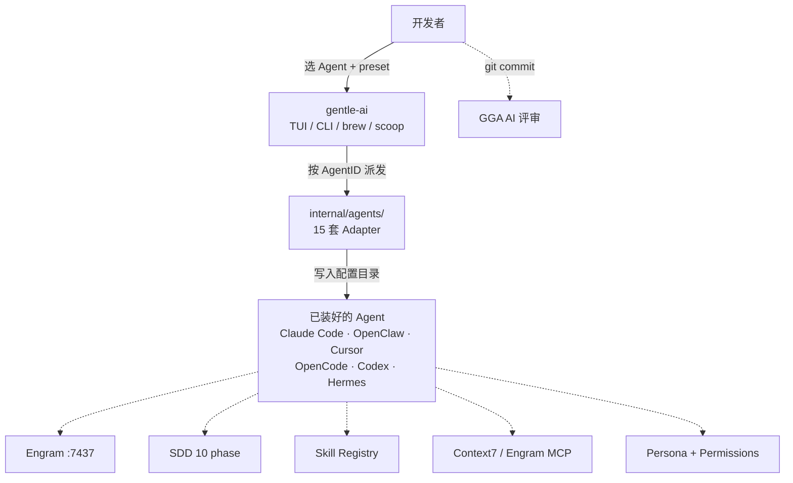

+++
date = '2026-06-30T00:04:00+08:00'
draft = false
title = 'Gentle-AI：AI 编程 Agent 的统一生态配置器'
slug = 'gentle-ai-ecosystem-configurator-guide'
description = 'Gentleman-Programming/gentle-ai 是一个 Go 写的 AI 编程 Agent 生态配置器，支持 15 个 Agent，注入持久记忆、SDD 工作流、Skill 注册表、MCP、AI Provider 切换。本文拆解它的能力边界、OpenClaw 适配与实战路径。'
categories = ['技术笔记']
tags = ['AI', 'Agent', 'Claude Code', 'OpenClaw', '工具', '生态']
+++

## 📋 学习目标

1. **判断 Gentle-AI 该不该进你的工具链** — 解决「装完 Agent 之后只剩 chatbot」的空白
2. **读懂 15 个 Agent 适配的横向差异** — Full 委派 vs Solo-agent vs Hermes `delegate_task`
3. **复述 5 条能力线的内部契约** — 每个组件写在哪、被谁加载、失败回退到哪
4. **亲手跑一次 `install --agent openclaw`** — 装好之后能定位 `~/.openclaw/` 注入的 4 类文件
5. **解释 OpenClaw 的独特定位** — Solo-agent / workspace-first / `AGENTS.md`+`SOUL.md` 双文件
6. **对比后再决定是否替换现有方案** — vs. ATL / Claude Code 原生 Skills / Codex multi-agent

## 📑 目录

1. [从「装好的 chatbot」说起](#从装好的-chatbot-说起)
2. [Gentle-AI 是什么](#gentle-ai-是什么一个生态配置器而不是新安装器)
3. [核心判断](#核心判断它在-agent-之上装了一层什么)
4. [15 个 Agent 的适配矩阵](#15-个-agent-的适配矩阵与-3-种委派形态)
5. [5 条能力线](#5-条能力线拆解)
6. [OpenClaw 视角的真实用例](#openclaw-在支持列表text-matrix-视角的真实用例)
7. [实战路径](#实战在一台空机器上从零跑通)
8. [SDD Profiles 实战](#sdd-profiles-实战让-sdd-apply-跑便宜模型)
9. [Engram 实战](#engram-实战跨-session-记忆的最小闭环)
10. [Community Integrations](#community-integrations-装好之后还能加的两个插件)
11. [备份与回滚](#备份与回滚每次写文件前先-targz)
12. [同类项目边界](#和同类项目的边界)
13. [FAQ](#常见问题)
14. [自测](#自测)
15. [练习](#练习)
16. [进阶路径](#进阶路径)
17. [资料口径说明](#资料口径说明)
18. [参考](#参考)

---

## 从「装好的 chatbot」说起

把 Claude Code、Cursor、OpenClaw 任意一个装通大概 30 秒到 5 分钟。但装好之后的真实体感，几乎都被同一句话覆盖：

> "它写代码挺快，但它不知道我们项目是怎么组织的，也不知道上次为什么放弃方案 A 选了方案 B。"

这是 2026 年 AI 编程工具的普遍基线——模型再强，开箱只是一段会话窗口。上下文随 session 清空、项目惯例靠人工往 `CLAUDE.md` / `.cursorrules` 抄、复杂任务没有强制规划、sub-agent 能不能委派看平台心情。

Gentleman-Programming/gentle-ai（以下简称 Gentle-AI）解决的就是中间这一段——**把你已经装好的 AI 编程 Agent 升级成有记忆、有工作流、有技能库、有 MCP、有权限边界、有教学人格的工程伙伴**。README 原话：

> "Gentle-AI is NOT an AI agent installer. Most agents are easy to install. It is an **ecosystem configurator**."



3 件事：**Gentle-AI 不是新 Agent，是给已有 Agent 写配置文件**；目标是让任何 Agent 启动后自动接入 5 条能力线（Engram / SDD / Skills / MCP / Persona）+ 1 条质量门（GGA）；注入以"最少操作"为前提——`curl | sh`、选 agent、回车。

## Gentle-AI 是什么——一个生态配置器，而不是新安装器

仓库根结构：

```text
gentle-ai/
├── cmd/gentle-ai/        CLI 入口
├── internal/
│   ├── agents/           15 个 Adapter（claude/openclaw/cursor/...）
│   ├── components/       engram/ sdd/ skills/ mcp/ persona/ theme/ permissions/ gga/ filemerge/
│   ├── planner/          依赖图
│   ├── pipeline/         分阶段执行 + 回滚
│   ├── backup/           配置快照 + 还原
│   ├── tui/              Bubbletea TUI（Rose Pine 主题）
│   ├── installcmd/       brew/apt/pacman/dnf 命令解析
│   └── assets/           内嵌 skill + persona 模板
├── docs/                 27 篇 markdown
├── scripts/              bash + PowerShell
├── e2e/                  Docker E2E（Ubuntu + Arch）
└── PRD.md / PRD-AGENT-BUILDER.md / AGENTS.md
```

100% Go 1.24+，27 个内 package，78 个 E2E 测试，17 个 golden fixture，关键 adapter 都有跨平台路径校验。

**定位边界**：假设你已经装好至少一个 AI 编程 Agent。它接管 Agent 的全局配置目录、把生态组件注入；`~/.gentle-ai/state.json` 记录你选过的 Agent，不会误伤没选的 Agent。

15 个 Agent（README 的"Delegation Model"列）：

| Agent | 委派形态 | 关键特性 |
| --- | :--: | --- |
| Claude Code | Full (Task tool) | Sub-agents + output styles |
| OpenCode / Kilo Code | Full (multi-mode overlay) | per-phase 路由 |
| Gemini CLI | Full (experimental) | `~/.gemini/agents/` |
| Cursor | Full (native subagents) | 10 个 SDD agent 写到 `~/.cursor/agents/` |
| VS Code Copilot | Full (runSubagent) | 支持并行 |
| Kimi Code | Full (native custom agents) | `~/.kimi` 模块化提示 |
| Kiro IDE | Full (native subagents) | `~/.kiro/agents/` + steering |
| Qwen Code | Full (native sub-agents) | slash commands |
| Pi | Full (package-managed subagents) | `gentle-pi` harness + Engram |
| **OpenClaw** | **Solo-agent** | workspace-first `AGENTS.md` / `SOUL.md` |
| Codex / Windsurf / Antigravity / Trae | Solo-agent | 各自原生 |
| Hermes | detect-only | YAML MCP；需手动先装 |

> **NOTE**: 项目**supersede 了 Agent Teams Lite（ATL）**，所有 ATL 功能都包含且加入自动更新和持久记忆。

Full / Solo-agent 分开是上限关键：Full 跑多 agent SDD 流水线，Solo-agent 串行靠 Engram 搬状态。OpenClaw 用 workspace-first 与 Claude Code 的全局 `CLAUDE.md` 不同思路（详见第 6 节）。

## 核心判断：它在 Agent 之上装了一层什么

**Gentle-AI 把 5 类原本分散在不同 repo 的能力，连同 1 类质量门，统一抽到一个 `Adapter` 接口后面，由 15 个 Agent 适配器分别落地。**

源码有两个锚点。

**锚点 1：`Adapter` 接口**（`internal/agents/interface.go`）：

```go
type Adapter interface {
    Agent() model.AgentID                                          // Identity
    Tier() model.SupportTier
    Detect(ctx context.Context, homeDir string) (...)              // Detection
    SupportsAutoInstall() bool                                     // Installation
    InstallCommand(profile system.PlatformProfile) ([][]string, error)
    GlobalConfigDir(homeDir string) string                         // Config paths
    SystemPromptDir(homeDir string) string
    SystemPromptFile(homeDir string) string
    SkillsDir(homeDir string) string
    SettingsPath(homeDir string) string
    SystemPromptStrategy() model.SystemPromptStrategy              // Strategies
    MCPStrategy() model.MCPStrategy
    MCPConfigPath(homeDir string, serverName string) string
    SupportsOutputStyles() bool                                    // Optional capabilities
    SupportsSlashCommands() bool
    SupportsSubAgents() bool
    SupportsSkills() bool
    SupportsSystemPrompt() bool
    SupportsMCP() bool
}
```

16 个方法组成的扩展点。组件层通过接口调用，不用 `switch agent { case "claude-code": ... }` 硬编码。新增 Agent 只需要写一个新 adapter + 在 `factory.go` 的 `defaultAgentIDs` 加一行。

**锚点 2：分层架构**（`docs/architecture.md`）：`planner` 把"选了 X 组件 + Y Agent + Z OS"展开成依赖图；`pipeline` 把所有写入操作拆 stage，每 stage 后 verify，任一失败触发回滚；`backup` 在 install/sync/upgrade 前先 tar.gz 当前配置、dedupe、prune 到 5 份、pinned 永不清除。三件套是核心：`app` 负责命令分发与运行时布线，`installcmd` 做 profile-aware 命令解析（brew/apt/pacman/dnf/winget），`cli/verify` 管 flag 与健康检查。

**"是否要装"的判断**：

- 单 Agent 且已手维护 `CLAUDE.md`、skills、Engram MCP、技能库 → 核心价值是"换机 5 分钟复现"
- 多 Agent 跳用（Claude Code 主用、Cursor 编辑、OpenClaw 后台、Codex 评审）→ 杀手锏是**统一行为基线**，5 条能力线在每个 Agent 输出一致，记忆跨 Agent 同步
- 单 OpenClaw 但不想手写 `AGENTS.md`/`SOUL.md` → 装 `--agent openclaw` 完成 workspace-first 注入

## 15 个 Agent 的适配矩阵与 3 种委派形态

按"你怎么用它"重排 `docs/agents.md` 的 Agent Matrix：

### A 类：Full 委派 — SDD 真的能拆给多个 sub-agent

| Agent | ID | Skills / MCP | 委派形态 | 配置路径 |
| --- | --- | --- | --- | --- |
| Claude Code | `claude-code` | ✅ ✅ | Full (Task tool) | `~/.claude` |
| OpenCode | `opencode` | ✅ ✅ | Full (multi-mode overlay) | `~/.config/opencode` |
| Kilo Code | `kilocode` | ✅ ✅ | Full (multi-mode overlay) | `~/.config/kilo` |
| Gemini CLI | `gemini-cli` | ✅ ✅ | Full (experimental) | `~/.gemini` |
| Cursor | `cursor` | ✅ ✅ | Full (native subagents) | `~/.cursor` |
| VS Code Copilot | `vscode-copilot` | ✅ ✅ | Full (runSubagent) — 支持并行 | `~/.copilot` + VS Code User profile |
| Kimi Code | `kimi` | ✅ ✅ | Full (native custom agents) | `~/.kimi` |
| Kiro IDE | `kiro-ide` | ✅ ✅ | Full (native subagents, multi-mode) | `~/.kiro` |
| Qwen Code | `qwen-code` | ✅ ✅ | Full (native sub-agents) + slash commands | `~/.qwen` |
| Pi | `pi` | ✅ ✅ | Full (package-managed subagents) | `~/.pi` |

特点：每 SDD phase 独立 context window，sub-agent 自己保存 Engram 记忆。OpenCode / Kilo Code 可指定 phase 模型；Kiro IDE 通过 `model:` frontmatter 实现 per-phase 分配。

### B 类：Solo-agent — SDD 在一个 session 里

| Agent | ID | Skills / MCP | 委派形态 | 配置路径 |
| --- | --- | --- | --- | --- |
| Codex | `codex` | ✅ ✅ | Solo-agent（multi-agent 实验可选） | `~/.codex` |
| Windsurf | `windsurf` | ✅ (native) ✅ | Solo-agent | `~/.codeium/windsurf` |
| Antigravity | `antigravity` | ✅ (native) ✅ | Solo-agent + Mission Control | `~/.gemini/antigravity` |
| **OpenClaw** | `openclaw` | ✅ ✅ | **Solo-agent** | `~/.openclaw` |
| Trae | `trae-ide` | ✅ ✅ | Solo-agent | `~/.trae` |

特点：所有 SDD phase 在同会话串行，靠 Engram MCP 跨 phase 搬状态。Windsurf 用 Plan Mode 做 spec/设计持久化；Antigravity 让 Mission Control 自动调 Browser/Terminal sub-agent；OpenClaw 用 workspace-first 的 `AGENTS.md` + `SOUL.md` 把指令沉到项目根。

**OpenClaw 适配细节**（`internal/agents/openclaw/adapter.go`）：

```go
func (a *Adapter) SystemPromptStrategy() model.SystemPromptStrategy {
    return model.StrategyMarkdownSections
}
func (a *Adapter) MCPStrategy() model.MCPStrategy {
    return model.StrategyMergeIntoSettings
}
```

- `SystemPromptFile = ~/AGENTS.md` — 优先写到 home 根目录的 `AGENTS.md`，不是 `~/.openclaw/AGENTS.md`
- `SkillsDir = ~/.openclaw/skills`，但 SDD phase skill 另外写到 `<workspace>/.openclaw/skills/sdd-*`
- `SettingsPath = ~/.openclaw/openclaw.json` — MCP 合并进 `mcp.servers`，legacy 顶层 `mcpServers` 自动迁移
- `SupportsAutoInstall() = false` — 必须用户先装好

### C 类：Detect-only / 特殊形态

| Agent | ID | Skills / MCP | 委派形态 | 配置路径 |
| --- | --- | --- | --- | --- |
| Hermes | `hermes` | ✅ ✅ | Full via `delegate_task`（暂时性 worker） | `~/.hermes` |

Hermes 用 `delegate_task` 开 ephemeral sub-agents——每个 worker 收到自包含任务（目标 + 路径 + 上下文 + 约束 + 期望产出 + 允许 toolsets/MCP/skills），只回传最终摘要。**`toolsets / MCP / skills` 不从父进程继承，必须显式传**。

`~/.hermes/config.yaml` 的 `delegation` key：`max_spawn_depth` 默认 2（递归深度）、`max_concurrent_children` 默认 4（并行 worker）、`inherit_mcp_toolsets` 默认 false（worker 不继承父 MCP）、`subagent_auto_approve` 默认 false（worker 不自动批准工具）。`toolsets / MCP / skills` 显式传递——worker 完全不知道父进程的全局设置，隔离强、不泄漏，坏处是 mission 字段必须把"允许用哪些工具"全列清楚。

## 5 条能力线拆解

对应 `docs/intended-usage.md` 的五条线，按"装什么 / 谁在用 / 失败回退"拆。

### 能力线 1：Engram 持久记忆

Engram 是 Go 单二进制（`internal/assets/` 注入），Gentle-AI 登记为 MCP server（`mem_save`、`mem_search`、`mem_context`、`mem_save_prompt`），在每个 Agent 配置里落地。用户在 session 里不用动手——Agent 自动 `mem_save` 决策/发现/bug 修复，`mem_context` 启动 session 时拉最近状态。跨 session 记忆靠同名项目合并（v1.11.0 起从 git remote 自动归一化）。

失败回退：Engram 二进制缺、`:7437` 健康检查失败、MCP 注入没成——`gentle-ai doctor` 标 warn/fail 并附 remedy。

手动介入留了口子：

```bash
engram tui                       # 浏览器式记忆浏览
engram search "auth refactor"    # 终端搜索
engram sync                      # 项目记忆导出到 .engram/
engram sync --import             # 另一台机器克隆后导入
engram projects list             # 每个项目记忆数
engram projects consolidate      # 合并漂移命名
```

Engram v1.15.3+ 默认 best-effort 捕获用户 prompt，前提是 plugin hook 已喂过同 session 上下文。`mem_save` 接收 `capture_prompt` 显式开关——人工/proactive 保存不要带；SDD 自动化产物（proposal/spec/design/tasks/apply/verify/archive/init 报告）才设 `false`。

### 能力线 2：SDD 工作流

10 个 SDD phase skill + 1 个 Judgment Day：`sdd-init`（bootstrap）/`sdd-explore`（调研）/`sdd-propose`（proposal）/`sdd-spec`（requirements）/`sdd-design`（架构决策）/`sdd-tasks`（拆任务）/`sdd-apply`（实现）/`sdd-verify`（校验）/`sdd-archive`（归档）/`sdd-onboard`（端到端演练），加 `judgment-day`（双 judge 并行对抗评审）。

Full 类父进程开 sub-agent、每 phase 独立 context；Solo-agent 类同 session 串行、靠 Engram 搬 artefact；用户不需要学——"小任务直接做，大任务 Agent 自动跳 SDD，说 `use sdd` 强制启动"。失败回退：项目级 OpenSpec 约定看 `docs/openspec-config.md`；`/sdd-init` 失败时 orchestrator 用 fallback 通用 prompt 顶上。

### 能力线 3：Skill Registry（index-first）

`skill-registry refresh` 扫项目内（`skills/`、`.opencode/skills/`、`.claude/skills/`、`.github/skills/`）+ 全局 agent skill 目录，写出 `.atl/skill-registry.md`（目录列表）和 `.atl/.skill-registry.cache.json`（schema version + path + mtime + size 做 cache-hit）。

Orchestrator session 启动读 registry，匹配 skill 后**直接把 SKILL.md 精确路径传进 sub-agent prompt**——子 agent 读真文件而不是被喂摘要。Codex/Claude Code/OpenCode 通过 hook 自动跑；Pi 由 `gentle-pi` 跑；`pi -ns` 绕过 hook 需手动 `--force`。项目没 skill 时 registry 空，orchestrator 退化到内置 sub-agent prompt——SDD 还能跑。

### 能力线 4：MCP 服务器

默认注入两个 MCP server：

- **Context7** — 实时获取框架/库官方文档（绕开训练截止日期）
- **Engram** — 持久记忆

各 Agent 注入策略：

| Agent | 策略 | 落点 |
| --- | --- | --- |
| Claude Code | plugin | `~/.claude/mcp/` |
| OpenCode / Kilo Code | 合并进 `opencode.json` 顶层 | `~/.config/opencode/opencode.json` |
| Codex | upsert `[mcp_servers.<name>]` | `~/.codex/config.toml` |
| Windsurf | `mcp_config.json` | `~/.codeium/windsurf/mcp_config.json` |
| Antigravity | `mcp_config.json` | `~/.gemini/antigravity/mcp_config.json` |
| Cursor | `mcp.json` | `~/.cursor/mcp.json` |
| OpenClaw | 合并进 `openclaw.json` 的 `mcp.servers` | `~/.openclaw/openclaw.json` |
| Hermes | `StrategyMergeIntoYAML` 加 `mcp_servers:` 段 | `~/.hermes/config.yaml` |

Hermes 的 fallback 稳——原有顶层 key（如 `model:`）原样保留。Agent 在 chat 里 `mcporter` 调用，自动从 Context7 拉真实文档片段。Hermes 通过 `inherit_mcp_toolsets: true` 可让 worker 自动继承父 MCP（默认 false）。失败回退：MCP 没启动时 Agent 在下一次 `mem_context` 取不到记忆时感知上下文变空。

### 能力线 5：Persona + Permissions

**Persona**：3 种模式，独立于 preset 注入：`gentleman`（教学型导师，对坏实践 push back 解释 why）、`neutral`（同套哲学无地区语言）、`custom`（你自己已有 persona，Gentle-AI 不碰）。OpenClaw 特别——persona 写到 workspace 的 `SOUL.md` 而非 `~/.openclaw/SOUL.md`，切项目换人格但 Engram 跨项目共享。

**Permissions**（默认 deny list）：

```text
~/.ssh/*          ~/.ssh/**/*
**/*.pem          **/*.key
**/.env*          ~/.credentials/*
~/.aws/credentials
~/.config/gh/hosts.yml
~/Library/Keychains/*
**/secrets/*
**/*.p12          **/*.pfx
```

Hermes 用未文档化的 permission 格式，Gentle-AI 跳过。

### 能力线 6：GGA — Git Guardian Angel

零依赖 Bash CLI，作为 git pre-commit hook。`--component gga` 触发，**不**自动跑 `gga init` / `gga install`（仓库级显式决策）。每次 `git commit` 把 staged diff 发给配置的 AI provider，按 `AGENTS.md` 标准判定通过/阻断——provider 与 key 都在用户侧管。GGA 是**写入端**的质量门，前 5 条是**读取端**的能力。

## OpenClaw 在支持列表——text-matrix 视角的真实用例

text-matrix 的 runtime 就是 OpenClaw——这台机器上跑的会话、文件落地、工具注册全是 OpenClaw 在管。这节看 Gentle-AI 注入后实际怎么叠。

### OpenClaw 在 15 个 Agent 里的独特定位

3 个细节和别的 Agent 不同：

1. **Workspace-first 的 `AGENTS.md` / `SOUL.md`**——Claude Code、OpenCode 把提示塞 `~/.claude/CLAUDE.md`、`~/.config/opencode/opencode.json`；OpenClaw 直接写到当前工作区的 `AGENTS.md` 与 `SOUL.md`。换项目 = 换 persona + 换系统提示，但全局 MCP 与持久记忆仍跨项目共享
2. **`SupportsAutoInstall() = false`**——必须用户先装好，Gentle-AI 不代装
3. **Solo-agent 形态**——SDD phase 全在一 session 串行跑，靠 Engram 在 phase 间搬 artefact

源码锚点（`internal/agents/openclaw/adapter.go`）：

```go
func (a *Adapter) Tier() model.SupportTier       { return model.TierFull }
func (a *Adapter) SupportsAutoInstall() bool      { return false }
func (a *Adapter) SystemPromptFile(homeDir string) string {
    return filepath.Join(homeDir, "AGENTS.md")  // 注意：写到 home 根
}
func (a *Adapter) SettingsPath(homeDir string) string {
    return filepath.Join(ConfigPath(homeDir), "openclaw.json")
}
func (a *Adapter) MCPStrategy() model.MCPStrategy {
    return model.StrategyMergeIntoSettings
}
```

`Tier() = TierFull` 与 `SupportsAutoInstall() = false` 一起表达"Full 适配但你自己管安装"——跟 Hermes 的 detect-only 不一样，OpenClaw 实打实接管 `~/.openclaw/openclaw.json` 写入。

### text-matrix 实测：实际落点

```text
~/.openclaw/
├── openclaw.json          # mcp.servers 合并进这里
└── skills/                # 可携带 skills 放全局
<workspace>/
├── AGENTS.md              # 注入 Engram 协议 + SDD orchestrator
├── SOUL.md                # 注入 persona
└── .openclaw/skills/sdd-*/  # 10 个 SDD phase skills（workspace-scoped）
```

工作流：会话启动 — OpenClaw 读 `AGENTS.md` 拿 SDD 编排指令 + Engram 协议；任务进来 — 小任务直接做，大任务自动跳 SDD；phase 之间 — Engram `mem_save` 保存决策，`mem_context` 拉回历史；输出 — 教学型 persona 指出 anti-pattern；commit 之前 — 装 GGA 则 pre-commit AI 评审。

### 一条命令把生态挂上去

```bash
gentle-ai install --agent openclaw --preset full-gentleman
```

`--preset full-gentleman` 装全套 7 个组件；已经用 Engram、只想要 SDD 与 Skill Registry，换 `--component sdd,skills,persona`。

## 实战：在一台空机器上从零跑通

以 OpenClaw 为目标的最小行动。其他 14 个 Agent 姿势一致，只是配置文件落点不同。

### Step 1：装 OpenClaw（先有 Agent）

> OpenClaw `SupportsAutoInstall() = false`，Gentle-AI 不代装。

按 OpenClaw 官方流程走完，确认 `which openclaw` 在 PATH。

### Step 2：装 gentle-ai

macOS / Linux：

```bash
# 推荐 Homebrew
brew tap Gentleman-Programming/homebrew-tap
brew trust --formula gentleman-programming/tap/gentle-ai
brew install gentle-ai

# 或 curl 一行
curl -fsSL https://raw.githubusercontent.com/Gentleman-Programming/gentle-ai/main/scripts/install.sh | bash

# 或 Go install（Go 1.24+）
go install github.com/gentleman-programming/gentle-ai/cmd/gentle-ai@latest
```

Windows：

```powershell
scoop bucket add gentleman https://github.com/Gentleman-Programming/scoop-bucket
scoop install gentle-ai
```

beta：`curl -fsSL ... | bash -s -- --channel beta`。升级/退 stable：`GENTLE_AI_CHANNEL=beta gentle-ai upgrade` / `brew reinstall gentle-ai`。

### Step 3：先 dry-run

```bash
gentle-ai install --dry-run --agent openclaw --preset full-gentleman
```

输出含 `Platform decision` 行，注明 OS、distro、package manager、support status。动笔 install 前先看依赖图。

### Step 4：跑 install

```bash
gentle-ai install --agent openclaw --preset full-gentleman
```

走完 TUI（preset → persona → 可选组件）。最终应看到 `~/.openclaw/openclaw.json` 多了一组 `mcp.servers`（Engram + Context7）、workspace `AGENTS.md` 多了一段 Engram 协议、`SOUL.md` 多了一段 persona、`.openclaw/skills/sdd-*/` 多了 10 个 phase skill。

### Step 5：项目内 setup 与验证

```bash
/sdd-init
gentle-ai skill-registry refresh   # 重建 Registry（startup hook 也自动跑）
gentle-ai doctor                  # 只读健康检查：tool 二进制/state.json/Engram MCP/磁盘
```

每项 pass/warn/fail + remedy。

### Step 6：第一次跑通

在 OpenClaw 里问 "你是什么？"——按 `SOUL.md` 应回 `I am Gentle AI running on OpenClaw Agent.`。问 "上周为什么放弃方案 A 改方案 B？"——Engram 跨 session 召回，没召回看 `engram tui` 有无合并漂移。

## SDD Profiles 实战：让 `sdd-apply` 跑便宜模型

Multi-mode SDD 只对 OpenCode / Kilo Code / Kiro IDE 有意义。**Hermes、Codex、Windsurf、Antigravity、OpenClaw、Trae 都是 single-mode——一个模型贯穿所有 phase**。OpenClaw 走 solo-agent，再叠 phase 路由也没意义。

具体做法（OpenCode）：

```bash
# 1. 先在 OpenCode 里接好 AI providers
# 2. 用 gentle-ai sync 创建 profile
gentle-ai sync --profile cheap:openrouter/qwen/qwen3-30b-a3b:free

# 3. 细到单个 phase：sdd-apply 用 Sonnet，其它 Haiku
gentle-ai sync \
  --profile cheap:anthropic/claude-haiku-3.5-20241022 \
  --profile-phase cheap:sdd-apply:anthropic/claude-sonnet-4-20250514
```

跑完：

- OpenCode 启动后出现 `gentle-orchestrator`（默认）+ `sdd-orchestrator-cheap` 两个 entry
- 按 **Tab** 切换
- 切到 `sdd-orchestrator-cheap` 后所有 `/sdd-*` 命令跑便宜模型；切回 `gentle-orchestrator` 跑默认

需要 reasoning effort（如 OpenAI `gpt-5` 有 low/medium/high/xhigh），装好后会写 `~/.gentle-ai/cache/model-variants.json`。**首次跑 `gentle-ai sync` 后必须先重启一次 OpenCode**——让 OpenCode 自带的 `model-variants` 插件把 provider variant 写进 cache，重启后 gentle-ai 的 model picker 多一步"Select reasoning effort level"。

### 外部 profile manager 兼容模式

如果在用社区工具把 profile 文件存在 `~/.config/opencode/profiles/*.json`（不在 `opencode.json`），Gentle-AI 有**外部单激活**兼容策略：

- `gentle-ai sync` 检测到 `profiles/*.json` → 自动切到 `external-single-active` 策略
- 仍维护 SDD 基础资产，但**不**自动从 `opencode.json` 重新生成 suffixed profiles
- 保留当前 `gentle-orchestrator` prompt 不被覆盖（让外部工具的 runtime 扩展块完整）

强制覆盖：

```bash
gentle-ai sync --agent opencode --sdd-profile-strategy external-single-active   # 外部模式
gentle-ai sync --agent opencode --sdd-profile-strategy generated-multi         # 经典多模式
```

双策略是 OpenClaw / Hermes 这种 solo-agent 在 multi-mode 拿不到价值后，专门给 OpenCode 用户的让步——既保留"统一生态"承诺，又不强迫 `opencode.json` 是 source of truth。

## Engram 实战：跨 session 记忆的最小闭环

OpenClaw 这种 Solo-agent 对 Engram 的依赖比 Full 类更强——SDD 多个 phase 在同一 session 串行，没有独立 context window 时只剩 Engram 能跨 phase 串状态。

### 最小闭环 5 步

```bash
# Step 1: 启动 OpenClaw 改一行代码，5 秒后
engram projects list                          # 看 project 名是否归一化、observation 计数

# Step 2: 终端搜索
engram search "刚才改的代码"                  # 命中过去 observation，可 pin

# Step 3: 导出/导入（团队 onboarding 钩子）
engram sync                                    # 导出项目记忆到 .engram/
engram sync --import                           # 另一台机器克隆后导入

# Step 4: 漂移合并（v1.11.0+）
engram projects consolidate                    # 看到 "my-app" vs "My-App" 时跑

# Step 5: MCP 手动调用（OpenClaw 走 ~/.openclaw/openclaw.json 的 mcp.servers）
# mem_save({ observation: "...", topics: ["auth-refactor"] })
# mem_search({ query: "auth refactor", limit: 5 })
# mem_context({ since: "1h" })
```

`mem_save` 接收 `capture_prompt` 字段——人工/proactive 保存不要带；SDD 自动化产物（proposal/spec/design/tasks/apply/verify/archive/init 报告）才设 `false`。`mem_merge_projects`、`mem_suggest_topic_key`、`mem_stats` 见 `docs/engram.md`。

## Community Integrations——装好之后还能加的两个插件

Gentle-AI 本身就是 OpenCode TUI 的"原生增强包"，社区还在上面搭了两个独立插件：

### 1. sub-agent-statusline

OpenCode TUI statusline 插件，显示：当前 sub-agent 活动状态、elapsed time、token/context 用量（OpenCode 暴露时才显示）。

Gentle-AI 装 OpenCode 时会问要不要注册这个插件——只确保 `~/.config/opencode/tui.json` 存在、把这个 npm 包加进 `plugin` 数组。OpenCode 启动后才真的装/载入，落到 `~/.config/opencode/node_modules/`。装好之后 `gentle-ai update` 能比较本地 `package.json` 版本与 GitHub release。

### 2. sdd-engram-plugin

OpenCode TUI 另一个插件，提供：在 OpenCode 里直接管理 SDD profile（不需要回 TUI）、直接浏览 Engram 记忆、**运行时切换 profile**（不需重启）。

### 装好后能力差

| 能力 | native OpenCode | + sub-agent-statusline | + sdd-engram-plugin |
| --- | --- | --- | --- |
| TUI 状态栏增强 | ❌ | ✅ | ❌ |
| runtime profile 切换 | ❌ | ❌ | ✅ |
| TUI 内 Engram 浏览 | ❌ | ❌ | ✅ |
| token / context 显示 | ❌ | ✅（OpenCode 暴露时） | ❌ |

两者都 optional、不装 Gentle-AI 也能用，但装了 OpenCode 又用 SDD 的话非常建议一起上。

## 备份与回滚：每次写文件前先 tar.gz

### 查看当前状态

```bash
gentle-ai doctor                                                    # 只读健康检查
gentle-ai sync --dry-run                                            # 先看会改什么
gentle-ai sync --agent openclaw --agent claude-code                 # 显式指定 scope
```

`sync` 只更新 `~/.gentle-ai/state.json` 记录的已装 agent，**不**碰没选的 Agent 配置目录。

### 出问题回滚

TUI：`gentle-ai` → Backups → `j`/`k` 选 → `Enter` restore / `p` pin / `r` rename / `d` delete

CLI：`gentle-ai restore latest`

### 备份策略

| 设置 | 默认 | 说明 |
| --- | --- | --- |
| 保留份数 | 5 | 最新 5 份非 pinned 保留 |
| pinned 备份 | 永不清除 | TUI 按 `p` toggle |
| 去重 | 跳过 | checksum 同就不重备份 |
| 压缩 | 总是 | tar.gz（比 legacy plain 省 ~75%） |

### 备份不覆盖

- `brew install` / `apt-get install` / `pacman -S` 装过的二进制**不**在 rollback 范围
- 备份只 snapshot 文件；要撤回二进制走 `brew uninstall` / `apt-get remove` / `pacman -R`

### 出错后的标准动作

1. 看 verify report 哪项 fail
2. `gentle-ai restore latest` 或 TUI restore
3. `gentle-ai install --dry-run` 验证修复后的 plan
4. 重新 `gentle-ai install` 跑完整流程

## 和同类项目的边界

放在 2026 年的 AI Agent 生态里看，最常被拿来对比：

### vs. Agent Teams Lite (ATL)

ATL 是同一团队出过的早期项目，**已 archived**。README 写得很清楚：

> "This project supersedes Agent Teams Lite (now archived). Everything ATL provided is included here with better installation, automatic updates, and persistent memory."

迁移路径：装 Gentle-AI，ATL 配置自动迁过来；ATL 仓库保留只读作为历史档案。

### vs. Claude Code 原生 Skills

| 维度 | Claude Code 原生 | Gentle-AI 注入后 |
| --- | --- | --- |
| 跨 Agent 复用 | 仅 Claude Code | 15 个 Agent 共享同一份 skill |
| Skill 发现 | 项目内全部加载 | index-first（registry）命中 SKILL.md 路径注入 |
| 记忆 | 无内置 | Engram 跨 session |
| 工作流 | 无内置 SDD | 10 phase SDD + Judgment Day |
| 权限 | 默认 settings | 默认敏感路径 deny list |
| Persona | 无内置 | gentleman / neutral / custom |

Claude Code 原生 skill 对单 Agent 够用；Gentle-AI 提供**多 Agent 一致性 + 工作流 + 记忆**这层叠加。

### vs. Codex multi-agent 子任务

Codex CLI 也有 sub-agent（`spawn_agent` / `wait_agent` / `close_agent`），默认关闭（`features.multi_agent = false`）。Gentle-AI 把可选 multi-agent SDD 写到 `~/.codex/config.toml`（`agents.max_threads = 4`、`agents.max_depth = 2`），需要时手动改 `multi_agent = true`。

Codex 走 multi-mode SDD 的另一条：通过 `~/.codex/<name>.config.toml` profile 文件，运行时 `codex --profile sdd-cheap`：

| Profile | effort | SDD phases |
| --- | --- | --- |
| `sdd-strong` | `xhigh` | propose, design, verify, judge |
| `sdd-mid` | `high` | spec, tasks, apply |
| `sdd-cheap` | `low` | explore, archive, onboard |

Gentle-AI 直接生成这套 profile 文件，用户切 profile 不需重启 IDE。

### vs. OpenCode SDD Profiles

OpenCode 自己不带 SDD；`gentle-orchestrator` 是 OpenCode 上的 canonical SDD conductor，社区另有人用 `sdd-orchestrator`（legacy key）。Gentle-AI sync 自动把 legacy 迁到 canonical。

OpenCode 跑 SDD 的核心收益是 multi-mode——只为设计 phase 付 opus 的钱，其它 phase 用 haiku。

### 一句话总结

Gentle-AI 的差异化点：**5 条能力线 + 1 条质量门 + 跨 15 个 Agent 的统一抽象**。其他项目往往只解决其中 1-2 条。

## 常见问题

**装完后能单独删某个 Agent 的配置吗？** 可以。每个 Agent 的全局配置目录独立（`~/.claude/`、`~/.openclaw/`、`~/.config/opencode/` 等），单独删某目录不影响别的。TUI 的 uninstall flow 可选"uninstall 哪些 Agent + 哪些 managed 组件"，逐个确认。

**Engram 启动失败？** `gentle-ai doctor` 标 fail 附 remedy。常见 3 个原因：端口 7437 被占；`~/.openclaw/openclaw.json` 没 mcp.servers 段（MCP 注入失败）；Engram 二进制不在 PATH（重装或在 PATH 加）。

**Multi-mode SDD 在 Hermes 里能开吗？** 不能。Hermes 的 SDD 没有 multi-mode（无 per-phase 模型路由），只有 single-mode。一个 session 一个模型贯穿所有 phase，靠 Engram 跨 phase 搬状态。

**装社区插件后 `gentle-ai update` 会覆盖吗？** 不会。Gentle-AI `update` 比较 `~/.config/opencode/package.json` 里的版本与 GitHub release，差距大才提示升级。

**从 beta 通道退回 stable？** `GENTLE_AI_CHANNEL=beta gentle-ai upgrade` 在 beta 升级；退回 stable 要用最初装的包管理器重装——Homebrew 走 `brew reinstall gentle-ai`，Scoop 走 `scoop install --force gentle-ai`。

**GGA 不绑 provider，但需要 key 吗？** 不绑 provider 名称，但运行时要一个能调用的 API（OpenAI、Anthropic 等任一）。key 在用户侧管（`OPENAI_API_KEY` / `ANTHROPIC_API_KEY` 环境变量），GGA 不存 key。

## 自测

1. `Adapter` 接口的 4 个核心职责分别是什么？（Identity / Detection / Config paths / Config strategies + Optional capabilities）
2. Full / Solo-agent / `delegate_task` 三种委派的核心区别？（独立 context window 数量 / sub-agent 是否继承 MCP / 是否 worker-only 回传摘要）
3. Engram 跨 session 记忆的关键字段是什么？（git remote 归一化后的 project name；v1.11.0 起；漂移用 `engram projects consolidate`）
4. OpenCode multi-mode SDD 用哪两个 CLI flag？（`--profile` 和 `--profile-phase`）
5. `gentle-ai sync` 不重装什么？（不重装二进制——只更新 prompt / skill / MCP 配置 / SDD orchestrator）
6. OpenClaw 的 persona 注入点和 Claude Code 的区别？（OpenClaw 写 workspace 的 `SOUL.md`；Claude Code 写 `~/.claude/output-styles/` 或全局 CLAUDE.md）
7. 默认敏感路径 deny list 至少 5 条？（`~/.ssh/*`、`**/*.pem`、`**/*.key`、`**/.env*`、`~/.aws/credentials`、`~/.config/gh/hosts.yml`）

## 练习

### 练习 1（5 分钟）：Dry-run 一遍

```bash
gentle-ai install --dry-run --agent openclaw --preset minimal
```

观察"Platform decision"行和"Plan dependencies"。记录 3 个最意外的 dependency 节点。

### 练习 2（15 分钟）：装完跑 doctor

按 Step 1 → Step 6 走完整流程。跑完 `doctor`，对每个 warn/fail 跑 remedy 后重新 `doctor`。

### 练习 3（20 分钟）：SDD 跑一遍

进一个已有 Git 仓库的项目：

```bash
/sdd-init
git add . && git commit -m "init"
# 让 OpenClaw 读 AGENTS.md 后说：
"在 /workspace 目录下实现一个新功能：把 README 里 'Hello' 替换成 'Hello, $USER'"
```

观察 agent 是否自动跳进 `sdd-explore` → `sdd-propose` → `sdd-spec` → `sdd-design` → `sdd-tasks` → `sdd-apply` → `sdd-verify` 流程。结束后问 OpenClaw："我们刚才为什么选方案 X 不选方案 Y？"——Engram 应召回。

### 练习 4（30 分钟）：配置 SDD Profile（仅 OpenCode）

```bash
gentle-ai sync --profile cheap:openrouter/qwen/qwen3-30b-a3b:free
```

启动 OpenCode，按 Tab 切到 `sdd-orchestrator-cheap`，跑一次小型 explore-propose-spec 流程。记录两个 profile 在同一任务上的 token 差异。

### 练习 5（1 小时）：装两个 community 集成插件

按 Community Integrations 章节提示装 `sub-agent-statusline` 和 `sdd-engram-plugin`，重启 OpenCode 验证：sub-agent 列表显示 elapsed time + token；TUI 内浏览 Engram 记忆；不重启切换 SDD profile。

## 进阶路径

### 初阶（30 分钟）

- 精读 `docs/intended-usage.md`——README 作者说"如果只读一篇文档就是这一篇"
- 装好后只跑 `--preset minimal`（Engram + SDD skills）这条最小路径
- 把 `~/.openclaw/openclaw.json` 打开看一遍 mcp.servers 段

### 中阶（2 小时）

- 通读 `docs/architecture.md`——理解 planner / pipeline / backup 三件套
- 试 `--scope=workspace`：把 OpenClaw 配置从 `~/.openclaw/` 隔离到项目根
- 搭一个 `sdd-engram-plugin` 试用闭环

### 高阶（半天）

- 读 `internal/agents/interface.go` + `factory.go`：理解 Adapter 扩展点
- 读 `internal/agents/openclaw/adapter.go`：理解 OpenClaw 的 4 个关键配置路径
- 本地新增一个第三方 Agent adapter
- 跑 E2E：`RUN_FULL_E2E=1 RUN_BACKUP_TESTS=1 ./e2e/docker-test.sh`

### 专家（1-2 周）

- 给 Gentle-AI 写一个 community integration 插件
- 在 engram repo 做内存去重深度优化
- 把 Gentle-AI 用到生产环境，按 PRD.md 的 R-DEP / R-AGENT / R-ENGRAM / R-SDD 验收需求逐条验

## 资料口径说明

为避免把 README 文案直接写成结论，关键判断按下面口径取证：

- **能力清单 / Agent ID / 支持状态 / 安装命令**：README、docs/agents.md、docs/intended-usage.md、docs/architecture.md
- **OpenClaw 适配细节**：`internal/agents/openclaw/adapter.go`、`internal/agents/openclaw/adapter_test.go`、docs/agents.md 的 OpenClaw 段
- **5 条能力线实现位置**：docs/intended-usage.md、docs/engram.md、docs/opencode-profiles.md、docs/components.md
- **Engram 命令 / 协议**：docs/engram.md + Gentleman-Programming/engram
- **Community Integrations**：README Community Highlights 段 + 两个仓库链接
- **PRD 段**：PRD.md（1.4k 行），按 Problem Statement / Vision / Components 等章
- **Hermes `delegate_task` 字段**：docs/agents.md 的 Hermes 节
- **数字与版本**：仅 README / docs 显式给出的事实（如 15 个 Agent、27 docs、78 E2E 测试）才复用，不补 README 没写的数字

未在仓库或 docs 中明确说明的，文中一律不补写；遇到边界情形按"读者需要知道"的最少集叙述，不杜撰细节。

## 参考

### 主仓库

- [Gentleman-Programming/gentle-ai](https://github.com/Gentleman-Programming/gentle-ai) — 主仓库、[README.md](https://github.com/Gentleman-Programming/gentle-ai/blob/main/README.md)、[PRD.md](https://github.com/Gentleman-Programming/gentle-ai/blob/main/PRD.md)（1.4k 行）、[PRD-AGENT-BUILDER.md](https://github.com/Gentleman-Programming/gentle-ai/blob/main/PRD-AGENT-BUILDER.md)

### docs/ 关键章节

[intended-usage.md](https://github.com/Gentleman-Programming/gentle-ai/blob/main/docs/intended-usage.md)（README 推荐"只读一篇就这"）/ [agents.md](https://github.com/Gentleman-Programming/gentle-ai/blob/main/docs/agents.md)（适配矩阵）/ [opencode-profiles.md](https://github.com/Gentleman-Programming/gentle-ai/blob/main/docs/opencode-profiles.md)（multi-mode SDD）/ [engram.md](https://github.com/Gentleman-Programming/gentle-ai/blob/main/docs/engram.md)（命令与 MCP）/ [architecture.md](https://github.com/Gentleman-Programming/gentle-ai/blob/main/docs/architecture.md)（模块与测试）/ [components.md](https://github.com/Gentleman-Programming/gentle-ai/blob/main/docs/components.md)（7 个组件）/ [rollback.md](https://github.com/Gentleman-Programming/gentle-ai/blob/main/docs/rollback.md)（备份还原）/ [usage.md](https://github.com/Gentleman-Programming/gentle-ai/blob/main/docs/usage.md)（TUI / CLI / persona）

### 配套项目 + Community

[engram](https://github.com/Gentleman-Programming/engram) | [Gentleman-Skills](https://github.com/Gentleman-Programming/Gentleman-Skills)（React 19 / Angular / TS） | [gentle-pi](https://github.com/Gentleman-Programming/gentle-pi) | [scoop-bucket](https://github.com/Gentleman-Programming/scoop-bucket) | [sub-agent-statusline](https://github.com/Joaquinvesapa/sub-agent-statusline) | [sdd-engram-plugin](https://github.com/j0k3r-dev-rgl/sdd-engram-plugin)

### OpenClaw 适配源码

[`internal/agents/interface.go`](https://github.com/Gentleman-Programming/gentle-ai/blob/main/internal/agents/interface.go)（Adapter 契约）/ [`factory.go`](https://github.com/Gentleman-Programming/gentle-ai/blob/main/internal/agents/factory.go)（16 Agent 注册）/ [`openclaw/adapter.go`](https://github.com/Gentleman-Programming/gentle-ai/blob/main/internal/agents/openclaw/adapter.go)（OpenClaw 适配）/ [`registry.go`](https://github.com/Gentleman-Programming/gentle-ai/blob/main/internal/agents/registry.go)（注册表）/ [`discovery.go`](https://github.com/Gentleman-Programming/gentle-ai/blob/main/internal/agents/discovery.go)（磁盘发现）
