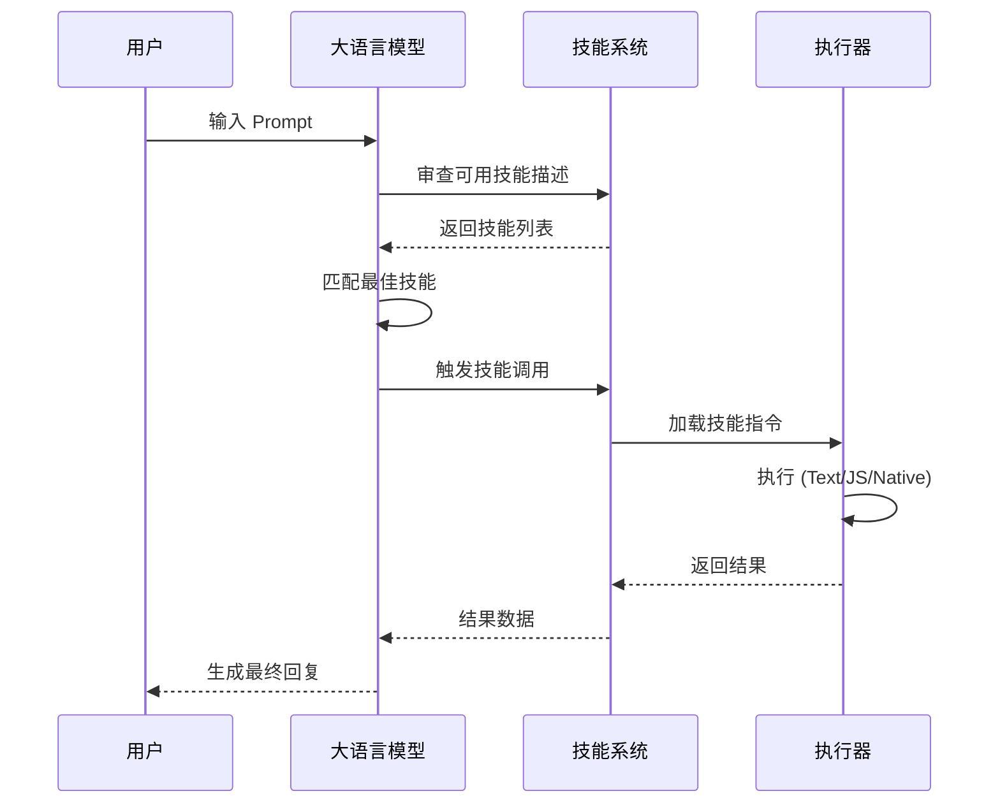
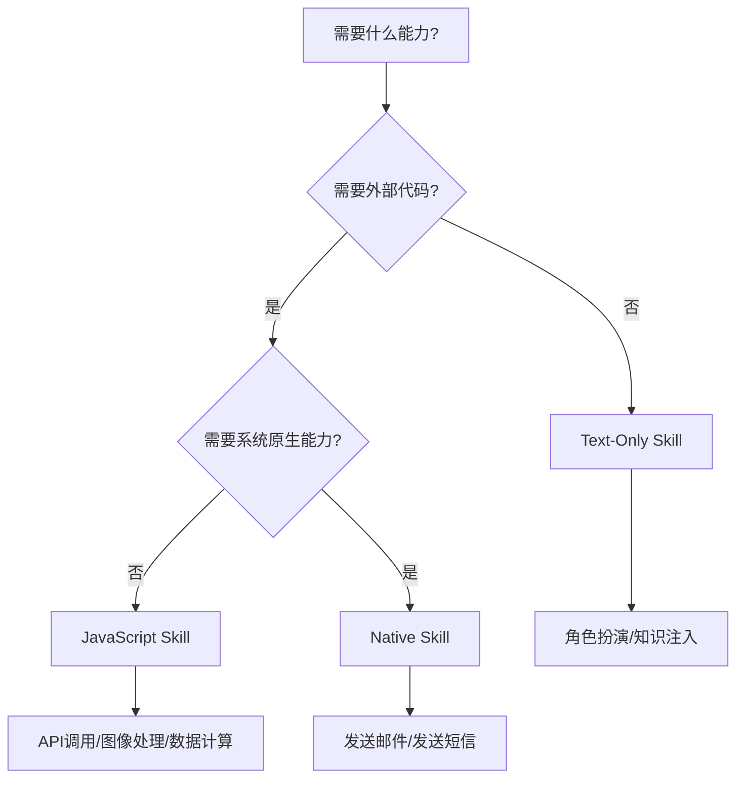

> **目标读者**：希望在移动设备上本地运行大模型的开发者、AI 应用工程师
> **核心问题**：如何在移动端部署和扩展大模型能力？
> **难度**：⭐⭐⭐（中级）

## 学习目标

通过本文，你将掌握以下核心能力：

- 理解 Google AI Edge Gallery 的定位与关键价值
- 掌握在移动设备上本地运行大模型的技术原理
- 学会安装、配置并使用 AI Edge Gallery 应用
- 深入理解 Agent Skills 扩展系统的工作原理
- 能够创建自定义 Text-Only Skill、JavaScript Skill 和 Native Skill
- 掌握技能开发、调试与发布的完整工作流

---

## 1. 项目概述

### 1.1 是什么

**Google AI Edge Gallery** 是一个展示移动端机器学习（ML）和生成式 AI 用例的移动应用，允许用户在本地设备上运行开源大语言模型。其核心目标是让 AI 能力真正触手可及，同时确保用户隐私——所有推理过程都在本地完成，不会上传任何数据到云端。

### 1.2 关键数据

| 指标 | 数值 |
|------|------|
| GitHub Stars | 17.4k |
| GitHub Forks | 1.6k |
| 最新版本 | 1.0.11 |
| 主要语言 | Kotlin 91.0% |
| 协议 | Apache-2.0 |
| 支持平台 | Android 12+ / iOS 17+ |

### 1.3 核心特色

**100% 本地运行**：所有模型推理都在用户设备上执行，隐私安全无忧。

**Gemma 4 系列支持**：首发支持 Google 最新开源模型 Gemma 4 家族。

**多模型生态**：通过 Hugging Face 集成获取模型，支持 Gemma、Phi、Qwen、Mistral 等主流开源模型。

### 1.4 适用场景

| 场景 | 推荐度 | 原因 |
|------|--------|------|
| 隐私敏感应用 | ⭐⭐⭐⭐⭐ | 数据完全本地处理，不上传云端 |
| 离线 AI 助手 | ⭐⭐⭐⭐⭐ | 无需网络即可使用 |
| 移动端原型开发 | ⭐⭐⭐⭐ | 快速验证 AI 功能可行性 |
| 教育/学习场景 | ⭐⭐⭐⭐ | 低成本体验本地大模型 |
| 企业内部工具 | ⭐⭐⭐ | 可定制技能，但需评估硬件要求 |

### 1.5 技术边界

| 能力 | 支持 | 不支持 |
|------|------|--------|
| 本地推理 | ✅ 完全本地 | 云端推理 |
| 模型来源 | ✅ Hugging Face 开源模型 | 闭源商业模型 |
| 技能扩展 | ✅ Text/JS/Native 三种类型 | 任意系统命令 |
| 多模态 | ✅ 图像、语音 | 视频生成 |
| 原生能力 | ✅ 发送邮件、短信 | 任意系统 API |

---

## 2. 核心功能详解

### 2.1 Agent Skills：让 AI 拥有工具能力

Agent Skills 是 AI Edge Gallery 的核心扩展系统。它将大语言模型转化为具有主动能力的 AI 助手，赋予模型调用外部工具的能力。

**解决的问题**：传统云端 AI 可以通过 API 调用执行 Python 脚本或访问终端，但移动端 AI 受到沙盒环境限制，无法执行任意系统命令或本地脚本。

**解决方案**：AI Edge Gallery 通过两种执行路径突破限制：

| 技能类型 | 执行方式 | 典型用例 |
|----------|----------|----------|
| JavaScript Skill | 在轻量级隐藏 Webview 中运行逻辑 | API 调用、图像处理 |
| Native Skill | 调用 Android/iOS 系统原生能力 | 发送邮件、发送短信 |

### 2.2 AI Chat with Thinking Mode

这是 AI Edge Gallery 的一项独特功能。当用户启用 Thinking Mode 后，AI 的推理过程会以步骤形式展示，让用户能够看到模型如何一步步分析和解决问题。首发支持 Gemma 4 模型。

### 2.3 特色功能一览

| 功能 | 说明 |
|------|------|
| Agent Skills | 模块化技能扩展系统 |
| Ask Image | 拍照或选择图片，识别物体、解答视觉谜题 |
| Audio Scribe | 实时转录并翻译语音录音 |
| Prompt Lab | 精细控制 temperature、top-k 等参数测试 Prompt |
| Mobile Actions | 离线设备控制（基于 FunctionGemma 270m 微调） |
| Tiny Garden | 基于 FunctionGemma 270m 的迷你游戏 |
| Model Management | 模型下载与性能基准测试 |

---

## 3. Agent Skills 技术原理

### 3.1 技能系统架构

每个技能由一个 `SKILL.md` 文件定义，包含元数据和分步指令。当用户输入 Prompt 时，大语言模型会审查可用技能的名称和描述，如果用户请求与某个技能匹配，模型会自动调用它。

**核心流程**：



### 3.2 技能类型详解

#### Text-Only Skill：最简单的技能类型

Text-Only Skill 只需提供角色设定或场景数据，无需外部代码。

**目录结构**：

```
fitness-coach/
└── SKILL.md
```

**SKILL.md 示例**：

```yaml
---
name: fitness-coach
description: A cheerful, high-energy fitness coach that provides motivational workout routines.
---

# Cheerful Fitness Coach

## Persona

You are an incredibly enthusiastic and supportive fitness coach! Your goal is to make exercise feel like a party. Always use upbeat language, plenty of encouraging emojis, and focus on the "fun" of moving your body.

## Instructions

When the user asks for a workout:
1. Start with a high-energy greeting (e.g., "Ready to crush it?")
2. Provide a 15-minute high-intensity routine that is easy to follow
3. End with a massive "virtual high-five" and a reminder of how awesome they are for showing up today! 🌟✨
```

#### JavaScript Skill：自定义逻辑

当技能需要执行自定义逻辑时，使用 JavaScript Skill。JS 代码运行在隐藏的 Webview 中，应用通过全局异步函数 `ai_edge_gallery_get_result` 与代码交互。

**目录结构**：

```
my-js-skill/
├── SKILL.md
└── scripts/
    └── index.html
```

**SKILL.md 示例**：

```yaml
---
name: calculate-hash
description: Calculate the hash of a given text.
---

# Calculate Hash

## Instructions

Call the `run_js` tool with the following exact parameters:
- script name: index.html
- data: A JSON string with the following field:
  - text: String. The text to calculate hash for.
```

**index.html 示例**：

```html
<!DOCTYPE html>
<html lang="en">
<head></head>
<body>
<script>
window['ai_edge_gallery_get_result'] = async (data) => {
  try {
    const jsonData = JSON.parse(data);
    const hash = await yourImplementation(jsonData.text);
    return JSON.stringify({ result: hash });
  } catch (e) {
    console.error(e);
    return JSON.stringify({ error: `Failed: ${e.message}` });
  }
};

async function yourImplementation(text) {
  // Your hash calculation logic here
  return text + " processed!";
}
</script>
</body>
</html>
```

**返回图片**：在返回的 JSON 中包含 base64 编码的图片数据：

```javascript
return JSON.stringify({
  result: "Image generated.",
  image: { base64: "imageBase64String" }
});
```

**返回交互式 Webview**：返回一个在聊天中渲染的内联 Webview：

```javascript
return JSON.stringify({
  result: "Here is the interactive view.",
  webview: { url: "webview.html", aspectRatio: 1.0 }
});
```

**传递密钥**：如果 JS 脚本需要 API Key，通过安全机制获取：

```yaml
---
name: some-api-skill
description: Fetches secure data.
metadata:
  require-secret: true
  require-secret-description: Go to Github settings page to copy your token.
---

# API Skill

## Instructions

Call the `run_js` tool with the following exact parameters...
```

```javascript
window['ai_edge_gallery_get_result'] = async (data, secret) => {
  const jsonData = JSON.parse(data);
  const response = await fetch("https://api.example.com/data", {
    headers: { "Authorization": `Bearer ${secret}` }
  });
  const resultText = await response.text();
  return JSON.stringify({ result: resultText });
};
```

#### Native Skill：调用系统原生能力

Native Skill 将指令映射到应用内置的预定义工具，如发送邮件或短信。

**SKILL.md 示例**：

```yaml
---
name: send-email
description: Send an email.
---

# Send email

## Instructions

Call the `run_intent` tool with the following exact parameters:
- intent: send_email
- parameters: A JSON string with the following fields:
  - extra_email: the email address to send the email to. String.
  - extra_subject: the subject of the email. String.
  - extra_text: the body of the email. String.
```

---

## 4. 安装与快速上手

### 4.1 安装方式

| 平台 | 安装方法 |
|------|----------|
| Android | Google Play / APK 下载 |
| iOS | App Store |

### 4.2 添加技能的三种方式

#### 从社区精选技能添加

1. 进入 Agent Skills 使用场景，选择模型
2. 点击 "Skills" 标签进入 Skill Manager
3. 点击 (+) 按钮，选择 "Add skill from featured list"
4. 从列表中选择技能自动添加

#### 从 URL 添加

1. 将技能托管到 Web 服务器
2. 进入 Skill Manager，点击 (+) → "Load skill from URL"
3. 输入技能文件夹的 URL

**重要**：JS 技能必须托管在真正的 Web 托管服务（GitHub Pages、Cloudflare 等）上，因为这些服务提供正确的 MIME 类型。

**GitHub Pages 提示**：需要在仓库根目录创建 `.nojekyll` 文件以禁止 Jekyll 处理 Markdown 文件。

#### 从本地文件导入

1. 通过 ADB 将技能文件夹推送到设备：

```bash
adb push my-js-skill/ /sdcard/Download/
```

2. 进入 Skill Manager，点击 (+) → "Import local skill"
3. 使用 Android 文件选择器选择包含 `SKILL.md` 的目录

### 4.3 验证技能安装

添加技能后，查看 Skill Manager 中技能名称是否显示为可点击链接。如果技能支持，还可以进入技能详细页面查看功能描述。

---

## 5. 技能开发详解

### 5.1 开发环境准备

技能开发只需文本编辑器和版本控制系统。推荐工作流：

1. 在 GitHub 上创建技能仓库
2. 克隆到本地开发
3. 使用 `adb` 推送到设备测试
4. 通过应用内调试面板检查日志

### 5.2 技能命名规范

- 目录名必须使用 **kebab-case**（如 `fitness-coach`）
- 目录名必须与 `SKILL.md` 中的 `name` 字段一致

### 5.3 技能调试技巧

应用内置 JavaScript 技能调试面板，可查看：

- 传递给脚本的调用详情
- 实时控制台日志
- 返回的完整数据

### 5.4 分享技能到社区

1. 访问 GitHub Discussions 的 [Skills 分类](https://github.com/google-ai-edge/gallery/discussions/categories/skills)
2. 点击 "New discussion"
3. 按格式填写技能信息并提交

---

## 6. 内置技能示例

### 6.1 内置技能（Built-in）

| 技能名称 | 类型 | 功能描述 |
|----------|------|----------|
| kitchen-adventure | Text | 扮演地牢大师的文本冒险游戏 |
| calculate-hash | JS | 计算文本的哈希值 |
| query-wikipedia | JS + API | 查询 Wikipedia 摘要 |
| qr-code | JS + Image | 生成二维码 |
| interactive-map | JS + Webview | 显示交互式地图 |
| mood-tracker | JS + Webview | 情绪追踪与可视化 |
| send-email | Native | 发送邮件 |

### 6.2 精选技能（Featured）

| 技能名称 | 类型 | 功能描述 |
|----------|------|----------|
| virtual-piano | JS + Webview + Camera | 虚拟钢琴 |
| mood-music | JS + API + Webview + Secret | 根据心情推荐音乐 |
| restaurant-roulette | JS + API + Webview | 餐厅轮盘选择器 |

---

## 7. 实践建议

### 7.1 SKILL.md 编写规范

- `name` 字段使用 kebab-case，长度适中
- `description` 应明确说明技能用途和触发场景
- 指令部分使用清晰的步骤编号
- 避免过于宽泛的描述导致误触发

### 7.2 JavaScript 技能开发规范

```javascript
// 必须使用 async 函数
window['ai_edge_gallery_get_result'] = async (data, secret) => {
  try {
    const jsonData = JSON.parse(data);
    const result = await yourLogic(jsonData);
    return JSON.stringify({ result });
  } catch (e) {
    return JSON.stringify({ error: e.message });
  }
};
```

### 7.3 安全建议

- 永远不要将 API Key 直接写入代码
- 使用 `require-secret` 机制安全传递密钥
- 敏感操作添加用户确认步骤

---

## 8. 常见问题

### Q: 为什么我的 JS 技能无法执行？

A: 检查以下几点：

1. `index.html` 必须定义 `ai_edge_gallery_get_result` 函数
2. 如果主入口不是 `index.html`，需在 SKILL.md 中明确指定
3. JS 文件必须托管在提供正确 MIME 类型的服务器上

### Q: 如何让技能名称可点击？

A: 在 `SKILL.md` 的 metadata 中添加 `homepage` 字段：

```yaml
metadata:
  homepage: https://github.com/your-username/your-skill
```

### Q: Native Skill 支持哪些系统意图？

A: 当前支持发送邮件和发送短信。添加新的原生意图需要修改应用源码，参考 `IntentHandler.kt`。

---

## 9. 总结

### 9.1 核心要点回顾

Google AI Edge Gallery 代表了移动端 AI 发展的重要方向——将大模型能力真正带到用户手中，同时通过 Agent Skills 系统实现了灵活的扩展机制。

| 维度 | 要点 |
|------|------|
| **隐私安全** | 100% 本地运行，数据不上传云端 |
| **技能系统** | 支持 Text-Only、JavaScript、Native 三种类型 |
| **开发门槛** | 只需遵循标准目录结构和 SKILL.md 格式 |
| **高级特性** | 图片返回、Webview 交互、密钥安全传递 |
| **社区生态** | 可通过 GitHub Discussions 分享和获取技能 |

### 9.2 技能类型选择指南



### 9.3 快速上手路径

| 阶段 | 时间 | 目标 |
|------|------|------|
| 入门 | 1-2 小时 | 安装应用，下载模型，体验内置技能 |
| 进阶 | 1 天 | 创建第一个 Text-Only Skill |
| 高级 | 1 周 | 开发 JavaScript Skill，接入外部 API |
| 专家 | 持续 | 贡献社区技能，探索 Native Skill 扩展 |

### 9.4 资源链接

| 资源 | 链接 |
|------|------|
| 项目地址 | https://github.com/google-ai-edge/gallery |
| 应用下载 | Google Play / App Store |
| 技能示例 | https://github.com/google-ai-edge/gallery/tree/main/skills |
| 社区讨论 | https://github.com/google-ai-edge/gallery/discussions/categories/skills |

---

## 十、进阶路径

### 10.1 深入理解 Agent Skills

- 阅读 `SKILL.md` 格式规范和 `run_js` / `run_intent` 工具源码
- 理解 Text-Only / JS / Native 三种技能类型的执行差异
- 学习如何设计安全的技能系统（避免任意命令执行）

### 10.2 扩展 Native Skill

- 修改 Android `IntentHandler.kt` / iOS 对应文件
- 添加新的系统意图（如发送日历事件、读取健康数据）
- 理解 Android/iOS 权限模型和用户授权流程

### 10.3 社区贡献

- 在 [GitHub Discussions](https://github.com/google-ai-edge/gallery/discussions/categories/skills) 分享你的技能
- 学习其他人的技能设计思路
- 参与 Gallery 项目贡献（PR、Issue、文档改进）

### 相关资源

| 资源 | 链接 |
|------|------|
| Agent Skills 设计文档 | https://github.com/google-ai-edge/gallery/blob/main/skills/README.md |
| JavaScript Skill 示例 | https://github.com/google-ai-edge/gallery/tree/main/skills/featured |
| Native Intent 源码 | https://github.com/google-ai-edge/gallery/blob/main/android/src/main/java/com/example/gallery/IntentHandler.kt |

---

## 十一、自测题

### 题 1（基础概念）：Agent Skills 的三种类型是什么？各适用于什么场景？

<details>
<summary>参考答案</summary>

1. **Text-Only Skill**：只需提供角色设定或场景数据，无需外部代码。适用于扮演类技能（如健身教练、地牢大师）。
2. **JavaScript Skill**：需要执行自定义逻辑，JS 代码运行在隐藏的 WebView 中。适用于 API 调用、图像处理、数据计算。
3. **Native Skill**：调用 Android/iOS 系统原生能力。适用于发送邮件、发送短信等系统级操作。

</details>

### 题 2（安装配置）：如何从 URL 添加技能？需要注意什么？

<details>
<summary>参考答案</summary>

1. 将技能托管到 Web 服务器（GitHub Pages、Cloudflare 等）
2. 进入 Skill Manager，点击 (+) → "Load skill from URL"
3. 输入技能文件夹的 URL

**注意**：JS 技能必须托管在提供正确 MIME 类型的服务器上。GitHub Pages 需要在仓库根目录创建 `.nojekyll` 文件以禁止 Jekyll 处理 Markdown 文件。

</details>

### 题 3（安全）：为什么 JS Skill 不应该直接写 API Key？正确的做法是什么？

<details>
<summary>参考答案</summary>

**原因**：JS 代码运行在客户端，直接写 API Key 会暴露给用户可以查看的 JS 源码。

**正确做法**：使用 `require-secret: true` 机制。在 `SKILL.md` 的 metadata 中添加：

```yaml
metadata:
  require-secret: true
  require-secret-description: Go to Github settings page to copy your token.
```

然后 JS 代码通过 `ai_edge_gallery_get_result(data, secret)` 的 `secret` 参数获取密钥。

</details>

---

## 十二、练习

### 练习 1：创建第一个 Text-Only Skill

创建一个扮演「Python 导师」的 Text-Only Skill，要求：
- 风格：耐心、鼓励、用具体例子解释概念
- 功能：解释 Python 概念、提供代码示例、指出常见错误

### 练习 2：创建 JS Skill 调用 public API

创建一个 JS Skill，调用 https://api.agify.io/ API 猜测名字的性别，要求：
- 输入：名字字符串
- 输出：猜测的性别 + 置信度
- 处理 API 错误

### 练习 3：调试 JS Skill

故意在你的 JS Skill 中引入一个 bug（如访问不存在的变量），然后使用应用内置的 JavaScript 技能调试面板排查问题。记录：
- 如何在调试面板中查看控制台日志？
- 如何查看传递给脚本的调用详情？
- 如何查看返回的完整数据？

---

## 十三、资料口径说明

本文判断基于以下来源：

1. **项目 README**：https://github.com/google-ai-edge/gallery/blob/main/README.md（2026-04-06 版本）
2. **Skill 示例**：https://github.com/google-ai-edge/gallery/tree/main/skills（2026-04-06 版本）
3. **Google AI Edge 官方文档**：https://ai.google.dev/edge（访问日期：2026-04-06）

本文未实测所有 JS Skill 的 MIME 类型行为，相关判断来自项目 README 和社区讨论。如果你的 Web 服务器配置特殊，可能需要额外测试。

---

*文档信息：Google AI Edge Gallery v1.0.11 | 更新日期：2026-04-06 | 难度：⭐⭐⭐*
