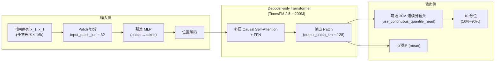

`google-research/timesfm`（**Apache-2.0**，2026-06-25 时约 25.5k Stars / 2.4k Forks，2024-04 创建）不是又一个 PyTorch 时序库，而是把 NLP 的"基础模型 + 零样本"路径搬到时序预测上的开源版本。对应的论文 [*A decoder-only foundation model for time-series forecasting*](https://arxiv.org/abs/2310.10688) 已经被 ICML 2024 收录，仓库是 Google 维护的 open reference，2.5 是当前发布版。

下面回答的不是"TimesFM 能不能预测"，而是四个工程问题：

- patched-decoder 自回归架构到底怎么把一组连续时间点变成 token，又怎么把 token 解码回序列
- 2.5 相对 2.0 把参数砍到 200M、把 context 拉到 16k，背后换掉了什么
- 推理 API 的几个关键 flag（`force_flip_invariance` / `infer_is_positive` / `fix_quantile_crossing` / `use_continuous_quantile_head`）为什么不能默认全开
- 在 Monash、llmtime(ZS) 这些公开榜单上的对比到底能推出什么、不能推出什么

## 一句话判断

TimesFM 的核心是 **decoder-only transformer + patch token + 不等长输入/输出 patch**：

- 序列被切成 patch（连续时间点组成的"组"），每个 patch 当作一个 token
- 一个带残差的 MLP 把 patch 投影成 transformer 接受的向量，再加上位置编码
- decoder 用 causal self-attention 自回归地预测后续 patch
- **输出 patch 长度可以大于输入 patch 长度**（例如 input=32, output=128），这是它比"逐点 token 化"模型少走 N 步生成、累计误差更小的关键

200M 参数、16k context、Apache-2.0 的 TimesFM 2.5 是当前开源时序 FM 的事实标杆之一——但它**不是** Prophet/Nixtlaa 那种通用 ARIMA 替代品，也不是 DeepAR/PatchTST 那种 per-dataset 精调模型。它的真正价值在 **zero-shot**：拿到一条新序列就能直接出预测，跳过训练-验证循环。

## 系统地图：patch、decoder、量化头三件套



| 组件 | 关键设计 | 工程含义 |
|------|---------|---------|
| Patch token 化 | input_patch_len=32（典型值）| 把序列切成 token，注意力序列长度从 T 变成 T/32 |
| 残差 MLP 编码 | 一个带残差的 MLP 块把 patch → token 向量 | 模型必须自己学会 patch 内的局部形态 |
| Causal decoder | decoder-only + causal mask | 一次前向出整段 future patch，自回归分块延展 |
| 不等长输出 patch | output_patch_len > input_patch_len | 长 horizon 任务里生成步数从 O(H) 降到 O(H/output_patch_len) |
| 可选分位头 | 30M 连续分位头，最长 1k horizon | 不开它就只输出点预测；开它能拿到 10 个分位 |
| XReg（2.5 新增）| 协变量回归分支 | 把已知的未来协变量（促销、价格、日历）接进预测 |

> **关键设计权衡**：input_patch_len 和 output_patch_len 是工程上最值得调的超参。input 太小则 patch 内"看不见"局部形态，output 太小则长 horizon 累计误差变大。TimesFM 2.5 公开的 pretrained checkpoint 默认 input=32、output=128，对绝大多数业务序列已经够用。

## 模型家族：从 1.0 到 2.5

仓库 README 直接给了演进路线：

| 版本 | 参数 | Context | 输出 | 备注 |
|------|------|---------|------|------|
| TimesFM 1.0 | — | — | — | 已归档到 `v1/`，`pip install timesfm==1.3.0` 加载 |
| TimesFM 2.0 | 500M | 2048 | 点预测 | 上一代主力 |
| **TimesFM 2.5**（当前）| **200M** | **16k** | 点预测 + 可选 30M 连续分位头 | 2025-09-15 发布 |
| TimesFM 2.5 + Flax | 200M | 16k | 同上 | Flax/JAX 实现，TPU/GPU 推理更快 |

2.5 相对 2.0 是一次**反向瘦身**——参数从 500M 砍到 200M，但 context 从 2048 拉到 16k，同时新增可选的连续分位头。背后是论文里的两个观察：

1. **更长的 context 比更多的参数更划算**：时序预测的信号量来自"我见过更长的历史"，而不是来自"我有更多的层"。
2. **分位预测和点预测可以解耦**：把分位做成一个可选的 30M 头，只在你需要时挂载，推理成本可控。

除此之外，2.5 还去掉了 `frequency` 指示器（模型自己学），新增了 `force_flip_invariance` / `infer_is_positive` / `fix_quantile_crossing` 几个推理 flag（见下文）。2.5 之后又陆续补全了 Flax 实现、XReg 协变量支持、LoRA 微调样例（`timesfm-forecasting/examples/finetuning/`）和 `SKILL.md`。

## 推理代码：完整最小可运行示例

下面这段代码直接来自 README，跑完会得到 `point_forecast.shape == (2, 12)`、`quantile_forecast.shape == (2, 12, 10)`。`from_pretrained` 会从 HuggingFace Hub 下载 `google/timesfm-2.5-200m-pytorch`。

```python
import torch
import numpy as np
import timesfm

torch.set_float32_matmul_precision("high")

# 1. 加载 pretrained
model = timesfm.TimesFM_2p5_200M_torch.from_pretrained(
    "google/timesfm-2.5-200m-pytorch"
)

# 2. 配置推理参数
model.compile(
    timesfm.ForecastConfig(
        max_context=1024,                  # 最大回看窗口
        max_horizon=256,                   # 单次最长预测步
        normalize_inputs=True,             # 输入做均值/方差归一化
        use_continuous_quantile_head=True, # 启用 30M 连续分位头
        force_flip_invariance=True,        # 翻转对称性增强（见下）
        infer_is_positive=True,            # 输出非负约束
        fix_quantile_crossing=True,        # 分位单调修复（见下）
    )
)

# 3. 一次性提交多条序列
point_forecast, quantile_forecast = model.forecast(
    horizon=12,
    inputs=[
        np.linspace(0, 1, 100),         # 线性序列
        np.sin(np.linspace(0, 20, 67)), # 正弦序列
    ],
)
# point_forecast.shape    # (2, 12) — 两条序列各 12 个点的点预测
# quantile_forecast.shape # (2, 12, 10) — 10 个分位（10% ~ 90%）
```

### 几个 flag 到底在做什么

| Flag | 作用 | 何时关掉 |
|------|------|---------|
| `force_flip_invariance` | 把序列翻转后再次预测，平均两次结果 | 序列本身有方向语义（异常检测、自回归式累积量） |
| `infer_is_positive` | 在数值域强制输出 ≥ 0 | 序列可能为负（股价残差、温差、净利润） |
| `fix_quantile_crossing` | 修复 10% > 50% 这类分位穿越 | 你想要原始预测分布、不要单调约束时 |
| `use_continuous_quantile_head` | 启用 30M 分位头（多 ~15% 显存）| 只需要点预测、不在乎不确定性时 |

安装：

```bash
# PyTorch
pip install timesfm[torch]
# Flax/JAX
pip install timesfm[flax]
# 需要协变量回归
pip install timesfm[xreg]
```

2026-06-05 仓库把 PyPI 版本号刷到了 `timesfm==2.0.0`，对应仓库的 2.5 pretrained checkpoint。

## benchmark 拆解：能验证什么、不能验证什么

### Monash Forecasting Archive

TimesFM 论文的 zero-shot 主战场是 Monash——一个聚合了 tens of thousands of time-series 的开源集合，频率从分钟级到年级，领域覆盖流量、天气、需求、能源等。论文用 **MAE scaled**（一种把不同尺度的 MAE 归一化到可比区间的指标）做跨数据集平均，结论是：

> Zero-shot TimesFM beats most supervised approaches, including recent deep learning models.

具体到论文图里的代表性对比：

| 方法 | 类型 | 备注 |
|------|------|------|
| ARIMA / ETS | 统计基线 | TimesFM 显著好 |
| DeepAR / PatchTST 等 | 有监督深度模型（per-dataset 训练）| TimesFM zero-shot 接近或反超 |
| llmtime(ZS)（GPT-3.5 + 特殊 prompt）| LLM prompting baseline | TimesFM 用 200M 参数打赢 |

### llmtime(ZS) 对照

这是论文里最值得拎出来的一组对照：把 GPT-3.5 当 base、用 Gruver 2023 提出的 llmtime prompting 把时序编码成文本前缀，喂给 LLM 出预测。TimesFM 200M 在这个对比里赢——这说明：

- 时序预测不一定需要 LLM 级别的语义理解
- 一旦模型见过 100B 时间点的预训练分布，专用 patched-decoder 比通用 LLM 更高效

### 不能从 benchmark 推出的结论

读 TimesFM 的 benchmark 时要小心三件事：

1. **MAE scaled 是跨集合平均，对单一长尾序列可能不友好**。如果你的业务序列落在 Monash 没覆盖的分布（例如高频金融 tick、罕见故障信号），零样本预测误差会比 Monash 报告的高很多。
2. **没有显式外生变量**。Monash 大多是单变量，没有把促销、价格、日历这种已知协变量喂进去——2.5 新加的 XReg 才是把这块补上。
3. **短 horizon 场景没有详细 ablation**。TimesFM 优化目标是"长 horizon + 长 context"，对极短 horizon（≤8 步）的小数据集，简单的 ETS / 朴素季节性经常更稳。

## 落地路径：从 PyPI 到 Google Cloud

README 把 TimesFM 的落地切成了三档：

| 场景 | 入口 | 关键差异 |
|------|------|---------|
| 研究 / 内部工具 | `pip install timesfm[torch]` + HuggingFace | 完全本地，权重从 `google/timesfm-2.5-200m-pytorch` 下载 |
| SQL 数据团队 | BigQuery ML `TIMESFM` 模型 | SQL 调预测，规模化与可靠性由 BigQuery 兜底 |
| 日常表格 | Google Sheets "Connected Sheets" + BigQueryML + TimesFM | 2026-02 已上线（[Workspace 更新日志](https://workspaceupdates.googleblog.com/2026/02/forecast-data-in-connected-sheets-BigQueryML-TimesFM.html)） |
| Agent 化调用 | Vertex Model Garden | 容器化 endpoint，可被 AI agent 通过工具调用 |

仓库 README 显式声明 "This open version is not an officially supported Google product."——`pip install timesfm` 装到的是参考实现，SLA、运维、长期维护都由自家工程负责。

## 微调与协变量：两个值得留意的增量

### 1. LoRA 微调样例（2026-04-09）

`timesfm-forecasting/examples/finetuning/` 用 HuggingFace Transformers + PEFT 把 TimesFM 2.5 接到 LoRA 上。这条路径解决的是 Monash 不覆盖的领域适配：load pretrained → 在你的业务序列上跑少量 epoch → 用 LoRA 增量保存。这是最贴近"我有一条特殊曲线，零样本不够准"场景的官方入口。

### 2. XReg 协变量回归（2025-10-29）

2.5 加回了 XReg——一个把**已知未来协变量**（促销日历、价格、节假日标记）接进预测的分支。它的语义是："预测销量时，模型已经知道下周有促销和周末"。这是把 TimesFM 从纯单变量推向"带条件信息的多变量"的关键升级，pip 装 `timesfm[xreg]` 即用。

## 采用建议

**适合用 TimesFM 的场景**：

- 业务上有成百上千条短-中长度（≤16k context）的时序，每条单跑一个 per-dataset DL 模型不划算
- 你想要 zero-shot 基线，作为后续精调或专用模型的对照
- 你的部署环境允许加载 PyTorch 或 Flax 权重、能从 HuggingFace 下载
- 你需要带分位的不确定性预测（连续分位头在 1k horizon 内直接用）

**谨慎评估的场景**：

- 序列长度 > 16k 或频率极不规则：2.5 context 是 16k，超出需要自己分块或重新训练
- 强外生依赖（"没有这个促销日历模型完全错"）：确保 XReg 入口够用，否则考虑传统监督模型
- 极低延迟（毫秒级、十万 QPS）：200M 模型 + 自回归分块生成不是为这个设计的，回到专精模型或蒸馏

**实践建议**：

1. 先 `pip install timesfm[torch]` + `from_pretrained` 跑通零样本基线
2. 用 `force_flip_invariance + infer_is_positive + fix_quantile_crossing` 这三个"无脑开"的 flag，对绝大多数业务序列有稳定性收益
3. 如果有已知未来协变量，迁移到 `timesfm[xreg]` 走 XReg 分支
4. 如果零样本误差离目标差 5%~15%，试 LoRA 微调（`examples/finetuning/`），不要直接全参数精调
5. 在生产里把 TimesFM 当**基线 / 第一道闸口**，不要把它当唯一模型——它的最大价值是"零样本快速出预测"，不是"在所有场景都赢专精模型"

## 一处容易踩坑的地方

README 的 `Code Example` 跑完之后拿到的是 `(batch, horizon)` 和 `(batch, horizon, 10)` 的张量——`quantile_forecast` 的最后一维是 **mean + 10th..90th 共 10 个分位**，不是 9 个分位。文档里这行注释 `mean, then 10th to 90th quantiles` 不起眼，写消费端时容易按"9 个分位"索引，结果错位一格。

如果你的下游只关心中位数，用 `quantile_forecast[..., 5]`（含 mean 在内第 6 个，对应 50% 分位）。如果想拿 P10/P50/P90 三个分位做风险区间，记住索引是 `[1, 5, 9]` 而不是 `[0, 4, 8]`。

## 参考

- 仓库：`https://github.com/google-research/timesfm`
- 论文：[arXiv:2310.10688](https://arxiv.org/abs/2310.10688)（ICML 2024）
- 权重：[HuggingFace `google/timesfm-2.5-200m-pytorch`](https://huggingface.co/collections/google/timesfm-release-66e4be5fdb56e960c1e482a6)
- 官方博客：[A decoder-only foundation model for time-series forecasting](https://research.google/blog/a-decoder-only-foundation-model-for-time-series-forecasting/)
- Monash 数据集：[Monash Forecasting Archive](https://forecastingdata.org/)