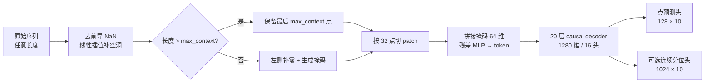

仓库顶部现在写的是 `Latest Model Version: TimesFM 3.0`，PyPI 最新包 `timesfm==3.0.2` 发布于 2026-09-09，2.5 被移到 "Archived Model Versions" 下面。

比版本号更要紧的是许可。3.0 的预训练权重改用 `timesfm-non-commercial-license-v1.0`，仓库代码仍是 Apache-2.0，2.5 及更早的权重也仍是 Apache-2.0。这条线直接改变了选型问题的形状：不再是"3.0 比 2.5 准多少"，而是"我的场景允许我上 3.0 吗"。

`google-research/timesfm` 建于 2024-04-29，2026-09-19 计 33,127 Stars、3,188 Forks。对应的论文 [*A decoder-only foundation model for time-series forecasting*](https://arxiv.org/abs/2310.10688) 收录于 ICML 2024，README 里就标着这个出处。

本文的结构常量、默认值和函数签名都对着 master 分支读过（HEAD `e31dadd`，提交于 2026-09-15）；参数量、许可与下载数取自 Hugging Face Hub 与 PyPI 的接口返回。文中每处文件位置都可直接复核。

## 一句话判断

TimesFM 做的事是把 NLP 的"预训练 + 零样本"路径搬到时序预测上：一条没见过的序列，不进训练循环，直接出预测值和分位区间。

2.5 是这条路径上目前唯一还能自由商用的版本。3.0 在三个公开榜单拿下头名，也原生支持了多变量和协变量，但默认权重只能用于测试、评估和研究。仓库里同时放着两代实现，两条 API（应用程序接口）都还在同一个 PyPI 包里，这一点很容易被忽略。

架构侧没有剧烈变动。两代都是 patched decoder-only Transformer 架构，都是 20 层、1280 维。变的是 patch 长度的取法、解码是否自回归，以及 3.0 新加的一条变量轴注意力。

## 半年之间发生了什么

README 的更新记录和 PyPI 的发布时间能拼出一条准确时间线：

| 日期 | 事件 | 来源 |
|------|------|------|
| 2025-09-15 | TimesFM 2.5 发布：参数 500M→200M，context 2048→16k，新增可选 30M 分位头，去掉 `frequency` 指示器 | README |
| 2025-10-29 | 2.5 补回协变量支持，走 XReg | README |
| 2026-03-19 | 加入 `AGENTS.md` 与 `timesfm-forecasting/SKILL.md` | README |
| 2026-04-09 | 加入 LoRA（低秩适配）微调样例与 `tests/` | README |
| 2026-06-05 | PyPI 版本跳到 `timesfm==2.0.0`（模型仍是 2.5） | PyPI |
| 2026-07-02 | PyPI 更新到 `timesfm==2.0.2` | README、PyPI |
| 2026-08 | TimesFM 3.0 发布，权重改用非商用许可 | README |
| 2026-08-28 / 09-02 / 09-09 | PyPI 依次发布 3.0.0、3.0.1、3.0.2 | PyPI |

这里有一个坑值得单独说：**包版本号和模型版本号不是一回事**。`timesfm==2.0.x` 装的是 2.5 模型的代码，`timesfm==3.0.x` 才是 3.0。想复现别人写的 `pip install timesfm==2.0.0`，得到的不是 TimesFM 2.0 模型，而是 2.5。真正的 1.0/2.0 模型代码走另一条路：README 建议装更早的 `timesfm==1.3.0`（2025-07-06 发布），再去加载归档在 `v1/` 下的权重。

## 仓库目录分成五块

读代码前先认清位置，两代实现互不在同一个 import 名下：

| 目录 | 内容 | 什么时候要读 |
|------|------|-------------|
| `src/timesfm/` | 2.5 实现（`timesfm_2p5/`）、torch 与 flax 两套层、`utils/xreg_lib.py` | 跑 2.5、调推理 flag、用 XReg |
| `src/timesfm3/` | 3.0 实现，下分 `torch/` 与 `mlx/` 两个后端 | 跑 3.0、多变量与协变量 |
| `v1/` | 1.0 与 2.0 的归档代码和 notebook | 只在复现旧论文数字时 |
| `timesfm-forecasting/` | 对外发布的 Agent Skill（智能体技能包）：`SKILL.md`、`references/`、`examples/`、`scripts/` | 想让智能体调用，或查内存预算 |
| `timesfm3-usage/` | 3.0 的 benchmark 运行脚本与结果 CSV | 核对榜单数字 |

一个 PyPI 包同时提供 `import timesfm` 和 `import timesfm3` 两个入口（`pyproject.toml` 的 `packages.find` 指向 `src`）。`src/timesfm3/__init__.py` 用 PEP 562 的 `__getattr__` 做惰性重导出，因此只装 MLX 后端时不必安装 PyTorch。

## patch 怎么变成 token

时序模型面对的第一个问题是 token（词元）化。逐点切会让注意力序列长度等于历史长度，16k 点的 context 根本算不动。TimesFM 的答案是 patch：连续若干个时间点打包成一个 token。

2.5 的具体数值写在 `src/timesfm/timesfm_2p5/timesfm_2p5_base.py:87` 的 `TimesFM_2p5_200M_Definition` 里：

```python
context_limit      = 16384
input_patch_len    = 32
output_patch_len   = 128
output_quantile_len = 1024
quantiles          = [0.1, 0.2, 0.3, 0.4, 0.5, 0.6, 0.7, 0.8, 0.9]
decode_index       = 5
```

| 组件 | 配置 | 出处 |
|------|------|------|
| 输入 patch | 32 点 / token | 同上 |
| 分词器（tokenizer） | 残差块，输入 64 → 隐层 1280 → 输出 1280，swish 激活，带 bias | `tokenizer` 字段 |
| 主干 | 20 层，`model_dims=1280`，16 头，RMSNorm，QK-norm，RoPE，swish，`fuse_qkv=True` | `stacked_transformers` |
| 点预测头 | 1280 → 1280 → 1280（即 128 步 × 10 个槽位） | `output_projection_point` |
| 连续分位头 | 1280 → 1280 → 10240（即 1024 步 × 10 槽位），可选挂载 | `output_projection_quantiles` |

输入维度是 64 而不是 32，原因在 `timesfm_2p5_torch.py:92`：

```python
tokenizer_inputs = torch.cat([inputs, masks.to(inputs.dtype)], dim=-1)
```

32 维数值后面拼了 32 维掩码。短序列左侧补的零会被明确告知模型，所以调用方不用自己补齐长度。这个字段虽然叫 tokenizer，干的却是把 patch 投影成向量的活，和文本分词没有关系。

输入 patch 32、输出 patch 128 这个不对称是关键设计：一次前向吐出 128 步，而不是一步一步往外爬。预测 512 步只需 4 次分块生成，逐点模型需要 512 次，累计误差的差距就在这里。

3.0 的对应默认值换成了 `input_patch_len=32`、`output_patch_len=64`（`src/timesfm3/torch/model.py:61`），并加了一条约束：输出 patch 必须是输入 patch 的整数倍，否则构造时报 `ValueError`。分位列表沿用 9 个，`num_quantiles` 连点预测凑成 10。


```mermaid
flowchart LR
  A["原始序列<br/>任意长度"] --> B["去前导 NaN<br/>线性插值补空洞"]
  B --> C{"长度 > max_context?"}
  C -->|是| D["保留最后 max_context 点"]
  C -->|否| E["左侧补零 + 生成掩码"]
  D --> F["按 32 点切 patch"]
  E --> F
  F --> G["拼接掩码 64 维<br/>残差 MLP → token"]
  G --> H["20 层 causal decoder<br/>1280 维 / 16 头"]
  H --> I["点预测头<br/>128 × 10"]
  H --> J["可选连续分位头<br/>1024 × 10"]
```

## 2.5 逐块回喂，3.0 一次前向铺满 horizon

预测步数超过 `output_patch_len` 时，两代的走法完全不同。这是读代码比读 README 值钱的地方。

2.5 是块自回归。`timesfm_2p5_torch.py:120` 起：

```python
num_decode_steps = (horizon - 1) // self.o        # o = 128
last_renormed_output = renormed_outputs[:, -1, :, self.aridx]
new_patched_input = torch.reshape(last_renormed_output, (batch_size, self.m, self.p))
```

`self.m = self.o // self.p`，即 4。上一轮 128 步里的第 5 槽被取出，重排成 4 个 32 点的新 patch，再接着走一轮，KV 缓存继续累积。`self.aridx` 就是 `decode_index = 5`，也就是中位数。取中位数而不是均值，代码里没写理由；从统计量本身看，中位数对极端值更不敏感，长 horizon 下更不容易被一次离群预测带偏——这层推断属于本文，不属于仓库。

值得注意的代价在 `update_running_stats` 那几行：RevIN 的均值和方差会用**生成出来的**点继续更新。所以第 3 块之后的归一化基准，已经建立在模型自己的输出之上。误差不是纯粹累加，它会顺着归一化统计量一起往后传。

3.0 不做这种回喂。`src/timesfm3/torch/model.py:599` 起，`decode()` 把 horizon 也补成若干 patch，与 context 拼成一条序列，打上 `horizon_cpm_mask`（context 为 `False`、horizon 为 `True`），然后**只调用一次 `forward()`**（同文件 605 行），再从 `logits` 里按位置切出预测段：

```python
forward_out = self.forward(inputs, freeze_after=freeze_after,
                           patch_cpm_mask=horizon_cpm_mask, ...)
logits = forward_out["logits"]        # (b, v, n, output_patch_len, num_quantiles)
```

代价因此换了方向：序列长度变长，注意力开销随 context + horizon 一起涨；换来的是没有回喂环路，误差不经过"生成的点再当输入"这条路。`use_frozen_running_stats=True` 时 `freeze_after = num_context_patches - 1`，归一化统计量停在 context 边界，不再被 horizon 段影响。默认值是 `False`。

长 horizon 的拼接靠 `use_stitching`（默认 `True`）。`input_patch_len=32`、`output_patch_len=64` 时，每个预测 patch 取前 64 个点，相邻 patch 重叠 32 点，由 `stitch_patches` 按 32 的步长接起来。关掉 stitching 就退化成每隔 `rolls = o // p = 2` 个 patch 取一整块 64 点。

3.0 还有一层 `use_linear_detrending`：context 先减掉线性趋势，出预测后再把外推的趋势加回去（`horizon_logits + trend_forecast`）。触发条件由 `linear_detrending_threshold=0.5` 控制，也就是趋势量级相对序列够大时才启用。

3.0 的默认开关一览：

| 默认开关 | 取值 | 作用 |
|---------|------|------|
| `use_variate_attention` | `True` | 在变量轴上做注意力，多变量的来源 |
| `use_stitching` | `True` | 相邻输出 patch 留重叠再拼接，提取长度 `min(2 × input_patch_len, output_patch_len)` |
| `use_linear_detrending` | `True` | context 先去线性趋势，回预测时加回 |
| `use_iterative_cpm_revin` | `True` | 迭代式 RevIN 精修 |
| `use_frozen_running_stats` | `False` | 归一化统计量是否在 context 边界冻结 |
| `value_clip` | `1e20` | 输入绝对值裁剪 |

变量轴注意力的痕迹在主干类名上：`StackedMixingTransformer`，配 `TransformerConfig` 里分开的两条 RoPE——`use_rope_seq`（时间轴）与 `use_rope_var`（变量轴），`max_variates` 上限 32。张量形状因此多出一轴。

context 上限反而降了。2.5 是 16,384，3.0 是 15,360，这个数字来自 `src/timesfm3/torch/timesfm3_forecaster.py:32` 的 `_MAX_CONTEXT_LENGTH`。MLX 后端与它保持一致，并有测试断言两侧同为 15360。超长部分按 README 的说法截断到最近的点。

## 模型家族：参数与 context 的真实数字

`timesfm-forecasting/references/api_reference.md` 给了检查点清单，Hugging Face Hub 的接口给出张量实际参数量。两者放一起看更有用：

| 模型 | 标称参数 | safetensors 实测 | context | 后端 | 权重许可 |
|------|---------|-----------------|---------|------|---------|
| TimesFM 1.0 | 200M | — | 2,048 | JAX / PyTorch | Apache-2.0 |
| TimesFM 2.0 | 500M | — | 2,048 | JAX / PyTorch | Apache-2.0 |
| TimesFM 2.5 | 200M | 231,289,280 | 16,384 | PyTorch / Flax / Transformers | Apache-2.0 |
| TimesFM 3.0 | 330M | 330,710,976 | 15,360 | PyTorch / MLX | Non-Commercial v1.0 |

"200M" 是产品名，2.5 的检查点里实际有 2.31 亿个参数。LoRA 样例的 README 也写着 "~1.4M out of ~232M"，两处对得上。

2.0→2.5 那次瘦身常被解读成"小模型打赢大模型"。更准确的说法是：参数量从 500M 降到 200M，同时 context 从 2048 涨到 16k。模型容量从"更深的层"换成了"更长的回看窗口"。时序信号的量更多来自历史长度，而不是层数。README 只列了结果，没给出这组对比的误差数字，所以这句话只能当作设计取向，不能当作实测结论。

1.0→2.0 反而是加长（200M→500M）、context 不变（都是 2048），2.5 才转向。这条路线不是单调的"越大越好"或"越小越好"。

## 跑通一次零样本推理

2.5 这条路径在当前包（`timesfm==3.0.2`）里仍然可用，`src/timesfm/__init__.py` 仍导出 `TimesFM_2p5_200M_torch` 和 `ForecastConfig`，导入被 `try/except ImportError` 包住，所以需要装 `[torch]`。

```bash
pip install timesfm[torch]
```

```python
import torch
import numpy as np
import timesfm

torch.set_float32_matmul_precision("high")

model = timesfm.TimesFM_2p5_200M_torch.from_pretrained(
    "google/timesfm-2.5-200m-pytorch"
)

model.compile(
    timesfm.ForecastConfig(
        max_context=1024,
        max_horizon=256,
        normalize_inputs=True,
        per_core_batch_size=32,
        use_continuous_quantile_head=True,
        fix_quantile_crossing=True,
    )
)

point_forecast, quantile_forecast = model.forecast(
    horizon=12,
    inputs=[
        np.linspace(0, 1, 100),
        np.sin(np.linspace(0, 20, 67)),
    ],
)
# point_forecast.shape     -> (2, 12)
# quantile_forecast.shape  -> (2, 12, 10)
```

上面这段与 `api_reference.md` 的 `compile()` 示例一致，字段名逐个对着 `src/timesfm/configs.py` 核过。`force_flip_invariance` 和 `infer_is_positive` 没写，因为它们默认就是 `True`。这个配置也正好是仓库自己给的三档硬件建议共用的那组开关。

安装 extras 有四个，写进 `pyproject.toml`：`torch`、`mlx`、`flax`、`xreg`。`requires-python` 是 `>=3.10`。

## 四个 flag 在代码里做什么

`ForecastConfig` 有十个字段，默认值集中在 `src/timesfm/configs.py:51` 起：

| 字段 | 默认值 | 语义 |
|------|-------|------|
| `max_context` | `0` | 批推理时使用的回看窗口，短于此长度补零，长于此长度截断 |
| `max_horizon` | `0` | 编译后的解码函数能直达的最远步 |
| `normalize_inputs` | `False` | 是否做均值/方差归一化（RevIN） |
| `per_core_batch_size` | `1` | 每设备批大小 |
| `use_continuous_quantile_head` | `False` | 挂上 30M 分位头，规避分位塌缩 |
| `force_flip_invariance` | `True` | 把尺度不变性扩展到负系数 |
| `infer_is_positive` | `True` | 输入非负时保证输出非负 |
| `fix_quantile_crossing` | `False` | 修复分位穿越 |
| `return_backcast` | `False` | 返回回测段，XReg 需要 |
| `window_size` | `0` | 分解预测的窗口，源码里标着 `TODO`，尚未实现 |

**`force_flip_invariance`**：`configs.py` 里的文档字符串（docstring）写得很清楚。TimesFM 默认保证 `TimesFM(aX + b) = a·TimesFM(x) + b` 对 `a ≥ 0` 成立，这个 flag 把它扩展到 `a < 0`。实现上（`timesfm_2p5_flax.py:408`）对取负翻转后的序列再走一遍解码，再按 `(正向 − 翻转)/2` 合并点预测和分位跨度。代价是多一次解码。仓库没写什么场景不该开；从机制看，序列本身有方向语义时（单调累积量、异常检测）这条对称假设不成立，该关掉。

**`infer_is_positive`**：实现只有两行——先算 `is_positive = jnp.all(inputs >= 0)`，最后 `where(is_positive, maximum(forecast, 0), forecast)`（`timesfm_2p5_flax.py:359` 与末尾）。判定是逐条序列做的，且要求**整段 context 全部非负**。所以对本身会转负的序列（价差、净利润、温度异常）它自动不生效，不存在"强制非负把负值抹平"这件事。真正需要关的场景是那种历史全为正、但预测合法地会跌破零的序列，例如贴着零轴波动的库存差值。

**`fix_quantile_crossing`**：`timesfm_2p5_flax.py:329` 的做法是以第 5 槽（中位数）为锚，向下对槽位 1..4 取累积最小值、向上对 6..9 取累积最大值，从而强制单调。默认关闭。要的是"不改动原始分位"还是"区间不能反着包"，就按这个取舍开关。仓库给硬件三档示例时把它打开了。

**`use_continuous_quantile_head`**：`_use_continuous_quantile_head_fn`（同文件 308 行）不再用点预测头那 128 步的分位，而是从分位跨度张量里以第 5 槽为基准重算 10 条分位线，一次覆盖到 `max_horizon`。docstring 给的动机词是 "avoid quantile collapsing"。它对应那个可选的 30M 头，最远到 1k horizon（`output_quantile_len = 1024`）。不开时，超过 128 步的分位要靠上一节的块自回归拼出来，那条路径上的分位塌缩正是这个头要规避的。

这里有个容易踩的不一致：`api_reference.md` 的 `compile()` 示例把四个 flag 全设成 `True`，而 `configs.py` 的默认是 `fix_quantile_crossing=False`、`use_continuous_quantile_head=False`，`system_requirements.md` 的三档示例又只开后两个加 `normalize_inputs`。同一份仓库给出三种组合，输出的分位数不是同一回事。三处文档都没有说明差别在哪。

## 输出张量的 10 个槽位

`forecast()` 返回两个值。第二维为 10 的 `quantile_forecast` 是最容易读错的地方。

| 槽位 | 含义 |
|------|------|
| `[..., 0]` | 均值 |
| `[..., 1]` … `[..., 9]` | P10、P20 … P90 |
| `[..., 5]` | 中位数 |

`api_reference.md` 的 Output Shape Reference 明确写着 `quantile_forecast[:,:,5]` 是 "50th percentile (= point_forecast)"。代码里能直接印证：`timesfm_2p5_torch.py:513` 的返回语句是 `return full_forecast[..., 5], full_forecast`。

**第一个返回值 `point_forecast` 是中位数，不是均值。** 想要均值，取 `[..., 0]`。这个命名很容易误导，写消费端时按 `mean = quantile_forecast[..., 0]` 显式取。

要 P10/P50/P90 做库存区间，索引是 `[1, 5, 9]` 而不是 `[0, 4, 8]`：

```python
p10 = quantile_forecast[..., 1]
p50 = quantile_forecast[..., 5]   # 与 point_forecast 相同
p90 = quantile_forecast[..., 9]
mean = quantile_forecast[..., 0]
```

3.0 的接口把这件事理顺了：`predict()` 返回的 `ForecastOutput` 里 `.forecast` 形状 `(H,)` 或 `(V, H)`、`.quantiles` 形状 `(H, 9)`，均值槽位不再是隐式的第一列。README 的 MLX 示例注释与 `src/timesfm3/mlx/timesfm3_forecaster_test.py:88` 都写作 "9 deciles"。从 2.5 迁到 3.0，这段索引代码必须重写。

## 传进去之前，序列先被处理过

`src/timesfm/timesfm_2p5/timesfm_2p5_base.py:170` 起的循环是每条输入都会经过的路径，三件事在用户看不见的地方发生：

1. `strip_leading_nans` 去掉前导缺失，再 `linear_interpolation` 把中间空洞线性插平。所以传 NaN 不会报错，模型会替你补。
2. 长度超过 `max_context` 时执行 `value[-context:]`——**丢掉最老的历史**，不报错。
3. 长度不足时在左侧补零，同时生成布尔掩码标记补的位置，掩码随 patch 一起进 tokenizer。

批内凑不齐 `global_batch_size` 的余数，会用长度为 3 的全零假序列补齐，返回前再切回 `[:num_inputs]`。

第 2 条对高频数据是实质约束。`max_context=1024` 配 5 分钟粒度只能看到约 3.5 天，跨年季节性完全落不进窗口。要长历史就把 `max_context` 提到 4096 或 16384，代价见内存公式一节。

## XReg：2.5 的协变量是一条外挂回归

2.5 的协变量支持容易从名字误解成网络内的一个分支。实际是：`forecast_with_covariates()`（`timesfm_2p5_base.py:199`）先做一个批内线性回归，再把残差交给 TimesFM。

```python
point_outputs, xreg_outputs = model.forecast_with_covariates(
    inputs=series,
    dynamic_numerical_covariates={"price": price_hist_plus_future},
    dynamic_categorical_covariates={"promo": promo_flags},
    static_numerical_covariates={"store_area": areas},
    static_categorical_covariates={"region": regions},
    xreg_mode="xreg + timesfm",
    ridge=0.1,
)
```

四类协变量各自成字典：动态数值、动态类别、静态数值、静态类别。动态类别与静态类别接受 `int | str`。

`xreg_mode` 两取一，docstring 写得很直白：

- `"xreg + timesfm"`（默认）：先用 XReg 拟合目标，再用 TimesFM 预测残差
- `"timesfm + xreg"`：先让 TimesFM 出预测，再对它的残差拟合 XReg

三条使用约束需要单独记住：

- **前置条件**：`ForecastConfig.return_backcast` 必须为 `True`，否则直接抛 `ValueError`。
- **依赖**：`timesfm[xreg]` 装的是 `jax[cuda]` 与 `scikit-learn`。也就是说即便主干跑 PyTorch，协变量这条路仍会把 JAX 拉进环境。
- **正则默认关**：`ridge` 默认 `0.0`，`max_rows_per_col` 默认 `0`。协变量列数接近序列长度时，不做正则的线性拟合会把噪声当信号，实际用建议显式给一个正的 `ridge`。

返回是两个列表：模型输出与 XReg 输出，可以分别看两条路各贡献了多少。类别协变量尽量给整数，docstring 明说字符串值会拖慢推理。

3.0 不再需要 XReg 这条路。协变量成为一等公民，分两类传入：`past_only_covariates` 形状 `(k, context_len)`，`past_future_covariates` 形状 `(k, context_len + horizon)`。语义差别在于后者需要提前知道未来值（促销日历、排产计划），前者不需要（气温、竞品流量）。

## 3.0 的原生多变量与协变量

```python
import numpy as np
from timesfm3 import TimesFM3Evaluator, ModelConfig

config = ModelConfig(
    checkpoint_path="google/timesfm-3.0-pytorch",
    per_core_batch_size=16,
    device="cuda",
)
forecaster = TimesFM3Evaluator(config)

context_len, horizon = 128, 24
target = np.random.randn(3, context_len).astype(np.float32)          # 3 个目标变量
past_only = np.random.randn(1, context_len).astype(np.float32)       # 1 条仅过去
past_future = np.random.randn(2, context_len + horizon).astype(np.float32)  # 2 条含未来

outputs = list(forecaster.predict_batch(
    contexts=[target],
    horizon=horizon,
    past_only_covariates=[past_only],
    past_future_covariates=[past_future],
    return_quantiles=True,
))
print(outputs[0].forecast.shape)    # (3, 24)
print(outputs[0].quantiles.shape)   # (3, 24, 9)
```

单变量走同一套接口，传 1D 数组即可，各条序列长度可以不等。

Apple silicon 有独立后端，不需要 PyTorch：

```bash
pip install timesfm[mlx]
```

```python
from timesfm3.mlx import TimesFM3Forecaster

forecaster = TimesFM3Forecaster.from_pretrained("google/timesfm-3.0-pytorch")
out = forecaster.predict(np.sin(np.linspace(0, 40, 512)).astype(np.float32),
                         horizon=128, return_quantiles=True)
```

README 给了两个后端之间的数值对齐误差，测试条件是 context 512。horizon 64 时，中位数与分位的最大绝对误差分别是 `9.5e-7` 和 `1.8e-6`；horizon 128 时是 `2.3e-6` 和 `2.7e-6`。多变量配协变量的路径对齐到 `1.7e-6`。README 说明更长的 horizon 会跨多个输出 patch，需要另测。

同文件还有一张吞吐表。条件是 330M 模型、M4 Max、context 512、horizon 64、fp32 加 `mx.compile`：批 1 的 p50 延迟 11.1 ms，折算 90 series/s；批 8 是 19.7 ms、406 series/s；批 32 是 48.1 ms、666 series/s。这是 README 里唯一的公开延迟数字，测的是单卡批推理吞吐，不是端到端服务延迟。

## benchmark：论文说了什么，仓库里放着什么

论文原文的说法需要照抄准确。arXiv:2310.10688 摘要里的措辞是：

> whose out-of-the-box zero-shot performance on a variety of public datasets comes close to the accuracy of state-of-the-art supervised forecasting models for each individual dataset

Google Research 博客的表述更进一步："can match or outperform powerful DL models like DeepAR, PatchTST that have been explicitly trained on the target time-series"。两句合起来才是准确结论：**零样本接近、部分场景追平或超过逐数据集训练的深度学习模型**。"全面击败有监督方法"这句话在两个来源里都不存在。

预训练语料常被误传成 Monash。官方博客给的是约 1000 亿个真实时间点，来源为 Google Trends 与 Wikipedia Pageviews，再混入合成序列。Monash Forecasting Archive 和 ETT 是**评测集**，不是训练集。这个区分正是"零样本"这个说法成立的前提。

3.0 换到三个新榜单上主张成绩，README 的三条自述是：

- fev-bench：100 个真实世界预测任务，总榜第一
- TIME Benchmark：50 个领域数据集、98 个评测任务，总榜第一
- GIFT-Eval：所有基础模型中第一

仓库确实放了结果文件：

| 文件 | 行数 | 内容 |
|------|------|------|
| `timesfm3-usage/benchmarks/fev_bench/fev_bench_results.csv` | 100 个任务 | 全部 `model_name = TimesFM-3`，`trained_on_this_dataset` 全为 `False`，`fev_version` 0.9.0，主指标 SQL |
| `timesfm3-usage/benchmarks/gift_eval/all_results.csv` | 97 个数据集 | 全部 `model = TimesFM-3`，按领域分布为 Energy 32、Web/CloudOps 20、Transport 15、Nature 15、Econ/Fin 6、Healthcare 5、Sales 4 |

读这张表要注意三件事：

1. **CSV 里没有对手行**。两份结果的 model 列都只有 TimesFM-3 一个值。"第一"来自外部榜单，不能靠这两个文件复算，它们能证明的只是自家逐任务表现。
2. **领域覆盖高度不均**。GIFT-Eval 97 个数据集里 Sales 只有 4 个，Energy 占了 32 个。拿它给零售销量场景定预期，抽样太薄。
3. **能直接算出来的一条**：把 fev 那 100 行的 MASE 取中位数是 0.87。MASE 小于 1 表示优于季节性朴素法。这是这批文件能给出的最硬的自查证据。

还有三条从 2.5 时代就成立、现在更要紧的保留意见。MAE scaled 一类的跨数据集平均会掩盖长尾序列。高频金融 tick 与罕见故障信号不在预训练分布里。极短 horizon（≤8 步）上 ETS 与朴素季节性常常更稳，而 TimesFM 的优化方向一直是长 context 加长 horizon。

## 微调：LoRA 样例的真实数字

`timesfm-forecasting/examples/finetuning/` 走的不是本仓库的 PyTorch 实现，而是 HuggingFace Transformers 路线。模型 ID 是 `google/timesfm-2.5-200m-transformers`，对应类 `TimesFm2_5ModelForPrediction`。装依赖用：

```bash
pip install transformers accelerate peft pandas pyarrow scikit-learn
python finetune_lora.py --epochs 20 --batch_size 64 --lr 5e-5 --lora_r 8
```

README 里三个默认值值得记：`--context_len 64`、`--horizon_len 13`、`--num_samples 5000`，默认数据集是零售销量（输出目录 `timesfm2_5-retail-lora`）。`target_modules="all-linear"` 配 `r=4` 时，可训练参数约 1.4M，占 232M 的 0.6%。

两个"不要"写在 README 的 Key Concepts 里：

- **不要在外面做归一化**。2.5 内部已有实例归一化（RevIN），再套一层会打架。这条与 `normalize_inputs` 那个 flag 不是一回事，后者控制的是解码前后的 RevIN。
- **不要固定窗口**。训练样本按 Chronos-2 的做法从序列里随机切 `(context, horizon)` 窗口，比每条序列固定一个窗口的数据利用率高。

`--num_samples` 默认 5000，指的是随机采多少个训练窗口，不是需要 5000 条序列。多少条序列才算够，取决于序列长度和要覆盖的窗口数，样例 README 没给这个映射关系，别把默认值当成数据量下限。

**许可上有个坑**。非商用许可把 "Derivative" 定义为包含 "customized, fine-tuned, retrained, or otherwise adapted version"。基于 3.0 权重训出的 LoRA 适配器（adapter）因此本身就是 Derivative，继承同一条限制。许可还明文禁止 Distribution。3.0 上跑通的微调成果，目前只能停在评估阶段。

## 算力预算与内存公式

`timesfm-forecasting/references/system_requirements.md` 给了一条估算式：

```text
RAM(GB) ≈ 模型权重 + 0.5 GB 运行时开销 + 0.2 MB × 序列条数 × context_length / 1000
```

2.5 权重约 800 MB（safetensors），连同 HF 缓存开销下载量约 1 GB。

但要提醒一句：这份文档的公式和它自己的 Quick Reference 表对不上。按公式算，1 万条序列、context 2048 是 5.3 GB；同一份文档的表里写的是 33 GB，差了六倍。100 条序列那一档两边还算得一致（公式 1.31，表 1.4）。批规模一大，只能按表里那个更悲观的数字留余量，别拿公式当准。

该文件列的四档硬件配置：

| 档位 | 硬件 | 批大小 | `max_context` | 官方速度 |
|------|------|-------|--------------|---------|
| Minimal | CPU，4–8 GB 内存 | 4 | 512 | 每 100 点序列 2–5 秒 |
| Standard | CPU 16 GB 或 GPU 4–8 GB | 32（CPU）/ 64（GPU） | 1024 | GPU 上每 100 点 0.5–1 秒 |
| Production | GPU 16 GB+ 或 Apple Silicon 32 GB+ | 128–256 | 4096+ | 每 100 点 0.1–0.3 秒 |
| Legacy | v2.0（500M）需 ≥16 GB 内存或 ≥8 GB 显存 | — | — | v1.0 JAX 版可能需 ≥32 GB 内存 |

GPU 显存随批大小缓增：批 32 约 1.2 GB，批 128 约 1.8 GB，批 256 约 2.5 GB。也就是说 2.5 这个量级在任何现代独显上都不是问题，内存压力主要来自批量吞吐。权重默认缓存在 `~/.cache/huggingface/`，可用 `$HF_HOME` 改位置。

这份文档有一处与代码不一致：它把 `huggingface_hub` 最低版本写为 0.23.0，而 `pyproject.toml` 要求 `>=0.28.0`。以 `pyproject.toml` 为准。同理，`api_reference.md` 的参数表把 `force_download` 写成默认 `True`，代码里 `_from_pretrained` 的形参默认是 `False`（`timesfm_2p5_torch.py:311`）。按文档表格的理解去排查"为什么每次都重下权重"会走偏。

## 出错了怎么排查

| 现象 | 原因 | 处理 |
|------|------|------|
| `RuntimeError: Model is not compiled` | `compile()` 之前调了 `forecast()` | 先 `model.compile(ForecastConfig(...))` |
| `torch.cuda.OutOfMemoryError` | 批太大 | 降 `per_core_batch_size`，或降 `max_context`，或分块喂 |
| `ValueError: inputs must be list` | 传了 ndarray | 包成 `[array]` |
| `HfHubHTTPError` | 下载失败 | 检查网络，把 `HF_HOME` 指到可写目录 |
| `ValueError: For XReg, return_backcast must be set to True` | 用协变量接口但没开回测 | 重新 `compile()` 时置 `return_backcast=True` |
| `ImportError: Failed to load the XReg module` | 没装 extras | `pip install timesfm[xreg]` |
| 预测值全为 0 或量级异常 | context 太短或输入尺度极端 | 打开 `normalize_inputs=True`，并核对 `max_context` |

前四行来自 `api_reference.md` 的 Error Handling，后三行对应源码里显式抛错的分支。

分块处理是仓库建议的第一招：

```python
CHUNK = 100
for i in range(0, len(inputs), CHUNK):
    point, quantiles = model.forecast(horizon=H, inputs=inputs[i:i + CHUNK])
```

上手前先跑 `timesfm-forecasting/scripts/check_system.py --num-series 1000 --context-length 1024 --batch-size 32`，它同时校验机器能不能装下模型、以及数据集是否落在支持范围内。SKILL.md 把这一步写成"首次使用必须先跑"。

## 采用建议：许可先于精度

按场景查表：

| 场景 | 建议 |
|------|------|
| 内部研究、离线评估、榜单复现 | 3.0；前提是结果不进商业决策、不对外交付 |
| 生产服务、面向终端用户、营收相关决策 | 2.5（Apache-2.0 权重），或走 BigQuery ML / Vertex 托管 |
| 需要多变量联合预测 | 3.0（评估用途）；2.5 那条路只能靠 XReg 拼协变量 |
| 单变量、要快、几百上千条序列 | 2.5，`pip install timesfm[torch]` 即可 |
| Apple Silicon 上做原型 | 3.0 + `timesfm[mlx]`，不需要 PyTorch |
| 极长历史（>16k 点） | 两代都不行，需要自己分块或换方案 |
| 毫秒级、高 QPS 在线打分 | 两代都是 200M–330M 的 20 层主干，不为这个设计 |

落地入口有四档：

- 自托管：`pip install timesfm[torch]` 加 HuggingFace 权重，一切自己扛
- [BigQuery ML](https://cloud.google.com/bigquery/docs/timesfm-model)：`TIMESFM` 模型类型，SQL 直接调用，规模化由 BigQuery 承担
- [Connected Sheets](https://workspaceupdates.googleblog.com/2026/02/forecast-data-in-connected-sheets-BigQueryML-TimesFM.html)：2026-02 上线，给日常表格用
- [Vertex Model Garden](https://console.cloud.google.com/vertex-ai/publishers/google/model-garden/timesfm)：容器化 endpoint，便于被智能体当作工具调用

后三条是 Google 一方产品，许可与支持条款由产品侧决定。许可文本自己就给这个区分留了位置："For customers accessing the TimesFM Model through our API, other terms and conditions may apply." 这是"3.0 权重不能商用"之外的一条绕行路径，值得在选型前先确认一次能不能走。

同一个许可对 "Non-Commercial Purpose" 的界定也值得照抄一遍：testing、evaluation 或 research，且 "not tied to commercial gain, production deployment, or revenue generation"；明确排除的三类是任何创收活动、与终端用户或生产系统的直接或间接交互、以及用模型去训练/微调/蒸馏其他模型供商用。内部基准测试和学术实验落在允许范围内，前提同样是结果不用于商业决策或客户交付。

README 底部一句话仍然成立："This open version is not an officially supported Google product." 从 `pip` 装来的是参考实现，服务等级协议、升级和长期维护都归你自己。

三步走顺序：先用 2.5 跑零样本基线，权重约 800 MB；不够准再按缺什么分岔，缺外生信息就走 XReg 或升 3.0 评估版，分布不匹配就试 LoRA；最后决定是留自托管 2.5，还是换成 BigQuery 那类一方服务。

## 常见问题

**能替代 Prophet 吗？** 定位不同。Prophet 面向单条序列、可显式加季节性分量和节假日回归项；TimesFM 吃长度，几百条上千条序列一次跑完，代价是丢掉可解释的系数。要一份能拿给业务方讲清楚"为什么这周涨了"的模型，两者都不是答案，那是 `statsmodels` 的活。SKILL.md 的 "Do not use this skill when" 列表里第一条就是它。

**200M 参数真的够？** 2.5 的 checkpoint 实际是 231,289,280 个参数，20 层、1280 维。够不够取决于任务。论文声称的是"接近逐数据集训练的 SOTA"，这不等于在任意单一数据集上都够。序列本身规律很强、而 16k 窗口又装不下一整段季节周期时，就要自己验。

**分位数可靠吗？** 分位头在预训练分布上校准，换到偏移较大的业务分布需要重新验证。SKILL.md 给的做法是把 q10–q90 当作 90% 置信区间，超出即视为异常。这是个可用技巧，不是校准保证。上线前用业务历史做一次覆盖率检查：真实值落在 q10–q90 内的比例应接近 80%。

**能用于金融高频吗？** 预训练语料是 Google Trends 与 Wikipedia Pageviews 加合成序列，粒度以分钟到天为主。tick 级序列不在其中。GIFT-Eval 里 Econ/Fin 只有 6 个数据集，也没有高频。要判断只能自己测，别引用榜单结论。

**`frequency` 参数去哪了？** 2.5 起取消，README 原文是 "gets rid of the `frequency` indicator"。模型改从 context 自身的尺度学频率，你不需要告诉它这是日数据还是小时数据。代价是也没法再靠这个参数注入领域知识。

**`torch_compile` 是什么？** 2.5 的 PyTorch 加载路径接受 `torch_compile=True`，命中后对 `model.forward` 做 `torch.compile`，并在日志里打 "Compiling model..."。首次调用有编译开销，长驻服务里划算，一次性脚本里通常不划算。

## 五道自测题

1. `point_forecast` 和 `quantile_forecast[..., 0]` 哪个是中位数？
   前者。`timesfm_2p5_torch.py:513` 返回的是 `full_forecast[..., 5]`，槽位 5 是 P50；槽位 0 是均值。

2. 一条历史全为正、但合法预测应跌破零的序列，`infer_is_positive` 会造成什么？
   把输出截在 0。该 flag 的生效条件是整段 context `jnp.all(inputs >= 0)`，一旦成立就对该序列的输出做 `maximum(x, 0)`。

3. 想用 2.5 的 `forecast_with_covariates`，除了装 `timesfm[xreg]` 还要改哪个配置？
   `ForecastConfig.return_backcast=True`。没开会抛 `ValueError`。另外注意这条依赖会把 `jax[cuda]` 拉进来。

4. `timesfm-forecasting/references/system_requirements.md` 里的 `huggingface_hub` 版本可信吗？
   不完全可信。它写最低 0.23.0，`pyproject.toml` 要求 `>=0.28.0`。以打包元数据为准。这类一手文档与实现之间的偏差在这份文档里不止一处。

5. 基于 3.0 权重训了一个 LoRA 适配器，能拿去部署吗？
   按当前许可文本不能。Derivative 定义包含微调与再训练产物，且明文禁止 Distribution。要上生产，走 2.5 或 Google 一方托管产品。

## 两个练习

**把索引写对。** 拿到形状 `(1, 12, 10)` 的 `quantile_forecast`，取出 P10/P50/P90，再取均值。检查点只有一个：`p50` 应与同位置的 `point_forecast` 逐元素相等。对不上，多半是在两代接口之间串了台。

**给一个场景配出可运行的方案。** 条件：某电商 10 万条 SKU 日销量，每条长度 500–2000，预测未来 30 天，有次日促销日历。约束：必须可商用。要点至少覆盖三条——选哪个版本、`max_context` 怎么定、协变量走哪条路，以及怎么估内存。

一条可行的参考解：留在 2.5 这条路上（3.0 权重不允许商用），`per_core_batch_size` 按显存档定，促销日历作为动态数值协变量交给 XReg 并把 `ridge` 设成正值。内存按 `0.2 MB × 条数 × context / 1000` 估，再倒推每批该切多少条。

## 下一步读什么

- 想弄清架构细节：读论文 [arXiv:2310.10688](https://arxiv.org/abs/2310.10688) 的 model architecture 一节，再对照 `src/timesfm/timesfm_2p5/timesfm_2p5_base.py` 里的配置定义。论文写的是 1.0 时代的结构，patch 长度已经变了，但 token 化的思路一致。
- 想读 3.0 的解码实现：`src/timesfm3/torch/model.py` 的 `decode()`，以及 `cpm_revin_refine.py`，后者是迭代 RevIN 精修的主体。
- 想复现榜单：`timesfm3-usage/benchmarks/` 下三个子目录各有 runner 与 notebook。依赖是 `pip install -e .` 再加 `autogluon.timeseries`，或者 `datasets` 加 `gluonts`。
- 想让智能体调用：读 `timesfm-forecasting/SKILL.md`，再按 `AGENTS.md` 的说明把整个目录拷进 `~/.claude/skills/` 或 `~/.cursor/skills/`。
- 想看端到端实例：`timesfm-forecasting/examples/` 下四个例子各覆盖一类任务。

```text
global-temperature/      公开气候数据，长 horizon
anomaly-detection/       把 q10–q90 当置信区间用
covariates-forecasting/  协变量输入
finetuning/              Transformers + PEFT LoRA
```

## 资料口径与维护提示

本文断言的取证方式与失效条件：

| 断言类别 | 取证方式 | 何时失效 |
|---------|---------|---------|
| 结构常量、flag 默认值、函数签名 | 2026-09-19 浅克隆 master（HEAD `e31dadd`），逐文件读源码 | 该文件被改动，或发布新的 minor |
| 参数量、许可、下载量 | Hugging Face Hub 模型接口返回的 `safetensors.total` 与 `license` 标签 | 权重被替换或重新授权 |
| 版本与日期 | PyPI `timesfm` JSON 接口的 `releases[].upload_time` | 只增不改，但需重看"最新版本" |
| Stars / Forks | GitHub 的仓库元数据接口，2026-09-19 取值 | 数字每日漂移，引用需带日期 |
| 论文与博客表述 | arXiv 摘要与 Google Research 博客原文 | 无 |
| 榜单排名 | README 的自述 + `timesfm3-usage/benchmarks/` 结果文件 | 外部榜单更新后自述可能滞后 |

未验证项需要交代清楚。本文的 Python 与 shell 片段都对照源码做过静态核验：类名、方法名、参数名、默认值逐一比对。模型推理本身没有在本机跑过，那需要额外下载约 1 GB 权重并配 GPU。速度类数字（每 100 点序列几秒、MLX 的吞吐表）全部是官方文档自述，未复测。

仓库内部文档有两处与实现不一致，正文已标注：`huggingface_hub` 的最低版本、`force_download` 的默认值。两处都以 `pyproject.toml` 和源码为准。

## 参考资料

- 仓库：`https://github.com/google-research/timesfm`
- 论文：[A decoder-only foundation model for time-series forecasting](https://arxiv.org/abs/2310.10688)（ICML 2024）
- 官方博客：[A decoder-only foundation model for time-series forecasting](https://research.google/blog/a-decoder-only-foundation-model-for-time-series-forecasting/)
- 2.5 权重：[google/timesfm-2.5-200m-pytorch](https://huggingface.co/google/timesfm-2.5-200m-pytorch)（Apache-2.0）
- 2.5 Transformers 版：[google/timesfm-2.5-200m-transformers](https://huggingface.co/google/timesfm-2.5-200m-transformers)
- 3.0 权重：[google/timesfm-3.0-pytorch](https://huggingface.co/google/timesfm-3.0-pytorch)（Non-Commercial License v1.0）
- 检查点集合：[TimesFM Hugging Face Collection](https://huggingface.co/collections/google/timesfm-release-66e4be5fdb56e960c1e482a6)
- 评测数据：[Monash Forecasting Archive](https://forecastingdata.org/)
- 打包元数据：[PyPI `timesfm`](https://pypi.org/project/timesfm/)
- 一方产品：[BigQuery ML TIMESFM](https://cloud.google.com/bigquery/docs/timesfm-model)、[Connected Sheets](https://workspaceupdates.googleblog.com/2026/02/forecast-data-in-connected-sheets-BigQueryML-TimesFM.html)、[Vertex Model Garden](https://console.cloud.google.com/vertex-ai/publishers/google/model-garden/timesfm)
