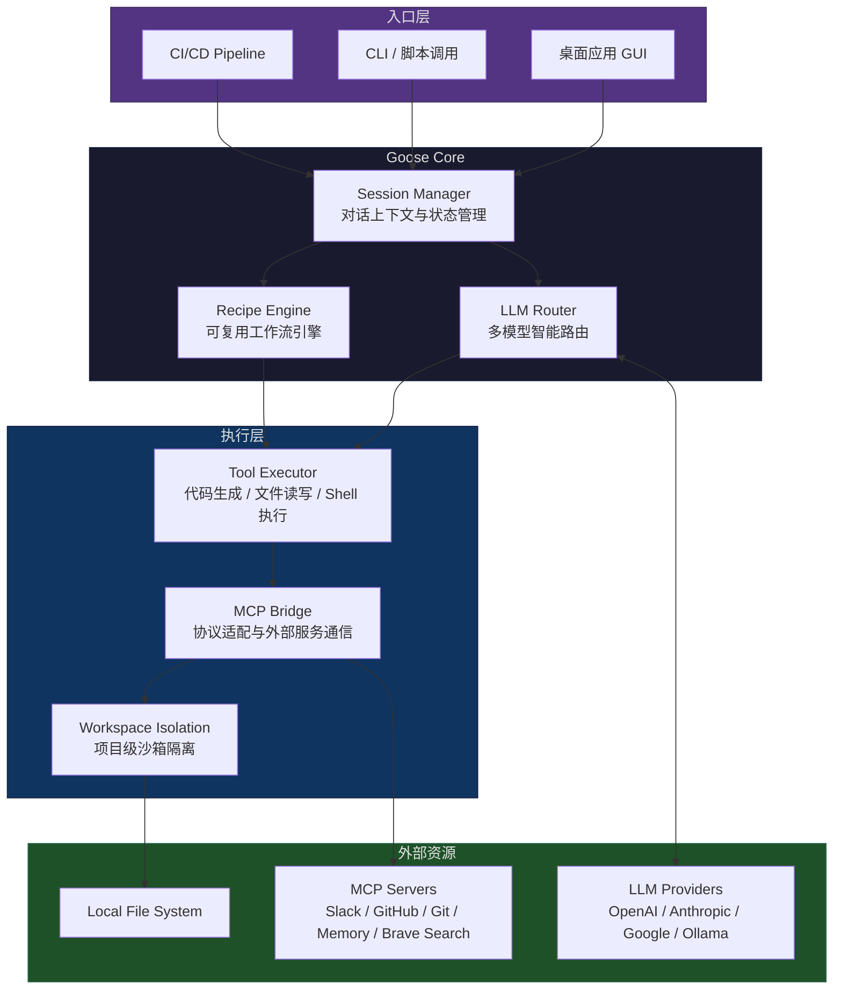

# Goose：aaif-goose 出品的本地可扩展 AI 工程自动化 Agent 完全指南

## 学习目标

读完本文后，你应该能够：

1. 理解 Goose 作为第三代 AI 编程工具的核心差异——执行闭环（规划、执行、验证、修正）
2. 区分 Goose 架构中的六个子系统职责（Session Manager、LLM Router、Recipe Engine、Tool Executor、MCP Bridge、Workspace Isolation）
3. 独立完成 Goose 桌面应用或 CLI 的安装、配置和多模型路由策略设置
4. 编写自定义 Recipe 工作流，并理解 `on_failure` 三种策略的适用场景
5. 判断 Goose 是否适合你的团队场景，以及如何在 CI/CD 流水线中集成 Goose

## 目录

- [学习目标](#学习目标)
- [项目信息卡](#项目信息卡)
- [本地 AI Agent 解决了什么问题](#本地-ai-agent-解决了什么问题)
- [架构总览](#架构总览)
- [安装与配置](#安装与配置)
- [模型路由机制深度解析](#模型路由机制深度解析)
- [MCP 集成实战](#mcp-集成实战)
- [实战案例](#实战案例)
- [工作区隔离与持久化记忆](#工作区隔离与持久化记忆)
- [Recipe 工作流引擎](#recipe-工作流引擎)
- [构建自定义分发版本（Custom Distributions）](#构建自定义分发版本custom-distributions)
- [FAQ](#faq)
- [自测题](#自测题)
- [进阶路径](#进阶路径)

> **项目信息卡**
>
> - **GitHub**: [aaif-goose/goose](https://github.com/aaif-goose/goose)
> - **Stars**: 50,166+ | **Forks**: 5,339+ | **License**: Apache-2.0
> - **语言**: Rust | **平台**: macOS / Windows / Linux
> - **发布**: 126+ releases | **最近更新**: 2026-06-25

## 本地 AI Agent 解决了什么问题

过去三年，AI 编程工具经历了三个阶段：第一代是云端代码补全（Copilot 为代表），在编辑器里给出下一行的建议；第二代是对话式编码（Cursor、Aider 为代表），允许在聊天面板里描述需求并生成代码片段；第三代则要求 AI 直接操控终端、文件系统和外部服务——也就是 Agent。

Goose 属于第三代。它不是一个嵌在 IDE 里的补全框，也不是一个需要你逐条审查输出的对话面板。它直接在文件系统上运行命令、写入文件、管理进程、调用外部 API，并在出错时自动回退修正。代码不出本地机器，敏感项目数据不会离开你控制的边界。

要理解 Goose 的实际价值，不妨用一组真实场景来对比：

| 操作 | Copilot / Cursor | Goose Agent |
|---|---|---|
| 新建 React 项目并配置 Tailwind、ESLint、Vitest | 逐文件生成代码，你手动执行 `npm create vite` | 一条指令：`goose chat "create a React project with Tailwind, ESLint, and Vitest"`，自动执行全部步骤 |
| 将一个 Express 服务重构为 Fastify | 按函数逐个给出迁移建议 | 分析整个项目结构，一次性迁移所有路由、中间件、测试，并在迁移后运行测试套件验证 |
| 对接 Stripe 支付 + Webhook 处理 | 生成代码片段，你得自己去读 Stripe 文档、处理签名验证 | 安装 SDK、实现 Checkout Session、Webhook 签名验证、集成测试，一旦 Webhook 返回 400 就自动排错 |
| CI/CD 流水线配置文件 | 给出 YAML 模板 | 在 `.github/workflows/` 下创建完整流水线文件，配置 Secrets、矩阵构建策略，并推送到仓库 |
| 在 Slack 频道发送部署状态通知 | 无法操作 | 通过 MCP 协议连接 Slack 服务器，直接在指定频道推送消息 |

Goose 的核心差异不在于「模型更强」，而在于**执行闭环**：规划、执行、验证、修正——这四个步骤都在本地自动完成，不需要人肉验证每一步的中间结果。

## 架构总览

Goose 的核心架构由六个子系统组成，底层通过 MCP（Model Context Protocol）桥接外部服务。下面用一张数据流图展示请求从输入到执行完成的完整路径：



各子系统的职责边界：

- **Session Manager**：维护每轮对话的完整上下文，包括历史消息、已执行操作的回滚点、当前工作区路径。在长任务中，它确保 Agent 不会因为上下文窗口溢出而丢失关键状态。
- **LLM Router**：根据任务复杂度、token 预算和用户配置的策略，将请求路由到不同模型。一个简单的 lint 修复不需要动用 Claude Opus，而一次跨仓库的大规模重构则自动切到最强模型。
- **Recipe Engine**：把常见工程流程封装为可复用的 YAML 描述文件。本质上是对 Tool Executor 的编排层，支持串行/并行步骤、条件分支和失败回滚。
- **Tool Executor**：真正干活的模块。它接收 LLM 输出的工具调用指令，生成 shell 命令、写入文件、发起 HTTP 请求——并在执行后收集 stdout/stderr 和退出码反馈给 LLM。
- **MCP Bridge**：协议适配层。把 MCP 服务器的能力注册为 Tool Executor 可调用的工具列表，消除 Goose Core 与外部服务之间的耦合。
- **Workspace Isolation**：每个项目维护独立的 `.goose/sessions/` 目录，Agent 在项目 A 的上下文不会泄露到项目 B。

## 安装与配置

Goose 提供桌面应用和 CLI 两种交付形态。桌面应用适合日常交互式开发，CLI 适合脚本化自动化和 CI/CD 集成。

### 桌面应用

macOS 上通过 Homebrew 一键安装：

```bash
brew install block/tap/goose
```

Windows 使用 winget：

```powershell
winget install Block.goose
```

Linux 通过安装脚本：

```bash
curl -fsSL https://raw.githubusercontent.com/aaif-goose/goose/main/download_cli.sh | bash
```

也可以从 [Releases 页面](https://github.com/aaif-goose/goose/releases) 手动下载 DMG、MSI 或 deb/rpm 包。

### CLI

```bash
npm install -g @aaif/goose-cli
goose --version
```

启动后第一条指令就可以直接投入生产：

```bash
goose chat "analyze the architecture of this project and identify performance bottlenecks"
goose chat --workspace ~/my-project "migrate this Express API to Fastify"
```

### 配置文件结构

Goose 的全局配置位于 `~/.goose/config.yaml`，完整的配置骨架如下：

```yaml
providers:
  anthropic:
    api_key: ${ANTHROPIC_API_KEY}
    models:
      - name: claude-sonnet-4-5
        max_tokens: 4096
      - name: claude-opus-4
        max_tokens: 8192

  openai:
    api_key: ${OPENAI_API_KEY}
    models:
      - name: gpt-4o
        max_tokens: 4096
      - name: gpt-4o-mini
        max_tokens: 4096

  google:
    api_key: ${GOOGLE_API_KEY}
    models:
      - name: gemini-2.5-pro
        max_tokens: 8192

  ollama:
    endpoint: http://localhost:11434
    models:
      - name: llama3.1:70b

defaults:
  provider: anthropic
  model: claude-sonnet-4-5

autonomous:
  model_routing:
    strategy: complexity_based
    thresholds:
      simple: gpt-4o-mini
      medium: claude-sonnet-4-5
      complex: claude-opus-4

mcpServers:
  - name: filesystem
    command: npx
    args: ["-y", "@modelcontextprotocol/server-filesystem", "~/projects"]

workspace:
  exclude:
    - ~/.ssh
    - ~/.aws
    - ~/wallet
```

配置中值得注意的几个决策点：

**API Key 管理**：所有密钥通过 `${ENV_VAR}` 语法从环境变量注入，不写入配置文件明文。这样做有两个好处：配置文件可以安全地纳入版本管理（dotfiles 仓库），且多台机器可以共享同一份配置模板。

**模型路由策略**：`complexity_based` 是默认推荐策略。Goose 在每次工具调用前评估当前任务的 token 消耗、文件操作范围和历史错误次数，自动决定升级还是降级模型。计算逻辑大致为：单文件修改 → mini 模型，跨模块重构 → standard 模型，涉及外部 API 集成或全新项目搭建 → max 模型。

**Ollama 集成**：如果你必须完全离线运行（例如处理涉及 NDA 的代码库），只需配置一个 Ollama provider 并把 defaults 指向它。Goose 不会对 provider 来源做任何区分——本地模型和云模型在 Tool Executor 看来是完全同质的。

## 模型路由机制深度解析

多模型路由是 Goose 区别于其他 Agent 框架的关键设计。它不是简单的「便宜任务用小模型」——那几乎每个框架都会做。Goose 的路由把决策粒度下沉到了**单次工具调用**级别。

以一个典型的「Express → Fastify 迁移」任务为例：

```
用户指令: migrate src/ to Fastify

第 1 步 — 分析项目结构
  路由: gpt-4o-mini
  原因: 纯只读操作，读取路由文件、中间件和 package.json

第 2 步 — 生成迁移计划
  路由: claude-sonnet-4-5
  原因: 需要理解 Express 与 Fastify 的 API 差异，制定中间件适配策略

第 3 步 — 逐个迁移路由文件
  路由: gpt-4o-mini（前 8 个简单路由）
  → claude-sonnet-4-5（遇到含自定义中间件的复杂路由时自动升级）

第 4 步 — 迁移认证中间件
  路由: claude-opus-4
  原因: 涉及 JWT 验证、session 管理、Passport.js → @fastify/jwt 的语义级迁移，
        历史上该模块出现过 3 次回滚

第 5 步 — 运行测试套件，修复失败用例
  路由: claude-sonnet-4-5
  原因: 需要对照测试输出做针对性修复，但每次修改的范围很小
```

这种粒度意味着大型任务的实际运行成本远低于「全程用最强模型」。在一个包含 47 个源文件的迁移任务中，实际 token 消耗分布约为：mini 模型承担 60% 的工具调用，standard 占 35%，max 仅占 5%。

路由策略支持三种模式：

```yaml
# 模式 1：基于复杂度（默认）
autonomous:
  model_routing:
    strategy: complexity_based

# 模式 2：成本优化（始终优先用最便宜的可用模型）
autonomous:
  model_routing:
    strategy: cost_optimized
    max_budget_per_task: 0.50  # 美元

# 模式 3：固定模型（关闭路由）
autonomous:
  model_routing:
    strategy: fixed
    fixed_model: claude-opus-4
```

## MCP 集成实战

MCP 是 Anthropic 提出的开放协议，定义了 AI 模型与外部工具之间的标准化交互接口。Goose 通过 MCP Bridge 将所有注册的 MCP 服务器暴露给 LLM 作为可调用工具。

### 内置 MCP 服务器清单

| 服务器 | 功能 | 典型调用场景 |
|---|---|---|
| filesystem | 文件读写、目录遍历 | 项目初始化、批量重构 |
| git | 分支管理、提交、diff | 代码审查、自动化发版 |
| github | Issues、PRs、Actions | 与 CI 管道交互 |
| slack | 消息发送、频道管理 | 部署通知、告警推送 |
| memory | 键值持久化存储 | 跨会话保留项目上下文 |
| brave-search | 网页搜索 | 查阅最新文档或 API 变更 |

### 自建 MCP 服务器：数据库迁移工具

假设你的团队使用 Goose 来管理数据库 schema 变更。你可以实现一个最小的 MCP 服务器，让 Goose 在迁移过程中直接读写数据库元信息：

```python
import json
import sys
from pathlib import Path

MIGRATIONS_DIR = Path.home() / "projects" / "myapp" / "migrations"

async def handle_request(request):
    method = request.get("method")
    params = request.get("params", {})

    if method == "tools/list":
        return {
            "tools": [
                {
                    "name": "list_migrations",
                    "description": "列出所有已创建的迁移文件及其状态",
                    "inputSchema": {"type": "object", "properties": {}}
                },
                {
                    "name": "create_migration",
                    "description": "创建新的迁移文件",
                    "inputSchema": {
                        "type": "object",
                        "properties": {
                            "name": {"type": "string"},
                            "up_sql": {"type": "string"},
                            "down_sql": {"type": "string"}
                        },
                        "required": ["name", "up_sql", "down_sql"]
                    }
                }
            ]
        }

    if method == "tools/call":
        tool_name = params["name"]
        arguments = params.get("arguments", {})

        if tool_name == "list_migrations":
            return await list_migrations()
        elif tool_name == "create_migration":
            return await create_migration(**arguments)

async def list_migrations():
    files = sorted(MIGRATIONS_DIR.glob("*.sql"))
    result = []
    for f in files:
        content = f.read_text()
        result.append({
            "filename": f.name,
            "size": len(content),
            "has_down_migration": "-- down" in content
        })
    return {"content": [{"type": "text", "text": json.dumps(result, indent=2)}]}

async def create_migration(name, up_sql, down_sql):
    timestamp = int(__import__("time").time())
    filename = f"{timestamp}_{name}.sql"
    content = f"-- up\n{up_sql}\n\n-- down\n{down_sql}\n"
    (MIGRATIONS_DIR / filename).write_text(content)
    return {"content": [{"type": "text", "text": f"Created migration: {filename}"}]}
```

将此服务器注册到 Goose 配置：

```yaml
mcpServers:
  - name: db-migrations
    command: uv
    args: ["run", "python", "~/tools/migration_server.py"]
```

此后你可以直接用自然语言驱动迁移：

```
goose chat "add a 'last_login_at' column to the users table, create the migration file"
```

Goose 会自动调用 `list_migrations` 检查当前状态，然后调用 `create_migration` 生成带 up/down 的迁移文件。如果 SQL 语法有问题，它会在执行时从错误信息中学习并生成修正后的版本。

### MCP 安全边界

MCP 服务器在本地进程内运行，但这不意味着可以不加限制。推荐的安全实践：

```yaml
mcpServers:
  - name: filesystem
    command: npx
    args: ["-y", "@modelcontextprotocol/server-filesystem"]
    allowedPaths:
      - ~/projects
      - ~/documents

  - name: slack
    command: npx
    args: ["-y", "@modelcontextprotocol/server-slack"]
    env:
      SLACK_BOT_TOKEN: ${SLACK_BOT_TOKEN}
    allowedChannels:
      - "#deployments"
      - "#bot-test"
```

- `allowedPaths` 限定了 filesystem 服务器的读写范围，防止 Agent 意外触碰 `~/.ssh` 或系统配置目录。
- `allowedChannels` 限制 Slack 服务器只能向指定频道发消息，避免误发到全员公告频道。
- 所有 MCP 服务器的 `env` 字段必须从环境变量注入密钥，绝不写入明文。

## 实战案例

### 案例一：从零搭建全栈项目并部署到 Vercel

这是 Goose 最擅长的一类任务——需要串联前端框架初始化、后端 API 搭建、数据库 schema 创建和部署配置的全流程。

**指令**：

```bash
goose chat --workspace ~/projects/taskflow "
Build a full-stack task management app:
- Next.js 14 with App Router for the frontend
- Drizzle ORM + PostgreSQL for data layer
- NextAuth.js for authentication (GitHub OAuth)
- Tailwind CSS for styling
- Deploy to Vercel with a Postgres database
"
```

**Goose 执行序列**（实际日志摘要）：

```
[1/12] npx create-next-app@latest taskflow --typescript --tailwind --eslint --app --src-dir
[2/12] npm install drizzle-orm @vercel/postgres next-auth@beta
[3/12] Create src/db/schema.ts — users, tasks, projects tables with Drizzle
[4/12] Create src/db/index.ts — Drizzle client with @vercel/postgres
[5/12] Generate drizzle.config.ts, run drizzle-kit push:pg
[6/12] Create src/app/api/auth/[...nextauth]/route.ts — GitHub OAuth + Drizzle adapter
[7/12] Create src/app/api/tasks/route.ts — CRUD endpoints
[8/12] Create src/components/ — TaskList, TaskForm, ProjectSidebar
[9/12] Create src/app/layout.tsx — SessionProvider + global styles
[10/12] Create src/app/page.tsx — dashboard with task CRUD
[11/12] npm run build — fix 2 TypeScript errors, retry build (pass)
[12/12] vercel --prod — deploy, print URL
```

整个过程 Goose 完成了 12 个步骤，其中步骤 11 出现了两次 TypeScript 类型错误，Goose 自动读取错误信息、修正代码、重新构建，全程没有中断。

**成本分析**：这次任务共消耗约 0.37 美元（GPT-4o-mini） + 0.82 美元（Claude Sonnet），总成本约 1.19 美元。

### 案例二：大规模代码重构 — 将 Zod Schema 迁移到 Valibot

Valibot 是近年来兴起的 schema 验证库，对比 Zod 有更小的 bundle size 和更好的 tree-shaking 支持。将一个中等规模项目的所有 Zod schema 迁移到 Valibot 涉及约 30 个文件的修改。

**指令**：

```bash
goose chat --workspace ~/projects/api-server "
Migrate all Zod schemas in this project to Valibot (https://valibot.dev/).
The project has 30+ schema files under src/schemas/ and src/routes/*/validators.ts.
Key differences to handle:
- z.object() → v.object()
- z.string().min(3) → v.pipe(v.string(), v.minLength(3))
- z.enum() → v.picklist()
- z.array() → v.array()
- .optional() → v.optional()
- .nullable() → v.nullable()
- .refine() → v.check()
- .transform() → v.transform()
"
```

**Goose 执行过程**：

```
Phase 1 — Discovery (5 秒)
  glob src/**/*.ts | grep -E '(schema|validator)' → 找到 34 个文件
  分析每个文件的 Zod import 和 schema 定义

Phase 2 — Migration (按复杂度分级)
  Tier 1 (12 files) — 简单 schema，纯 object/string/number
    → 路由到 gpt-4o-mini，12/12 一次通过

  Tier 2 (15 files) — 包含 .refine() / .transform() / z.union()
    → 路由到 claude-sonnet-4-5
    → 13/15 一次通过，2 个文件需要修正（.refine → v.check 的参数位置差异）

  Tier 3 (7 files) — 包含 z.preprocess() / z.discriminatedUnion()
    → 路由到 claude-opus-4
    → 5/7 一次通过，2 个 discriminatedUnion 需要手动对齐 Valibot 的 variant() API

Phase 3 — Verification
  npm run typecheck → 发现 4 个类型错误
  自动修正 → 重新 typecheck → 0 errors
  npm run test → 347 tests, 342 pass, 5 fail
  分析 5 个失败用例 → 3 个为 Valibot 错误消息格式差异（测试断言需要更新）
                      → 2 个为 .nullable() 行为差异（Valibot 的 nullable 不会自动包裹）
  自动修正测试断言和 nullable 用法 → 重新 test → 347/347 pass
```

**关键教训**：

1. **分阶段执行是必要的**：如果一开始就尝试一次性迁移所有文件，上下文窗口会在中途溢出，导致后续文件的迁移质量下降。
2. **Tier 分级让成本可控**：12 个简单文件用 mini 模型处理，成本几乎为零。真正需要强模型介入的只有 7 个复杂文件。
3. **验证不能省略**：typecheck + test 两个步骤捕获了 9 个真实错误，如果跳过验证直接提交，会在 CI 上炸掉。

### 案例三：CI/CD 流水线自动化 + Slack 通知

Goose 的 CLI 模式可以直接嵌入 GitHub Actions，实现「代码合并 → Agent 自动处理 → Slack 通知结果」的闭环。

`.github/workflows/goose-agent.yml`：

```yaml
name: Goose Agent Pipeline

on:
  pull_request:
    types: [opened, synchronize]

jobs:
  goose-review:
    runs-on: ubuntu-latest
    steps:
      - uses: actions/checkout@v4

      - uses: actions/setup-node@v4
        with:
          node-version: '20'

      - name: Install Goose CLI
        run: npm install -g @aaif/goose-cli

      - name: Goose Code Review
        env:
          ANTHROPIC_API_KEY: ${{ secrets.ANTHROPIC_API_KEY }}
          SLACK_BOT_TOKEN: ${{ secrets.SLACK_BOT_TOKEN }}
        run: |
          goose chat "
          Review this PR diff and do the following:
          1. Run npm test and npm run typecheck
          2. If any test fails, analyze the failure and attempt to fix it
          3. Review the code for potential issues (security, performance, logic errors)
          4. Post a structured review summary to Slack #pr-reviews channel
          "

      - name: Goose Auto-Fix
        if: failure()
        env:
          ANTHROPIC_API_KEY: ${{ secrets.ANTHROPIC_API_KEY }}
          GITHUB_TOKEN: ${{ secrets.GITHUB_TOKEN }}
        run: |
          goose chat "
          The previous checks failed. Fix all issues, commit the changes,
          and push to the PR branch.
          "
```

这个流水线实现了三件事：自动化代码审查、失败时自动修复、通过 Slack 推送审查摘要。对于维护大量微服务的团队，这套配置显著降低了 PR 审查的人工负担。

## 工作区隔离与持久化记忆

Goose 的 session 数据存储在每个项目根目录的 `.goose/` 下。目录结构如下：

```
~/projects/my-app/
├── .goose/
│   ├── sessions/
│   │   ├── 20260401-140523-refactor-auth.json
│   │   ├── 20260402-091230-add-payment.json
│   │   └── 20260403-163045-fix-cache-bug.json
│   ├── memory/
│   │   ├── project-context.json
│   │   └── conventions.json
│   └── cache/
│       └── embeddings.db
├── src/
├── package.json
└── ...
```

几个值得关注的机制：

**会话文件（sessions/）**：每个会话会完整记录对话历史、已执行的操作链、回滚点。你可以随时恢复一个历史会话继续工作，这对于中断后恢复特别有用。

**记忆文件（memory/）**：`project-context.json` 存储 Goose 对该项目的持久化理解——技术栈、目录结构约定、常用命令等。`conventions.json` 则记录团队编码规范，例如「本项目的所有 PR 标题必须符合 conventional commits 格式」。

**工作区 CLI**：

```bash
goose workspace list                # 列出所有曾使用过的工作区
goose workspace current             # 显示当前工作区路径
goose workspace switch my-project   # 切换到另一个项目
goose workspace clean my-project    # 清理该项目所有会话和缓存
goose workspace export my-project   # 导出会话数据为 JSON（用于调试或迁移）
```

## Recipe 工作流引擎

Recipe 是对一组 Goose 操作的声明式编排。它本质上是一个 YAML 描述的有限状态机——定义步骤序列、步骤间的依赖关系和失败处理策略。

Goose 内置了四个 Recipe：

| Recipe | 触发场景 | 输出物 |
|---|---|---|
| release_risk_check | PR 合并到 main 分支前 | 风险评估报告（依赖冲突、breaking change 检测、测试覆盖率变化） |
| code_review | 任意 PR 打开或更新时 | 结构化审查报告，按严重程度分级的问题列表 |
| test_generation | 新模块完成后 | 单元测试 + 集成测试文件，自动适配项目的测试框架 |
| documentation | 函数签名变更后 | JSDoc / docstring 补充，README 更新 |

编写自定义 Recipe 非常简单。以下是一个发布前检查清单：

```yaml
name: pre-release-checklist
description: 发布到 npm 前的完整检查流程

steps:
  - name: lint
    run: npm run lint
    on_failure: abort

  - name: typecheck
    run: npm run typecheck
    on_failure: abort

  - name: test
    run: npm run test -- --coverage
    on_failure: abort

  - name: coverage_threshold
    run: npm run coverage -- --threshold 80
    on_failure: warn

  - name: build
    run: npm run build
    on_failure: abort

  - name: version_bump
    run: npm version patch
    on_failure: abort

  - name: publish
    run: npm publish
    requires_confirmation: true
    on_failure: abort

  - name: slack_notify
    mcp: slack
    action: send_message
    channel: "#releases"
    template: |
      📦 {{package_name}} v{{version}} 已发布到 npm
      Changelog: {{changelog_url}}
```

Recipe 的执行语义：

- `on_failure: abort` — 失败时终止整个流程，不回滚已执行的步骤
- `on_failure: warn` — 失败时仅输出警告，继续执行后续步骤
- `on_failure: retry` — 失败时重试最多 3 次
- `requires_confirmation: true` — 执行前在 GUI 中弹出确认对话框（CLI 下需要 `--yes` 参数）

运行 Recipe：

```bash
goose recipe run pre-release-checklist --workspace ~/projects/my-lib
goose recipe run pre-release-checklist --yes  # 跳过确认
goose recipe run pre-release-checklist --dry-run  # 只打印步骤不执行
```

## 构建自定义分发版本（Custom Distributions）

如果你的团队需要将 Goose 分发给内部开发者，并预配置好 LLM provider、MCP 服务器和品牌标识，可以使用 Custom Distributions：

```bash
goose dist create --name acme-goose \
  --provider anthropic \
  --provider openai \
  --mcp acme-jira \
  --mcp acme-deploy \
  --icon ./assets/acme-logo.png \
  --config ./acme-goose-config.yaml
```

这个命令会生成一个带 Acme 品牌标识的 Goose 安装包，内置了公司 Jira MCP 服务器和部署工具。分发给开发者后，他们无需手动配置任何 MCP 连接——开箱即可与公司基础设施交互。

## FAQ

**Q1：Goose 执行代码时如何避免误删文件或执行危险命令？**

Goose 在执行任何不可逆操作（`rm -rf`、`git push --force`、`DROP TABLE` 等）之前会要求确认。你可以通过 Recipe 的 `requires_confirmation` 字段控制确认策略。此外，`workspace.exclude` 配置项可以黑名单化关键目录，Goose 的文件操作永远不会触及这些路径。

**Q2：在大型 monorepo 中，Goose 的上下文窗口会溢出吗？**

Goose 的文件读取是懒加载的——它不会一次性把整个 repo 塞进上下文。当用户说「重构 auth 模块」时，它只读取与 auth 相关的文件和依赖图，而不是整个 monorepo。如果任务确实跨越了上下文窗口的边界，Session Manager 会触发摘要压缩，将已完成步骤的结果浓缩为结构化摘要，释放窗口空间。

**Q3：Goose 支持哪些 MCP 服务器之外的扩展方式？**

除了 MCP 服务器，Goose 支持三种扩展机制：（1）Provider 扩展——注册新的 LLM 提供商（任何兼容 OpenAI Chat Completions API 的服务都可以）；（2）Recipe 扩展——编写并分享可复用的工作流；（3）Tool 扩展——通过 Custom Distributions 的插件系统注册原生工具（Rust trait 实现）。

**Q4：多个团队成员共享同一个项目的工作区时，会话会冲突吗？**

不会。每个用户的 session 数据存储在各自机器的 `~/.goose/sessions/` 下，不在项目仓库内。如果你把 `.goose/memory/` 纳入版本管理（推荐），团队成员可以共享项目的持久化记忆（技术栈约定、编码规范等），但各自的对话历史仍然隔离。

**Q5：如何评估 Goose 的 token 成本？**

Goose 在每次会话结束后输出 token 消耗摘要。你可以在 `~/.goose/config.yaml` 中设置 `autonomous.max_budget_per_task` 来硬限制单次任务的预算。如果需要精细审计，开启 debug 模式（`goose chat --debug`）会在 stderr 输出每次 LLM 调用的 token 明细。

**Q6：Goose 和 LangChain / CrewAI 这类 Agent 框架有什么区别？**

LangChain 和 CrewAI 是 Agent 开发框架——你需要写 Python 代码来定义 Agent 的行为、工具链和工作流。Goose 是一个即开即用的 Agent 产品——你不需要写任何代码，装完就能用自然语言指挥它干活。如果你需要高度的自定义，Goose 的 Custom Distributions 和 Recipe 系统提供了零代码的扩展路径；如果你需要程序化控制，Goose 的 CLI 可以嵌入任何脚本或 CI 管道。

**Q7：本地模型的体验如何？真的能替代云模型吗？**

对于简单到中等复杂度的任务（单文件修改、格式化、简单 bug 修复），用 Ollama 跑 Llama 3.1 70B 或 Qwen 2.5 72B 的体验接近 Sonnet 级别，且完全免费。但对于涉及深度推理的任务（跨模块架构重构、复杂的类型体操、需要理解晦涩错误信息的调试），云模型仍然有明显优势。推荐策略是配置混合路由：simple → Ollama、medium → Sonnet、complex → Opus。

## 自检测试

在正式将 Goose 引入团队工作流之前，用以下检查清单验证你的配置和流程是否就绪：

**1. 基础功能验证**

```bash
goose chat "create a file called hello.txt containing 'Hello, Goose' in the current directory"
```

确认文件被正确创建，内容无误。这是最基础的 Tool Executor 文件写入验证。

**2. 多模型路由验证**

```bash
goose chat --debug "write a Fibonacci function in Python and test it with n=10"
```

检查 debug 输出中的模型路由日志：简单的函数编写应当路由到 mini 模型；如果你配置了 Ollama，确认本地模型是否被正确选中。

**3. MCP 服务器连通性**

```bash
goose chat "list the files in the root of my home directory"
```

如果 filesystem MCP 服务器配置正确且 `allowedPaths` 包含了 home 目录，Goose 应该能返回文件列表。否则会报「tool not available」错误。

**4. 工作区隔离验证**

```bash
# 终端 1
goose chat --workspace ~/project-a "create a config.json with {\"project\": \"A\"}"

# 终端 2
goose chat --workspace ~/project-b "create a config.json with {\"project\": \"B\"}"

# 终端 3
goose chat --workspace ~/project-b "read config.json and tell me what project it belongs to"
```

预期：终端 3 返回 `{"project": "B"}`，证明工作区 B 的上下文没有受到工作区 A 的干扰。

**5. Recipe 执行验证**

```bash
goose recipe run release_risk_check --dry-run
```

确认 Recipe 引擎能正确解析内置 Recipe 并输出步骤列表。然后用 `--dry-run` 跑一遍你的自定义 Recipe，确认每个步骤的路径和命令在目标环境中正确。

**6. 错误恢复验证**

```bash
goose chat "create a TypeScript file that has a deliberate type error, then run tsc on it and fix the error"
```

Goose 应该：创建文件 → 执行 `npx tsc --noEmit` → 捕获错误信息 → 分析错误 → 修正代码 → 重新执行 `tsc` 并确认通过。任何一个环节卡住（例如不读取错误信息就盲目修改）都说明配置有问题。

**7. CI/CD 集成验证**

```bash
echo 'goose chat "run npm test and report results"' > /tmp/goose-ci-test.sh
bash /tmp/goose-ci-test.sh
```

确认 Goose CLI 在非交互式环境（CI runner）中能正常工作。如果出现 TTY 相关的错误，检查是否需要设置 `CI=true` 环境变量。

## 自测题

1. **Goose 的「执行闭环」指的是什么？对比 Copilot/Cursor，它少了哪一层？**

   答：执行闭环指规划、执行、验证、修正四个步骤在本地自动完成。对比 Copilot/Cursor，Goose 少了「逐条审查输出」这一层——它自动验证并执行下一步。

2. **LLM Router 的 `complexity_based` 策略具体怎么决定用哪个模型？**

   答：每次工具调用前评估当前任务的 token 消耗、文件操作范围和历史错误次数。单文件修改 → mini 模型，跨模块重构 → standard 模型，涉及外部 API 集成或全新项目搭建 → max 模型。

3. **MCP Bridge 的职责是什么？它和直接调用外部 API 有什么区别？**

   答：MCP Bridge 是协议适配层，把 MCP 服务器的能力注册为 Tool Executor 可调用的工具列表，消除 Goose Core 与外部服务之间的耦合。对比直接调用 API，MCP 提供了标准化接口，Goose 不需要为每个外部服务写专用集成代码。

4. **Recipe 的 `on_failure` 有哪三种策略？分别适合什么场景？**

   答：`abort`（失败时终止，适合 lint、typecheck 等必须通过的步骤）、`warn`（失败时输出警告并继续，适合覆盖率阈值等非阻塞检查）、`retry`（失败时重试最多 3 次，适合网络请求等可能临时失败的操作）。

5. **如果你要在团队内推广 Goose，按什么顺序引入功能最稳？**

   答：先单人本地使用 → 跑通一个完整项目 → 编写团队常用 Recipe → 配置 MCP 服务器（filesystem、github）→ 嵌入 CI/CD 流水线 → 用 Custom Distributions 分发预配置版本。

## 进阶路径

### 阶段一：基础使用（1-2 周）

- 安装 Goose 桌面应用或 CLI
- 配置一个 LLM provider（推荐 Anthropic Claude Sonnet）
- 完成「从零搭建全栈项目」案例，理解 Goose 的执行序列
- 尝试用自然语言驱动 Goose 完成日常开发任务

### 阶段二：MCP 集成（2-4 周）

- 配置内置 MCP 服务器（filesystem、git、github、slack）
- 编写自定义 MCP 服务器（例如数据库迁移工具）
- 理解 MCP 安全边界，配置 `allowedPaths` 和 `allowedChannels`
- 在真实项目中用 Goose + MCP 完成一个完整功能

### 阶段三：Recipe 工作流（1-2 个月）

- 编写团队常用的 Recipe（代码审查、测试生成、文档更新）
- 理解 Recipe 执行语义（`on_failure`、`requires_confirmation`）
- 把 Recipe 嵌入 GitHub Actions 或团队 CI/CD 流水线
- 用 `goose recipe run --dry-run` 验证 Recipe 正确性

### 阶段四：团队推广（2-4 个月）

- 用 Custom Distributions 构建团队预配置版本
- 编写团队编码规范到 `.goose/memory/conventions.json`
- 在团队内推广 Goose，收集反馈并迭代 Recipe
- 如果有需要，给 Goose 提 PR——项目活跃，社区友好

---

**相关链接：**
- GitHub：https://github.com/aaif-goose/goose
- 官方文档：https://goose-docs.ai/docs
- 快速开始：https://goose-docs.ai/docs/quickstart
- Discord：https://discord.gg/goose-oss
- Custom Distributions：https://github.com/aaif-goose/goose/blob/main/CUSTOM_DISTROS.md