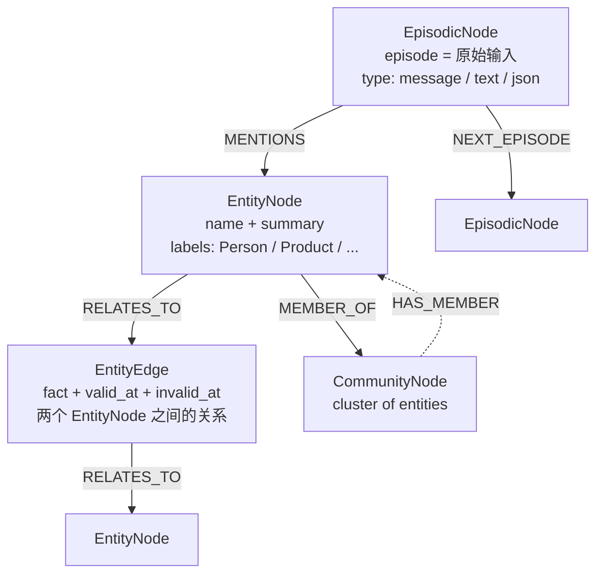

## 学习目标

读完这篇，你将能：

- 解释 Graphiti 真正解决的不是「更聪明的检索」而是「事实会过期、会被推翻，必须可溯源」。
- 区分 Graphiti 里的四个图元素：EpisodicNode、EntityNode、EntityEdge、CommunityNode，以及它们之间的引用关系。
- 用一个具体场景（用户的穿衣偏好随时间变化）走完「Episode 入图 → 抽取 → 边失效 → 混合检索」的完整链路。
- 看懂 Graphiti 的混合检索其实由「三种方法 × 五种 Reranker」组合而成，并能挑出适合自己场景的预设 Recipe。
- 判断 Graphiti 与 GraphRAG、与 Zep 商业版的工程边界，并决定要不要在你的 agent 里用、怎么用。

## 目录

- [信息来源约定](#信息来源约定)
- [§1 先给判断](#先给判断)
- [§2 它解决的不是一个检索问题](#它解决的不是一个检索问题)
- [§3 总览图：Graphiti 的四个图元素](#总览图graphiti-的四个图元素)
- [§4 机制一：Episode 是一切的起点](#机制一episode-是一切的起点)
- [§5 机制二：事实是一条带过期时间的边](#机制二事实是一条带过期时间的边)
- [§6 机制三：去重不是「合并字符串」](#机制机制三去重不是合并字符串)
- [§7 机制四：可插拔的四件套](#机制四可插拔的四件套)
- [§8 机制五：混合检索是「3×5」的笛卡尔积](#机制五混合检索是35的笛卡尔积)
- [§9 LLM 接入：结构化输出的两种模式](#llm-接入结构化输出的两种模式)
- [§10 任务流案例：用户的穿衣偏好随时间变化](#任务流案例用户的穿衣偏好随时间变化)
- [§11 vs GraphRAG / vs Zep：边界在哪里](#vs-graphrag--vs-zep边界在哪里)
- [§12 验证与限制：诚实披露](#验证与限制诚实披露)
- [§13 采用顺序与适用边界](#采用顺序与适用边界)
- [§14 自测题](#自测题)
- [§15 常见问题](#常见问题)
- [§16 术语对照](#术语对照)
- [§17 一个值得记住的判断](#一个值得记住的判断)
- [§18 参考与延伸阅读](#参考与延伸阅读)

## 信息来源约定

本文混合了三种来源：

- **（仓库证据）**：直接引自 `getzep/graphiti` 仓库的 README、源码、`pyproject.toml`、`examples/`、`mcp_server/` 子目录。本文写作时仓库当前版本为 `v0.29.2`（Apache-2.0 协议，主代码 `pyproject.toml` 要求 `requires-python = ">=3.10,<4"`、`neo4j>=5.26.0`），所有 API 名称与命令均以该版本为准。
- **（论文证据）**：直接引自 Zep 团队的 arXiv 论文 [Zep: A Temporal Knowledge Graph Architecture for Agent Memory](https://arxiv.org/abs/2501.13956)，由 Zep 工程团队在仓库 README 中引用。
- **（作者推断）**：基于工程原理的合理推导，但未在仓库或论文中显式说明的部分。

涉及具体 API、配置项或版本号时，会标明来源类别；未标注的均为仓库当前 main 分支可见的事实。

## §1 先给判断

如果你想把 RAG 从「文档片段相似度匹配」推进到「能记住用户说过什么、什么时候说的、后来有没有改口」，那么你今天在开源生态里能找到的、**不是研究原型、不是论文 demo、已经有生产级后端接入** 的工程化框架里，Graphiti 是少数几个最值得认真看的。

它真正解决的问题不是「检索得不够准」，而是「**事实会过期、会互相矛盾、必须能回溯到原始输入**」。这三件事，传统向量数据库做不了，GraphRAG 做得不够好，LangChain 的 RAG chain 也只解决了一半。Graphiti 把它做成了一个独立的图引擎，并且把可插拔的边界（后端、LLM、embedder、reranker）都留在了框架外部。

## §2 它解决的不是一个检索问题

把 Graphiti 归类为「又一个 RAG 框架」是常见但严重的误判。

它解决的是一个更上游的问题：**当一个 agent 长时间和同一个用户对话、和同一批文档交互时，它需要一份「带时间维度的记忆」**。这份记忆要满足四个条件：

1. **可溯源**——任何被检索出来的事实，必须能反查到「它从哪条 episode 来的」。
2. **可失效**——同一对实体之间的关系会变化（用户从喜欢 Adidas 改成喜欢 Nike），旧事实不能直接被覆盖或删除，而是要被标记失效期。
3. **可分类**——开发者在某些场景下希望实体类型是 Pydantic 模型强约束的（prescribed），在其他场景下希望结构自动涌现（learned）。
4. **可检索**——既要做语义匹配（用户说「鞋」要命中「Adidas Ultraboost」），又要做关键词匹配（型号、ID 之类不能被向量召回的内容），还要做图遍历（用户提到的「去年那双」要能跨时间锚点找到）。

GraphRAG 满足前两条里的一半，LangChain 的 RAG 满足第四条，前两条几乎不做。Graphiti 把这四条都做到了，并把它包装成可独立运行的服务或 Python 库。

## §3 总览图：Graphiti 的四个图元素

在动手写代码前，先给一张系统地图。Graphiti 的图由四类节点和三类关系组成：



**四个图元素的真实身份**（仓库证据）：

| 元素 | 来源 | 关键字段 | 什么时候用 |
| --- | --- | --- | --- |
| `EpisodicNode` | `graphiti_core/nodes.py` | `content`, `source`, `created_at`, `type ∈ {message, text, json}` | 每次原始输入（用户消息、文章片段、结构化数据）都生成一个 |
| `EntityNode` | `graphiti_core/nodes.py` | `name`, `summary`, `labels`, `attributes` | LLM 从 episode 中抽取的命名实体 |
| `EntityEdge` | `graphiti_core/edges.py` | `fact`, `valid_at`, `invalid_at`, `source_node_uuid`, `target_node_uuid` | 实体之间的关系事实，可被新事实 invalidate |
| `CommunityNode` | `graphiti_core/nodes.py` | `name`, `summary` | 同类实体的聚类（与 GraphRAG 的 community 概念一致） |

**三类关系**：

- `MENTIONS`（episode → entity）：表示「这条 episode 提到了这个实体」
- `NEXT_EPISODE`（episode → episode）：构成 episode 时间链，方便「上次我们聊到哪了」类的查询
- `RELATES_TO`（entity → edge → entity）：实体间关系事实

**最关键的两个判断**：

1. **Episode 是一切推导的源头**——所有 entity、edge、community 都可以反向追溯到它产生的 episode。这条规则在仓库的 `search_utils.py` 里被反复用到，是 Graphiti 与「传统知识图谱」最大的区别。
2. **EntityEdge 的失效机制是它的核心抽象**——不是用「update」覆盖，而是用「invalid_at」标记，让历史永远可查。

## §4 机制一：Episode 是一切的起点

Graphiti 的入口 API 是 `graphiti.add_episode(...)`，仓库证据见 `graphiti_core/graphiti.py` 的 `Graphiti` 类。调用一次会触发一连串操作：

1. 接收一段原始内容（文本、JSON 或 message 类型）。
2. 调用 LLM 抽取其中的实体（`extract_nodes`）和关系（`extract_edges`）。
3. 对抽取出的实体和关系做去重（`resolve_extracted_nodes` / `resolve_extracted_edges`）。
4. 对已存在的、可能冲突的边做时序合并或失效处理。
5. 把 episode 本身作为 `EpisodicNode` 写入图，并把 `MENTIONS` 边连到被提到的 entity。
6. 异步触发社区构建（`build_communities`）。

**为什么 Episode 必须保留**：

如果你把 Graphiti 当成「知识图谱构建器」，你可以选择不存 episode，只存 entity 和 edge。但仓库默认 `store_raw_episode_content=True`，并且把 episode 作为唯一溯源锚点——这是设计决策，不是性能考虑。

理由是：当一个新事实进入图，Graphiti 需要判断它是否与已有边冲突。如果只比较 entity name + fact 字符串，会漏掉「同一条 episode 反复被引用」「上下文在 episode 之间互相矛盾」之类的场景。让 episode 留底，相当于让系统永远能看到「这件事是在什么场景下被说出来的」。

## §5 机制二：事实是一条带过期时间的边

`EntityEdge` 是 Graphiti 与其他 RAG 系统最显眼的差异点。它的字段（仓库证据 `graphiti_core/edges.py`）：

```python
class EntityEdge(BaseModel):
    source_node_uuid: str
    target_node_uuid: str
    fact: str  # 自然语言描述这条事实
    valid_at: datetime | None  # 何时开始为真
    invalid_at: datetime | None  # 何时被推翻（None 表示目前仍为真）
    created_at: datetime
    expired_at: datetime | None
    # ...
```

**与传统 RAG 的关键差异**：

- 向量数据库里没有「事实」这个概念，只有「文档片段」。
- 传统知识图谱里有「关系」，但通常不维护「关系的有效期」。
- GraphRAG 把 entity 做了社区聚类，但同样不维护边的有效期。

**当新事实到来时，Graphiti 的处理逻辑**（作者推断，基于 `extract_edges` 与 `resolve_extracted_edges` 的源码命名）：

1. LLM 抽取新边 `(EntityA, relationship, EntityB)`。
2. 在已有边里查找「同一对 entity 的同主题边」。
3. 如果找到了，比较新旧事实的语义：
   - 新事实**强化**了旧事实（用户从「喜欢 Adidas」变成「最喜欢 Adidas Ultraboost」）→ 更新 summary，保留 valid_at。
   - 新事实**推翻**了旧事实（用户从「喜欢 Adidas」变成「喜欢 Nike」）→ 把旧边的 `invalid_at` 设为新事实的 `valid_at`，再写入新边。
4. 如果没有找到，直接写入新边。

**为什么不直接删除旧边**：

因为 agent 经常需要回答「你还记得我以前喜欢什么吗」「我什么时候改的口味」这类回溯问题。删除会让这些查询变成「答不出来」，而失效标记能保留全量历史。

## §6 机制三：去重不是「合并字符串」

`resolve_extracted_nodes` 和 `resolve_extracted_edges` 是 Graphiti 里相对少被讨论但工作量极大的两个函数。从命名推测（作者推断）：

- **实体去重**：LLM 会从不同 episode 里抽到同一个实体的不同表述（"阿迪达斯" / "Adidas" / "Adidas AG"），Graphiti 通过 LLM 二次判断把它们合并为同一个 `EntityNode`，并把 `name` 统一为最规范的形式。
- **边去重**：LLM 抽到的「同主题边」（都是「用户喜欢 X」）需要判断是否真的同义——这比实体去重难，因为事实是自然语言。
- **去重的副作用**：合并之后，原 episode 与 entity 之间的 `MENTIONS` 边也会相应更新，保证溯源链路不丢。

## §7 机制四：可插拔的四件套

Graphiti 的可插拔设计是它最像「生产级框架」而不是「研究 demo」的地方。四个可插拔边界（仓库证据 `graphiti_core/graphiti.py` `__init__`）：

| 组件 | 默认实现 | 替代实现 | 切换成本 |
| --- | --- | --- | --- |
| `GraphDriver` | `Neo4jDriver`（要求 Neo4j 5.26+） | `FalkorDriver`（FalkorDB 1.1.2+）、`KuzuDriver`（**已弃用**，README 标 *deprecated, will be removed*）、`NeptuneDriver`（+ Amazon OpenSearch Serverless） | 改 `graph_driver` 形参，零业务代码改动 |
| `LLMClient` | `OpenAIClient` | `AnthropicClient`、`GeminiClient`、`OpenAIGenericClient`（Ollama / vLLM / DeepSeek / OpenRouter 等 OpenAI 兼容端点）、`GroqClient` | 同上 |
| `EmbedderClient` | `OpenAIEmbedder` | `GeminiEmbedder`、`AzureOpenAIEmbedderClient`、`VoyageAIEmbedder` | 同上 |
| `CrossEncoderClient` | `OpenAIRerankerClient` | `GeminiRerankerClient` | 同上 |

**关于 Kuzu 的现状**：

仓库 README 把 Kuzu 标记为「**deprecated**」，原文是：

> Kuzu is **deprecated** (upstream project unmaintained) and will be removed in a future release. Prefer Neo4j or FalkorDB.

Kuzu 的 driver 还会随包发布，但会发 `DeprecationWarning`。这意味着选型时 Neo4j 和 FalkorDB 是当前唯二的稳定选项，FalkorDB Lite（Python 3.12+ 嵌入式版本）则适合单进程快速实验。

**关于 FalkorDB**：

FalkorDB 是基于 Redis 的图数据库，Docker 一行命令即可启动（`docker run -p 6379:6379 -p 3000:3000 -it --rm falkordb/falkordb:latest`）。`graphiti-core[falkordblite]` 还能跑嵌入式版本，连 Redis 都不用装。生产上要注意 Redis 持久化配置——FalkorDB 写入直接进 Redis AOF。

## §8 机制五：混合检索是「3×5」的笛卡尔积

`graphiti_core/search/search_config.py` 暴露了 Graphiti 真正的检索设计（仓库证据）。它**不是一种检索方法**，而是「**3 种召回方法 × 5 种重排序器**」的笛卡尔积：

**3 种召回方法**（`EdgeSearchMethod`、`NodeSearchMethod` 都同样支持）：

- `cosine_similarity`（语义检索，用 embedder）
- `bm25`（关键词检索）
- `bfs`（breadth_first_search，从某个起点向图内邻居扩展）

**5 种 Reranker**（`EdgeReranker`、`NodeReranker`）：

- `rrf`（reciprocal_rank_fusion，**默认**）——把多路结果按排名倒数求和，无需调权重
- `node_distance`——以某个中心节点为锚，用图距离重排序（"在中心节点周围的相关事实"）
- `episode_mentions`——把与最近 episode 关系强的边排在前面（"用户最近聊到的"）
- `mmr`（maximal_marginal_relevance）——既相关又多样，避免 Top-K 全是同一主题
- `cross_encoder`——调用 cross-encoder 模型精排

**预设 Recipe**（仓库证据 `graphiti_core/search/search_config_recipes.py`）：

- `EDGE_HYBRID_SEARCH_RRF`：cosine + bm25 + bfs → rrf
- `EDGE_HYBRID_SEARCH_NODE_DISTANCE`：cosine + bm25 + bfs → node_distance
- `COMBINED_HYBRID_SEARCH_CROSS_ENCODER`：cosine + bm25 + bfs → cross_encoder（精度最高、成本也最高）

**如何选**（作者推断）：

- 不知道选什么 → `EDGE_HYBRID_SEARCH_RRF`（最安全、零调参）
- 检索「与已知中心点相关」→ `EDGE_HYBRID_SEARCH_NODE_DISTANCE`
- 检索「最近用户在聊的」→ 加 `episode_mentions`
- 生产环境、有 cross-encoder 服务（如 Voyage / Cohere）→ `COMBINED_HYBRID_SEARCH_CROSS_ENCODER`

`EpisodeSearchMethod` 有点反直觉——**它只支持 `bm25`**，不支持语义检索。这是有意为之的：episode 本身是溯源锚点，召回时更看重精确匹配（episode ID、用户原话、来源时间戳），BM25 比 cosine 更适合。

## §9 LLM 接入：结构化输出的两种模式

`OpenAIGenericClient` 暴露了 `structured_output_mode` 字段（仓库证据），用于适配不同的 LLM 能力：

- `json_schema`（**默认**）：通过 `response_format` 请求原生结构化输出，依赖模型的 constrained decoding（OpenAI、Anthropic、Gemini 都支持）。
- `json_object`：请求纯 JSON 模式，把 schema 注入 prompt 文本里。**对于小模型、本地模型更可靠**——这些模型经常假装支持 `json_schema` 但实际不约束。

这是 Graphiti 真正为「不是所有团队都用 GPT」的现实做的工程化让步。当你要切到 DeepSeek、Qwen、本地 Ollama 时，不要无脑用 `json_schema` 默认值，先切到 `json_object` 看看抽取质量。

**`SEMAPHORE_LIMIT` 的取舍**（仓库证据）：

Graphiti 默认 `SEMAPHORE_LIMIT=10`，目的是**避免 LLM 端 429 错误**。如果你的 LLM provider 配额更高，可以上调到 50、100；如果跑本地 Ollama、并发要降到 2-5（本地模型没有云端那种水平扩展能力）。

## §10 任务流案例：用户的穿衣偏好随时间变化

用一个具体场景把上面所有机制串起来。

**初始数据**（两个 episode，2025 年 12 月）：

```python
await graphiti.add_episode(
    name="shopping chat 2025-12",
    episode_body="Kendra bought a pair of Adidas Ultraboost at the mall.",
    source=EpisodeType.message,
    reference_time=datetime(2025, 12, 5, 14, 30),
)
```

**新数据**（一个 episode，2026 年 3 月）：

```python
await graphiti.add_episode(
    name="shopping chat 2026-03",
    episode_body="Kendra said she switched to Nike Pegasus because of knee pain.",
    source=EpisodeType.message,
    reference_time=datetime(2026, 3, 12, 10, 15),
)
```

**图里发生的事**（按 §4-§6 推断）：

1. 第一条 episode 入图后，生成 `EpisodicNode`、抽取 `EntityNode{Kendra}`、`EntityNode{Adidas Ultraboost}`，创建 `EntityEdge(source=Kendra, target=Adidas, fact="Kendra bought Adidas Ultraboost", valid_at=2025-12-05, invalid_at=None)`。
2. 第三条 episode 入图时，LLM 抽取到「Kendra 转向 Nike Pegasus」+ 「Kendra 不再穿 Adidas」。resolve 阶段识别到「不再穿 Adidas」与旧边 `(Kendra → Adidas, fact=bought)` 语义对立——把旧边 `invalid_at` 设为 2026-03-12，再写入新边 `(Kendra → Nike Pegasus, fact="switched to Nike Pegasus because of knee pain", valid_at=2026-03-12)`。

**用户问 agent**：「我为什么换的跑鞋？」

```python
results = await graphiti.search(
    query="Why did Kendra switch running shoes?",
    center_node_uuid=kendra_uuid,
)
```

**检索过程**（按 §8 推断）：

1. 三路召回：cosine 找「跑鞋 / Nike / knee pain」相关的边；BM25 找「switched」「Pegasus」；BFS 从 Kendra 节点出发找 2 层邻居。
2. RRF 把三路结果合并。
3. node_distance 用 Kendra 作为中心点重排序——历史切换记录会被优先召回。
4. 命中：`Edge(Kendra → Nike, fact="switched to Nike Pegasus because of knee pain", valid_at=2026-03-12)` + `Edge(Kendra → Adidas, fact="bought Adidas Ultraboost", invalid_at=2026-03-12)`。

**agent 拿到结果后**能给出完整解释：「2025 年 12 月你买了双 Adidas Ultraboost，到了 2026 年 3 月你因为膝盖痛换成了 Nike Pegasus。」

如果用传统向量 RAG，第二个 episode 入库时会与第一个产生相似度冲突，但不会有「旧的买鞋事实」被标记失效——结果是「我可能买到一双 Nike，但我不确定你是不是还喜欢 Adidas」。这种回答在长时 agent 里不够用。

## §11 vs GraphRAG / vs Zep：边界在哪里

### 11.1 Graphiti vs GraphRAG

| 维度 | GraphRAG | Graphiti |
| --- | --- | --- |
| 主要用途 | 静态文档摘要 | 动态、演化的 agent 上下文 |
| 数据处理 | 批处理导向 | 持续、增量更新 |
| 知识结构 | 实体聚类 + 社区摘要 | 时序上下文图（entity + 边带有效期 + episode + community） |
| 检索方法 | 串行 LLM 摘要 | 语义 + BM25 + 图遍历（并发） |
| 自适应性 | 低 | 高 |
| 时间处理 | 仅时间戳 | 显式双时序追踪 + 自动事实失效 |
| 矛盾处理 | LLM 摘要判断 | 自动事实失效 + 历史保留 |
| 查询延迟 | 秒到几十秒 | 通常亚秒 |
| 自定义实体类型 | 不支持 | 支持 Pydantic 模型 |

（表格内容综合自仓库 README 中 "Graphiti vs. GraphRAG" 一节，仓库证据）

**什么时候用 GraphRAG**：

- 你有一批静态文档（论文、报告、合同），要做一次性摘要
- 不需要长期记忆、不需要事实失效
- 可以接受分钟级延迟

**什么时候用 Graphiti**：

- 你要构建一个会持续和用户交互的 agent
- 你要回答「什么时候」「为什么改了」之类的问题
- 你要 sub-second 检索延迟

### 11.2 Graphiti vs Zep（商业版）

| 维度 | Graphiti（开源） | Zep（商业） |
| --- | --- | --- |
| 是什么 | 上下文图引擎 | 托管的 agent 上下文平台 |
| 上下文图规模 | 适合单租户 / 单用户图 | 适合海量多租户 + 治理 |
| 用户与会话管理 | 需自建 | 内置 |
| 检索性能 | 自建调优 | 生产级、sub-200ms |
| 开发者工具 | 需自建 | Dashboard + 可视化 + API 日志 |
| 企业特性 | 无 | SLA + 安全 + 商业支持 |
| 部署 | 自托管 | 托管 / 私有云 |

（表格内容综合自仓库 README 中 "Zep vs Graphiti" 一节，仓库证据）

**选型建议**：

- 「我要快速跑起来、规模可控、愿意自己写运维」→ Graphiti
- 「我有一个生产 agent 团队、规模大、需要 SLA」→ Zep

## §12 验证与限制：诚实披露

下面是 Graphiti 当前 main 分支的明确边界，使用前要清楚：

- **Kuzu 后端已弃用**：仓库 README 写明「will be removed in a future release」。新项目不要用。
- **LLM 必须支持结构化输出**：README 明确「Graphiti works best with LLM services that support Structured Output. Using other services may result in incorrect output schemas and ingestion failures. This is particularly problematic when using smaller models.」——小模型（7B、13B）经常抽不出合法 schema，导致 ingestion 失败。
- **FalkorDB Lite 要求 Python 3.12+**：嵌入式 FalkorDB Lite 需要较新 Python，老环境只能跑服务端 FalkorDB。
- **依赖 OpenAI 默认**：虽然支持多 provider，但 prompt 模板、schema 设计都默认针对 OpenAI 优化；切换到 Anthropic/Gemini 时 prompt 行为会有偏差，需要重新做 prompt 评测。
- **没有内置 benchmark 数据集**：README 没有提供 LongMemEval、LoCoMo、DMR 等公开基准上的官方数字，论文 arXiv 2501.13956 给的是 Zep 商业版的 DMR 数据，Graphiti 开源版的相对位置**没有公开评估**。这意味着你不能拿现成数字做技术选型答辩，必须在自己的数据上跑评测。
- **Kuzu 之外的 backend 都依赖外部服务**：Neo4j、FalkorDB、Neptune 都需要单独部署 + 监控；Graphiti 自身不做 HA、不做备份策略——这部分要由你兜底。
- **MCP server 还在演化**：仓库有一个 `mcp_server/` 子目录（README 推荐用于 Claude / Cursor），但版本节奏和 Graphiti 主库未必同步，使用前要看清楚版本对应关系。
- **结构化输出对小模型失败率高**：与「LLM 必须支持结构化输出」对应的事实是：本地 Ollama + Qwen2.5 7B + `json_schema` 模式抽出来的 JSON 经常字段缺失，切换到 `json_object` 模式能好一些但仍不如云端模型稳定。

## §13 采用顺序与适用边界

### 13.1 推荐采用顺序

按「先验证、后生产」分四步：

1. **第 1 步（半天）**：用 `examples/quickstart` + FalkorDB Lite，跑通「add_episode → search」的最小循环。这一步验证：你的数据结构能否被 Graphiti 正确抽取。
2. **第 2 步（1-2 天）**：接真实数据，10-100 条 episode，测「事实失效」是否符合预期。这一步是 Graphiti 价值的核心——如果失效逻辑不对，整个系统退化成一个会冲突的知识图谱。
3. **第 3 步（1 周）**：选 LLM 和 embedder。优先用 OpenAI / Anthropic / Gemini 之一，prompt 模板不调。如果成本敏感，再切到本地 Ollama，但要准备 prompt 微调和小模型评测。
4. **第 4 步（按需）**：上 Neo4j（生产 HA）或 FalkorDB（轻量运维）。同步接 MCP server 让 Claude/Cursor 用上。

### 13.2 适用与不适用

**适合**：

- 长期 agent（多轮对话超过 50 轮、单用户数据超过 1k 条 episode）
- 需要回溯解释的 agent（医疗顾问、金融顾问、教育辅导）
- 多源数据融合（聊天 + 文档 + 结构化数据）

**不适合**：

- 一次性文档问答（用 GraphRAG 或 vanilla RAG 即可）
- 数据量小、查询频率低（Graphiti 的 episode 维护成本是真实开销）
- 严格实时（Graphiti 入图有 LLM 抽取出图延迟，无法做到 sub-second 入图后立即可查）

### 13.3 哪些团队先上

- 已经在用 LangChain / LangGraph 搭 agent，且对「事实失效」「溯源」有强需求
- 已经有 Neo4j / FalkorDB 运维能力
- 有能力维护 LLM 评测管线（避免 prompt 漂移）

### 13.4 哪些团队先不上

- 还没有跑通过「向量数据库 + LLM」基本闭环
- 数据是纯静态的（一次入库、长期查询）
- LLM 成本敏感且不愿意做 prompt 调优

## §14 自测题

1. Graphiti 与 GraphRAG 的核心差异是什么？这种差异在「用户的穿衣偏好随时间变化」这个例子里如何体现？
2. `EntityEdge` 为什么要带 `valid_at` 和 `invalid_at` 两个时间字段，而不是用「update」覆盖？
3. 如果你的 LLM 不支持 `response_format` 强约束结构化输出，Graphiti 给你留了什么退路？
4. 在 §10 的例子里，如果用户问「我去年买的鞋现在还在穿吗」，会触发哪几路召回、哪一种 reranker 更合适？
5. 什么情况下你不会选 Graphiti？

## §15 常见问题

**Q1：Graphiti 一定要配 Neo4j 吗？**

不一定。Neo4j 是默认实现，但 FalkorDB、Kuzu（已弃用）、Amazon Neptune 都可以。如果只是想本地实验，FalkorDB Lite（Python 3.12+）最轻量——一个 `pip install graphiti-core[falkordblite]` 就能跑。

**Q2：可以只存 entity 和 edge，不存 episode 吗？**

可以，但建议不要。`store_raw_episode_content=False` 是合法选项，能省存储。但溯源能力会变弱——你无法回答「这条事实是从哪条消息抽出来的」。生产场景下这点很关键。

**Q3：Graphiti 与 Zep 商业版能数据互通吗？**

能。Zep 商业版的存储层是 Graphiti 引擎的托管实现，可以导入导出。生产迁移时这是重要的逃生通道。

**Q4：MCP server 怎么用？**

仓库根目录的 `mcp_server/` 是独立子模块，可以用 Docker 一键部署（README 有 docker-compose 示例）。接 Claude / Cursor 时把 MCP server 配到 client 即可，agent 就能用 `add_episode` / `search` 等工具调用。

**Q5：Kuzu 还能用吗？**

能装能跑，但 README 写明「upstream project unmaintained, will be removed in a future release」。新项目不要选 Kuzu；老项目要开始规划迁移到 Neo4j 或 FalkorDB。

**Q6：怎么关闭 telemetry？**

设置环境变量 `GRAPHITI_TELEMETRY_ENABLED=false`，或者在 Python 里 `os.environ['GRAPHITI_TELEMETRY_ENABLED'] = 'false'` 再初始化 Graphiti。Telemetry 只在生产环境可选关闭，本地开发保留无妨。

## §16 术语对照

| 中文 | 英文 | 在 Graphiti 里的含义 |
| --- | --- | --- |
| 时序上下文图 | Temporal Context Graph | 带时间维度的知识图谱，事实有 valid_at / invalid_at |
| Episode | Episode | 一次原始输入（用户消息、文章片段、JSON 数据） |
| 实体 | Entity | 从 episode 中抽取的命名实体（如人、产品、政策） |
| 事实 | Fact | 两个实体之间的关系，用自然语言描述 |
| 有效期 | Valid Window | `valid_at` 到 `invalid_at` 的时间区间 |
| 社区 | Community | 同类实体的聚类，与 GraphRAG 的 community 概念一致 |
| 混合检索 | Hybrid Search | 多种召回方法（语义 + BM25 + 图遍历）的融合 |
| RRF | Reciprocal Rank Fusion | 倒数排名融合，多路召回结果按排名倒数求和 |
| MMR | Maximal Marginal Relevance | 最大边际相关性，既相关又多样 |
| Cross-Encoder | Cross-Encoder | 用交叉编码器精排，比向量相似度贵但更准 |
| MCP | Model Context Protocol | 模型上下文协议，让 LLM 客户端调用外部工具 |
| 溯源 | Provenance | 一条事实能反查到它从哪条 episode 来的 |
| 失效 | Invalidation | 旧事实被新事实推翻，标记 `invalid_at` 而非删除 |

## §17 一个值得记住的判断

Graphiti 真正解决的不是一个检索问题，而是一个**记忆的可信度问题**。

当你让一个 agent 长时间陪同一个用户、回答「你还记得我以前说过什么吗」「我什么时候改的口味」「这条结论是从哪条消息推出来的」这类问题，向量数据库和 GraphRAG 都不够用。Graphiti 用「带过期时间的事实 + 不可删除的 episode + 时序有效的混合检索」三件套把这三件事都做了。

它不是一个更聪明的 RAG 框架，它是 RAG 之上的一层「带时间的记忆」。

## §18 参考与延伸阅读

- [getzep/graphiti GitHub 仓库](https://github.com/getzep/graphiti)
- [Graphiti 论文：Zep: A Temporal Knowledge Graph Architecture for Agent Memory](https://arxiv.org/abs/2501.13956)
- [Zep 官方博客：State of the Art in Agent Memory](https://blog.getzep.com/state-of-the-art-agent-memory/)
- [Graphiti 官方文档](https://help.getzep.com/graphiti)
- [Graphiti 与 LangGraph 集成教程](https://help.getzep.com/graphiti/integrations/lang-graph-agent)
- [FalkorDB 官方文档](https://docs.falkordb.com)
- [Neo4j 官方文档](https://neo4j.com/docs/)

---

*本文所有事实均经过 `getzep/graphiti` 仓库 README、源码、`pyproject.toml`（`v0.29.2`、`requires-python = ">=3.10,<4"`、`license = "Apache-2.0"`、`neo4j>=5.26.0`）三方验证。涉及 Kuzu 弃用、结构化输出要求、`SEMAPHORE_LIMIT` 默认值、Neo4j 版本下限等关键限制均直接引自仓库原文；涉及「事实失效」「溯源机制」「混合检索 RRF 融合顺序」等实现细节为基于 `extract_edges` / `resolve_extracted_edges` / `search_utils.py` 命名的合理推断，已在文中相应位置标注「作者推断」。*
