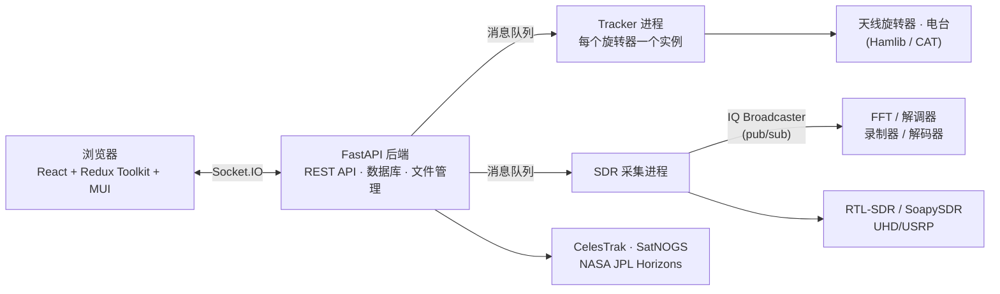

# Ground Station：把整座卫星地面站装进浏览器

先给判断：玩卫星接收的人手上通常摆着好几样工具——Gqrx 或 SDR# 负责收信号，Orbitron 之类负责算卫星什么时候过顶，dump1090 只解一种飞机信号，中间的空隙靠人肉衔接：盯着预报、掐着时间开软件、手动调频率。Ground Station（`sgoudelis/ground-station`）把这条链路整个搬进一个 Web 界面：轨道预报、天线指向、多普勒校正、SDR 接收、解码、录制归档，一次配好之后，「哪颗卫星几点过境」就从日历上的提醒变成自动执行的任务。

README 对它的自述是：一个开源、基于浏览器的应用，用于跟踪卫星和天体目标、控制地面站硬件、接收并解码录制 SDR 信号——面向业余无线电操作员、卫星爱好者和研究人员。

它是一个 0.x 早期的项目，但已经长到 4,825 stars、841 forks（2026-10-05 取自 GitHub API），仓库创建于 2025 年 3 月。版本节奏很快：仅 2026 年 9 月就从 v0.8.7 发到 v0.8.16，十个版本。本文数据以当日的 README 与 GitHub API 为准。

## 项目坐标

| 维度 | 信息 |
|------|------|
| 仓库 | [sgoudelis/ground-station](https://github.com/sgoudelis/ground-station) |
| 定位 | 浏览器端地面站套件：卫星/天体跟踪 + SDR 接收解码 + 硬件控制 |
| Stars / Forks | 4,825 / 841（2026-10-05，GitHub API） |
| 许可证 | GPL-3.0 |
| 技术构成 | JavaScript 约 60%（React 前端）、Python 约 40%（FastAPI 后端与 worker） |
| 最新版本 | v0.8.16（2026-09-30） |
| 贡献者 | 3 人（GitHub contributors 页） |

一个人主导、LLM 编码代理协助开发的项目。README 有专门的 AI 辅助开发声明：编码代理承担实现、调试、测试、文档和代码评审，维护者负责架构决策并对所有合入变更做最终审稿。DSP 组件（解调器、广播器、解码器）部分由 Claude 协助完成，源码中有明确标记。9 个月做出这种迭代密度，跟这种开发方式有直接关系。

## 系统地图：三层进程 + 硬件 + 外部数据

整体是「浏览器 — 后端 — worker 进程群」三层，中间全部走 Socket.IO 和消息队列：



| 层 | 技术 | 职责 |
|------|------|------|
| 前端 | React + Redux Toolkit + Material-UI，Leaflet/MapLibre 地图 | 轨道地图、瀑布图、音频监听、解码输出展示、设备管理 |
| 后端 | Python FastAPI + Socket.IO + SQLAlchemy | WebSocket 通信、worker 编排、TLE 拉取、录制与文件管理、解码器生命周期 |
| Worker | Python 独立进程 | 轨道跟踪、IQ 采集、FFT、解调、解码、录制、本地/远程硬件探测 |
| 硬件层 | Hamlib 旋转器、CAT 电台、各类 SDR | 物理收发与指向 |
| 外部数据 | CelesTrak、SatNOGS DB、JPL Horizons | TLE 轨道根数、发射机信息、深空天体星历 |

轨道计算分两条线：近地卫星用 CelesTrak 拉取的 TLE 根数，本地跑 Skyfield/SGP4 传播；太阳系天体和深空任务目标走 NASA JPL Horizons 的星历向量，配了带降级回退的同步机制。前端地图除基础底图外还接了 NASA GIBS 图层（Blue Marble、地形、夜光、MODIS/VIIRS 逐日影像）。

## 关键机制

### IQ Broadcaster：一份数据喂四类消费者

SDR 采集进程产出的原始 IQ 样本流是整个系统最贵的资源，Ground Station 用发布/订阅模式分发：IQ Broadcaster 给每个订阅者独立的队列和深拷贝样本，FFT 处理（瀑布图）、解调器、IQ 录制器、原始 IQ 解码器（BPSK/GMSK）可以同时消费同一路信号。慢消费者直接丢消息，不阻塞生产者——「边看瀑布、边录音、边解码」能并行不互相拖垮，靠的就是这个设计。

解调器分普通和内部两种模式：普通模式把音频送给用户播放；内部模式专为解码器服务，解调出的音频再经 Audio Broadcaster 分发，一路给解码器、一路给浏览器实时监听。README 给的 SSTV 链路是这条管线的完整示例：SDR → IQ Broadcaster → 内部 FM 解调器 → Audio Broadcaster → SSTV 解码器出图，同时浏览器里能听着声。

### 跟踪与硬件控制：从算出位置到指向天线

Tracker 进程用 SGP4 算出目标的方位角/仰角，驱动 Hamlib 兼容的旋转器连续转向，带限位检查和防抖动的重定向逻辑——每个旋转器对应一个独立 tracker 实例，多目标可以并行跟（`target-N` 槽位，各自有独立运行时状态）。电台侧走 rigctld/Hamlib，跟踪过程中对 RX/TX 频率做多普勒校正；对 L 波段以上的卫星信号，不做校正几秒钟就漂出接收带宽，这是能不能收到稳收好的关键一环。

### 自动观测：把过境变成定时任务

这是项目里最「自动化」的部分，README 用了整整两节描述：

- **监控模板**：为关心的卫星定义硬件配置、信号参数和任务组合，系统自动为所有符合条件的过境生成观测任务。
- **过境计算与调度**：按最低仰角、前瞻窗口算出未来过境，APScheduler 在 AOS（信号捕获）时刻自动启动、LOS（信号消失）时刻停止。
- **任务组合**：一次观测可以并行挂 IQ 录制（SigMF）、WAV 录音、协议解码（AFSK/GMSK/SSTV）和 AI 转写。
- **硬件编排**：观测期间自动控制 SDR、旋转器（含跟踪）和电台（含多普勒校正）。
- **多 SDR 并行**：自动观测占一台 SDR，你可以用另一台在同一次过境上同时监听、解码，互不干扰；共用一台时可以旁听，但动中心频率会影响正在跑的观测。
- **状态管理**：六态跟踪（scheduled / running / completed / failed / cancelled / missed），旧观测自动清理。自动观测跑在隔离的内部 VFO 会话里（命名空间 `internal:<observation_id>`）。

### SigMF 录制与回放：格式标准，链路复用

录制采用 SigMF 标准（`.sigmf-data` 数据文件 + `.sigmf-meta` 元数据），自动写入中心频率、采样率、时长和目标卫星的 NORAD 编号，附带瀑布图 PNG 快照；参数变化会切成独立的 capture segment。回放时录制文件以「SigMF Playback」虚拟 SDR 的身份出现在设备列表里，走和实时接收完全相同的解调、解码管线——录制的东西事后能重新解码，时间线上可以拖动定位。IQ 录制还可以交给 SatDump 做后处理，README 点名支持 METEOR LRPT/HRPT 气象管线。

### 解码与转写：标注成熟度再看

解码能力要分层看，README 自身的标注很诚实：

- **已落地**：SSTV 图像解码；APRS 有专用 raw-IQ 解码路径（集成 NBFM/Bell 202 解调、AX.25 解析、批边界恢复）；FSK/GFSK/GMSK/BPSK/GNSS 有解码路径，包管线支持 AX.25/USP/GEOSCAN 帧。
- **开发中**：架构图里 AFSK 包解码器、LoRa/GMSK 解码器标着 WIP。
- **AI 转写**：解调音频可接 Gemini Live 或 Deepgram 做实时转写，支持翻译，产物落在 `backend/data/transcriptions/`。对着卫星下行链听不清的内容，转写出来的文本可搜可存。

## 一次自动过境的完整流转

用 METEOR 气象卫星串一遍系统（机制全部来自 README，具体参数是示意）：

1. **配模板**：在 Monitored Satellites 里给 METEOR-M2 建监控模板——RTL-SDR、最低仰角 30 度、任务勾选 IQ 录制 + SatDump 后处理。
2. **等调度**：后端从 CelesTrak 同步 TLE，SGP4 算出明天上午有一次最高仰角 47 度的过境，自动生成一条 scheduled 观测。
3. **AOS 启动**：到点后 APScheduler 触发——tracker 开始驱动旋转器转向卫星，SDR 采集进程起流，IQ Broadcaster 把样本分发给 FFT 和录制器，浏览器里能看到实时瀑布。
4. **录制归档**：IQ 以 SigMF 格式落盘，元数据自动带上卫星名和 NORAD ID，瀑布快照一并保存。
5. **LOS 收尾**：信号消失后自动停止，观测转入 completed，可选触发 SatDump 的 LRPT 管线出气象云图。
6. **事后回放**：文件浏览器里找到这次录制，回放走同一条解码管线重新出图；时间线拖到任何位置都能重跑。

全程没有人盯守。同类桌面软件里，接收归 Gqrx，预报归 Orbitron，气象解码归 SatDump 命令行——Ground Station 的差异恰恰是把这三段缝在一起。

## 部署：两条 Docker 命令的事

官方提供多架构预构建镜像（amd64/arm64），Web 界面在 7000 端口。桥接模式即可用本地 SDR：

```bash
docker pull ghcr.io/sgoudelis/ground-station:<version>

docker run -d \
  --platform linux/amd64 \
  -p 7000:7000 \
  --name ground-station \
  --restart unless-stopped \
  --device=/dev/bus/usb \
  --privileged \
  -v /path/to/data:/app/backend/data \
  ghcr.io/sgoudelis/ground-station:<version>
```

要用 mDNS 自动发现局域网里的 SoapySDR 远程服务，改用 host 网络模式（`--network host`，去掉端口映射），README 把这种标为推荐选项。其余要点：

- **USB 权限**：直插的 RTL-SDR 等设备需要主机侧 udev 规则，步骤见仓库 `docs/SDR_HOST_SETUP.md`。
- **数据目录**： recordings、配置都在容器的 `/app/backend/data`，务必挂载到宿主机。
- **树莓派**：官方只推荐 Raspberry Pi 5。
- **SDRplay 用户注意**：镜像内置的是旧版 RSP API v3.15（专有软件），构建或分发镜像前需要确认其 EULA。
- **配置**：运行时配置在 `backend/data/configs/app_config.json`，UI 里可改；优先级为 CLI 参数 > 配置文件 > 内置默认，UI 会标出哪些值被 CLI 覆盖、哪些改动要重启。
- **公网暴露**：要上 TLS 反代，参考仓库 `deploy/nginx/README.md`。

从源码构建也只需 `docker build -t ground-station .`；开发环境搭建见 `DEVELOPMENT.md`。

## SDR 硬件支持

| 硬件 | 接入方式 | 备注 |
|------|----------|------|
| RTL-SDR | USB 或 rtl_tcp | 入门主力，$20 量级 |
| Airspy / Airspy HF+ | 原生 worker | HF+ 官方标注未经测试 |
| SoapySDR 系列 | 本地或 SoapyRemote | RTL-SDR、Airspy、HackRF、HydraSDR、LimeSDR、MiriSDR、PlutoSDR、UHD/USRP、SDRplay RSP |
| UHD/USRP | UHD worker | 专业档 |
| SigMF Playback | 虚拟设备 | 回放录制文件，走完整处理管线 |

缺哪款 SoapySDR 设备，README 的态度是开 issue 提需求。

## 适用边界与采用建议

**适合现在就上**：手头有 RTL-SDR 或更好的接收设备、想无人值守记录卫星过境的业余无线电爱好者和研究者——它的自动化观测直接命中「过境总在半夜」这个痛点；想学地面站工程的人也值得读它的架构图和 DSP 管线，这套「后端 + worker + pub/sub」的组织方式本身就是好教材。

**可以等等**：依赖特定解码器的人。SSTV 和 APRS 已落地，但 AFSK、LoRa 等还在 WIP，下结论前先对照当前 release notes；SDRplay 用户要先过 EULA 这一关。

**不必硬上**：没有任何接收硬件的纯旁观者——虽然有 SigMF 回放，但你得先有录制；想把它直接暴露公网对外提供服务的团队也不合适，README 明确它的安全边界是「可信私网 + 可信管理员」的业余用途。

**与邻居的分工**：Gqrx/SDR# 是纯接收软件，不带轨道预报和自动化；SatDump 专注解码本身（Ground Station 把它集成为后处理环节）；SatNOGS 走的是网络化分布式地面站的路线，Ground Station 的卫星发射机信息也来自 SatNOGS API。单点功能每样都有更成熟的工具，Ground Station 押注的是闭环：从「卫星几点过境」到「气象图躺进文件浏览器」，中间不需要人。就目前 4,800+ 星的走势和它几乎每两天一个版本的迭代速度，这个押注值得持续跟踪。

## 数据口径

本文事实核查基于 2026-10-05 的 GitHub API（stars/forks/语言构成/许可证/贡献者）与仓库 main 分支 README（功能清单、架构图、Docker 部署、硬件支持、版本历史 v0.8.7–v0.8.16）。文中一次自动过境为按 README 机制串联的示意流程，参数为虚构示例；本文未实测任何硬件，部署细节以官方文档为准。
