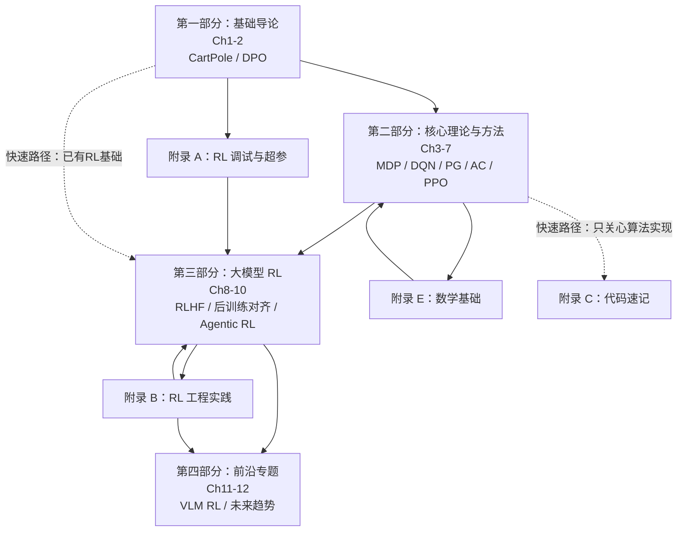

## 学习目标

读完本文后，你应该能够：

- 理解 *Hands-on Modern RL* 的课程定位：它把经典 RL（Sutton 路线）和大模型 RL（RLHF → GRPO → Agentic RL）统一在同一个框架下
- 对照四大部分（基础、核心理论、大模型 RL、前沿专题）判断自己应该从哪章开始读
- 解释 PPO clipping 和 GAE 的协同关系——一个防策略崩塌，一个降回报估计方差
- 区分 RLHF、DPO、GRPO、RLVR 各自解决了什么问题、又在什么场景下会互相替代
- 为自己或团队制定一个分角色（入门者 / 大模型工程师 / 研究者）的学习计划

## 目录

1. [谁在做这件事](#谁在做这件事)
2. [课程的整体结构](#课程的整体结构)
3. [附录的设计](#附录的设计)
4. [这门课的几个设计细节](#这门课的几个设计细节)
5. [怎么用这个课程](#怎么用这个课程)
6. [和同类资源的对比](#和同类资源的对比)
7. [常见问题（FAQ）](#常见问题faq)
8. [自检测试](#自检测试)
9. [练习](#练习)
10. [进阶路径](#进阶路径)

---

2022 年 ChatGPT 诞生之后，RLHF（Reinforcement Learning from Human Feedback）从学术概念变成了普通开发者也能实践的工程方法。随后两年，PPO、DPO、GRPO、R1-Zero、RLVR 等后训练范式陆续登场，每一个都在重新定义"模型应该怎么教"。

问题在于，市面上的 RL 教程要么太偏理论、要么只有 API 调用，少有人能把从老虎机（Bandit）到 RLHF 全流程、从 CartPole 到 VLM RL 的路径打通。WalkingLabs 的 *Hands-on Modern RL* 试图解决这个问题。

这是一个免费开源的双语课程，GitHub 仓库地址 `walkinglabs/hands-on-modern-rl`，目前已有数千 Stars，课程文档全部公开，包含 12 个章节、4 个附录，涵盖从 MDP 基础到 VLM 强化学习的完整学习路径。

---

## 谁在做这件事

WalkingLabs 并不是某家大公司的官方项目。从 GitHub 页面的作者署名来看，这是一个由研究者和工程师组成的独立团队做的课程项目，署名机构包括 CMU、耶鲁、OSU 等高校的研究者。

他们没有选择发论文然后开源一个半成品，而是直接做了一个完整的在线文档站，简体中文和 English 两套内容同步维护，导航结构一致。这在独立教学项目中不多见。

---

## 课程的整体结构

课程分四大部分，共 12 个正式章节，辅以四个附录（调试、工程实践、代码速记、数学基础）。下面这张图标出了各部分之间的依赖关系和建议学习路径：

四条附录支撑主线教学，不是可选的扩展阅读而是被课程正文频繁引用。最实用的阅读顺序是"正文走到哪、附录跟到哪"。

### 第一部分：基础导论

从 CartPole 倒立摆入手，先让读者在 Gym 环境里跑起来，验证"强化学习真的在工作"。随后引入 DPO（Direct Preference Optimization）偏好微调，用比 RLHF 更轻量的方式解释后训练的基本逻辑。

CartPole 和 DPO 放在一起不是巧合——课程在第一篇就暗示：强化学习的核心不是某个具体算法，而是"定义奖励、收集数据、更新策略"这套循环。这套逻辑从 CartPole 到 RLHF 一脉相承。

### 第二部分：核心理论与方法

这是课程最重的部分，覆盖 MDP 价值函数、贝尔曼方程、DQN、策略梯度、Actor-Critic、PPO。

几个有意思的处理方式：

**策略梯度不是凭空讲 REINFORCE**。讲完价值函数、V 函数、Q 函数之后，顺着"从价值到策略"这条线引出来——策略是动作的概率分布，价值是长期期望回报，当你想直接优化策略而不是拟合价值函数时，策略梯度就是自然的起点。

**Actor-Critic 的引入顺序**：先用优势函数（Advantage）降低方差，然后讲 Critic 如何训练 value function，再用 Actor 用梯度更新策略——最后才把它们合起来成为 Actor-Critic。这个顺序比直接给公式要更直觉。

**PPO 讲了 trust region clipping 和 GAE**。这两个机制通常被分开讲，但课程把它们放在同一节——因为它们解决的是同一个问题的不同方面：裁剪解决策略更新过大，GAE 解决回报估计的方差。

### 第三部分：大模型 RL

这部分是整个课程的精华所在，也是它和其他 RL 课程拉开距离的地方。

**第 8 章 RLHF 全流程**从 Base 模型到对齐助手讲起，覆盖 SFT 指令微调、奖励模型、PPO-RLHF 对齐，最后到 veRL 框架实战 GSM8K。整个流水线走完，读者能理解为什么 RLHF 不是"训练"而是"对齐"。

**第 9 章后训练对齐**是近年来少有的系统化梳理：DPO 家族、GRPO 训练、R1-Zero 范式、RLVR（可验证奖励），再到 OPD 在线蒸馏、工业后训练实践。这章特别适合那些看过论文但在代码实现上卡住的人。

**第 10 章 Agentic RL**讲的是多轮交互、工具调用、Agent 数据制造（SWEBench/SWE-Smith）、DeepCoder 和金融问答 Agent 的实战。最后一节还给出了构建 Agentic RL 训练系统的思路——这部分在公开资料里极少被系统整理。

### 第四部分：前沿专题

**第 11 章 VLM 强化学习**：用视觉语言模型做 RL，涵盖 VLM GRPO 训练、视觉奖励信号挑战、VLM RL 推理框架，以及 GeoQA 几何推理实战。2025-2026 年这个方向热起来，但公开教程极少——这章是少数能把工程细节讲出来的。

**第 12 章未来趋势**：具身智能、模型式强化学习、自我博弈、多智能体、离线 RL、规模化趋势。最后这章不是泛泛的趋势预测，对每个方向的论文脉络和技术瓶颈做了整理。

---

## 附录的设计

四个附录不是可有可无的补充。其中最有价值的是**附录 B：RL 工程实践**和**附录 E：强化学习的数学基础**。

**B.1 训练系统底座**：数据并行、流水线并行、模型并行的取舍标准，分布式训练中的梯度同步，这部分内容在论文里很少被系统整理，却是工业落地的必需品。

**B.2 Agent 沙箱**：多智能体系统中如何隔离执行环境、避免 Prompt Injection，这部分直接对应 Agentic RL 训练的核心挑战。

**E.4 信息论与分布距离**：KL 散度在 RLHF 和 DPO 中的实际意义，互信息在探索中的作用——这部分把信息论和 RL 的关系讲清楚了，而不只是给公式。

---

## 这门课的几个设计细节

**双语并排**：中英文内容一一对应，导航结构完全一致。对于英文文献读不顺、但中文资料又不够新的读者，这个设计解决了实际痛点。

**动手实验贯穿全程**：几乎每个章节都有"动手"环节——CartPole、LunarLander、Pendulum、BipedalWalker、GSM8K、GeoQA——不是点缀，是验证理论理解的核心手段。环境选用的是 Gymnasium（原 OpenAI Gym 的维护分支），代码统一用 PyTorch，第三章开始就需要一块 GPU（T4 即可入门，A100 跑 RLHF 和 VLM RL 部分）。

**数学基础不跳过**：附录 E 的存在本身就是一种立场——强化学习不是调 API，它有完整的数学体系。如果你在其他课程里被贝尔曼方程的矩阵形式绕晕过，附录 E.1 的线性代数部分值得认真做一遍。

**代码速记（C 附录）**：把 SFT/KL、PPO/GAE、DPO 家族、GRPO、Softmax/CrossEntropy、采样方法、注意力机制、DAPO 的核心公式整理成速查表，用的时候直接翻，不用重复推导。

---

## 怎么用这个课程

如果你是**强化学习入门者**（有基础 ML 知识，但没有 RL 经验）：建议按顺序从第 1 章读到第 7 章，配合 Gym 环境把每个实验跑通。第 2 章的 DPO 可以先跳过，等有 RLHF 背景之后再看第 9 章。

如果你是**大模型工程师**：第 8、9、10 章是核心，按自己的后训练阶段选择对应的章节。如果你在做 Agent 系统，B.2 Agent 沙箱和第 10 章的工具调用部分直接相关。

如果你是**研究者**：第 9 章后半段（GRPO/R1-Zero/RLVR）、第 11 章 VLM RL、第 12 章未来趋势的价值在于帮你快速建立工业实践的直觉，弥补纯论文视角的盲区。

---

## 和同类资源的对比

| 维度 | Sutton & Barto | spinningup (OpenAI) | Hands-on Modern RL |
|------|--------------|-------------------|-------------------|
| 覆盖范围 | 经典 RL 理论为主 | 经典 RL 核心算法 | 经典 RL + RLHF + Agentic RL + VLM RL |
| 工程内容 | 无 | 极少 | 大量（代码实战 + 工程实践附录） |
| 数学深度 | 最高 | 中等 | 中等偏高（附录支撑） |
| 更新频率 | 低 | 停止维护 | 持续更新 |
| 中文支持 | 无 | 无 | 完整双语 |

这门课本质上是把 RL 分成了两条线：一条是 Sutton 意义上的经典 RL，从 Bandit 到 MDP 到 DQN/PPO；另一条是 2022 年之后才出现的大模型 RL，从 RLHF 到 GRPO/R1-Zero 再到 Agentic RL。两条线在课程里被统一在同一个框架下，没有割裂。

---

## 常见问题（FAQ）

**Q1：这门课适合什么样的读者？和传统 RL 课程有什么本质区别？**

适合三类人：有基础 ML 知识但没深入接触过 RL 的入门者；已经在做 LLM 后训练但想补理论地基的工程师；需要快速建立工业 RL 直觉的研究者。

和 Sutton & Barto 的区别在于，S&B 是"历史全景"——从 TD-learning 的神经科学起源讲到各种算法变体；这门课是"现在和未来的最短路径"——只保留必要理论，快速切到 RLHF 和 Agentic RL 战场。和 Spinning Up 的区别在于，Spinning Up 停留在 2018 年的经典算法，没有覆盖大模型时代的新范式。

**Q2：需要多扎实的数学基础？**

核心需要：微积分（链式法则、梯度下降）、概率论（期望、条件概率、贝叶斯）、线性代数（矩阵运算、特征值、SVD）。如果你上过一门正经的 ML 入门课，这些应该够用。

课程附录 E 已经把这部分整理好了——读完它不需要额外找教材。真正卡人的不是"看不懂公式"，而是"看到公式就开始跳过"。如果你能接受一行一行地啃附录 E.1 的矩阵推导，后面的贝尔曼方程和策略梯度都不会是问题。

**Q3：完整学完大概需要多长时间？**

按每周投入 10-15 小时估计：

- 第一部分（Ch1-2）：1 周，跑通 CartPole 和 DPO 实验
- 第二部分（Ch3-7）：3-4 周，这部分是理论高峰，MDP + DQN + PPO 需要反复消化
- 第三部分（Ch8-10）：3-4 周，RLHF 和 Agentic RL 的计算量和代码量都大
- 第四部分（Ch11-12）：1-2 周，浏览趋势和论文脉络

总计约 10 周。如果只关心大模型 RL（有经典 RL 基础），可以从第 8 章切入，4-5 周拿下核心内容。如果只是为了建立概念理解而不跑实验，2-3 周也能过完一遍。

**Q4：实操环境有什么硬性要求？**

最低配置：任意 Python 3.9+ 环境 + CPU 即可跑完第一部分（CartPole、LunarLander）。

第二部分开始需要 GPU：DQN 和 PPO 的 Atari 实验在 T4 上跑得动，但 BipedalWalker 的 PPO 训练在单卡上可能需要几小时。

第三部分是真正的计算门槛：RLHF 全流程（第 8 章）在单卡 A100 上从 Base model 到对齐助手大约需要 1-2 天。第 9 章的 GRPO 实验和 veRL 框架对多卡更友好但单卡也能跑简化版。如果你没有 A100，可以用 Colab Pro+ 的 A100 实例或者 Lambda Labs 的按需租用。

第四部分的 VLM RL 实验显存需求更大（视觉编码器 + 语言模型），建议至少 40GB 显存。

**Q5：课程中提到的 veRL 框架是什么？需要提前学吗？**

veRL（Versatile Reinforcement Learning）是课程第 8 章实战部分使用的分布式 RL 训练框架，基于 Ray 和 vLLM 构建，专门为 LLM 的 PPO-RLHF 设计。不需要提前学——课程里会给出完整的 setup 脚本和训练配置。建议先理解 PPO 的数学结构再碰 veRL 的代码，否则容易变成"跑通了但不知道跑的是什么"。

**Q6：Agentic RL 和传统 RL 在训练循环上有什么本质不同？**

传统 RL 的训练循环是"环境 → 状态 → 动作 → 奖励 → 下一状态"。Agentic RL 在这个循环上叠了一层：动作空间不再是离散或连续的动作向量，而是自然语言输出 + 工具调用，奖励也不是环境自动返回的标量，而是需要 LLM-as-Judge 或结构化验证器（如测试用例通过率）来生成。Agentic RL 的训练稳定性因此远比传统 RL 脆弱——课程第 10 章花了不少篇幅讨论这个问题。

**Q7：看完这门课之后，下一步应该看什么？**

取决于你的方向：

- 做大模型后训练 → 直接读 DeepSeek-R1、Llama 3/4 的技术报告，对照第 9 章的代码实现
- 做 Agent 系统 → 深入 SWE-bench、AgentBench 等评测基准，读 Tool-augmented RL 的最新论文
- 做具身智能 / Robotics → 从第 12 章的具身智能部分出发，跟 Isaac Lab 和 ManiSkill 的教程
- 做 RL 理论研究 → 回到 Sutton & Barto 补完整理论体系，然后读 Sergey Levine 的 CS285 课程

---

## 自检测试

学完课程后，试着回答以下问题。如果你能独立写出每个问题的答案（不需要翻资料），说明你真的掌握了。

1. **MDP 五元组**：用自己的话定义 MDP 的五个要素（S, A, P, R, γ），给一个 CartPole 之外的例子——比如一个外卖配送调度场景——写出它的状态空间、动作空间和奖励函数。

2. **PPO clipping 机制**：写出 PPO 的 clipped surrogate objective 公式，解释为什么在 `1-ε` 和 `1+ε` 之间裁剪概率比能防止策略崩塌。如果去掉 clipping，只靠 KL 惩罚，会出现什么问题？

3. **RLHF 完整数据流**：从 Base 语言模型出发，画出 RLHF 整个流水线的数据流向——SFT 阶段数据从哪来、Reward Model 怎么训练、PPO 阶段 Reference Model 和 Policy Model 的 KL 散度加在哪、最终产出的对齐模型和最初的 Base 模型在参数层面的关系是什么。

4. **GRPO vs PPO**：说清楚 GRPO 和 PPO 的核心差异。GRPO 为什么可以扔掉 Critic（Value Function）？它用什么替代了 GAE 来估计优势？这样做在什么场景下有优势、什么场景下会出问题？

5. **Agentic RL 训练循环**：从头到尾描述一个 coding agent 的 Agentic RL 训练步骤——rollout 阶段 agent 如何与代码执行环境交互、奖励信号从哪里来（测试通过率？LLM-as-Judge？）、policy gradient 的 loss 是怎么计算的、和标准的 PPO-RLHF 在实现上的 2-3 个关键差异。

6. **Value-based vs Policy-based vs Actor-Critic**：给这三类方法各举两个算法，说明它们在"要不要显式维护价值函数"和"能不能处理连续动作空间"上的区别。如果让你在 MuJoCo 的 Humanoid 任务上选方法，你选哪个？为什么？

7. **RLVR 的核心思想**：RLVR（Reinforcement Learning with Verifiable Rewards）和标准 RLHF 的关键区别是什么？为什么 DeepSeek-R1 选择 RLVR 而不是传统的 Reward Model？用一句话概括："RLVR 解决的问题实际上是 _______"。

8. **离线 RL 为什么难**：用最简单的语言解释——为什么在固定数据集上做 RL（不与环境交互）比在线 RL 更难？分布偏移（distribution shift）在这里起了什么作用？课程第 12 章提到的 CQL（Conservative Q-Learning）是怎么缓解这个问题的？

---

## 练习

### 练习 1：跑通 CartPole 并改动奖励函数

1. 按照课程第 1 章的指引，在 Gymnasium 中跑通 CartPole-v1
2. 修改奖励函数：让杆子每保持直立 1 步奖励 +0.1（而不是默认的每步 +1），观察训练收敛速度的变化
3. 记录：改动后策略有什么不同？杆子倒下之前能撑多少步？

### 练习 2：对照论文复现 DPO 损失函数

1. 精读课程第 2 章和 Rafailov et al. 的 DPO 原始论文
2. 不调用 `trl` 或 `peft` 等高层库，用 PyTorch 从零实现 DPO 损失函数
3. 在一个小模型（如 GPT-2 117M）上用偏好数据跑一个 epoch，观察损失下降曲线

### 练习 3：用 PPO 训练一个简单决策 agent

选一个非 RLHF 的场景（如股票择时、简单调度），完成：

1. 定义状态空间、动作空间、奖励函数
2. 用课程第 5-6 章的 PPO 实现（或 Stable-Baselines3）训练
3. 记录：训练过程中奖励曲线的波动情况，以及 GAE λ 参数对方差的影响

---

## 进阶路径

### 如果你是完全入门者（0 基础 → 能跑通课程实验）

1. 先补 ML 基础（Andrew Ng 的 Coursera 课程或李宏毅《机器学习》）
2. 按顺序学完课程第 1-7 章，每个实验至少跑通一次
3. 阶段目标：能独立解释 MDP、Q-learning、Policy Gradient、PPO 的区别

### 如果你是大模型工程师（已有 RL 基础 → 能做后训练对齐）

1. 重点攻克第 8-10 章，对照 DeepSeek-R1、Llama 3/4 技术报告
2. 在 veRL 或 Open-Instruct 框架上跑一个自己的后训练实验
3. 阶段目标：能为一个 7B 模型做一轮完整的 RLHF 或 DPO 对齐

### 如果你是研究导向（理解前沿 → 能做原创研究）

1. 第 9 章（GRPO/R1-Zero/RLVR）和第 11 章（VLM RL）是起点
2. 跟进 2025-2026 年的 RL+LLM 论文（arXiv 上搜索 `RLHF`、`GRPO`、`Agentic RL`）
3. 阶段目标：能在课程框架内提出一个可验证的改进假设，并设计实验验证

---

## 参考链接

- 课程主页：https://walkinglabs.github.io/hands-on-modern-rl/
- GitHub 仓库：https://github.com/walkinglabs/hands-on-modern-rl