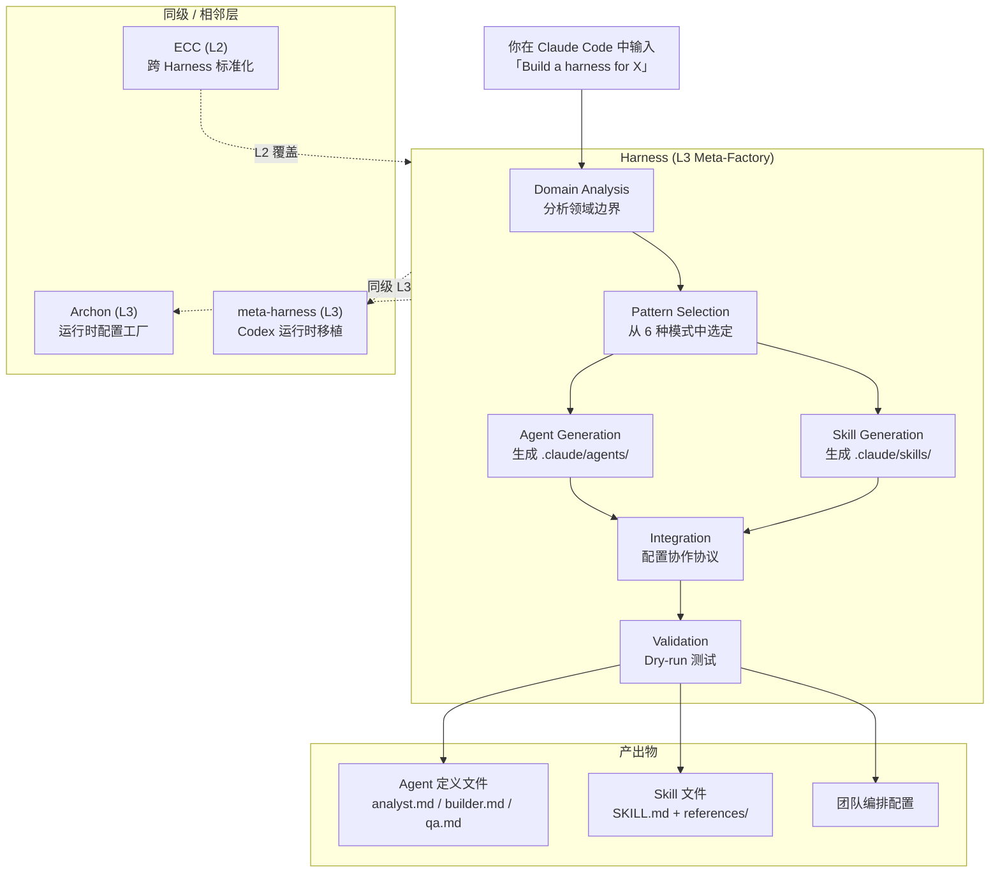
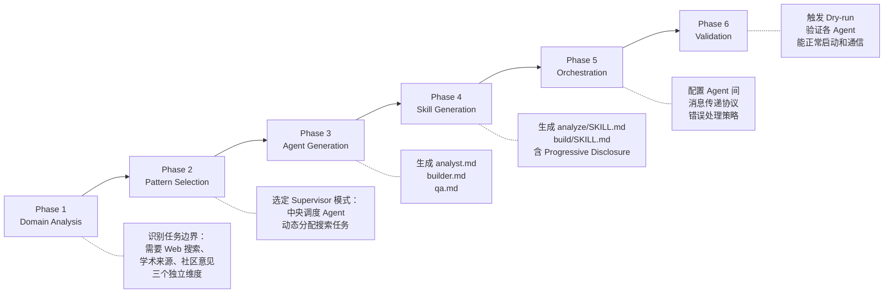

Harness 做的事不复杂：你在 Claude Code 里输入一句「为此项目构建 Harness」，它分析你的领域描述，选定一种团队架构模式，生成一套可运行的 Agent 定义和配套 Skill。它不是某一个具体任务的 Agent，而是一个生成 Agent 团队的工厂——Anthropic 生态里的叫法是 **L3 Meta-Factory，Team-Architecture Factory**。

读完这篇文章，你至少能回答几个问题：

- 6 种多 Agent 协作模式各自适合什么场景，怎么选
- Harness、Archon、ECC 三者在同一层，各自的边界在哪
- 作者 A/B 实测数据（+60% 质量、-32% 方差、15/15 胜率）在测什么、不能推出什么
- 拿到手之后第一件事该做什么

| → | [系统地图](#系统地图) | [6 种模式](#6-种团队架构模式) | [任务流](#一次完整任务流) | [执行模式](#执行模式agent-teams-vs-subagents) | [实战用例](#实战用例) | [实测数据](#实测数据) | [FAQ](#faq) | [自测](#自测)

## 系统地图



图上最关键的信息：Harness 和 Archon 同在 L3 层但做不同的事。Archon 生成确定性运行时配置，Harness 生成多 Agent 团队架构。选了 Archon ≠ 不需要 Harness，反之亦然——它们可以串联（Harness 设计架构 → Archon 部署运行时）。

## 系统分层

| 层级 | 说明 | 代表项目 |
|------|------|---------|
| L1 | 单任务 Agent | — |
| L2 | 跨 Harness 工作流标准化 | [affaan-m/ECC](https://github.com/affaan-m/everything-claude-code) |
| **L3 — Runtime-Configuration Factory** | 生成确定性运行时配置 | [coleam00/Archon](https://github.com/coleam00/Archon) |
| **L3 — Team-Architecture Factory** | **生成多 Agent 团队架构（Harness）** | [revfactory/harness](https://github.com/revfactory/harness) |
| L3 — Codex Runtime Port | Codex 运行时移植 | [SaehwanPark/meta-harness](https://github.com/SaehwanPark/meta-harness) |

## 6 种团队架构模式

Harness 预置了 6 种模式，选定逻辑不复杂：看你的任务是有先后依赖，还是可以并行；是需要人工审查，还是需要动态调度。

| 模式 | 怎么工作 | 什么时候用 |
|------|---------|-----------|
| **Pipeline** | Agent A 的输出是 Agent B 的输入，链式传递 | 任务有明确的先后依赖——比如「设计 → 开发 → 测试」 |
| **Fan-out/Fan-in** | 多个 Agent 同时处理不同子任务，结果汇总到一个 Agent | 子任务互不依赖——比如同时对代码做安全审查、性能分析和风格检查 |
| **Expert Pool** | 协调 Agent 根据任务上下文从专家池中选最合适的一个 | 任务类型多样，同一个入口可能触发不同领域的专家 |
| **Producer-Reviewer** | 一个 Agent 生成内容，另一个 Agent 审查质量 | 对输出质量有明确把关需求——比如文档生成、代码审查 |
| **Supervisor** | 中央调度 Agent 接收任务、拆解、分配给下属 Agent | 任务复杂度高，需要动态决策——比如深度研究、营销策划 |
| **Hierarchical Delegation** | 父 Agent 拆解任务后递归委托给子 Agent | 任务本身是多层级的——比如数据管道设计（Schema → ETL → 验证 → 监控） |

按复杂度递进：Pipeline 和 Fan-out 最结构化，适合流程明确的任务；Expert Pool 和 Producer-Reviewer 引入了一定的选择逻辑；Supervisor 和 Hierarchical Delegation 适合需要动态决策的开放式任务。

## 一次完整任务流

以「深度研究」场景为例，从输入一句话到拿到可用的 Agent 团队：



6 个 Phase 走完，`.claude/` 目录下多了一套可用的 Agent 定义和 Skill 文件：

```
your-project/
├── .claude/
│   ├── agents/
│   │   ├── analyst.md      # 搜索 + 分析 Agent
│   │   ├── builder.md      # 报告生成 Agent
│   │   └── qa.md           # 交叉验证 Agent
│   └── skills/
│       ├── analyze/
│       │   └── SKILL.md
│       └── build/
│           ├── SKILL.md
│           └── references/
```

## 执行模式：Agent Teams vs Subagents

Harness 生成 Agent 后有两种运行方式：

| 模式 | 机制 | 适用场景 |
|------|------|---------|
| **Agent Teams**（默认） | TeamCreate + SendMessage + TaskCreate，Agent 之间可以通信协作 | 2 个以上 Agent 需要协同 |
| **Subagents** | 直接调用 Agent 工具，无 Agent 间通信 | 一次性任务，不需要跨 Agent 协调 |

选择规则很简单：Agent 之间需要互相传消息 → Agent Teams；只是让不同 Agent 各干各的 → Subagents。

## Skill 的 Progressive Disclosure 设计

Harness 生成的 Skill 不会把所有上下文一股脑塞给 Agent。Progressive Disclosure（渐进披露）策略让 Agent 只看到当前步骤需要的信息——分析阶段只加载分析 Skill，构建阶段只加载构建 Skill。对于多 Agent 场景，这个设计比「大而全」的 Skill 更重要：每个 Agent 的上下文窗口本来就不大，再叠加上协作通信的 token 开销，不控制加载量会很快撞墙。

## 安装

**前置条件**：需要启用 Agent Teams 实验功能。

```bash
export CLAUDE_CODE_EXPERIMENTAL_AGENT_TEAMS=1
```

### 方式一：插件市场

```shell
/plugin marketplace add revfactory/harness
/plugin install harness@harness-marketplace
```

### 方式二：全局 Skill

```shell
cp -r skills/harness ~/.claude/skills/harness
```

## 实战用例

Harness 仓库提供了 8 个可直接复制使用的场景 prompt。以下是精简版——更完整的版本和英文/韩文对照见 [Harness 100](https://github.com/revfactory/harness-100)（100 套预配置 Agent 团队，跨 10 个领域）。

**深度研究**

```
Build a harness for deep research. I need an agent team that can investigate
any topic from multiple angles — web search, academic sources, community
sentiment — then cross-validate findings and produce a comprehensive report.
```

**全栈网站开发**

```
Build a harness for full-stack website development. The team should handle
design, frontend (React/Next.js), backend (API), and QA testing in a
coordinated pipeline from wireframe to deployment.
```

**代码审查与重构**

```
Build a harness for comprehensive code review. I want parallel agents
checking architecture, security vulnerabilities, performance bottlenecks,
and code style — then merging all findings into a single report.
```

**更多场景**：Webtoon 漫画制作、YouTube 内容策划、技术文档生成、数据管道设计、营销活动策划。完整版见 [Harness GitHub](https://github.com/revfactory/harness#use-cases----try-these-prompts)。

## 实测数据

Harness 作者在 [claude-code-harness](https://github.com/revfactory/claude-code-harness) 仓库做了一组 A/B 对照实验：15 个软件工程任务，对比「裸跑 Claude Code」和「加载 Harness 生成的 Agent 团队配置」的输出质量。

| 指标 | 无 Harness | 有 Harness | 变化 |
|------|-----------|-----------|------|
| 平均质量评分 | 49.5 | 79.3 | **+60%** |
| 胜率（With > Without） | — | 15/15 | **100%** |
| 输出方差 | — | — | **-32%** |

几个需要说清楚的地方：

1. **n=15，作者自测**。这不是第三方独立评测，样本量也不大。仓库明确标注了「third-party replications pending」。
2. **效果随任务复杂度递增**。基础任务提升 +23.8，进阶任务 +29.6，专家级任务 +36.2。任务越复杂，结构化 Agent 团队配置的增益越明显。反过来推——如果你的任务本来就简单（单个 Agent 就能搞定），Harness 的边际收益不大。
3. **测的是「输出质量评分」**，不是开发速度、token 消耗或工程师满意度。做内部试点时，建议补上这些维度。

## 插件结构

```
harness/
├── .claude-plugin/
│   └── plugin.json                  # 插件清单
├── skills/
│   └── harness/
│       ├── SKILL.md                 # 主 Skill 定义（6-Phase 工作流）
│       └── references/
│           ├── agent-design-patterns.md   # 6 种架构模式详解
│           ├── orchestrator-template.md   # 编排模板
│           ├── team-examples.md           # 5 个真实团队配置
│           ├── skill-writing-guide.md     # Skill 编写指南
│           ├── skill-testing-guide.md     # 测试与评估方法
│           └── qa-agent-guide.md          # QA Agent 集成指南
└── README.md
```

## 与同类工具的边界

- **Archon**（同 L3 层）：Archon 生成确定性运行时配置，Harness 生成多 Agent 团队架构。可以串联：用 Harness 设计团队结构 → 用 Archon 部署运行时。选 Archon 是「我需要可重复的运行时」，选 Harness 是「我需要设计协作结构」。
- **ECC**（L2 层）：跨 Harness 的技能和规则标准化层。当你需要管理多个 Harness 场景下的统一 CLAUDE.md、Hook 和 Skill 规范时用到 ECC。Harness 是生成器，ECC 是治理层。
- **meta-harness**（同 L3 层）：同一概念的 Codex 运行时移植版。Codex 用户不需要从头再来。
- **wshobson/agents**：一个 182 Agent + 149 Skill 的目录库。可以把它理解成零件库——Harness 设计团队结构，从它的目录里挑零件装上。
- **LangGraph**：不同赛道。LangGraph 做长时间运行、状态可恢复的编排；Harness 做 Claude Code 原生、轻量的团队架构生成。

## FAQ

**Q1: +60% 这个数字可靠吗？**

n=15，作者自测，不是第三方独立评估。仓库和论文里每次引用这个数字都标注了「n=15, author-measured, third-party replications pending」。做采用决策时，建议在自己团队里跑 2-4 周试点，用你自己的任务测你自己的数据。论文全文：*Hwang, M. (2026). Harness: Structured Pre-Configuration for Enhancing LLM Code Agent Output Quality.*

**Q2: 和 Archon 选哪个？**

不是二选一。Harness 生成 Agent 团队架构，Archon 生成确定性运行时配置——同一层的不同子方向。需要设计协作结构选 Harness，需要可重复的运行时选 Archon，需要两者串联就都装。

**Q3: 只支持 Claude Code 吗？**

当前官方运行时只支持 Claude Code。Codex 移植版 [meta-harness](https://github.com/SaehwanPark/meta-harness) 已公开，跨运行时脚手架 [harness-init](https://github.com/Gizele1/harness-init) 也在路上。Harness 选了「Claude Code 原生做深」而不是「多运行时做浅」的路线。

## 自测

1. 你的日常任务里，有多少是「单个 Agent 就能搞定」的？有多少是会因为上下文窗口不够、专注度下降而出错的？
2. 如果不确定选哪种模式，先用 Producer-Reviewer 试试——生成 + 审查是最通用的组合。你手头有没有适合这个模式的任务？
3. 你的团队有没有人在用 Archon 或 ECC？如果有人在用，Harness 可以和它们串联而不是替代。
4. 花 10 分钟把自己的一个常见任务写成 prompt，扔给 Harness 生成一套 Agent 配置。然后和裸跑的结果对比——你的任务复杂度在哪个区间，Harness 的增益符不符合你的预期？

## 参考

- [Harness GitHub](https://github.com/revfactory/harness)
- [Harness 100 — 100 套预配置 Agent 团队](https://github.com/revfactory/harness-100)
- [A/B 实测数据仓库](https://github.com/revfactory/claude-code-harness)
- [Claude Code Agent Teams 文档](https://code.claude.com/docs/en/agent-teams)
- [Archon](https://github.com/coleam00/Archon) · [ECC](https://github.com/affaan-m/everything-claude-code) · [meta-harness](https://github.com/SaehwanPark/meta-harness)