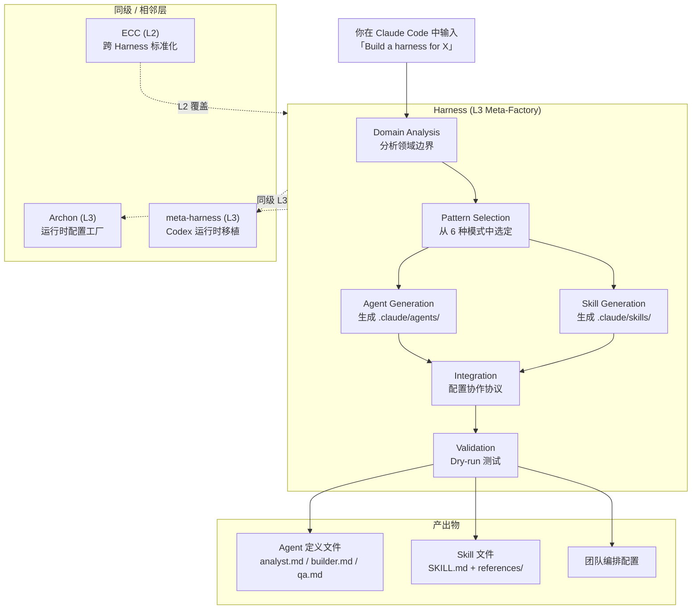
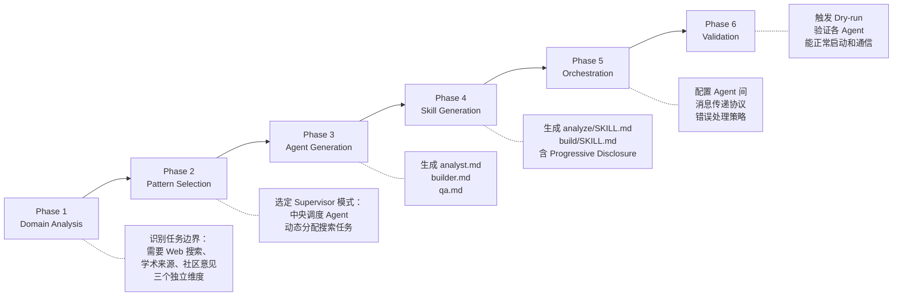

## 学习目标

读完本文后，你应该能够：

- 解释 Harness 的定位：它是 L3 层的 Team-Architecture Factory，生成「谁来干什么、怎么协作」而不是执行任务
- 对照 6 种协作模式（Producer-Reviewer、Supervisor、Hierarchical Delegation 等）判断哪种适合当前任务
- 区分 Harness（L3 生成器）、Archon（L3 运行时配置）、ECC（L2 治理层）各自解决什么问题
- 从一句领域描述出发，用 Harness 生成一套可运行的 Agent 定义和 Skill 文件
- 用 A/B 测试验证 Harness 配置在你的任务上是否真的带来提升

Harness 不是一个帮你完成某个具体任务的 Agent。它做的事情更底层：你告诉它「这个项目需要什么样的协作结构」，它读你的领域描述、挑一种团队架构模式，然后生成一套可运行的 Agent 定义和配套 Skill 文件。在 Anthropic 的 Agent 生态分层里，它被定位在 **L3——Meta-Factory（元工厂）层**，也就是「生成 Agent 团队的工厂」，而不是「一个 Agent」。

Harness 的 6 种协作模式和分层设计在实际使用中很容易被误读：有人把它当 Agent 用，有人分不清它和 Archon 该选哪个，也有人看了 +60% 的数据就认为所有场景都该上。下面把这几个关键问题依次拆开。

## 目录

- [系统地图：Harness 在整个生态里的位置](#系统地图harness-在整个生态里的位置)
- [系统分层：L1 到 L3 各层在做什么](#系统分层l1-到-l3-各层在做什么)
- [6 种团队架构模式：选型指南](#6-种团队架构模式选型指南)
- [一次完整任务流：从一句话到一套 Agent 团队](#一次完整任务流从一句话到一套-agent-团队)
- [执行模式：Agent Teams 还是 Subagents](#执行模式agent-teams-还是-subagents)
- [Progressive Disclosure：为什么 Skill 不能「大而全」](#progressive-disclosure为什么-skill-不能大而全)
- [安装与前置条件](#安装与前置条件)
- [实战用例：8 个可直接复制使用的 Prompt](#实战用例8-个可直接复制使用的-prompt)
- [实测数据：+60% 在测什么，不能推出什么](#实测数据60-在测什么不能推出什么)
- [插件结构](#插件结构)
- [与同类工具的边界](#与同类工具的边界)
- [故障排查](#故障排查)
- [FAQ](#faq)
- [自测](#自测)
- [采用建议：谁该先用，谁可以等等](#采用建议谁该先用谁可以等等)
- [参考](#参考)

## 系统地图：Harness 在整个生态里的位置

先看一张总览图。红色路径是 Harness 的主流程，虚线是同层或相邻层的项目关系。



这张图值得多看两眼的地方在于：Harness、Archon、meta-harness 都在 L3 层，但它们生成的东西完全不同。Harness 生成的是「谁来干什么、怎么协作」，Archon 生成的是「运行时的确定性配置」。选 Archon 不等于不需要 Harness，反过来也一样——两者可以串联：Harness 设计架构 → Archon 部署运行时。

## 系统分层：L1 到 L3 各层在做什么

理解这些层级的边界，能帮你判断 Harness 在你的工程链路里该放在哪里。

| 层级 | 说明 | 代表项目 |
|------|------|---------|
| L1 | 单任务 Agent——完成一件事 | — |
| L2 | 跨 Harness 工作流标准化：统一多个 Harness 场景下的 CLAUDE.md、Hook 和 Skill 规范 | [affaan-m/ECC](https://github.com/affaan-m/everything-claude-code) |
| **L3 — Runtime-Configuration Factory** | 生成确定性运行时配置（Archon） | [coleam00/Archon](https://github.com/coleam00/Archon) |
| **L3 — Team-Architecture Factory** | **生成多 Agent 团队架构（Harness）** | [revfactory/harness](https://github.com/revfactory/harness) |
| L3 — Codex Runtime Port | Codex 运行时移植 | [SaehwanPark/meta-harness](https://github.com/SaehwanPark/meta-harness) |

L2（ECC）和 L3（Harness）的关系值得单拎出来说：Harness 是生成器——你每次用它都是为一个新场景生成一套 Agent 配置。ECC 是治理层——当你手里攒了三五个 Harness 生成的团队配置之后，ECC 帮你统一它们的 Hook、Skill 加载规则和 CLAUDE.md 模板。两者解决的是不同阶段的问题：生成时的结构设计 vs 运营时的规范统一。

## 6 种团队架构模式：选型指南

Harness 预置了 6 种模式。选的依据不是「哪种更高级」，而是你的任务本身有没有先后依赖、能不能并行、需不需要人工审查。

| 模式 | 怎么工作 | 什么时候用 | 典型场景 |
|------|---------|-----------|---------|
| **Pipeline** | Agent A 的输出是 Agent B 的输入，链式传递 | 任务有明确的先后依赖 | 设计 → 开发 → 测试 |
| **Fan-out/Fan-in** | 多个 Agent 同时处理不同子任务，结果汇总到一个 Agent | 子任务互不依赖，可以并行 | 同时跑安全审查、性能分析和风格检查，汇总成一份报告 |
| **Expert Pool** | 协调 Agent 根据任务上下文从专家池中选最合适的一个 | 任务类型多样，同一个入口可能触发不同领域的专家 | 技术支持工单分发：根据问题类型路由到前端/后端/数据库专家 |
| **Producer-Reviewer** | 一个 Agent 生成内容，另一个 Agent 审查质量 | 对输出质量有明确把关需求 | 文档生成后自动 Review、代码写完后自动审计 |
| **Supervisor** | 中央调度 Agent 接收任务、拆解、分配给下属 Agent | 任务复杂度高，需要动态决策 | 深度研究：一个调度 Agent 同时管理搜索、分析、交叉验证三个子 Agent |
| **Hierarchical Delegation** | 父 Agent 拆解任务后递归委托给子 Agent | 任务本身是多层级的，子任务还会再拆 | 数据管道设计：Schema 设计 → ETL 实现 → 验证 → 监控，每层都可能再细分 |

Pipeline 和 Fan-out 最结构化，适合流程明确的任务。Expert Pool 和 Producer-Reviewer 引入了选择逻辑——它们核心解决的是「谁来干」和「干完之后谁检查」的问题。Supervisor 和 Hierarchical Delegation 适合需要动态决策的开放式任务，代价是编排复杂度更高，出问题时排查也更麻烦。

如果你不确定从哪种开始，**Producer-Reviewer 是最安全的起点**。生成 + 审查这个组合几乎适用于任何有质量要求的场景，而且 Agent 间的交互最简单——只有两方，不需要复杂的消息路由。

## 一次完整任务流：从一句话到一套 Agent 团队

以「深度研究」场景为例，看看 Harness 怎么把一句话变成一个可工作的 Agent 团队。



这里有几个容易踩坑的地方：

**Phase 1 的边界分析不是 AI 随便猜的。** Harness 会读你项目的 `.claude/` 目录和 `CLAUDE.md`（如果存在），从已有上下文推断领域边界。如果你的项目很新、几乎没有 CLAUDE.md 内容，边界分析的准确性会打折扣——这是为什么建议先用一两个小任务跑几轮，等 Harness 摸清你的项目结构后再做复杂的团队配置。

**Phase 5 的编排协议决定了 Agent 间怎么传消息。** Harness 生成的配置里包含错误降级策略：如果某个 Agent 超时或返回异常，协调 Agent 是重试、跳过还是降级到备选方案——这些都在生成时确定。如果你对出错后的行为有特殊要求，需要在这一步之后手动调整编排配置。

6 个 Phase 走完，`.claude/` 目录下多了一套可用的 Agent 定义和 Skill 文件：

```
your-project/
├── .claude/
│   ├── agents/
│   │   ├── analyst.md      # 搜索 + 分析 Agent
│   │   ├── builder.md      # 报告生成 Agent
│   │   └── qa.md           # 交叉验证 Agent
│   └── skills/
│       ├── analyze/
│       │   └── SKILL.md
│       └── build/
│           ├── SKILL.md
│           └── references/
```

## 执行模式：Agent Teams 还是 Subagents

Harness 生成 Agent 后有两种运行方式，选的依据只有一个：Agent 之间要不要互相通信。

| 模式 | 机制 | 适用场景 |
|------|------|---------|
| **Agent Teams**（默认） | TeamCreate + SendMessage + TaskCreate，Agent 之间可以通信协作 | 2 个以上 Agent 需要协同——比如 Supervisor 模式需要调度 Agent 给子 Agent 派任务 |
| **Subagents** | 直接调用 Agent 工具，无 Agent 间通信 | 一次性任务，不需要跨 Agent 协调——比如并行跑 3 个独立检查然后汇总 |

一个容易搞混的点：Fan-out/Fan-in 用 Subagents 也能跑——3 个 Agent 各自独立处理再汇总，不需要互相通信。但 Supervisor 模式不行，中央调度 Agent 必须能随时给子 Agent 发消息。所以选执行模式之前，先确认你选的架构模式是否需要 Agent 间实时通信。

## Progressive Disclosure：为什么 Skill 不能「大而全」

Harness 生成的 Skill 不会把所有上下文一股脑塞给 Agent。它采用 Progressive Disclosure（渐进披露）策略：分析阶段只加载分析 Skill，构建阶段只加载构建 Skill。

为什么这个设计在多 Agent 场景里格外重要？单个 Agent 干活时，上下文窗口大一点也就大一点。但多 Agent 场景里，每个 Agent 不仅要加载自己的 Skill，还要接收协作通信的 token 开销——消息传递、任务状态同步、错误回报。一个「大而全」的 Skill 可能在单 Agent 场景下只占 30% 上下文，在多 Agent 场景下直接撞到窗口上限。

Harness 的做法是把每个角色的 Skill 拆成独立文件，Agent 启动时按需加载。这个拆分逻辑是在 Phase 4（Skill Generation）阶段自动完成的，不需要手动维护——但如果你后续手动修改 Skill 文件，需要注意保持拆分粒度，不要把本该分离的内容又塞回一个文件。

## 安装与前置条件

**前置条件**：需要启用 Agent Teams 实验功能。

```bash
export CLAUDE_CODE_EXPERIMENTAL_AGENT_TEAMS=1
```

如果你跳过这一步，Harness 生成的 Agent Teams 配置会在运行时因缺少实验功能支持而报错。确认生效的方法：在 Claude Code 中运行 `/status`，检查实验功能列表里是否有 `agent_teams`。

### 方式一：插件市场

```shell
/plugin marketplace add revfactory/harness
/plugin install harness@harness-marketplace
```

### 方式二：全局 Skill

```shell
cp -r skills/harness ~/.claude/skills/harness
```

安装后验证：

```shell
# 确认 Skill 文件已就位
ls ~/.claude/skills/harness/SKILL.md
# 预期输出：~/.claude/skills/harness/SKILL.md
```

## 实战用例：8 个可直接复制使用的 Prompt

Harness 仓库提供了 8 个场景 prompt。以下是精简版——更完整的版本和英文/韩文对照见 [Harness 100](https://github.com/revfactory/harness-100)（100 套预配置 Agent 团队，跨 10 个领域）。

**深度研究**

```
Build a harness for deep research. I need an agent team that can investigate
any topic from multiple angles — web search, academic sources, community
sentiment — then cross-validate findings and produce a comprehensive report.
```

**全栈网站开发**

```
Build a harness for full-stack website development. The team should handle
design, frontend (React/Next.js), backend (API), and QA testing in a
coordinated pipeline from wireframe to deployment.
```

**代码审查与重构**

```
Build a harness for comprehensive code review. I want parallel agents
checking architecture, security vulnerabilities, performance bottlenecks,
and code style — then merging all findings into a single report.
```

**更多场景**：Webtoon 漫画制作、YouTube 内容策划、技术文档生成、数据管道设计、营销活动策划。完整版见 [Harness GitHub](https://github.com/revfactory/harness#use-cases----try-these-prompts)。

## 实测数据：+60% 在测什么，不能推出什么

Harness 作者在 [claude-code-harness](https://github.com/revfactory/claude-code-harness) 仓库做了一组 A/B 对照实验：15 个软件工程任务，对比「裸跑 Claude Code」和「加载 Harness 生成的 Agent 团队配置」的输出质量。

| 指标 | 无 Harness | 有 Harness | 变化 |
|------|-----------|-----------|------|
| 平均质量评分 | 49.5 | 79.3 | **+60%** |
| 胜率（With > Without） | — | 15/15 | **100%** |
| 输出方差 | — | — | **-32%** |

### 怎么读这些数字

**测的是什么。** 这里的「质量评分」是一个综合评分，来自人工评审对输出完整性、正确性和可用性的打分——不是运行速度，不是 token 消耗，不是工程师主观满意度。

**数字反映的是团队架构对任务完成度的提升。** +60% 的意思是：同样的任务描述，从裸跑一个 Agent 改成用 Harness 生成的多 Agent 团队配置后，输出质量的综合评分平均提升了 60%。-32% 的方差降低说明多 Agent 配置让输出质量更稳定——这跟直觉一致：Producer-Reviewer 模式下的交叉验证天然会压制极端劣质输出。

**不能推出的结论有三条：**

1. 不能推出「所有任务都该用 Harness」。n=15，作者自测，仓库明确标注了「third-party replications pending」。在你自己的任务集上跑出来的数字可能不同。
2. 不能推出「Agent 越多越好」。实验对比的是 0 个 Agent 和 N 个 Agent，没有对比不同 Agent 数量的效果差异。2 个 Agent 可能比 6 个更合适你的任务。
3. 不能推出「Harness 能提升开发速度」。实验测的是输出质量，不是完成时间。多 Agent 通信有额外延迟和 token 开销，在简单任务上可能反而更慢。

### 效果随任务复杂度递增

| 任务难度 | 质量提升 |
|---------|---------|
| 基础任务 | +23.8 |
| 进阶任务 | +29.6 |
| 专家级任务 | +36.2 |

任务越复杂，结构化 Agent 团队配置的增益越明显。反过来，如果你的日常任务单个 Agent 就能稳定完成，Harness 的边际收益很有限——多出来的 Agent 协作开销可能会抵消结构化的好处。

## 插件结构

```
harness/
├── .claude-plugin/
│   └── plugin.json                  # 插件清单
├── skills/
│   └── harness/
│       ├── SKILL.md                 # 主 Skill 定义（6-Phase 工作流）
│       └── references/
│           ├── agent-design-patterns.md   # 6 种架构模式详解
│           ├── orchestrator-template.md   # 编排模板
│           ├── team-examples.md           # 5 个真实团队配置
│           ├── skill-writing-guide.md     # Skill 编写指南
│           ├── skill-testing-guide.md     # 测试与评估方法
│           └── qa-agent-guide.md          # QA Agent 集成指南
└── README.md
```

## 与同类工具的边界

**Archon（同 L3 层）：** Archon 生成确定性运行时配置，Harness 生成多 Agent 团队架构。选 Archon 是因为「我需要可重复的运行时」，选 Harness 是因为「我需要设计协作结构」。两者可以串联：Harness 设计团队结构 → Archon 部署运行时。实际工程中，你很可能两个都需要——Harness 管「谁干什么」，Archon 管「每次跑出来的结果一样」。

**ECC（L2 层）：** 跨 Harness 的标准化层。当你管理多个 Harness 生成的团队配置时，ECC 统一它们的 Hook、CLAUDE.md 模板和 Skill 加载规范。它是治理工具，不是生成工具。

**meta-harness（同 L3 层）：** Harness 的 Codex 运行时移植版。Codex 用户不需要从零开始。

**wshobson/agents：** 一个 182 Agent + 149 Skill 的目录库。把它理解成零件库——Harness 设计团队结构，从它的目录里挑零件装上。

**LangGraph：** 不同赛道。LangGraph 做长时间运行、状态可恢复的编排，适合需要持久化执行状态的复杂流水线。Harness 做 Claude Code 原生、轻量的团队架构生成——不维护运行时状态，专注于「生成配置」。

## 故障排查

### Agent 启动后立即退出

**症状**：`/harness` 执行后，生成的 Agent 在 Claude Code 中一闪而过，没有输出。

**排查步骤**：

1. 检查实验功能开关是否已生效：
   ```bash
   # 在 Claude Code 中运行
   /status
   ```
   确认 `agent_teams` 出现在实验功能列表中。如果没有，重新执行 `export CLAUDE_CODE_EXPERIMENTAL_AGENT_TEAMS=1` 并重启 Claude Code。

2. 检查 Agent 定义文件是否完整：
   ```bash
   ls -la .claude/agents/
   ```
   如果文件为空或只有 header 没有 body，说明 Phase 3 的生成不完整——通常是 CLAUDE.md 内容太少导致边界分析失败。尝试先给项目写一个较完整的 CLAUDE.md，再重新运行 Harness。

### Agent 间通信超时

**症状**：Supervisor/Hierarchical Delegation 模式下，子 Agent 的任务长时间没有返回结果。

**排查步骤**：

1. 检查编排协议配置中的超时参数。Harness 默认生成的超时值比较保守，复杂任务可能需要手动调大。
2. 检查子 Agent 的 Skill 文件是否存在循环引用——如果两个 Agent 的 Skill 互相引用对方的产出物，可能在协作时形成死锁。
3. 如果是 Agent Teams 模式，确认 TeamCreate 的配置里所有 Agent 都正确注册。缺少某个 Agent 的注册会导致 SendMessage 无法路由。

### Dry-run 通过但实际运行失败

**症状**：Phase 6 验证通过，但实际执行任务时 Agent 行为异常。

**常见原因**：Dry-run 只验证 Agent 能否启动和建立通信，不验证任务执行的正确性。如果 Agent 的 Skill 文件里引用了不存在的工具或路径，Dry-run 不会报错，只有实际执行时才会暴露。

**建议**：第一次用 Harness 生成的配置时，先在一个小任务上跑一轮完整的端到端测试，不要直接上复杂任务。

## FAQ

**Q1: +60% 这个数字可靠吗？**

n=15，作者自测，不是第三方独立评估。仓库和论文里每次引用这个数字都标注了「n=15, author-measured, third-party replications pending」。做采用决策时，在你自己的项目上跑 2--4 周试点，用你自己的任务测你自己的数据。论文全文：*Hwang, M. (2026). Harness: Structured Pre-Configuration for Enhancing LLM Code Agent Output Quality.*

**Q2: 和 Archon 选哪个？**

不是二选一。Harness 生成 Agent 团队架构，Archon 生成确定性运行时配置——同一层的不同子方向。需要设计协作结构选 Harness，需要可重复的运行时选 Archon，需要两者串联就都装。实际操作中，先装 Harness 跑通团队协作流程，再加 Archon 做运行时固化，是比较自然的顺序。

**Q3: 只支持 Claude Code 吗？**

当前官方运行时只支持 Claude Code。Codex 移植版 [meta-harness](https://github.com/SaehwanPark/meta-harness) 已公开，跨运行时脚手架 [harness-init](https://github.com/Gizele1/harness-init) 也在路上。Harness 选了「Claude Code 原生做深」而不是「多运行时做浅」的路线。

**Q4: 生成的 Agent 配置可以手动修改吗？**

可以。Harness 生成的 `.claude/agents/*.md` 和 `.claude/skills/*/SKILL.md` 都是标准格式，你可以在生成后手动调整——比如修改某个 Agent 的系统提示、增加 Skill 的 reference 文件、调整编排协议的超时参数。注意：如果你手动修改后想重新生成，Harness 会覆盖已有文件。建议先把修改过的配置备份一份。

**Q5: 什么样的项目不适合用 Harness？**

三类：第一，任务本身就很简单，单个 Agent 能稳定完成——加多 Agent 协作只会增加开销。第二，项目刚起步，CLAUDE.md 几乎为空——Harness 的领域分析依赖已有项目上下文，信息不足时生成的架构质量会下降。第三，你的技术栈或工具链深度绑定在其他运行时上——Harness 当前只正式支持 Claude Code。

## 自测

1. 盘点你的日常任务：哪些是单个 Agent 就稳定搞定的？哪些是因为上下文不够、注意力分散而出错的？只有后一类才是 Harness 能发挥的地方。
2. 如果拿不准选哪种模式，先用 Producer-Reviewer 试一试。生成 + 审查是最通用的组合。你手头有没有一个文档生成或代码编写的任务，配上 Reviewer 就能立刻看出效果？
3. 你的团队里有人在用 Archon 或 ECC 吗？如果有，Harness 的设计结构可以和它们串联——不是替代关系。
4. 花 10 分钟把一个常见任务写成 prompt，喂给 Harness 生成一套 Agent 配置。然后拿同一个任务分别用裸跑和 Harness 配置各跑一次，对比结果——你的任务复杂度在哪个区间，Harness 的增益符不符合你的预期？

---

## 练习

### 练习 1：用 Harness 为你的一个真实项目生成 Agent 团队

1. 选一个你正在做的项目（需要有 CLAUDE.md 或项目描述）
2. 写一句领域描述，喂给 Harness（如「为这个 Python Web 项目生成代码审查 + 测试编写 + 文档更新的 Agent 团队」）
3. 记录 Harness 生成的 Agent 定义和 Skill 文件
4. 对比：生成前 vs 生成后，同一个任务的质量和完成时间差异

### 练习 2：对比 6 种协作模式

选一个中等复杂度的任务（如「实现一个新的 API 端点」），完成：

1. 用 Producer-Reviewer 模式生成配置并跑一次
2. 用 Supervisor 模式生成配置并跑一次
3. 记录：哪种模式下 Agent 协作更顺畅？哪种的产出质量更高？
4. 总结：你的任务类型更适合哪种协作模式？

### 练习 3：把 Harness 配置接入 CI/CD

1. 在你的项目中配置 Harness 生成的 Agent 团队
2. 设置一个 GitHub Action 或 CI 步骤，在 PR 创建时自动触发 Agent 团队审查
3. 记录：Agent 审查发现了哪些人工审查容易遗漏的问题？
4. 调优：根据运行结果调整 Agent 定义和 Skill 文件

---

## 进阶路径

### 入门（第一次接触多 Agent 协作）

- 理解 Anthropic 的 Agent 生态分层（L1 单任务 → L2 标准化 → L3 生成器）
- 用 Harness 为 1-2 个简单任务生成 Agent 配置，跑通基本流程
- 阅读 Harness 的 6 种协作模式文档，理解各自的适用场景

### 进阶（在生产环境使用 Harness）

- 为你团队的核心工作流设计 Agent 团队架构（不是所有任务都需要多 Agent）
- 深入理解 Harness 与 Archon、ECC 的关系：生成架构 vs 运行时配置 vs 跨场景标准化
- 建立 A/B 测试流程：定期对比「裸跑 Claude Code」vs「Harness 配置」的产出质量

### 专业（为组织设计 Agent 协作战略）

- 对比 Harness、Archon、meta-harness 的定位差异，为团队选型
- 当手头有 3+ 个 Harness 配置时，引入 ECC 做跨场景标准化
- 深入理解多 Agent 协作的失败模式：上下文污染、循环调用、任务划分不当——这些是 Harness 解决不了的，需要人工架构设计

---

## 采用建议：谁该先用，谁可以等等

**如果你符合以下条件，现在就可以试：**

- 日常任务里至少有 30% 的任务因为上下文窗口不足或注意力分散而出错。
- 你的项目已经有较完整的 CLAUDE.md 和项目结构描述，Harness 的领域分析有足够的上下文。
- 你愿意花 2--4 周做试点，用你自己的数据验证效果。

**如果你符合以下条件，可以等一等：**

- 你的任务以单 Agent 流为主，暂时没有多 Agent 协作的刚需。
- 项目刚起步，CLAUDE.md 还没怎么写——先用一两周把项目上下文沉淀好，Harness 才能发挥。
- 你对「用 AI 生成 Agent 架构」这件事本身持观望态度——那就等第三方独立评测出来再判断。

**推荐的入手顺序：**

1. 先选一个中等复杂度的任务（不是最简单的，也不是最难的），用 Producer-Reviewer 模式生成第一套配置。
2. 跑 3--5 次对比测试，确认 Harness 配置在你的任务上确实有提升。
3. 如果效果好，再逐步尝试 Supervisor 或 Hierarchical Delegation 处理更复杂的任务。
4. 当你手头有 3 个以上的 Harness 配置时，引入 ECC 做跨场景标准化。

## 参考

- [Harness GitHub](https://github.com/revfactory/harness)
- [Harness 100 — 100 套预配置 Agent 团队](https://github.com/revfactory/harness-100)
- [A/B 实测数据仓库](https://github.com/revfactory/claude-code-harness)
- [Claude Code Agent Teams 文档](https://code.claude.com/docs/en/agent-teams)
- [Archon](https://github.com/coleam00/Archon) · [ECC](https://github.com/affaan-m/everything-claude-code) · [meta-harness](https://github.com/SaehwanPark/meta-harness)
