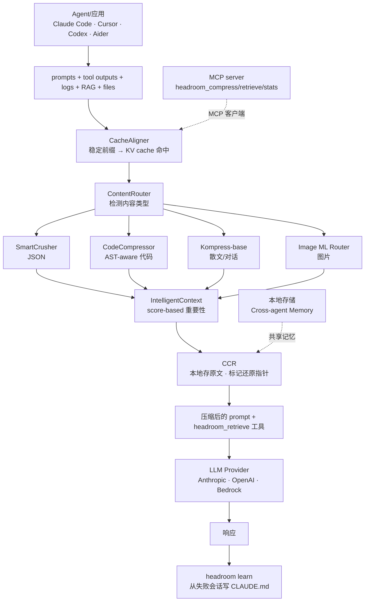

# headroom：AI Agent 的 Context 压缩层，把 92% 的 Token 在到达 LLM 之前拦下来

## 学习目标

读完本文后，你应该能够：

- 说出 headroom 的 6 个压缩算法各自适合的内容类型
- 解释 CCR（Content-Indexed Reversible Compression）的工作原理和适用场景
- 解释 CacheAligner 如何帮助 KV cache 命中
- 在一個 Agent 项目中接入 headroom 并测量 token 节省
- 判断你的 Agent 场景是否适合用 headroom

## 这套系统在解决什么

`headroom`（仓库 [chopratejas/headroom](https://github.com/chopratejas/headroom)）把 AI Agent 的 token 账单问题拆成两段处理：先识别 context 里哪部分能压，再在 LLM 看到之前压掉。它的做法是按内容类型分流到 6 个压缩器，配合可逆压缩（CCR）和 KV cache 对齐（CacheAligner），把 token 砍掉 47-92%。

判断它适不适合你的场景，有四件事要看清：压缩发生在请求的哪个阶段、6 个算法各压哪类内容、节省数字在什么场景成立、从哪种模式接入。

headroom 和同类工具的差别，集中在三件别家没同时做到的事上：

1. **CCR（Content-Indexed Reversible Compression，内容索引可逆压缩）**：压缩后原文留在本地 store，LLM 需要时调 `headroom_retrieve` 拉回，不存在"压完就丢"的不可逆路径
2. **CacheAligner**：把 prompt 中"语义等价但字面不同"的部分规范化，让 Anthropic/OpenAI 的 prefix KV cache 真正命中，省下的钱是 token 节省 × cache 命中的叠加
3. **headroom learn**：监听 Claude Code / Codex / Gemini 的 session log，从重复失败中生成 mitigation 规则，追加到 `CLAUDE.md` / `AGENTS.md` / `GEMINI.md`

三件事分别压在压缩层、provider 计费层和 Agent 记忆层，在系统里的分布如下。

## 目录

- [学习目标](#学习目标)
- [这套系统在解决什么](#这套系统在解决什么)
- [系统地图：一次 Agent 调用如何穿过压缩层](#系统地图一次-agent-调用如何穿过压缩层)
- [6 算法分诊台：按内容类型分流](#6-算法分诊台按内容类型分流)
- [CCR：让压缩可逆](#ccr让压缩可逆)
- [CacheAligner：让 KV cache 真正命中](#cachealigner让-kv-cache-真正命中)
- [headroom learn：从失败会话写规则](#headroom-learn从失败会话写规则)
- [Benchmark 解读](#benchmark-解读)
- [任务流案例](#任务流案例)
- [5 种部署模式](#5-种部署模式)
- [与同类工具的对比](#与同类工具的对比)
- [接入示例](#接入示例)
- [接入前的判断检查点](#接入前的判断检查点)
- [谁该先用、谁可以等等](#谁该先用谁可以等等)
- [自测清单](#自测清单)
- [练习](#练习)
- [进阶路径](#进阶路径)

## 系统地图：一次 Agent 调用如何穿过压缩层

headroom 的主路径从 Agent 发起调用到 LLM 看到压缩后的 prompt，11 步生命周期与 6 算法嵌入其中：



链路里有三层职责，不先拆开容易混：

- **压缩层**（ContentRouter → 6 算法 → IntelligentContext）：决定"这段 context 怎么压"
- **存储与还原层**（CCR store + `headroom_retrieve`）：决定"原文留哪、怎么拉回"
- **计费优化层**（CacheAligner）：决定"压完之后 provider 还能不能复用 KV cache"

`headroom learn` 不在这条主路径上，它读的是 session log，写的是 Agent memory 文件，属于运行时学习回路，不影响单次请求的压缩行为。

## 6 算法分诊台：按内容类型分流

headroom 的 6 个算法各管一类输入，由 `ContentRouter` 识别类型后决定走哪个 compressor。这套分诊避免了两类常见错配：用大模型压小表格，或用 JSON 解析器压散文。

| 算法 | 输入类型 | 核心机制 | 节省量级 |
|------|----------|----------|----------|
| **SmartCrusher** | JSON（数组/嵌套/混合类型） | 字段重命名 + 嵌套扁平化 + 类型推断 | 60-80% |
| **CodeCompressor** | 源码（Python/JS/Go/Rust/Java/C++） | AST 解析后只保留签名、类型、注释，丢弃中间细节 | 70-85% |
| **Kompress-base** | 散文/对话/工具输出文本 | 自训练 HuggingFace 模型，专攻 agentic traces | 40-70% |
| **Image ML Router** | 图片 | 训练后的 ML 路由器选择压缩策略 | 40-90% |
| **CacheAligner** | 全部 prefix | 检测并稳定前缀，让 provider KV cache 命中 | 间接省 30-60% |
| **IntelligentContext** | 综合 context | 基于 score 的重要性排序 + rolling window | 取决于信号 |

前 4 个是"按类型压内容"，CacheAligner 是"按 prefix 稳定结构"，IntelligentContext 是"按重要性裁剪"——三者作用在 context 的不同维度上，可以叠加。

## CCR：让压缩可逆

gzip 和 LLMLingua 这类压缩是有损且不可逆的，压完就找不回原文。但 Agent 经常需要原文做交叉验证——比如工具返回的 JSON 字段在压缩后被重命名了，LLM 想确认原始 key 名时无处可查。

CCR（Content-Indexed Reversible Compression，内容索引可逆压缩）的做法是把"压缩"和"原文"分离到两条路径：

```
压缩过程：
  原始 context (10K tokens)
      ↓
  Kompress-base 压缩后 (1.5K tokens)  ← 进入 LLM prompt
  + 原始 10K tokens 写入本地 CCR store  ← 留在本地
  + headroom_retrieve tool 描述  ← 让 LLM 知道"想看原文就调这个"

LLM 看到的是：1.5K 压缩 context
LLM 真的需要原文时：调 headroom_retrieve(id) → 本地取出 10K 原文
```

默认路径省 85% token；当 LLM 在某轮对话里需要原文时，通过 `headroom_retrieve(id)` 把对应片段拉回 prompt。这个机制和 RAG 的区别在于召回位置：RAG 是在 prompt 外部召回新内容，CCR 是在 prompt 内部为已压缩的片段保留还原通道。

CCR store 是本地 first 的，数据不出机器，对 CCPA/GDPR 友好。代价是还原路径有本地读盘延迟，高频调用场景需要评估这个开销。

## CacheAligner：让 KV cache 真正命中

Anthropic 和 OpenAI 的 KV cache 按 prefix 命中——相同前缀的请求能复用之前的 KV 计算，省 30-60% 的 token 钱。但很多 Agent 框架的 prompt 每次都略有不同：加个时间戳、改个工具调用 ID 顺序、JSON 字段顺序变了，都会让 cache miss。

CacheAligner 做的是三步规范化：

1. 检测 prompt 中"会变化但语义等价"的部分（时间戳、ID 排序、JSON 字段顺序）
2. 把这些部分规范化到统一形式
3. 让真正变化的"有效负载"放在 prefix 之后

在连续 100 次 Agent 调用的场景里，第一次 cold start 不命中，第 2-100 次全部命中 KV cache。省下的钱是 token 节省 × cache 命中率的叠加，不是单层优惠。

## headroom learn：从失败会话写规则

`headroom learn` 是 headroom 里偏运行时学习的功能：

```bash
headroom learn                       # 挖最近失败会话
# 输出一段 markdown，自动追加到 CLAUDE.md / AGENTS.md / GEMINI.md
```

它的工作流程：

1. 监听 Claude Code / Codex / Gemini 的 session log
2. 检测同一类错误重复出现（如"忘了读 README 就动手改"）
3. 自动生成 mitigation 规则
4. 追加到 Agent 的 memory 文件

Agent 在后续会话里会读到这些规则，避免同类错误。这把"从失败中学习"从 LLM 训练阶段挪到了 Agent 运行时——模型权重不变，但 memory 文件在长。

## Benchmark 解读：测什么、反映哪部分、不能推出什么

README 给出的 benchmark 是真实 agent 工作负载，但要正确理解它的作用范围。

### 测的是什么

| Workload | Before → After | 节省 | 场景特征 |
|----------|---------------|------|----------|
| Code search (100 results) | 17,765 → 1,408 | **92%** | 大量相似结构化数据 |
| SRE incident debugging | 65,694 → 5,118 | **92%** | 日志去重 + 模式识别 |
| GitHub issue triage | 54,174 → 14,761 | **73%** | 文本+结构混合 |
| Codebase exploration | 78,502 → 41,254 | **47%** | 高语义密度 |

这四个 workload 覆盖了从"高重复结构化数据"到"高语义密度散文"的谱系。92% 出现在 JSON 数组 + 高重复度场景，47% 出现在 codebase exploration 这种语义密度高的任务——节省幅度和内容类型强相关。

### 精度保护

| Benchmark | 基线 vs headroom | 变化 | 说明 |
|-----------|------------------|------|------|
| GSM8K | 0.870 vs 0.870 | ±0.000 | 数学推理，答案明确 |
| TruthfulQA | 0.530 vs 0.560 | +0.030 | 事实性问答 |
| SQuAD v2 | 97% 准确率 | — | + 19% 压缩 |
| BFCL | 97% 准确率 | — | 工具调用，+ 32% 压缩 |

GSM8K 和 TruthfulQA 的精度变化在 ±0.03 以内，说明压缩没有破坏这两类任务的推理链。BFCL 97% 准确率 + 32% 压缩说明工具调用场景的 schema 压缩是安全的。

### 不能推出什么

- "92% 节省"是 JSON 数组 + 高重复度场景的极限值，散文类内容降到 40-60%
- "精度无损"基于 GSM8K 这种答案明确的 benchmark，**不代表所有任务的精度都无损**——业务上线前需要在自己的任务上验证
- CCR 还原路径有本地读盘延迟，高频调用场景需要评估
- Kompress-base 是 7B 级别的本地模型，需要 GPU/CPU 算力；小机器上跑不动时会降级到 SmartCrusher

## 任务流案例：一次 SRE 调用如何穿过压缩层

以一个 SRE 场景为例：Agent 调用工具拉了 100 条日志（约 60K tokens），要做 incident debugging。整个流程在 headroom 内部这样走：

1. **入口**：Agent 把 60K 日志 + 系统 prompt + 历史对话交给 headroom
2. **CacheAligner**：检测到系统 prompt 里有时间戳和 request ID，规范化后让 prefix 稳定——这一步不影响 token 数，但让后续调用的 KV cache 能命中
3. **ContentRouter**：识别出 60K 日志是"半结构化文本 + 重复模式"，分流到 Kompress-base
4. **Kompress-base**：自训练模型压缩日志，去掉重复 stack trace 和时间戳前缀，压到约 5K tokens
5. **IntelligentContext**：对压缩后的 5K 做 score 排序，保留 top 相关片段
6. **CCR**：原始 60K 写入本地 CCR store，生成 retrieve ID；压缩后的 5K + `headroom_retrieve` 工具描述进入 LLM prompt
7. **LLM 调用**：Anthropic 收到约 6K tokens 的 prompt（含压缩日志 + retrieve 工具），KV cache 命中 prefix 部分
8. **还原路径**：如果 LLM 在推理中发现需要看某条原始日志的完整字段，调用 `headroom_retrieve(id)`，headroom 从本地 store 取出对应片段，作为工具返回值注入下一轮 prompt

这个流程里，token 节省发生在第 4-5 步，cache 命中发生在第 7 步，可逆性由第 6 步保证。三层机制作用在请求的不同阶段，不是互相替代。

## 5 种部署模式

headroom 给 Agent 框架提供了 5 种集成路径，覆盖从个人开发者到企业的不同接入需求：

| 模式 | 命令 | 适用场景 |
|------|------|----------|
| **Library** | `from headroom import compress` | 任何 Python/TypeScript 应用内嵌 |
| **Proxy** | `headroom proxy --port 8787` | 零代码修改，任何语言 |
| **Agent wrap** | `headroom wrap claude\|codex\|cursor\|aider` | 包装已有 Agent，一行接入 |
| **MCP server** | `headroom_compress / retrieve / stats` | 任何 MCP 客户端 |
| **Cross-agent memory** | `SharedContext().put / .get` | 多 Agent 共享记忆 |

RTK 只支持 CLI 命令输出，OpenAI Compaction 只支持 OpenAI 对话历史。headroom 的 5 种模式覆盖了 library / proxy / wrap / MCP / shared memory 五种接入维度，对多 provider 和多 Agent 框架的场景更友好。

## 与同类工具的对比

| 工具 | 范围 | 部署 | Local | 可逆 |
|------|------|------|:-----:|:----:|
| **headroom** | 全部 context（工具/RAG/日志/文件/历史） | Proxy · Library · Middleware · MCP | ✓ | ✓ |
| [RTK](https://github.com/rtk-ai/rtk) | CLI 命令输出 | CLI wrapper | ✓ | ✗ |
| [lean-ctx](https://github.com/yvgude/lean-ctx) | CLI 命令 + MCP 工具 + 编辑器规则 | CLI wrapper · MCP | ✓ | ✗ |
| Compresr / Token Co. | 文本（API 调用） | Hosted API | ✗ | ✗ |
| OpenAI Compaction | 对话历史 | Provider-native | ✗ | ✗ |

headroom 的差异化集中在"全 context 类型 + 本地存储 + 可逆还原"三点同时满足。对应的是数据敏感、场景多元、需要精确控制原文的生产场景；如果只用单一 provider 且不关心数据本地化，OpenAI Compaction 这类 provider-native 方案更轻。

## 接入示例：让 Cursor 走 headroom proxy

把 headroom 包装到 Cursor 的最短路径是 proxy 模式，不改 Cursor 代码：

```bash
# 1. 安装
pip install "headroom-ai[all]"

# 2. 启动 headroom proxy（OpenAI 兼容端口）
headroom proxy --port 8787

# 3. Cursor 设置 OpenAI base URL 指向 headroom
#    原本: https://api.openai.com/v1
#    改为: http://localhost:8787/v1
#    （Cursor 把所有请求路由到 headroom proxy）

# 4. 验证节省
headroom stats
# 输出：
#   total requests: 1,247
#   tokens saved:    3.2M
#   cost saved:      $48.3
#   cache hit rate:  87%
```

Cursor 侧无感知，所有请求经 proxy 走压缩链路。`headroom stats` 输出的 cache hit rate 反映 CacheAligner 的效果，tokens saved 是压缩 + cache 命中的合计。

## 接入前的判断检查点

决定接入前，先用以下问题校准你的场景：

- Agent 每天消耗的 token 里，结构化数据（JSON/日志）占比高吗？占比高，SmartCrusher 和 Kompress-base 的节省空间大
- prompt 有稳定 prefix 吗？有，CacheAligner 才能让 provider KV cache 命中
- 任务依赖长尾细节吗？依赖，CCR 还原路径的读盘延迟需要评估
- 机器能跑 7B 级别本地模型吗？不能，Kompress-base 会降级到 SmartCrusher，散文压缩效果下降

## 谁该先用、谁可以等等

**先用的场景**：

- 跑 AI Coding Agent（Claude Code / Codex / Cursor）重度用户，每天消耗百万级 token
- 跨多个 Agent 框架工作，需要统一压缩 + 共享记忆层
- 关心数据隐私，要求 context 不出机器
- 在做多 Agent 系统，需要 `SharedContext` 跨进程共享记忆

**先等等的场景**：

- 只用单一 provider 的原生 compaction（如 OpenAI Compaction）就够用
- 工作在沙箱环境，本地进程跑不了 CCR store
- 极度依赖长尾细节的领域（如法律、医学的关键判例），压缩可能丢掉关键措辞

**采用顺序**：

1. `pip install "headroom-ai[all]"` 装起来
2. 先用 `headroom wrap claude` 或 `headroom wrap codex` 试一周，看 `headroom stats` 的实际节省
3. 数据满意后升级到 `headroom proxy`，接所有 OpenAI 兼容客户端
4. 接入 MCP，让其他 Agent 也能用
5. 启用 `headroom learn`，从失败会话长出 mitigation 规则

第 2 步用 wrap 模式而不是直接上 proxy，是因为 wrap 只包一个 Agent，便于隔离变量看压缩效果；proxy 接所有客户端后，stats 是混合数据，不容易归因。

## 仓库元数据

| 维度 | 取值 | 验证来源 |
|------|------|----------|
| 仓库全名 | `chopratejas/headroom` | GitHub API |
| Stars | 7034 | GitHub API（2026-06-03） |
| Language | Python（核心） + Rust（部分） | GitHub API |
| License | Apache 2.0 | LICENSE |
| 创建时间 | 2026-01-07 | GitHub API |
| 最后更新 | 2026-06-03 04:45 UTC | GitHub API |
| Topics | agent, ai, anthropic, claude-code, compression, context-engineering, context-window, cursor, mcp, openai, rag, token-optimization | GitHub API |
| 部署 | PyPI + npm + Docker + Rust crates | README |

## 参考资源

- **仓库入口**：[github.com/chopratejas/headroom](https://github.com/chopratejas/headroom)
- **文档站点**：[headroom-docs.vercel.app/docs](https://headroom-docs.vercel.app/docs)
- **Architecture**：[docs/architecture](https://headroom-docs.vercel.app/docs/architecture)
- **CCR 可逆压缩**：[docs/ccr](https://headroom-docs.vercel.app/docs/ccr)
- **Kompress-base 模型**：[HuggingFace](https://huggingface.co/chopratejas/kompress-base)
- **Benchmarks**：[docs/benchmarks](https://headroom-docs.vercel.app/docs/benchmarks)
- **llms.txt**：[仓库 llms.txt](https://github.com/chopratejas/headroom/blob/main/llms.txt)

## 自测清单

- 说出 headroom 的 6 个压缩算法各自适合的内容类型
- 解释 CCR 如何让压缩可逆
- 解释 CacheAligner 如何帮助 KV cache 命中
- 说出 headroom 的 5 种部署模式及其适用场景
- 解释为什么 wrap 模式比 proxy 模式更适合第一步测试
- 判断你的 Agent 场景是否适合用 headroom

## 练习

### 练习 1：安装并测试 headroom

完成以下任务：
1. 安装 headroom：`pip install "headroom-ai[all]"`
2. 用 wrap 模式运行 Claude Code
3. 执行几个命令，生成一些工具调用
4. 运行 `headroom stats` 查看压缩效果
5. 记录 token 节省百分比

### 练习 2：对比不同压缩算法

用同一段 context（包含 JSON、代码、散文），测试：
1. 只启用 SmartCrusher
2. 只启用 CodeCompressor
3. 只启用 Kompress-base
4. 对比三种算法的压缩比和精度损失

### 练习 3：接入 MCP

完成以下任务：
1. 启动 headroom MCP server
2. 配置 Claude Desktop 或 Cursor 连接到 headroom MCP
3. 调用 `headroom_compress` 工具压缩一段长文本
4. 调用 `headroom_retrieve` 工具还原压缩内容
5. 调用 `headroom_stats` 查看统计

### 练习 4：启用 headroom learn

完成以下任务：
1. 启用 `headroom learn`
2. 故意让 Agent 犯几个错误（如调用不存在的工具）
3. 检查 `CLAUDE.md` 或 `AGENTS.md` 是否生成了 mitigation 规则
4. 验证下一次会话这些规则是否被加载

## 进阶路径

### 路径 1：从用户到贡献者

如果你已经在用 headroom，下一步可以：
1. **贡献新算法**：给 headroom 加一个新的压缩算法（如专门压 Markdown 的）
2. **改进现有算法**：优化 Kompress-base 模型，提高压缩比或精度
3. **贡献文档**：改进 headroom 的文档和示例

### 路径 2：从工具到平台

如果你在用 headroom 做 Agent 产品，下一步可以：
1. **做压缩策略优化**：基于你的场景数据，训练一个压缩算法选择器
2. **做压缩效果可视化**：做一个 dashboard，展示每次压缩的详细信息
3. **做压缩 A/B 测试**：对比不同压缩策略对 LLM 输出质量的影响

### 路径 3：从 Context 压缩到 Context 工程

headroom 是 Context 工程的一个工具。如果你在做 Agent 相关的创业或研究，下一步可以：
1. **研究 Context 选择**：不只是压缩，还要研究哪些 context 该保留、哪些该丢弃
2. **研究 Context 组织**：研究如何组织 context 让 LLM 更容易理解
3. **研究 Context 个性化**：基于用户历史，个性化 context 的选择和压缩

headroom 是入口，不是终点。它帮你建立"Context 工程"的直觉，下一步往哪个方向走看你的项目需求。
