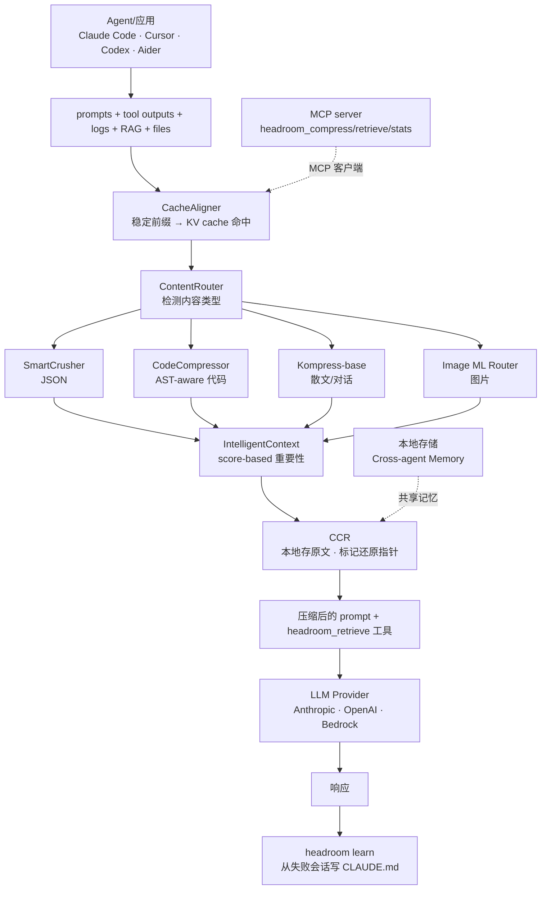

# headroom：AI Agent 的 Context 压缩层，把 92% 的 Token 在到达 LLM 之前拦下来

## 核心判断

`headroom`（仓库 [chopratejas/headroom](https://github.com/chopratejas/headroom)）在 7K stars 的热度下，回答了一个被很多人忽略的工程问题：**当 AI Agent 每天要读几千次工具输出和 RAG 结果，token 账单到底花在了哪里？**

headroom 的真正价值不是"又一个压缩库"——它是一个 **Agent 时代的中间件范式**：在 LLM 看到之前把所有 context 拦下来，分类型走不同压缩器（JSON 走 SmartCrusher、代码走 AST-aware CodeCompressor、散文走自训练模型 Kompress-base），再用 CCR（可逆压缩）+ CacheAligner（KV cache 对齐）保住精度的同时把 token 砍掉 47-92%。

它的护城河在三件别家没做到的事：

1. **CCR（Content-Indexed Reversible Compression）**：压缩后**永远可还原**，LLM 需要时调 `headroom_retrieve` 拉回原文
2. **CacheAligner**：稳定前缀让 Anthropic/OpenAI 的 KV cache 真正命中，省的钱是 double 的
3. **headroom learn**：从失败会话挖坑，自动写进 `CLAUDE.md`/`AGENTS.md`，让 Agent 越用越聪明

## 系统地图

下面这张图覆盖 headroom 的全部主路径——从 Agent 调用到 LLM 看到压缩后的 prompt，11 步生命周期与 6 算法嵌入其中：



整个链路里**最值得看的是分层**——压缩不是一锅炖，而是按内容类型分别处理，6 种算法不是堆叠而是分诊。

## 6 算法分诊台

headroom 的 6 算法不是"压缩工具集"，而是**一个按内容类型自动分诊的策略网络**。每个算法专攻一类输入，互相不抢活：

| 算法 | 输入类型 | 核心机制 | 节省量级 |
|------|----------|----------|----------|
| **SmartCrusher** | JSON（数组/嵌套/混合类型） | 字段重命名 + 嵌套扁平化 + 类型推断 | 60-80% |
| **CodeCompressor** | 源码（Python/JS/Go/Rust/Java/C++） | AST 解析后只保留签名、类型、注释，丢弃中间细节 | 70-85% |
| **Kompress-base** | 散文/对话/工具输出文本 | 自训练 HuggingFace 模型，专攻 agentic traces | 40-70% |
| **Image ML Router** | 图片 | 训练后的 ML 路由器选择压缩策略 | 40-90% |
| **CacheAligner** | 全部 prefix | 检测并稳定前缀，让 provider KV cache 命中 | 间接省 30-60% |
| **IntelligentContext** | 综合 context | 基于 score 的重要性排序 + rolling window | 取决于信号 |

`ContentRouter` 是分诊台：识别输入类型，决定走哪个 compressor。这套设计让 headroom 不会"用大模型压小表格"或"用 JSON 解析器压散文"。

## CCR：让压缩可逆

传统压缩（如 gzip、LLMLingua）是**有损且不可逆**——压完就找不回来。但 Agent 经常需要原文做交叉验证。CCR（Content-Indexed Reversible Compression）的解法是把"压缩 + 原文"分离：

```
压缩过程：
  原始 context (10K tokens)
      ↓
  Kompress-base 压缩后 (1.5K tokens)  ← 进入 LLM prompt
  + 原始 10K tokens 写入本地 CCR store  ← 留在本地
  + headroom_retrieve tool 描述  ← 让 LLM 知道"想看原文就调这个"

LLM 看到的是：1.5K 压缩 context
LLM 真的需要原文时：调 headroom_retrieve(id) → 本地取出 10K 原文
```

**双向收益**：

- 默认路径：节省 85% token
- 需要时：零损失还原

这等于把"压缩"从 LLM 视角变成了"按需加载"——类似 RAG，但 RAG 是在 prompt 外召回，CCR 是在 prompt 内自带还原通道。CCR store 是**本地 first**（数据不出机器），CCPA/GDPR 友好。

## CacheAligner：让 KV cache 真正命中

LLM provider（Anthropic/OpenAI）的 KV cache 是按 prefix 命中的——相同前缀的请求能复用之前的 KV 计算，省下 30-60% 的 token 钱。但很多 Agent 框架的 prompt 每次都略有不同（哪怕加个时间戳、加个工具调用结果），导致 cache **miss**。

CacheAligner 做的是：

1. 检测 prompt 中"会变化但语义等价"的部分（如时间戳、ID 排序、JSON 字段顺序）
2. 把这些部分**规范化**到统一形式
3. 让真正变化的"有效负载"放在 prefix 之后

效果是：连续 100 次 Agent 调用，第一次没命中（cold start），第 2-100 次全部命中 KV cache，省下的钱是 token 节省 × cache 命中的叠加。

## headroom learn：从失败中长出 skill

`headroom learn` 是 headroom 最有 AI-native 味道的功能：

```bash
headroom learn                       # 挖最近失败会话
# 输出一段 markdown，自动追加到 CLAUDE.md / AGENTS.md / GEMINI.md
```

原理：

1. 监听 Claude Code / Codex / Gemini 的 session log
2. 检测到同一类错误**重复出现**（如"忘了读 README 就动手改"）
3. 自动生成 mitigation 规则
4. 追加到 Agent 的 memory 文件

效果：Agent 越用越"长记性"，避免同类错误。这把"从失败中学习"从 LLM 训练阶段下放到了 **Agent 运行时**，是一种自进化机制。

## Benchmark 解读：测什么、不能推出什么

README 给出的 benchmark 是**真实 agent 工作负载**，但要正确理解它的作用范围：

**能测的（README 已验证）**：

| Workload | Before → After | 节省 | 场景 |
|----------|---------------|------|------|
| Code search (100 results) | 17,765 → 1,408 | **92%** | 大量相似结构化数据 |
| SRE incident debugging | 65,694 → 5,118 | **92%** | 日志去重 + 模式识别 |
| GitHub issue triage | 54,174 → 14,761 | **73%** | 文本+结构混合 |
| Codebase exploration | 78,502 → 41,254 | **47%** | 高语义密度 |

**精度保护（GSM8K/TruthfulQA/SQuAD/BFCL）**：

- GSM8K：基线 0.870 vs headroom 0.870，**±0.000**（无损）
- TruthfulQA：基线 0.530 vs headroom 0.560，**+0.030**（甚至更好）
- SQuAD v2：**97% 准确率** + 19% 压缩
- BFCL（工具调用）：**97% 准确率** + 32% 压缩

**不能推出的（边界）**：

- "92% 节省" 是 **JSON 数组 + 高重复度**场景的极限值，对散文类内容降到 40-60%
- **精度无损**是基于 GSM8K 这种"答案明确"的 benchmark，**不代表所有任务的精度都无损**——需要看具体业务
- **CCR 还原路径**有延迟（本地读盘），高频调用场景需要评估
- **Kompress-base** 是个 7B 级别的本地模型，需要 GPU/CPU 算力；小机器上跑不动 → 降级到 SmartCrusher

简言之：headroom 在**结构化、高重复**场景下效果最好；在**高度依赖长尾细节**的任务上要谨慎。

## 5 种部署模式

headroom 不是只能 import 一个函数，它给 Agent 框架提供了 5 种集成路径：

| 模式 | 命令 | 适用场景 |
|------|------|----------|
| **Library** | `from headroom import compress` | 任何 Python/TypeScript 应用内嵌 |
| **Proxy** | `headroom proxy --port 8787` | 零代码修改，任何语言 |
| **Agent wrap** | `headroom wrap claude\|codex\|cursor\|aider` | 包装已有 Agent，一行接入 |
| **MCP server** | `headroom_compress / retrieve / stats` | 任何 MCP 客户端 |
| **Cross-agent memory** | `SharedContext().put / .get` | 多 Agent 共享记忆 |

**5 种模式覆盖了从个人开发者（wrap）到平台（proxy/MCP）到企业（middleware）的全部路径**。这与 RTK（只支持 CLI）和 OpenAI Compaction（只支持 OpenAI）等竞品形成鲜明对比——headroom 的"全场景"是结构性优势。

## 与同类工具的对比

| 工具 | 范围 | 部署 | Local | 可逆 |
|------|------|------|:-----:|:----:|
| **headroom** | 全部 context（工具/RAG/日志/文件/历史） | Proxy · Library · Middleware · MCP | ✓ | ✓ |
| [RTK](https://github.com/rtk-ai/rtk) | CLI 命令输出 | CLI wrapper | ✓ | ✗ |
| [lean-ctx](https://github.com/yvgude/lean-ctx) | CLI 命令 + MCP 工具 + 编辑器规则 | CLI wrapper · MCP | ✓ | ✗ |
| Compresr / Token Co. | 文本（API 调用） | Hosted API | ✗ | ✗ |
| OpenAI Compaction | 对话历史 | Provider-native | ✗ | ✗ |

headroom 的差异化是"**全 + 本地 + 可逆**"三角，对应"数据敏感 + 场景多元 + 需要精确控制"的严肃生产场景。

## 任务流案例：让 Cursor 写代码时自动压缩

一个具体的接入流程：把 headroom 包装到 Cursor，让 Cursor 写代码时自动走 headroom 压缩。

```bash
# 1. 安装
pip install "headroom-ai[all]"

# 2. 启动 headroom proxy（OpenAI 兼容端口）
headroom proxy --port 8787

# 3. Cursor 设置 OpenAI base URL 指向 headroom
#    原本: https://api.openai.com/v1
#    改为: http://localhost:8787/v1
#    （Cursor 把所有请求路由到 headroom proxy）

# 4. 验证节省
headroom stats
# 输出：
#   total requests: 1,247
#   tokens saved:    3.2M
#   cost saved:      $48.3
#   cache hit rate:  87%
```

效果：Cursor 用着不变，但背后节省 47-92% token。**零代码修改的 proxy 模式是企业落地的最短路径**。

## 谁该先用、谁可以等等

**先用的团队/场景**：

- 跑 AI Coding Agent（Claude Code / Codex / Cursor）重度用户，每天消耗百万级 token
- 跨多个 Agent 框架工作，需要**统一压缩 + 共享记忆**层
- 关心数据隐私（数据本地不外发）
- 在做多 Agent 系统（SharedContext 是杀手锏）

**先等等的场景**：

- 只用单一 provider 的原生 compaction（如 OpenAI Compaction）就够用
- 工作在沙箱环境（本地进程跑不了）
- 极度依赖长尾细节的领域（如法律、医学的关键判例）

**采用顺序建议**：

1. `pip install "headroom-ai[all]"` 装起来
2. 先用 `headroom wrap claude` 或 `headroom wrap codex` 试一周
3. 看 `headroom stats` 的实际节省——**用数据决定要不要继续**
4. 满意后升级到 `headroom proxy`，接所有 OpenAI 兼容客户端
5. 接入 MCP，让其他 Agent 也能用
6. 启用 `headroom learn`，从失败中长出 skill

## 仓库元数据

| 维度 | 取值 | 验证来源 |
|------|------|----------|
| 仓库全名 | `chopratejas/headroom` | GitHub API |
| Stars | 7034 | GitHub API（2026-06-03） |
| Language | Python（核心） + Rust（部分） | GitHub API |
| License | Apache 2.0 | LICENSE |
| 创建时间 | 2026-01-07 | GitHub API |
| 最后更新 | 2026-06-03 04:45 UTC | GitHub API |
| Topics | agent, ai, anthropic, claude-code, compression, context-engineering, context-window, cursor, mcp, openai, rag, token-optimization | GitHub API |
| 部署 | PyPI + npm + Docker + Rust crates | README |

## 参考资源

- **仓库入口**：[github.com/chopratejas/headroom](https://github.com/chopratejas/headroom)
- **文档站点**：[headroom-docs.vercel.app/docs](https://headroom-docs.vercel.app/docs)
- **Architecture**：[docs/architecture](https://headroom-docs.vercel.app/docs/architecture)
- **CCR 可逆压缩**：[docs/ccr](https://headroom-docs.vercel.app/docs/ccr)
- **Kompress-base 模型**：[HuggingFace](https://huggingface.co/chopratejas/kompress-base)
- **Benchmarks**：[docs/benchmarks](https://headroom-docs.vercel.app/docs/benchmarks)
- **llms.txt**：[仓库 llms.txt](https://github.com/chopratejas/headroom/blob/main/llms.txt)
