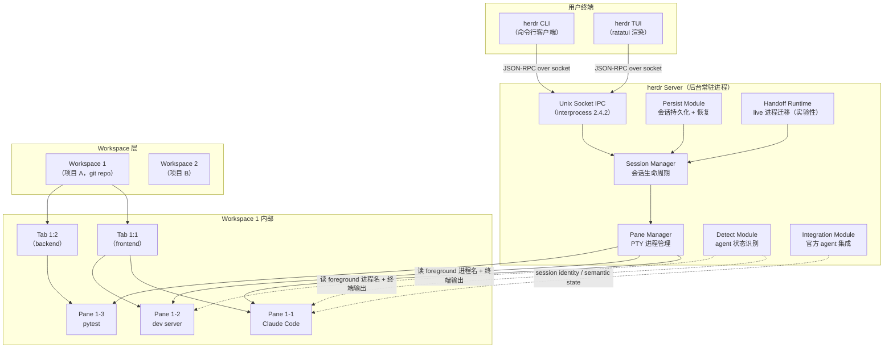

# herdr 深度解析：补上 tmux 和 GUI 之间缺失的那块拼图

## 目录

- [开场：到底缺了什么](#开场到底缺了什么)
- [tmux 够吗？GUI 行吗？](#tmux-够吗gui-行吗)
- [系统总览：两条并行机制先拆开](#系统总览两条并行机制先拆开)
- [一次真实任务流：agent 修 bug 的完整路径](#一次真实任务流agent-修-bug-的完整路径)
- [核心模型：server / workspace / tab / pane](#核心模型server--workspace--tab--pane)
- [agent 状态识别：两条路径，一套侧栏](#agent-状态识别两条路径一套侧栏)
- [socket API：让 agent 自己编排自己](#socket-api让-agent-自己编排自己)
- [架构拆解：从 AGENTS.md 看设计原则](#架构拆解从-agentsmd-看设计原则)
- [Cargo 依赖全景](#cargo-依赖全景)
- [安装与更新](#安装与更新)
- [快速上手：3 分钟跑起来](#快速上手3-分钟跑起来)
- [远程 attach](#远程-attach)
- [配置文件与主题](#配置文件与主题)
- [扩展点](#扩展点)
- [适合谁，不适合谁](#适合谁不适合谁)
- [常见问题排查](#常见问题排查)
- [采用顺序建议](#采用顺序建议)
- [风险与边界](#风险与边界)
- [总结](#总结)

---

## 开场：到底缺了什么

herdr 不是"又一个 tmux 替代品"。它只做一件事：在终端里同时跑多个 AI coding agent 时，告诉你谁在等你回复、谁跑完了、谁还在跑，然后给 agent 一套 API 让它们自己编排自己。

2026 年 3 月 27 日立项，到 6 月中旬 5,695 stars、796 commits、54 个 release。三个月跑出这个增速，"AI 时代的终端复用器"不是臆想出来的需求，是已经被验证的空位。

如果你每天同时在终端里跑 2 个以上 Claude Code / Codex / Cursor Agent，或者写过让 agent 等另一个 agent 跑完再继续的脚本，这篇值得读。如果你在写 Rust TUI 应用，这篇也是 ratatui + crossterm + tokio + portable-pty + interprocess 五件套拼成生产级应用的完整样本，搭配 AGENTS.md 里的 7 条设计原则，比单独读 ratatui 文档学到的多。

---

## tmux 够吗？GUI 行吗？

把当前几类方案的能力放到一张表里，空白点就露出来了：

| 方案 | 持久会话 | pane / 切分 | 真实终端视图 | agent 状态可视化 | 留在终端里 | 轻量 |
|------|----------|------------|--------------|-------------------|------------|------|
| tmux | 是 | 是 | 是 | 否 | 是 | 是 |
| Warp / Wave Terminal | 部分 | 是 | 否（自带模拟） | 部分 | 否（自带外壳） | 否 |
| Cursor / Claude Desktop | 否 | 否 | 否 | 是 | 否 | 否 |
| VS Code + Copilot | 否 | 否 | 否 | 是 | 否 | 否 |
| **herdr** | 是 | 是 | 是 | 是 | 是 | 是 |

herdr README 里那句原话把痛点讲清楚了，拆开看有三层。

**第一层：tmux 不知道哪个 pane 里跑着 agent。** `tmux ls` 只看进程名。Claude Code / Codex / Droid 这种 TUI agent 跑起来后，进程名都是 `node` / `python` / `bash`，tmux 完全区分不出谁是谁。你只能手动切到每个 pane 看一眼——同时跑 3 个 agent 的时候，一天切几十次，迅速变成认知负担。

**第二层：GUI 客户端拦截终端。** 你看到的是它们"重新渲染"的输出，不是 agent 自己 TUI 的真实字符流。ANSI 转义序列、progressive rendering、diff 高亮、progress bar 在 GUI 嵌入式终端里会不同程度失真——被重新排版、截断或丢失颜色信息。Claude Code 在真实终端里逐行渲染的 diff，在 GUI 里可能被折叠成一段摘要。

**第三层：同时跑多个 agent 时，"哪个先好了"在 tmux 和 GUI 里都不直观。** tmux 没侧栏，GUI 多个窗口切来切去累。herdr 的侧栏把 workspace 级别的状态聚合到一行——只要有一个 pane 里 agent blocked，整个 workspace 标红，扫一眼就知道该去哪个项目回复。

herdr 没重新发明终端，只是把三件事拼到同一个进程里：tmux 风格的 PTY 负责跑 agent，GUI 风格的侧栏负责聚合状态，再加一个本地 Unix socket 让 agent 自己也能参与编排。

---

## 系统总览：两条并行机制先拆开

herdr 内部边界可以用一张图覆盖。后文所有讨论都会回到这张图：



图里有两条并行机制容易混在一起，先拆清楚：

**机制一：agent 状态检测有两条路径。** 默认走 `detect/` 模块的启发式——读 foreground 进程名 + 终端底部 buffer 输出特征。装了官方 integration 后可以升级到语义层——session identity 恢复 + semantic state 主动报告。两条路径可以同时生效，也可以只走一条。

**机制二：会话持久化有两条路径。** 常规路径是 `persist/` 模块的 session 序列化，server 重启后恢复 pane 布局和进程。实验性路径是 `handoff_runtime.rs` 的 live handoff——把旧 server 上的 PTY 进程（包括 dev server 这种前台进程）迁移到新 server，不杀进程。技术上要做的事情是：把旧 server 持有的 PTY master fd 通过 Unix socket 传给新 server（Linux 上走 `SCM_RIGHTS` 辅助消息），新 server 接管 fd 后继续读 PTY 输出，旧 server 退出。难点在于 PTY 的窗口尺寸、进程组、信号转发都要在新 server 上重建，且迁移期间不能丢输出。

---

## 一次真实任务流：agent 修 bug 的完整路径

server / workspace / tab / pane 四层抽象、agent 状态切换、socket API 编排，光看定义容易混。下面这个案例把它们串起来。

**场景**：你在 `~/code/api-server` 项目里修 bug。开了两个 agent——Claude Code 在 pane 1-1 修代码，Codex 在 pane 1-2 跑测试。

```text
时间线：
00:00  打开 herdr，自动 attach 到后台 server
00:01  herdr 检测到当前目录是 git repo，创建 workspace "api-server"
00:02  按 prefix+v 竖切 pane，右边 pane 跑 Codex，左边继续 Claude Code
00:05  Claude Code 开始改代码 → 侧栏 pane 1-1 显示 🟡 working
00:05  Codex 开始跑测试 → 侧栏 pane 1-2 显示 🟡 working
00:08  Codex 跑完测试，exit code 0 → 侧栏 pane 1-2 显示 🔵 done
       （你还没切过去看，所以是 done 不是 idle）
00:10  Claude Code 改完代码，等你 review diff → 侧栏 pane 1-1 显示 🔴 blocked
       侧栏 workspace "api-server" 聚合到最紧急状态：🔴
00:11  扫一眼侧栏，看到 🔴 blocked + 🔵 done
       → 切到 pane 1-1 批准 Claude Code 的 diff
       → 切到 pane 1-2 看 Codex 的测试结果 → pane 1-2 变为 🟢 idle
00:12  Claude Code 收到批准，继续跑 → 侧栏 pane 1-1 变为 🟡 working
00:15  Claude Code 完成 → 侧栏 pane 1-1 变为 🔵 done
00:16  切过去看结果 → pane 1-1 变为 🟢 idle
```

这个流程里 herdr 在做三件事：

1. **跑 agent 的 PTY 终端**——你看到的是 Claude Code / Codex 的原生 TUI 输出，不被改写。
2. **实时追踪状态**——从进程名 + 终端底部 buffer 推断 blocked / working / done / idle。
3. **提供编排入口**——用 socket API 让 agent A 等 agent B 跑完再继续。

如果把"等 agent B 跑完"这一步自动化，用 socket CLI 写就是这样：

```bash
# agent A 在 pane 1-1 里，想知道 agent B（pane 1-2）什么时候跑完
herdr wait agent-status 1-2 --status done --timeout 120000

# 拿到 done 信号后，读 agent B 的输出
herdr pane read 1-2 --source recent --lines 100

# 然后 agent A 继续自己的逻辑
```

tmux 能跑多个进程，但进程之间互相不知道对方的状态。herdr 给每个 pane 一个可查询的状态机和可读的输出流，agent 才能编排 agent。

---

## 核心模型：server / workspace / tab / pane

后文所有命令都对应这四层抽象。

### 1. server（后台服务进程）

`herdr` 启动时默认 attach 到一个**后台 server**。`prefix q`（detach client）只关掉客户端，不关 server。这和 tmux 的关键区别：

- tmux：session 既是 server 又是 client，`tmux kill-session` 会杀掉所有 pane。
- herdr：server 是常驻进程，client 可以是多个终端窗口同时 attach 到同一个 server。

关掉终端窗口不等于关掉 agent 进程。只有 `herdr server stop` 才会真正停掉 server 并杀掉所有 pane。

命名 session 是**独立的 server namespace**——你可以有一个主 session 跑日常、一个 work session 跑长任务、一个 review session 跑 review agent，互不干扰：

```bash
herdr session attach work    # attach 命名 session
herdr session stop work      # 停命名 session
herdr session list           # 列出所有 session
```

### 2. workspace（项目级容器）

workspace 围绕 **git 仓库或文件夹** 组织，默认按第一个 tab 的根 pane 命名（通常是 repo 名）。一个 workspace = 一个项目。

```bash
herdr workspace list
herdr workspace create --cwd /path/to/project --label "api server"
```

### 3. tab（workspace 内子上下文）

tab 在 workspace 内部做语义分组。例如一个 repo 里有 frontend / backend / infra 三个方向，可以建 3 个 tab，每个 tab 独立 pane 树。tab 是 socket API 和 CLI 的一等公民，有完整的 create / list / focus / rename / close 操作。

```bash
herdr tab create --workspace 1 --label backend
herdr tab list --workspace 1
```

### 4. pane（真实终端进程）

pane 是真正跑 shell / agent / server / log tail 的终端。herdr 在这里做了一个关键承诺：

> Panes are real terminal processes, not rewritten agent views.

herdr 用 `portable-pty` 跑 PTY 进程，**不解析也不改写 agent 的 ANSI 输出**。你看到的就是 agent 自己的 TUI。Claude Code 的 diff 渲染、Codex 的 progress bar、Droid 的 inline tool call 结果，都依赖真实的 ANSI 控制序列——这些在 GUI 嵌入式终端里会不同程度失真。

### ID 编码与陷阱

写 orchestrator 的人必须记住 SKILL.md 里的这段警告：

> ids can compact when tabs, panes, or workspaces are closed. do not treat them as durable ids. re-read ids from `workspace list`, `tab list`, `pane list`, or create/split responses when you need a current id. do not guess that an older `1-3` is still the same pane later.

ID 格式：

- workspace: `1`, `2`, `3`...
- tab: `1:1`, `1:2`...
- pane: `1-1`, `1-2`...

这是**会话内紧凑 ID**，关掉中间的 tab/pane 会让后续 ID 复用。**写 orchestrator 时必须每次重新 `list`**。

---

## agent 状态识别：两条路径，一套侧栏

herdr 把 pane 里的进程按 4 个状态归类：

| 状态 | 颜色 | 含义 |
|------|------|------|
| `blocked` | 🔴 | agent 等待你输入或批准 |
| `working` | 🟡 | agent 正在跑 |
| `done` | 🔵 | agent 跑完但你还没看 |
| `idle` | 🟢 | 跑完且已看过 |

`done` 和 `idle` 的区别取决于你有没有切到那个 pane 看过——这是一个基于注意力（attention）的状态，不是纯进程状态。这比 tmux 的"进程在不在跑"多了一层语义。

### 路径一：默认启发式检测（零配置）

不装任何 integration 时，herdr 的 `detect/` 模块通过两个信号推断状态：

1. **foreground 进程名**：PTY 的前台进程是什么（`claude`、`codex`、`node` 等）
2. **终端输出特征**：屏幕底部 buffer 里出现的特定 ANSI 序列和文本模式

AGENTS.md 里有一段关于检测哲学的约束：

> Screen detection is evidence-based. Decide which visible controls are invariant, which are alternatives, and encode them as explicit AND/OR gates. Do not match whole-pane incidental text, and do not use the user-visible viewport for agent status because users can scroll it.

检测不看用户滚动的 viewport（用户可能滚到历史输出里去了），看的是 agent 自己的"底部 buffer"——agent 当前渲染的屏幕状态。每个 agent 的检测规则写在 `src/detect/manifests/<agent>.toml` 里，用 AND/OR gate 表达"哪些屏幕特征组合等于哪个状态"。

一条规则会声明几个 region（屏幕上的固定区域，比如底部一行或右下角），每个 region 里放若干 matcher（正则或字面量），再用 `all_of` / `any_of` 组合。一个 `blocked` 判断可能长这样：底部出现 `❯` 提示符 AND（出现 `Do you want to proceed?` OR 出现 `Press enter to continue`）。

规则可以单独测试：`herdr agent explain <pane> --json` 能看到当前屏幕匹配了哪几条 region、命中了哪个 gate、最终落到哪个状态。从 v0.6.9 起，agent 检测 manifest 还支持远程更新（`herdr server update-agent-manifests`），新 agent 的识别规则不必等 herdr 发版就能下发。

添加检测规则的流程在 AGENTS.md 里有完整说明：先用 `herdr agent read <pane> --source detection --format text` 抓屏幕快照，再用 `herdr agent explain <pane> --json` 看匹配结果，然后把规则写成 `src/detect/manifests/<agent>.toml` 里的 AND/OR gate。复制到 `~/.config/herdr/agent-detection/<agent>.toml` 后 `herdr server reload-agent-manifests` 热加载，验证通过后删掉本地 override，让 bundled manifest 作为唯一来源。

### 路径二：官方 integration（语义层升级）

`herdr integration install <agent>` 安装后，状态识别会升级：

- **session identity**：知道这个 pane 对应的是哪次 agent session，server 重启后能恢复上下文
- **semantic state**：agent 直接通过 socket 主动报告自己的状态（"我现在 blocked"），而不是 herdr 从输出猜

目前的 integration 覆盖 15 个 agent，按能力分三档：

| 能力层次 | agent | 说明 |
|---------|-------|------|
| 双向（semantic state + session identity） | pi, opencode, hermes agent, kilo code cli | agent 主动报告状态，server 重启后恢复 session |
| session identity only | claude code, codex, droid, cursor agent, kimi code cli, github copilot cli, qodercli, kiro cli | 能恢复 session，状态仍从屏幕检测 |
| 默认检测 only | amp, grok cli, antigravity cli | 纯启发式，无 integration |

> gemini cli 和 cline 当前标记为"detected but not fully tested"，未充分测试。

对未在列表里的 agent，herdr 仍然能当终端复用器用，只是状态识别会回退到进程名 + 输出启发式，准确性会下降。

### 状态聚合

侧栏不只显示单个 pane 的状态，还会把 workspace 级别的状态聚合到最紧急的那一个。只要一个 workspace 里有任何一个 pane 是 `blocked`，整个 workspace 就显示 🔴——你不用展开每个 workspace 就能知道哪个项目需要你回复。

---

## socket API：让 agent 自己编排自己

侧栏解决的是"人怎么看 agent"，socket API 解决的是"agent 怎么看 agent"。herdr 给 agent 暴露了一个**本地 Unix socket**，让 agent 自己能通过 CLI 控制 herdr——这才是它和 tmux 真正拉开距离的地方。

### 三层集成体系

socket API 文档区分了三个集成层：

| 层 | 适用场景 |
|---|---------|
| Agent Skill（SKILL.md） | 教 coding agent 怎么在 herdr pane 里用 herdr CLI |
| CLI Wrappers | shell 脚本、简单编排、人工调试 |
| Raw Socket API | 自定义工具、协议客户端、事件订阅 |

三层共享同一套控制面。Socket 使用 JSON-RPC 风格的点号方法名（`workspace.create`、`pane.split`、`pane.wait_for_output`），传输层是本地 Unix socket。CLI 命令是对 socket 方法的封装。

### agent 能做什么

SKILL.md 和 socket API 文档里的核心能力：

```bash
# 发现自己当前在哪个 pane
herdr pane list

# 读另一个 pane 的屏幕内容（最近 N 行）
herdr pane read 1-1 --source recent --lines 50

# 在当前 workspace 开新 tab
herdr tab create --workspace 1 --label "test-runner"

# 竖切 pane 跑命令
herdr pane split 1-2 --direction right --no-focus
herdr pane run 1-3 -- "pytest -x"

# 等另一个 agent 跑完
herdr wait agent-status 1-1 --status done --timeout 60000

# 等 pane 里出现特定输出
herdr wait output 1-3 --match "server.*ready" --regex --timeout 30000

# 发送按键到另一个 pane
herdr pane send-keys 1-2 Enter
```

有了这些命令，agent 就能：起后台 test runner pane → 读它的输出 → 等它完成 → 继续自己的逻辑。tmux 做不到这件事，GUI 客户端也不开放这种能力。

### 关键设计约束

写 orchestrator 的人需要注意的约束，来自 SKILL.md 和 AGENTS.md：

1. **ID 不持久**：关掉 tab/pane 后 ID 会被复用，每次使用前必须重新 `list`。
2. **`HERDR_ENV=1`**：herdr 为每个 managed pane 注入环境变量，agent 可以用这个判断自己是否在 herdr 里运行。同时注入的还有 `HERDR_SOCKET_PATH`、`HERDR_WORKSPACE_ID`、`HERDR_TAB_ID`、`HERDR_PANE_ID`。
3. **`--no-focus` 模式**：split / tab create / workspace create 都支持 `--no-focus`，保持当前终端焦点不变——这对 agent 的自动化编排很重要。
4. **`wait output` 使用 unwrapped text**：`--source recent` 匹配时会去掉软换行，所以 pane 宽度变化不会影响匹配。
5. **`pane move` 跨 workspace 迁移**：运行中的 pane 可以在 workspace 之间迁移，内部 PTY 保持存活，只是分配新的 public pane id。AGENTS.md 里提到跨 workspace 迁移不会发伪造的 pane close/create 事件，订阅者直接收 `pane.moved`。
6. **`pane.swap` 同 tab 内交换**：支持 directional 和 explicit 两种形式，保持 split 形状、比例、pane id 和运行中的进程。zoom 状态下 swap 操作的是隐藏的全 tab 布局。
7. **`layout.export` / `layout.apply`**：声明式布局。export 返回 BSP 树结构的 pane 和 split 节点，apply 创建新 tab 恢复结构、标签、cwd、env 和 argv 命令，但不保留 live PTY、scrollback 或运行中的进程。

### 事件订阅

socket API 支持事件订阅。客户端通过 `events.subscribe` 注册感兴趣的事件类型（如 `pane.state_changed`、`workspace.created`、`agent.status`），server 在事件发生时主动推送 JSON 消息。写 orchestrator 时不用轮询 `pane list`，等 server 推"pane 1-2 刚变成 done"就行。事件消息包含 pane id、新状态和时间戳，格式和 raw socket API 的响应一致。

### 通知系统

socket API 支持程序化通知：

```bash
herdr notification show "build failed" --body "api workspace" --position top-left --sound request
```

通知可以走 herdr 内置 toast、终端 bell 或系统通知，取决于 `ui.toast.delivery` 配置。`busy` 状态下不会覆盖已有 toast。`title` 清理后截断到 80 字符，`body` 截断到 240 字符。

### 插件系统（v1 早期）

socket API 里还有一个插件系统，通过 `herdr-plugin.toml` manifest 声明 action、event hook 和 terminal pane entrypoint。`plugin.link`、`plugin.enable`、`plugin.disable` 操作持久化到 `plugins.json`，server 重启后自动加载。目前还是早期 host surface，但已经提供了事件驱动的扩展入口。event hook 的 `on` 值在 link 时校验，未知事件名不会报错，但会在 `plugin.list` 响应的 `warnings` 字段里标注。

---

## 架构拆解：从 AGENTS.md 看设计原则

`src/` 目录按职责切分，大约 50 个文件：

```text
src/
├── main.rs              # 入口
├── cli.rs / cli/        # CLI 解析 + 子命令
├── server/              # 后台 server：会话、pane 进程管理
├── client/              # TUI 客户端（ratatui 渲染）
├── pane/                # pane 抽象 + 进程生命周期
├── persist.rs / persist/  # 会话持久化 + pane 状态恢复
├── detect/              # agent 状态识别启发式（核心差异化）
├── integration/         # 官方 agent 集成
├── protocol/            # socket 协议定义
├── ipc.rs               # Unix socket IPC
├── api/                 # socket API 实现
├── config.rs / config/  # 配置文件 + 主题
├── input/               # 键盘 / 鼠标输入
├── render_prof.rs       # 渲染性能分析
├── remote.rs / remote/  # SSH remote attach
├── update.rs            # 自更新 + channel 管理
├── handoff_runtime.rs   # live handoff（旧 server → 新 server，实验性）
├── agent_resume.rs      # agent session resume
├── worktree.rs          # git worktree 集成
├── workspace.rs / workspace/  # workspace 模型
├── ghostty/             # Ghostty 终端兼容层
├── terminal/            # 终端能力探测
├── terminal_theme.rs    # 主题解析
├── terminal_notify.rs   # 系统通知
├── sound.rs             # 声音事件
├── selection.rs         # 文本选择 / 复制
├── plugin_command.rs / plugin_paths.rs  # 插件命令系统
├── product_announcements.rs / release_notes.rs  # 公告 / release notes
└── ...
```

AGENTS.md 里的 7 条设计原则，每条都对应具体的工程决策：

**1. State is separated from runtime。** `AppState` 是纯数据，不依赖 PTY 或 async 就能测试。`PaneState` 和 `PaneRuntime` 分开。Workspace 逻辑不需要真实终端。AGENTS.md 里明确写了 `AppState::test_new()` 和 `Workspace::test_new()` 可以在无 PTY 环境下构造测试状态，对重构风险高的改动还有 `AppState::assert_invariants_for_test()` 和 `AppState::test_with_adversarial_identity_state()` 做对抗性状态测试。

**2. Render is pure。** `compute_view()` 处理几何和变更，`render()` 只画不写。渲染期间绝不修改状态。这是 ratatui 应用的常见模式，但 herdr 在 AGENTS.md 里把它写成了硬性约束。

**3. No god objects。** 模块职责单一。`app/` 已经拆成 state、actions、input 三块。AGENTS.md 里说"如果模块做了太多事，就拆"，这是个持续执行的原则。

**4. Platform code is isolated。** OS 特定行为在 `src/platform/`，核心模块里没有 `#[cfg(target_os)]`。AGENTS.md 补充了更严格的约定：跨平台代码必须用 `#[cfg(windows)]`、`#[cfg(unix)]` 编译门控，`cfg!()` 只用于跨平台都能编译的策略常量。

**5. Detection is decoupled。** 检测器只读屏幕快照，不碰 parser 或 viewport 状态。

**6. Screen detection is evidence-based。** 每条检测规则基于显式 AND/OR gate，不看用户可滚动的 viewport，只看 agent 自己的底部 buffer。

**7. UI patterns should be reused。** herdr 是 mouse-first TUI，新 dialog、onboarding、settings 等应复用现有模式。

几个关键模块单独说一下：

- **`persist/` + `persist.rs`**：session 持久化，server 重启后 pane 能恢复。支持 opt-in 恢复最近屏幕历史。
- **`handoff_runtime.rs`**：实验性 live handoff——`herdr update --handoff` 尝试把旧 server 上的 pane 进程迁移到新 server，不杀进程。这是 tmux 一直想做但没做好的功能，目前放在实验通道，生产环境用之前建议先在自己的 agent 组合上跑一轮 soak test。
- **`agent_resume.rs`**：配合 integration 的 session identity 实现，server 重启或更新后，agent pane 能从 native session 恢复上下文。
- **`detect/`**：状态识别启发式的核心。规则文件在 `src/detect/manifests/<agent>.toml`，支持热加载和远程更新。
- **`protocol/` + `ipc.rs`**：socket 协议实现。`PROTOCOL_VERSION` 只在源协议高于最新 release tag 时才 bump。
- **`worktree.rs`**：git worktree 集成。`worktree.create` 从已有 workspace 创建 git worktree，`worktree.open` 打开已有 checkout，`worktree.remove` 删除 linked checkout（不删分支）。AGENTS.md 里还规定了多 agent 隔离的工作树布局：共享 checkout 在 `../herdr`，任务 worktree 在 `../herdr-worktrees/<task-slug>`，任务分支命名 `issue/<id>-<slug>`。

---

## Cargo 依赖全景

`Cargo.toml` 关键依赖：

| 依赖 | 版本 | 用途 |
|------|------|------|
| `ratatui` | 0.30 | TUI 渲染（带 `unstable-rendered-line-info` feature） |
| `crossterm` | 0.29 | 跨平台终端操作 |
| `tokio` | 1 | async runtime（`rt-multi-thread` + `macros` + `sync` + `time`） |
| `portable-pty` | 0.9 | 跨平台 PTY |
| `interprocess` | 2.4.2 | 跨平台 IPC（含 Unix socket、named pipe） |
| `serde` + `serde_json` + `bincode` | 1 / 1 / 2 | 序列化（bincode 走 socket 协议，json 走配置） |
| `toml` | 0.8 | 配置文件 |
| `png` | 0.17 | kitty graphics protocol（图片渲染） |
| `sha2` | 0.10 | checksum（自更新校验） |
| `base64` | 0.22.1 | 编码 |
| `regex` | 1 | 状态识别 |
| `ctrlc` | 3 | SIGINT 处理 |
| `libc` | 0.2 | Unix 系统调用 |

`ratatui` + `crossterm` + `tokio` + `portable-pty` + `interprocess` 这 5 个是核心，其余依赖围绕它们补足功能。`ratatui` 用了 `unstable-rendered-line-info` 这个 unstable feature，未来 ratatui 大版本升级时可能需要适配。

额外依赖包括 `libghostty-vt`（vendor 到 `vendor/` 目录，用于 Ghostty 终端兼容层），以及 `tracing` 用于结构化日志。AGENTS.md 明确要求生产代码用 `tracing` 而非 `println!`，且禁止在 production code 里使用 `unwrap()`。

---

## 安装与更新

macOS / Linux 上有 4 种主流安装通道，Windows 走 preview beta。

### 1. 一键安装（macOS / Linux）

```bash
curl -fsSL https://herdr.dev/install.sh | sh
```

### 2. Homebrew

```bash
brew install herdr
```

### 3. mise

```bash
mise use -g herdr
```

如果 mise 报 `herdr not found in mise tool registry`，更新 mise 再重试——老版本 mise 的 herdr registry 条目不存在。临时回退：

```bash
mise use -g github:ogulcancelik/herdr
```

### 4. 源码构建

```bash
git clone https://github.com/ogulcancelik/herdr
cd herdr
cargo build --release
./target/release/herdr
```

仓库根目录有 `justfile`，提供：

```bash
just test    # cargo nextest + maintenance script tests
just check   # formatting check + cargo nextest + maintenance script tests
```

AGENTS.md 要求提交前跑 `just check`，不允许绕过失败的检查。

### 5. Windows

preview-only beta。PowerShell：

```powershell
powershell -ExecutionPolicy Bypass -c "irm https://herdr.dev/install.ps1 | iex"
```

目前没有原生稳定 Windows 版。

### 6. 更新

直接装：

```bash
herdr update
```

但 README 写了一个关键点：

> a running server keeps using the old process until it is stopped or handed off.

光跑 `herdr update` 不等于升级了 server。要真用新版本，必须先：

```bash
herdr server stop
herdr          # 重启 attach，新 server
```

或者用实验性的 live handoff：

```bash
herdr update --handoff
```

Homebrew / mise / Nix 装的不走 herdr 自己的 updater，要用 `brew upgrade herdr` / `mise upgrade herdr` / `nix upgrade`。

### 7. Preview channel

直接装的可以切预览版：

```bash
herdr channel set preview   # 切到 master 分支构建
herdr channel set stable    # 切回稳定
```

Preview 和 stable 都从 `master` 分支构建，没有长期存在的 preview 分支。Preview release 由 GitHub Actions 在周三和周五自动触发。Homebrew / mise / Nix 仍走稳定版。

---

## 快速上手：3 分钟跑起来

```bash
# 在你的项目根目录
cd ~/code/my-project
herdr
```

启动后：

- 默认 attach 后台 server
- 没有 workspace 时自动开一个
- 根 pane 跑你当前的 shell

切 pane / workspace 用 `ctrl+b` 前缀：

| 键 | 动作 |
|----|------|
| `prefix c` | 新 tab |
| `prefix n` / `prefix p` | 下/上一个 tab |
| `prefix 1..9` | 直接跳 tab |
| `prefix shift+n` | 新 workspace |
| `prefix shift+g` | 新 worktree |
| `prefix shift+w` | 重命名 workspace |
| `prefix shift+d` | 关闭 workspace |
| `prefix h/j/k/l` | 切 pane 焦点 |
| `prefix shift+h/j/k/l` | 交换 pane |
| `prefix v` / `prefix minus` | 竖/横切 pane |
| `prefix x` | 关 pane |
| `prefix b` | 切侧栏 |
| `prefix z` | zoom pane（最大化当前 pane） |
| `prefix r` | resize 模式 |
| `prefix w` | workspace 导航 |
| `prefix g` | session 导航 |
| `prefix q` | **detach client**（server 继续跑） |

herdr 是 mouse-first TUI——支持鼠标点击切换 pane、拖拽调整分割比、双击选词。Copy mode 用 `prefix+[` 进入，`h/j/k/l` 移动，`v` 或 Space 开始选择，`y` 或 Enter 复制，`q` 或 Esc 退出。

---

## 远程 attach

README 给的 SSH 用法：

```bash
ssh you@yourserver
herdr
```

本地直接 attach 远端：

```bash
herdr --remote workbox
herdr --remote ssh://you@yourserver:2222
```

实现细节在 `src/remote.rs` + `src/remote/`，通过 SSH keepalive 维持连接，默认会 fallback 管理 SSH config，可用配置项关闭：

```toml
[remote]
manage_ssh_config = false
```

直接 attach 到 server-owned terminal：

```bash
herdr agent attach <target>
herdr terminal attach <terminal_id>
```

适合"远端跑 dev server、本地看输出"的场景。

---

## 配置文件与主题

```text
~/.config/herdr/config.toml
```

打印默认配置：

```bash
herdr --default-config
```

主题内置 18 种：catppuccin、terminal、tokyo night、gruvbox、one、solarized、kanagawa、rosé pine、vesper，加上 light 变体。In-app 还能切 theme / sound / toast 偏好。

日志：

```text
~/.config/herdr/herdr-client.log
~/.config/herdr/herdr-server.log
```

持久 session 模式下，这俩是最常用的排查文件。

---

## 扩展点

- **18 个内置主题**——覆盖主流暗色 + 几套 light 变体。
- **keybindings 配置**：完全自定义。AGENTS.md 里说明：`prefix+n` 表示先按前缀再按 n；`ctrl+alt+n` 是直接终端快捷键，不需要前缀。纯可打印字符（如 `n`）会吞掉正常输入，所以除非特意想要 modifier-gated direct binding，否则用 `prefix+n`。
- **plugin commands**：`plugin_command.rs` 暴露的扩展点，通过 `herdr-plugin.toml` manifest 声明 action、event hook 和 terminal pane entrypoint。
- **integration 系统**：`herdr integration install <agent>` 是给 agent 添加 session identity / semantic state 的官方通道。
- **git worktree 集成**：`worktree.rs` 支持 `herdr workspace create --worktree` 从已有 workspace 创建 git worktree，`worktree.open` 打开已有 checkout，`worktree.remove` 删除 linked checkout（不删分支）。

---

## 适合谁，不适合谁

**适合的场景：**

- 同时在终端里跑 2+ 个 Claude Code / Codex / Droid / Cursor Agent，`blocked / working / done` 侧栏比 tmux 的盲跑强太多。
- 想要 tmux 的 pane + persist，但需要 agent 状态感知。
- 想给 agent 写 orchestrator（开 tab、起 pane、等状态、读输出）。
- macOS / Linux 终端重度用户，每天 8+ 小时在 TUI 里。
- 必须让 agent 跑在真实终端、不接受 GUI 改写输出的人。
- Rust TUI 开发者，想看 ratatui + crossterm + tokio + portable-pty + interprocess 五件套怎么拼成生产级应用。

**不适合的场景：**

- 只跑单个 agent、不在乎多 pane 状态——直接用 Claude Code / Codex CLI 就够了。
- Windows 用户想要稳定版——目前只有 preview beta。
- 不能接受 AGPL-3.0 又不愿意买商业证的组织——双许可明确写了这种限制。
- 想要"零学习成本"的 GUI 党——herdr 是 prefix + 键位驱动的，必须接受 tmux 风格键位。
- 期望"开箱即用支持所有 agent"——目前官方 integration 覆盖 15 个，gemini cli / cline 还没充分测试，未列出的 agent 只能走默认启发式。

---

## 常见问题排查

**看不到侧栏？**

按 `prefix b` 切换。如果还是看不到，检查 `~/.config/herdr/config.toml` 里 `ui.sidebar` 相关配置。

**agent 状态一直显示 `unknown`**

`detect/` 模块没匹配到已知 agent。先确认 agent 进程在前台运行（不是后台），然后用 `herdr agent list` 看 herdr 是否识别到了进程。agent 不在官方列表里的话，只能走默认启发式，准确性会下降。

**`herdr update` 之后还是旧版本**

正常现象。`herdr update` 只更新二进制，正在运行的 server 还是旧进程。先 `herdr server stop` 再 `herdr` 重新 attach，或者用实验性的 `herdr update --handoff`。

**远程 attach 断开后 pane 里的进程还在吗？**

在。herdr 的 server 是后台常驻进程，detach 只关客户端。只要不执行 `herdr server stop`，pane 进程持续运行。

**多个终端窗口能同时 attach 到同一个 server 吗？**

能。每个终端窗口是一个独立的 client，共享同一个 server 的状态。"一个显示器看代码、另一个显示器看日志"的场景下很有用。

---

## 采用顺序建议

三条路径，按用户类型选：

### 路径 A：终端重度用户

1. 装上：`curl -fsSL https://herdr.dev/install.sh | sh`
2. `cd` 到项目根跑 `herdr` 试一下默认 session
3. 安装 1-2 个最常用的 agent integration：`herdr integration install claude` / `codex`
4. 把手头 tmux session 逐步迁过来，对比 blocked / working / done 状态识别准确度。先在真实环境跑一天验证状态切换，尤其是你的 agent 用了哪些 TUI 框架、输出模式是否和 herdr 的检测规则匹配
5. 读 `SKILL.md`，试着自己用 `herdr pane run` 跑后台 test runner，然后 `herdr wait agent-status` 等它完成

### 路径 B：AI agent 编排工程师

1. 装上 herdr
2. 读 [SKILL.md](https://github.com/ogulcancelik/herdr/blob/master/SKILL.md) 全文——这是给 agent 看的入口文档，包含所有 CLI 命令和 recipe
3. 看 [socket API 文档](https://herdr.dev/docs/socket-api/)，重点看事件订阅（`events.subscribe`）、状态机、`pane.move` 跨 workspace 迁移、`layout.export` / `layout.apply` 声明式布局
4. 在自己的 agent prompt 里加入"开新 pane → 起后台任务 → 等 done → 读输出"的工作流。注意 ID 复用：每次使用前必须重新 `list`
5. 跑 `herdr update --handoff` 试一下 live handoff 是否对你的 agent 稳定——目前还是实验性的

### 路径 C：Rust TUI 应用开发者

1. `git clone` 仓库
2. 读 `Cargo.toml` 确认依赖面
3. 从 `src/main.rs` 顺到 `src/server/`、`src/client/`、`src/pane/` 三块
4. 看 `src/protocol/` + `src/ipc.rs` 学 Unix socket 协议设计——JSON-RPC 风格点号方法名、事件订阅、响应 shape
5. 看 `AGENTS.md` 里的 7 条设计原则，理解 state/runtime 分离、render 纯函数、platform 隔离、detection 解耦这些决策是怎么落地的
6. 看 `src/agent_resume.rs` + `src/handoff_runtime.rs` 学 server 升级时的进程迁移
7. 看 `AGENTS.md` 的测试约定：`just check` 提交前必跑，`AppState::test_new()` 不依赖 PTY 就能测试

---

## 风险与边界

- **AGPL-3.0-or-later 商业分发限制**：如果你的产品集成 herdr 源码并通过网络对外提供服务，AGPL-3.0 要求你也开源。这种情况必须买商业证。README 末尾留了 `hey@herdr.dev` 联系方式。
- **Windows 仅 preview**：生产用 Windows 必须自己测稳定性。
- **agent 状态识别依赖 heuristic**：未在官方 integration 列表里的 agent，blocked / working / done 准确度会下降。写关键工作流前，先在真实环境跑一天验证状态切换。
- **live handoff 是实验性**：`herdr update --handoff` 文档明确写了 experimental，生产环境慎用。
- **PTY 输出不被改写**：这是优势也是边界——某些 agent 在 GUI 客户端里会用到 `kitty graphics protocol` 显示图片，herdr 的 `kitty_graphics.rs` 是支持的但有版本限制，老的 agent 可能显示异常。
- **ratatui unstable feature 风险**：herdr 用了 `unstable-rendered-line-info`，未来 ratatui 大版本升级时可能需要适配。fork 维护者要注意这一点。
- **ID 复用陷阱**：写 orchestrator 时如果缓存了旧的 pane id，关掉中间的 pane 后 id 会被复用，导致操作指向错误的 pane。必须每次重新 `list`。

---

## 总结

herdr 解决的问题很具体：在终端里同时跑多个 AI coding agent 时，怎么知道谁在等你、谁跑完了、谁还在跑。它没有重新发明终端，只是在 tmux 的持久 pane 基础上，加了一层 agent 状态感知和 agent 自我编排能力。

切到每个 pane 看 agent 跑完了没——这件事对同时跑 2 个以上 agent 的工程师来说，一天发生几十次。herdr 把主动轮询变成被动感知，侧栏扫一眼就知道该去哪个 workspace 回复。tmux 给不了这个。

如果你同时跑 2 个以上 AI coding agent、不愿离开终端、或者想自己写 orchestrator，建议先用 30 分钟装上体验侧栏状态，再花 1 小时读 `SKILL.md` + `socket-api` 文档判断工作流能不能接上，最后再决定要不要把 tmux session 迁过来。

对 Rust TUI 开发者，这套代码是 ratatui + crossterm + tokio + portable-pty + interprocess 五件套拼成生产级应用的完整样本。`AGENTS.md` 里的 7 条设计原则和测试约定，比单独读 ratatui 文档学到的东西多得多。