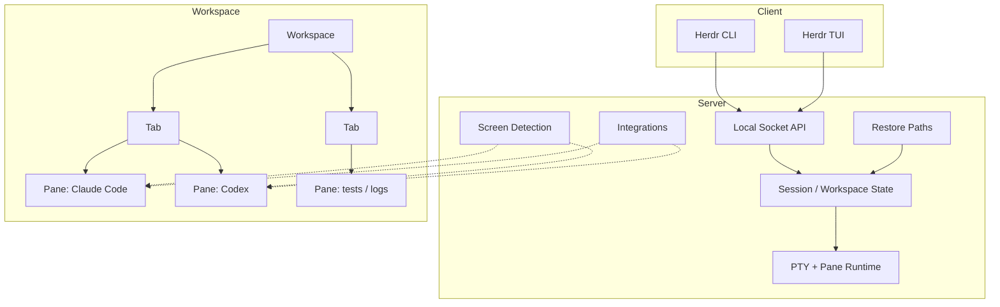

# herdr 深度解析：它不是 tmux 替代品，而是多 Agent 终端的状态层

## 学习目标

读完本文后，你应该能够：

- 解释 herdr 和 tmux 的核心差异（状态层 vs 终端复用）
- 说出 herdr 的 4 种 Agent 状态（blocked / working / done / idle）
- 解释 herdr 的多种会话恢复路径及其适用场景
- 在一台机器上部署 herdr 并配置多 Agent 工作流
- 判断你的多 Agent 场景是否适合用 herdr

如果只看截图，很多人会把 herdr 当成"更懂 AI Agent 的 tmux"。这个判断不算错，但不够准。

更贴切的说法是：**herdr 不是重新发明终端，而是在终端里补上一层长期缺失的状态系统。**  
tmux 很擅长保存 pane、拆分布局、断线重连；GUI 客户端很擅长把“这个 Agent 在等你批准”高亮出来。herdr 的价值，恰恰在于把这两件事放回同一个终端工作流里，而且不改写 Agent 自己的终端界面。

这件事在多 Agent 并行时特别重要。你同时开着 Claude Code、Codex、Cursor Agent CLI，可能还在旁边跑测试、dev server 和日志 tail。真正耗人的并不是“怎么多开几个 pane”，而是下面这些细碎但高频的判断：

- 哪个 Agent 现在卡在需要我批准的地方。
- 哪个 pane 其实已经跑完，只是我还没去看。
- 哪个项目当前最值得切过去，而不是继续盲扫所有终端。
- 能不能让 Agent A 等 Agent B 完成测试，再继续下一步，而不是全靠 prompt 里瞎猜。

herdr 针对的正是这个空位。

## 这篇文章适合谁

这篇文章主要写给三类读者：

- 终端重度用户：每天同时跑 2 个以上 coding agent，希望降低来回切 pane 的成本。
- Agent 编排实践者：已经在写“一个 agent 带另一个 agent 跑活”的脚本，想要更稳定的控制面。
- Rust TUI 开发者：想看一个生产级 `ratatui + crossterm + tokio + portable-pty + interprocess` 项目，怎么把交互、状态和进程生命周期收拢起来。

读完后，最好能回答 4 个问题：

1. herdr 到底补上了 tmux 和 GUI 分别缺的哪一块。
2. 它的 Agent 状态为什么不是"识别到了就完了"，而是要区分谁对状态有最终解释权。
3. 它为什么不是只有"一种持久化"，而是有多条会话恢复路径。
4. 这套架构为什么值得 Rust TUI 开发者认真读一遍。

## 目录

- [学习目标](#学习目标)
- [这篇文章适合谁](#这篇文章适合谁)
- [先给结论](#先给结论)
- [为什么 tmux 和 GUI 都没把这件事做完](#为什么-tmux-和-gui-都没把这件事做完)
- [阅读地图：先把三组概念拆开](#阅读地图先把三组概念拆开)
- [自测清单](#自测清单)
- [练习](#练习)
- [进阶路径](#进阶路径)

## 先给结论

如果你没有时间通读全文，可以先记住这 4 个判断：

1. **herdr 的核心不是 pane，而是状态。**  
   pane、tab、workspace 这些概念并不新，真正的新东西是它把 `blocked / working / done / idle` 变成了整个终端会话的一等信号。
2. **它不是 GUI 套皮，而是真实终端。**  
   官方文档反复强调的一点是：pane 里跑的是“真实终端进程”，不是改写后的 Agent 视图。你看到的是 Agent 自己的 TUI，而不是某个中间层的再渲染。
3. **它不是只有一条恢复路径。**  
   detach、server 重启、pane 历史回放、原生 Agent 会话恢复、live handoff，这几件事解决的是不同问题，混在一起看会把产品边界看错。
4. **它对 Agent 的支持也不是一个维度。**  
   有些集成负责上报生命周期状态，有些只负责提供原生会话身份用于恢复，还有些仍然依赖屏幕检测。理解这点，比背支持列表更重要。

## 为什么 tmux 和 GUI 都没把这件事做完

把几类常见方案放到同一张表里，herdr 的位置会清楚很多：

| 方案 | 持久会话 | pane / 切分 | 真实终端视图 | Agent 状态可视化 | 可编排性 | 主要短板 |
| --- | --- | --- | --- | --- | --- | --- |
| tmux | 是 | 是 | 是 | 否 | 弱 | 看得到 pane，看不到 Agent 语义 |
| GUI Agent 客户端 | 否或部分 | 弱 | 否 | 是 | 弱 | 有状态，没有真实终端和持久布局 |
| VS Code 类工作流 | 否 | 弱 | 否 | 部分 | 部分 | 工具链全，但终端不是核心抽象 |
| **herdr** | 是 | 是 | 是 | 是 | 是 | 学习成本和生态仍在爬坡 |

tmux 的问题不在“不能多开”，而在它不知道 pane 里到底是谁。对 tmux 来说，一个 pane 里跑的是 `node`、`python` 还是 `bash` 并不重要；对多 Agent 工作流来说，这正是最重要的信息。

GUI 客户端则走了另一个方向。它们通常能看懂“当前 Agent 在思考”还是“当前 Agent 需要确认”，但代价是你离开了原生终端。输出被重新包装，交互被重新定义，可编排性也往往停留在产品内，而不是一个开放的本地控制面。

herdr 的思路更克制：**不改写终端，不接管 Agent，只在终端旁边补一层状态与控制。**

## 阅读地图：先把三组概念拆开

原始资料里最容易混淆的，不是某个命令怎么用，而是下面三组概念：

- **布局模型**：server / workspace / tab / pane。
- **状态来源**：screen manifest 检测，还是 integration 主动上报。
- **会话恢复**：detach 保活、重启后快照恢复、原生 Agent 会话恢复、live handoff。

只要这三组概念混在一起，文章就很容易越写越像“功能清单”。先看一张总览图：



这张图里真正该先读懂的是两条主线：

- **主线一：状态主线。**  
  一个 pane 到底是 `blocked`、`working`、`done` 还是 `idle`，由谁来判定，决定了侧栏是否可信，也决定了 Agent 编排是否能建立在稳定信号上。
- **主线二：恢复主线。**  
  detach 后进程继续活着，和 server 重启后重新拉起布局，根本不是一回事；把 Agent 会话恢复回来，又是另一回事。

## 一次真实任务流：herdr 在实际工作里怎么用

抽象结构讲太久，读者会失去手感。下面用一个最常见的场景把它串起来。

假设你在 `~/code/api-server` 修一个线上 bug：

- 左侧 pane 跑 Claude Code 改业务逻辑。
- 右侧 pane 跑 Codex 执行测试。
- 下面另一个 pane 跑 dev server 或日志。

这时侧栏不是“附加 UI”，而是你做调度的主界面：

1. Claude Code 开始改代码，pane 状态变成 `working`。
2. Codex 跑测试，另一个 pane 也变成 `working`。
3. Codex 先完成，但你还没切过去看，状态会停在 `done`，而不是直接变回 `idle`。
4. Claude Code 产出 diff，等待你批准，状态变成 `blocked`。
5. workspace 汇总状态随之变成 `blocked`。你不用扫所有 pane，只需要先处理这个项目。

这看起来像一点 UI 小聪明，但它改变的是注意力分配方式。tmux 的世界里，你靠记忆和轮询确认“谁先需要我”；herdr 的世界里，系统把这个顺序显式化了。

如果再往前走一步，让 Agent 自己参与编排，事情会更明显：

```bash
# 读取另一个 pane 的最近输出
herdr pane read 1-2 --source recent --lines 50

# 等待某个 Agent 进入 done 状态
herdr wait agent-status 1-2 --status done --timeout 60000

# 或者等待输出里出现特定模式
herdr wait output 1-3 --match "server.*ready" --regex --timeout 30000
```

这几条命令的价值不在“能不能写出 shell 脚本”，而在**脚本终于拿到了一个系统认可的状态面**。  
如果没有这个状态面，所谓多 Agent 编排通常只能退化成睡眠、轮询和脆弱的字符串匹配。

## 核心模型：server / workspace / tab / pane

官方文档里的概念并不复杂，但它们的边界很重要。

### server：后台常驻的运行时

`herdr` 默认会 attach 到一个后台 server。  
`ctrl+b q` 只是断开当前 client，不会停掉 server，更不会停掉 pane 里的进程。

这意味着：

- 你可以关掉当前终端窗口，稍后再 `herdr` 重新连回去。
- 你可以在多个终端窗口同时 attach 到同一个 server。
- 只有 `herdr server stop` 或 `herdr session stop <name>` 这类操作才会真正结束对应 server。

对于 tmux 用户，这是最容易迁移的一层：持久性依旧在，只是 session namespace 的表达更明确。

### workspace：项目级容器

workspace 更像“一个项目的工作上下文”，通常围绕 git 仓库或某个目录组织。

```bash
herdr workspace create --cwd ~/project --label api
herdr workspace list
```

herdr 的很多设计，都在强化这个“项目级”视角。侧栏不是简单列 pane，而是先汇总到 workspace，再展开到 tab 和 pane。对多项目并行的人来说，这比传统终端复用器更贴近真实工作方式。

### tab：workspace 内的子上下文

tab 用来做项目内分组。比如同一个仓库里，你可能单独开：

- 一个 tab 跑主 Agent。
- 一个 tab 跑测试和日志。
- 一个 tab 放 review 或文档任务。

这比把所有进程平铺到一个 pane 树上更容易管理，也更适合被 API 编排。

### pane：真实终端，不是改写后的 Agent 视图

这是 herdr 最关键的承诺之一：**pane 里跑的是原生终端进程。**

这一点听起来像产品文案，实际上是架构边界。  
Agent 输出的 ANSI 序列、光标移动、alternate screen、progress bar、diff 高亮，herdr 都必须尊重，而不是把它们抽象成某种统一的 GUI 小部件。

从 Rust 工程视角看，这意味着它得同时做好几件事：

- 用 `portable-pty` 跑跨平台 PTY。
- 用终端兼容层把字节流渲染成屏幕 cell。
- 在不篡改原始交互的前提下，额外做状态识别和 UI 聚合。

这也是为什么“真实终端视图”不是一句空话，而是整个产品的基础假设。

### 一个容易踩坑的细节：ID 不是永久主键

官方 Agent Skill 明确提醒过一点：workspace、tab、pane 的公共 ID 会在关闭后压缩和复用，不应该被当成 durable id。

也就是说：

- `1-2` 这种 pane id 只是当前会话里的紧凑编号。
- 你不能默认“上次看到的 `1-2` 现在还是同一个 pane”。
- 写脚本或 orchestrator 时，应该在关键操作前重新 `list`。

这是很多终端自动化脚本不稳定的根源之一。herdr 没有回避这个问题，而是把它写进了官方约束。

## Agent 状态识别：关键不是“识别谁”，而是谁对状态有解释权

很多人第一次看 herdr，会把它理解成“一个更懂 Agent 的检测器”。这还是说浅了。

更准确的理解是：**Herdr 先识别 pane 里跑的是谁，再决定谁有资格 author 这个 pane 的状态。**

截至 2026-06，官方文档里的支持模型大致可以分成 3 类：

| 类别 | 代表 Agent | 状态来源 | 会话恢复能力 |
| --- | --- | --- | --- |
| 生命周期 authority | Pi、OMP、Kimi Code CLI、OpenCode、Kilo Code CLI、Hermes Agent | 安装 integration 后由 hook / plugin 主动上报 `idle / working / blocked` | 多数同时支持原生 session 恢复 |
| 屏幕检测 + session identity | Claude Code、Codex、GitHub Copilot CLI、Devin CLI、Droid、Qoder CLI、Cursor Agent CLI | 状态仍由 screen manifest 判定 | integration 提供原生会话身份，用于重启后恢复 |
| 仅屏幕检测 | Amp、Grok CLI、Antigravity CLI、Kiro CLI | 依赖前台进程名和底部屏幕快照 | 无官方原生恢复 |

另外，Gemini CLI 和 Cline 目前属于“能识别，但测试没那么充分”的那一类。

这套划分很重要，因为它说明 herdr 不是“装了 integration 就全都更聪明”。不同 integration 解决的是不同问题：

- 有些 integration 负责**状态权威**。
- 有些 integration 只负责**会话身份**。
- 两者并不总是同时存在。

### 为什么 screen manifest 不是低配方案

官方文档和 `AGENTS.md` 里有一个一以贯之的原则：**screen detection 必须是 evidence-based。**

翻成工程语言就是：

- 看底部 live buffer，不看用户滚动后的 viewport。
- 不做模糊“猜测”，只匹配明确可见的控件和文本模式。
- 用显式的 AND / OR 规则组合，而不是把整屏文本扔给一个黑箱。

这么做不是保守，而是为了可测试、可复现、低延迟。  
状态信号一旦要被等待、被订阅、被拿去做自动化，误判成本就会迅速高过“看起来不够智能”的那点遗憾。

### `blocked` 为什么通常做得更严格

官方文档专门提到，screen-manifest Agent 的 `blocked` 检测会故意收紧。  
只有当底部缓冲区出现明确的确认、批准、提问或权限 UI 时，Herdr 才会标成 `blocked`。

这背后的取舍很务实：

- 误把普通输出判成 `blocked`，会打乱人的注意力。
- 误把不稳定状态拿去做自动化等待，更危险。

因此对未知或新变种界面，Herdr 宁可回退到保守状态，也不愿意强行“猜对”。这类设计，看似不那么炫，反而更像面向生产环境的工程判断。

### 侧栏汇总为什么是 herdr 的真正工作流

单个 pane 的状态当然重要，但 herdr 真正改变的是汇总后的工作流：

- 某个 pane `blocked`，对应 tab 和 workspace 也会表现为需要关注。
- 某个 pane `done`，它会保持可见，直到你真的去看过。
- 多个项目并行时，你先看 workspace 汇总，再决定切到哪个 pane。

这就是它和 tmux 的根本差异：tmux 帮你管理终端，herdr 帮你管理注意力。

## 会话状态：herdr 其实有不止一条“恢复路径”

这是原始资料里最容易被说糊的部分。  
很多文章会把“持久化”“恢复”“热更新”“断线重连”混成一句话，但官方文档把它们拆得很清楚。

最实用的看法是下面这张表：

| 场景 | 进程是否继续运行 | 布局是否回来 | 最近屏幕是否回来 | Agent 会话是否恢复 |
| --- | --- | --- | --- | --- |
| detach / reattach | 是 | 是 | 是，来自 live terminal | 是，因为进程根本没停 |
| server 重启 | 否 | 是 | 只有启用 pane history 才会回来 | 只有支持原生 session restore 的 Agent 才会回来 |
| `herdr update`（无 `--handoff`） | 取决于更新路径，常见情况需要停旧 server | 是 | 依赖 pane history | 依赖原生 session restore |
| `herdr update --handoff` | 尝试保活当前进程 | 是 | 成功时保留 live terminal | 成功时保留当前会话 |

把这张表读懂，很多概念就不容易串台了。

### 1. live persistence：最强的持久性

detach 是最“硬”的持久化，因为原始进程根本没有停。  
这时：

- 你的 shell 还在。
- 你的 Agent 还在。
- 你的 dev server、测试、日志 tail 也都还在。

这不是“恢复”，而是**继续活着**。

### 2. snapshot restore：恢复的是形状，不是旧进程

server 停掉再起来之后，Herdr 能恢复 workspace、tab、pane、cwd、布局和焦点，但不能凭空让原来的普通进程复活。

这是很多人最容易误解的一点：  
**快照恢复恢复的是会话形状，不是进程本体。**

### 3. pane screen history replay：恢复的是可见上下文

官方文档把 pane history 说得很诚实：  
它恢复的是“Herdr 能展示给你看的最近输出”，不是旧进程本身。

而且它默认关闭，因为终端输出里经常带着 token、日志、prompt 和敏感数据。

```toml
[experimental]
pane_history = true
```

这个功能对日志、shell、长跑任务很有用，但也确实引入了本地敏感信息留存的问题。

### 4. native agent session restore：恢复的是 Agent 自己的上下文

这条路径才是 herdr 在 AI Agent 场景里最像“专用工具”的地方。

如果 integration 能报告原生 session reference，Herdr 就能在 server 重启后用 Agent 自己的恢复命令把会话接回来。例如文档列出的恢复命令包括：

- `claude --resume <id>`
- `codex resume <id>`
- `copilot --resume=<id>`
- `cursor-agent --resume <id>`
- `devin --resume <id>`

这和 pane 快照恢复完全不是一个层级。  
前者恢复的是“这个 Agent 之前在聊什么、做到哪一步”，后者恢复的是“这个 pane 长什么样”。

### 5. live handoff：最冒险，也最诱人的那条路

`herdr update --handoff` 的目标，是在替换 server 的同时尽量不杀掉当前 pane 进程。  
这件事很吸引人，因为它瞄准的是最痛的升级场景：长跑 Agent、前台 dev server、需要连续交互的终端任务。

但官方文档写得很清楚：**它是 experimental，且是 opt-in。**

这类功能最该用的态度不是“酷，默认打开”，而是“先在自己的 Agent 组合上跑一轮真实验证”。它属于高价值，也属于高风险。

## Socket API：Herdr 真正给 Agent 暴露的是控制面

只把 herdr 当成一个“会显示状态的终端复用器”，会低估它的另一半能力。

官方文档把对外集成面拆成 3 层：

| 层级 | 适合场景 |
| --- | --- |
| Agent skill | 教 coding agent 如何在 pane 内使用 herdr |
| CLI wrappers | shell 脚本、简单编排、人工调试 |
| Raw socket API | 自定义客户端、协议级控制、长连接订阅 |

这 3 层共享的是同一个控制面。  
差别不在“能做什么”，而在“你要不要自己处理协议和订阅生命周期”。

### 这套控制面能做什么

从官方 `socket API` 文档看，Herdr 至少把下面这些动作开放出来了：

- 创建、列出、聚焦、关闭 workspace 和 tab。
- split、读取、发送输入、关闭 pane。
- 启动 Agent，读取 Agent，等待状态变化。
- 订阅事件，等待输出，安装 integration。
- 重载配置，停止 server。

这意味着 Agent 不只是“跑在 pane 里”，而是能把 Herdr 当成自己的局部操作系统。

### 为什么这比单纯的“capture pane”更重要

很多脚本系统都能做到“读一点别的终端输出”。  
Herdr 关键的增强在于，它让 Agent 能同时拿到：

- 布局控制。
- 输出读取。
- 状态等待。
- 事件订阅。

当这四样东西同时存在时，你才能比较像样地写出这样的工作流：

```bash
# 在当前项目里起一个专门跑测试的 pane
herdr pane split 1-1 --direction right --no-focus
herdr pane run 1-2 "cargo test"

# 等测试跑完
herdr wait agent-status 1-2 --status done --timeout 120000

# 读结果，再决定下一步
herdr pane read 1-2 --source recent --lines 80
```

tmux 也能拼出一部分，但它缺少面向 Agent 语义的那层状态与等待接口。  
这就是 herdr 的“multiplexer”为什么不是传统意义上的 session multiplexer，而更像 Agent workflow 的 control plane。

### 写自动化时要记住的约束

官方文档和 Agent skill 里，有几条约束值得直接记住：

1. **不要把 pane id 当永久身份。**
2. **`HERDR_ENV=1`、`HERDR_SOCKET_PATH`、`HERDR_WORKSPACE_ID`、`HERDR_TAB_ID`、`HERDR_PANE_ID` 会注入到受管进程里。**
3. **能用 `--no-focus` 的地方尽量用，避免自动化脚本把焦点切乱。**
4. **等输出和等状态优先走官方等待接口，不要自己写脆弱轮询。**

这些限制并不性感，但决定了自动化是“看起来能跑”，还是“能在第二周继续跑”。

## Rust 工程视角：为什么这个仓库值得读

如果你把 herdr 当成一个普通命令行工具，可能会忽略它在工程组织上的价值。  
从仓库的 `AGENTS.md` 和 `Cargo.toml` 看，它其实是一个很适合学习的 Rust TUI 样本。

截至当前，`Cargo.toml` 标出来的版本是：

```toml
[package]
name = "herdr"
version = "0.7.0"
description = "terminal workspace manager for AI coding agents"
license = "AGPL-3.0-or-later"
```

### 一组很值得抄走的设计原则

`AGENTS.md` 里最重要的不是流程，而是那几条短原则：

1. **State is separated from runtime**  
   状态数据和实际 PTY / async runtime 分开，意味着很多逻辑可以脱离真实终端做测试。
2. **Render is pure**  
   渲染函数只画，不偷改状态。这是 TUI 应用稳定下来的基本功。
3. **No god objects**  
   模块一旦开始包山包海，就继续拆。
4. **Platform code is isolated**  
   平台差异收拢到专门目录，核心逻辑不被 `#[cfg(...)]` 污染。
5. **Detection is decoupled**  
   检测器只吃屏幕快照，不和 viewport、parser 或 UI 状态缠在一起。
6. **Screen detection is evidence-based**  
   状态识别必须基于可验证证据，而不是模糊猜测。
7. **UI patterns should be reused**  
   既然是 mouse-first TUI，就别给每个新功能都发明一套新交互。

这几条原则单看并不新鲜，但能在一个同时涉及 PTY、TUI、IPC、状态机和恢复路径的项目里持续执行，含金量就很高了。

### 依赖栈为什么搭得顺

从 `Cargo.toml` 看，最核心的依赖栈大概是这几项：

| 依赖 | 版本 | 角色 |
| --- | --- | --- |
| `ratatui` | `0.30` | TUI 渲染 |
| `crossterm` | `0.29` | 跨平台终端事件和控制 |
| `tokio` | `1` | 异步调度 |
| `portable-pty` | `0.9` | 跨平台 PTY |
| `interprocess` | `2.4.2` | 本地 IPC |
| `serde` / `serde_json` / `bincode` | `1` / `1` / `2` | 配置与协议序列化 |
| `regex` | `1` | 检测规则 |
| `tracing` / `tracing-subscriber` | `0.1.44` / `0.3.23` | 可观测性 |

这套组合之所以舒服，是因为分工比较清楚：

- `ratatui` 负责“画什么”。
- `crossterm` 负责“终端能做什么”。
- `portable-pty` 负责“谁在终端里跑”。
- `tokio` 负责“这些事情怎么并发地跑起来”。
- `interprocess` 负责“client 和 server 怎么本地说话”。

你很少能在一个项目里看到这几类能力以这么直接的方式拼在一起。

### 它为什么比很多 demo 更值得看

很多 Rust TUI 示例项目的问题，不是功能少，而是复杂度太低，学不到真实取舍。  
herdr 的难点刚好都是真实的：

- 终端输出不能乱改，但你又要做状态判断。
- 进程生命周期和 UI 生命周期不是同一件事。
- 恢复路径不是一条，而是多条并行策略。
- 你既要服务人，也要服务 Agent。

这类项目读完，能学到的不是一个组件怎么用，而是**复杂边界应该怎么被拆开。**

## 安装、上手和第一次有效体验

官方目前给了几条主流安装路径。

### 安装

直接安装：

```bash
curl -fsSL https://herdr.dev/install.sh | sh
```

Homebrew：

```bash
brew install herdr
```

mise：

```bash
mise use -g herdr
```

源码构建：

```bash
git clone https://github.com/ogulcancelik/herdr
cd herdr
cargo build --release
./target/release/herdr
```

如果你打算看源码，顺手记住仓库提供的检查命令：

```bash
just test
just check
```

### 第一次上手，最值得试的不是“切 pane”，而是“看状态是否靠谱”

建议第一次体验这样做：

1. 在项目目录里直接运行 `herdr`。
2. 用 `ctrl+b` 加 `v` 或 `minus` 分出两个 pane。
3. 左边跑常用 Agent，右边跑测试或第二个 Agent。
4. 再安装你最常用的 integration，比如：

```bash
herdr integration install claude
herdr integration install codex
herdr integration status
```

第一次验证最值得看的不是键位，而是两件事：

- 你的 Agent 状态切换是否足够准。
- 你的工作流是否真的从“轮询每个 pane”变成了“按侧栏优先级处理”。

如果这两件事没发生，herdr 对你就还只是另一个 multiplexer；如果发生了，它才开始显出产品价值。

### tmux 用户怎么迁

tmux 用户迁移 herdr 时，最容易接受的是：

- 前缀仍然是 `ctrl+b`。
- detach / reattach 的直觉依旧成立。
- pane / tab 的基本操作没有太大违和。

最需要重新建立认知的是：

- workspace 是更强的项目级容器。
- 侧栏状态是第一层入口，而不是附属显示。
- Agent 等待与输出读取，可以正式交给控制面处理。

换句话说，迁移成本主要不在手，而在脑。

## 配置、远程和插件：第二周才需要关心的内容

如果你只是想先把 herdr 用起来，这一节其实可以先略读。

### 配置文件和日志

配置文件路径：

```text
~/.config/herdr/config.toml
```

打印默认配置：

```bash
herdr --default-config
```

最常用的日志文件：

```text
~/.config/herdr/herdr-client.log
~/.config/herdr/herdr-server.log
```

一旦你开始依赖持久 server、integration 或 socket API，这两个日志基本就是第一排查入口。

### 远程 attach

官方支持远程 attach：

```bash
herdr --remote workbox
herdr --remote ssh://you@yourserver:2222
```

这类模式对“远端跑服务，本地盯状态和输出”的场景很有吸引力。  
但要注意，它和本地使用的复杂度不是一个量级，尤其一旦再叠加 handoff、integration 和自定义 SSH 行为，排错成本会明显上升。

### 插件和自定义状态标签

从文档看，Herdr 已经有早期插件系统，也支持通过 socket API 上报自定义状态标签。  
这意味着它未来不只是“支持哪些官方 Agent”，而是有机会长成一个可扩展的本地 Agent orchestration 平台。

不过在今天这个阶段，我更建议把它当“有扩展潜力的控制面”，而不是已经成熟的插件生态。

## 适合谁，不适合谁

### 适合

- 同时跑多个 coding agent，而且经常因为切 pane 和盲扫状态浪费注意力的人。
- 想保留终端工作流，不想被 GUI 改写输出的人。
- 需要脚本化或 Agent 化编排 terminal tasks 的人。
- 想研究 Rust TUI、PTY、IPC 和状态恢复怎么放进一个产品的开发者。

### 不适合

- 你长期只跑一个 Agent，几乎没有并行调度需求。
- 你根本不想留在终端里，希望一切都在 GUI 中完成。
- 你所在团队对许可证约束非常敏感，而又不打算接受相应的开源或商业授权路径。
- 你需要的是稳定 Windows 体验，而不是 preview beta。

## 风险和边界

讨论这类工具，最好不要只写“优点很多”。下面这些边界，才是真实使用时会碰到的东西。

- **状态识别不是魔法。**  
  对纯 screen-manifest Agent 来说，新版 UI 或特殊交互一旦偏离已知规则，识别准确率就会下降。
- **pane history 有安全代价。**  
  它恢复的是最近可见输出，也可能顺手把敏感信息留在本地状态目录。
- **live handoff 仍是实验功能。**  
  它很吸引人，但不该在关键生产环境里“想当然地可靠”。
- **ID 压缩会坑自动化。**  
  只要你的脚本缓存旧 pane id，就迟早会踩到复用问题。
- **tmux inside herdr 会影响检测。**  
  如果你在 Herdr 管理的 pane 里再自动进入 tmux，Herdr 看到的前台进程可能只剩 `tmux`，而不是后面的 Agent。
- **更新路径和安装方式有关。**  
  官方文档明确写了：`herdr update` 只适用于 Herdr 自己管理的安装方式，Homebrew、mise、Nix 走各自的包管理路径。

## 采用顺序建议

如果你准备真的把它纳入日常工作流，我更建议按下面的顺序来，而不是一上来就“全面迁移”。

### 路径 A：终端重度用户

1. 安装 herdr，直接在现有项目目录里跑一次。
2. 装最常用的 1 到 2 个 integration。
3. 用一天真实工作量验证状态切换。
4. 确认侧栏真的改变了你的切换顺序，再考虑替代 tmux 的部分会话。

### 路径 B：Agent 编排实践者

1. 先读官方 [Socket API](https://herdr.dev/docs/socket-api/)。
2. 再读官方 [Agents](https://herdr.dev/docs/agents/) 和 [Integrations](https://herdr.dev/docs/integrations/)。
3. 先做“起一个 pane、等一个状态、读一段输出”这种最小可验证流程。
4. 稳定后再碰事件订阅、远程 attach 和 handoff。

### 路径 C：Rust TUI 开发者

1. 先看 `Cargo.toml`，确认依赖面。
2. 再看 `AGENTS.md`，理解工程约束。
3. 最后顺着 client / server / pane / detection / restore 这几条主线读源码。

如果反过来，一开始就扎进实现细节，很容易读成一个“功能很多的 TUI 项目”，而错过它真正有价值的架构边界。

## 自测问题

如果你准备把这篇文章当成入门或内部分享材料，下面 5 个问题可以当作自测：

1. herdr 和 tmux 的根本差异，为什么不是“多了侧栏”这么简单？
2. 为什么说 integration 不等于统一增强，而要区分 lifecycle authority 和 session identity？
3. pane history 和 native agent session restore 的恢复对象分别是什么？
4. 为什么 herdr 的 screen detection 强调 evidence-based，而不是“更智能地猜”？
5. 对需要写 Agent 编排的人来说，为什么状态等待接口比单纯读屏更关键？

如果这 5 个问题能回答得比较顺，说明你已经抓到了 herdr 的主线。

## 练习

### 练习 1：安装并配置 herdr

完成以下任务：
1. 安装 herdr（参考官方文档）
2. 启动 herdr server
3. 创建 3 个 pane，分别运行不同的命令（如 `top`, `vim`, `python3`）
4. 练习 detach 和 attach
5. 检查 pane 状态是否正确显示

### 练习 2：配置 Agent 集成

完成以下任务：
1. 配置 herdr 的 Agent 集成（如 Claude Code 或 Codex）
2. 启动一个 Agent session
3. 观察 herdr 是否正确显示 Agent 状态（blocked / working / done / idle）
4. 测试 Agent 等待接口（如果支持）

### 练习 3：多 Agent 编排

写一个脚本，实现以下流程：
1. 在 herdr 中启动 Agent A（如代码生成）
2. 等待 Agent A 完成
3. 自动启动 Agent B（如测试运行）
4. 等待 Agent B 完成
5. 输出结果汇总

### 练习 4：会话恢复测试

测试 herdr 的多种会话恢复路径：
1. detach 后重新 attach
2. 重启 herdr server 后恢复会话
3. 如果支持，测试原生 Agent 会话恢复
4. 记录每种恢复方式的适用场景和限制

## 进阶路径

### 路径 1：从用户到贡献者

如果你已经在用 herdr，下一步可以：
1. **贡献集成**：给 herdr 加一个新的 Agent 集成（如 Gemini CLI）
2. **改进检测**：优化 screen detection 的准确性
3. **贡献文档**：改进 herdr 的文档和示例

### 路径 2：从工具到编排系统

如果你在用 herdr 做多 Agent 编排，下一步可以：
1. **做可视化 dashboard**：基于 Socket API，做一个 Web dashboard 显示所有 Agent 状态
2. **做自动调度**：基于 Agent 状态，实现自动任务调度（如 Agent A 完成后自动启动 Agent B）
3. **做失败恢复**：实现 Agent 失败后的自动重试和状态恢复

### 路径 3：从终端工具到开发平台

如果你在做 Agent 相关的产品，下一步可以：
1. **研究 herdr 的架构**：深入理解它的状态层设计，应用到自己的产品
2. **做类似工具**：基于 herdr 的设计思路，做面向其他场景的状态层工具
3. **贡献到生态**：把你的 Agent 工具集成到 herdr，或把 herdr 的某些设计抽到独立库

herdr 是入口，不是终点。它帮你建立"多 Agent 终端状态管理"的直觉，下一步往哪个方向走看你的项目需求。

## 延伸阅读

如果你准备继续往下挖，最值得配套阅读的是这些官方资料：

- [Herdr 文档首页](https://herdr.dev/docs/)
- [Agents](https://herdr.dev/docs/agents/)
- [Integrations](https://herdr.dev/docs/integrations/)
- [Socket API](https://herdr.dev/docs/socket-api/)
- [Session state and restore](https://herdr.dev/docs/session-state/)
- [GitHub 仓库](https://github.com/ogulcancelik/herdr)
- [给 Agent 的 guide](https://herdr.dev/agent-guide.md)

## 总结

herdr 真正解决的问题，不是“终端里怎么多开几个 pane”，而是**多 Agent 并行之后，状态终于有了统一落点**。

它保留了终端工作流最宝贵的东西：真实进程、真实输出、持久会话；又补上了传统终端复用器最缺的那一层：Agent 状态、项目级汇总、可等待的控制信号，以及一个能被脚本和 Agent 利用的本地控制面。

如果你只跑一个 Agent，它未必是刚需。  
如果你已经开始同时跑多个 Agent、多个测试任务、多个项目，herdr 的意义就不止是“更方便”，而是把原本靠人脑兜底的调度，第一次收敛成了一个可见、可控、可自动化的系统。

对 Rust 开发者来说，这个项目同样值得看。它把 TUI、PTY、IPC、状态机和恢复路径放进了一个真正有产品压力的场景里。读这样的代码，比读十个玩具 demo 更接近工程现场。
