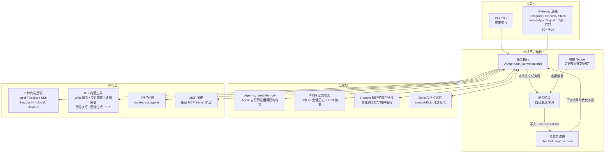

# Hermes Agent 深度解析：从「用完即忘」到「越用越强」的工程路径

## 这篇文章回答什么问题

市面上自称「AI Agent」的项目很多，但绝大多数在同一个问题上翻了车：**跨会话之后，Agent 什么都不记得。** 你花了 20 分钟教它你的项目结构、偏好、踩过的坑，下次打开新对话，一切归零。这不是 Agent 的错——它本来就没有记忆系统。

[Hermes Agent](https://github.com/NousResearch/hermes-agent)（仓库 `NousResearch/hermes-agent`，MIT 许可证，GitHub 150k+ Stars）是 Nous Research 对这个问题的回答。它做了一件别家没拼齐的事：把「任务执行 → 经验沉淀 → 技能复用 → 跨会话召回」串成了一条**自治闭环**。你不用手动维护记忆库，也不用写 `AGENTS.md` 教它——Agent 自己从已完成的任务里提取经验，写成可复用的 skill，下次遇到同类任务直接调用。

这篇文章会拆开这个闭环的每一层，讲清楚它怎么工作、怎么落地、以及什么时候不适合用。

## 系统地图

先看整体布局。Hermes Agent 的架构可以按三层职责来划分：



三层职责的边界：

- **入口层**只管「消息怎么进来」。CLI 和 20+ IM 平台通过同一个 Gateway 进程接入，对话上下文跨平台共享。
- **学习循环**是 Hermes 区别于其他 Agent 的地方。它不是一个附属功能，而是嵌在 `AIAgent.run_conversation()` 主循环里的固定流程。
- **记忆层**提供四条互相独立的存储和召回路径，每条路径管一类信息。后面会详细拆开。
- **执行层**负责「Agent 实际在哪干活、用什么工具」。六种后端让 Agent 可以选择在本地、VPS、容器、HPC 集群或 serverless 环境里执行命令。

## 一条任务怎么流过整个系统

在拆机制之前，先看一个具体例子。假设你给 Hermes 发了这条消息：

> "帮我写一个 Python 脚本，每天凌晨 2 点从 PostgreSQL 导出上一天的订单数据到 CSV，上传到 S3，发 Slack 通知。要有错误重试。"

### 第 1 步：入口路由

消息从 Telegram 发出，Gateway 进程收到后，加上 `platform: "telegram"` 标签，交给 `AIAgent.run_conversation()`。

### 第 2 步：上下文装配

Agent 在开始推理之前，先做三件事：

1. 从 FTS5 索引里用消息内容做全文检索，拉出相关历史会话片段
2. 检查 `~/.hermes/skills/` 下有没有匹配的 skill（比如之前写过类似的「数据库导出脚本」）
3. 如果启用了 Honcho，读取当前用户画像（"你偏好错误处理要做显式重试、日志用 structlog"）

这些信息一起拼进 system prompt，作为本轮对话的上下文。

### 第 3 步：工具执行循环

Agent 进入 `run_conversation()` 的主循环（默认最多 90 轮迭代）。它可能：

- 调用 `execute_command` 在 SSH backend 上检查 PostgreSQL 是否可达
- 调用 `write_file` 创建 Python 脚本
- 调用 `execute_command` 跑一遍脚本验证
- 调用 `web_search` 查 S3 SDK 的 API 签名
- 调用 `schedule_cron` 注册定时任务

### 第 4 步：反思与技能生成

任务完成后，Agent 判断这个任务「足够复杂、值得沉淀」，于是自动触发 skill 生成流程：

1. 把整个对话轨迹（用户消息 + 工具调用 + 输出）做摘要压缩
2. 提取关键步骤：连接方式、重试逻辑、通知格式、cron 表达式
3. 生成一个 `postgres-to-s3-export.md` skill 文件，写入 `~/.hermes/skills/`
4. 在 FTS5 索引里记录这次会话的摘要向量

### 第 5 步：后续复用

一个月后，你在 Slack 上说："上次那个导出脚本，加一个 BigQuery 的目标。"Agent 从 FTS5 里搜到相关会话，加载 `postgres-to-s3-export.md` skill，在已有脚本基础上改——而不是从零开始写。

这个流程不是「设计目标」或「路线图」，是当前版本的真实行为。

## 闭环学习：四阶段拆解

上一节讲的是「一条任务怎么流过系统」，这一节把循环本身拆开，看每个阶段在做什么、为什么这样设计。

### 阶段 1：Agent-curated Memory——为什么不是「全部写入」

大部分 Agent 记忆方案走的是「全量写入」路线：把每轮对话都存下来，靠检索时筛选。这条路的问题是噪音——你问「今天天气怎么样」和「这个项目的数据库连接串是什么」被同等对待。

Hermes 的做法是让 Agent 自己判断：**这段对话里有没有值得长期保留的信息？** 判断标准不是硬编码的规则，而是 Agent 在推理时自己做的决策。Agent 会跳过闲聊、一次性查询和已过时的信息，只把「对后续任务有用的内容」写进 memory。

这带来一个代价：Agent 可能漏记。但从工程角度看，**漏记比误记好**——误记会在检索时污染上下文，让 Agent 做出错误决策；漏记只是多问一次。

### 阶段 2：Autonomous Skill Creation——从经验到可复用流程

Memory 存的是「事实」（数据库连接串是什么），Skill 存的是「方法」（怎么从 PostgreSQL 导出数据到 S3）。两者的区别：

|  | Memory | Skill |
| --- | --- | --- |
| 存什么 | 事实、偏好、上下文 | 多步操作流程 |
| 触发方式 | 检索时自动注入 | 任务开始时主动匹配 |
| 格式 | 自然语言条目 | 结构化 Markdown 文件 |
| 是否能被其他 Agent 复用 | 否 | 是（agentskills.io 标准） |

Skill 生成的核心逻辑：

1. 任务完成后，Agent 评估复杂度（工具调用次数、跨领域操作、用户反馈）
2. 超过阈值 → 触发 skill 生成
3. 压缩对话轨迹为摘要，提取关键步骤和参数
4. 生成 Markdown 格式的 skill 文件，包含触发条件、前置依赖、操作步骤、常见错误处理
5. 写入 `~/.hermes/skills/`，下次 Agent 启动时自动加载

### 阶段 3：Skill Self-Improvement——使用时持续优化

Skill 不是「生成后就固定」的静态文件。每次 Agent 调用某个 skill 时，如果执行过程中发现了更好的参数、更短的操作路径，或者用户给了纠正反馈，Agent 会更新这个 skill 文件。

这个机制的关键设计是：**不单独触发一次「优化」流程，而是在正常使用中自然发生。** 你不需要手动告诉 Agent「优化这个 skill」——它在下一次使用同一个 skill 时，会对比上次的执行结果和这次的新发现，自动合并改进。

### 阶段 4：Periodic Nudge + FTS5 跨会话搜索

前三个阶段都发生在「有任务」的时候。但 Agent 也有「空闲时间」——Hermes 用 cron 调度器周期性地触发 nudge，让 Agent 在没有任务的时候主动整理知识：

- 合并碎片化的 memory 条目
- 发现多个 skill 之间的重叠，合并或拆分
- 把短期记忆里「反复出现但还没写成 skill」的模式提升为 skill

FTS5（SQLite 全文搜索引擎）是跨会话搜索的底层。每条会话结束后，Agent 用 LLM 对会话做摘要，摘要文本和元数据一起写入 FTS5 索引。下次新任务开始时，Agent 用任务描述做全文检索，拉出相关历史——不是靠关键词匹配，而是靠语义相似度（摘要文本涵盖了原始对话的语义）。

## 记忆层：四条独立路径

前面提到记忆层有四条互相独立的存储和召回路径。把这四条路径的边界搞清楚，是理解 Hermes 学习能力的前提。

### 路径 1：Agent-curated Memory（事实性记忆）

- 存储内容：用户偏好、项目配置、关键决策、踩过的坑
- 写入方式：Agent 自主判断，非全量
- 存储位置：`~/.hermes/memory/`
- 召回方式：每次新对话开始时自动注入 system prompt
- 典型例子："你习惯用 structlog 而不是 logging"、"这个项目的数据库端口是 5433 不是 5432"

### 路径 2：FTS5 会话索引（情景记忆）

- 存储内容：每轮对话的 LLM 摘要 + 元数据
- 写入方式：会话结束后自动触发
- 存储位置：SQLite 数据库（`~/.hermes/sessions.db`）
- 召回方式：任务开始时用任务描述做全文检索
- 典型例子：搜到「三周前你让我修过一个类似的 PostgreSQL 连接超时 bug」

### 路径 3：Skills 程序性记忆（方法记忆）

- 存储内容：可复用的多步操作流程
- 写入方式：复杂任务完成后自动生成
- 存储位置：`~/.hermes/skills/`（Markdown 文件，兼容 agentskills.io）
- 召回方式：任务开始时按触发条件匹配
- 典型例子：`postgres-to-s3-export.md`、`deploy-to-k8s.md`

### 路径 4：Honcho 辩证式用户建模（元认知）

- 存储内容：用户偏好的深层原因（"为什么喜欢 X 而不是 Y"）
- 写入方式：基于多轮对话的辩证分析
- 存储位置：Honcho 云端（可选，可关闭）
- 召回方式：每次对话持续更新用户画像
- 典型例子："你偏好异步处理不是因为性能，而是因为你在意可中断性"

Honcho 的辩证式建模和普通「用户画像」的区别：普通画像回答「用户喜欢什么」，Honcho 回答「用户为什么喜欢这个」。后者在 Agent 需要做「没有明确指令的决策」时（比如选哪个库、用哪种错误处理策略）更有用。

但代价也明确：Honcho 需要足够多的对话数据才能构建有意义的画像，而且默认是云端集成——如果数据合规要求零数据出本地，需要关掉它。

### 记忆系统的内部实现

理解四条路径的边界之后，看几个关键实现细节——它们决定了这个系统在实际使用中的行为。

#### MEMORY.md 与 USER.md：两个文件，严格容量上限

Agent 的持久记忆只有两个文件，存在 `~/.hermes/memories/` 下：

| 文件 | 用途 | 容量上限 |
|---|---|---|
| `MEMORY.md` | Agent 自己的笔记——环境事实、项目约定、学到的东西 | 2,200 字符（约 800 tokens） |
| `USER.md` | 用户画像——偏好、沟通风格、技能水平 | 1,375 字符（约 500 tokens） |

容量上限是硬约束。当 memory 超过 80% 时，Agent 必须先合并或删除旧条目，才能写入新内容。Agent 用 `memory` 工具的三个操作来管理：`add`（新增）、`replace`（用子串匹配替换，不需要完整原文）、`remove`（同样子串匹配删除）。

#### 冻结快照模式

Memory 在每次会话开始时被注入 system prompt，之后整个会话期间不再变化。这不是 bug——它是故意设计的性能优化：LLM 的 prefix cache 依赖 system prompt 的稳定性，如果每次写 memory 都改 system prompt，cache 会全部失效。写入操作立即落盘，但只在下一次新会话时生效。

#### session_search vs memory 的分工

Hermes 的会话搜索（`session_search` 工具）和持久记忆是两条不同的召回路径：

| | 持久记忆（MEMORY.md/USER.md） | 会话搜索（FTS5） |
|---|---|---|
| 容量 | 总计约 1,300 tokens | 无上限（所有历史会话） |
| 速度 | 即时（已在 system prompt 里） | ~20ms FTS5 查询 |
| 成本 | 每轮对话固定 token 消耗 | 按需搜索，不搜索时零成本 |
| 用途 | 关键事实始终在上下文里 | 查找"我们上周讨论过 X 吗"这类问题 |

**安全扫描**：所有 memory 写入在落盘前都经过注入和泄露模式扫描——包含 prompt 注入特征、凭证泄露、SSH 后门或不可见 Unicode 字符的内容会被直接拒绝。

## Skills 系统内部机制

前面讲 Skills 是记忆层的第四条路径。这里补充几个决定 Skill 实际可用性的实现细节。

### 渐进式加载（Progressive Disclosure）

Skills 不会一次性全部载入 system prompt。它们按三级加载：

```text
Level 0: skills_list() → [{name, description, category}, ...]  约 3k tokens
Level 1: skill_view(name) → 完整 SKILL.md 内容 + 元数据        按需加载
Level 2: skill_view(name, path) → 指定引用文件                  按需加载
```

Agent 只在确实需要某个 skill 时才加载完整内容。这避免了「装了一百个 skill 后 system prompt 爆炸」的问题。

### 条件激活（Conditional Activation）

Skills 可以根据当前会话的工具可用性自动显示或隐藏：

```yaml
metadata:
  hermes:
    fallback_for_toolsets: [web]      # web 工具可用时隐藏，不可用时显示
    requires_toolsets: [terminal]     # terminal 工具可用时才显示
```

一个典型例子：内置的 `duckduckgo-search` skill 设置了 `fallback_for_toolsets: [web]`。当你配了 `FIRECRAWL_API_KEY` 时，`web_search` 工具可用，这个 skill 自动隐藏。如果 API key 没配，web 工具不可用，skill 自动出现作为 fallback。这个机制让 Skill 列表不会膨胀——Agent 只看到当前环境下能用的 skill。

### SKILL.md 格式

每个 skill 是一个目录，核心是 `SKILL.md` 文件，使用 YAML frontmatter 声明元数据：

```yaml
---
name: my-skill
description: 简要描述
version: 1.0.0
platforms: [macos, linux]     # 可选：限制 OS 平台
metadata:
  hermes:
    tags: [python, automation]
    category: devops
    fallback_for_toolsets: [web]
    config:
      - key: my.setting
        description: "这个设置控制什么"
        default: "value"
---
```

Skill 还支持声明必需的**环境变量**（`required_environment_variables`），当 skill 被加载时，Hermes 会安全地提示用户输入缺失的值——在 CLI 上交互式询问，在 IM 平台上则告诉用户用 `hermes setup` 或 `~/.hermes/.env` 配置，绝不通过聊天消息收集密钥。

### Skill Bundles：把多个 skill 打包成一个命令

几个 skill 经常一起用时，可以打包成 bundle：

```bash
hermes bundles create backend-dev \
  --skill github-code-review \
  --skill test-driven-development \
  --skill github-pr-workflow \
  -d "后端功能开发——审查、测试、PR 流程"
```

之后 `/backend-dev refactor the auth middleware` 一条命令同时加载三个 skill。Bundle 的 YAML 文件存在 `~/.hermes/skill-bundles/` 下，可以额外附带 `instruction` 字段写「这几个 skill 一起用时默认遵循的约定」。

## 跨平台网关：一个进程，20+ 平台

Hermes 的消息网关不是「每个平台写一个 adapter」的传统方案。它跑在**一个 gateway 进程**里，所有平台共享同一个会话上下文。

```bash
hermes gateway setup     # 配置 Telegram/Discord/Slack 等 token
hermes gateway start     # 起一个进程，同时暴露所有配置的平台
```

这意味着你在 Telegram 上说到一半的话题，可以在 Slack 上继续——Agent 看到的是同一个 `session_id` 和同一份对话历史。每个平台都支持：

- 语音备忘录转录（Telegram、Discord、Discord VC）
- 跨平台会话连续性
- 定时任务投递到指定平台（"明早 9 点把这份报告发到 Slack #ops"）
- 中途中止（`/stop` 或发新消息）

### 微信桥接

社区方案 [AaronWong1999/hermesclaw](https://github.com/AaronWong1999/hermesclaw) 实现了微信桥接，能让 Hermes Agent 和 OpenClaw 跑在同一个微信号上。对于国内用户来说，这是缩小「Agent 可及性」和「日常通信工具」之间距离的关键一步。

## 终端后端：6 种执行环境，不只是本地

| Backend | 适用场景 | 闲时成本 |
|---------|----------|----------|
| `local` | 本机直跑，开发调试 | 0 |
| `Docker` | 容器隔离，环境一致性 | 0 |
| `SSH` | 远程 VPS，生产环境 | VPS 成本 |
| `Singularity` | HPC 集群，学术计算 | 集群成本 |
| `Modal` | serverless GPU/CPU，低频任务 | 近乎 0 |
| `Daytona` | serverless 开发环境，按需唤醒 | 近乎 0 |

Modal 和 Daytona 的「环境冬眠 + 按需唤醒」模型适合低频使用场景。Agent 的环境在空闲时冻住，你发消息时才唤醒——按秒计费，不是按月。对于「每天只用几次」的个人用户，这种模式比养一台 24 小时开机的 VPS 便宜得多。

切换后端不需要改 Agent 的任何配置，只需要在启动时指定：

```bash
hermes --backend modal
hermes --backend ssh --host my-vps.example.com
```

## 安全模型：默认安全，不是事后加锁

Hermes 的安全设计原则是「默认不信任工具输出，按需授权」：

- **命令审批**：默认所有终端命令需要用户确认，除非你配了白名单模式（`--yolo`）
- **凭证过滤**：Agent 的输出会经过凭证扫描，自动脱敏 API key、token、密码
- **容器隔离**：Docker backend 提供额外的进程级隔离
- **上下文扫描**：每次工具调用前检查上下文是否包含敏感信息
- **`SOUL.md` 人设文件**：定义 Agent 的默认行为和边界，类似 system prompt 的持久化版本

## 与 OpenClaw 的迁移路径

Hermes 对 OpenClaw 用户做了完整的一等公民迁移支持：

```bash
# 首次 setup 时自动检测 ~/.openclaw 并提示迁移
hermes setup

# 任何时候手动迁移
hermes claw migrate              # 完整迁移（含密钥）
hermes claw migrate --dry-run    # 预览将要迁移的内容
hermes claw migrate --preset user-data   # 只迁数据，密钥不动
hermes claw migrate --overwrite  # 冲突时覆盖
```

迁移范围覆盖了 OpenClaw 的所有核心资产：

- `SOUL.md` → 人设文件
- `MEMORY.md` / `USER.md` → 记忆条目
- `AGENTS.md` → workspace 指令
- 用户自建 skills → `~/.hermes/skills/openclaw-imports/`
- 命令白名单（approval patterns）
- IM 平台配置（Telegram token、allowed users 等）
- API keys（Telegram / OpenRouter / OpenAI / Anthropic / ElevenLabs）
- TTS 资源（workspace 音频文件）

## 典型工作流

### 场景 A：手机指挥云端 VPS

1. VPS 上跑 `hermes gateway start`
2. Telegram 配 token 给 Gateway
3. 出门在外，发消息："把昨天那个 bug 重现一下，附 stack trace"

Agent 通过 SSH backend 在 VPS 上跑命令、收集输出、把结果发回 Telegram。你不需要 SSH 登录 VPS。

### 场景 B：每天早上 9 点自动跑日报

```bash
hermes cron add "0 9 * * *" "拉过去 24h 的关键指标，整理成日报，发到 Slack #ops"
```

到点自动执行，Agent 用 Web 搜索 + 终端命令收集数据，生成日报，通过 Gateway 投递到 Slack。

### 场景 C：多步骤数据管道

发一条消息："从 PostgreSQL 导出上周订单数据，用 Python 做异常检测，把异常项生成 CSV 发到我的邮箱。"

Agent 的处理流程：

1. 在 FTS5 里搜到之前写过的 `postgres-to-s3-export` skill → 复用连接逻辑
2. 生成新的 Python 脚本做异常检测
3. 调用 `execute_command` 在 Modal backend 上跑（不需要你的本地算力）
4. 把结果 CSV 通过邮件发送

整个过程涉及 3 个工具链（数据库、Python、邮件），Agent 通过并行子代理（isolated subagents）把独立任务拆开同时跑，最后汇总。

## 横向对比

| 维度 | Hermes Agent | Claude Code | Aider | Open Interpreter | Codex CLI |
|------|-------------|-------------|-------|-----------------|-----------|
| 闭环学习 | 四阶段自治 | 记忆但无 skill 自创 | 无 | 无 | 仅 recall |
| IM 网关 | 20+ 平台单进程 | 无 | 无 | 无 | 无 |
| 终端后端 | 6 种（含 serverless） | 本地 | 本地 | 本地 | 本地 |
| 跨平台 | 是 | 否 | 否 | 部分 | 否 |
| OpenClaw 迁移 | 一等公民 | 无 | 无 | 无 | 无 |
| 用户建模 | Honcho 辩证式 | 无 | 无 | 无 | 无 |
| 定时任务 | 内建 cron | 无 | 无 | 无 | 无 |
| 许可证 | MIT | 商业 | Apache | MIT | Apache |

Hermes 的差异化不在任何一个单项上，而在「学习-记忆-网关-后端」四者拼在一起之后形成的组合效应。如果你只需要「在终端里写代码」，Claude Code 或 Aider 更轻；如果你需要「一个会成长、能从手机里指挥、能在云上干活的 Agent」，Hermes 是当前唯一同时覆盖这几点且开源的选项。

## 安装与配置

### 一行安装

Linux / macOS / WSL2 / Termux：

```bash
curl -fsSL https://raw.githubusercontent.com/NousResearch/hermes-agent/main/scripts/install.sh | bash
```

Windows 原生（PowerShell，不需要 WSL）：

```powershell
iex (irm https://raw.githubusercontent.com/NousResearch/hermes-agent/main/scripts/install.ps1)
```

安装器自动处理：`uv`（Python 包管理）、Python 3.11、Node.js、`ripgrep`、`ffmpeg`，以及便携 Git Bash（MinGit，约 45MB，解压到 `%LOCALAPPDATA%\hermes\git`，不污染系统 Git）。

> Termux 上 Hermes 会装 `.[termux]` 精简版 extra，避免 Android 不兼容的语音依赖。

### 第一次配置

```bash
hermes              # 进入交互式 CLI，弹出 setup 向导
hermes setup        # 手动跑全量配置
hermes setup --portal  # 一键连 Nous Portal（OAuth 覆盖模型 + 工具网关）
hermes model        # 选模型：Nous Portal / OpenRouter / OpenAI / 自定义 endpoint
hermes tools        # 启用 / 禁用具体工具
hermes config set   # 改单个配置项
hermes gateway      # 启动 IM 网关
hermes doctor       # 诊断环境
hermes update       # 升级
hermes claw migrate # 从 OpenClaw 迁移
```

Nous Portal 是一条捷径：一个 OAuth 登录覆盖模型访问（300+ 模型）、Web 搜索（Firecrawl）、图像生成（FAL）、TTS（OpenAI）、云浏览器（Browser Use），不需要分别申请五套 API key。

## 边界与盲点

- **首次安装依赖较大**：`uv`、Python 3.11、Node、ripgrep、ffmpeg、MinGit 一把装完，国内网络可能不友好，建议提前配好镜像源
- **FTS5 搜索是 SQLite 引擎**：跨设备同步没有内置方案，需要自己写同步层（比如把 `sessions.db` 放进 syncthing 目录）
- **Honcho 用户建模是 Optional 且云端集成**：默认开启会采集较多对话数据，如果数据合规要求零数据出本地，必须手动关闭
- **Serverless backend（Modal/Daytona）需要额外账户**：跑通不难，但迁移成本取决于你的具体场景
- **Voice 端到端在 Windows 上受限制**：浏览器聊天面板需要 WSL2（因为用了 POSIX PTY），CLI 和 gateway 原生 OK
- **学习曲线比「一键 chat」工具陡**：上手要读一遍 docs，但这和它的能力成正比——它不是一个只做一件事的工具

## 采用建议

### 先上车的团队特征

- 每天跟 Agent 交互超过 10 轮，且任务类型重复度高 → 闭环学习能直接生效
- 需要在手机 / IM 里指挥 Agent，而不是每次都开终端
- 已经在用 OpenClaw，想换一个有学习能力的替代品
- 有 serverless 算力（Modal/Daytona）但不想为闲时付费

### 可以先等一等的团队特征

- 只需要「写代码」工具——Claude Code 或 Aider 更聚焦，没有额外的学习循环开销
- 完全离线、零外网环境——很多 IM 网关和模型 API 都需要公网
- 数据合规要求零数据出本地且无法接受「可选关闭」的风险——Honcho 默认云端，虽可关闭但需要验证

### 落地顺序

1. **先跑起来**：`curl | bash` + `hermes setup --portal`，五分钟试手感
2. **再接 IM**：挑一个常用平台（Telegram 或 Discord），`hermes gateway setup` 配 token
3. **观察一周**：跑一批真实任务，看 skill 自动创建和 memory 召回的效果。这个阶段不要改配置，让 Agent 用默认行为积累经验
4. **接 OpenClaw 迁移**（如果适用）：`hermes claw migrate` 全量搬过来
5. **最后接 serverless backend**：用 Modal 或 Daytona 把计算后端放到云上，只在需要时唤醒

---

*仓库地址：[NousResearch/hermes-agent](https://github.com/NousResearch/hermes-agent) · 文档：[hermes-agent.nousresearch.com/docs](https://hermes-agent.nousresearch.com/docs/) · 许可证：MIT · 出品方：[Nous Research](https://nousresearch.com)*
