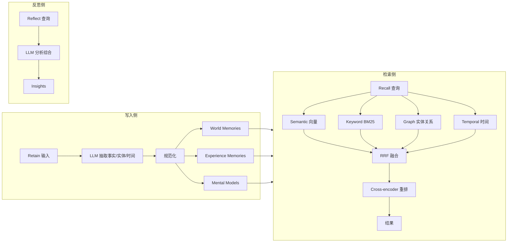

# Hindsight：让 Agent 从经验中学习，而不只是记住对话

大多数 Agent 记忆系统做的事情是“把对话历史存下来，下次检索回去”。Hindsight 想解决的是另一个问题：让 Agent 从过往交互里提炼出可复用的判断，下次遇到类似场景时表现得更聪明。这两件事看起来接近，工程上却是两条路线——前者是向量检索加时间戳，后者需要把零散对话沉淀成结构化的世界知识、个人经验和心智模型。

读完这篇文章，你会看到：Hindsight 的三条主线（Retain、Recall、Reflect）各自由什么触发、产出什么；一次对话如何在系统里流转；LongMemEval 这个基准到底测的是什么；以及什么场景值得引入这套系统。

## 学习目标

读完本文后，你应当能够：

- 区分 Hindsight 与传统 RAG、知识图谱在记忆处理上的工程差异，并说明三类记忆（World、Experience、Mental Model）各自存储什么、何时被召回
- 解释 Retain、Recall、Reflect 三条主线的触发时机、产出物与共享后端的关系
- 在 Recall 的四条检索路径（Semantic、Keyword、Graph、Temporal）中说明每条解决什么问题，以及为什么用 RRF 而非加权融合
- 用 Python 或 Node.js SDK 完成 Retain、Recall、Reflect 三个 API 的最小调用，并按 per-user 或 per-project 划分 bank
- 在 Docker 单容器、Docker Compose、Kubernetes、Python 内嵌四种部署方式中，根据运维成本和隔离需求做出选择

## 这套系统里有哪些并行机制

Hindsight 内部有三条主线在同时工作，先把它们拆开，后面的机制才不会混。



| 主线 | 做什么 | 何时触发 |
|------|--------|----------|
| 写入侧（Retain） | 把一段对话或事实拆成实体、时间、关系，分别落到 World、Experience、Mental Model 三类记忆 | Agent 每次有新输入或新结论时 |
| 检索侧（Recall） | 用四种策略并行检索，再用 RRF 融合、Cross-encoder 重排 | Agent 需要回忆相关上下文时 |
| 反思侧（Reflect） | 让 LLM 对记忆库做一次综合分析，产出新的判断 | 周期性、事件驱动或任务里程碑 |

写入侧把经验沉淀成结构化记忆，检索侧在下次对话里把相关记忆取出来，反思侧从已有记忆里提炼出更高层的理解。三条线共享同一个 PostgreSQL 后端，但触发时机和产出物完全不同。

## 为什么 RAG 和知识图谱不够用

在 Hindsight 之前，给 Agent 加记忆通常有两条路。

第一条是 RAG：把对话或文档切块、向量化，查询时按相似度召回。这条路工程上简单，但有个根本问题——它只关心“这段文字和查询像不像”，不关心“这件事发生在什么时候、和谁有关、是不是已经被后续事件推翻”。用户上周说“我喜欢 hiking”，这周说“最近膝盖受伤不去了”，RAG 会把两条都召回，Agent 无法判断哪条是当前事实。

第二条是知识图谱：把实体和关系显式建出来。它的优势是结构清晰，能做因果推理；代价是构建和维护成本高，且对自然语言的模糊性处理不好。用户说“那个项目有点卡”，到底是项目进度卡、网络卡、还是审批卡，图谱很难自动消歧。

Hindsight 选了第三条路：模仿人类记忆的分层结构，把信息分成三类分别存储和检索。这个选择背后的判断是：Agent 需要把对话沉淀成不同粒度的知识，并在查询时按场景选择合适的粒度，单纯提高检索精度解决不了这个问题。

## 三种记忆类型：World、Experience、Mental Model

Hindsight 把所有记忆分成三类，这个划分直接决定了写入和检索的路径。

**World Memories** 存的是世界事实，不依赖于谁在经历。比如“炉子是烫的”“Python 3.12 引入了类型参数语法”。这类记忆相对稳定，可以被多个 Agent 或多个用户共享。

**Experience Memories** 存的是 Agent 自己的经历。比如“我上周帮用户调试 Docker 网络时，问题出在 bridge 配置上”。这类记忆带有主体和时间，查询时通常需要按时间或上下文过滤。

**Mental Models** 是从前两类记忆里提炼出来的抽象理解。比如“应该先检查网络配置再检查应用日志”。它不是某次具体经历，而是多次经历沉淀下来的判断。

为什么要分三类？因为同一份原始对话，在不同场景下需要以不同粒度被召回。用户问“Python 3.12 有什么新特性”时，需要的是 World Memories 里的客观事实；用户问“上次我们怎么解决那个 Docker 问题”时，需要的是 Experience Memories 里的具体经历；用户问“以后遇到类似问题该怎么排查”时，需要的是 Mental Models 里的方法论。如果都塞进同一个向量库，查询时无法区分粒度，召回精度会下降。

## 三大操作：Retain、Recall、Reflect

Hindsight 的 API 表面只有三个动词，但每个动词背后是一套完整流水线。

### Retain：把输入沉淀成结构化记忆

Retain 接收一段文本，背后发生的事情比“切块向量化”复杂得多。LLM 先从文本里抽取关键事实、时间信息、实体和关系，再把它们规范化成标准实体、时间序列和搜索索引，最后分别写入 World、Experience、Mental Model 三类记忆路径。同一段输入可能同时产生多条记忆，落在不同的存储路径上。

```python
from hindsight_client import Hindsight

client = Hindsight(base_url="http://localhost:8888")

# 最基本的写入
client.retain(
    bank_id="my-bank",
    content="Alice works at Google as a software engineer"
)

# 带上下文和时间戳，方便后续按时间或场景过滤
client.retain(
    bank_id="my-bank",
    content="Alice got promoted to senior engineer",
    context="career update",
    timestamp="2025-06-15T10:00:00Z"
)
```

`bank_id` 是记忆库的隔离单位。每个用户、每个项目或每个 Agent 实例可以对应一个独立的 bank，写入和检索都只在 bank 内部进行。

### Recall：四种检索策略并行

Recall 不是单纯的向量检索。Hindsight 同时跑四条检索路径，再把结果融合：

| 策略 | 解决什么问题 |
|------|--------------|
| Semantic | 语义相似——“用户问 hiking”能召回“喜欢户外活动” |
| Keyword | 精确匹配——查“Alice”时不会漏掉明确提到 Alice 的记忆 |
| Graph | 实体、时间、因果关系——能沿着关系图找到关联记忆 |
| Temporal | 时间范围——查“上周发生了什么”时按时间过滤 |

四条路径的结果用 Reciprocal Rank Fusion（RRF）合并，再用 Cross-encoder 做一次重排。为什么用 RRF 而不是简单加权？因为四种检索策略的分数尺度不一致——向量相似度是 0 到 1，BM25 是无上限的，图检索可能只返回排序后的 ID 列表。RRF 只看每条结果的排名，不依赖原始分数，天然适合融合异构检索结果。

```python
results = client.recall(
    bank_id="my-bank",
    query="What does Alice do?"
)

# 按时间范围检索
results = client.recall(
    bank_id="my-bank",
    query="What happened in June?"
)
```

### Reflect：从记忆里提炼新判断

Reflect 是 Hindsight 区别于普通记忆系统的操作。它不是检索，而是让 LLM 对记忆库做一次综合分析，产出新的洞察。

```python
insights = client.reflect(
    bank_id="my-bank",
    query="Tell me about Alice"
)
```

Reflect 适合用在需要“总结”或“判断”的场景：AI 项目经理反思项目风险、销售 Agent 反思哪些消息有回复、支持 Agent 反思产品文档没回答的客户问题。这些场景的共同点是——答案不在单条记忆里，需要跨多条记忆做综合。

## 一次对话如何流过系统

假设有一个客户支持 Agent，用户发来消息说“我上周升级到 v2.0 之后，导入功能就一直报错”。

**第一步：Retain 写入。** Agent 把这条消息作为 Experience Memory 写入 `bank_id="support-user-123"`。LLM 抽取出实体（用户、v2.0、导入功能）、时间（上周）、关系（升级导致报错），分别建立索引。同时，如果消息里包含客观事实（比如“v2.0 是上周发布的”），也会写入 World Memories。

**第二步：Recall 检索。** Agent 在生成回复前，用查询“v2.0 导入功能报错”触发 Recall。四条路径并行工作：Semantic 找到语义相似的历史报错；Keyword 精确匹配“v2.0”和“导入”；Graph 沿着“用户→升级→报错”的关系链找到相关记忆；Temporal 限定在 v2.0 发布之后的时间窗口。RRF 融合后，Agent 拿到的上下文可能包括“该用户上次也报过导入问题”“另一个用户在 v2.0 里遇到过类似报错”。

**第三步：生成回复。** Agent 基于检索到的记忆生成回复，比如“您上次也遇到过导入问题，当时是配置文件格式不对。这次 v2.0 的导入模块有变更，建议先检查配置文件兼容性”。

**第四步：Reflect 沉淀。** 问题解决后，Agent 触发一次 Reflect，查询“v2.0 导入功能常见问题”。LLM 综合多条记忆，可能产出一条 Mental Model：“v2.0 升级后导入功能报错，常见原因是配置文件格式不兼容，建议先检查配置文件”。这条 Mental Model 下次会被 Recall 检索到，让 Agent 在遇到类似问题时直接给出更准的回复。

## Python SDK 实战

Hindsight 的 Python 生态有两个包名，分工不同：`hindsight` 是包含 LLM Wrapper 和内嵌 Server 的完整包，适合零侵入接入或单机内嵌部署；`hindsight_client` 是轻量客户端包，只负责通过 HTTP 调用远端 Hindsight 服务，适合在多进程或多机器场景下作为 SDK 引入。两者可以单独安装，也可以同时使用。

最简单的集成方式是 LLM Wrapper——把现有的 LLM Client 替换成 HindsightWrapper，之后所有的 LLM 调用都会自动存储和检索记忆，不需要改业务代码。

```python
from hindsight import HindsightWrapper

# 替换你的 LLM Client
wrapper = HindsightWrapper(
    llm_provider="openai",
    llm_model="gpt-4o-mini"
)
# 之后所有的 LLM 调用都会自动存储和检索记忆
```

如果需要更细粒度的控制，可以直接用 `hindsight_client` 包手动管理 Retain、Recall、Reflect：

```python
from hindsight_client import Hindsight

client = Hindsight(base_url="http://localhost:8888")

# 存储带元数据的记忆，方便后续过滤
client.retain(
    bank_id="support-agent",
    content="Customer complained about billing",
    metadata={
        "user_id": "user-123",
        "channel": "email",
        "priority": "high"
    }
)

# 检索时按元数据过滤
results = client.recall(
    bank_id="support-agent",
    query="billing issues",
    metadata_filter={"channel": "email"}
)
```

元数据过滤在多用户或多渠道场景下很关键。如果所有记忆都堆在一个 bank 里，检索时不加过滤，召回结果会混入其他用户的数据，导致 Agent 回复错乱。

## Node.js / TypeScript SDK

Node.js SDK 的 API 设计和 Python 基本一致，只是方法名遵循驼峰命名：

```javascript
const { HindsightClient } = require('@vectorize-io/hindsight-client');

const client = new HindsightClient({
    baseUrl: 'http://localhost:8888'
});

// 存储记忆
await client.retain('my-bank', 'Alice loves hiking in Yosemite');

// 检索记忆
const results = await client.recall('my-bank', 'What does Alice like?');
console.log(results);

// 深度反思
const insights = await client.reflect('my-bank', 'Tell me about Alice');
```

## 部署选项

Hindsight 支持四种部署方式，按运维成本从低到高排列。

### Docker 单容器（最快上手）

```bash
# 设置 API Key
export OPENAI_API_KEY=sk-xxx

# 启动 Hindsight
docker run --rm -it --pull always -p 8888:8888 -p 9999:9999 \
  -e HINDSIGHT_API_LLM_API_KEY=$OPENAI_API_KEY \
  -v $HOME/.hindsight-docker:/home/hindsight/.pg0 \
  ghcr.io/vectorize-io/hindsight:latest
```

启动后访问 API（http://localhost:8888）和 UI（http://localhost:9999）。容器内置 PostgreSQL，数据落在挂载的 `$HOME/.hindsight-docker` 目录里。这种方式适合本地开发和试用，不建议直接用于生产。

### Docker Compose（外部 PostgreSQL）

如果要把数据放在自己管理的 PostgreSQL 上，用 Docker Compose：

```bash
export OPENAI_API_KEY=sk-xxx
export HINDSIGHT_DB_PASSWORD=choose-a-password
cd docker/docker-compose
docker compose up
```

对应的 `docker-compose.yml`：

```yaml
version: '3.8'
services:
  postgres:
    image: pgvector/pgvector:pg16
    environment:
      POSTGRES_PASSWORD: ${HINDSIGHT_DB_PASSWORD}
    volumes:
      - postgres_data:/var/lib/postgresql/data

  hindsight:
    image: ghcr.io/vectorize-io/hindsight:latest
    ports:
      - "8888:8888"
      - "9999:9999"
    environment:
      HINDSIGHT_DB_PASSWORD: ${HINDSIGHT_DB_PASSWORD}
      HINDSIGHT_API_LLM_API_KEY: ${OPENAI_API_KEY}
    depends_on:
      - postgres
```

PostgreSQL 用的是 `pgvector/pgvector:pg16` 镜像，自带向量索引扩展。生产环境建议用这种方式，方便备份、监控和扩容。

### Kubernetes（Helm）

```bash
helm install hindsight oci://ghcr.io/vectorize-io/hindsight-chart \
  --set api.env.OPENAI_API_KEY=$OPENAI_API_KEY
```

### Python 内嵌（无独立服务）

如果不想跑独立服务，可以把 Hindsight 直接嵌进 Python 进程：

```python
pip install hindsight-all -U

import os
from hindsight import HindsightServer, HindsightClient

with HindsightServer(
    llm_provider="openai",
    llm_model="gpt-4o-mini",
    llm_api_key=os.environ["OPENAI_API_KEY"]
) as server:
    client = HindsightClient(base_url=server.url)
    client.retain(bank_id="my-bank", content="Alice works at Google")
    results = client.recall(bank_id="my-bank", query="Where does Alice work?")
```

这种方式适合单机部署或 CI 测试，不适用于多进程或多机器场景。

## 多 LLM Provider 支持

Hindsight 不绑定单一 LLM，支持以下 Provider：

| Provider | 环境变量 | 典型模型 |
|----------|----------|----------|
| OpenAI | `OPENAI_API_KEY` | GPT-4o、GPT-4o-mini |
| Anthropic | `ANTHROPIC_API_KEY` | Claude 3.5 |
| Gemini | `GEMINI_API_KEY` | Gemini 1.5 |
| Groq | `GROQ_API_KEY` | Llama、Mixtral |
| Ollama | `OLLAMA_BASE_URL` | 本地模型 |
| LM Studio | `LMSTUDIO_BASE_URL` | 本地模型 |
| MiniMax | `MINIMAX_API_KEY` | MiniMax MoE |

切换 Provider 只需要改环境变量或 SDK 参数：

```bash
# 在 Docker 中指定 Provider
docker run ... -e HINDSIGHT_API_LLM_PROVIDER=anthropic
```

```python
# 或使用 Python SDK
wrapper = HindsightWrapper(
    llm_provider="anthropic",
    llm_model="claude-3-5-sonnet"
)
```

需要注意的是，Retain 和 Reflect 都会调用 LLM 做抽取和综合，所以 Provider 的选择会影响记忆质量和成本。本地模型（Ollama、LM Studio）适合开发调试，生产环境建议用能力更强的云端模型。

## LongMemEval 测的是什么

Hindsight 在 LongMemEval 基准测试上达到最优性能，由 Virginia Tech Sanghani Center 研究团队独立复现验证。但“最优”这个说法需要拆开看。

LongMemEval 主要测的是 Agent 在长周期对话里的记忆能力——具体包括：能否记住早期对话里提到的事实、能否在后续对话里正确引用这些事实、能否处理事实的更新和冲突。它考察的是写入侧（记忆是否被正确沉淀）和检索侧（相关记忆是否被准确召回）的联合表现，不直接考察 Reflect 的质量。

从 Hindsight 在这个基准上的表现能推出：它的多策略检索加 RRF 融合确实比单纯向量检索更准，三类记忆的分层设计在处理事实更新时更稳。但不能推出：Hindsight 在所有 Agent 场景下都最优——比如短周期单轮对话场景里，它的优势不明显；Reflect 产出的 Mental Model 质量如何，这个基准也不测。

所以“最准确的记忆系统”这个说法更准确的含义是：在长周期对话记忆这个特定维度上，Hindsight 当前的设计与基准任务匹配度最高。

## 采用顺序与决策建议

引入 Hindsight 之前，先判断你的场景是否真的需要它。

**适合先上的场景：**

- 客服、销售、项目管理等长周期对话 Agent，需要跨多次会话记住用户偏好和历史
- AI 员工类应用，需要从反馈中学习并调整行为
- 任何需要 Agent “越用越聪明”的场景，而不是每次对话都从零开始

**可以等等的场景：**

- 单轮问答或短周期对话，对话历史不超过上下文窗口，直接塞进 prompt 就够
- 对话内容高度结构化且不涉及时间演变，传统 RAG 已经够用
- 对延迟敏感的实时场景，Hindsight 的 Retain 和 Reflect 都会调用 LLM，有额外开销

**落地顺序建议：**

1. 先用 Docker 单容器本地试用，跑通 Retain、Recall、Reflect 三个 API
2. 用 LLM Wrapper 接入现有 Agent，观察记忆质量
3. 按 per-user 或 per-project 划分 bank，验证多租户隔离
4. 迁移到 Docker Compose 或 Kubernetes，接入外部 PostgreSQL
5. 上线后定期触发 Reflect，观察 Mental Model 的沉淀质量

## 常见问题

**Retain 一次调用要多久？** 取决于 LLM Provider 和输入长度。云端模型通常在几百毫秒到一两秒之间，本地模型视模型大小而定。具体耗时建议在自己的环境里实测。

**记忆库会不会无限膨胀？** 建议按用户或项目划分 bank，方便单独管理和清理。bank 是 Hindsight 的隔离单位，检索和写入都只在 bank 内部进行。

**Reflect 应该多久跑一次？** 取决于场景。客服 Agent 可以每天结束时跑一次；项目 Agent 可以在里程碑达成时跑；事件驱动场景可以在收到负面反馈时立即跑。频率太高会增加 LLM 调用成本，太低会让 Mental Model 滞后于实际经验。

**支持多语言吗？** Hindsight 本身不限制输入语言，但 LLM 抽取实体和关系的能力因模型而异。中文场景建议用支持中文能力较强的模型。

## 自测题

下面几道题用来检验你是否真的理解了 Hindsight 的机制，而不是只记住了名词。建议先自己回答，再回看对应章节核对。

1. **记忆类型判断。** 用户对客服 Agent 说"我上周刚换的新邮箱是 alice@new.com，旧邮箱不再用了"。这条信息在 Retain 时应当落到哪类记忆？为什么？如果旧邮箱此前已经写入，系统应当如何处理？
2. **检索路径选择。** 用户问"上次我们是怎么解决那个 Docker 网络问题的"，Recall 的四条路径中哪一条最关键？如果用户改问"Docker bridge 网络怎么配置"，答案会落到哪类记忆、哪条路径最关键？
3. **RRF 必要性。** 假设把 RRF 换成"按分数归一化后加权求和"，会出什么问题？请结合四种检索路径的分数尺度具体说明。
4. **bank 划分策略。** 一个 SaaS 客服平台同时服务 100 个企业客户，每个客户有多个最终用户。bank 应当按企业客户划分，还是按最终用户划分？两种方案在隔离性、召回精度和成本上各有什么取舍？
5. **Reflect 触发时机。** 客服 Agent 每次对话结束都触发 Reflect，和每天结束时批量触发 Reflect，对 Mental Model 的质量和 LLM 成本分别有什么影响？哪种更适合高频低复杂度场景，哪种适合低频高复杂度场景？
6. **部署方式选择。** 团队想在 CI 流水线里跑 Hindsight 集成测试，又想在生产环境跑多机器部署。这两种场景分别应当选哪种部署方式？为什么 Python 内嵌方式不适合生产？

## 进阶路径

下面列出的官方文档类链接（hindsight.vectorize.io 系列）真实性需验证——截至本文写作时未能独立确认这些 URL 是否可访问，建议先从 GitHub 仓库和论文入手，再通过仓库 README 中的链接跳转。

- 官方文档：https://hindsight.vectorize.io （需验证）
- API 参考：https://hindsight.vectorize.io/api-reference （需验证）
- Python SDK：https://hindsight.vectorize.io/sdks/python （需验证）
- Node.js SDK：https://hindsight.vectorize.io/sdks/nodejs （需验证）
- CLI：https://hindsight.vectorize.io/sdks/cli （需验证）
- Cookbook：https://hindsight.vectorize.io/cookbook （需验证）
- GitHub 仓库：https://github.com/vectorize-io/hindsight
- 论文：https://arxiv.org/abs/2512.12818
- Slack 社区：https://join.slack.com/t/hindsight-space/shared_invite （需验证）

如果想深入理解 Hindsight 的设计动机，建议先读论文，再看 Cookbook 里的完整示例，最后对照 API 参考实现自己的集成。

---

_本文版本基线：Hindsight v0.5.0（发布日期 2026-04-08，来自 GitHub Release 页面）、8.9k Stars（来自 GitHub 仓库快照，统计时点为 2026-04-12）、MIT 许可证、论文编号 arXiv:2512.12818。Stars 数会随时间变化，引用时请以仓库当前数据为准。_
