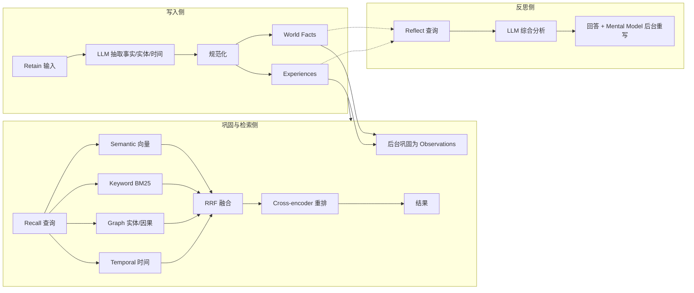

# Hindsight：让 Agent 记住之后还要学会——四类记忆与 Retain/Recall/Reflect 拆解

面向要给 Agent 加长期记忆的工程师和选型者。前置知识：RAG 的基本流程（切块、向量化、相似度检索）、LLM API 调用、Docker 基础。

读完本文能说清：Hindsight 与"存对话、查对话"式记忆系统的工程差异；World、Experience、Observation、Mental Model 四类记忆各存什么、怎么协作；Retain、Recall、Reflect 三个操作背后各自的流水线；五种部署方式怎么选；LongMemEval 上的 SOTA 分数能说明什么、不能说明什么；以及什么场景值得引入这套系统。

## 目录

1. 先给判断 — Hindsight 解决什么、不解决什么
2. 系统总览 — 内部四条主线，对外三个动词
3. 为什么 RAG 和知识图谱不够用
4. 四类记忆：World / Experience / Observation / Mental Model
5. 三大操作：Retain、Recall、Reflect
6. 一次对话如何流过系统
7. 接入方式：LLM Wrapper 与 SDK
8. 部署选项：从单容器到托管云
9. 多 LLM Provider 支持
10. 生产环境要点
11. LongMemEval 测的是什么
12. 采用顺序与决策建议
13. 常见问题
14. 自测题
15. 版本与引用

## 先给判断

大多数 Agent 记忆系统做的事是"把对话历史存下来，下次检索回去"。Hindsight（vectorize-io/hindsight，MIT 许可证）想解决的是另一件事：让 Agent 从过往交互里沉淀出可复用的判断，下次遇到类似场景时表现得更聪明。这个定位写在它的仓库简介里——"Agent Memory That Learns"，也是论文标题《Hindsight is 20/20: Building Agent Memory that Retains, Recalls, and Reflects》（arXiv:2512.12818）里三个动词的由来。

两条路线的工程差异是实打实的：存对话只需要向量检索加时间戳；从经验学习则需要把零散对话固化成结构化的世界事实、个人经历和后台自动维护的结论。Hindsight 为后者设计了四类记忆存储和三条流水线，并在 LongMemEval 基准上拿到了当前最优成绩——这个"最优"的成色和边界，本文第 11 节专门拆。

版本基线：Hindsight v0.10.2（2026-09-29 发布），45.3k stars（2026-10-04 快照）。项目迭代很快，API 细节以官方文档为准。

## 系统总览：内部四条主线，对外三个动词

Hindsight 对外只暴露 retain、recall、reflect 三个 API，内部却有四条主线在同时工作。先把它们拆开，后面的机制才不会混。


```mermaid
flowchart LR
    subgraph WRITE[写入侧]
        A[Retain 输入] --> B[LLM 抽取事实/实体/时间]
        B --> C[规范化]
        C --> D1[World Facts]
        C --> D2[Experiences]
    end
    subgraph MERGE[巩固与检索侧]
        D1 & D2 --> O[后台巩固为 Observations]
        E[Recall 查询] --> F1[Semantic 向量]
        E --> F2[Keyword BM25]
        E --> F3[Graph 实体/因果]
        E --> F4[Temporal 时间]
        F1 --> G[RRF 融合]
        F2 --> G
        F3 --> G
        F4 --> G
        G --> H[Cross-encoder 重排]
        H --> I[结果]
    end
    subgraph THINK[反思侧]
        J[Reflect 查询] --> K[LLM 综合分析]
        K --> L[回答 + Mental Model 后台重写]
    end
    WRITE --> MERGE
    D1 & D2 -.-> J
```

| 主线 | 做什么 | 何时发生 |
|------|--------|----------|
| 写入侧（Retain） | 把一段输入拆成事实、实体、时间、关系，落到 World Facts 或 Experiences 路径 | 每次调用 retain 时 |
| 巩固侧（Consolidation） | 后台把相关事实固化成 Observations——去重、带证据、可被新证据加强或削弱 | 写入后自动进行 |
| 检索侧（Recall） | 四种策略并行检索，RRF 融合、Cross-encoder 重排，按 token 预算裁剪 | 每次调用 recall 时 |
| 反思侧（Reflect） | 让 LLM 对记忆库做综合分析，回答需要推理的问题，并后台重写相关 Mental Model | 每次调用 reflect 时 |

四条线共享同一个 PostgreSQL 后端，但触发时机和产出物完全不同：写入侧生产原始记忆，巩固侧生产带证据的信念，检索侧按查询取回它们，反思侧跨记忆推理并更新常备结论。对外，前两条合并成一次 retain 调用，后两条分别是 recall 和 reflect——API 的简单是内部复杂度换来的。

## 为什么 RAG 和知识图谱不够用

在 Hindsight 这类专用记忆系统出现之前，给 Agent 加记忆通常有两条路。

第一条是 RAG：把对话或文档切块、向量化，查询时按相似度召回。这条路工程上简单，但有个根本问题——它只关心"这段文字和查询像不像"，不关心"这件事发生在什么时候、是不是已经被后续事件推翻"。用户上周说"我喜欢 hiking"，这周说"膝盖受伤不去了"，RAG 会把两条都召回，Agent 无法判断哪条是当前事实。

第二条是知识图谱：把实体和关系显式建出来。优势是结构清晰，能沿关系推理；代价是构建和维护成本高，且对自然语言的模糊性处理不好。用户说"那个项目有点卡"，到底是进度卡、网络卡还是审批卡，图谱很难自动消歧。

Hindsight 的路线是仿生分层：把记忆组织成四类不同的数据结构，各自写入、各自巩固、各自召回。这个判断背后的逻辑是——Agent 需要把对话沉淀成不同粒度的知识，并在查询时按场景选择粒度，单纯提高检索精度解决不了粒度问题。

## 四类记忆：World / Experience / Observation / Mental Model

**World Facts** 存世界事实，不依赖于谁在经历。"炉子是烫的""Python 3.12 引入了类型参数语法"都属于这类。这类记忆相对稳定，不带个人视角。

**Experiences** 存 Agent 自己的经历。"我上周帮用户调试 Docker 网络时，问题出在 bridge 配置上"——带主体、带时间，查询时通常需要按时间或上下文过滤。

**Observations** 是后台自动巩固出来的信念。散落的事实不会一直平铺堆积：Hindsight 在后台把相关事实合并成去重的 Observation，每条保留支持它的原始证据（精确引用）和一个证明计数（proof count）。新证据到来时，Observation 被加强、削弱或扩展，而不是被静默覆盖——用户改口"不 hiking 了"之后，旧的偏好不会被删掉，而是作为被推翻的证据留在链路里。

**Mental Models** 是对一个问题的常备答案。你定义一次问题（比如"这个用户的偏好是什么"），Hindsight 写出答案、存下来，并在 bank 学到新东西时在后台重写它。读取一个 Mental Model 是一次纯数据库读——没有检索、没有 LLM 调用，所以 Agent 可以在启动时带着一页现成的结论开工，而不是每个会话都重新发现一遍。它的进阶形态是 Knowledge Pages：机制被隐藏起来的 Mental Model，像 wiki 一样按文件夹组织、可搜索，还能投影成普通 markdown 文件放到磁盘上。

四类记忆各管一层：World Facts 管客观世界，Experiences 管亲身经历，Observations 管从证据里长出来的结论，Mental Models 管随时可取的现成判断。用户问"Python 3.12 有什么新特性"，走 World Facts；问"上次那个 Docker 问题怎么解决的"，走 Experiences；问"这个用户有什么偏好"，直接读 Mental Model——连检索都省了。

## 三大操作：Retain、Recall、Reflect

API 表面只有三个动词，每个动词背后是一条完整流水线。

### Retain：把输入沉淀成结构化记忆

Retain 接收一段文本，背后发生的事比"切块向量化"复杂：LLM 先从文本里抽取关键事实、时间信息、实体和关系，再经过规范化（normalization）变成标准实体、时间序列和搜索索引，最后落入 World Facts 或 Experiences 路径。同一段输入可能产生多条记忆。

```python
from hindsight_client import Hindsight

client = Hindsight(base_url="http://localhost:8888")

# 最基本的写入
client.retain(
    bank_id="my-bank",
    content="Alice works at Google as a software engineer",
)

# 带上下文、时间戳和标签，方便后续按时间或标签过滤
client.retain(
    bank_id="my-bank",
    content="Alice got promoted to senior engineer",
    context="career update",
    timestamp="2025-06-15T10:00:00Z",
    tags=["career"],
)
```

`bank_id` 是记忆库的隔离单位——一个用户、一个项目或一个 Agent 实例对应一个 bank。隔离是严格的，没有跨 bank 泄漏。bank 还能携带背景描述和 disposition traits（怀疑倾向、字面理解、共情度等性格参数），这些参数会影响 reflect 推理时的口吻；bank 可以用声明式模板批量创建。

### Recall：四种检索策略并行

Recall 不是单纯的向量检索，它同时跑四条路径再融合：

| 策略 | 解决什么问题 |
|------|--------------|
| Semantic | 语义相似——"用户问 hiking"能召回"喜欢户外活动" |
| Keyword | BM25 精确匹配——查"Alice"时不会漏掉明确提到 Alice 的记忆 |
| Graph | 实体、时间、因果关系——沿着关系链找到关联记忆 |
| Temporal | 时间范围——查"上周发生了什么"时按时间加权 |

四条路径的结果用 Reciprocal Rank Fusion（RRF）合并，再经 Cross-encoder 重排，最后按 token 预算裁剪。为什么用 RRF 而不是加权求和？因为四种策略的分数尺度不一致——向量相似度在 0 到 1 之间，BM25 无上限，图检索可能只返回排序后的 ID 列表。RRF 只看排名不看原始分数，天然适合融合异构结果。

```python
# 常规检索
results = client.recall(
    bank_id="my-bank",
    query="What does Alice do?",
)

# 限定记忆类型和标签过滤：只查经验类、只看打了 support 标签的
results = client.recall(
    bank_id="my-bank",
    query="billing complaints",
    types=["experience"],
    tags=["support"],
)

# 显式指定时间窗口，而不依赖从查询文本里猜日期
results = client.recall(
    bank_id="my-bank",
    query="incidents",
    temporal_window={"start": "2026-06-01", "end": "2026-06-30"},
)
```

两个影响成本和质量的参数值得记住：`budget`（low/mid/high，默认 mid）控制检索多深；`types` 限定记忆类型（world、experience、observation），配合 `prefer_observations=True` 可以让固化的 Observation 取代它合并前的原始事实，避免重复内容。

### Reflect：跨记忆推理，而不只是检索

Reflect 让 LLM 对记忆库做一次综合分析，回答"需要想一下而不是查一下"的问题，回答会考虑 bank 的 disposition 设定。

```python
insights = client.reflect(
    bank_id="my-bank",
    query="What should I know about Alice?",
)
```

Reflect 适合需要"总结"或"判断"的场景：AI 项目经理盘点项目风险、销售 Agent 分析哪些外联消息有回复、支持 Agent 找出产品文档没覆盖的客户疑问。这些场景的共同点是——答案不在单条记忆里，需要跨多条记忆综合。传 `include_facts=True` 可以拿到回答所依据的记忆清单（based_on），方便审计；传 `response_schema` 可以强制结构化输出。

## 一次对话如何流过系统

假设有一个客户支持 Agent，用户发来消息："我上周升级到 v2.0 之后，导入功能就一直报错。"

**第一步：Retain 写入。** Agent 把这条消息 retain 进 `bank_id="support-user-123"`。LLM 抽取出实体（用户、v2.0、导入功能）、时间（上周）、关系（升级导致报错），建立索引后落入 Experiences 路径。随后巩固机制在后台工作：这条报错经历会与该用户此前"升级后出问题"的历史记录合并成 Observation，证明计数加一。

**第二步：Recall 检索。** Agent 在生成回复前，用查询"v2.0 导入功能报错"触发 Recall。四条路径并行：Semantic 找到语义相似的历史报错；Keyword 精确匹配"v2.0"；Graph 沿"用户→升级→报错"的关系链找到关联记忆；Temporal 把权重偏向最近的时间窗口。RRF 融合加重排后，Agent 拿到的上下文可能包括"该用户上次也报过导入问题""另一个用户在 v2.0 里遇到过类似报错"。

**第三步：生成回复。** Agent 基于检索到的记忆回复："您上次也遇到过导入问题，当时是配置文件格式不对。这次 v2.0 的导入模块有变更，建议先检查配置文件兼容性。"

**第四步：Reflect 沉淀。** 问题解决后触发一次 Reflect，查询"v2.0 导入功能常见问题"。LLM 跨记忆综合，产出"v2.0 升级后导入报错，常见原因是配置文件格式不兼容，先检查配置文件"这样的判断。这个 bank 新学到的知识同时会触发相关 Mental Model 的后台重写——下次再有用户遇到同类问题，Agent 读现成结论就能回答，一次数据库读，不用再跑完整检索。

## 接入方式：LLM Wrapper 与 SDK

### LLM Wrapper：两条接线的自动记忆

最省事的集成是 LLM Wrapper：把现有 LLM 客户端包一层，之后每次调用自动完成"调用前召回相关记忆、调用后存储对话"，业务代码不用改。当前实现基于 LiteLLM，覆盖 100 多种模型：

```python
from openai import OpenAI
from hindsight_litellm import wrap_openai

client = wrap_openai(
    OpenAI(),
    bank_id="user-123",
    hindsight_api_url="http://localhost:8888",  # 不传则连 Hindsight Cloud
)

response = client.chat.completions.create(
    model="gpt-5-mini",
    messages=[{"role": "user", "content": "What do you know about me?"}],
)
```

`wrap_anthropic()` 对 Anthropic SDK 做同样的事。bank、召回预算、事实类型、"用 reflect 代替 recall"这些设置都能通过 `hindsight_*` 关键字参数按单次调用覆盖。需要精确控制记忆存取时机的话，就直接用下面的 SDK。

### Python SDK

Python 生态有四个包，分工不同：

| 包 | 装什么 | 适合 |
|----|--------|------|
| `hindsight-client` | 轻量客户端 | 通过 HTTP 调远端服务，多进程/多机器场景 |
| `hindsight-api` | 独立 server | 裸机部署，`pip install hindsight-api` 后运行 `hindsight-api` 命令 |
| `hindsight-all` | server + 内嵌 PostgreSQL + 客户端 | 单进程内嵌，零独立服务；Intel Mac 装 `hindsight-all-slim` |
| `hindsight-litellm` | LLM Wrapper | 给现有 Agent 两行代码加记忆 |

手动管理 Retain、Recall、Reflect 时，用 `hindsight_client`：

```python
from hindsight_client import Hindsight

client = Hindsight(base_url="http://localhost:8888")

# 存储带元数据和标签的记忆
client.retain(
    bank_id="support-agent",
    content="Customer complained about billing",
    metadata={
        "user_id": "user-123",
        "channel": "email",
    },
    tags=["billing", "email"],
)

# 检索时按标签过滤（注意：过滤靠 tags/types，不是按 metadata 过滤）
results = client.recall(
    bank_id="support-agent",
    query="billing issues",
    tags=["email"],
)
```

一个容易踩的坑：retain 支持自由格式的 `metadata` 字典，但 recall/reflect 的过滤参数是 `tags`、`types` 和 `tag_groups`，不支持按 metadata 字段过滤。要在检索时区分用户或渠道，写入时就得打好标签。

### Node.js / TypeScript SDK

```javascript
const { HindsightClient } = require('@vectorize-io/hindsight-client');

const main = async () => {
  const client = new HindsightClient({ baseUrl: 'http://localhost:8888' });

  await client.retain('my-bank', 'Alice loves hiking in Yosemite');

  const results = await client.recall('my-bank', 'What does Alice like?');
  console.log(results);
}

main();
```

官方还提供 Go SDK（`github.com/vectorize-io/hindsight/hindsight-clients/go`）、CLI（`curl -fsSL https://hindsight.vectorize.io/get-cli | bash`），以及 60 多个现成集成——LangGraph、LlamaIndex、CrewAI、Pydantic AI、OpenAI Agents SDK、n8n、Zapier、Dify 等，多数不需要改代码。

### 内嵌模式：不要独立服务

`hindsight-all` 可以把整个系统（含 PostgreSQL）嵌进 Python 进程：

```python
import os
from hindsight import HindsightServer, HindsightClient

with HindsightServer(
    llm_provider="openai",
    llm_model="gpt-5-mini",
    llm_api_key=os.environ["OPENAI_API_KEY"],
) as server:
    client = HindsightClient(base_url=server.url)
    client.retain(bank_id="my-bank", content="Alice works at Google")
    results = client.recall(bank_id="my-bank", query="Where does Alice work?")
```

更简的写法是 `HindsightEmbedded`——首次使用时自动拉起 server。内嵌模式适合单机工具和 CI 测试；多进程或多机器场景请用客户端连独立服务。

### MCP 与编码 Agent

每个 Hindsight 服务默认内置 MCP（Model Context Protocol）端点，每个 bank 一个：

```
http://localhost:8888/mcp/{bank_id}/
```

把任意 MCP 客户端指向它，retain、recall、reflect 就变成三个可调用的工具。针对 Claude Code、Codex CLI、Cursor CLI、GitHub Copilot CLI 等 13 种编码 Agent，还有一条命令的集成：`npx @vectorize-io/hindsight-coding-agents install all`——它会从 git 历史和历史会话自动构建每个仓库的 bank，Agent 启动时注入，不需要手动喂数据。

## 部署选项

五种方式，按运维成本从低到高排列。

### Docker 单容器（最快上手）

```bash
export OPENAI_API_KEY=sk-xxx

docker run -it --pull always --name hindsight --restart unless-stopped \
  -p 8888:8888 -p 9999:9999 \
  -e HINDSIGHT_API_LLM_API_KEY=$OPENAI_API_KEY \
  -v hindsight-data:/home/hindsight/.pg0 \
  ghcr.io/vectorize-io/hindsight:latest
```

API 在 http://localhost:8888，Web UI 在 http://localhost:9999。容器内置 PostgreSQL（pg0），数据落在 `hindsight-data` 卷里。适合本地开发和试用，不建议直接用于生产。

### Docker Compose（外部 PostgreSQL）

仓库的 `docker/docker-compose/` 目录按场景组织了十几个子目录（external-pg、local-llm、cuda、timescale、nginx 等），每个子目录一套 compose 文件。以外部 PostgreSQL 为例：

```bash
export HINDSIGHT_API_LLM_API_KEY=sk-xxx
export HINDSIGHT_DB_PASSWORD=choose-a-password
cd docker/docker-compose/external-pg
docker compose up -d
```

该目录的 compose 文件用 `pgvector/pgvector:pg18` 镜像（PostgreSQL 版本可通过 `HINDSIGHT_DB_VERSION` 覆盖），Hindsight 服务通过 `HINDSIGHT_API_DATABASE_URL` 连接数据库。生产环境建议这种方式，方便备份、监控和扩容。

### Kubernetes（Helm）

```bash
helm install hindsight oci://ghcr.io/vectorize-io/charts/hindsight \
  --set api.llm.provider=openai \
  --set api.llm.apiKey=sk-xxx \
  --set postgresql.enabled=true
```

### 裸机（pip）

```bash
pip install hindsight-api
export HINDSIGHT_API_LLM_API_KEY=sk-xxx
hindsight-api
```

### 托管云（Hindsight Cloud）

不想运维的话，官方托管版把基础设施、仪表盘、备份和团队协作打包，按用量计费，99.9% 可用性 SLA；客户端指向 `https://api.hindsight.vectorize.io` 即可。自建还是托管，取决于数据能不能出内网——记忆库里存的是用户对话和业务事实，这点要先想清楚。

## 多 LLM Provider 支持

Hindsight 通过 `HINDSIGHT_API_LLM_PROVIDER` 支持 25+ 个 LLM Provider：

| 类别 | Provider |
|------|----------|
| 云端托管 | openai、anthropic、gemini、groq、bedrock、vertexai、minimax、deepseek、atlas、meta 等 |
| 本地推理 | ollama、lmstudio、llamacpp |
| 网关 | litellm、litellmrouter（可达其余所有模型）、任意 OpenAI 兼容端点 |
| 订阅复用 | openai-codex（ChatGPT Plus/Pro）、claude-code（Claude Pro/Max）、cursor、github-copilot——不需要 API key |

切换 Provider 只需要改环境变量：

```bash
docker run ... -e HINDSIGHT_API_LLM_PROVIDER=anthropic -e ANTHROPIC_API_KEY=sk-ant-xxx
```

Retain 和 Reflect 都会调用 LLM，Provider 的能力直接影响记忆质量和成本。订阅复用是个务实的特性——用已有的 ChatGPT 或 Claude 订阅跑记忆抽取，不用额外买 API 额度；本地模型适合开发调试，生产建议用能力更强的云端模型。

## 生产环境要点

README 的"Running in Production"一节列出了几块值得在上线前知道的能力：

- **存储**：PostgreSQL + pgvector，或 Oracle AI Database 23ai（功能完全对等）——已有 Oracle 技术栈的企业可以不引入新数据库。
- **Memory Defense**：按 bank 可选开启的防护策略，对每次 retain 扫描 45 种秘密和 PII 模式，命中后替换为 `[REDACTED:github_token]` 这类占位符或直接拦截。
- **多语言**：输入语言端到端保留，事实保持原语言，实体保留原生文字——"张伟"不会被改写成 "Zhang Wei"。
- **可观测**：Prometheus 指标覆盖 LLM 调用数、token 数和延迟；Webhook 推送 retain、巩固、刷新的生命周期事件。
- **运维工具**：Admin CLI 处理迁移、bank 修复和卡住的操作；配置分层为全局环境变量 → 租户 → bank。
- **扩展点**：租户、认证、存储都可替换。

## LongMemEval 测的是什么

Hindsight 宣称在 LongMemEval 基准上达到 SOTA，且其分数由 Virginia Tech Sanghani Center 和《华盛顿邮报》的研究人员独立复现——基准榜上其他系统的分数多为厂商自报，这一点是它宣传里最有分量、也最容易被忽略的差别。

LongMemEval 测的是 Agent 在长周期对话里的记忆能力：能否记住早期对话里提到的事实、能否在后续对话里正确引用、能否处理事实的更新和冲突。它考察写入侧（记忆是否被正确沉淀）和检索侧（相关记忆是否被准确召回）的联合表现，不直接考察 Reflect 的推理质量。

从榜单成绩能推出：四路检索加 RRF 融合确实比单纯向量检索更准，Observation 机制在处理事实更新和冲突时更稳。不能推出：Hindsight 在所有 Agent 场景下都最优——短周期对话里历史直接塞进 prompt 就够，它的优势体现不出来；Reflect 产出的 Mental Model 质量如何，这个基准也不测。实时分项数据（按模型的准确率、延迟、成本）发布在 benchmarks.hindsight.vectorize.io，截至 2026 年 1 月的榜单是 README 引用的版本。

所以"最准确的 Agent 记忆系统"这个说法的准确含义是：在长周期对话记忆这个特定维度上、按目前可独立复现的证据，Hindsight 的设计与基准任务匹配度最高。

## 采用顺序与决策建议

引入 Hindsight 之前，先判断场景是否真的需要它。

**适合先上的场景：**

- 客服、销售、项目管理等长周期对话 Agent，需要跨多次会话记住用户偏好和历史
- AI 员工类应用，需要从反馈中学习并调整行为
- 编码 Agent 需要项目级长期记忆——`hindsight-coding-agents` 包开箱即用
- 任何需要 Agent "越用越聪明"、而不是每次对话从零开始的场景

**可以等等的场景：**

- 单轮问答或短周期对话，历史不超过上下文窗口，直接塞 prompt 就够
- 对话内容高度结构化且不随时间演变，传统 RAG 已经够用
- 简单的 n8n 自动化流程——官方自己的判断是这类场景用 Hindsight "可能杀鸡用牛刀"
- 对延迟敏感的实时场景，Retain 和 Reflect 都要调 LLM，有额外开销

**落地顺序建议：**

1. Docker 单容器本地试用，跑通 retain、recall、reflect 三个 API
2. 用 LLM Wrapper（`hindsight-litellm`）接入现有 Agent，观察记忆质量
3. 按 per-user 或 per-project 划分 bank，需要渠道/用户级检索区分时打好 tags
4. 生产数据接进来之前，按 bank 开启 Memory Defense
5. 迁移到 Docker Compose 或 Kubernetes，接入外部 PostgreSQL，接 Prometheus 监控
6. 上线后观察 Mental Model 的后台重写质量，必要时调 disposition traits

## 常见问题

**Retain 一次调用要多久？** 取决于 LLM Provider 和输入长度，因为要跑一轮 LLM 抽取。高吞吐场景可以用 `retain_async=True` 异步写入，配合 `operation_id` 做幂等重试。具体耗时建议在自己的环境里实测。

**记忆库会不会无限膨胀？** 不会简单平铺——相关事实会被后台巩固成去重的 Observation。但 bank 数量本身需要规划：按用户或项目划分 bank，检索和写入都只在 bank 内部，清理时也可以按 bank 单独处理。

**Reflect 应该多久跑一次？** Reflect 是按需调用的 API，不是定时任务——需要"想一下"的答案时调它，Mental Model 的重写在后台自动发生。把 reflect 塞进每次对话结束反而会增加 LLM 成本。

**支持中文吗？** 支持且是显式设计：输入语言被检测并端到端保留，中文事实以中文存储，中文实体名不会被转写成拼音或英文。LLM 抽取质量仍因模型而异，中文场景建议选中文能力强的 Provider。

**LLM 调用失败会丢记忆吗？** retain 支持异步模式和幂等的 operation_id，生产环境应启用 Webhook 监听 retain 生命周期事件，配合 Admin CLI 处理卡住的操作。

## 自测题

下面几道题用来检验是否真的理解了 Hindsight 的机制，而不是只记住了名词。建议先自己回答，再回看对应章节核对。

1. **记忆类型判断。** 用户对客服 Agent 说"我上周刚换的新邮箱是 alice@new.com，旧邮箱不再用了"。这条信息在 Retain 时落到哪条路径？随后巩固机制会如何处理"旧邮箱有效"这条既有结论——覆盖、删除还是别的？
2. **检索路径选择。** 用户问"上次我们是怎么解决那个 Docker 网络问题的"，Recall 的四条路径中哪条最关键？如果改问"Docker bridge 网络怎么配置"，答案会落到哪类记忆？
3. **RRF 必要性。** 把 RRF 换成"按分数归一化后加权求和"会出什么问题？结合四种检索路径的分数尺度具体说明。
4. **过滤方式。** 需要在多渠道客服场景里按渠道过滤检索结果，retain 时应该用 `metadata` 还是 `tags`？为什么？
5. **bank 划分策略。** 一个 SaaS 客服平台同时服务 100 个企业客户，每个客户有多个最终用户。bank 按企业客户划分还是按最终用户划分？两种方案在隔离性、召回精度和成本上各有什么取舍？
6. **Mental Model 与 Observation 的分工。** "该用户偏好简洁回复"这条结论应该以 Observation 还是 Mental Model 的形式存在？Agent 读取两者的成本差在哪里？
7. **部署方式选择。** 团队想在 CI 流水线里跑 Hindsight 集成测试，又想在生产环境跑多机器部署。两种场景分别选哪种方式？为什么内嵌模式不适合生产？

## 版本与引用

- GitHub 仓库：https://github.com/vectorize-io/hindsight
- 官方文档：https://hindsight.vectorize.io
- API 参考：https://hindsight.vectorize.io/api-reference
- SDK 文档：[Python](https://hindsight.vectorize.io/sdks/python) / [Node.js](https://hindsight.vectorize.io/sdks/nodejs) / [Go](https://hindsight.vectorize.io/sdks/go) / [CLI](https://hindsight.vectorize.io/sdks/cli)
- Cookbook：https://hindsight.vectorize.io/cookbook
- 基准榜单：https://benchmarks.hindsight.vectorize.io
- 论文：Hindsight is 20/20: Building Agent Memory that Retains, Recalls, and Reflects（arXiv:2512.12818）
- Slack 社区：https://vectorize.io/slack

---

_本文版本基线：Hindsight v0.10.2（2026-09-29 发布，来自 GitHub Release）、45.3k stars（GitHub 快照，统计时点 2026-10-04）、MIT 许可证、论文 arXiv:2512.12818。项目迭代较快（2025-10 创建至今已发布 0.5→0.10 多个大版本），API 细节和部署命令引用时请以仓库当前文档为准。_
