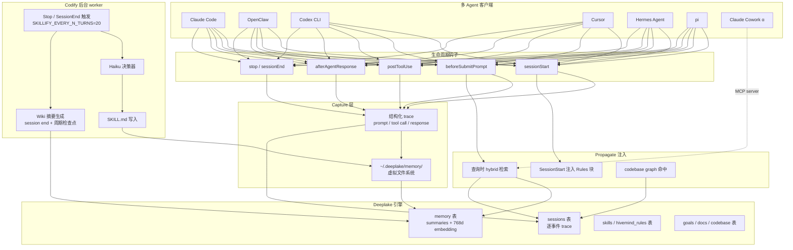

> **目标读者**：同时在用 Claude Code、Cursor、Codex CLI、OpenClaw 等多个编程 Agent，并希望把"团队踩过的坑"沉淀成可复用资产的工程师 / 团队负责人。
> **核心问题**：Hivemind 跟 `CLAUDE.md` / `MEMORY.md` / `agentmemory` 这类「单 agent 记忆」方案到底有什么本质差异？它承诺的"技能自动传播"是不是又一个营销话术？
> **资料范围**：本文基于仓库 `main` 分支 README（v0.7.160，2026-09-28 发布）、`src/` 目录结构、`src/deeplake-schema.ts` 表定义、`package.json` 依赖、docs 目录与 GitHub 仓库元数据（2026-09-30 抓取）；公开 benchmark（LoCoMo）数据来自 README 引用，**不**复现其内部评测环境。

---

## 阅读目标

本文回答四个问题：

- Hivemind 的定位是什么，适合什么场景，不适合什么场景。
- "Capture → Codify → Propagate" 流水线是怎么落地的。
- 跨 Claude Code / OpenClaw / Codex / Cursor / Hermes / pi 这六种正式支持的 agent（外加 Alpha 阶段的 Claude Cowork），集成机制分别是什么。
- README 上 LoCoMo 的 -25% cost / 1.7× tokens / 31% turns 数字应该怎么读，哪些可以采信。

## 1. 它要解决的不是「agent 失忆」，而是「团队经验不积累」

`CLAUDE.md`、`MEMORY.md`、`.cursorrules` 这类静态记忆文件解决的是"别让 agent 每次都从零解释项目"，agentmemory / mem0 / Letta 这一类本地记忆服务解决的是"agent 跨会话能记住上次做了什么"。但**真正卡团队生产力的，是第三层问题**：

> 周一你的 agent 帮你搞定了一个棘手的 ORM 迁移；
> 周三你同事的 agent 在另一个项目里又踩了同一个坑，从头排查。

Hivemind 把这一层叫做"团队级能力累积（capability compounding）"。它的核心主张是：

- **Capture（捕获）**：每个 agent 的 prompt、tool call、response 全部以 trace 形式落到云端 Deeplake 数据库。
- **Codify（编码）**：后台 worker 周期性扫描 trace，把反复出现的模式提炼为 `SKILL.md` 文件。
- **Propagate（传播）**：下一次任意 agent 启动时，相关 `SKILL.md` 自动注入上下文，团队里的所有人、所有 agent 共享同一份"经验池"。

横向对照：

| 方案 | 记忆范围 | 沉淀物形态 | 跨 agent | 数据归属 |
| --- | --- | --- | --- | --- |
| 静态记忆文件 | 单项目 | 手工维护的 markdown | ❌ | 本地仓库 |
| agentmemory / mem0 / Letta | 单 agent | 自动 observation + 索引 | ❌ | 本地或自托管 |
| OpenClaw memory-core | 单 agent / 单机器 | 摘要 + 反思 | ❌ | 本地 |
| **Hivemind** | **团队 / 组织** | **trace + SKILL.md + 规则 + 目标** | ✅（Claude Code / OpenClaw / Codex / Cursor / Hermes / pi，另有 Claude Cowork Alpha） | **Deeplake 云端或 BYOC** |

差异不在"能不能存信息"，而在**信息能不能在团队内被相关 agent 复用到下一次任务**——这是 Hivemind 与其他方案的分界线。

## 2. 一张图看懂系统全貌


```mermaid
flowchart TB
    subgraph Agents[多 Agent 客户端]
        A1[Claude Code]
        A2[OpenClaw]
        A3[Codex CLI]
        A4[Cursor]
        A5[Hermes Agent]
        A6[pi]
        A7[Claude Cowork α]
    end

    subgraph Hooks[生命周期钩子]
        H1[sessionStart]
        H2[beforeSubmitPrompt]
        H3[postToolUse]
        H4[afterAgentResponse]
        H5[stop / sessionEnd]
    end

    subgraph CaptureLayer[Capture 层]
        C1[结构化 trace<br/>prompt / tool call / response]
        C2[~/.deeplake/memory/<br/>虚拟文件系统]
    end

    subgraph Engine[Deeplake 引擎]
        E1[memory 表<br/>summaries + 768d embedding]
        E2[sessions 表<br/>逐事件 trace]
        E3[skills / hivemind_rules 表]
        E4[goals / docs / codebase 表]
    end

    subgraph CodifyLayer[Codify 后台 worker]
        K1[Stop / SessionEnd 触发<br/>SKILLIFY_EVERY_N_TURNS=20]
        K2[Haiku 决策器]
        K3[SKILL.md 写入]
        K4[Wiki 摘要生成<br/>session end + 周期检查点]
    end

    subgraph Propagate[Propagate 注入]
        P1[SessionStart 注入 Rules 块]
        P2[查询时 hybrid 检索]
        P3[codebase graph 命中]
    end

    A1 & A2 & A3 & A4 & A5 & A6 --> H1 & H2 & H3 & H4 & H5
    A7 -. MCP server .-> P2

    H1 & H2 & H3 & H4 & H5 --> C1
    C1 --> C2
    C1 --> E2
    C2 --> E1
    K1 --> K2 --> K3
    K3 --> C2
    K1 --> K4 --> E1
    H1 --> P1
    H2 --> P2
    P2 --> E1 & E2
    P3 --> E2
```

> ⚠️ 上面这张图是**作者基于 README 与源码 schema 重组后的系统地图**，不是仓库里的现成架构图。按 agent 的集成机制与 monorepo 结构详见 `docs/ARCHITECTURE.md`。

## 3. 仓库结构：一套 monorepo，七份 agent 接入

`package.json` 里把 `hivemind` 命令打包成 `bundle/cli.js`（build 脚本 `tsc && node esbuild.config.mjs`），源码组织如下（v0.7.160，`main` 分支）：

| 路径 | 职责 |
| --- | --- |
| `src/cli/` | `hivemind` 命令行入口（install / login / status / skillify / rules / goal / context / docs / embeddings / org / workspace / whoami / uninstall） |
| `src/commands/` | 各子命令实现 |
| `src/config.ts` / `src/user-config.ts` | 配置加载、环境变量解析 |
| `src/dir-config.ts` | `.hivemind` / `.hivemind.local` 目录级配置解析 |
| `src/deeplake-api.ts` | 封装 Deeplake HTTP/SDK 调用 |
| `src/deeplake-schema.ts` | `memory` / `sessions` / `skills` / `hivemind_rules` / `hivemind_goals` / `docs` / `codebase` 七张表的列定义与 DDL |
| `src/docs/` | Code docs（wiki）生成链路 |
| `src/embeddings/` | 可选本地 nomic-embed-text-v1.5 daemon（默认关） |
| `src/graph/` | codebase 图：extract / resolve / render，files / symbols / imports / 实际访问边 |
| `src/hooks/` | 各 agent 的钩子 bundle 模板（codex / cursor / hermes / pi / shared） |
| `src/mcp/` | 共享 MCP server（`~/.hivemind/mcp/server.js`） |
| `src/notifications/` | 启动时的 DATA NOTICE |
| `src/path-match.ts` | `~/.deeplake/memory/` 路径匹配 |
| `src/rules/` | 跨 agent 规则注入逻辑 |
| `src/shell/` | 交互式 Deeplake shell（`npm run shell`） |
| `src/skillify/` | 模式挖掘 + `SKILL.md` 编码 + `pull/unpull` 同步 |
| `src/utils/` | `sqlStr` / `sqlLike` / `sqlIdent` 等 SQL 转义 |
| `src/dashboard/` | Web 仪表盘 |
| `src/index-marker-store.ts` | BEGIN/END marker 块（如 pi 的 AGENTS.md 注入） |

各 agent 的接入包不再散在仓库顶层，而是统一收进 `harnesses/`：

```text
harnesses/claude-code/   # Claude Code marketplace plugin
harnesses/openclaw/      # OpenClaw 原生 extension
harnesses/codex/         # Codex hooks
harnesses/cursor/        # Cursor hooks（1.7+）
harnesses/hermes/        # Hermes Agent shell hooks + skill + MCP
harnesses/pi/            # pi TypeScript extension + AGENTS.md marker
mcp/                     # 共享 MCP server（build 产物）
```

`build` 会把这六份 bundle 分别编译到 `harnesses/claude-code/bundle/`、`harnesses/codex/bundle/`、`cursor/bundle/`、`harnesses/openclaw/dist/`、`mcp/bundle/` 和 `bundle/cli.js`。仓库顶层还有一个 `library/` 目录（按 knowledge / requirements / issues / notes 分区的文档库），是 Activeloop 用自己的 agent 工作流管理仓库文档的痕迹，与 Hivemind 运行时无关。

## 4. Capture：每个 agent 都用自己最自然的钩子点接入

Hivemind 没有强行用一套钩子覆盖所有 agent，而是按各 agent 自身的扩展机制分别接：

| Agent | 集成机制 | 自动捕获 | 自动召回 |
| --- | --- | --- | --- |
| **Claude Code** | Marketplace plugin | ✅ | ✅ |
| **OpenClaw** | 原生 extension | ✅ | ✅ |
| **Codex** | `hooks.json` | ✅ | ✅ |
| **Cursor** | `hooks.json`（1.7+） | ✅ | ✅ |
| **Hermes Agent** | `config.yaml` shell hooks + skill + MCP server | ✅ | ✅ |
| **pi** | `pi.on(...)` 扩展 API + skill + AGENTS.md marker | ✅ | ✅ |
| **Claude Cowork**（Alpha） | MCP server（Claude Desktop） | 🅰️ 仅 Local Agent Mode | ✅ |

Claude Cowork 是第七个接入，也是唯一没有钩子生命周期的：它只通过 MCP 拿到 `hivemind_search` / `hivemind_read` / `hivemind_index` 三个工具（召回，稳定）；捕获靠 MCP server 后台 tail Cowork Local Agent Mode 落在本地目录的 transcript（`~/Library/Application Support/Claude/local-agent-mode-sessions/`），普通桌面聊天轮次本地没有可读痕迹，抓不到——README 把这个限制写得相当坦白。

### 4.1 安装路径

首选是一行脚本（macOS / Linux）：

```bash
curl -fsSL https://deeplake.ai/hivemind.sh | sh
```

Windows 用 PowerShell 的 `irm https://deeplake.ai/hivemind.ps1 | iex`。npm 路径仍在，定位变成"CI、Dockerfile 或策略禁止 curl | sh 的场景"——它会跳过安装脚本里的环境检查，Node 22+ 和可写的 npm prefix 要自己保证：

```bash
npm i -g @deeplake/hivemind && hivemind install
```

安装器会扫描机器上所有支持的 assistant 并挂钩子，打开浏览器登录前只弹一行 consent 提示，装完要求重启各 assistant。只装某一个助手用 `hivemind install --only claude`（等价于 `hivemind claude install`，另有 `claw` / `cursor` / `hermes` / `pi` / `claude_cowork` 子命令）。CI 或无头机器可以带 token 装，跳过浏览器流程：

```bash
HIVEMIND_TOKEN=<your-token> hivemind install
# 或
hivemind install --token <your-token>
```

**Codex 用户特别要注意**：首次启动会弹"Hooks need review"提示，**必须选 `2. Trust all and continue`**，否则钩子不会真正跑。

### 4.2 钩子事件：以 Cursor 的六事件为参照

"统一安装器在 `~/.cursor/hooks.json` 里挂六个生命周期事件"是 README 对 Cursor 的描述，常被误读成所有 agent 通用。实际上每个 agent 挂的事件点跟着各自的生命周期走：

- **Cursor 1.7+**：`sessionStart` / `beforeSubmitPrompt` / `postToolUse` / `afterAgentResponse` / `stop` / `sessionEnd` —— 六事件全家桶，下面的功能对照都以它为参照。
- **Hermes**：`config.yaml` 里的 `pre_llm_call` / `post_tool_call` / `post_llm_call` / `on_session_end`。
- **pi**：扩展 API 订阅 `session_start` / `input` / `tool_result` / `message_end`。

对到功能上：`sessionStart` 注入团队 Rules 块、`beforeSubmitPrompt` 触发自动召回、`postToolUse` 上报 tool call 结果、`afterAgentResponse` 上报最终 response、`stop` 触发 skillify 后台 worker、`sessionEnd` 触发 wiki 摘要生成。

每个 agent 写入的数据维度是统一的（README "Data collection notice" 原表）：

| 字段 | 含义 |
| --- | --- |
| `user_prompts` | 用户每条消息原文 |
| `tool_calls` | 工具名 + 完整 input |
| `tool_responses` | 工具完整 output |
| `assistant_responses` | agent 最终 response |
| `subagent_activity` | subagent 的 tool call / response |
| `codified_skills` | 从 trace 提炼出的 SKILL.md |

### 4.3 颗粒度开关：环境变量 + 目录级配置

某次会话不想被抓，环境变量即可：

```bash
HIVEMIND_CAPTURE=false claude
HIVEMIND_DEBUG=1 claude   # 想看钩子日志
HIVEMIND_CAPTURE_ONLY_CLI=true  # 只抓交互 CLI 会话，跳过 SDK 派生会话
```

除了环境变量，还有一层目录级配置，比环境变量更适合团队场景：在仓库根放一个 `.hivemind` JSON 文件（可提交，类比 `.editorconfig`），可以**路由**整个目录树的 trace 到指定 org / workspace（`orgId` / `workspaceId`），也可以用 `{ "collect": false }` 把这个目录树**完全关掉**——不捕获、不召回、不注入。个人覆写放 `.hivemind.local`（gitignore，类比 `.env.local`），同目录下优先于 `.hivemind`。

解析规则是 `.git` 式的"最近文件胜出"：从 cwd 向上找第一个文件，**没有继承**——子目录的文件不会自动获得父目录的 org。优先级是 `环境变量 > .hivemind > 登录默认值`，`collect: false` 永远生效。安全设计上，`.hivemind` 不可能携带 token（认证固定在 `~/.deeplake/credentials.json`），所以 clone 别人的仓库最多把你的 trace 归档到*你自己*的另一个 org，漏不到陌生人手里；且每次会话开始的 banner 会打印生效的 org / workspace 和路由来源，重定向永远不会静默发生。

## 5. Codify：后台 worker 怎么"挖矿"出 SKILL.md

skillify 是一个异步后台 worker，在 Stop / SessionEnd 时触发；`HIVEMIND_SKILLIFY_EVERY_N_TURNS`（默认 20）控制每多少轮 assistant turn 尝试挖掘一次。每次挖掘：

1. 拉取最近 N 轮内"作用域"内的所有 trace（`me` vs `team`，由 `hivemind skillify scope` 切换）。
2. 调用 **Haiku**（README 显式提到）判断这些 trace 里有没有"值得保留的模式"。
3. 如果有，把模式提炼成 `SKILL.md`，写到 `<project>/.claude/skills/<name>/`。
4. 同时把 `SKILL.md` 同步到云端 Deeplake，供团队其他 agent `pull`。

`pull / unpull` 是显式的：

```bash
hivemind skillify pull    # 把队友的 skill 拉到本地
hivemind skillify unpull  # 撤回
```

Wiki 摘要是另一条 worker 链路，**双触发**：会话结束时来一次 final 摘要；长会话中途按 `HIVEMIND_SUMMARY_EVERY_N_MSGS`（默认 50 条事件）或 `HIVEMIND_SUMMARY_EVERY_HOURS`（默认 2 小时）打周期检查点。它**复用 host agent 自己的 CLI**（`claude -p` / `codex exec` / `pi --print`）来生成摘要，因此**不需要额外的 API key**。生成结果存到 `memory` 表里，附带 768 维 embedding（如果开了 embeddings daemon），可在 `~/.deeplake/memory/summaries/` 浏览。

## 6. Propagate：注入和召回两套机制

### 6.1 规则注入（同步路径）

`SessionStart` 时，Claude Code / Cursor / Hermes 会拿到一段固定的注入块（README 原文）：

```text
=== HIVEMIND RULES (N active) ===
- <rule_id>: <text>
(X more, run 'hivemind rules list' to see all)

=== HIVEMIND HOW-TO ===
- Rules above are team principles. Treat any action that would violate one as a critical error and surface it to the user before proceeding.
- Run 'hivemind rules list' for the full inventory beyond what's shown here.
```

Codex **故意被排除**在这条规则注入之外——README 解释是"为了保持它的 TUI 干净"；pi 和 OpenClaw 也拿不到注入块，回退方案是手动跑 `hivemind context` 按需打印。

### 6.2 检索召回（异步路径）

每个 prompt 提交前，Hivemind 会做一次 hybrid 检索：

- **Lexical**：SQL `ILIKE` 词面匹配，始终可用（默认）
- **Semantic**：依赖可选的本地 nomic-embed-text-v1.5 daemon，**默认关闭**（依赖 ~600 MB）

```bash
hivemind embeddings install   # 打开 semantic
hivemind install --with-embeddings  # 装的时候就打开
```

注意 README 的措辞是"search degrades silently to ILIKE lexical-only"——不开 embeddings 时**没有报错**，只是召回质量下降。选型时必须知道这个边界，否则你以为的"语义召回"其实一直是关键词匹配。

### 6.3 Codebase Graph

trace 还顺带喂出一个 codebase 图：文件 / 符号 / imports / 真实访问边。所以"我们在哪里处理 auth？"这样的查询，**不只匹配字面 "auth"，还会命中团队 agent 实际访问过的文件**。

### 6.4 Code Docs（wiki）

Code Docs 是 graph 之上的一层自然语言文档生成：每个文件一页，再加每个子系统的叙事页，每次 commit 后保持新鲜，存到 `~/.deeplake/memory/docs/` 供 agent 动手前先读。

```bash
hivemind docs sync        # 生成/刷新本仓库文档（会先询问）
hivemind docs list        # 状态：是否启用、页数、是否与 HEAD 同步
hivemind docs auto on|off # 每次 commit 自动刷新
hivemind docs agent [name] # 用哪个 host CLI 写文档（claude|codex|pi|cursor）
```

生成同样 shell out 到 host agent 的 CLI，不需要单独的 API key；per-file 页用便宜模型，wiki 页用更强的模型，全程后台跑。

## 7. 一个真实任务流：从踩坑到团队复用

假设一个 5 人团队，所有人装了 Hivemind，scope = team：

1. **周一 14:32** — 老王的 Claude Code 在 `repo-orders` 里处理 Drizzle ORM 迁移，trace 落进 `sessions` 表。
2. **周一 14:35** — 后台 worker 扫描到老王在 3 段 trace 里都用同一个 pattern：`drizzle-kit generate:pg --schema=public` 之后必须先 `set search_path`。
3. **周一 14:35** — worker 把这个 pattern 写进 `repo-orders/.claude/skills/drizzle-pg-migration/SKILL.md`，同时同步到云端。
4. **周一 14:40** — 小李的 Cursor 在另一个项目里要做同样的事，SessionStart 时 Hivemind 把团队级 Rules 注入，beforeSubmitPrompt 时 hybrid 检索命中老王上线的 SKILL.md 和相关 trace。
5. **周一 14:41** — 小李的 Cursor 直接拿到"先 set search_path"的提示，**没有从零踩坑**。

这就是 Hivemind 跟 `agentmemory` 最大的体感差异：**你不需要主动去 pull，新的经验通过召回路径"自己飘过来"**——pull/unpull 只是给你手动管理落盘 skill 的补充手段。

## 8. LoCoMo benchmark 怎么读

README 给出的数字（100 QA pairs，Claude Haiku，`claude -p`，hybrid lexical + semantic 检索）：

| 指标 | Baseline | Hivemind | 提升 |
| --- | --- | --- | --- |
| Cost / 100 QA | $8.94 | $6.65 | **-25%** |
| Tokens / question | 1,700 | 1,008 | **1.7× 减少** |
| Turns / question | 8.9 | 6.2 | **-31%** |

这组数字从 6 月的 v0.7.89 到 9 月的 v0.7.160 没有变过，README 尾注还加了一句：Activeloop 自己全年在 Claude Code、OpenClaw、Codex、Cursor 上跑 Hivemind，所有数字来自内部 eval。方向可信，但**使用边界**要先看到：

1. **基线是什么**。README 写的是"running without shared memory"，也就是无任何 Hivemind 介入；和"裸用 Claude Code"的体感差距会比数字更小（Claude Code 自带 Skills 系统，跨项目经验也能复用一部分）。
2. **模型是 Haiku，不是 Opus/Sonnet**。README 没有说换成更强模型后绝对收益是否仍线性；如果团队主要用 Opus，要把"省下的 token"和"多花的 thinking cost"放一起算。
3. **LoCoMo 是长上下文记忆 benchmark**（arXiv:2402.17753），不是编程任务 benchmark。对真实编码工作流，"省下多少 token"是个**间接信号**，"少踩多少坑"才是直接信号——后者**公开数据里没有**。
4. **样本量是 100 QA**，置信区间 README 没给。开源 benchmark 复现时建议自己再跑 200+ 验证。

简言之：**指标方向正确，但不是产品定论**。

## 9. 数据归属与安全：BYOC + 三层防护

Hivemind 的安全姿态是"**默认云端，可选自带云**"：

| 控制项 | 说明 |
| --- | --- |
| 传输 | TLS 全程 |
| 存储 | AES-256 落盘 |
| 凭据 | 放在 Deep Lake 自己的 vault，Hivemind 永远拿不到原始 key |
| 隔离 | Org / workspace 边界在**存储层**就强制，不是只在 API 层；session 不会与其他 workspace 共享 row / partition / index |
| 单次关停 | `HIVEMIND_CAPTURE=false` 关掉整个 capture；`.hivemind` 写 `{ "collect": false }` 关掉整棵目录树 |
| 销毁 | 删 workspace → 底层对象一并清掉 |

自带云（BYOC）支持矩阵——注意 9 月版里 Amazon S3 的状态从"联系我们"变成了 **Available**（只是接入要联系销售）：

| Provider | 状态 |
| --- | --- |
| Google Cloud Storage | 可用（有公开文档） |
| Azure Blob Storage | 可用（有公开文档） |
| Amazon S3 | 可用（接入联系销售） |
| S3-compatible on-prem | 需申请 |

代码层面的小细节也值得看一下——`src/utils` 里强制使用 `sqlStr` / `sqlLike` / `sqlIdent` 三个转义函数；虚拟文件系统只放行 ~70 个白名单 builtins，未知命令直接拒绝；credentials 强制 `0600`、config dir 强制 `0700`；登录走 device flow，**不把 token 写进环境变量**。

这些都是好习惯，但**仍然要清楚**：所有这些防护的前提是"你的 workspace 里的人是可信的"——README 自己写明：

> "All users in your Deeplake workspace can read this data. That's the design."

这跟 GitHub repo 内任意成员可读代码是同一类设计。**不要把敏感 token / 客户数据 / 合规审计要求直接喂进去**。

## 10. 与 OpenClaw memory-core 的关系

OpenClaw 用户尤其关心这一点。Hivemind 官方明确说：

> "Hivemind runs **alongside** OpenClaw's built-in `memory-core` plugin. It does **not** claim the memory slot, so `memory-core`'s dreaming cron (`"0 3 * * *"`) and other memory-slot-dependent jobs keep working."

也就是说：

- `memory-core` 还是负责**单 agent** 的 recall / promotion / dreaming。
- Hivemind 在它**上面**叠一层**团队级**的 trace 共享 + skill 编码 + 规则注入。
- 两者**共存不冲突**，但**两者的存储是分开的**（`memory-core` 在 OpenClaw 本地，Hivemind 在 Deeplake 云端）。

如果你已经搭好了 `memory-core`，Hivemind 不是替换，而是**向上扩**。README 的 OpenClaw 排障节还给了个实用提醒：Hivemind 每轮会发很多小的工具调用，OpenClaw 的宿主模型建议用 `anthropic/claude-haiku-4-5-20251001` 这类便宜的快速模型，挂 Opus 会明显发卡。

## 11. 适用边界与采用顺序

### 11.1 适合

- 团队 ≥ 3 人，且**多 agent 并用**（有人用 Claude Code，有人用 Cursor）。
- 痛点是"同一个坑踩第二次"或"新人 agent 启动成本高"。
- 能接受 trace 进云端（或愿意做 BYOC 配置）。
- 已经用了一个 agent 的 skills 系统，希望在**团队层**再扩一层。

### 11.2 不适合

- 单人 / 单项目 / 单 agent——这种情况下 agentmemory 或 `CLAUDE.md` 已足够。
- 强合规场景（金融 / 医疗 / 政府）下不愿把 trace 落云端、又没人力做 BYOC 接入的团队。
- 期望 Hivemind 自动解决"agent 写不出好代码"——它解决的是**经验复用**，不是能力本身。
- 团队尚未形成"多 agent 协作"工作流——此时加 Hivemind 是为时尚早。

### 11.3 建议的采用顺序

1. **最小试用**：`hivemind install` + 单人单 agent 跑一周，看 trace 写入和召回是否符合预期；敏感仓库先放 `.hivemind` 写 `{ "collect": false }`。
2. **开 embeddings**：确认 ILIKE 降级路径 OK 后 `hivemind embeddings install`，对比召回质量提升是否值 600 MB 依赖。
3. **scope 调到 team**：先在小范围（2-3 人）开启 `hivemind skillify scope team`，观察 SKILL.md 数量和质量。
4. **接 MCP**：Hermes / pi / Claude Cowork 接入共享 MCP server，统一工具面。
5. **BYOC 评估**：合规允许时，迁到 GCS / Azure / S3，关闭 Hivemind Cloud 默认路径。

另外两条 roadmap 值得放进决策考量：trace 存的是 Deeplake tensor 格式，官方计划支持导出成 PyTorch 数据集做微调（已有少量客户在用）；skill 的版本管理与人工审核（传播前的 curation 步骤）也在计划中——对合规团队，这条落地前可以先等等。

## 12. 一段话总结

Hivemind 是 Activeloop 在编程 agent 工具链上的一次"从单兵到团队"的升级尝试。它不像 `CLAUDE.md` 那样是手工规则文件，也不像 agentmemory 那样只服务单个 agent；它把"trace → skill → 注入"做成一条云端流水线，让团队任何 agent 都能从队友的踩坑历史里直接获益。**前提是你愿意把 trace 交到云端（或者花力气接 BYOC），并且团队已经够大、痛点已经够"重复"**。如果只满足前两条但缺后一条，先把 agentmemory / OpenClaw memory-core 用好更划算。

## 参考

- 仓库：<https://github.com/activeloopai/hivemind>
- README（v0.7.160）：`https://raw.githubusercontent.com/activeloopai/hivemind/main/README.md`
- 架构与表定义：`docs/ARCHITECTURE.md`、`docs/SUMMARIES.md`、`docs/SKILLIFY.md`、`docs/EMBEDDINGS.md`、`src/deeplake-schema.ts`
- 源码结构：`src/cli`、`src/commands`、`src/dir-config.ts`、`src/deeplake-api.ts`、`src/deeplake-schema.ts`、`src/skillify`、`src/docs`、`src/mcp`、`src/embeddings`、`src/graph`、`src/rules`、`src/notifications`、`harnesses/`
- 安装包：`@deeplake/hivemind`（npm，latest 0.7.160，2026-09-28 发布），Node ≥ 22.0.0
- Benchmark 引用：LoCoMo（Maharana et al., arXiv:2402.17753）
- 关键依赖：`deeplake ^0.3.30`、`@modelcontextprotocol/sdk ^1.29.0`、`@anthropic-ai/sdk ^0.97.1`、`zod ^4.3.6`
- 仓库元数据（2026-09-30 抓取）：1,624 stars / 111 forks / 125 open issues / TypeScript / Apache-2.0 / created 2026-04-03
