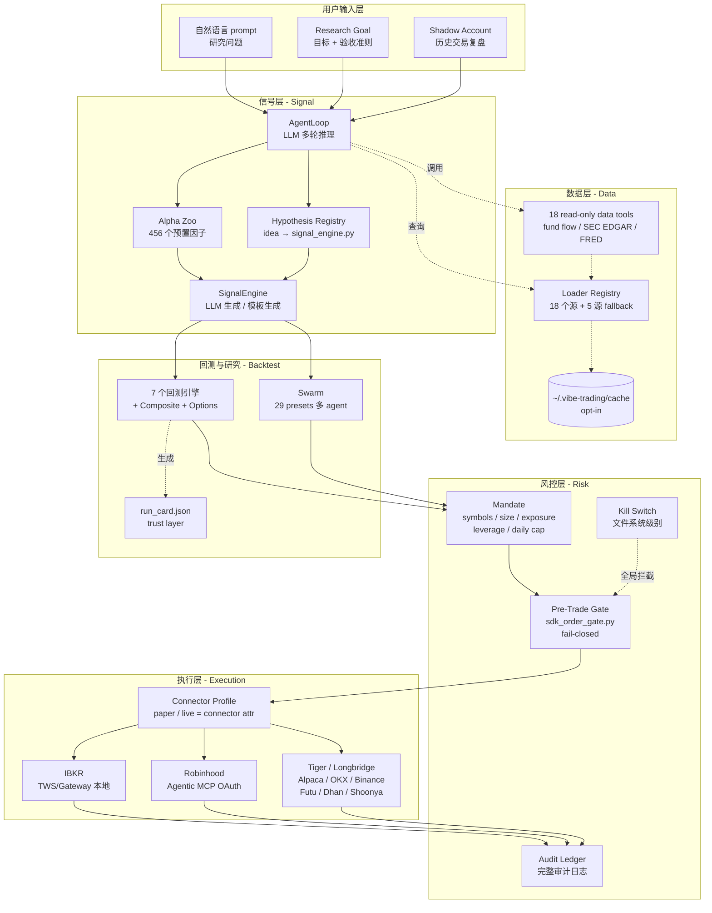
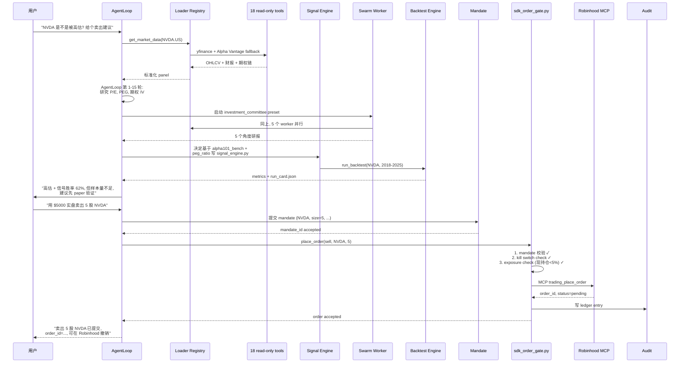

# Vibe-Trading 架构解析：HKUDS 把 LLM Agent 拆成「信号—风控—执行」三层的工程实践

## 核心判断

`HKUDS/Vibe-Trading`（仓库 [HKUDS/Vibe-Trading](https://github.com/HKUDS/Vibe-Trading)）是香港大学数据智能实验室（HKUDS）出品的开源 LLM 个人交易工作台，当前版本 v0.1.10（2026-06-19），Stars 13.8k、Forks 2.6k。它的工程价值不在于"又一款 LLM 投顾 demo"，而在于把"自然语言 → 策略代码 → 回测 → 风控 → 券商执行"这条链路做成了**显式分层的可插拔架构**：

1. **信号层（Signal）**：LLM 生成 + Alpha Zoo 预置因子（452 个跨 4 个 zoo：qlib158 / alpha101 / gtja191 / academic），生成 `signal_engine.py` 提交给回测。
2. **风控层（Risk）**：mandate（用户承诺的交易范围）+ kill switch（文件系统级别）+ pre-trade gate（fail-closed）+ audit ledger（完整审计日志）。
3. **执行层（Execution）**：10 个 broker connector（IBKR / Robinhood / Tiger / Longbridge / Alpaca / OKX / Binance / Futu / Dhan / Shoonya），每个 connector 自带 paper/live 结构性护栏。

这套架构与 QuantConnect（QC）走的路线形成清晰对比：QC 是"用 C#/Python 写确定性算法 + Lean 引擎集中执行"，Vibe-Trading 是"LLM 生成信号 + 显式风控 gate + 多 broker 即插即用"。两者的目标用户和研究工作流重叠但设计哲学不同。

## 项目地图

| 维度 | 关键信息 |
|------|----------|
| 仓库 | [HKUDS/Vibe-Trading](https://github.com/HKUDS/Vibe-Trading) |
| 官网 | [vibetrading.wiki](https://vibetrading.wiki/) |
| 文档 | [vibetrading.wiki/docs](https://vibetrading.wiki/docs/) |
| PyPI | [pypi.org/project/vibe-trading-ai](https://pypi.org/project/vibe-trading-ai/) |
| 许可证 | MIT |
| 维护方 | HKUDS（HKU Data Intelligence Lab） |
| 当前版本 | v0.1.10（2026-06-19） |
| Stars / Forks | 13.8k / 2.6k（截至 2026-06-28） |
| 核心语言 | Python 3.11+ / 后端 FastAPI / 前端 React 19 |
| 部署 | PyPI / ClawHub / Docker |

### 关键数字

| 指标 | v0.1.10 数值 |
|------|-------------|
| Agent tools | 68（v0.1.10，含 18 read-only data tools + Alpha Zoo 工具） |
| MCP tools | 54（v0.1.10） |
| Bundled skills | 79（含 finance skills） |
| Swarm presets | 29 |
| 数据源 | 18（A-share / US / HK / 加密） |
| Broker connectors | 10 |
| 回测引擎 | 7 + composite cross-market + options portfolio |
| Alpha 因子 | 456（v0.1.10 加入 4 个 academic 因子） |
| 测试 | 4167 passed |

## 系统地图：信号—风控—执行三层架构

Vibe-Trading 的整体架构可以拆成三层 + 一个横切关注点（数据层）。下面这张图按"信号生成 → 风控校验 → 经纪商执行"的真实数据流绘制：



读这张图需要注意三个容易混淆的点：

- **信号层（Signal）≠ 简单 LLM 调用**：v0.1.10 的 AgentLoop 是一个 50 轮迭代的多步推理循环，外加 PromptSuggestions、MicroCompact、BackgroundTasks 等机制。Alpha Zoo 提供预置的 456 个因子，LLM 可以基于它们组合成 long-short 信号，也可以独立写 `signal_engine.py`。
- **风控层（Risk）跨信号层和执行层**：mandate 在信号生成阶段就要被 read（限制可交易 universe），pre-trade gate 在执行前最后一道拦截。两者不是同一个模块，但通过同一个 `mandate` 配置对象连接。
- **执行层（Execution）= Connector 抽象 + 10 个具体 broker**：paper/live 不是配置项，而是 connector 自身的属性。每个 connector 的 SDK 适配器都内嵌结构性 paper/live 护栏——例如 Dhan / Shoonya 因为 API 不暴露 paper/live discriminator，其 `place_order` 在第一行就硬拒绝非 paper 配置。

## 信号层细节：LLM 生成 vs 预置因子

Vibe-Trading 提供两条信号生成路径，**这两条路径共用同一份回测执行器**：

### 路径 A：LLM 生成 `signal_engine.py`

AgentLoop 通过多轮推理生成一个继承自 `ZooSignalEngine` 的 Python 文件。生成流程有 3 道工程化护栏：

1. **预检（pre-flight）**：v0.1.7 加入的 LLM-generated signal engine pre-flight 验证会检查循环自 import、缺少 `generate()`、未默认参数、错误返回类型，命中就抛 JSON 化的 actionable error 而不是 raw traceback。
2. **AST purity gate**：每个 alpha 模块只允许 import `pandas`/`numpy`/`scipy.*`/`src.factors.base`/`__future__`/`typing`/`math`/`dataclasses`，禁止 `os`/`sys`/`subprocess`/`socket`/`urllib`/`requests`/`httpx`/`pathlib`/`open`/`eval`/`exec`/`compile`/`__import__` 等。
3. **Lookahead 哨兵测试**：300 行合成 panel；扰动探针点之后的行；断言探针处的因子值在 1e-9 内未变。

### 路径 B：Alpha Zoo 预置因子

`qlib158` + `alpha101` + `gtja191` + `academic` 四个 zoo 共 456 个因子。每个因子附带 `__alpha_meta__` dict：

```python
{
    "formula_latex": "...",
    "theme": "momentum",
    "universe": "csi300",
    "columns_required": ["close", "volume"],
    "warmup": 60,
    "decay_horizon": "5d",
    "notes": "..."
}
```

schema 是 pydantic `extra="forbid"`，任何越权字段会被构建期拒绝。

CLI 一行命令跑完整 zoo：

```bash
vibe-trading alpha bench --zoo gtja191 --universe csi300 --period 2018-2025 --top 20
```

`bench` 驱动 Rich 进度条（带 alpha-id + ETA banner），输出 alive/reversed/dead 分类（探针后仍显著 / 反转 / 已失效）、Top-5-by-IR、Most-Reversed 表、按主题分布柱状图，全部进 `bench_summary.json` + Web UI `/alpha-zoo`。

> ⚠️ **benchmark 解读边界**：`vibe-trading alpha bench` 报告的 IC / IR / 存活率是 **公式因子在指定 universe 和时段内的截面统计**，不能直接推出：(1) 实盘可行（未计交易成本、滑点、流动性）；(2) 因子在样本外的稳定性（已 split IC 但仍受 universe 选择偏差影响）；(3) 不同 broker / 不同资产类别的可移植性。仓库 wiki 的研究文章 ["Which of the 191 GTJA alphas still work in 2026?"](https://vibetrading.wiki/research-lab/posts/alpha-191-in-2026.html) 公开标注了 survivorship-bias caveat。

## 风控层：mandate + kill switch + pre-trade gate 三件套

风控不是写一份 checklist，而是 **4 个独立机制相互制衡**：

### 1. Mandate（用户承诺）

用户在配置文件里显式声明：
- **symbols**：可交易标的 universe
- **order size**：单笔最大手数
- **exposure**：最大净持仓 / 总持仓
- **leverage**：最大杠杆
- **daily cap**：单日最大成交笔数 / 最大亏损

mandate 是会话级别的，每次运行前必须重新提交——v0.1.10 的 `identifier containment for mandate proposal-ids`（#256）保证即使 mandate id 被恶意构造，也不会绕过验证。

### 2. Kill Switch（文件系统级别）

在 `~/.vibe-trading/` 下放置一个特定文件即可立即停止所有 agent 行为——不依赖进程、不依赖网络。这个机制的设计动机是：**当 LLM 失控时，网络可能被阻塞，进程可能被卡死，但文件系统仍然可用**。

### 3. Pre-Trade Gate（fail-closed）

`sdk_order_gate.py` 在订单到达 broker 之前做最后一次校验：

```
order → mandate 校验 → kill switch 检查 → audit 记录 → broker SDK
```

任意一步失败 → 订单**不发送**，返回 error。**fail-closed** 的含义是"系统默认拒绝"——和 fail-open（默认放行）相反，对 LLM 驱动的执行尤其重要。

### 4. Audit Ledger

每笔订单 + 每次 mandate 校验 + 每次 kill switch 触发都写入不可变日志。v0.1.10 的 `identifier containment for persistent-memory types`（#257）+ `MCP swarm run-ids`（#258）保证日志条目 id 不会被注入伪造。

### 结构性 paper/live 护栏

不是所有 broker 都有运行时 paper/live 切换能力。仓库的设计原则是：**没有结构性 paper/live guard 的 broker，强制 paper + read-only**。

| Broker | Paper / Live 切换机制 | 实际能力 |
|--------|----------------------|---------|
| IBKR | TWS/Gateway 本地账户切换 | 本地只读 + 远端 MCP 探针 |
| Robinhood | OAuth MCP + mandate | Bounded live |
| Tiger / Alpaca / OKX / Binance / Futu | 账户环境 / demo flag | Read + paper + bounded live |
| Longbridge / Dhan / Shoonya | API 无 discriminator | **强制 paper + read-only**（`place_order` 第一行硬拒绝） |

这套设计把"LLM 不能随便下实盘订单"这件事做成了**编译期约束**，而不是靠配置项或人工审查。

## 执行层：Connector 抽象 + 10 个 broker

v0.1.9 把 broker 抽象从"配置项"升级为"Connector Profile"：

```bash
vibe-trading connector list          # 列出 10 个 connector
vibe-trading connector use <name>    # 切换当前 profile
vibe-trading connector check         # 健康检查
vibe-trading connector account       # 查账户
vibe-trading connector positions     # 查持仓
vibe-trading connector orders        # 查订单
vibe-trading connector quote         # 实时报价
vibe-trading connector history       # 历史成交
```

MCP `trading_*` 工具和 CLI 共享同一份当前 profile——paper/live 是 connector 的属性，不是运行时的全局开关。

10 个 broker 覆盖 3 个市场：
- **美股**：IBKR / Robinhood / Alpaca
- **港股 / A 股**：Tiger / Longbridge / Futu
- **加密**：OKX / Binance
- **印度**：Dhan / Shoonya

## 一个任务流案例：自然语言 → 实盘订单

下面这个例子把三层 + 数据层全部串起来——从"我想看 NVDA 是不是被高估"开始，最终到 Robinhood 上一笔 bounded 实盘订单。



这个流程能跑通的工程前提是：

1. **数据层 18 个 loader 有 ban-risk 排序的 fallback**——yfinance 被限流时自动切到 Alpha Vantage 或 FMP。
2. **AgentLoop 的 microcompact 机制**——长会话自动压缩工具历史，避免 context 爆炸。
3. **mandate 必须先于 place_order**——任何 place_order 调用都会先被 gate 拦住要求 mandate id。
4. **Robinhood MCP 走 OAuth + bounded autonomy**——broker 本身持有资金，Vibe-Trading 只传递意图。

## 与 QuantConnect 的横向对比

Vibe-Trading 和 QuantConnect 是两个不同形态的量化平台。下表按"研究语言 / 执行边界 / 社区生态 / 学习成本 / 适合谁"五个维度对比：

| 维度 | Vibe-Trading | QuantConnect |
|------|--------------|--------------|
| **研究语言** | 自然语言（中文 / 英文 prompt）+ Python (`signal_engine.py`) + Alpha Zoo 公式 | C# / Python（Lean 引擎算法） |
| **执行边界** | LLM 生成信号 → 显式风控 gate → 10 个 broker connector | 单一 Lean 引擎 → QuantConnect 经纪商（IBKR / Alpaca / 币安 等） |
| **回测** | 7 个引擎 + Composite cross-market + Options portfolio | Lean 本地 + 云端统一引擎 |
| **因子库** | 456 个预置因子（4 个 zoo）+ LLM 生成 | 自带 alpha library 约 100+ 因子 |
| **多 agent 协作** | 内置 Swarm（29 presets, 投资委员会 / 量化 / 风控 委员会 等） | 无原生支持，需要外接 |
| **数据源** | 18 个 loader + 18 read-only tools（fund flow / SEC EDGAR / FRED 等） | 主要是行情数据 + 部分基本面 |
| **托管执行** | 走用户授权的 broker（Robinhood OAuth / IBKR 本地） | QuantConnect 托管 + 经纪商直连 |
| **UI / 交互** | React 19 Web UI + FastAPI 后端 + 交互式 CLI | Web IDE + 本地 LEAN CLI |
| **学习成本** | 1 小时起步 + 11 小时完整 | 文档齐全但首次接触仍需 1-2 天 |
| **许可** | MIT（完全开源） | 商业许可（云端）+ 开源 Lean 引擎 |
| **适合谁** | 想用 LLM 把"交易想法"快速跑成可回测 / 可执行的团队 | 想写确定性算法、严肃研究 backtest 的 quant |
| **不适合谁** | 想要 100% 确定性的高频 / 低延迟策略 | 想要自然语言一句话跑出策略的非编程用户 |

### 三个最关键的差异

#### 1. 信号来源：LLM 介入 vs 确定性算法

QuantConnect 的核心假设是**策略 = 代码**，所有信号都来自用户手写的算法。这种约束保证了回测和实盘的强一致性，但代价是迭代速度慢——一个想法要写完 + 回测 + 调参 + 实盘，常常需要几天。

Vibe-Trading 把 LLM 推到信号层，**前提是接受 LLM 输出的概率性**：LLM 写的 `signal_engine.py` 不保证每次都生成同一个文件，但仓库用预检 + AST purity + lookahead 哨兵把"不合格的生成"拦在回测之前。这意味着：

- 迭代速度从"几天"缩短到"几分钟"
- 但回测结果需要**人工 + run_card 信任层**复核，不能盲信
- 一致性通过"同一输入 + 同一 prompt"近似保证，不是编译期保证

#### 2. 执行边界：分布式 broker vs 单一引擎

QuantConnect 通过 Lean 引擎 + 经纪商 API 网关集中执行，broker 接口标准化但选择有限。

Vibe-Trading 的 10 个 broker connector 把"在哪里执行"开放给用户，代价是**每个 broker 都需要单独的 paper/live 护栏**。仓库用结构性护栏（API 是否暴露 paper/live discriminator）做了硬约束，但用户仍然要理解每个 broker 的不同语义。

#### 3. 社区生态：研究实验室 vs 商业平台

QuantConnect 是商业平台，云端回测收费，有活跃的社区算法分享。

Vibe-Trading 是 MIT 开源研究项目，HKUDS 实验室维护，社区贡献以 PR 形式加入（仓库近几个 release 平均每个 cycle 有 8-12 个 community PR）。**优势是透明 + 可改造，劣势是文档深度和教学资源仍弱于 QuantConnect**。

## 适用边界与决策建议

### Vibe-Trading 适合的场景

- **个人 / 小团队的 LLM-first 投研**：想用自然语言迭代想法，把策略开发时间从几天压到几分钟。
- **多市场（A 股 / 港股 / 美股 / 加密 / 印度）跨资产研究**：18 个 loader 覆盖 + 跨市场 composite 回测引擎。
- **需要 bounded 实盘**：Robinhood Agentic Trading + mandate + kill switch 提供了"AI 自动下单但带硬护栏"的能力。
- **研究 + 教学**：MIT 许可，可改造可二次分发；vibe-trading.wiki 有公开研究文章。
- **多 agent 协作研究**：29 个 swarm preset 提供"投资委员会 / 量化 / 风控 委员会"等预设场景。

### Vibe-Trading 不适合的场景

- **高频 / 低延迟策略**：Python + LLM 推理延迟决定了它的有效频率范围在分钟级以上。
- **100% 确定性回测**：LLM 生成的信号不是 bit-reproducible，benchmark 解读必须考虑概率性。
- **券商监管严格地区**（如部分 A 股程序化交易报备）：Vibe-Trading 的 connector 主要面向 IBKR / Robinhood / Tiger / Futu，A 股直连需要走 Tushare 数据 + 单独的合规通道。
- **大规模多账户并发执行**：当前架构按"单用户 + 多 broker"设计，没有 portfolio-level multi-account orchestration。
- **严格的因子 IP 合规审查**：Alpha Zoo 借鉴了 qlib158 + alpha101 + gtja191 + academic 的数学公式，仓库在 LICENSE.md 里明确声明"公式不是 copyright 内容"，但企业部署仍需自行审查。

### 决策建议

如果你正在选择"先做哪一个"——

1. **已经在用 QuantConnect？** 把 Vibe-Trading 当作"自然语言层 + bounded 实盘层"叠加在 QC 之上：QC 跑严肃研究，Vibe-Trading 跑 idea → signal → 人工 review → 提交到 QC 框架。
2. **从未做过量化？** 先用 Vibe-Trading 跑 `vibe-trading alpha bench --zoo alpha101 --universe csi300 --period 2018-2025 --top 10`，看 10 个预置因子的存活率，建立 IC / IR 的直觉。
3. **团队有 quant 但没有 LLM 工程师？** 用 Vibe-Trading 的 29 个 swarm preset 做"投资委员会"模拟，看 LLM 能不能从 LLM 角度补 quant 没覆盖的信号维度。
4. **想跑实盘？** 必须先 paper 至少 30 天，再用 Robinhood bounded live，且务必在 `~/.vibe-trading/` 配 kill switch 文件。

## 不覆盖什么

- **HKUDS 实验室的其他项目**（如 [LightRAG](https://github.com/HKUDS/LightRAG)、[ChatDev](https://github.com/HKUDS/ChatDev) 等）——本文聚焦 Vibe-Trading。
- **Vibe-Trading 的完整 CLI / API / MCP 工具列表**——仅展开与信号—风控—执行三层架构直接相关的部分。
- **v0.1.10 之前每个 release 的完整 changelog**——只挑出与"分层架构"演进相关的关键版本（v0.1.7 安全边界 / v0.1.8 Alpha Zoo / v0.1.9 Connector profile / v0.1.10 Global data layer）。
- **Docker 部署的合规与 CI/CD 流水线**——v0.1.10 已 ship Docker 非 root 用户与 volume 持久化，但本文不展开 docker-compose 细节。
- **LLM provider 层面的可靠性优化**（v0.1.9 的 provider capability layer、Stream failure retry 等）——属于 execution layer 的内部细节，不影响用户对分层的理解。
- **Shadow Account 的完整功能**——它是另一个产品维度（broker journal 复盘），与本文主轴平行。