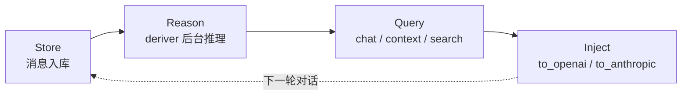

+++
github_repo = "plastic-labs/honcho"
source_key = "gh:plastic-labs/honcho"
date = '2026-05-23T13:09:23+08:00'
lastmod = '2026-09-30T16:11:57+08:00'
draft = false
title = 'honcho：把「AI 对人的理解」做成可查询的记忆基础设施'
slug = 'honcho-memory-library-stateful-agents'
description = 'honcho 是 Plastic Labs 开源的推理型记忆基础设施：消息入库后由后台 deriver 持续提炼每个 peer 的表征，再经 chat、representation、context、混合搜索四条路径查询。本文基于 2026-09-30 核实的 v3.2.1 代码库，拆解 peer 模型、异步推理管线、三种部署形态与选型边界。'
categories = ['技术笔记']
tags = ['AI Agent', '开源']
+++

# honcho：把「AI 对人的理解」做成可查询的记忆基础设施

**⭐ Stars：** 7,403（2026-09-30）
**🔗 地址：** https://github.com/plastic-labs/honcho
**🌐 文档：** https://honcho.dev/docs
**📜 许可证：** AGPL-3.0

多数「Agent 记忆」方案做的是搬运工作：把聊天记录切块、算向量、检索时拼回提示词。Plastic Labs 的 honcho 走的是另一条路——消息入库之后，由后台推理管线持续提炼「系统对每个参与者的认识」，再把这份认识以自然语言问答、低延迟表征、会话上下文、混合搜索四种形式取出来。用官方 README 的话说，它提取的是「从对话和事件中得出的结论，而不只是匹配文本块」。honcho 存的不只是消息，还有 AI 对人的理解本身。

一句话判断：如果你的产品需要记住「用户是个什么样的人」而不只是「用户说过什么」，honcho 值得认真评估；反之，它对你就是多养一个服务。本文基于 2026-09-30 核实的 v3.2.1 代码库。

## 目录

- [项目坐标](#项目坐标)
- [先看地图：五原语、双服务、一个循环](#先看地图五原语双服务一个循环)
- [Peer 模型：人与 Agent 一视同仁](#peer-模型人与-agent-一视同仁)
- [异步推理管线：deriver 在后台做什么](#异步推理管线deriver-在后台做什么)
- [查询面：四种取回结果的方式](#查询面四种取回结果的方式)
- [一次完整流转：数学辅导 Agent](#一次完整流转数学辅导-agent)
- [快速上手：SDK 与真实代码](#快速上手sdk-与真实代码)
- [三种部署形态](#三种部署形态)
- [集成：给现役 Agent 接上共享记忆](#集成给现役-agent-接上共享记忆)
- [官方评测怎么读](#官方评测怎么读)
- [横向定位与选型边界](#横向定位与选型边界)
- [结语](#结语)
- [资料口径](#资料口径)

## 项目坐标

| 指标 | 数值（2026-09-30，GitHub API） |
|------|------|
| Stars / Forks | 7,403 / 914 |
| 贡献者 | 62 |
| 最新 release | v3.2.1（2026-09-24），README 部署徽章显示 Server 3.2.2 |
| 仓库创建 | 2023-09 |
| 许可证 | AGPL-3.0 |
| 语言构成 | Python ≈91%、TypeScript ≈8% |
| SDK 版本 | PyPI `honcho-ai` 2.5.1 · npm `@honcho-ai/sdk` 2.5.1（独立于服务端版本演进） |

代码仓库里同时放着服务端（`src/` 下的 FastAPI 应用）、两套官方 SDK（`sdks/python`、`sdks/typescript`）、命令行工具（`honcho-cli/`）和 MCP 接入层（`mcp/`）。也就是说，一个仓库就是一个完整的记忆服务，而不是某个框架的插件。

一个容易踩的坑先说在前面：PyPI 上的 `honcho` 包跟这个项目毫无关系，它是 Foreman（Procfile 进程管理器）的 Python 克隆。honcho 的 Python SDK 包名是 `honcho-ai`。

## 先看地图：五原语、双服务、一个循环

honcho 的概念面很窄，五个原语讲完：

| 原语 | 职责 | 备注 |
|------|------|------|
| Workspace | 顶层容器，按用例隔离数据 | 前身叫 App |
| Peer | 参与者：人类用户和 AI Agent 一视同仁 | 前身叫 User |
| Session | 一段对话上下文，与 Peer 多对多 | 类似别家的 thread |
| Scope | Session 的命名分组，划定召回边界 | v3 新增 |
| Message | 原子数据单元：对话消息或导入的文档切块 | 挂在 Session 上 |

数据组织是一棵简单的树：

```text
Workspace
├── Peers（内部 collections 以 observer/observed peer 对为键）
├── Scopes（与 Session 多对多）
└── Sessions（与 Peer 多对多）
    ├── Peers
    └── Messages（标明来源 peer）
```

服务内部一分为二：**Storage** 负责工作区、peer、session、scope、消息的同步读写；**Insights** 负责一切推理——结论提炼、表征更新、会话摘要，走后台队列，由 deriver 工作进程异步消费。你调用 API 存消息是同步的、立刻返回的；系统「想明白」这些消息意味着什么，是异步的、滞后的。这个划分决定了使用 honcho 的正确姿势：写完就走，稍后再查。

官方把这套路数总结成一个循环：



## Peer 模型：人与 Agent 一视同仁

honcho 里没有「用户表」和「Agent 表」的区分，一切参与者都是 peer。学生和辅导老师、人类顾客和客服机器人，在数据模型里是同一种东西。这带来三个直接后果：

一，**会话天然支持多参与者**。一个 session 里可以同时有人类和多个 AI Agent，每个消息都标明来源 peer。

二，**Agent 之间可以互相建模**。内部存储以 (observer, observed) peer 对为键存放向量化的文档集合——peer X 对 peer Y 的观察，和 peer X 对自己的观察（observer == observed），走的是同一套机制。这些内部集合不直接暴露，公开出口是 Conclusions API。

三，**观察关系可以配置**。哪些 peer 观察哪些 peer，按 session 粒度设置，这让你能表达「这个助手只在该会话里了解这个用户」这类约束。

Scope 是 v3 补上的一块：给一组 session 起个名字，之后 chat、representation、session context、workspace search 走这个 scope 查询时，只见得到组内成员 session 里发生的事，而 peer 的统一表征仍然跨 scope 通用。它解决的是「一个用户在不同场景下的记忆该不该互通」——比如「工作」和「私人」两个 scope。两个细节值得记住：一次读取中 scope 与 session/filters 互斥，只能二选一；查询落在一个空 scope 上会直接失败（fail closed），而不是静默返回全库结果。

## 异步推理管线：deriver 在后台做什么

消息入库后发生的事情，官方 README 给的四步：

1. 消息通过 API 创建；
2. 派生任务入队——至少包括 `representation`（更新 peer 表征）和 `summary`（生成会话摘要）两类；
3. 队列按 session 保证处理顺序；
4. 结果写入内部存储，经 Conclusions API、Representations、Peer Cards 和 Chat Endpoint 对外暴露。

deriver 还负责 peer cards 和「dreaming」任务（系统在空闲时对已有观察做二次整理）。推理本身要花 LLM 调用，所以 honcho 把模型按任务分工做了默认配置：Gemini 用于 deriver、摘要和 dialectic 低档位，Anthropic 用于 dialectic 中高档位与 dream，OpenAI 用于消息嵌入（设 `EMBED_MESSAGES=true` 时）。这些都能通过配置改——honcho 支持 TOML 文件加环境变量，优先级是环境变量 > `.env` > `config.toml` > 默认值。

对使用方式影响最大的一点：**新写入的消息不会立刻反映到 chat 和表征查询里**。README 原话是「可能需要一点时间」。如果你的场景对延迟敏感，官方给的替代是用 representation 端点拿静态快照，或者用 `honcho.queue_status(...)` 看后台队列积压到哪了。

## 查询面：四种取回结果的方式

honcho 查出来的东西有四种形态，对应四种延迟和用途：

| 产物 | 是什么 | 适合 |
|------|--------|------|
| Conclusions | 系统对某 peer 提炼的结论（演绎 + 归纳） | 精确取回已知维度的事实 |
| Representations | 某 peer 认知的静态快照，可按 session 限定 | 低延迟注入，不想等 LLM 生成 |
| Peer Cards | 紧凑的身份摘要 | 快速了解一个参与者 |
| Session context | 消息 + 结论 + 摘要按 token 限额拼好的即用包 | 长对话续命，直接塞给模型 |

落到 SDK 上，常用 API 是这张表（全部来自当前 README）：

| 需求 | API |
|------|-----|
| 存交互历史 | `session.add_messages(...)` |
| 问 honcho 对某 peer 的认识 | `peer.chat(...)` |
| 整个工作区范围问答 | `honcho.chat(...)` / `honcho.chat_stream(...)` |
| 拿即用上下文 | `session.context(...).to_openai(...)` / `.to_anthropic(...)` |
| 混合检索（BM25 + 向量） | `peer.search(...)`、`session.search(...)`、`honcho.search(...)` |
| 低延迟静态表征 | `peer.representation(...)`、`session.representation(...)` |
| 导入文档 | `session.upload_file(...)` |
| 查后台处理进度 | `honcho.queue_status(...)` |

其中 chat 是旗舰接口（HTTP 层是 `POST /peers/{peer_id}/chat`）：收自然语言问题，返回带推理的回答。官方列的典型用法包括——问系统对某个 peer 的通用或具体认识、让系统为提示词补充该 peer 的行为数据、回答前找它要个「第二意见」。注意 chat 和 search 的分工：search 是字面与语义的混合检索，返回的是消息本身；chat 走的是推理，返回的是结论。

## 一次完整流转：数学辅导 Agent

把上面的机制串成一个官方 README 里的完整例子——一个能记住学生学习风格的辅导 Agent：

```python
import os
from honcho import Honcho

# 托管服务默认指向 api.honcho.dev；自托管传 base_url="http://localhost:8000"
honcho = Honcho(
    workspace_id="my-app-testing",
    api_key=os.environ["HONCHO_API_KEY"],
)

# 1. Store：学生和辅导老师都是 peer，消息挂在 session 上
alice = honcho.peer("alice")
tutor = honcho.peer("tutor")
session = honcho.session("session-1")
session.add_messages([
    alice.message("Hey there — can you help me with my math homework?"),
    tutor.message("Absolutely. Send me your first problem!"),
])

# 2. Reason：异步发生，稍等片刻才会反映到下面的查询结果

# 3. Query：问 honcho 这个学生的学习偏好；或直接拿即用上下文
answer = alice.chat("What learning styles does the user respond to best?")
context = session.context(summary=True, tokens=10_000)

# 4. Inject：把上下文转成 OpenAI 消息格式，交给任意模型
from openai import OpenAI
client = OpenAI()
completion = client.chat.completions.create(
    model=os.environ.get("OPENAI_MODEL", "gpt-4o-mini"),
    messages=context.to_openai(assistant=tutor),
)
```

跟着数据走一遍：两条消息入库后立刻返回；deriver 从队列里取到这个 session 的派生任务，提炼出「alice 是谁、她怎么学习最好」这类结论；下次她再来时，`alice.chat(...)` 能答出「她对哪种讲解方式反应最好」——哪怕这些信息从没在任何一条消息里被明说过。`session.context(summary=True, tokens=10_000)` 则解决另一件事：会话拉长到上下文窗口装不下时，用它取一段限额内的消息、结论加摘要的组合，会话就能无限续下去。

`to_openai(assistant=tutor)` 的 `assistant` 参数指定了注入后视角挂在哪个 peer 上；换成 `.to_anthropic(...)` 就是 Claude 的消息格式。SDK 侧不需要为不同模型改存储逻辑。

## 快速上手：SDK 与真实代码

Python 端：

```bash
pip install honcho-ai
# 或 uv add honcho-ai / poetry add honcho-ai
```

TypeScript 端：

```bash
npm install @honcho-ai/sdk
# 或 bun add @honcho-ai/sdk
```

再强调一次包名：是 `honcho-ai`，不是 `honcho`——后者在 PyPI 上是个同名的进程管理工具。SDK 版本与服务端版本独立演进，当前两边都是 2.5.1。

Python SDK 支持 `peer()`、`session()`、`scope()`、`peers()`、`sessions()`、`scopes()` 等入口和 `chat()`、`chat_stream()`、`add_messages()`、`context()`、`search()` 等操作（以上签名核对自 `sdks/python/src/honcho/` 源码）。异步调用走 `.aio()` 访问器，例如 `await client.aio.peer("user-123")`。

想直接看可运行示例，仓库里 `sdks/python/examples/` 有现成的一组：`chat.py`、`get_context.py`、`search.py`、`file_upload.py`、`multi_user_representations.py`、`pydantic_validation_example.py`。

最省事的起步路径其实不写代码：去 [app.honcho.dev](https://app.honcho.dev) 注册拿 key（新组织有专属实例和 100 美元免费额度），用下面的集成方式十分钟内给现役 Agent 装上记忆，确认价值后再回来接 SDK。

## 三种部署形态

honcho 是服务端系统，最小部署 = API 服务 + deriver 工作进程 + PostgreSQL（带 pgvector）。三种跑法，按省事程度排：

**托管服务**。指到 api.honcho.dev，零运维，注册即用。适合验证期和中小流量。

**CLI 本地栈**。官方维护了 `honcho-cli`：

```bash
uv tool install honcho-cli
honcho init                 # 认证：API key 或浏览器登录，写 ~/.honcho/config.json
honcho start --setup basic  # 本地栈：填 LLM provider key + Docker
honcho doctor               # 体检
```

`honcho start` 拉起的是 API + deriver + Postgres + Redis 四件套。适合个人本地使用——比如给只在自己机器上跑的 coding agent 配记忆。

**源码自托管**。仓库带 Docker Compose 模板：

```bash
git clone https://github.com/plastic-labs/honcho.git
cd honcho
cp docker-compose.yml.example docker-compose.yml
cp .env.template .env       # 至少填一个 LLM provider key
docker compose up
```

不用 Docker 的源码开发路线要求 Python ≥ 3.10、uv ≥ 0.5.0，数据库连接串必须带 `postgresql+psycopg` 前缀（SQLAlchemy 的要求），跑 `alembic upgrade head` 建表，然后分别起 `fastapi dev src/main.py` 和 `python -m src.deriver`。适合要改代码、有合规要求或想把数据完全留在自己机房里的团队。

许可在这里要当回事：AGPL-3.0 意味着如果你改造 honcho 后把它作为网络服务对外提供，按协议需要向网络用户开放修改版的源码。不想处理这件事，用托管服务；原样自托管、不做修改，一般不触发开放自己业务代码的义务——边界情形建议让法务确认你的具体用法。

## 集成：给现役 Agent 接上共享记忆

honcho 给每个主流 coding agent 都做了第一方记忆插件，全部读同一份 `~/.honcho/config.json`——`honcho init` 写一次 key，所有集成一起生效；两个工具指向同一个 workspace，就共享同一份记忆。

| Agent | 安装 |
|-------|------|
| Claude Code | `/plugin marketplace add plastic-labs/claude-honcho` |
| Codex | `npm install -g @honcho-ai/codex-honcho` 后执行 `codex-honcho install` |
| Cursor | 官方安装脚本（install.sh / install.ps1） |
| DeepSeek Harness | `dsh plugin --profile <name> add @honcho-ai/dsh-honcho` |
| OpenCode | `opencode plugin "@honcho-ai/opencode-honcho" --global` |
| OpenClaw | `openclaw plugins install @honcho-ai/openclaw-honcho` 后 `openclaw honcho setup` |
| Hermes | 内置，`hermes memory setup` 选 honcho |
| 任意 MCP 客户端 | `claude mcp add honcho --transport http --url https://mcp.honcho.dev ...` |

几个值得知道的细节：DeepSeek Harness 插件给模型三个工具（`honcho_search`、`honcho_chat`、`honcho_remember`），用 `/honcho` 看状态；OpenClaw 安装时可以非破坏性地迁移已有的 `MEMORY.md` / `USER.md` / `IDENTITY.md` 进 honcho（原文件不删）；MCP 路线需要在请求头带 `Authorization: Bearer` 的 key 和 `X-Honcho-User-Name` 标识。

给自己的应用代码接 SDK 也有辅助：`npx skills add plastic-labs/honcho` 装一套 agent skill（`/honcho-integration`），它会探索你的代码库、问集成偏好、生成 SDK 接入代码并验证。

## 官方评测怎么读

honcho 的 evals 覆盖 LongMemEval、LoCoMo 等长对话记忆基准，官方在 evals 页面和博客（Benchmarking Honcho）公布了方法论与可复现结果，README 还以「定义了 Agent 记忆的 Pareto 前沿」自居。读这批数字时建议带着三个问题：

一，**测的是什么**。长对话记忆基准测的是「多轮、跨会话之后还能不能想起该想起的事」，不是检索基准（召回率、MRR 那套），也不是推理基准。honcho 的推理型记忆在这一类任务上有结构性优势——结论已经提前提炼好了，不用现场从原文拼。

二，**数字反映系统的哪部分**。表现好坏主要取决于后台推理的质量（结论提炼得准不准、全不全），其次才是检索层。这意味着换更强的 LLM provider 可能直接影响它的表现，也意味着成本结构里推理调用占大头。

三，**不能推出什么**。这些是厂商自评，方法再透明也没有第三方复核；不同记忆方案各自挑了对自家有利的任务分布。具体分数本文不转引，以官方页面为准——重点是把它当作「值得自己跑一遍」的信号，而不是采购依据。

## 横向定位与选型边界

把 honcho 放进记忆赛道（star 数均为 2026-09-30 GitHub API 读数）：

| 项目 | Stars | 一句话定位 |
|------|-------|-----------|
| [mem0](https://github.com/mem0ai/mem0) | 66,346 | Drop-in 记忆层，插进现有 LLM 调用链 |
| [Letta](https://github.com/letta-ai/letta) | 24,981 | MemGPT 后继，记忆管理内嵌于 Agent 运行时 |
| [honcho](https://github.com/plastic-labs/honcho) | 7,403 | 推理型记忆服务，peer 表征 + 多参与者建模 |
| [Zep](https://github.com/getzep/zep) | 4,941 | 时序知识图谱路线 |

四家都在做同一件事——把记忆从开发者手写的提示词拼接变成基础设施——但对「记忆是什么」的回答不同。mem0 把记忆操作做成 API；Letta 把记忆做进 Agent 循环本身；Zep 押注知识图谱；honcho 押注的是「对人（和 Agent）的可查询理解」。它最独特的两个点：peer 模型让人和 Agent 互相成为可建模的对象，以及推理先行的取回方式。star 数量在此只说明社区规模，不构成孰优孰劣的证据——这几个项目没有跑过同一份第三方基准。

什么时候**不需要** honcho：

- 会话短，上下文窗口装得下，框架自带的短期记忆就够——为一个循环依赖引入四个容器进程不划算；
- 需求本质是文档 RAG——找文件、查手册，向量库加 BM25 是更直接的答案；honcho 的 `upload_file` 是把文档当作「关于某 peer 的观察」导入，重心在理解人，不在管理文档；
- 场景是嵌入式或单二进制分发——honcho 没有进程内嵌入模式，最小面是 API + deriver + Postgres；
- 数据模型里没有「人」——纯工具型、无状态任务的产品，记忆层没有附着点。

什么时候**优先**考虑它：产品个性化和用户长期关系是核心竞争力（教育、陪伴、健康、私人助理），或者多 Agent 系统里 Agent 之间需要互相建模。这两类需求正好压在 peer 模型的能力上。

## 结语

honcho 的差异化赌注很清楚：记忆系统的竞争力不在检索精度，而在对人的理解深度——所以它把算力花在后台推理上，把接口做成「直接问它」而不是「帮它拼提示词」。这个赌注的代价同样清楚：异步延迟、持续的推理开销、一个必须养着的服务端。

给你的采用顺序：先用托管 key 跑通上面的数学辅导例子，亲手感受「问它一个从未明说的事实」这件事；觉得有价值，再设计 workspace/scope 的隔离结构；流量和数据主权要求上来之后，最后一步才是自托管。全程不必改你的模型调用代码——记忆是挂在旁边的服务，不是嵌进调用链的胶水。

## 资料口径

本文数据与结论核对于 2026-09-30：

1. GitHub API：repos / languages / contributors / releases 接口（7,403★、914 forks、62 贡献者、v3.2.1 发布于 2026-09-24）；
2. main 分支 README 与 `.env.template` 注释（架构、原语、SDK 用法、集成表、LLM 分工、部署要求，对应 Server 3.2.2）；
3. SDK 源码抽查：`sdks/python/src/honcho/` 下 `client.py`、`peer.py`、`session.py`、`__init__.py` 的公开签名；
4. PyPI `honcho-ai` 2.5.1、npm `@honcho-ai/sdk` 2.5.1；PyPI `honcho` 2.0.0（无关的 Foreman 克隆，仅用于包名警示）；
5. 链接可达性：honcho.dev/docs、honcho.dev/evals、blog.plasticlabs.ai（Benchmarking Honcho）、discord.gg/honcho 均为 200；
6. 对比项目（mem0、Letta、Zep）star 数来自各自 GitHub API 同日读数。

文中代码示例取自官方 README 与 SDK 源码，服务端未在本机完整部署实测；benchmark 具体分数未转引，以官方 evals 页面为准。

---

**相关工具：** [Hermes Agent](/posts/tech/ai-agent/hermes-agent-self-improving-ai-framework/) · [Superpowers](/posts/tech/superpowers-coding-agent-development-methodology/) · [Academic Research Skills](/posts/tech/academic-research-skills-claude-code-research-pipeline/)
