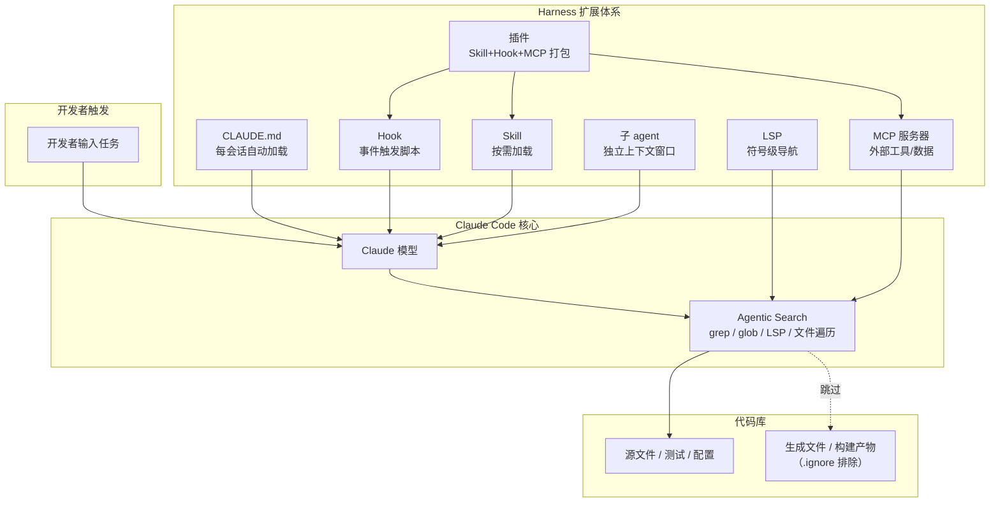

Claude Code 在大型代码库里的表现，决定性因素不是模型选型，而是三件事：代码库能不能被 agent 高效导航、Harness 各层配置有没有形成闭环、组织有没有为这些配置安排明确的 Owner。本文以 Anthropic 工程博客 Claude Code at scale 系列为基线，补充了上下文工程指南中 compaction、sub-agent 等机制的工程含义，并结合社区落地经验展开。

读完这篇文章，下面几个问题应该能形成判断：

- Claude Code 为什么不在大型代码库里用 RAG，agentic search 和 RAG 的工程权衡到底在哪
- Harness 七层扩展点各自解决什么问题，你的团队按什么顺序建
- 三种配置模式的核心设计原则能不能直接套用到你的代码库
- 从个人试点到全公司推广，组织侧要越过哪几道坎

| → | [总览图](#一张图看懂-claude-code-的导航和扩展体系) | [为什么不用 RAG](#1-为什么不用-rag) | [Harness 全景](#2-harness-七层扩展体系) | [模式一：可导航](#3-模式一让代码库在规模上可被导航) | [模式二：持续维护](#4-模式二随模型进化主动维护配置) | [模式三：Owner](#5-模式三为-claude-code-管理分配明确的-owner) | [实战推演](#6-一次实战推演从修-bug-到提交-pr) | [组织推广](#7-从试点到全公司推广的策略) | [决策表](#8-按你团队的情况做选择) | [踩坑](#9-常见踩坑)

## 一张图看懂 Claude Code 的导航和扩展体系

图上读出一条核心设计：Claude Code 不构建代码库索引。每次会话从零开始，通过 grep/glob/LSP/文件遍历实时导航代码库。Harness 的七层扩展点——CLAUDE.md、Hook、Skill、插件、LSP、MCP 服务器、子 agent——各自在不同时机向模型注入上下文或能力，加载时机和适用场景各不相同。

## 1. 为什么不用 RAG

大多数 AI 编程工具走 RAG 路线：把代码库转成嵌入向量，查询时检索相关片段喂给模型。这套方案在小规模代码库上够用，但在大型代码库里有一个结构性问题——嵌入索引跟不上代码提交速度。

一个有几百个活跃开发者的仓库，每天可能有上千次提交。嵌入流水线要对每次变更重新生成向量，而索引更新本身有延迟。当开发者发起查询时，索引可能还停留在数小时甚至数天前的状态——返回的函数可能已经被重命名，引用的模块可能已经删掉了，模型拿着过时的上下文做判断，开发者却没有收到任何提示。

Claude Code 选了另一条路：**agentic search**。它不预先建索引，而是像人类工程师一样遍历文件系统——用 grep 定位函数名，用 glob 匹配文件模式，用 LSP 跨文件追踪符号引用，一层一层缩小范围。因为它在开发者本地机器上运行，读到的始终是实时代码库状态。

这种方案有代价：它要求 agent 有足够的起始上下文来定位目标。如果在一个十亿行代码库里搜一个模糊模式，Claude 在真正开始工作前就会耗尽上下文窗口。所以导航质量高度依赖代码库本身的结构设计，以及通过 CLAUDE.md 和 Skill 注入的上下文精确度。前期肯花精力做代码库配置的团队，使用效果会拉开明显差距。

还有一个更底层的约束容易被忽略：所有 LLM 都存在上下文衰减（context rot）——上下文窗口里的 token 越多，模型精确召回其中信息的能力就越差。这是 Transformer 架构的 n² 注意力机制在长序列上的固有特性，不是某个模型的 bug。"把更多东西塞进上下文"从来不是一个可持续的策略——关键是塞进去的每一条信息都足够高信号。

## 2. Harness：七层扩展体系

一个常见误解：以为 Claude Code 的能力完全取决于选的模型。团队盯着 benchmark 分数和测试任务表现，忽略了围绕模型构建的那整套东西——Anthropic 叫它 Harness。实际工程中，Harness 对最终表现的影响往往超过模型本身。

### 2.1 CLAUDE.md：最先建的一层

CLAUDE.md 是 Claude 在每个会话启动时自动读取的上下文文件。根目录的文件提供全局视角（构建命令、代码库约定、关键注意事项），子目录的文件提供局部约定（该目录的测试命令、lint 规则、模块边界）。

由于每个会话都会加载，内容必须精简。根目录 CLAUDE.md 只应放指向性信息和关键例外——把通用知识、可复用的专业工作流塞进去，文件会膨胀成噪音。这些内容应该放进 Skill。

### 2.2 Hook：让配置能自我进化

大多数团队把 Hook 理解成"防 Claude 犯错的脚本"——比如一个 Hook 检查 Claude 是否改了不该改的文件。这个用法没错，但低估了 Hook 的潜力。

一个 stop hook 可以在会话结束时反思发生了什么，在上下文还新鲜的时候建议 CLAUDE.md 的更新。一个 start hook 可以动态加载团队特定上下文，让不同开发者根据自己负责的模块自动获得正确配置。对于 lint 和格式化这类检查，Hook 以确定性脚本执行规则，比依赖 Claude"记住一条指令"产生更一致的结果。

Hook 的真正杠杆在另一端：让配置能自己进化。一个 stop hook 在会话结束时把这次发现写进 CLAUDE.md，下次所有同事的会话自动带上这条经验——不需要开会同步，不需要发文档。配置从静态指令变成了活的工程资产。

### 2.3 Skill：按需加载，不常驻

大型代码库里有几十种任务类型——安全审查、文档生成、部署流程、测试编写。如果所有专业知识都在每次会话中加载，上下文窗口很快被撑满。

Skill 用渐进式披露解决这个矛盾：把专业工作流和领域知识放在独立模块里，Claude 只在任务相关时才加载。安全审查 Skill 在评估代码漏洞时触发；文档 Skill 在代码变更需要更新文档时触发。

Skill 还可以限定到特定路径。负责支付服务的团队可以把部署 Skill 绑定到那个目录——当其他人在单体仓库的其他部分工作时，这个 Skill 不会自动激活。

### 2.4 插件：把好配置从"部落知识"变成"可安装包"

大型代码库的一个隐蔽成本：好的 Claude Code 配置容易变成口头相传——老员工知道怎么配，新员工入职后要花几周摸索。

插件把 Skill、Hook 和 MCP 配置打包成一个可安装包。新工程师入职第一天装插件，立即获得和老员工相同的上下文和能力。插件更新通过托管市场在整个组织内分发，不需要每个人手动同步配置。

Anthropic 提到一家大型零售企业的案例：他们先构建了一个连接内部分析平台的 Skill，让业务分析师能在不离开工作流的情况下拉业绩数据。在向业务侧全面推广前，他们先把这个能力作为插件分发给几个人试——验证可用之后再铺开。

### 2.5 LSP：从文本匹配到符号级导航

LSP（语言服务器协议）给了 Claude 和人类开发者同款的 IDE 导航能力。大多数大型代码库的 IDE 已经跑了 LSP——"转到定义""查找所有引用"背后就是它。

没有 LSP，Claude 只能做文本模式匹配。在大型代码库里用 grep 搜 `process` 会返回几千个匹配，Claude 要消耗上下文逐个打开文件判断哪个才是目标。LSP 直接返回指向同一个符号的引用，过滤在 Claude 读任何文件之前就完成了。

一家 Anthropic 合作的企业软件公司，在推广 Claude Code 之前全公司范围部署了 LSP 集成——主要是为了在 C 和 C++ 代码库里保证导航可靠性。对于多语言代码库，这是投入产出比最高的一步。

> **配置 LSP**：安装对应语言的代码智能插件和语言服务器二进制文件。Claude Code 文档中有可用插件列表和故障排除指南。

### 2.6 MCP 服务器：把 Claude 接进内部工具链

MCP（模型上下文协议）服务器是 Claude 连接内部工具、数据源和 API 的桥梁。最成熟的团队构建了暴露结构化搜索能力的 MCP 服务器——Claude 可以像调用函数一样调用它们。另一些团队把 Claude 接进了内部文档系统、工单系统或分析平台。

但顺序错了会适得其反。如果在基础 Harness（CLAUDE.md、Hook、Skill）还没跑通时就急着接 MCP，Claude 会在上下文里被外部工具返回的数据淹没，导航精度反而下降。

### 2.7 子 agent：探索和编辑分开跑

子 agent 是一个独立的 Claude 实例，有自己的上下文窗口。它接收任务、完成工作、只把最终结果返回给父 agent——中间的探索过程不占用主窗口。

在 Harness 就位后，一些团队的做法是：启动一个只读子 agent 去映射子系统结构，把发现写入文件；主 agent 在拿到这份完整视图后再开始编辑。这种模式的核心思路是**探索和修改分离**——探索阶段消耗的上下文不会和修改阶段争抢注意力预算。

## 3. 模式一：让代码库在规模上可被导航

这种情况下，Claude 在大型代码库里能帮多少忙，上限取决于它能不能找到正确上下文。加载太多，注意力被稀释；加载太少，它在盲目摸索。效果好的团队都在一件事上花了功夫：让代码库对 agent 保持可导航。

**CLAUDE.md 保持精简且分层。**Claude 在代码库中移动时会累加加载这些文件——根文件给全局视角，子目录文件给局部约定。根文件只放指向性信息和关键例外，其他内容都会随时间退化为噪音。

**在子目录初始化，不在仓库根目录。**Claude 在被限定到与任务实际相关的代码范围时表现最好。在单体仓库里这看起来反直觉——工具通常假设从根目录开始。但 Claude 会自动向上遍历目录树并加载沿途所有 CLAUDE.md，根目录的上下文不会丢。

**按子目录限定测试和 lint 命令。**Claude 只改了一个服务时，跑完整测试套件会超时，无关输出会浪费上下文。子目录级 CLAUDE.md 应该指定该目录适用的命令。这对面向服务的代码库效果很好——每个目录有各自的测试和构建命令。在有深层跨目录依赖的编译语言单体仓库里，按子目录限定更难——可能需要项目特定的构建配置。

**用 .ignore 排除生成文件和构建产物。**在 `.claude/settings.json` 里提交 `permissions.deny` 规则，排除项受版本控制，团队中每个人自动获得相同的噪音过滤。如果你在做代码生成器开发，生成文件本身就是工作对象——可以在本地设置中覆盖项目级排除项，不影响其他人。

**目录结构不规范时，建一个代码库地图。**在代码没有按常规目录结构集中的组织里，在仓库根目录放一个轻量级 markdown 文件，列出每个顶层文件夹及其单行描述。有几百个顶层文件夹的代码库，分层方式最有效：根文件只描述最高层结构，子目录 CLAUDE.md 提供下一层细节，随着 Claude 沿树移动按需加载。简单情况下，`@` 引用特定文件或目录也能达到同样效果。

**跑 LSP，让 Claude 按符号搜索而非字符串匹配。**这是所有导航优化里投入产出比最高的单项操作。

## 4. 模式二：随模型进化，主动维护配置

为当前模型写的指令，和下一个模型可能冲突。一条告诉 Claude "把每个重构拆成单文件变更"的规则，可能曾经帮早期模型保持专注，但新模型能良好处理跨文件编辑时，这条规则反而拖慢了它。

为补偿特定模型限制而构建的 Skill 和 Hook——无论限制来自模型推理层面还是 Claude Code 工具本身——一旦限制不再存在，就成了额外开销。Anthropic 举的例子是：一个在 Perforce 代码库里拦截文件写入以强制执行 `p4 edit` 的 Hook，在 Claude Code 增加原生 Perforce 模式后就冗余了。

怎么判断该删哪条规则？每三到六个月做一次配置审查。重大模型发布后如果感觉性能卡住了，也值得跑一次。审查时问自己：这条规则是在补偿一个已知的模型弱点，还是在描述一个永恒的工程约束？前一类规则有保质期。

CLAUDE.md 最常见的膨胀路径是：团队发现问题 → 加一条规则 → 问题消失但规则留着 → 下一个人发现问题 → 再加一条规则。一年下来，文件里一半的规则已经没有对应的模型弱点了，但它们还在每个会话里消耗上下文。定期审查才能切断这个循环。

## 5. 模式三：为 Claude Code 管理分配明确的 Owner

技术配置到位不等于被用起来。最成功的部署在推广前就做了组织层面的投入。

**提前建基础设施，不要让人自己摸索。**一个小团队，有时甚至一个人，提前把工具配置到位，让开发者在第一次接触时 Claude 就已经融入工作流程。Anthropic 观察到两种模式：一家公司由几位工程师提前构建了一套插件和 MCP 套件，第一天就可使用；另一家公司由专门团队在推广前把基础设施全部准备就绪。两种情况下，开发者的首次体验是高效而非挫败，采用由此自然扩散。

这类工作通常落在 DevEx 或 DevProd 团队——也就是负责新工程师入职和开发者工具的职能。一些组织还出现了一个新角色：**Agent Manager**，混合 PM 和工程职能，专门管理 Claude Code 生态。没有专职团队的组织，最小可行版本是指定一个**DRI（直接责任人）**：有 Claude Code 配置的决策权，负责设置、权限策略、插件市场和 CLAUDE.md 规范，并保持它们持续更新。

**自下而上的热情需要有人整合。**个人自发试用能产生热情，但碎片化到一定程度就会内耗。多个团队各自写了相同功能的 Skill、不同人的 CLAUDE.md 规范互相冲突、插件市场里堆满了无人维护的第一版尝试。需要一个人或团队把正确的规范汇集并推广——标准化 CLAUDE.md 层级结构、精选 Skill 和插件集。少了这一步，知识卡在口头传播，采用率卡在瓶颈。

**治理问题不要等出了问题再想。**在大型组织尤其是受监管行业，三个问题出现得很早：谁能决定哪些 Skill 和插件可用？怎么防止数千名工程师各自重建相同的东西？怎么保证 AI 生成的代码和人类代码走同一套审查流程？Anthropic 的建议是从紧到松：先上线一套明确的已批准 Skill、必需的代码审查流程和有限的初始访问，随着信心建立再逐步扩展。最平稳的部署都建立了**跨职能工作组**——工程、信息安全和治理代表坐在一起定义需求和推广路线图。

## 6. 一次实战推演：从修 bug 到提交 PR

讲机制不如跟一遍具体任务。下面推演一个开发者在大型 Java 单体仓库里用 Claude Code 修一个支付模块 bug 的完整过程。

**触发。**开发者在 `services/payment/` 目录下启动 Claude Code，输入："用户退款后订单状态没有从 REFUNDED 回退到库存可分配状态，帮我定位根因并修复。"

**第一阶段：导航定位。**Claude Code 从子目录初始化，自动加载 `services/payment/CLAUDE.md`（包含支付模块的构建命令和架构约定）和根目录 CLAUDE.md（全局构建系统和代码规范）。它用 LSP 搜索 `RefundService` 的符号引用——只返回 15 个真正的引用点，而不是 grep 搜文本可能返回的上千个匹配。Claude 沿调用链追踪：`RefundService.processRefund()` → `OrderStateManager.updateState()` → `InventoryService.releaseStock()`。它在 `InventoryService.releaseStock()` 里发现一个条件判断——当退款类型是 `PARTIAL` 时跳过了库存释放。

**第二阶段：修复与验证。**Claude 在 `InventoryService.java` 里修正了条件逻辑。因为 `services/payment/CLAUDE.md` 里写了测试命令 `mvn test -pl services/payment`，它精准跑了支付模块的单元测试而非全仓库测试套件。LSP 实时检查没有引入新的编译错误。Hook 在 Claude 写文件前检查了 `.claude/settings.json` 里的 `permissions.deny` 规则，确认它没有改动生成代码目录。

**第三阶段：沉淀与传播。**stop hook 在会话结束时检测到这次修改涉及"库存释放条件判断"这个模式，建议在 CLAUDE.md 里加一条注意事项："库存释放逻辑中 `PARTIAL` 退款类型不应豁免回退"。开发者审了这条建议，确认有价值后合入。一周后，团队的其他成员在自己的会话里自动获得了这条知识——没有开会，没有文档，没有口头同步。

**如果少了 Harness。**假设同一个仓库没有 CLAUDE.md、没有 LSP、没有子目录级测试命令。Claude 从根目录启动，grep 搜 `processRefund` 返回 800 个匹配，其中 700 个是注释和日志字符串。它在无效文件上浪费了几轮上下文后才找到真正的入口点。测试命令缺失让它跑了全仓库测试套件——12 分钟后超时，输出里堆满了无关模块的日志。修一个 bug 的上下文开销翻了五倍，开发者需要手动介入两次把它拉回正轨。

## 7. 从试点到全公司推广的策略

Anthropic 观察到的平稳部署，都走过一条相似的路径：

1. **先建基础设施（1-2 人，2-4 周）**：标准化 CLAUDE.md 层级结构、构建插件包、配置 MCP 连接内部系统、设置权限策略。目标是让第一个内部试用者在打开 Claude Code 时已经有东西可用。
2. **找 3-5 个早期采用者试点（2-4 周）**：选不同技术栈和代码库形态的开发者，收集他们在配置和导航上的反馈。这阶段的重点不是"好不好用"，而是"配了什么才好用"。
3. **迭代 Harness，产出团队级配置包（1-2 周）**：把试点反馈固化为 CLAUDE.md 模板、精选 Skill 集和插件包。这是组织推广前最关键的一步——跳过它等于让每个人从零开始。
4. **分批开放访问**：先扩大到单个工程团队，再跨部门推广。每批扩大前确认上一批的反馈已经融入配置。
5. **建立治理**：Agent Manager 或跨职能工作组接手所有权，管理 Skill 审核、CLAUDE.md 规范更新、模型发布后的配置审查。

从头到尾最关键的成功因素不是技术，是**不要让任何一个人从裸装 Claude Code 开始**。首次体验的质量决定了采用是扩散还是萎缩。

## 8. 按你团队的情况做选择

| 你的情况 | 下一步 |
| ------ | ------ |
| 还没开始用 Claude Code | 先别急着配 Harness。找一个人在真实项目里裸跑一周，记录哪里卡住了 |
| 个人已经在用，想推广到团队 | 把你的 CLAUDE.md 精简到只留全局信息 → 建第一个 Skill → 包成插件给同事装 |
| 团队已经在用，但效果参差不齐 | 检查两件事：有没有人在维护统一的 CLAUDE.md 层级？LSP 全团队部署了没？ |
| 单体仓库，数百万行代码 | 从子目录初始化。根 CLAUDE.md 只放指向性信息。投入精力建子目录级 CLAUDE.md |
| 微服务架构，多个仓库 | 每个仓库独立配置。用插件在团队间共享跨仓库通用的 Skill |
| 遗留系统，目录结构不规范 | 在根目录建代码库地图 markdown，投入最大精力在这步 |
| 受监管行业 | 从紧到松。先上线已批准 Skill 列表、强制代码审查、限制初始访问。建跨职能治理组 |
| 没有 DevEx/DevProd 团队 | 指定一个 DRI。不用全职——关键是有人对配置有所有权和决策权 |

## 9. 常见踩坑

**根目录 CLAUDE.md 变成了垃圾桶。**每个发现问题的人往里加一条规则，半年后文件 500 行，每个会话都在加载。解法：Skill 放可复用专业知识，CLAUDE.md 只放指向性信息。定期审查——每三到六个月，或者每次模型发布后。

**忘了跑 LSP。**这是投入产出比最高的单项操作。Claude Code 文档里有可用插件列表，配好以后 grep 的无效匹配数量能降一个数量级。

**MCP 接太早。**Harness 基础没跑通就接 MCP——Claude 在上下文里被外部数据淹没，导航精度反而下降。顺序应该是：CLAUDE.md → Hook → Skill → 插件 → LSP → 然后才到 MCP。

**没有 Owner。**Claude Code 的配置是一种基础设施资产，和 CI 流水线、lint 规则一样需要维护。没有明确的 DRI，配置会退化：CLAUDE.md 文件互相冲突，插件市场里堆满无人维护的包，Skill 重复造轮子。

**模型升级后没审查配置。**新模型发布后如果感觉性能卡住了，花一小时过一遍 CLAUDE.md 里每条规则：这条是在补偿某个已知的模型弱点，还是在描述一个永恒的工程约束？前一类删掉，后一类保留。

## 参考

- [Anthropic Engineering – Claude Code at scale 系列](https://www.anthropic.com/engineering/claude-code-at-scale)
- [Effective context engineering for AI agents](https://www.anthropic.com/engineering/effective-context-engineering-for-ai-agents)
- [Claude Code 官方文档](https://docs.anthropic.com/en/docs/claude-code)
- [Model Context Protocol (MCP)](https://modelcontextprotocol.io/)

## 自测：你的团队到了哪一步

读完这篇文章后，用下面几个问题检查一下团队当前状态：

1. 你们的根目录 CLAUDE.md 超过 50 行了吗？如果超过，里面有多少条规则是在补偿某个已不存在的模型弱点？
2. 团队成员在自己的 Claude Code 会话里，能不能只跑当前模块的测试而不是全仓库测试套件？
3. 有没有一个人（DRI）对 CLAUDE.md 层级、Skill 审核、插件市场有最终决策权？
4. 上次模型大版本发布后，有人审查过 CLAUDE.md 配置吗？
5. 新同事入职第一天，装完插件后 Claude Code 能不能直接开始有效工作？

如果有一个答案是「没有」或「不确定」，那篇对应的章节就是你下一步该动手的地方。