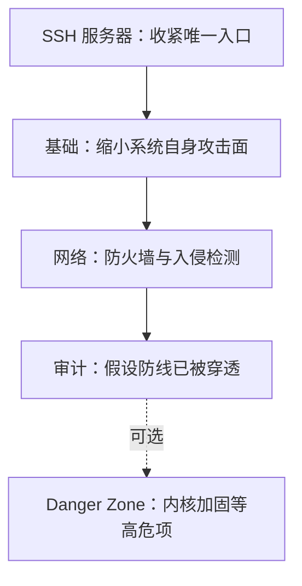

# How-To-Secure-A-Linux-Server：一份按顺序执行就能生效的 Linux 加固路线图

加固一台 Linux 服务器的知识并不稀缺，稀缺的是秩序：SSH 怎么配、防火墙怎么关、入侵检测装哪个、装完怎么验证，答案散落在几百篇文章里，口径不一，没人有时间逐一查证。**How-To-Secure-A-Linux-Server** 做的就是这件事——把散落的知识整理成一条按顺序执行的路线。它是 GitHub 上星数最高的 Linux 加固指南之一（31,755 星，2026 年 10 月数据），由 Anchal Nigam（imthenachoman）从 2019 年维护至今，CC-BY-SA-4.0 协议。

先给判断：这不是一本参考手册，而是一份跟着做完就生效的路线图。它假设你在管理一台家用 Linux 服务器，愿意逐条执行命令；它的价值在顺序和取舍，不在大而全——作者在 README 里写明：「我从未找到一个涵盖所有内容的指南——这就是我的尝试。」

读完本文，你可以：

1. 判断这份指南是否适合你的服务器场景；
2. 理解指南的四层结构，以及执行顺序为什么这样安排；
3. 知道每个安全模块解决什么问题、代价是什么；
4. 按「指南先行、CIS 兜底」的顺序规划自己的加固路径；
5. 识别指南尚未覆盖、需要另行补课的部分。

## 先看地图：四层结构，顺序即逻辑

指南正文分四层，外加一个「危险区」（Danger Zone）：



顺序不是随手排的。README 明确建议按顺序执行——「先加固 SSH，再装防火墙」，并提醒有些章节依赖前面章节完成。道理不难懂：SSH 是你唯一可靠的远程通道，先把它收紧，后面才有安全的立足点；防火墙规则配错可能把自己关在门外，那时你需要一个已经用密钥、限制过登录的 SSH 作为恢复通道。

各层覆盖的主题：

| 层 | 解决的问题 | 代表模块 |
|---|------|---------|
| SSH | 入口认证与协议收紧 | 公钥认证、AllowGroups、sshd_config、2FA |
| 基础 | 系统自身的攻击面 | sudo/su 限制、自动安全更新、密码策略 |
| 网络 | 边界防御与入侵检测 | UFW、PSAD、Fail2Ban、CrowdSec |
| 审计 | 事后发现能力 | AIDE、ClamAV、rkhunter/chkrootkit、Lynis、OSSEC |

## 指南的体例：每一节都在回答同一组问题

正文每一节遵循固定结构：Why（为什么做）、How It Works（机制）、Goals（验收目标）、Notes、References、Steps（可复制的命令）。这个体例决定了指南的正确用法：先读 Why，判断这一步对你的威胁模型是否成立；再照 Steps 执行；最后用 Goals 验收。跳过 Why 直接抄命令，等于只拿了半份指南。

两个使用前提要有数。其一，指南以 Debian 编写和测试，命令是 apt 系的，其他发行版要自行换算包管理命令。其二，代码片段力求复制即用，但 README 直说片段不校验修改是否生效，「不要不加理解地盲目复制粘贴」——用户名之类的参数必须先改。

## SSH：先把唯一的门看住

SSH 部分是全文最扎实的章节，五个步骤各有明确靶子：

- **公钥认证替代密码**。更难暴力破解，日常登录也免输密码，是后续一切收紧的前提。
- **AllowGroups 限定谁能登录**。建一个专用用户组，不在组里的账号连尝试的机会都没有。
- **sshd_config 收紧协议栈**。基线取自 Mozilla 的 OpenSSH 指南：限定 HostKey 与密钥交换算法、禁用 X11 转发和 TCP 转发、`PermitRootLogin no`。OpenSSH 9.1 及以上可以放开 `RequiredRSASize 3072`，拒绝过短的 RSA 密钥；旧版本上这行必须保持注释，否则 sshd 直接起不来。还有一个容易踩的坑：SSH 只认第一条出现的设置，重复且互相矛盾的配置不报错、只是后半句失效——指南给了 awk 一行命令检查重复项。
- **移除短 Diffie-Hellman 密钥**，堵住弱参数协商。
- **2FA/MFA**。用 `libpam-google-authenticator` 加一层 TOTP（时间型一次性密码）：密码之外再要一个 30 秒一换的 6 位数字。注意默认配置下，公钥登录不触发 TOTP；想让「公钥 + TOTP」成为强制组合，需要配置 `AuthenticationMethods`。配置里的 `nullok` 选项允许没生成密钥文件的用户跳过验证，全员注册完要记得删掉它。

改 SSH 配置前，指南反复强调一件事：**先开第二个终端会话**。这是社区在 issue #56 里补充的建议——第一个会话改挂了，第二个还连着，能救回来。

## 基础：缩小系统自身的攻击面

这一层处理的不再是「门」，而是屋里本身：限制谁能用 `sudo`、谁能 `su`，用 FireJail 给应用套沙箱，用 PAM（Linux 可插拔认证模块）强制密码复杂度。

两处安排体现了作者的取舍。一是 NTP 时间同步出现在安全指南里，初看突兀，实际是审计的前置条件——日志时间戳不准，事后对齐攻击时间线就是空谈；指南按版本分了岔：Debian 13（Trixie）起用 systemd-timesyncd，Debian 12（Bookworm）及更早用 ntp 包。二是 `unattended-upgrades` 自动安全更新一节诚实列了 Why Not：自动更新有小概率把系统更挂，要不要自动，取决于你更怕漏洞还是更怕半夜排查。

最有性格的一节是 **panic password**：借助 pam-duress 设置一个「胁迫密码」，被抢劫或胁迫时输入它，触发预设脚本销毁数据、拖垮系统。场景极端，思路却完整——安全设计可以覆盖「人被拿住」的情形。

## 网络：防火墙之外，还有 Docker 这个例外

防火墙用 UFW，简洁的 iptables 前端，默认拒绝入站、按需放行。入侵检测叠了三层，各看一段：PSAD 盯 iptables 日志，发现端口扫描；Fail2Ban 盯应用日志，封暴力破解的 IP；CrowdSec 再进一步，把本地告警汇入社区情报做协同防御。三者不互斥，按需取用。

Docker 与 UFW 单独成节，因为这是真实世界最容易踩的坑：发布端口时 Docker 直接写 iptables 的 DNAT（目标地址转换）规则，入站流量走 FORWARD 链和 Docker 链，UFW 管的 INPUT 规则根本碰不到它——`docker run --publish 8080:80 nginx` 发布的端口，`sudo ufw deny 8080/tcp` 拦不住，`ufw status` 里也看不见。指南给的安全默认值得照抄：容器之间互访用 Docker 网络内名直连，不发布端口；只对本机开放的服务显式绑定 `127.0.0.1` 和 `[::1]`；必须对外的流量放 `DOCKER-USER` 链过滤。两个附加警告：旧于 28.0 的 Docker Engine 连回环绑定都可能被同网段主机摸到，先升级再依赖它；把 Docker 的 iptables 开关一关了之不是解法，多半直接弄坏容器网络。

## 审计：假设前面的防线都被穿透

入侵检测挡的是已知模式的攻击，审计回答的是另一个问题：如果已经有人进来了，你能不能发现？

- **AIDE** 盯文件完整性，关键目录被改动即告警（WIP，仍在编写）。
- **ClamAV** 做病毒扫描（WIP）。
- **rkhunter / chkrootkit** 查 Rootkit（隐藏后门）（WIP）。
- **logwatch** 汇总日志报告，**ss** 查监听端口，**Lynis** 做整体安全审计，**OSSEC** 提供主机入侵检测。

WIP 的含义要读准：步骤存在、能跑，但内容仍在演进，采用时预期有变动。审计这条线整体是指南里最不「完工」的部分，也是它的 To Do 主要方向。

## Danger Zone：收益与风险成正比的进阶项

最后一区包括 sysctl 内核加固、GRUB 密码保护、禁用 root 登录、收紧 umask、清理孤儿软件包。共同点是改动直接碰系统底层，配错会影响可用性。作者在这一区的坦白值得整段引用——sysctl 一节的 Disclaimer 写道，他自己也不确定每项设置的全部作用，设置是从多个可信来源交叉取的，「如果你不懂在做什么、没时间排查问题，我建议别跟这一节」。这一节也因此刻意不提供复制粘贴代码，退回到手动编辑。

能走到这一区的前提，指南在开头就问过了：如果你禁用了 root 登录、给 GRUB 上了密码，被锁在外面时靠什么恢复？

## 一个完整的执行回路：sshd_config 加固

把指南的体例走一遍，看它如何把一次危险的配置修改拆成带护栏的六步：

1. 备份原文件，去掉注释行让配置可读：

```bash
sudo cp --archive /etc/ssh/sshd_config /etc/ssh/sshd_config-COPY-$(date +"%Y%m%d%H%M%S")
sudo sed -i -r -e '/^#|^$/ d' /etc/ssh/sshd_config
```

2. 按 Mozilla 基线加入或修改设置，再按需设置 `AllowGroups`、`MaxAuthTries`、`PasswordAuthentication` 这类取值因人而异的项。
3. 检查重复且矛盾的设置，这条命令应该没有输出：

```bash
awk 'NF && $1!~/^(#|HostKey)/{print $1}' /etc/ssh/sshd_config | sort | uniq -c | grep -v ' 1 '
```

4. 重启前校验语法：`sudo sshd -t`。配错了在这里报错，而不是在重启之后把所有人关在门外。
5. 重启：`sudo service ssh restart`。
6. 用 `sudo sshd -T` 确认实际生效的配置，别信自己以为写进去的东西。

每一步都对应一种真实事故：没备份则改不回去；重复设置则改了不生效；不校验就重启则直接失联。跟着走完一遍，比读十篇清单式文章更能理解这些参数为什么这么配。

## 与 CIS Benchmarks 的关系

README 的建议很直白：先过本指南，再读 CIS Benchmarks，以后者为准——「CIS 的建议会压过本指南里的任何内容」。CIS Benchmarks 是行业公认、分发行版的逐步加固清单，全面但体量惊人；这份指南的价值是提供一条平易的入门路径，让你带着已经做过的上下文去读 CIS，而不是被它劝退。

## 成熟度：哪些部分还是半成品

五节标了 WIP：AIDE、ClamAV、rkhunter、chkrootkit、随机熵池增强。To Do 清单列出了尚未覆盖的主题：Fail2Ban 自定义 jail、SELinux/AppArmor 等强制访问控制、磁盘加密、日志远程备份、CIS-CAT 评估工具、debsums 包完整性验证。

选型时把这些当作空缺，而不是已解决的问题：如果你的威胁模型里磁盘物理安全占大头，这份指南目前帮不了你。反过来，它覆盖的部分成熟度不错——主仓库最近一次推送在 2026 年 9 月，Docker 与 UFW 一节已包含针对 28.0 之前版本引擎的回环绑定警告，细节相当新。

## 谁该用，怎么用

适合直接跟：

- 管理家用 Linux 服务器的人。作者的用例就是一台桌面级机器、单网卡、家用路由器、动态 WAN IP、NAT 局域网，人经常要从陌生网络 SSH 回家。
- 想要一条有顺序、有验收目标的执行路径，而不是一堆零散技巧的人。
- Debian 系用户照做成本最低；其他发行版要自行换算包管理命令。

建议的采用顺序：

1. 动手前先过 Before You Start 一节，想清自己的威胁模型：物理接触算不算攻击面？要不要开路由器端口？被锁在外面怎么恢复？
2. 装系统时只装必需——作者自己只装 SSH——并勾选安装器的磁盘加密选项。
3. 按指南顺序执行：SSH → 基础 → 网络 → 审计，每节先读 Why 再跑 Steps。
4. 做完过一遍 CIS Benchmarks 查漏，冲突处以 CIS 为准。
5. 多台机器要批量部署，看 moltenbit 维护的 Ansible 版（270 星）。两个前提：playbook 要求先临时打开 `PermitRootLogin yes` 才能执行（指南路线本身包含禁用 root 登录这一步）；README 要求先读全部 tasks、按需改完 `variables.yml` 再执行，重跑时记得用新端口和密钥。

可以缓一缓的：

- 生产环境的多机托管——CIS Benchmarks 加专业工具链更合适，家用指南的取舍不适用于合规场景。
- 急需磁盘加密、SELinux/AppArmor 这类主题的——指南尚未覆盖。
- 只想深挖某一个工具的——指南刻意停在「开胃菜」深度，目标是吊起你自己去读文档的胃口。

## 自测题

1. **为什么改 SSH 配置前要先开第二个终端会话？**
   <details>
   <summary>查看答案</summary>
   SSH 配置改错可能导致当前会话断开后无法再登录。保留第二个已连接的会话，第一个会话出问题时还能用它修复配置（该建议来自 issue #56）。
   </details>

2. **为什么 `ufw deny 8080/tcp` 拦不住 Docker 发布的端口？**
   <details>
   <summary>查看答案</summary>
   Docker 发布端口时直接写 iptables 的 DNAT 规则，入站流量走 FORWARD 链和 Docker 链，不经过 UFW 管理的 INPUT 链；`ufw status` 也不显示 Docker 创建的规则，因此它不是主机暴露面的完整视图。
   </details>

3. **`RequiredRSASize 3072` 在旧版 OpenSSH 上直接启用会怎样？**
   <details>
   <summary>查看答案</summary>
   该选项需要 OpenSSH 9.1 及以上版本；旧版本上保持这行注释状态即可，否则 sshd 会无法启动。
   </details>

4. **指南建议如何安排它与 CIS Benchmarks 的使用顺序？**
   <details>
   <summary>查看答案</summary>
   先跟指南做完，再读 CIS Benchmarks，冲突处以 CIS 为准。指南提供平易的入门路径，CIS 提供行业级的完整基准。
   </details>

5. **哪些章节标了 WIP？这对采用决策意味着什么？**
   <details>
   <summary>查看答案</summary>
   AIDE、ClamAV、rkhunter、chkrootkit、随机熵池五节。这些步骤能跑但内容仍在演进，采用时预期变动；涉及相应主题时应另行验证最新做法。
   </details>

## 进阶路径

1. **按顺序完成指南主体**：SSH → 基础 → 网络 → 审计，每节先读 Why，用 Goals 验收。
2. **对照 CIS Benchmarks**：做完后逐项核对，补上指南未覆盖的合规要求。
3. **用 Lynis 做整体自测**：指南审计层的工具之一，可用来给加固结果打分、找漏项。
4. **多机部署走 Ansible 版**：先读全部 tasks，改好变量再执行，注意 root 登录先开后关的流程。
5. **跟踪 To Do 与上游演进**：SELinux/AppArmor、磁盘加密等主题补齐后及时回补；有更好的做法可以直接给仓库提 issue 或 PR。

## 资料口径说明

本文关键数据于 2026-10-04 对照 GitHub 核实：主仓库 imthenachoman/How-To-Secure-A-Linux-Server，31,755 星、2,144 fork，2019-02-09 创建，最近推送 2026-09-07，CC-BY-SA-4.0；Ansible 版 moltenbit/How-To-Secure-A-Linux-Server-With-Ansible，270 星，最近推送 2025-12-04。指南持续演进，章节内容、WIP 标记与 To Do 清单以最新 README 为准。

---

**延伸阅读**：[GitHub 仓库](https://github.com/imthenachoman/How-To-Secure-A-Linux-Server) · [Ansible 自动化版本](https://github.com/moltenbit/How-To-Secure-A-Linux-Server-With-Ansible) · [CIS Linux Benchmarks](https://www.cisecurity.org/cis-benchmarks/)
