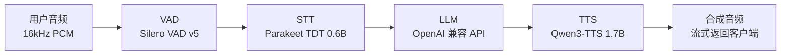

## 一条更务实的语音对话路线

语音助手过去是封闭系统：Amazon Alexa、Google Assistant、Apple Siri 各自垂直整合整条管道，用户没法替换其中任何一个环节。开源方案虽然越来越多，但在"端到端"和"模块化"之间长期摇摆——端到端模型延迟低却难调试，模块化管道可定制却组件耦合紧。

HuggingFace 开源的 [speech-to-speech](https://github.com/huggingface/speech-to-speech) 走的是一条更务实的路：**VAD → STT → LLM → TTS 四阶段流水线，每阶段独立可换，对外用 OpenAI Realtime 协议暴露**。任何现成的 OpenAI Realtime 客户端——包括已有的 WebSocket、WebRTC 应用——只要改一下服务器地址，就能把后端从 OpenAI 换成自建服务，客户端代码几乎不动。这套管道已成为数千台 [Reachy Mini 机器人](https://huggingface.co/blog/reachy-mini)的生产对话后端，不是概念验证。

## 架构总览：级联的四阶段

系统是一条由队列连接的级联管道，四个阶段各跑一个独立线程，前一个阶段把结果丢进队列喂给下一个：



- **VAD（语音活动检测）**：Silero VAD v5，判断说话边界与轮次切换。
- **STT（语音转文字）**：默认 Parakeet TDT，转写用户语音，可输出实时局部转写。
- **LLM（语言模型）**：生成回复，流式输出文本与工具调用。
- **TTS（文字转语音）**：合成语音并流式回传客户端。

每一阶段都有多个可互换实现，用 `--stt`、`--llm_backend`、`--tts` 三个参数选择。默认安装里 Parakeet TDT 做 STT，OpenAI 兼容 API 做 LLM，Qwen3-TTS 做语音输出（非 macOS 平台走 GGML 后端，Apple Silicon 走 `mlx-audio`）。选组合的自由度在于每一对都成立：你可以在本地跑 Parakeet TDT 转写，用远程 OpenAI API 做回答，再用 Qwen3-TTS 本地合成，互不影响。

## 三种运行命令，对应三种用法

项目围绕一个服务器和两个客户端命令组织，没有"四种模式"的二分法：

| 命令 | 行为 | 何时用 |
|------|------|--------|
| `serve` | 把管道作为 OpenAI Realtime 服务器跑起来（WebSocket / WebRTC） | 你正在做应用或设备，要对准 API 开发 |
| `talk --url <完整 realtime 地址>` | 跑打包好的麦克风/扬声器客户端 | 你想直接对着已有的 Realtime 服务器说话 |
| `local` | 在进程内把 `serve` 和 `talk` 组合起来（loopback） | 一个命令本地起服务并直接对话 |

`serve` 默认只绑定 `127.0.0.1`，要对外暴露需显式加 `--host 0.0.0.0`；`local` 始终走回环地址，自动在 `ws://127.0.0.1:<端口>/v1/realtime` 接上打包客户端。开发浏览器界面时也是先 `serve` 起后端，再连 [browser demo](https://github.com/huggingface/speech-to-speech/blob/main/demo/README.md) 的前端。官方 OpenAI Agents SDK 在两种传输协议上都测过，复用现有客户端生态即可。

### 三种起步配置

项目官方给出三种起步方式，区别只在 LLM 跑在哪里，STT 和 TTS 默认都本地化：

| 配置 | 硬件预算 | 有哪些数据发给第三方 |
|------|----------|----------------------|
| Apple Silicon 全本地 | Mac，建议 16 GB 起 | 无 |
| NVIDIA GPU 全本地 | Linux + CUDA GPU，约 24 GB 显存 | 无 |
| 本地语音 + 托管 LLM | 约 8 GB 可用显存/统一内存 | 转写文本、指令与对话历史；麦克风音频留在本机 |

以下内存数字是一次对话的规划估计，不是实测最低值，实际随上下文长度、音频时长与后端版本变化。首次运行都需要联网下载模型。

**Apple Silicon 全本地**（无需 API Key）：

```bash
speech-to-speech local \
    --mac-optimal-settings \
    --model_name mlx-community/Qwen3-4B-Instruct-2507-4bit
```

`--mac-optimal-settings` 预设会用 MLX 跑 Parakeet TDT，MLX LM 跑 4-bit Qwen3-4B，MLX Audio 跑 6-bit Qwen3-TTS CustomVoice，三份核心权重共约 **7.5 GB**。

**NVIDIA GPU 全本地**（无需单独 LLM 服务器与 API Key，LLM 由 Transformers 在进程内加载）：

```bash
speech-to-speech local \
    --device cuda \
    --stt parakeet-tdt \
    --llm_backend transformers \
    --model_name Qwen/Qwen3-4B-Instruct-2507 \
    --llm_torch_dtype float16 \
    --tts qwen3 \
    --qwen3_tts_backend ggml
```

单 LLM 权重就有约 **8 GB**，语音模型、缓存与依赖另计。

**本地语音 + 托管 LLM**（语音识别与合成本地跑，回复交给远端模型）：

```bash
export OPENAI_API_KEY=...
speech-to-speech local \
    --stt parakeet-tdt \
    --llm_backend responses-api \
    --tts qwen3
```

这个方案只本地下载语音模型（Apple Silicon 上核心权重约 **5.2 GB**），转写文本、指令与对话历史会发给 OpenAI，麦克风音频与语音合成留在本机。参考这个例子，把 LLM 指向别的提供方或自建服务器即可。

## 四个容易误解的概念

### VAD 不是 STT

VAD 只回答"有没有人开始说话、说到哪里算一段"，不关心说了什么。Silero VAD v5 以 512 采样点（32ms@16kHz）滑动窗口输出 0-1 的语音概率，系统靠 `--thresh` 阈值决定何时切分语音段。`--min_speech_ms` 与 `--min_silence_ms` 控制的是"多短算一段语音""多长静默算结束"，而不是识别语言或转写内容。

### STT、LLM、TTS 的选型参数名不通用

各实现都有自己专属的参数前缀，不能混用。STT 用 `--stt_model_name`、`--stt_device`、`--stt_gen_max_new_tokens` 这类；TTS 侧 Qwen3-TTS 有独立的 `--qwen3_tts_backend`。CLI 只为已选后端构建配置，未激活后端的已知参数仍被接受但忽略并警告。用 `speech-to-speech serve -h` 看默认值，或在 `-h` 前加选择器看某个组合的特有参数。

### LLM 后端分本地推理与远程 API 两类

本地推理用 `transformers`（CUDA / CPU）或 `mlx-lm`（Apple Silicon），远程用 OpenAI 兼容协议——`responses-api` 走 `/v1/responses`，`chat-completions` 走 `/v1/chat/completions`。两个远程后端共享同一组连接参数，但协议不同。选 `chat-completions` 常见的原因是：部分模型（如某些 vLLM 版本）在 Responses 协议下流式工具调用不稳定，而 Chat Completions 路径更稳。

### 语言覆盖取决于组件，不取决于管道本身

speech-to-speech 不内置"中文支持"或"多语言"开关，能说什么语言取决于你选的 STT 和 TTS。`--language` 只适用于 Whisper 系 STT，可固定 `zh` 或 `auto`；默认 Parakeet TDT 用的是 `--parakeet_tdt_language`。中文场景的推荐组合是 `--stt whisper-mlx --stt_model_name large-v3 --language zh --tts qwen3`。

## 一次对话如何流过系统

以默认配置走一遍一个完整的对话轮次：

1. 用户对着麦克风说话，音频以 16kHz、int16、单声道 PCM 进入管道。
2. **VAD 阶段**：Silero VAD 以 32ms 窗口检测。连续 384ms 检测到语音后，标记"开始说话"；停顿达到 `--min_silence_ms` 阈值后，标记"结束说话"，把音频段送入 STT 队列。
3. **STT 阶段**：Parakeet TDT 把音频转成文本，流式喂给 LLM。开启 `--enable_live_transcription` 时，客户端会收到实时局部转写事件。
4. **LLM 阶段**：模型生成回复文本，通过 `--responses_api_stream` 流式逐段送入 TTS 队列。
5. **TTS 阶段**：Qwen3-TTS 把文本逐段合成为 16kHz PCM，流式推回客户端，用户边收边播。
6. 若用户中途打断，VAD 检测到新语音，触发 `response.cancel` 事件，LLM 停止生成、TTS 停止播放，开启新一轮对话。

## 每个阶段可以选什么

表格来自官方 [Supported components](https://github.com/huggingface/speech-to-speech#supported-components)。斜体是额外安装项；其余内置。

| 阶段 | 可选实现 |
|------|----------|
| VAD | Silero VAD v5 |
| STT | Parakeet TDT（默认）、Whisper（Transformers）、*Faster Whisper*、*Lightning Whisper MLX*（macOS）、MLX Audio Whisper（macOS 内置）、Paraformer（FunASR）、Qwen3-ASR、OpenAI-compatible `/v1/audio/transcriptions` 端点、OpenAI Realtime 转写、vLLM Realtime 转写（实验性） |
| LLM | OpenAI-compatible API（`responses-api` / `chat-completions`）、Transformers、`mlx-lm`（macOS） |
| TTS | Qwen3-TTS（默认）、Kokoro-82M、*Pocket TTS*、*ChatTTS*、*OmniVoice*、MMS TTS、OpenAI-compatible `/v1/audio/speech` 端点 |

可选组件用 pip extras 安装：`speech-to-speech[kokoro]`、`[pocket]`、`[chattts]`、`[omnivoice]`、`[faster-whisper]`、`[whisper-mlx]`、`[paraformer]`、`[mlx-lm]`。注意 DeepFilterNet（VAD 的可选音频增强）要求 `numpy<2`，与要求 `numpy>=2` 的 Pocket TTS 冲突，只能在不用 Pocket TTS 时手动装。

## 三类环境下的落盘写实

Linux 上 Qwen3-TTS 的 GGML 后端来自 `faster-qwen3-tts[ggml]`，其默认 `qwentts-cpp-python` wheel 针对 CUDA 12.8 与 `manylinux_2_39`（如 Ubuntu 24.04）。CUDA 或 glibc 较旧时需要先从 Hugging Face wheelhouse 装匹配的 wheel 再装本包：

```bash
# CUDA 13.x
pip install "qwentts-cpp-python==0.3.1+cu130" \
  -f https://huggingface.co/datasets/andito/qwentts-cpp-python-wheels/tree/main/whl/cu130

# CUDA 12.4
pip install "qwentts-cpp-python==0.3.1+cu124" \
  -f https://huggingface.co/datasets/andito/qwentts-cpp-python-wheels/tree/main/whl/cu124

# CPU-only 兜底
pip install "qwentts-cpp-python==0.3.1+cpu" \
  -f https://huggingface.co/datasets/andito/qwentts-cpp-python-wheels/tree/main/whl/cpu

pip install speech-to-speech
```

要想回到旧的 CUDA-graphs 实现而非 GGML，用 `--qwen3_tts_backend torch`。若扬声器回授、合成语音时被打断，加 `--local_audio_block_mic_during_playback` 让麦克风在播放期间暂停采集（代价是无法打断助手）。

配套的打包客户端播放自带 196ms 音频缓冲（仅 OpenAI 兼容 TTS 后端），用于吸收 HTTP 语音推理的小间隙；换其他后端默认立即开播。`--playback-buffer-ms` 可覆盖该默认——值越大越抗抖动但延迟响应开头，越小越早开声但更敏感。

每次部署的 LLM 也遵循"完全本地 / 托管并存 / 免配置"三条路径：本地无 Key（Apple Silicon MLX 或 NVIDIA Transformers），托管用 OpenAI 兼容端点，需 API Key。

## 工程上值得借鉴的取舍

### 线程加队列，而不是事件驱动

每条管道是四个独立线程连接而成。相比异步事件驱动，这种写法更直白、好读、好改，代价是资源占用更高——每个管道都要一个线程池，用 `--num_pipelines` 控制并发管道数，默认值随命令而异。

### 组件可替换优先于组件最优

设计把"任意 STT + 任意 LLM + 任意 TTS 都能自由组合"放在第一位，单个环节是否压到最低延迟反而不是首要目标。所以出厂默认不一定是最低延迟组合，你完全可以用 `--stt`、`--llm_backend`、`--tts` 按需替换来优化某一环。

### OpenAI Realtime 兼容换生态，raw 模式换重量

走兼容协议能直接复用 OpenAI 客户端 SDK 与工具链，代价是协议自带开销——事件序列化、VAD 事件管理。如果客户端是自己写、只要最轻的通道，不必拘泥于这套事件模型。想要完全本地的做法是把 LLM 指到自建 vLLM / llama.cpp 服务器（参考 README 的 [Combining with llama.cpp](https://github.com/huggingface/speech-to-speech#combining-with-llamacpp)）。

## 什么时候不需要它

如果只需要语音转文字（STT）或文字转语音（TTS）之一，而不是完整的对话管道，有更轻的专用工具。如果项目要求端到端低延迟（如 GPT-5.4 语音模式），级联的串行架构不是最优解——每一跳的等待会累加到总延迟上。

## 一句总结

speech-to-speech 真正值得看的地方，是把语音对话从垂直整合拆成了可独立演进的四个模块：VAD、STT、LLM、TTS 各自升级替换组合互不影响，客户端始终通过同一套协议访问。对要在自有硬件上跑语音助手的团队，它比端到端方案灵活、比自建管道省力，代价是延迟与并发资源上要让一步。