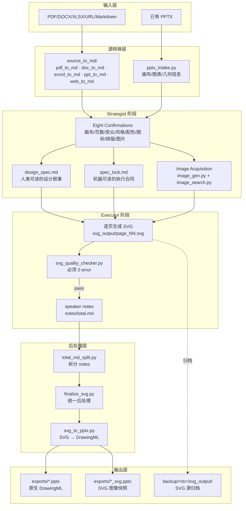
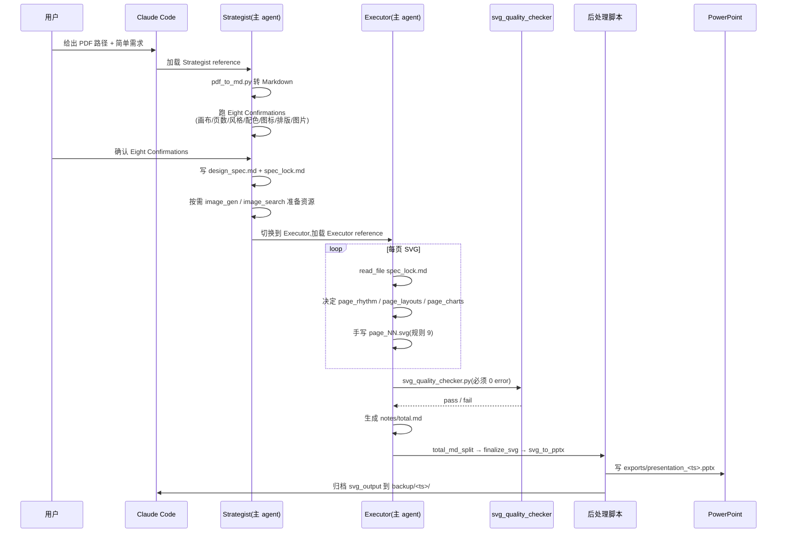

# hugohe3/ppt-master 深度拆解

`hugohe3/ppt-master` 真正解决的问题不是「让 AI 写更好的 PPT」，而是把「AI 生成 PPT」这件事从输出图片或网页截图,改造成**每一个元素都能在 PowerPoint 里逐个点击编辑的原生 DrawingML 形状**。截至 2026-06-28,仓库 33.3k stars、2.8k forks,MIT 协议,Python 实现,最新发布 v2.11.0(2026-06-20),2025-12-10 创建后不到半年就走到这个规模——核心吸引力来自一组相互锁死的工程取舍,而不是单纯的 prompt 模板。

本文围绕这条主线展开:**SVG 作为 AI 与 PowerPoint 之间的「共同语言」**——AI 容易生成、人能预览、脚本能精确转译,三者同时成立——以及围绕这条主线,设计者如何在「Strategist 角色 vs Executor 角色」「spec_lock 反漂移」「多格式画布」「原生样式 vs 自由设计」之间做出一组取舍。

## 一句话定位

- **仓库**:[hugohe3/ppt-master](https://github.com/hugohe3/ppt-master)
- **官方定位**:AI generates natively editable PPTX from any document
- **当前发布**:v2.11.0(2026-06-20),距离 v2.10.0(2026-06-14)6 天,迭代节奏稳定
- **语言**:Python(主),HTML/Vue.js(viewer.html)、SVG(中间产物)
- **License**:MIT
- **依赖入口**:`pip install -r requirements.txt`(只列了一个 `-r skills/ppt-master/requirements.txt`,实际依赖全部内嵌到 skill 内部)
- **可装形态**:Git clone ZIP / Claude Code plugin marketplace / `npx skills add hugohe3/ppt-master`

作者 Hugo He 自述是金融从业者(CPA · CPV · 投资方向咨询工程师),因为每天审阅和编辑演示稿,而市面 AI PPT 工具的输出没法在 PowerPoint 里逐元素改——所以自己写了工具。代码与文档里反复出现「a harness, not a complete agent」「a tool, not a wishing well」这两句自我定位,直接决定了下面所有架构取舍。

## 系统地图

整个工具以「Source → Strategist → Executor → Post-process → PPTX」为流水线,核心抽象是 SVG(AI 与 PowerPoint 的共同语言):



读这张图的三条主线:

- **Strategist 与 Executor 是同一进程内的两种角色模式,不是两个独立 agent**——因为页面设计强依赖上游完整上下文(Strategist 的色彩选择、实际拿到的图片资源、之前页面的视觉节奏),子 agent 拿到的永远是过期的部分快照,视觉会飘移
- **SVG 是唯一的中间格式**——AI 负责生成 SVG、人类用浏览器预览 SVG、脚本负责把 SVG 转成 DrawingML。三种角色共享同一个坐标系,使得「AI 能写、人能审、机器能转」同时成立
- **`spec_lock.md` 是反漂移机制**——长 deck(20+ 页)执行期间,LLM 上下文压缩会让颜色和字体逐渐漂移;`spec_lock.md` 强制 Executor 每生成一页前重新 `read_file` 一次,颜色字体只能来自这个文件、不能凭记忆

## SVG 作为共同语言:为什么不直接生成 DrawingML

仓库的 `docs/technical-design.md` 把这个选择讲得很直白——是「排除法」得到的。

| 候选方案 | 结论 | 原因 |
|---|---|---|
| 直接让 AI 输出 DrawingML | ❌ | DrawingML 极冗长,一个圆角矩形就需要几十行嵌套 XML;AI 的训练数据远少于 SVG;几乎无法肉眼调试 |
| HTML/CSS | ❌ | HTML 描述文档流,PowerPoint 描述画布上的绝对定位对象;两者世界模型不同。哪怕把浏览器布局引擎问题解决了,`<table>` 也无法自然映射到一组独立形状 |
| WMF/EMF | ❌ | 虽然是微软自家格式、与 DrawingML 同源,但 AI 几乎没有训练数据,这条路在 AI 生成阶段就死掉 |
| SVG 作为内嵌图片 | ❌ | 简单但摧毁了「可编辑性」——形状变像素、文字不可选、颜色不可改 |
| **SVG 作为中间矢量语言** | ✅ | 与 DrawingML 是「同一想法的两种方言」,转换是翻译,不是格式鸿沟 |

这套对应关系的语义等价是核心:

```text
SVG                          DrawingML
─────────────────────────────────────────
<path d="..."/>              <a:custGeom/>
<rect rx="..."/>             <a:prstGeom prst="roundRect"/>
<circle/> / <ellipse/>      <a:prstGeom prst="ellipse"/>
transform="translate/scale…" <a:xfrm/>
linearGradient/radialGradient <a:gradFill/>
fill-opacity/stroke-opacity  <a:alpha/>
```

这种对应让 AI 生成、人眼调试、脚本转译能在同一个像素坐标系下协同:`viewBox` 用像素而非 EMU,意味着 Strategist、Executor、quality checker、post-processing 全程都「以像素思考」,EMU 转换只在 `svg_to_pptx.py` 出口做一次。

## Strategist + Executor:同一进程内的角色切换

`SKILL.md` 第 6 条规则写得很硬:**Executor Step 6 的 SVG 生成必须由当前主 agent 端到端完成,委派给子 agent 是禁止的**;第 7 条进一步规定**Sequential Page Generation Only**——在 Executor 阶段,SVG 页面必须**逐页连续生成**,每 5 页一批的批量生成也是禁止的。

这三个决策背后是一组相关联的原因:

**为什么不并行子 agent**

页面设计依赖完整的上游上下文:Strategist 的色彩选择、实际拿到的图片资源(而非失败后被替换的)、之前页面的视觉节奏。子 agent 启动时拿到的是过期的部分快照,生成的页面会出现视觉漂移。这与「多 agent 委派更快」的直觉相反——但代价是 deck 内部一致性。

**为什么不合并成一个 mega prompt**

Strategist 跑在「与用户协商」模式(开放、对话、愿意回头);Executor 跑在「输出严格 XML」模式(无即兴、无遗漏属性)。把两种模式塞进同一份 prompt,等于让模型在同一轮里保持互不兼容的纪律——每一种 prompt-engineering 病都会出现。拆成角色专用 reference 文件,让每个角色只加载自己需要的部分。

**为什么 Eight Confirmations 是唯一的 BLOCKING 节点**

设计选择之间是耦合的(颜色影响图标库、图标库影响排版),所以一次性 8 个打包让用户做决定,而不是分散在多个阶段——分散只会让用户在不同阶段给出互相冲突的回答,导致回头改稿。

`design_spec.md` 与 `spec_lock.md` 是 Strategist 阶段的两个产物,看起来冗余但服务不同读者:

| 文件 | 服务对象 | 写什么 |
|---|---|---|
| `design_spec.md` | 人类 | 「为什么这样设计」(目标受众、风格意图、配色理由、页面大纲) |
| `spec_lock.md` | Executor(机器) | 「必须字面用什么」(HEX 颜色、字体字符串、图标库、图片资源清单与状态) |

没有 `spec_lock.md`,长 deck 每生成一页都重读 `design_spec.md`,LLM 上下文压缩会让颜色字体逐页漂移。`spec_lock.md` 是反漂移机制——`SKILL.md` 强制要求每生成一页前 `read_file <project>/spec_lock.md`,所以 20+ 页 deck 也能保持颜色字体字面一致。

`update_spec.py` 提供颜色/字体的批量传播,但拒绝做备份(依赖 git 回滚)——备份等于重复 git 的工作,会产生过期快照。

## 角色纪律:为什么不能「让 AI 一把梭」

`SKILL.md` 开头列了 10 条 Global Execution Discipline,看起来官僚,但都对应一种反复出现的失败模式:

| 规则 | 防的失败模式 |
|---|---|
| **SERIAL EXECUTION** | 跳步执行、并行执行、把上游还没完成的工作当下游输入 |
| **BLOCKING = HARD STOP** | AI 替用户做决策(Eight Confirmations 必须用户确认) |
| **NO CROSS-PHASE BUNDLING** | Strategist 阶段就开始写 SVG;Executor 阶段回去改设计稿 |
| **GATE BEFORE ENTRY** | 上游前提没满足就往下走 |
| **NO SPECULATIVE EXECUTION** | 「先预生成下一阶段内容」——LLM 默认会想做完整件事,但串行流水线要求每步输出有边界 |
| **NO SUB-AGENT SVG GENERATION** | 子 agent 上下文漂移,deck 视觉不一致 |
| **SEQUENTIAL PAGE GENERATION ONLY** | 批量生成加速了上下文压缩,视觉一致性下降比速度收益快 |
| **SPEC_LOCK RE-READ PER PAGE** | 长 deck 上下文漂移;同时打破「每页都是卡片网格」的默认 |
| **SVG MUST BE HAND-WRITTEN** | 跑 Python/Node 脚本批量生成 SVG——脚本生成无法复现「带完整上游上下文的逐页手工书写」 |
| **DETERMINISTIC ROUTING** | 用户请求违反路由前置条件时,说出前置条件并停,而不是反复问用户选择绕过规则 |

第 9 条(hand-written SVG)是反直觉的——脚本生成 SVG 看起来更「自动化」、更省 token,实际被一个 feature branch 试过又放弃:**跨页面视觉一致性依赖逐页手工书写时携带的完整上下文,生成器脚本无法重现这种上下文**。

## 图片获取:三种正交的锁定维度

Strategist 阶段决定 deck 是否含 AI 生成图片时,**同时锁定三个正交维度**:

| 维度 | 含义 | 锁定范围 |
|---|---|---|
| `rendering` | 视觉风格家族(vector-illustration / editorial / 3d-isometric / sketch-notes …) | 整 deck |
| `palette` | deck HEX 颜色怎么用——比例 + 角色 + 气质 | 整 deck |
| `type` | 每张图的内部构成(background / hero / framework / comparison …) | 每张图 |

前两个写入 `spec_lock.md`,`Image_Generator` 每张图的 prompt = 锁定的 rendering + palette + 该图的 type。如果不锁,每张图都会自带风格漂移,deck 读起来像一摞不相关的插画。这是 `spec_lock` 抗漂移机制在像素层的对偶。

`Eight Confirmations` 阶段,Strategist 至少给出 3 组候选 `rendering × palette` 组合让用户选,不静默锁定单一组合——因为这个选择影响整个 deck,而用户的口味是唯一可靠的判官。

**图片 backend 配置不走通用 `IMAGE_API_KEY`**。每个 backend 用各自专属 key(`OPENAI_API_KEY`、`GEMINI_API_KEY` 等),`IMAGE_BACKEND=<name>` 显式选择当前激活的 backend。统一 key 字段看似简洁,实际会让「多 provider 配置下当前用哪个」变成只能猜的事实,失败模式以「图片生成结果奇怪」形式浮现而无可读错误——per-provider key 让「当前用哪个 backend」变成可读的 config。

## 模板系统:opt-in 而非默认

Templates 默认不启用,Strategist 默认走「自由设计」(free design)——AI 仅从源内容出发自创视觉系统。模板是显式用户触发时才激活。

**为什么不默认匹配模板**

模板是「地板」,容易变成「天花板」——它把 deck 锁进模板的视觉语汇,无论内容是否真的想被那样表达。自由设计的版式从源内容派生结构,而不是把固定语法强加给内容,视觉节奏跟随内容呼吸。约束模式在窄场景(品牌锁定 deck、答辩、政府报告)里确实更好,所以保留,但 AI 不主动建议。

**Layouts 是 opt-in;charts 和 icons 不是**——这个不对称不是不一致,是设计:**layout** 锁定视觉语汇(地板/天花板问题),而 **charts/icons** 是可复用原语,不会强加 deck 级风格。同一个 `templates/` 目录,扮演的角色不同。

## 输出路径:两个 PPTX、一个 SVG 归档

`exports/` 下默认产出两份:

```text
exports/
├── presentation_<timestamp>.pptx          # 原生 DrawingML — 主交付物
└── presentation_<timestamp>_svg.pptx      # SVG 图像快照(可选,--svg-snapshot)
```

`backup/<timestamp>/svg_output/` 永远写入——这是 Executor 的 SVG 源归档,可以重跑 `finalize_svg → svg_to_pptx` 重建 PPTX。`update_repo.py` 用 Python 调 git 更新仓库到最新版本。

「SVG 图像快照 PPTX」(`--svg-snapshot`)是把 SVG 当图片嵌入的版本——**不可编辑**,但视觉与原 SVG 100% 一致,适合做「客户确认稿」,让客户在不改文字的前提下先看视觉。两个交付物不是冗余:**主交付物可编辑,快照交付物保真**。

图片在 `svg_output/` 阶段是外部引用(快迭代、单源替换);交付时两条路径分歧——`svg_final/` 把位图 Base64 内嵌(自包含、IDE 预览/browser/预览 pptx 都能打开,不丢依赖);原生 pptx 把位图复制进 PPTX media 目录,用 `<a:srcRect>` 表达裁剪。Base64 内嵌会让文件 3-4 倍膨胀,而 `<a:srcRect>` 是 PowerPoint 原生位图裁剪的表达方式——工具用错方向会在「可编辑性」或「文件大小」之间丢掉一个。

## 一个端到端任务怎么流过系统

任务:用户给 Claude Code 发一句「把 `projects/q3-report/sources/report.pdf` 做成 8 页 PPT,品牌色用 #1a73e8」。

执行路径:



注意几个关键时序:

- **Eight Confirmations 是唯一的 BLOCKING 节点**——之后所有非 BLOCKING 步骤可一气呵成,不需要每步等用户说「继续」
- **Executor 每写一页 SVG 前必读 `spec_lock.md`**——这是 20+ 页 deck 颜色字体不漂移的唯一保障
- **`svg_quality_checker.py` 必须 0 error 通过**——这是硬门槛,不是软建议
- **归档在 default 模式下永远写**——`backup/<ts>/svg_output/` 是「重导出」的唯一凭证,丢了这个文件就只能重跑整条流水线

## 适用边界与决策建议

`docs/technical-design.md` 开篇直接说:**The generated PPTX is a design draft, not a finished product**。读完整个仓库的设计文档,可以看到作者反复划同一道边界。

**适合**

- 内容是「已经有文字版本、需要视觉化呈现」的形态:PDF 报告、DOCX 提案、Markdown 长文、Notion 导出——你不想从空白页开始排版,想把内容「翻译」成 deck
- 设计师愿意在 PowerPoint 里做最终 10% 润色:换形状、调色、改图表——你买的是「省掉 90% 空白页工作」,不是「省掉 100%」
- 模型能用 Claude Opus(大上下文 ~1M tokens)+ gpt-image-2 跑质量上限:作者原话「harness + model = agent —— harness 拥有工作流,模型决定质量上限」
- 不强求「一次跑完直接交」:README 明确警告「This is a tool, not a wishing well」

**不适合**

- 强品牌的固定模板场景:有 corporate template,需要严格遵守——直接用 `template-fill` 工作流,跳过 SVG 流水线
- 「随便看看 AI 能做出什么」的低预期场景:模型选错(Gemini Flash / GPT-4o-mini),出来的就是「AI-default 卡片网格」,会让你觉得 harness 没用
- 「PPT 必须秒生成、不能改」的要求:这不是 PPT Master 的形态,这是 Gamma 的形态
- 完全无人介入的纯批处理流水线:项目硬要求 Eight Confirmations 必须用户确认——这是「设计判断不能由 AI 单独做」的明示
- 200+ 页的极长 deck(50 页以上):即使用了 `spec_lock.md`,20 页以上仍可能出现节奏疲劳;模型上限与上下文压缩都是硬约束

**采纳顺序**

| 阶段 | 动作 | 期望产出 |
|---|---|---|
| 第 0 天 | 装 Python + `pip install -r requirements.txt` + 装 Claude Code | 能 `python3 skills/ppt-master/scripts/project_manager.py init demo` |
| 第 1 天 | 跑 examples 目录里的 6 个官方 demo | 看懂「设计草案 → PowerPoint」的真实质量上限 |
| 第 2-3 天 | 拿自己的 PDF 试一份 5-8 页 deck | 体会 Eight Confirmations 的提问方式 |
| 第 1 周 | 试 image_gen / image_search 两条路径 | 决定配 `gpt-image-2` 还是只用 Pexels/Pixabay |
| 第 2 周 | 试 template-fill + beautify 两个工作流 | 学会「在自己已有 deck 上跑流水线」 |
| 第 1 月 | 写自己的 brand preset + layout template | 形成团队可复用的视觉系统 |

不建议跳步的:第 0 天就直接拿正式 deck 试——Eight Confirmations 还没摸熟,容易在错误的设计选择上浪费时间。

## 模型选择与成本边界

作者给的优先级很明确:**Claude Opus + gpt-image-2 是上限**;**Gemini 3.5 Flash 是当前的性价比甜点**;GPT / Kimi 可以跑但质量档次不同。`README.md` 的原话是「expecting top-tier output while paying the lowest possible cost was never reasonable to begin with」。

这条边界背后的逻辑:PowerPoint 视觉质量的瓶颈在「模型能在长上下文里维持视觉一致性 + 写出结构正确的 SVG」,前者吃上下文窗口,后者吃代码生成能力——两者都是 Claude Opus 这一档的优势。Gemini 3.5 Flash 性价比好但 token 预算紧,长 deck 会更早出现漂移。

仓库的赞助商(PackyCode、APIKEY.FUN、RunAPI、YouYun ZhiSuan)都是 API 中转/拼车服务,官方价格 7-10% 折——说明目标用户主要是「想用 Claude/GPT 但不想订月费的人」。相关工具 [cc-switch](https://github.com/farion1231/cc-switch) 提供多 provider 一键切换,适合「手上同时有多家中转 key」的场景。

## 结尾判断

回到开头的 thesis:`hugohe3/ppt-master` 的工程价值是把「AI 生成 PPT」从「输出图片」改造成「输出原生 DrawingML」——把不可编辑的失败模式,替换成可点击、可改字、可换色、可重排的真实 PowerPoint 对象。它为此付出了一个清晰的代价:必须用 SVG 作为 AI 与 PowerPoint 之间的共同语言,必须把流水线拆成 Strategist+Executor 双角色,必须用 `spec_lock.md` 抗漂移,必须逐页手写 SVG 而不能用脚本批量生成。

这套取舍不是「最优方案」——它是**作者愿意接受的所有约束条件下**,让「AI 输出在 PowerPoint 里可逐元素编辑」这件事工程上能跑通的方案。

如果你正面对「AI 生成的 PPT 没法改、不可控、不能成为正式交付」的痛点,这个仓库是 2026 年值得认真读 `docs/technical-design.md` 的开源项目之一。如果你只是要 Gamma 那种「几秒钟出一份能看的 deck」,它大概率不是你的菜。

仓库地址:[github.com/hugohe3/ppt-master](https://github.com/hugohe3/ppt-master),作者主页:[hehugo.com](https://www.hehugo.com/)。已发表的相关解读:[PPT Master 入门到上手](/posts/tech/ppt-master/) 侧重「快速上手与能力地图」,本文侧重「为什么这样设计、为什么不做别的」。
