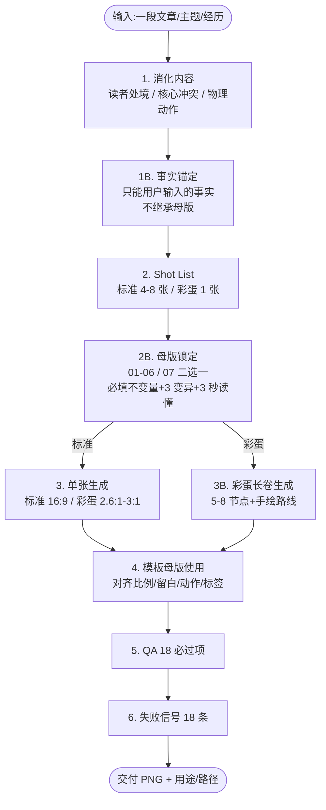

## 这套 Skill 把"AI 配图碰运气"变成了"按规则可控"

中文内容创作者最常见的配图困局不是"画得不好看",而是**每次重新画、每次重新失手**。你给 AI 一段"打工人被消息淹没"的描述,它可能给你 PPT 信息图,可能给你赛博风,可能给你商务插画,可能给你 emoji 拼贴——风格漂移、构图失真、人物不像、内容和画面脱节,每张图都像开盲盒。

[helloianneo/ian-xiaohei-scenes](https://github.com/helloianneo/ian-xiaohei-scenes)(以下简称 ian-xiaohei-scenes 2.0)是 Ian (伊恩) 在 2026-06-04 发布的 Codex Skill,MIT 协议。它做的事情很聚焦:把"小黑 IP + 真实物件 + 物理动作"做成了**一套可学习、可防御、可复用的中文章节配图视觉语言**。

这套 Skill 的价值不在"小黑这个 IP 画得可爱",而在于它把"AI 配图"从"碰运气"工程化成了"按规则可控"。读完它的 SKILL.md 和 7 个 references,我看到的不是 7 张示例图,而是 4 个不变量 + 3 个变异规则 + 1 个事实锚定 + 18 项 QA 必过项 + 18 项失败信号的完整防御体系。

先给结论,再展开:

- **2.0 不是 1.0 的升级**,是补 1.0 没覆盖的"处境/情绪/项目故事"配图能力。
- **7 张母版是质量锚点,不是模板**。每张图必须锁定母版、写 3 个变异点、3 秒读懂。
- **小黑必须承担核心物理动作**——删掉小黑画面仍然成立,说明小黑太装饰了,生成失败。
- **1B 事实锚定**是 2.0 最容易被忽略的护栏:不能从母版继承"个人经历/品牌名/数字"。
- **彩蛋长卷模式**是一套独立的长卷故事图系统(2.6:1 ~ 3:1),不是 16:9 的拉伸。

## 总览地图:8 阶段工作流 + 7 张母版作用域

把 2.0 的工作流画成一张图,读者可以一眼看到 AI 是怎么按 8 个阶段把"一段文章"变成"一张可控配图"的。



**7 张母版的作用域**(标准模式 01-06 / 彩蛋模式 07):

| 母版 | 名字 | 抽象骨架 | 适配内容 |
|---|---|---|---|
| 01 | `meeting-pull-in` | 多请求从一侧施加拉力,小黑被拉向工作入口 | 会议、同步、对齐、下班被叫回 |
| 02 | `message-overload` | 一个真实物件作涌出口,小黑挡/接/推回 | 消息过载、任务涌出、催促 |
| 03 | `production-alert` | 一根打结线缆困住小黑 | 报警、bug、回滚、返工 |
| 04 | `code-review-rework` | 放大镜/印章/夹板下的小黑 | 审查、校对、兜底、返工检查 |
| 05 | `ai-automation-badge` | 工牌/标签/贴纸被重命名 | AI 自动化、岗位重组、身份变化 |
| 06 | `ai-resume-filter` | 筛子/简历纸被推向筛子 | 简历筛选、关键词过滤、机会流失 |
| 07 | `long-scroll-story-master` | 长卷+5-8 物件节点+手绘路线+左起右收 | 个人经历、项目复盘、产品演化、成长路径 |

注意 07 是**彩蛋模式唯一核心母版**——它和 01-06 不是同一类东西。01-06 是单画面,07 是连续长卷。生成时必须二选一锁定,不能混用。

## 4 个不变量:为什么这套图"一眼就懂"

2.0 的视觉语言看似简单,实际上靠 4 个不变量撑起来。这 4 个不变量是"母版为什么长那样"的根因,也是"新图怎么长成同族"的判断标准。

### 不变量 1:母版是质量锚点,不是模板

这是 2.0 整套机制最反直觉的设计。仓库的 7 张母版放在 `assets/examples/` 下,作者明确写:"它们不是死板模板,也不是物件排除规则。"

如果模型把母版当"可描摹模板"用,会立刻出两个反模式:

- **元素清单化**:把"会议"相关所有名词都画进去——电脑、消息、文件、咖啡、人脸,堆成一锅。
- **母版复刻化**:照搬"左卡片 + 中间小黑 + 右电脑"的拓扑,只换字不换骨架。

2.0 的解法是**双重锁定**:

```text
保留不变量:比例克制 / 留白 / 真实物件质感 / 小黑参与核心动作 / 标签少而准
必须变异:主物件 / 空间方向 / 动作关系 / 道具组合 / 标签位置 / 视角 / 叙事重心
→ 至少 3 项必须和母版不同
```

**判断句**:候选图第一眼像母版换皮,即失败。

这个机制在 AI 写作工具里很罕见——大多数工具(无论是 ChatGPT 还是 Notion AI)都是"按 prompt 走"的路子,2.0 是"先选母版、再写不变量、再写变异点"的三段式工程化流程。

### 不变量 2:小黑必须承担核心物理动作

这是 2.0 最有 IP 感的设计。小黑不是装饰品,是**叙事承重结构**。

合格的物理动作清单(来自 `xiaohei-ip.md`):

- 被会议卡片拉进电脑
- 拿纸板挡消息纸条
- 解开报警线缆的结
- 在放大镜下改稿
- 拉住被贴"自动化"的工牌
- 把简历纸推向筛子
- 被下班线缆拽回
- 把素材塞进机器或从物件里取出

**判断标准**:

```text
如果删掉小黑,隐喻还完全成立,说明小黑失败。
```

这一条规则直接淘汰了一批"小黑站在角落看主物件"的图。在生成后 QA 阶段,这一条是必过的硬指标。

### 不变量 3:真实物件要"读者身边能买到"

物件必须和读者经验相连。`object-patterns.md` 明确列出"好物件":

- 电脑、手机、键盘、线缆、工牌、放大镜、筛子、印章、便签、长尾夹、沙漏、咖啡杯、台灯、秤、纸堆、文件夹

也明确禁止"为高级而找陌生物件"。**物件越日常,荒诞动作越容易成立**。

这一条和 ARS 的 Stage 2.5 Integrity Gate 中的 M6 "方法论伪造"思路一致——如果画面用了"超现实物件"承载隐喻,读者会下意识觉得"这不是我的处境"。

### 不变量 4:3 秒读懂

每张图生成前必须写"3 秒读懂句":读者不看说明也能说出"小黑正在被什么困住/挡住/拉扯/审查/筛掉"。

如果隐喻需要解释背景才能看懂,直接判失败——必须简化或换物理动作。

**3 秒读不懂的常见原因**:

- 抽象概念没变成物理动作(画"焦虑"而不是画"纸条飞出来")
- 物件过密,信息密度超载
- 视角/方向不明确,读者不知道谁在做什么
- 标签文字太多,变成阅读题不是看图

## 1.0 vs 2.0:手绘解释图 vs 真实物件场景

仓库 README 的对照表写得很直接:

| 版本 | 视觉核心 | 适合内容 |
|---|---|---|
| 1.0 Illustrations | 纯白手绘解释图 | 方法论、流程、结构、认知拆解 |
| 2.0 Scenes | 真实物件小现场 | 用户处境、工作压力、AI 时代状态、项目复盘、个人经历 |

**1.0 的优势**:拆观点、拆流程、拆方法,结构清晰,适合"教"的场景。
**1.0 的短板**:表达"情绪/处境/项目故事"时,手绘风格容易显得"轻飘飘"。

**2.0 的优势**:用真实物件承载"读者身边能买到"的具象感,3 秒就能形成共鸣。
**2.0 的短板**:不适合需要精确流程或步骤分解的内容。

**实操选法**:

- 文章是方法论/技术拆解 → 1.0
- 文章是个人经历/项目复盘/AI 时代焦虑 → 2.0
- 文章混合 → 拆段配:方法段用 1.0,处境段用 2.0

Ian 还有一个配套仓库 [ian-handdrawn-ppt](https://github.com/helloianneo/ian-handdrawn-ppt) 做手绘 PPT 风格,三件套(1.0 + 2.0 + PPT)基本覆盖中文章节配图 + 长卷故事 + 演讲页的所有场景。

## 任务流案例:把 text-matrix 风格文章配图

光说不练假把式。拿一段真实文章片段走一遍 8 阶段流程,看 2.0 怎么把"AI 时代创作者焦虑"变成"一张 3 秒读懂的配图"。

**输入文章片段**:

> 凌晨两点,改完了第 7 版标题,自动推送的稿件又被退回,理由是"风格不稳"。你打开数据后台:阅读量比上周高 23%,但涨粉数是负的。AI 工具的对话框里还亮着 14 条未读消息,标题生成器在自动跑第 5 轮。

**第 1 步:消化内容**

- 读者处境:AI 时代创作者,内容生产自动化但效果不稳定,人被困在工具链里。
- 核心冲突:AI 工具对话框 + 自动推送的稿件 + 14 条未读 = 人被工具包围/打回。
- 物理动作:**被困在多个自动工具里**。
- 短标签候选:再改改 / 风格不稳 / 自动跑 / 待回

**第 1B 步:事实锚定**

- 文章里出现的"凌晨两点""第 7 版标题""阅读量比上周高 23%""14 条未读"——这些是文章里写的事实,**只能用文章里给的数字**。
- 母版里可能出现的"Dribbble""Twitter""粉丝数"——**不能从母版继承**。
- 不能凭空添加"小红书""公众号"等文章里没提到的具体平台。

**第 2 步:Shot List**

- 锁定母版:`02-message-overload`(消息/任务涌出)或 `03-production-alert`(报警/返工)。两版都适合,选 02,因为重点是"消息"不是"报警"。
- 主题:创作者被 AI 工具对话框包围
- 物理动作:小黑被自动弹出的消息纸条包围,正在用纸板挡
- 真实主物件:不是手机!母版用的是手机,2.0 规则要求 3 个变异,所以改成"AI 对话框窗口"或"自动跑的消息纸条箱"
- 小黑动作:双手举起纸板挡,身体被压扁
- 短标签:"再改改""风格不稳""自动跑""待回"

**第 2B 步:母版锁定**

```text
母版:02-message-overload
抽取的不变量:中等覆盖面积、留白大、小黑参与动作、彩色点缀少而精
当前内容的变异点:
  1. 主物件:从手机 → AI 对话框窗口(纸条从窗口涌出)
  2. 空间方向:纸条从上方压下,不是从侧面
  3. 标签位置:贴在纸板上,不贴在纸条上
3 秒读懂句:小黑在 AI 工具对话框涌出的纸条里,举着纸板挡。
当前内容适配:创作者被 AI 工具消息淹没,纸板代表"还在手动控制"。
要避免的失败信号:不要画成"小黑站在手机旁看消息",要画"小黑被纸条压着"。
```

**第 3 步:写提示词**

按 `prompt-template.md` 模板,填入:

```text
Generate one standalone 16:9 horizontal Chinese article illustration in Xiaohei Scenes 2.0 style.

Template master lock:
Use assets/examples/02-message-overload.png as a quality anchor, not a layout to copy.
Extract invariants: medium coverage / large whitespace / Xiaohei physically involved / sparse color accents.
Required mutations:
  1. Main object: AI chat dialog window, not phone
  2. Spatial direction: paper strips pressing down from above, not from side
  3. Label position: labels on the paper board Xiaohei holds, not on strips
Do not reproduce the master image's exact spatial topology.

3-second readability:
Xiaohei is being pressed by paper strips bursting out of an AI chat window, holding up a paper board to block them.

[其余字段:背景纯白 #FFFFFF、真实物件、小黑动作、3 个中文短标签、彩色点缀、负面约束]
```

**第 4 步:QA 18 必过项 + 18 失败信号检查**

- 候选图第一眼像母版换皮? ✗ 已避免(主物件换成 AI 窗口)
- 删掉小黑画面塌不塌? ✗ 塌(纸条压下来,小黑必须挡)
- 3 秒读得懂吗? ✗ 读得懂
- 中文标签准确吗? ✗ 准确(再改改/风格不稳/自动跑)
- 背景是纯白 #FFFFFF 吗? ✗ 是
- 有没有元素清单化? ✗ 没有(只有 AI 窗口+纸条+纸板+小黑)

通过 → 交付。

## 1B 事实锚定:自动化配图最隐蔽的护栏

`SKILL.md` 第 1B 阶段单独列出"事实锚定",这是 2.0 最容易被忽略的护栏:

```text
涉及个人经历、品牌名、公司名、项目名、粉丝数、时间跨度、成绩数字时,
只能使用用户输入、用户提供素材或用户明确确认的事实。
- 用户没有提供的事实,不要从母版继承,也不要补成看起来更完整的履历。
- 无法确认的内容,用概括性标签替代,例如"内容平台""项目节点""用户反馈""产品实验"。
- 如果用户要求保留但信息不完整,在 shot list 或交付说明里标注"待确认"。
```

**为什么这一条很关键**?

母版 `07-long-scroll-story-master.png` 是 Ian 自己的个人经历长卷(里面有 Dribbble、Muzli、Twitter/X、IBC 等具体内容)。如果不加 1B 锚定,模型会**自然地把 Ian 的事实继承到用户的长卷里**——做出来的不是用户的经历图,是 Ian 的克隆图。

这和 2026 年 5 月 [Zhao et al.](https://arxiv.org/abs/2605.07723) 报告的 **"146,932 条幻觉引用"** 是同构问题:

- 引用幻觉:用一篇不存在的论文 / 错配的引用源
- 事实继承:用母版的"履历/品牌/数字"补全用户没说的部分

两者都是**"模型用自己生成的内容填补用户没说的部分"**。ARS 用 v3.7.3 三层定位符 + v3.8 逐条审计解决这个问题,2.0 用 1B 事实锚定解决——**机制不同,根因相同**。

## 18 项失败信号:为什么 QA 清单是必要防御

`qa-checklist.md` 列了 18 个失败信号,每个都对应一个具体的反模式。摘录几个最容易被忽视的:

| 失败信号 | 原因 | 修复方向 |
|---|---|---|
| 主体过大,像商品大图 | 物件占比 > 64% 画宽 | 缩小物件,增加留白 |
| 元素清单化 | 把主题所有名词都画进去 | 删到 1 个核心动作 + 1 个主物件 |
| 母版复刻化 | 构图/物件/动作像母版换字 | 至少 3 个变异点 |
| 读不懂 | 需要解释才知道画面在说什么 | 简化物理动作,或换物件 |
| 小黑变吉祥物 | 出现大眼/笑脸/复杂五官 | 回到"黑豆/软胶囊"基础形态 |
| 标签太多 | 中文标签 > 4 个 | 删到 3 个,优先 2 个 |
| 像 PPT 流程图 | 出现流程图元素/编号/箭头 | 退回到"无编号、靠空间叙事" |
| 彩蛋模式节点等距 | 路线像规律正弦波 | 改成"手画的不规律节奏" |

**这套 QA 体系是 2.0 真正的护城河**——大多数 AI 配图工具的失败不是"画得不好",而是"不知道自己画得不好"。2.0 把"知道自己画得不好"做成了 18 个可勾选的清单。

## 与 ARS / cn-doc-writer 的失败防御对比

把 2.0 的失败防御和 ARS、cn-doc-writer 放一起看,可以发现一条贯穿的工程化原则。

| 工具 | 防御目标 | 防御机制 | 失败模式 |
|---|---|---|---|
| ARS (academic-research-skills) | AI 写论文的 7 类失败 | Stage 2.5/4.5 Integrity Gate + 引用审计 | M1-M7:实现 bug/引用幻觉/结果幻觉/捷径/bug-as-insight/方法论伪造/帧锁定 |
| cn-doc-writer | 中文技术文档 5 维质量 | 五维评分(结构 20/准确 25/可读 25/教学 20/实用 10) | 模板腔/术语漂移/AI 味/抽象套话/缺任务流案例 |
| ian-xiaohei-scenes 2.0 | AI 配图的可控性 | 母版锁定 + 3 变异 + 3 秒读懂 + 1B 锚定 + 18 QA | 元素清单化/母版复刻化/小黑装饰化/事实漂移/PPT 化 |

**贯穿原则**:**把"AI 自动化输出"从"碰运气"变成"按规则可拦截"**。每套工具都给出了具体的、可勾选的失败清单——不是"用 AI 自审",而是"用人类定义的硬指标卡住"。

## 实战价值:给 text-matrix 装上视觉语言

我自己用 cn-doc-writer 写技术文章,文章里**几乎没有配图**——`text-matrix` 的视觉风格一直是"纯文字 + 截图"。

装上 ian-xiaohei-scenes 2.0 之后,可以补齐三类文章的视觉语言:

| text-matrix 文章类型 | 适配 Skill | 配图作用 |
|---|---|---|
| 方法论/技术拆解类(如本次 2.0 解读) | 1.0 Illustrations | 拆流程、拆机制 |
| 项目复盘/AI 时代处境类 | 2.0 标准模式 | 处境配图、情绪共鸣 |
| 个人经历/成长路径类 | 2.0 彩蛋长卷 | 长卷故事图,左起右收 |

**配套工作流**(在 cn-doc-writer 之外,新增 cn-doc-visual 角色):

1. 写完文章初稿后,识别"适合配图的 4-8 个段落"。
2. 对每段提炼"读者处境 + 物理动作 + 真实物件"(对应 SKILL.md 第 1 步)。
3. 调用 2.0 Skill 生成 shot list(标准 4-8 张),锁定母版。
4. 生成图后跑 QA 18 项 + 失败信号 18 项。
5. 在文章里嵌入图,标注 `fig:xxx`。

这套工作流不替代文字,只补"段落级视觉锚点"——让长文读起来不那么累。

## 决策建议:谁该装什么

按"个人 / 团队 / 机构"三层给推荐。

### 内容创作者 / 一人公司

1. **优先装 2.0**——补"处境/情绪/项目故事"配图能力,这部分最稀缺。
2. **1.0 作为备选**——只有写"方法论/流程/技术拆解"长文时才用。
3. **可选:handdrawn-ppt**——做演讲/分享页时三件套配齐。

**不要做**:上来就 1.0 + 2.0 + PPT 全装,先从一个 Skill 跑通完整工作流。

### 5-20 人内容团队

1. **三件套都装**(1.0 + 2.0 + PPT),但**指定一个"视觉语言官"**。
2. **维护一份"母版选型表"**——把团队常用的内容类型和母版对应关系写死,降低新人上手成本。
3. **建立内部 18 项 QA 巡检**——每张对外发布的图必须过 QA。
4. **事实锚定 SOP**——任何含个人经历/品牌名/数字的图,必须经事实人复核。

### 机构级 / 高校 / 媒体

1. **以 2.0 + 1.0 为基线**,建立内容生产工具链。
2. **彩蛋长卷模式慎用**——长卷故事图含个人经历/品牌/数字,事实锚定失败率最高。
3. **定期审查母版库的更新**——Ian 这种小型独立维护者,母版库会随版本演进而变,机构需要跟踪。

## 边界:2.0 不覆盖什么

边界比赞美重要。

**不适合 2.0 的场景**:

- 商业 KV / 品牌海报 / 精致扁平插画
- 传统流程图 / 复杂架构图 / 课程课件
- 聊天 UI / App 截图 / 仪表盘截图
- 大段正文塞进一张图
- 需要严格可编辑矢量源文件

**AI 图像模型的硬限制**:

- **中文错字**——AI 图像模型经常在中文标签上出错,生成后必须逐字检查。SKILL.md 明确说:"如果中文错字严重,优先减少标注词并重生成。"
- **风格漂移**——同一条 prompt 跑多次,出来的图风格可能差异很大。建议每个母版跑 3-4 张候选,选最贴近母版的。
- **复杂场景**——5+ 物件的图,模型容易丢物件或合并物件。建议单图不超过 5 个物件。

**事实锚定边界**:任何用 2.0 生成的含"个人/品牌/数字"的图,必须人工复核事实——AI 不能替这件事。

## 结尾:中文内容创作的下一道分水岭

ian-xiaohei-scenes 2.0 解决的问题,不是"AI 配图变好看了",而是把"AI 配图"从"碰运气"工程化成了"按规则可拦截"——具体的拦截机制是 4 不变量 + 3 变异 + 1B 锚定 + 18 QA 项 + 18 失败信号。

4 个不变量(母版锚点、小黑承重、真实物件、3 秒读懂)+ 3 个变异规则(主物件/空间/动作)+ 1B 事实锚定 + 18 项 QA 必过项 + 18 项失败信号——这套防御体系,把"中文内容创作者的视觉语言"从"凭感觉"变成了"可教学"。

下次你再看到一个号称"AI 配图工具"的产品,问三个问题:

1. 它有没有"母版锁定 + 变异"机制?(没有 = 全靠 prompt 碰运气)
2. 它有没有"QA 失败清单"?(没有 = 你不知道它哪里会失败)
3. 它有没有"事实锚定"机制?(没有 = 会用母版的个人经历/品牌/数字补全你的内容)

能答上三个问题的工具值得花时间试;答不上的,先用着 Ian 的 Skill 跑通工作流。

(完)
