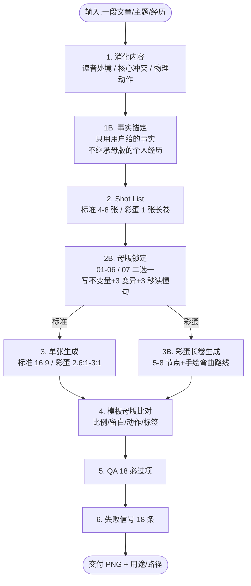

## 这套 Skill 解决的不是"画得不好看",而是"每次都长得不一样"

中文内容创作者碰到的配图问题,十有八九不是模型能力,而是**一致性**。同一个黑色小人在第二十张图里已经被画成了大眼睛吉祥物,跟第一张完全不像;昨天画的"打工人被消息淹没"和今天画的"打工人被任务打回",构图、物件、小黑姿态几乎雷同,读者根本分不清。问题出在 prompt 是临时写的、模型是盲发的、母版是隐性的。

[helloianneo/ian-xiaohei-scenes](https://github.com/helloianneo/ian-xiaohei-scenes)(以下简称 2.0)是 Ian(伊恩)在 2026-06-04 发布的 Codex Skill,MIT 协议,18KB 的 SKILL.md 配 7 份 reference、7 张模板母版图。它干的事很窄:**为中文文章生成"小黑 + 真实物件 + 物理动作"的小场景配图**。窄到什么程度?——它不做商业海报、不做流程图、不做聊天 UI 截图、不做信息图,只做一种"白底真实物件小现场"。

它真正值得拆解的,是背后这套结构化工作流:7 张母版的质量锚定 + 4 个不变量 + 至少 3 个变异点 + 1B 事实锚定 + 18 项 QA + 18 项失败信号。读完之后,你会发现 Ian 解决的与其说是"AI 配图",不如说是**怎么把 AI 自动化输出,变成可拦截、可复盘、可教学的工程化动作**——这条思路和 ARS(学术诚信闸门)、cn-doc-writer(五维评分)是同构的。

读完本文你能拿到的东西:

- 2.0 和 1.0 的本质差异(不只是"手绘 vs 实物")
- 7 张母版各自适配什么内容、有什么禁区、母版锁定字段怎么写
- 1B 事实锚定为什么是 2.0 最隐蔽的护栏
- 一段真实文章片段走完整 8 阶段工作流的样例
- 18 项失败信号里最容易忽视的 5 项
- 给现有 text-matrix 类型文章接入视觉语言的迁移路径

## 一张图先看全局:8 阶段、7 母版、两种模式



两个关键分支:**标准模式(01-06)做 16:9 单图,彩蛋模式(07)做 2.6:1-3:1 长卷**。标准模式与彩蛋模式锁定的母版不同、提示词模板不同、QA 关注点不同,不能混用。

## 4 个不变量:为什么这套图"看一眼就懂"

这 4 个不变量是 2.0 整套机制的根因,也是新图能不能"长成同族"的判断标准。任何一个被破坏,出来的图就开始"漂"。

### 不变量 1:母版是质量锚点,不是可描摹的构图

仓库 7 张母版放在 `assets/examples/` 下,作者在 `master-selection.md` 里把话说得很死——它们**不是模板,也不是物件排除规则**。如果模型把母版当成"可描摹的版式",立刻出两个反模式:**元素清单化**(把"会议"相关的电脑、消息、文件、咖啡、人脸全部堆进去)与**母版复刻化**(照搬"左卡片 + 中间小黑 + 右电脑"的拓扑,只换字)。

2.0 的解法是**双重锁定**——保留 5 项不变量(比例克制、留白、真实物件质感、小黑参与核心动作、标签少而准),强制要求至少 3 项变异(主物件类别、空间方向、动作关系、道具组合、标签位置、视角、叙事重心)。第一眼像母版换皮的图,直接判失败。

这条规则的反直觉在于:**给模型看母版,反而是为了不让它照抄母版**。它约束的是"用母版判断质量",而不是"用母版抄构图"。

### 不变量 2:小黑必须承担核心物理动作

小黑不是装饰,是**叙事承重结构**。`xiaohei-ip.md` 给的判断标准只有一句话:**删掉小黑,隐喻还完全成立,说明小黑失败。**

合格动作包括:被会议卡片拉进电脑、拿纸板挡消息纸条、解开报警线缆的结、在放大镜下改稿、拉住被贴"自动化"的工牌、把简历纸推向筛子、被下班线缆拽回、把素材塞进机器或从物件里取出。

这条规则直接淘汰了一批"小黑站在角落看主物件"的图。它的 2.0 形体弹性也比 1.0 大:可以比 1.0 稍胖一点(更有生活感)、被压扁时变扁、被拉扯时变瘦、钻进物件时只露半个黑影——但识别必须稳定:**黑豆身、白点眼、细胳膊细腿、空白表情、轮廓略不规则**。

### 不变量 3:真实物件要"读者身边能买到"

物件和读者经验相连,荒诞动作才有"这说的就是我"的共鸣。`object-patterns.md` 列出的好物件:电脑、手机、键盘、线缆、工牌、放大镜、筛子、印章、便签、长尾夹、沙漏、咖啡杯、台灯、秤、纸堆、文件夹。

这条规则和 ARS Stage 2.5 Integrity Gate 的 M6 "方法论伪造"是同一类思考:用超现实物件承载隐喻,读者会下意识觉得"这不是我的处境"。**越日常的物件,越能撑住荒诞的动作**。

### 不变量 4:3 秒读懂

生成前必须写"3 秒读懂句":读者不看任何说明,也能说出"小黑正在被什么困住 / 挡住 / 拉扯 / 审查 / 筛掉"。

`story-extraction.md` 给的五步提炼法可以套用:**找读者处境 → 找核心冲突(谁被什么以什么方式推向什么结果)→ 把抽象词变成物理动作 → 找真实物件 → 写短标签**。短标签要从真实语境来,不是从概念总结来——优先"对齐一下""马上回""再催一下""谁改的""小问题""AI 先做""人呢",避免"提升协作效率""信息过载管理""多维度能力升级"。

3 秒读不懂的常见原因:抽象概念没变成物理动作(画"焦虑"而不是画"纸条飞出来")、物件过密信息密度超载、视角/方向不明确读者不知道谁在做什么、标签文字太多变成阅读题。

## 7 张母版:各自适配什么内容、有什么禁区

| 母版 | 名字 | 抽象骨架 | 适配内容 | 必须避开的反模式 |
|---|---|---|---|---|
| 01 | `meeting-pull-in` | 多请求从一侧施加拉力,小黑被拉向工作入口 | 会议、同步、对齐、下班前被叫回 | 直接复刻"左卡片 + 中间小黑 + 右电脑"拓扑;电脑过大变商品图;线条变蜘蛛网 |
| 02 | `message-overload` | 一个真实物件作涌出口,小黑挡/接/推回 | 消息过载、任务涌出、催促、已读≠完成 | 复刻"左侧手机 + 中间纸条 + 右侧小黑挡板 + 沙漏";内容不是手机经验却硬塞手机;出现聊天 UI |
| 03 | `production-alert` | 一根打结线缆困住小黑 | 报警、bug、回滚、返工、边界情况、下班失败被拽回 | 复刻"横穿线缆 + 中央结 + 右侧小黑";线缆变装饰曲线与小黑无力学关系;配件过多冲淡"打结" |
| 04 | `code-review-rework` | 放大镜/印章/夹板下的小黑 | 审查、校对、复核、验收、谁来兜底 | 复刻"中央纸堆 + 大放大镜 + 右侧红印章";放大镜太大变物件特写;纸堆太满像办公素材拼贴 |
| 05 | `ai-automation-badge` | 工牌/标签/贴纸被重命名 | AI 自动化、岗位重组、身份变化 | 复刻"左小黑 + 中工牌 + 右修正带";做成 AI 工具广告;写太多"自动化/岗位/重组"概念词 |
| 06 | `ai-resume-filter` | 筛子/简历纸被推向筛子 | 简历筛选、关键词过滤、机会流失 | 复刻"中央筛子 + 下方纸堆 + 左侧小黑递纸";筛子外又加多个主物件;画成流程图 |
| 07 | `long-scroll-story-master` | 长卷+5-8 物件节点+手绘弯曲路线+左起右收 | 个人经历、项目复盘、产品演化、成长路径 | 节点等距像正弦波;用便利贴/卡片承载文字;复刻 Ian 的 Dribbble/Muzli/IBC 等具体内容 |

07 和 01-06 **不是同一类东西**:01-06 是单画面单物理动作,07 是连续长卷故事线。生成时必须二选一锁定,不能混用。

## 母版选型决策树:从内容类型到母版编号

```text
内容是"个人经历/项目复盘/产品演化/成长路径"?
  → 是 → 彩蛋模式,锁定 07

内容是"单点处境/瞬间压力/AI 时代状态"?
  → 进入标准模式 ↓

处境核心冲突是什么?
  → 被拉、被拽、被同步拉回 → 01
  → 消息涌出、任务过载、已读≠完成 → 02
  → 报警、bug、打结、回滚、下班被叫回 → 03
  → 审查、校对、复核、兜底、谁改的 → 04
  → 身份被重命名、岗位重组、自动化牵引 → 05
  → 简历/关键词/筛选/过滤/机会流失 → 06
```

如果当前内容不完全匹配任何母版,`master-selection.md` 给的兜底是:**选最接近的一张作为比例与信息密度标尺,然后重写物件、动作和标签**。但要注意:如果主物件和母版相同,空间关系和小黑动作必须明显不同;如果空间关系和母版相近,主物件、动作和配件必须明显不同。

## 1.0 vs 2.0:手绘解释图 vs 真实物件场景

| 版本 | 视觉核心 | 适合内容 | 短板 |
|---|---|---|---|
| 1.0 Illustrations | 纯白手绘解释图 | 方法论、流程、结构、认知拆解 | 表达情绪/处境/项目故事时,手绘风格容易显得"轻飘飘" |
| 2.0 Scenes | 真实物件小现场 | 用户处境、工作压力、AI 时代状态、项目复盘、个人经历 | 不适合需要精确流程或步骤分解的内容 |

仓库 README 写得很直白:**2.0 不是 1.0 的升级**,是补 1.0 没覆盖的"处境/情绪/项目故事"配图能力。

实操选法:**方法论/技术拆解类用 1.0,个人经历/项目复盘/AI 时代处境用 2.0,混合内容拆段配**。Ian 还有配套的 [ian-handdrawn-ppt](https://github.com/helloianneo/ian-handdrawn-ppt) 做 21:9 封面 + 16:9 正文配图的中文手绘技术解释图,三件套(1.0 + 2.0 + PPT)基本覆盖文章配图 + 长卷故事 + 演讲页。

## 任务流案例 A(标准模式):把"AI 时代创作者焦虑"做成一张图

拿一段真实文章片段走一遍完整 8 阶段流程,看 2.0 怎么把抽象焦虑变成一张 3 秒读懂的配图。

**输入文章片段**:

> 凌晨两点,改完了第 7 版标题,自动推送的稿件又被退回,理由是"风格不稳"。你打开数据后台:阅读量比上周高 23%,但涨粉数是负的。AI 工具的对话框里还亮着 14 条未读消息,标题生成器在自动跑第 5 轮。

### 第 1 步:消化内容(读者处境 + 核心冲突 + 物理动作)

- 读者处境:AI 时代创作者,内容生产自动化但效果不稳定,人被困在工具链里
- 核心冲突:AI 工具对话框 + 自动推送的稿件 + 14 条未读 = 人被工具包围/打回
- 物理动作:**被困在多个自动工具里**
- 短标签候选:再改改 / 风格不稳 / 自动跑 / 待回

### 第 1B 步:事实锚定

- 文章里出现的"凌晨两点""第 7 版标题""阅读量比上周高 23%""14 条未读"——只能用文章里给的数字
- 母版里可能出现的"Dribbble""Twitter""粉丝数"——**不能从母版继承**
- 不能凭空添加"小红书""公众号"等文章里没提到的具体平台

### 第 2 步:Shot List

- 锁定母版:`02-message-overload`(消息/任务涌出),或备选 `03-production-alert`(报警/返工)。两版都适合,选 02,因为重点是"消息"不是"报警"
- 主题:创作者被 AI 工具对话框包围
- 真实主物件:**AI 对话框窗口**(母版原版是手机,这是变异点之一)
- 小黑动作:双手举起纸板挡,身体被压扁
- 短标签:"再改改""风格不稳""自动跑""待回"

### 第 2B 步:母版锁定(SKILL.md 强制必填字段)

```text
母版:02-message-overload
抽取的不变量:中等覆盖面积、留白大、小黑参与动作、彩色点缀少而精
当前内容的变异点:
  1. 主物件:从手机 → AI 对话框窗口(纸条从窗口涌出)
  2. 空间方向:纸条从上方压下,不是从侧面
  3. 标签位置:贴在纸板上,不贴在纸条上
画面 3 秒读懂句:小黑在 AI 工具对话框涌出的纸条里,举着纸板挡。
当前内容适配:创作者被 AI 工具消息淹没,纸板代表"还在手动控制"。
要避免的失败信号:不要画成"小黑站在手机旁看消息",要画"小黑被纸条压着"。
```

**SKILL.md 的硬性预算**:只能有 1 个核心物理动作、1 个真实主物件或紧凑主物件组、最多 1-2 个小配件、最多 4 个短标签(优先 3 个)、单个深色大物件不能支配画面。**整体场景要比母版更轻或同等轻,不能更满、更大、更重**。

### 第 3 步:写提示词(标准 2.0 模板填充)

按 `prompt-template.md` 模板,填入:

```text
Generate one standalone 16:9 horizontal Chinese article illustration
in Xiaohei Scenes 2.0 style.

Core visual DNA:
Pure seamless #FFFFFF white background. A clean pure-white studio surface.
No off-white, no warm white, no grey vignette, no background gradient,
no paper texture. Real photographed objects naturally integrated with
very light contact shadows only. Hand-drawn Xiaohei interacts physically
with the real objects.

Template master lock:
Use assets/examples/02-message-overload.png as a quality anchor, not a
layout to copy. Extract only these invariants: medium coverage, large
whitespace, Xiaohei physically involved, sparse color accents.
Required mutations for this image:
  1. Main object: AI chat dialog window, not phone
  2. Spatial direction: paper strips pressing down from above
  3. Label position: labels on the paper board, not on strips
Do not reproduce the master image's exact spatial topology.

3-second readability:
Xiaohei is being pressed by paper strips bursting out of an AI chat
window, holding up a paper board to block them.

Theme: 创作者被 AI 工具对话框淹没
Reader situation: AI 时代创作者,内容生产自动化但效果不稳定
Physical metaphor: 纸条从对话框窗口涌出,小黑举纸板挡
Real object scene: AI 对话框窗口 + 纸条 + 纸板 + 小黑
Xiaohei action: 双手举纸板,身体被压扁
Handwritten Chinese labels: 再改改 / 风格不稳 / 自动跑 / 待回
Color accents: 4-6 个小点缀(蓝胶带、黄便签、橙红下划线)
Approved proportion: 场景覆盖画宽 52%-64%、画高 32%-44%

Constraints:
No UI screenshot, no chat interface, no unrequested company name,
no element checklist, no master replica. Pure white background only.
```

### 第 4 步:模板母版比对(生成后的第一道关)

`qa-checklist.md` 明确:**第一张生成图永远只是候选图,不是交付图**。交付前必须把候选图和所选母版一起看,逐项判断:

- 候选图主体大小是否接近母版,而不是商品特写
- 候选图留白是否接近母版,而不是满版堆元素
- 候选图是否只有一个核心物理冲突
- 候选图的小黑动作是否和母版一样明确、有力学关系
- 候选图是否像所选母版的换皮版(第一眼像 = 失败)
- 候选图是否 3 秒读懂

任一项明显失败,不能交付为最终图,必须重写提示词或重生成。

### 第 5 步:QA 18 必过项(下一节展开)

过 18 项 → 交付。任一项不过 → 重写提示词或局部编辑(比如"修正小黑"用专门的局部编辑 prompt)。

## 任务流案例 B(彩蛋长卷):把"一人公司 18 个月复盘"做成一条 2.8:1 长卷

彩蛋模式是 2.0 的独立分支,锁定的母版是 `07-long-scroll-story-master.png`,比例 2.6:1 到 3:1,背景是**高级近白**(`#FAFAF8` / `#FBFBFA`)而不是死白——死白会让物件和文字像漂浮在网页上。

**输入:18 个月的一人公司复盘**——起点是产品设计师辞职做 OPC,终点是 AI 工作流跑通 + 视觉语言定型。

### 第 1 步:拆 5-7 个节点(`story-extraction.md` 长卷法)

不编号,先写主线:**从"设计师辞职 + 全栈外包失败",经过"AI 工作流搭建 + 小黑 IP 试水",走到"独立视觉语言定型 + 内容产品化"**。

| 节点 | 真实物件 | 小黑动作 | 短注释(写在空白里) |
|---|---|---|---|
| 起点身份 | 工牌 + 辞职信纸条 | 撕开工牌挂绳 | "Hello! 我是 Ian / 一人公司第 1 天" |
| 外包踩坑 | 报价单 + 错版稿件 | 用放大镜检查错版 | "外包 3 万 / 改了 7 版" |
| AI 工作流 | 节点流程图 + 自动化齿轮 | 把齿轮串到线缆上 | "Codex Skill 跑通" |
| 小黑 IP 试水 | 笔记本 + 试稿 | 撕下 1.0 样稿 | "画了 8 张 / 删了 5 张" |
| 视觉语言定型 | 7 张母版卡片 | 把卡片钉到白板 | "7 张母版 / 1 套语言" |
| 内容产品化 | 内容日历 + 工坊报名表 | 整理报名表 | "第 1 期工作坊" |
| 右侧收束 | 路标 + 笔记本 | 抱起笔记本看向远处 | "现在在玩 / AI 工作流围观营" |

### 第 2 步:左起右收(不是大标题,是开场和结论)

```text
左侧开场:
Hello!
我是 {名字/身份}
{一句主线}
{起点信息}

右侧收束:
我现在关心的是
{关注1}
{关注2}
{关注3}
```

### 第 3 步:写提示词(彩蛋模式模板)

`prompt-template.md` 给的彩蛋模板里有一段对**长卷节奏**的硬要求:**节点不等距、路线不能像规律正弦波、不能机械高低交替、不能所有节点排在同一基线**。路线要像手画出来:平缓段、突然抬高、浅弯、较深下探、安静收尾混合出现。

节点文字的处理是彩蛋模式最容易被做错的地方——**节点文案默认不要放在便利贴、纸条、卡片、标签框里**;彩色胶带、小圆点、短下划线只做节奏点缀。文字直接落在空白中,像手写人生注释。

### 第 4 步:彩蛋模式 QA 的专属项

标准 18 项之外,彩蛋模式额外要查:

- 节点间距是否长短变化,而不是均匀摆放
- 路线节奏是否手画(平缓 + 突然抬高 + 浅弯 + 深下探 + 安静收尾),不是算法波形
- 节点文案是否落在空白中,而不是被便利贴/卡片/标签框包起来
- 是否完全没有编号节点、步骤号、里程碑序号
- 是否复刻了 Ian 的 Dribbble / Muzli / Twitter/X / IBC 等具体内容(Ian 个人经历不是默认内容)

过所有项 → 交付。失败常见原因:节点排成平直横线、节点等距、节点用便利贴承载文字、背景死白导致物件漂浮、背景脏灰导致画面不高级。

## 1B 事实锚定:自动化配图最隐蔽的护栏

`SKILL.md` 第 1B 阶段单独列了"事实锚定",原文是:

```text
涉及个人经历、品牌名、公司名、项目名、粉丝数、时间跨度、成绩数字时,
只能使用用户输入、用户提供素材或用户明确确认的事实。
- 用户没有提供的事实,不要从母版继承,也不要补成看起来更完整的履历。
- 无法确认的内容,用概括性标签替代,例如"内容平台""项目节点""用户反馈""产品实验"。
- 如果用户要求保留但信息不完整,在 shot list 或交付说明里标注"待确认"。
```

这条为什么关键?母版 `07-long-scroll-story-master.png` 是 Ian 自己的个人经历长卷(里面有 Dribbble、Muzli、Twitter/X、IBC 等具体内容)。如果不加 1B 锚定,模型会**自然地把 Ian 的事实继承到用户的长卷里**——做出来的不是用户的经历图,是 Ian 的克隆图。

这和 Zhao et al. (2026-05, [arXiv:2605.07723](https://arxiv.org/abs/2605.07723)) 报告的 **"2025 年保守估计 146,932 条幻觉引用"** 是同构问题:

- **引用幻觉**:用一篇不存在的论文 / 错配的引用源
- **事实继承**:用母版的"履历/品牌/数字"补全用户没说的部分

两者都是"模型用自己生成的内容填补用户没说的部分"。ARS 用 v3.7.1 trust-chain frontmatter(为来源加可信度链) + v3.7.3 三层引用定位符(Three-Layer Citation Anchor,定位到被引文献的具体位置) + v3.8 可选 `ARS_CLAIM_AUDIT=1` 审计 pass(抓取被引原文,判断论文 claim 是否真被该引用支撑)解决这个问题;2.0 用 1B 事实锚定解决——**机制不同,根因相同**。

实操建议:任何含"个人/品牌/数字"的图,生成后必须人工复核事实——AI 不能替这件事。

## 18 项失败信号:最容易忽视的 5 项

`qa-checklist.md` 列了 18 个失败信号,这里挑最容易被忽视的 5 项展开(完整 18 项在仓库里):

**1. 主体过大,像商品大图。** 物件占比 > 64% 画宽就会触发。修复:缩小物件,增加留白;把深色大物件(手机、电脑、黑色盒子)换或缩小。

**2. 元素清单化。** 把主题里想到的电脑、手机、纸条、线、标题、配件全部堆进画面。修复:删到 1 个核心动作 + 1 个主物件,所有不服务核心冲突的物件都删。

**3. 母版复刻化。** 构图/物件/小黑动作像母版换字。修复:再写 3 个变异点(主物件、空间方向、小黑动作、道具、标签、视角、叙事重心),至少 3 项和母版不同。

**4. 小黑变吉祥物。** 出现大眼、笑脸、复杂五官。修复:回到"黑豆/软胶囊"基础形态——黑豆身、白点眼、细胳膊细腿、空白表情、轮廓略不规则。

**5. 彩蛋模式节点等距,像规律正弦波。** 修复:节点间距长短变化;路线节奏改"平缓 + 突然抬高 + 浅弯 + 深下探 + 安静收尾";节点高低起伏要自然、不规律。

**另外 3 项容易踩但写得不多的**:

- 像 PPT 流程图(出现流程图元素/编号/箭头) → 退回"无编号、靠空间叙事"
- 标签太多(中文标签 > 4 个) → 删到 3 个,优先 2 个
- 彩蛋模式复刻 Ian 个人经历(Dribbble/Muzli/IBC) → 替换成用户自己的事实节点

## 迭代方法:太重 / 太空 / 太乱 / 太像 PPT 怎么办

`qa-checklist.md` 给了具体的迭代方向,这是大多数 AI 配图工具都缺的"知道自己画得不好之后怎么办"环节。

- **太重**:减少黑色大物件面积,拉开物件间距,删掉小配件。
- **太空**:保持留白,但让主物件和小黑之间发生更明确的物理动作。
- **太乱**:删除次要纸条、箭头和标签,只留 3 个短词。
- **太像 PPT**:去掉结构箭头、模块框、标题,改成真实物件现场。
- **太像素材拼贴**:强调同一白色摄影棚、统一光影和软阴影。
- **小黑不对**:只改小黑形体,不改整体场景比例。
- **太像样例**:保留模板的有效骨架,但重写标签语境,并调整动作、关系、角度或主物件细节。
- **彩蛋长卷太散**:减少节点到 5-7 个,强化一条路线的连续性。
- **彩蛋长卷太像信息图**:去掉模块框、年份标签和结构箭头,改成真实物件节点和手写人生注释。
- **彩蛋长卷背景太死白**:改成高级近白空气感,只保留轻接触阴影。
- **彩蛋长卷背景太脏**:提高整体白度,去掉暗角、灰阶和纸纹。

## AI 图像模型的硬限制

`SKILL.md` 明确写了几条 AI 图像模型(ChatGPT Image 2.0 / 其他)的硬限制,生成时必须心里有数:

- **中文错字**——AI 图像模型经常在中文标签上出错。`SKILL.md` 原文:"如果中文错字严重,优先减少标注词并重生成。"
- **风格漂移**——同一条 prompt 跑多次,出来的图风格可能差异很大。建议每个母版跑 3-4 张候选,选最贴近母版的。
- **复杂场景**——5+ 物件的图,模型容易丢物件或合并物件。建议单图不超过 5 个物件。
- **局部编辑是有的**——`prompt-template.md` 末尾给了"去掉错误文字""缩减复杂度""修正小黑"三个局部编辑模板,可以做"先正常生成 + 再局部修复"两段式。
- **风格统一靠"一个模型 + 同一套 style lock"**——`ian-handdrawn-ppt` 的 README 明确说"如果当前环境没有 ChatGPT Image 2.0,使用可用的最高质量图像模型,并尽量让整套图保持同一个模型、同一套 style lock"。

## 2.0 不适合什么

边界比赞美重要。`SKILL.md` 明确列了不适合 2.0 的场景:

- 商业 KV / 品牌海报 / 精致扁平插画
- 传统流程图 / 复杂架构图 / 课程课件
- 聊天 UI / App 截图 / 仪表盘截图
- 大段正文塞进一张图
- 需要严格可编辑矢量源文件(SVG / PPTX / Keynote)

这些场景不是 2.0 的能力问题,而是产品形态问题——2.0 是一套"白底真实物件小现场"的视觉语言,强行套到其他形态上会四不像。

## 给 text-matrix 这类技术站接入视觉语言的迁移路径

我自己用 cn-doc-writer 写技术文章,文章里**几乎没有配图**——`text-matrix` 的视觉风格一直是"纯文字 + 截图"。装上 2.0 之后,可以补齐三类文章的视觉语言。

### 文章类型 → Skill 选型

| text-matrix 文章类型 | 适配 Skill | 配图作用 |
|---|---|---|
| 方法论/技术拆解类(如本次 2.0 解读) | 1.0 Illustrations | 拆流程、拆机制 |
| 项目复盘/AI 时代处境类 | 2.0 标准模式 | 处境配图、情绪共鸣 |
| 个人经历/成长路径类 | 2.0 彩蛋长卷 | 长卷故事图,左起右收 |

### 5 步接入流程(在 cn-doc-writer 之外,新增 cn-doc-visual 角色)

1. **写完文章初稿后,识别"适合配图的 4-8 个段落"**。优先挑有真实痛感的高频瞬间——会议、消息、返工、审查、筛选、加码、被替代、下班失败、项目卡住。
2. **对每段提炼"读者处境 + 物理动作 + 真实物件"**(`SKILL.md` 第 1 步 + `story-extraction.md` 五步法)。
3. **调用 2.0 Skill 生成 shot list**(标准 4-8 张 / 彩蛋 1 张),按"内容类型 → 母版编号"决策树选母版,**必填 6 个母版锁定字段**。
4. **生成图后跑 QA 18 项 + 失败信号 18 项 + 母版比对 9 项**。三项都过才能交付。
5. **在文章里嵌入图,标注 `fig:xxx`,在 alt 文本里写"3 秒读懂句"**——这本身也是 1B 事实锚定的延伸(避免 alt 文本继承母版描述)。

这套工作流不替代文字,只补"段落级视觉锚点"——让长文读起来不那么累。**先用 1 个 Skill 跑通完整工作流,再考虑 1.0 + 2.0 + PPT 三件套全装**。上来就全装,新人会卡在"什么时候用哪个"。

## 谁该装什么:分层推荐

**内容创作者 / 一人公司**

1. 优先装 2.0——补"处境/情绪/项目故事"配图能力,这部分最稀缺
2. 1.0 作为备选——只有写"方法论/流程/技术拆解"长文时才用
3. 可选:handdrawn-ppt——做演讲/分享页时三件套配齐

**5-20 人内容团队**

1. 三件套都装(1.0 + 2.0 + PPT),但**指定一个"视觉语言官"**作为母版选型与 QA 的最终人
2. 维护一份"母版选型表"——把团队常用的内容类型和母版对应关系写死,降低新人上手成本
3. 建立内部 18 项 QA 巡检——每张对外发布的图必须过 QA
4. 事实锚定 SOP——任何含个人经历/品牌名/数字的图,必须经事实人复核

**机构级 / 高校 / 媒体**

1. 以 2.0 + 1.0 为基线,建立内容生产工具链
2. 彩蛋长卷模式慎用——长卷故事图含个人经历/品牌/数字,事实锚定失败率最高
3. 定期审查母版库的更新——Ian 这种小型独立维护者,母版库会随版本演进而变,机构需要跟踪

## 选型三问:拿到任何一个 AI 配图工具,先问这三个

下次你再看到一个号称"AI 配图工具"的产品,问三个问题,答得上的才值得花时间试:

1. **它有没有"母版锁定 + 至少 3 项变异"机制?** 没有的话,全靠 prompt 碰运气,一致性是伪命题。
2. **它有没有"QA 失败清单 + 迭代方向"两件套?** 只有清单没有迭代方法,等于"知道自己画得不好但不知道怎么改"。
3. **它有没有"事实锚定"机制?** 没有的话,模型会用母版的个人经历/品牌/数字补全你的内容,做出来的不是你的图,是别人的克隆图。

## 结尾:把"AI 配图碰运气"变成"按规则可拦截"

4 个不变量(母版锚点、小黑承重、真实物件、3 秒读懂)+ 至少 3 个变异点 + 1B 事实锚定 + 18 项 QA + 18 项失败信号 + 彩蛋长卷独有的"5-8 节点 + 手画路线 + 高低起伏 + 高级近白背景"——这套防御体系的真正价值,不在于让 AI 配图变好看了,而在于**让"AI 自动化输出"变得可教学、可复盘、可拦截**。

这条思路和 ARS(7 类学术诚信闸门 + 三层引用定位符 + claim 审计)、cn-doc-writer(五维评分 + 自动去 AI 味)是同构的:三套工具各自解决的领域不同(论文、文档、配图),但都做了同一件事——**把"凭感觉的 AI 输出"重写成"按硬指标卡住的工程动作"**。

下一步建议:挑一篇已经写好的文章,按 8 阶段工作流跑一遍标准模式,跑通后再考虑彩蛋长卷。第一个母版从 `02-message-overload` 开始最稳——这是 1.0 爆款 4,569 ⭐ 之后验证过的、读者共鸣最强的母版。

(完)
