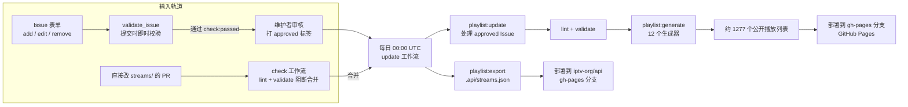

# iptv-org/iptv 架构拆解：14 万星仓库把 GitHub 当成带审批流的频道数据库

> 一句话核心判断：**iptv-org/iptv 把 GitHub 当成一个带审批流的数据库——Issue 是工单，标签是状态机，维护者的 `approved` 标签是审批章，GitHub Actions 是每日定时执行的 ETL 引擎，Git 提交历史就是审计日志**。它不存任何视频文件，只存频道流链接的元数据；整个系统没有一台自己的服务器，却支撑着约 1,277 个每日更新的公开播放列表。这个案例真正值得学的，不是"用 Issues 当数据库"这个点子，而是它给这个点子配齐的三件基础设施：提交时的即时校验、入库前的审批门禁、写入时的失败回滚。

## 目录

1. [项目坐标](#一项目坐标)
2. [系统地图：两条输入轨道，一条日更流水线](#二系统地图两条输入轨道一条日更流水线)
3. [输入轨道：表单与 Stream ID](#三输入轨道表单与-stream-id)
4. [日更流水线：update 工作流的七步](#四日更流水线update-工作流的七步)
5. [update 脚本：三类请求与回滚机制](#五update-脚本三类请求与回滚机制)
6. [生成器矩阵与排序去重](#六生成器矩阵与排序去重)
7. [一条流的完整旅程](#七一条流的完整旅程)
8. [Bot 与权限边界](#八bot-与权限边界)
9. [法律、许可与内容治理](#九法律许可与内容治理)
10. [采用建议与边界](#十采用建议与边界)
11. [总结](#十一总结)

---

## 一、项目坐标

| 字段 | 值 |
|------|------|
| 仓库 | [iptv-org/iptv](https://github.com/iptv-org/iptv) |
| 主语言 | TypeScript（Node 22 运行） |
| Stars / Forks | 139,865 / 8,158（截至 2026-09-30，GitHub API） |
| 创建时间 | 2018-11-14 |
| License | [Unlicense](https://github.com/iptv-org/iptv/blob/master/LICENSE)（公有领域奉献；README 挂 CC0 徽章指向同一文件） |
| 仓库体积 | 约 1.38 GB（八年流水线积累的 Git 历史） |
| 维护形态 | 社区驱动 + iptv-bot 自动提交 |
| 调度频率 | 每天 UTC 0 点（北京时间 8 点）一次完整 ETL |

iptv-org 是一个组织，`iptv` 只是其中面向终端用户的一个仓库。完整的生态有四个环节：

- **[iptv-org/database](https://github.com/iptv-org/database)**（1.7k ★，JavaScript）：频道元数据库——频道名、国家、logo、分类、feed（同一频道的不同信号源）、屏蔽名单。这是整个体系的"主数据"，iptv 仓库自己不定义任何频道信息。
- **[iptv-org/iptv](https://github.com/iptv-org/iptv)**（本文主角）：流链接仓库，管"哪个 URL 播哪个频道"。
- **[iptv-org/epg](https://github.com/iptv-org/epg)**（3.3k ★）：从数百个来源抓取 EPG（电子节目指南）。
- **[iptv-org/api](https://github.com/iptv-org/api)**（823 ★）：没有自己的代码逻辑，`gh-pages` 分支由 iptv 仓库每日部署的 `streams.json` 填充，给第三方提供现成的 JSON 数据。

分工很清晰：database 管频道"是什么"，iptv 管"去哪播"，epg 管"播什么节目"，api 管把前两者打包给机器读。

## 二、系统地图：两条输入轨道，一条日更流水线

整个系统在任何一个时刻都在做两类事情：接收新的流链接（输入），以及把已批准的变更落到播放列表里（日更）。输入有两条轨道：



两条轨道的质检方式完全不同：Issue 轨道靠 `validate_issue` 工作流在提交瞬间校验表单字段，错误会由 bot 直接评论在 Issue 下面；PR 轨道靠 `check` 工作流在每次 PR 时跑 `api:load → playlist:lint → playlist:validate`，有错误就阻断合并。两条轨道最终汇入同一条日更流水线。

对应到 `package.json`，流水线的每一步都是一个 npm script：

| 脚本 | 阶段 | 说明 |
|------|------|------|
| `api:load` | 1 | 用 `@iptv-org/sdk` 的 DataManager 下载 13 个 JSON 数据文件到 `.api/` |
| `playlist:update` | 2 | 处理带 `approved` 标签的 Issue，增删改 `streams/*.m3u` |
| `playlist:lint` | 3 | 用 `m3u-linter` 校验 m3u 格式 |
| `playlist:validate` | 3 | 校验每条流的描述与 database 一致（频道 ID、feed ID 存在性等） |
| `playlist:generate` | 4 | 12 个生成器切出全部公开播放列表到 `.gh-pages/` |
| `playlist:export` | 5 | 输出 `.api/streams.json` |
| `readme:update` | 6 | 依据生成日志更新 `PLAYLISTS.md` 的播放列表索引 |

还有几个不在日更主线上的脚本值得一提：`issue:validate` 服务于 Issue 即时校验，`playlist:format` 统一格式（CRLF 行尾、UTF-8 无 BOM），`playlist:test` 检测链接存活，`playlist:edit` 提供交互式编辑。测试框架是 vitest，`tests/commands/` 下的用例覆盖了上面每一个命令，且配有一整套 `tests/__data__/expected/` 快照——这是这个仓库敢于让 bot 每天自动写 master 分支的底气。

## 三、输入轨道：表单与 Stream ID

iptv-org 没有后台，"添加频道"的入口就是 6 个 Issue 表单：`1_streams_add`（加流）、`2_streams_edit`（改描述）、`3_streams_report`（报死链）、`5_bug-report`、`6_copyright-claim`（版权方移除请求）。表单里最关键的字段不是流 URL，而是 **Stream ID**：

```
ExampleTV.us@HD
```

一个 Stream ID 由频道 ID 和 feed ID 用 `@` 拼成。频道 ID 是"频道名去掉空格和特殊字符 + `.` + 国家码"；feed ID 标识同一频道的不同信号——画质版本（HD）、时移版本（Plus1）、来源版本（Pluto）、地区版本（East、MENA）。全部 ID 的权威清单挂在 [iptv-org.github.io](https://iptv-org.github.io/)，频道或 feed 缺失时要先去 database 仓库补录，再回来提流。

这个设计把"内容元数据"和"链接数据"彻底分开了：iptv 仓库里的每条链接都通过 Stream ID 指向 database 里的一条频道记录，频道改名、换 logo、调分类，都不需要动 iptv 仓库——播放列表生成时实时从 database 拉取。

提交流程走的是一个标签状态机：

1. 用户提交表单，`validate_issue` 工作流立即触发（`issues: [opened, edited]`），用 `issue:validate` 脚本校验：Stream ID 格式是否合法、频道和 feed 是否存在于 database、URL 是否有效、是否与现有播放列表重复、频道是否在屏蔽名单里。
2. 校验通过，bot 打 `check:passed` 标签；失败则 bot 把全部错误一次性评论在 Issue 里，打 `check:failed`。缺 Stream ID 或链接无效的请求会被直接关闭——这是 CONTRIBUTING.md 里加粗的规则。
3. 维护者人工审核链接质量（能不能播、是否地理限制、是否稳定），批准后打 `approved` 标签。`validate_label` 工作流盯着每次打标签的动作，标签用错了会被 bot 撤掉并留言。
4. 下一次日更时，`playlist:update` 只处理带 `approved` 标签的 Issue。

审核权在维护者手里，bot 只负责把不合格的挡在门外。这套"机器即时校验 + 人工审批"的分层，是社区项目控制数据质量的标准解法，iptv-org 的特别之处在于全部用 GitHub 原生功能实现：校验用 Actions，状态用标签，审批记录就是标签的添加时间。

还有一份硬约束在 database 侧：**blocklist（屏蔽名单）**。频道因版权投诉（`dmca`）或 NSFW 内容（`nsfw`）被记入 `blocklist.csv` 后，脚本在入库前会再查一遍，命中直接拒绝。2024 年 1 月起，项目已停止分发 NSFW 频道（官方 Issue #15723）。

## 四、日更流水线：update 工作流的七步

`.github/workflows/update.yml` 由 `cron: '0 0 * * *'` 触发（也支持手动 `workflow_dispatch`），干七件事：

**第 1 步，`api:load`**。通过 `@iptv-org/sdk` 的 DataManager 下载 13 个 JSON 文件：channels、feeds、streams、categories、countries、subdivisions、cities、regions、languages、guides、logos、blocklist、timezones。下载后建内存索引——`channelsKeyById`、`feedsKeyByStreamId`、`blocklistRecordsGroupedByChannel`、`guidesGroupedByStreamId`——都是 O(1) 查询的 Dictionary。早期的 GraphQL 拉取方案已经换掉了，现在数据面是纯 JSON。

**第 2 步，`playlist:update`**。处理审批完的 Issue，下一节细讲。这一步结束后会把处理结果写入 `temp/logs/playlist_update.log`，内容是 `closes #123, closes #456` 这样的清单。

**第 3 步，`playlist:lint` + `playlist:validate`**。lint 查格式（`#EXTINF` 行、属性拼写），validate 查语义——每条流的 tvg-id 必须能在 database 里找到对应频道和 feed。注意这一步查的是内部播放列表，也就是上一步刚写过的文件。

**第 4 步，`playlist:generate`**。生成全部公开播放列表，见"生成器矩阵"一节。

**第 5 步，`playlist:export`**。把流数据导出成 `.api/streams.json`。

**第 6 步，`readme:update`**。读第 4 步留下的 `generators.log`（每行一个 JSON，记录每个文件的类型、路径、条数），重写 `PLAYLISTS.md` 里的播放列表索引和频道计数表。

**第 7 步，提交与部署**。git 作者配置为 `iptv-bot[bot]`，然后分两笔提交：`streams/` 的变更一笔，`PLAYLISTS.md` 一笔——后者用 `--allow-empty`，即使没有变更也提交，让"每天跑过"这件事本身可见。最后 push 到 master，再用 `JamesIves/github-pages-deploy-action` 把 `.gh-pages/` 推到本仓库的 `gh-pages` 分支（GitHub Pages 从这里发布），把 `.api/` 推到 iptv-org/api 的 `gh-pages` 分支。

两个部署动作用的都是 App Token——这引出权限设计，第八节展开。

## 五、update 脚本：三类请求与回滚机制

`scripts/commands/playlist/update.ts` 是整个仓库的核心文件，主干只有五步：

```typescript
async function main() {
  logger.info('loading data from api...')
  await loadData()                       // ① 载入 database 的 13 类元数据
  logger.info('loading issues...')
  const issues = await loadIssues()      // ② 分页拉取全部 open Issue
  logger.info('loading streams...')
  await loadStreams()                    // ③ 解析 streams/ 下所有 m3u
  logger.info('processing issues...')
  await processIssues(issues)            // ④ 只处理带 approved 标签的
  logger.info('saving streams...')
  await saveStreams()                    // ⑤ 按各自 filepath 写回
}
```

`processIssues` 按标签把请求分成三类：

- **`streams:add`**：校验 Stream ID（频道存在、feed 存在、不在 blocklist），查 URL 重复；表单没填分辨率时，用 `getStreamInfo()` 实际探测一次流的分辨率（HLS/DASH 解析），自动补上 `720p` 这样的画质标注；表单还支持 `http_user_agent`、`http_referrer`（某些源必须带 UA 才给播）和 `geo_blocked`、`live_247` 两个标志位。
- **`streams:edit`**：按 URL 找到已有流，用表单字段更新描述。
- **`streams:remove`**：支持一次提交多个 URL，逐个标记移除。

每类操作完成后都会跑 `stream.validate()`，任何校验失败就整体回滚：

```typescript
cacheData()                    // 改动前快照
stream.updateTitle().updateFilepath()
// ...校验失败时：
resetData()                    // 恢复快照
log.info('All changes have been reverted')
```

一个 Issue 的字段错误不会污染别的流——同一批处理的每个请求相互隔离。被处理的 Issue 记进日志（`closes #123` 格式），在提交时作为 commit message 一部分，Issue 会随流水线自动关闭。

写回时按 `stream.getFilepath()` 分组。文件名的规则值得注意：新流默认落进 `{国家码小写}.m3u`（如 `cn.m3u`），但已存在的文件名会被保留——`streams/` 下能看到 `at_pluto.m3u`、`au_samsung.m3u` 这类"国家_服务"命名。官方文档（docs/playlists.md）的解释是：内部播放列表按国家和来源服务分组，"纯粹为了方便人工审核链接"。也就是说内部分片是给审核员看的目录结构，不是公开数据的组织方式——公开的组织方式由生成阶段决定。

## 六、生成器矩阵与排序去重

`playlist:generate` 是这个仓库工程上最讲究的部分。先看真实数据长什么样，这是 `streams/cn.m3u` 里的两行：

```
#EXTINF:-1 tvg-id="AndoTV.cn@SD",Ando TV (1080p)
http://play.kankanlive.com/live/1711956137852982.m3u8
#EXTINF:-1 tvg-id="",Beijing Traffic Radio TV [Geo-blocked]
http://123.56.24.28:1935/live/fm1039/96K/tzwj_video.m3u8
```

`tvg-id` 就是 Stream ID，标题后缀是分辨率，`[Geo-blocked]` 是地理限制标记。内部播放列表是这些行的集合，而公开播放列表要把同一个集合按 12 个生成器切成不同视图：

| 生成器 | 输出 | 维度 |
|--------|------|------|
| `RawGenerator` | `raw/*.m3u` | 未过滤的原始流（唯一不过滤 `hasChannel/hasFeed` 的视图） |
| `IndexGenerator` | `index.m3u` | 全量去重主列表（实测 2.5 MB） |
| `CountriesGenerator` | `countries/cn.m3u` | 按国家 |
| `SubdivisionsGenerator` | `subdivisions/us-ca.m3u` | 按国家一级行政区 |
| `CitiesGenerator` | `cities/*.m3u` | 按城市 |
| `RegionsGenerator` | `regions/emea.m3u` | 按大区（emea、amer、ww 等） |
| `LanguagesGenerator` | `languages/zho.m3u` | 按语言 |
| `CategoriesGenerator` | `categories/news.m3u` | 按分类（无分类的进 `undefined.m3u`） |
| `SourcesGenerator` | `sources/*.m3u` | 按流来源域名 |
| `IndexCategoryGenerator` | `index.category.m3u` | 分类索引（列表里嵌套子列表链接） |
| `IndexCountryGenerator` | `index.country.m3u` | 国家索引 |
| `IndexLanguageGenerator` | `index.language.m3u` | 语言索引 |

全部输出约 1,277 个文件（`PLAYLISTS.md` 2026-09-30 的链接计数），统一写到 `.gh-pages/` 目录。

生成前的两步处理决定了所有视图的质量。第一步排序，`generate.ts` 里的排序链是六级的：

```typescript
streams = streams.sortBy(
  [
    (stream: Stream) => stream.channelUniqueName,       // 频道名升序
    (stream: Stream) => (stream.hasMainFeed ? 1 : 0),   // 主 feed 优先
    (stream: Stream) => stream.feedName,                // feed 名升序
    (stream: Stream) => (stream.isGeoBlocked ? -1 : 0), // 非地理限制优先
    (stream: Stream) => (stream.isNot247 ? -1 : 0),     // 全天候频道优先
    (stream: Stream) => stream.getVerticalResolution()  // 分辨率降序
  ],
  ['asc', 'desc', 'asc', 'desc', 'desc', 'desc']
)
```

第二步过滤去重：没有频道或没有 feed 的流被丢弃，剩下的按 Stream ID 去重——同一个频道有多条链接时，每个视图只保留排序最靠前的一条。这就是为什么 `raw/` 目录和 `index.m3u` 的条数会对不上：raw 保留全部，index 只要每个 Stream ID 的一条。

还有一个容易被忽略的细节：每个频道的 `group-title`（播放器里的分组名）是它的全部分类名排序后用分号连接的，且分类信息完全来自 database——iptv 仓库自己不存分类。频道在 database 里改了分类，第二天所有视图自动跟着变。

## 七、一条流的完整旅程

把上面的机制串起来，跟一条虚构的流走一遍全程（频道与 URL 均为演示）：

```text
T+0    用户打开 Add 表单，填入 Stream ID「ExampleTV.us@HD」
       和流 URL「https://example.com/playlist.m3u8」，提交 Issue
T+1m   validate_issue 工作流触发：频道 ExampleTV.us 存在 ✓
       feed HD 存在 ✓ URL 格式合法 ✓ 不与现有播放列表重复 ✓
       → bot 打上 check:passed
T+2d   维护者实测链接可播，打 approved 标签
T+3d   UTC 0 点，update 工作流启动：
       ① api:load        下载 13 个 JSON，频道、feed、屏蔽名单进内存索引
       ② playlist:update
         loadIssues()    分页拉取 open Issue，ExampleTV 这条带 approved
         addStream()     查 URL 无重复 → 查 blocklist 未命中 →
                         表单未填分辨率，getStreamInfo() 探测返回 720 →
                         new Stream({ channel: 'ExampleTV.us', feed: 'HD',
                                      title: 'Example TV', url: '...', quality: '720p' })
                         updateTitle().updateFilepath() → 落入 us.m3u
         validate()      通过，无回滚
         日志写入 closes #12345
       ③ lint + validate    新行格式与语义检查通过
       ④ playlist:generate  Example TV (720p) 进入 index.m3u、
                            countries/us.m3u、categories/...、languages/...、raw/us.m3u
       ⑤ playlist:export    streams.json 带上这条流
       ⑥ readme:update      PLAYLISTS.md 的 United States 计数 +1
       ⑦ commit + push      「[Bot] Update /streams」，message 引用 closes #12345
T+3d+2h  iptv-bot 部署 gh-pages，用户刷新
         https://iptv-org.github.io/iptv/countries/us.m3u 看到这条流
         Issue #12345 已被自动关闭
```

从用户点提交到全球可下载，中间只有两处人工介入：维护者审核，以及（如果流很快死掉）某个用户提交 `streams:report` 再走一遍同样的循环。整条链路的外部依赖只有 GitHub 自己——API（Octokit）、Actions（runner）、Pages（发布），外加一个可选的 `socks-proxy-agent`（维护者在探测某些地区的流时走代理）。

## 八、Bot 与权限边界

`update.yml` 的权限设计是这个仓库对 GitHub Actions 安全实践的一个干净示范：

```yaml
permissions:
  contents: read          # workflow 默认 token 只有读权限

jobs:
  main:
    steps:
      - uses: actions/checkout@v6
      - uses: tibdex/github-app-token@v1.8.2   # 用 App 换一个短时 token
        if: ${{ !env.ACT }}
        with:
          app_id: ${{ secrets.APP_ID }}
          private_key: ${{ secrets.APP_PRIVATE_KEY }}
      - uses: actions/checkout@v6              # 用 App Token 重新 checkout
        if: ${{ !env.ACT }}
        with:
          token: ${{ steps.create-app-token.outputs.token }}
```

四个要点：

1. **读写分离**。默认的 `GITHUB_TOKEN` 只有 `contents: read`；写操作全部走 GitHub App Token，App 本身能碰哪些仓库、哪些权限，在 App 配置里一次性定死，workflow 里拿到的只是短时凭证。
2. **`env.ACT` 是本地调试开关**。token 签发、二次 checkout、push、Pages 部署这几步都挂着 `if: ${{ !env.ACT }}`——用 [act](https://github.com/nektos/act) 在本地跑 workflow 时自动跳过这些需要真实密钥的步骤。仓库的 `package.json` 里还备好了 `act:update`、`act:check` 等命令，本地复现一条龙。
3. **提交作者固定为 `iptv-bot[bot]`**。所有自动提交的作者和邮箱都是同一个 bot 身份，git 历史里人机分明；每条 commit message 带着触发它的 workflow run 链接，审计可以一路点到具体的 Actions 日志。
4. **提交粒度有讲究**。`streams/` 的提交挂在 `processed_issues != 0` 条件上（这个值取自第 2 步写下的处理清单）；`PLAYLISTS.md` 则无条件 `--allow-empty` 提交，保证"日更跑过"在提交历史里留痕。

一个值得注意的边界：这套权限模型防的是 workflow 意外和凭证滥用，不防恶意贡献——内容层面的防线在 validate 脚本、人工审批和 blocklist，权限和内容治理各管一段。

## 九、法律、许可与内容治理

README 的 Legal 一节把边界划得很直白：仓库不存任何视频文件，只存用户提交的公开流链接；链接指向的内容不受项目控制，从播放列表里删掉链接也不会让内容从互联网上消失；链接本身不直接侵犯版权（提供链接的一方没有复制任何内容），因此这不是向 GitHub 发 DMCA 通知的有效理由——要下架内容应该去找真正托管它的主机商。

与之配套的是一个只对版权方开放的移除通道：`6_copyright-claim` 表单只接受频道所有者及官方代表的请求，通常一个工作日内审核，批准后链接立即移除，且该频道会被写进 database 仓库的 `blocklist.csv`——不只删一次，而是永久拦在入库环节。NSFW 内容同样走 blocklist 机制管理，2024 年 1 月底起整个项目停止分发 NSFW 频道。

许可证方面，仓库的 [LICENSE](https://github.com/iptv-org/iptv/blob/master/LICENSE) 文件是 Unlicense——作者放弃全部版权，把代码和数据一并奉献给公有领域；README 挂的是 CC0 徽章，指向的也是这份 Unlicense 文件。两者都是"无权利保留"的公有领域奉献，第三方 fork、修改、分发没有额外条件。这解释了为什么大量 IPTV 播放器和应用敢于直接内置 iptv-org 的播放列表。

这种"链接集合 + 不存储内容"的模式让项目运行了八年没有遇到整体下架，但边界不是永久安全的：链接服务的法律定性在各法域并不一致，项目自己的 README 也承认对链接目标毫无控制力。对使用方来说，稳妥的假设是"任何一条链接随时可能消失"——FAQ 里不收录 Xtream Codes 链接的理由（太不稳定、死链太快）同样适用于对整个数据集的预期管理。

## 十、采用建议与边界

谁适合直接用：

- **播放器与聚合类应用**：把 `index.country.m3u` 或分类切片当数据源，配合自己的心跳检测。不要 fork 整个仓库做镜像——上游每小时都在变，镜像只会腐烂。
- **想搭"GitHub 原生内容流水线"的团队**：iptv-org 是这套模式最完整的公开参考实现——表单、标签状态机、即时校验、审批门禁、定时 ETL、条件提交、Pages 发布，每一环都有可抄的细节。数据录入、链接审核、工单分拣类场景都可以平移。

谁不该用这套模式：

- **需要 SLA 的场景**。流链接没有存活承诺，GitHub Actions 和 Pages 也没有可用性承诺，关键业务别把链路建在别人家的免费层上。
- **单条数据需要强一致的事务**。这里的"回滚"只是内存快照，粒度是单个 Issue、周期是一天一次；需要秒级一致性的系统要找别的方案。

二次开发的三条捷径：

1. **数据接入用 `@iptv-org/sdk`**。iptv 仓库自己就是用它下载数据、建索引的，`DataManager` 和模型定义开箱即用。
2. **EPG 关联认 `tvg-id`**。它就是 Stream ID，`iptv-org/epg` 的节目单按同一个 ID 体系对齐，自己解析时不用另做映射。
3. **贡献遵守 Stream Description Scheme**。国家用 ISO 3166-1 二位码、行尾 CRLF、UTF-8 无 BOM，lint 和 validate 会把不合格的提交挡在门外——这也是 `check` 工作流存在的意义。

## 十一、总结

回到开头的判断：iptv-org/iptv 的架构价值不在"用 GitHub 当数据库"这个点子本身——任何人都想得到——而在它围绕这个点子补齐的工程配套：

- **输入侧**：表单约束字段，Stream ID 锁定数据模型，validate_issue 在提交瞬间完成机器校验，approved 标签保留人工审批权，blocklist 把不可接受的内容永久挡在门外。
- **处理侧**：每日一次的幂等 ETL，单请求粒度的失败回滚，vitest 快照测试锁住每个命令的行为。
- **输出侧**：12 个生成器把同一份数据切成约 1,277 个视图，App Token 划清权限边界，commit 历史天然就是审计日志。

它的代价同样清晰：数据质量受限于志愿者的实测意愿（死链是常态）、吞吐受限于每天一次的调度节奏、存续依赖于 GitHub 平台本身。对一个由社区驱动、链接本身就是易变资产的电视指南项目来说，这套取舍是划算的；换成别的领域之前，先想清楚你的数据是否也能容忍"日更 + 尽力而为"的节奏。

---

> **来源**：GitHub [iptv-org/iptv](https://github.com/iptv-org/iptv)，139,865 ★ / Unlicense / 数据口径 2026-09-30（GitHub API、master 分支源码与文档、iptv-org.github.io 实测）

## 资料口径说明

1. **信息来源**：本文基于 2026-09-30 的 GitHub API（仓库元数据、文件树）、master 分支源码（`package.json`、`scripts/` 下全部命令与生成器、`.github/workflows/` 下 5 个 workflow）与文档（README、CONTRIBUTING、FAQ、docs/ 下 9 篇）编写，公开播放列表数量来自 `PLAYLISTS.md` 链接计数，`index.m3u` 体积来自 iptv-org.github.io 当日响应头。
2. **架构分析边界**：拆解基于静态代码分析与官方文档，未实际运行完整流水线；文中标注"演示"的流与 URL 均为虚构，其余代码片段摘自仓库源码。
3. **法律判断边界**：关于链接服务与公有领域许可的说明来自 README 与 LICENSE 原文，不构成法律建议。
4. **数据时效**：Stars、播放列表数量、文件清单均为 2026-09-30 快照，仓库日更频繁，阅读时请以最新状态为准。
