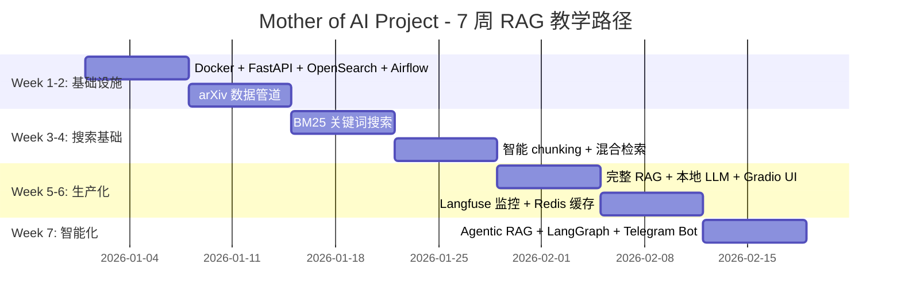
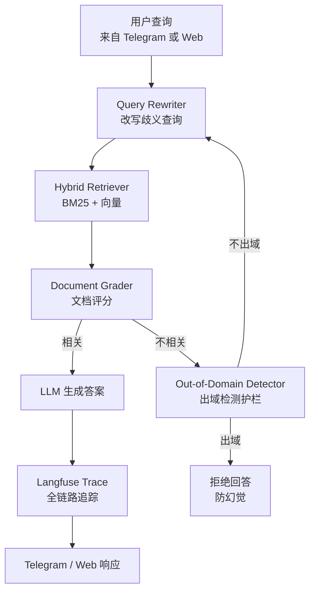

# Mother of AI Project：7 周渐进式 RAG 教学，反 AI-first 潮流的「先 BM25 后向量」路线

## 核心判断

`jamwithai/production-agentic-rag-course`（仓库 [jamwithai/production-agentic-rag-course](https://github.com/jamwithai/production-agentic-rag-course)）在 6.5K stars 的热度下，回答的不是"怎么搭 RAG"——它回答的是一个更根本的工程问题：**"RAG 应该从哪里开始？"**

当前 AI-first 潮流的答案是"先向量数据库"——任何教程都从 Pinecone / Weaviate / Qdrant 开始。但这个项目的核心理念是反潮流的：

> **"先 BM25 关键词搜索打牢基础，再用向量做混合检索"**
> ——[The Professional Difference] 段落原话

这个**反 AI-first 教学主张**才是项目的真正价值。在 7 周渐进式课程里，你会看到一条清晰的能力递进：

1. Week 1：基础设施（Docker + FastAPI + OpenSearch + Airflow）
2. Week 2：arXiv 论文自动抓取
3. Week 3：BM25 关键词搜索
4. Week 4：混合搜索（关键词 + 向量）
5. Week 5：完整 RAG + 本地 LLM
6. Week 6：Langfuse 监控 + Redis 缓存
7. Week 7：Agentic RAG + LangGraph + Telegram Bot

## 7 周课程全景



**关键观察**：每个 Week 都建立在前一个的基础上，**没有任何跳跃**。对比多数教程"Week 1 直接上 LangChain + Pinecone + OpenAI"的速成路径，Mother of AI Project 慢得多，但生产可用的概率高得多。

## 教学法主张：「先 BM25 后向量」

这是整个项目最值得展开的设计取舍。

**主流 AI-first 路径**：

```
教程：Day 1 → 安装 Pinecone → 灌 embeddings → 写 RAG 链 → 调用 OpenAI
问题：学员不理解向量空间、不理解 hybrid search 的边界
       生产化时发现：纯向量检索在精准匹配场景（型号、ID、专业术语）效果差
```

**Mother of AI Project 路径**：

```
Week 3：纯 BM25 关键词搜索
  → 学员理解"为什么 OpenSearch 倒排索引够用"
  → 学员理解"BM25 的 TF-IDF 改进与边界"
Week 4：在 BM25 之上加向量做混合检索
  → 学员理解"混合检索 = 关键词兜底 + 向量增强"
  → 学员理解"什么时候该用哪种"
```

**为什么反潮流更对？**

| 场景 | 纯 BM25 | 纯向量 | 混合 |
|------|:-------:|:------:|:----:|
| 论文 ID `2301.12345` 精准匹配 | ✓✓✓ | ✗ | ✓✓✓ |
| 同义词替换 "RAG" → "检索增强生成" | ✗ | ✓✓✓ | ✓✓✓ |
| 复杂语义 "对比 transformer 和 SSM" | ✗ | ✓✓✓ | ✓✓✓ |
| 长尾查询（小众专业术语） | ✓✓ | ✗ | ✓✓ |

**纯向量检索在精准匹配和长尾查询上有系统性缺陷**。Mother of AI Project 让学员从 BM25 出发建立"什么时候纯向量不够用"的肌肉记忆，这是多数 AI-first 教程给不出的工程直觉。

## 技术栈：成熟工业级选择

| Week | 引入的技术 | 选择理由 |
|------|-----------|----------|
| 1 | Docker Compose + FastAPI + PostgreSQL + OpenSearch + Airflow | 全部是"无聊但稳定"的工业选择 |
| 2 | arXiv API + 论文解析 | 数据源真实（非 toy dataset） |
| 3 | OpenSearch BM25 | 与生产搜索引擎同款 |
| 4 | 智能 chunking + 向量嵌入 | 在 BM25 之上做语义增强 |
| 5 | 本地 LLM（Ollama/vLLM）+ Gradio | 隐私 + 可控 |
| 6 | Langfuse + Redis | 可观测性 + 性能优化 |
| 7 | LangGraph + Telegram Bot | 智能体编排 + 移动端 |

**整套栈的选型逻辑**：

- **不用 LangChain 做编排**（Week 5-6 用 LangChain 调 LLM，但 Week 7 的 Agent 编排用 LangGraph）——避免锁死在一家框架
- **不用托管向量数据库**（Pinecone/Weaviate Cloud）——用 OpenSearch 自管
- **不用云 LLM**（Week 5 强调 local LLM）—— 隐私 + 成本可控
- **不用大模型评测框架**——用 Langfuse 做真实 trace

这套栈是**严肃生产项目的栈**，不是 demo 项目的栈。学员学完具备直接迁移到生产的能力。

## Week 7 的 Agentic RAG 创新

Week 7 是项目的"毕业设计"——把前面 6 周的能力打包成智能体：

**核心架构**（LangGraph 流程）：



**5 个关键创新**：

1. **Query Rewriting**：用户问题模糊时先改写再检索（避免"差问题"导致"差答案"）
2. **Document Grading**：检索结果用 LLM 评估相关性，过滤掉无关文档
3. **Out-of-Domain Detection**：出域时主动拒绝回答，**防止幻觉**
4. **Telegram Bot 接入**：把 RAG 能力带到移动端
5. **Full Trace 透明**：每步决策可调试、可审计、可重放

这套设计把"标准 RAG 链"升级成了"**带反思的 RAG Agent**"——能识别自己能力边界，能在能力不足时主动求助（重新检索），能在不能回答时坦诚说不。

## 适合谁、不适合谁

**适合**：

- 想系统性学 RAG 但被零散教程搞晕的**初中级 AI 工程师**
- 想从 demo 跨越到生产的**独立开发者**
- 想给团队培训 RAG 工程实践的**Tech Lead**
- 对"先 BM25 后向量"反潮流路线有共鸣的**实用主义者**

**不适合**：

- 想 1 小时搭个 RAG demo 的人（这个项目要 7 周）
- 只关心最新论文 SOTA 的研究者（这里是工程实践）
- 不愿读英文 README 的人（README 24KB，全英文）

## 怎么用这个项目

**自学路径**（建议）：

1. Clone 仓库，跟着 Week 1 README 走完基础设施搭建
2. 每个 Week 花 1 周做实战（约 10-20 小时）
3. 配合 [jamwithai.substack.com](https://jamwithai.substack.com/) 博客读理论
4. 7 周后应能独立搭建生产级 RAG 系统

**培训路径**（团队用）：

1. 把 7 周拆成 7 次团队内部分享
2. 每次分享对应一个 Week + 一次 Code Review
3. Week 7 之前完成 Group Project
4. 7 周后全团队具备 RAG 工程能力

**改造路径**（直接用）：

- 直接用 Week 5-7 的代码做 arXiv 论文助手
- 把 arXiv 数据源换成你自己的领域数据（论文 / 文档 / 工单）
- 把 Telegram Bot 换成 Slack / 飞书 / Discord
- **3 周内可上线一个生产级领域问答系统**

## 仓库元数据

| 维度 | 取值 | 验证来源 |
|------|------|----------|
| 仓库全名 | `jamwithai/production-agentic-rag-course` | GitHub API |
| Stars | 6456 | GitHub API（2026-06-03） |
| Language | Python | GitHub API |
| 创建时间 | 2025-08-06 | GitHub API |
| 最后更新 | 2026-06-03 04:39 UTC | GitHub API |
| 课程长度 | 7 周渐进式 | README |
| 技术栈 | Python 3.12+ / FastAPI 0.115+ / OpenSearch 2.19 / Docker Compose / Airflow / LangGraph / Langfuse / Redis / Gradio | README |
| 配套博客 | [jamwithai.substack.com](https://jamwithai.substack.com/) | README |

## 参考资源

- **仓库入口**：[github.com/jamwithai/production-agentic-rag-course](https://github.com/jamwithai/production-agentic-rag-course)
- **配套博客**：[jamwithai.substack.com](https://jamwithai.substack.com/)
- **Week 7 重点文章**：[Agentic RAG with LangGraph and Telegram](https://jamwithai.substack.com/p/agentic-rag-with-langgraph-and-telegram)
- **6 阶段路线图**：[The Mother of AI project](https://jamwithai.substack.com/p/the-mother-of-ai-project)
- **架构 GIF**：[RAG Architecture](https://github.com/jamwithai/production-agentic-rag-course/blob/main/static/mother_of_ai_project_rag_architecture.gif)
- **LangGraph 流程图**：[langgraph-mermaid.png](https://github.com/jamwithai/production-agentic-rag-course/blob/main/static/langgraph-mermaid.png)
