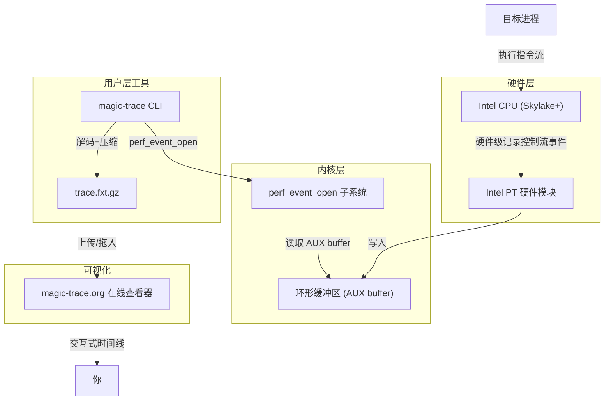

# magic-trace：Jane Street 开源的高分辨率程序追踪工具

magic-trace 不是来替代 `perf` 的。它填补的是采样分析永远够不到的那道窄缝——单次调用路径、崩溃前最后 10ms、精确到纳秒的函数进出时刻。

## 目录

- [系统地图：数据怎么流的](#1-系统地图数据怎么流的)
- [它解决的是什么](#2-它解决的是什么)
- [核心原理](#3-核心原理)
- [案例：定位一次真实延迟尖刺](#4-案例定位一次真实延迟尖刺)
- [安装](#5-安装)
- [快速开始](#6-快速开始)
- [两种使用模式](#7-两种使用模式)
- [与 perf 的深度对比](#8-与-perf-的深度对比)
- [适用边界与采用建议](#9-适用边界与采用建议)
- [常见问题排查](#10-常见问题排查)
- [练习与自检](#11-练习与自检)
- [进阶路径](#12-进阶路径)
- [更多资源](#13-更多资源)

---

## 学习目标

读完这篇文章，你应该能自己回答这几个问题：

- magic-trace 和 `perf` 本质上的区别是什么？什么时候用哪个？
- Intel PT 是什么，它为什么能做到 40ns 精度而开销只有 2%-10%？
- 在生产环境用 magic-trace 抓一次延迟尖刺，从头到尾要怎么做？
- magic-trace 有哪些你用不了的场景？如果恰好踩中，替代方案是什么？

---

## 1. 系统地图：数据怎么流的

这套机制可以拆成两条主线来看。



两条主线：

| 主线 | 路径 | 谁在做 |
|------|------|--------|
| **采集** | 目标进程 → Intel PT → AUX buffer → `perf_event_open` | 硬件 + 内核 |
| **消费** | AUX buffer → magic-trace CLI 解码 → `.fxt.gz` → magic-trace.org | 用户态工具 + 浏览器 |

第一条主线几乎不消耗 CPU——记录在硬件里完成，magic-trace 只负责读 buffer。第二条主线发生在追踪结束后，对目标进程零干扰。两条线的时间是分离的，这也是 2%-10% 低开销的根本原因。

---

## 2. 它解决的是什么

程序跑得慢，想知道**到底慢在哪**——这件事有两个经典的盲区。

**盲区一：采样漏掉短调用。**  `perf` 靠固定频率采样（比如 99Hz），调用时间比采样间隔短（~10ms）的函数可能一次都撞不上。结果就是：你能看到热点函数，看不到热点函数内部的冷分支——而 `dlopen` 延迟、锁竞争等待、临时内存分配往往就藏在那些冷分支里。

**盲区二：崩溃后只知道终点，不知道来路。** 程序崩溃时，core dump 给你一个栈帧快照，但不知道崩溃前 10ms 到底发生了什么——而这 10ms 往往比最终栈帧更有用。

magic-trace 解决这两个问题的思路不是"采得更密"，而是换了一种范式：用 Intel Processor Trace 把程序的控制流事件**完整录下来**，然后离线解码、可视化。每一步函数调用和返回都在，精度 ~40ns。

> Intel PT 是 Intel CPU 内置的硬件追踪模块，从 Skylake（2015 年）开始进入消费级。它在 CPU 内部以包（packet）为单位记录指令流——条件分支方向、函数调用/返回、中断——每个包只有 3-5 字节。因为走的是 CPU 内部专用通道，不影响被追踪程序的执行速度。

---

## 3. 核心原理

### Intel PT 的工作机制

Intel PT 在 CPU 内部维护一个环形缓冲区（AUX buffer），记录的不是指令本身，而是"控制流事件"：

- 条件分支的方向（`taken` / `not taken`）
- 间接跳转目标（函数调用、虚函数分发）
- 中断与异常

每个事件体积极小（3-5 字节），所以可以连续记录高频调用而不导致缓冲区溢出。事件本身不包含指令内容——magic-trace 事后用二进制反汇编"重建"完整调用栈，这是离线完成的，不影响采集时的开销。

magic-trace 在底层通过 `perf_event_open` 系统调用驱动 Intel PT。生成的原始 trace 数据经解码后打包为 `.fxt.gz`（Fuchsia Trace Format），再用浏览器端工具渲染成交互式时间线。

### 40ns 精度意味着什么

拿一组具体数字来说：

- 一次 `cos()` 调用大概 5-10 微秒（5,000-10,000 纳秒）
- Intel PT 的包间隔 ~40ns

也就是说，在 `cos()` 执行的 5,000ns 里，Intel PT 能恰好捕捉到上百个控制流事件，足以看清函数进、出、内联展开、以及内部的库调用分支。

对比：`perf` 在默认 99Hz 下，每 ~10,000,000ns 才采一次样。`cos()` 一次都撞不上。

---

## 4. 案例：定位一次真实延迟尖刺

假设你维护一个 C++ 交易网关，用户每 30 秒报一次延迟超过 15ms 的告警，但 `perf top` 一切正常——热点函数耗时稳定在 3ms 以内。

用 magic-trace 排查的完整流程：

**Step 1：attach 到运行中的进程**

```bash
magic-trace attach -pid $(pidof trading_gateway)
```

不需要重启进程，不需要重新编译，不需要加 `-pg`。等下一次延迟尖刺出现后 `Ctrl+C`。

**Step 2：在时间线里找到尖刺**

把生成的 `trace.fxt.gz` 拖到 magic-trace.org。时间线会展示每一次函数调用的进出时刻。用鼠标框选延迟异常的时间段，放大后直接看到：

```
main_loop (14.2ms)
├── process_message (12.8ms)
│   ├── validate_signature (0.3ms)
│   ├── lookup_account (11.7ms)
│   │   ├── db_query (2.1ms)
│   │   ├── cache_miss → cold_path (9.3ms)  ← 在这里
│   │   │   ├── dlopen("libcache.so") (8.7ms)
│   │   │   └── ...
│   │   └── ...
│   └── ...
└── ...
```

**Step 3：定位到根因**

时间线清楚地显示：`lookup_account` 触发了 cache miss，走了 cold path，而 cold path 里有一次 `dlopen` 耗时 8.7ms——这次 `dlopen` 不是每次都发生，只在缓存预热阶段偶尔出现。`perf` 的采样频率下，这次 `dlopen` 出现在采样窗口的概率极低，你永远看不到它。

修完后，同一段流程降到 4.3ms，尖刺消失。

这个案例说明的不是 magic-trace 比 perf 更准，而是它能**把偶尔发生的异常路径变成可见的**。

---

## 5. 安装

### 系统要求

| 项目 | 要求 | 备注 |
|------|------|------|
| CPU | Intel Skylake 或更新 | AMD、ARM、Apple Silicon 均不支持 |
| 操作系统 | Linux（内核 4.1+） | 不支持 macOS、Windows、WSL、虚拟机 |
| 权限 | root 或 `CAP_PERFMON` | 非 root 运行需要配置 perf_event_paranoid |
| 被追踪语言 | C/C++、OCaml、Python、Rust 等 | 任何编译为 x86-64 的二进制均可 |

### 下载二进制

```bash
# 从 GitHub Releases 下载最新版本
curl -L https://github.com/janestreet/magic-trace/releases/latest/download/magic-trace \
  -o ~/bin/magic-trace
chmod +x ~/bin/magic-trace

# 验证安装
magic-trace -help
```

### 发行版安装（Ubuntu/Debian）

```bash
sudo dpkg -i magic-trace*.deb
```

### 非 root 运行配置

```bash
# 临时（重启失效）
sudo sysctl -w kernel.perf_event_paranoid=1

# 永久
echo "kernel.perf_event_paranoid = 1" | sudo tee -a /etc/sysctl.conf
```

---

## 6. 快速开始

### 准备演示程序

创建 `demo.c`：

```c
#include <dlfcn.h>
#include <stdio.h>
#include <math.h>
#include <unistd.h>

int main() {
    void *handle = dlopen("libm.so", RTLD_LAZY);
    typedef double (*cos_func_t)(double);
    cos_func_t cos_fn = (cos_func_t)dlsym(handle, "cos");

    for (int i = 0; i < 100000; i++) {
        double r = cos_fn(3.14159 * i / 50000.0);
        printf("cos(%.5f) = %.5f\n", 3.14159 * i / 50000.0, r);
    }

    dlclose(handle);
    return 0;
}
```

编译：

```bash
gcc demo.c -ldl -o demo
```

### 后台运行并追踪

```bash
./demo &
DEMO_PID=$!

# 附加到运行中的进程
magic-trace attach -pid $DEMO_PID
```

等待几秒后按 `Ctrl+C`，工具生成 `trace.fxt.gz`。

### 查看结果

1. 打开 https://magic-trace.org/
2. 点击页面左上角 **"Open trace file"**，上传 `trace.fxt.gz`
3. 时间线展开后：
   - `W` / `S` — 纵向缩放
   - `A` / `D` — 横向平移
   - 滚轮 — 调整调用栈深度
4. 用鼠标框选一段区域，查看函数执行时长

在 demo 中，`cos()` 单次调用耗时约 **5.7µs**（5,700ns）。`perf` 无法直接定位到这个精度——它只能告诉你"这段时间数学库调用频繁"，但看不到每次调用实际花了多少纳秒。

---

## 7. 两种使用模式

### attach 模式——附加到运行中的进程

```bash
magic-trace attach -pid $(pidof my_program)
# 等几秒后 Ctrl+C 结束
# 输出 trace.fxt.gz
```

适合生产环境对已有进程做诊断。不需要修改代码、重新编译或重启进程。缺点是 trace 文件体积随运行时间线性增长——建议单次不超过 30 秒。

### trace 模式——追踪特定函数

```bash
magic-trace trace -pid $(pidof my_program) -function my_slow_function
```

当目标函数被调用时，magic-trace 自动触发快照，生成一个聚焦该函数内部调用路径的 trace 文件。适合你大概知道问题范围、只想看清热点函数内部发生了什么的场景。

关键选项：

| 参数 | 作用 | 示例 |
|------|------|------|
| `-function` | 只追踪该函数的调用 | `-function process_order` |
| `-multi-snapshot` | 允许多次触发 | 函数被调 3 次就存 3 份 trace |
| `-snapshot-limit` | 最多触发几次 | `-snapshot-limit 5` |

---

## 8. 与 perf 的深度对比

### 快速对照表

| 维度 | `perf` | magic-trace |
|------|--------|-------------|
| 原理 | 采样（sampling） | Intel PT 硬件追踪 |
| 数据来源 | 定时中断采样 PC 寄存器 | CPU 内部控制流事件包 |
| 开销 | 1%-5% | 2%-10% |
| 时间精度 | 微秒级（由采样频率决定） | ~40ns（硬件级） |
| 短调用可见性 | 漏调 | 全量记录 |
| 崩溃前历史 | 无（只有最终栈帧） | 可配置，默认约 10ms |
| 语言支持 | 所有语言 | 任何编译为 x86-64 的二进制 |
| 平台 | 全平台 | 仅 Intel CPU + Linux |
| 在线可视化 | 需搭配 FlameGraph 等 | 内置 magic-trace.org |

### 几个数字在测什么

"40ns 精度"测的不是"时钟准不准"——是 Intel PT 两个相邻控制流包之间的最小间隔。它在测量**你能把时间线切多细**，而不是测量的绝对时间有多准。对定位短调用来说，切得够细就够了。

"2%-10% 开销"主要来自两部分：

- **AUX buffer 的写入带宽**（硬件层，不可控）：取决于程序的分支密度。分支多的程序写得多。
- **magic-trace 读 buffer 的用户态开销**（可控）：可以通过 `-buffer-size` 调大 buffer、降低读取频率来减小。

这些数字**不能推出**"magic-trace 比 perf 慢 2 倍"——因为测量对象不同：`perf` 测的是采样开销，magic-trace 测的是全量记录开销。两者不存在公平比较的前提。

### 怎么选

```
用 perf，如果你要：
  → 统计热点（哪个函数耗时占比最高）
  → 跨平台一致的工具链
  → 跑在 AMD / ARM / macOS 上
  → 最小开销（<1%）

用 magic-trace，如果你要：
  → 看清单次调用的完整路径
  → 复现间歇性延迟尖刺
  → 调试崩溃前的程序行为
  → 确认“我的直觉”和“实际执行”是否一致
```

---

## 9. 适用边界与采用建议

### 什么时候该用

- 生产环境偶发延迟尖刺（latency spike），`perf` 抓不到
- 热循环中特定路径的调用开销需要厘清
- 程序崩溃，想知道崩溃前 10ms 的执行历史，而不是只看 core dump 的最终栈
- 怀疑代码实际执行路径和自己想的不一样——想亲眼验证

### 什么时候不该用

- **CPU 不是 Intel**：AMD、ARM、Apple Silicon 直接排除
- **不在 Linux 上**：macOS、Windows 不支持；WSL 和大多数虚拟机也不支持 Intel PT 穿透
- **对延迟极度敏感**：即便 2%-10% 的开销，对 HFT（高频交易）或实时控制系统仍不可接受
- **需要跨平台、团队通用**：如果你的团队有 Mac/Linux 混用，perf + FlameGraph 更实际

### 采用顺序

| 优先级 | 团队类型 | 建议 |
|--------|----------|------|
| 🟢 先上 | Linux 生产服务器 + Intel CPU + 遇到间歇性延迟问题 | 在出问题的机器上装 magic-trace，下次尖刺出现直接 attach |
| 🟡 等等 | Linux 但 CPU 是 AMD / ARM，或核心在 macOS 上开发 | 关注项目进展，Intel PT 目前没有跨架构方案 |
| 🔴 不必上 | 纯 Windows 环境、虚拟机部署、已有成熟的 eBPF 工具链覆盖 | perf + bpftrace 的组合在大多数统计场景足够 |

### 替代方案速查

| 你的限制 | 替代工具 |
|----------|----------|
| 非 Intel CPU | `perf` + FlameGraph（统计热点）；`rr`（可逆调试，需录制） |
| macOS | Instruments.app（Time Profiler 模板） |
| 需要更低的追踪开销 | `perf stat` + `perf record -e cycles:pp` |
| 需要跨语言调用链 | eBPF + `bpftrace` |

---

## 10. 常见问题排查

**Q: `perf_event_open` 报 Permission denied**

```bash
# 检查当前配置
cat /proc/sys/kernel/perf_event_paranoid
# 输出 2 或更高 → 需要调整为 1 或 -1
sudo sysctl -w kernel.perf_event_paranoid=1
```

**Q: 追踪 Docker 容器内的进程**

Docker 默认不允许容器访问 `perf_event_open`。需要在运行容器时加参数：

```bash
docker run --cap-add=SYS_PTRACE --security-opt seccomp=unconfined ...
```

或直接追踪宿主机上的进程（`docker top` 拿到 PID）。

**Q: trace.fxt.gz 文件太大**

- 单次追踪控制在 30 秒以内
- 用 `-function` 只追踪特定函数
- 设置 `-snapshot-limit` 限制触发次数
- 典型文件大小：10 秒追踪约 50-200MB

**Q: 没有符号表，函数名显示为地址**

编译时加 `-g` 保留调试符号。对 release build，可以用 `-Wl,--emit-relocs` 保留部分符号而不影响优化。magic-trace 也支持用外部符号文件映射地址。

**Q: 虚拟机里能用吗**

大多数不能。Intel PT 需要宿主机的 KVM 或 Hypervisor 显式暴露 PT 功能给客户机。截至 2026 年，QEMU/KVM 有实验性支持但不够稳定。推荐在裸金属上使用。

---

## 11. 练习与自检

### 练习 1：追踪并定位（上手级）

用上面的 demo.c，自己跑一遍完整流程：编译 → 后台运行 → attach → 在 magic-trace.org 里找到 `cos()` 调用的耗时。

完成后回答：`cos()` 和你预期的耗时一致吗？如果不一致，可能的原因是什么？

### 练习 2：对比采样结果（分析级）

用 `perf record -g` 对同一个 demo 程序采样，生成 FlameGraph。对比 `perf` 的结果和 magic-trace 的结果：`perf` 能看到 `cos()` 的精确耗时吗？它在采样报告里显示了什么？

### 练习 3：设计定位方案（判断级）

你维护一个 Python Web 服务，用户偶尔遇到 API 响应超过 2 秒的告警。现有的 APM（应用性能监控）看到的都是"数据库查询慢"，但你怀疑是某个特定的缓存未命中路径在用 `ctypes` 调用 C 扩展时引发了额外开销。

设计一个用 magic-trace 定位这个问题的方案。回答：
- 用 attach 还是 trace 模式？为什么？
- 怎么在时间线里快速定位到异常调用？
- 抓到 trace 后，如何验证你的假设？

### 自检清单

对照这几项，检查一下自己掌握了多少：

- [ ] 能解释 Intel PT 为什么能做到 40ns 精度，而不是靠更快的采样
- [ ] 能说清楚 magic-trace 和 `perf` 的区别，以及各自适用的场景
- [ ] 知道在非 Intel / 非 Linux 环境下用什么替代方案
- [ ] 能独立在生产环境完成一次 attach→查看→定位的流程
- [ ] 知道哪些场景不该用 magic-trace，以及为什么

---

## 12. 进阶路径

### 深入 Intel PT 原理

- Intel 官方文档《Intel 64 and IA-32 Architectures Software Developer's Manual》第 35 章 "Intel Processor Trace"
- Andi Kleen 的博客文章系列：`perf` 对 Intel PT 的支持实践

### 扩展工具链

- **`rr`（Mozilla 的可逆调试器）**：如果你需要"倒放"程序执行而不仅是追踪，`rr` 可以录制整个进程的执行并任意回退。但 `rr` 的开销比 magic-trace 大得多（~1.5x-2x 慢速），适合调试而非生产诊断。
- **eBPF + `bpftrace`**：适合需要自定义追踪逻辑的场景（比如只追踪特定 syscall + 特定进程的组合），比 magic-trace 更灵活但精度不如 Intel PT。
- **`uftrace`**：用户态函数追踪，开销较轻，支持过滤和参数记录。不需要 Intel PT，但精度不如硬件追踪。

### 阅读 Jane Street 的技术文化

magic-trace 背后的设计思路反映了 Jane Street 的工程哲学——用 OCaml 构建交易系统，对性能有极致要求但对工具有极简追求。从他们的技术博客（https://blog.janestreet.com/）能看到这种哲学怎么落到具体工具上。

---

## 13. 更多资源

- GitHub 仓库：https://github.com/janestreet/magic-trace
- 官方 Wiki（含社区用户反馈）：https://github.com/janestreet/magic-trace/wiki
- 在线 trace 可视化器：https://magic-trace.org/
- Jane Street 技术博客：https://blog.janestreet.com/
- Intel PT 官方文档：https://www.intel.com/content/www/us/en/developer/articles/technical/intel-pt.html
