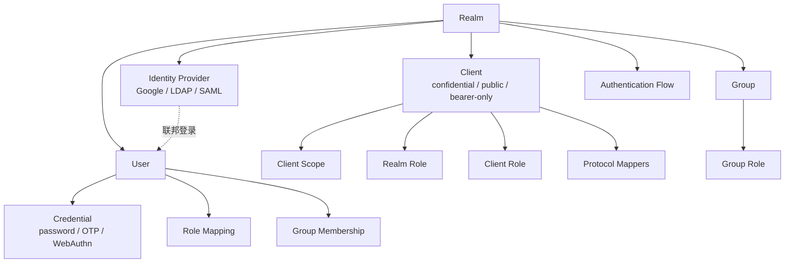
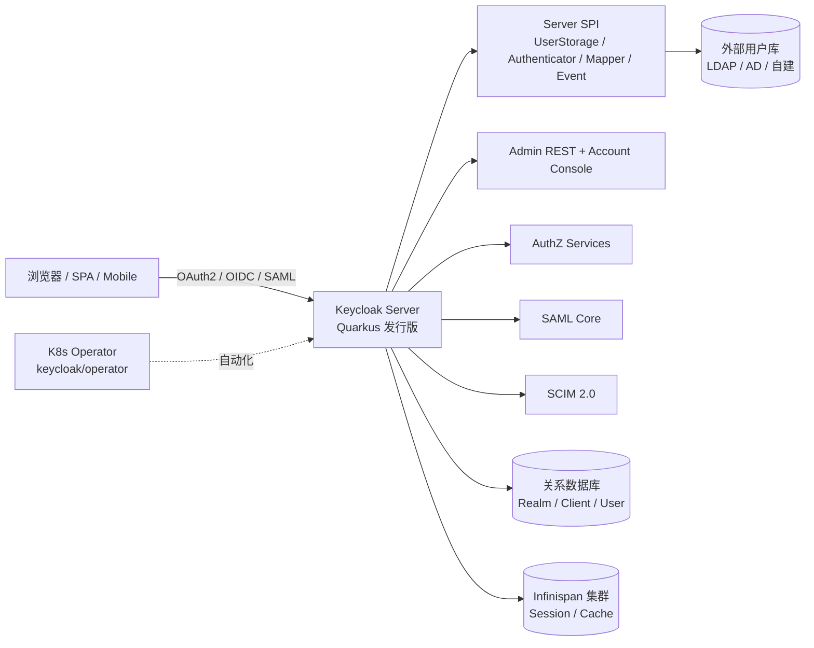
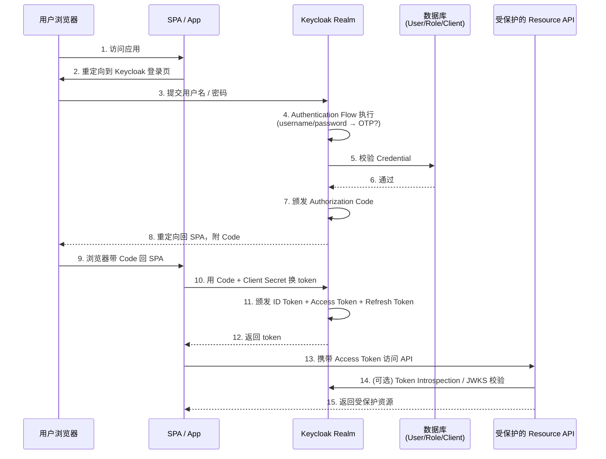

## 学习目标

完成本文阅读后，你将能够：

1. 解释 Keycloak 在 IAM / SSO 领域的定位、它解决的问题边界，以及它与 Auth0、Okta、Cognito 等托管服务的关系。
2. 说出 OAuth2、OIDC（OpenID Connect）、SAML 2.0 三套协议在 Keycloak 中的角色，以及选 Realm 还是选外部 IdP（Identity Provider，身份提供方）的判断点。
3. 掌握 Realm / Client / Role / User / Group / Identity Provider 六大数据模型，以及它们在授权决策中的协作方式。
4. 描述 Keycloak 当前以 Quarkus 发行版取代 WildFly 发行版的工程背景与收益。
5. 在团队场景里判断"自建 Keycloak"还是"接入 Auth0 / Okta"的决策点与运维代价。

## 目录

1. [项目定位：开源 IAM/SSO 的事实标准之一](#项目定位开源-iamsso-的事实标准之一)
2. [协议面：OAuth2、OIDC、SAML 2.0 三层堆叠](#协议面oauth2-oidc-saml-20-三层堆叠)
3. [模型面：Realm / Client / Role / User / Group / Identity Provider](#模型面realm--client--role--user--group--identity-provider)
4. [架构面：Quarkus 发行版、Quarkus 主题、Admin REST 与 SPI](#架构面quarkus-发行版quarkus-主题admin-rest-与-spi)
5. [系统地图：从浏览器登录到访问受保护资源的完整链路](#系统地图从浏览器登录到访问受保护资源的完整链路)
6. [Keycloak vs Auth0：自建与托管的工程权衡](#keycloak-vs-auth0自建与托管的工程权衡)
7. [适用边界与采用顺序](#适用边界与采用顺序)
8. [决策清单](#决策清单)
9. [动手练习](#动手练习)
10. [自测清单](#自测清单)
11. [进阶路径](#进阶路径)

## 项目定位：开源 IAM/SSO 的事实标准之一

Keycloak 是 `keycloak/keycloak` 仓库下的开源身份与访问管理（Identity and Access Management，IAM）服务器，对外提供单点登录（Single Sign-On，SSO）、用户联合（user federation）、用户管理、细粒度授权等能力。README 把这层价值压缩成两句话：`Add authentication to applications and secure services with minimum effort. No need to deal with storing users or authenticating users.`。第一句承诺"接入成本低"，第二句承诺"不需要自己实现用户存储"。

截至 2026 年 6 月，仓库的统计指标如下：

| 指标 | 数值 |
|------|------|
| GitHub Stars | 35,351 |
| Forks | 5,900+（页面显示） |
| 主语言 | Java |
| License | Apache 2.0 |
| 最新稳定版 | 26.6.4（2026-06-26 发布） |
| 当前累计 Release 数 | 108+ |
| Commit 数 | 31,446 |
| 治理 | CNCF Incubating 项目 |
| 安全合规 | OpenSSF Best Practices 已认证、OpenSSF Scorecard、CLOMonitor |

Keycloak 的项目治理写得很清楚：`Keycloak aims to be easy to use and lightweight. The project was founded to make it easy for application developers to secure modern applications and services. The 80/20 rule, that states 80% of requirements come from around 20% of use cases, is a core part of the vision behind Keycloak.`。这条"80/20"声明是 Keycloak 与 Okta / Auth0 思路的关键差异——Keycloak 把"覆盖大多数常见用例、不追求大而全"作为核心目标，而 Okta / Auth0 更倾向于"用托管服务兜底长尾"。这两条路线都有自己的合理性。

生产采纳方在仓库 `ADOPTERS.md` 里有一份公开名单：CERN（欧洲核子研究组织）、Bundesagentur für Arbeit（德国联邦就业局）、Hewlett-Packard Enterprise、Hitachi、Wayfair、Okta 等都在其上。Okta 自身也出现在名单里，意味着 IdP（身份提供方）厂商同时使用 Keycloak 作为自家某些产品的依赖，这一点对评估 "Keycloak 是不是生产可用"很有参考价值。

## 协议面：OAuth2、OIDC、SAML 2.0 三层堆叠

Keycloak 不是单一协议服务器，而是同时承担 OAuth2 授权服务器、OIDC 提供方、SAML 2.0 IdP 三种角色。下面这张表把它们的关系理清楚：

| 协议 | 角色定位 | Keycloak 中的角色 | 典型客户端 |
|------|----------|------------------|----------|
| OAuth2 | 授权框架（authorization framework） | 颁发 access token | 移动 App、单页应用、后端服务 |
| OIDC | 身份层（identity layer） | 在 OAuth2 之上颁发 ID Token（JWT） | 任何需要"我是谁"信息的前端 / 后端 |
| SAML 2.0 | 旧式企业 SSO 协议 | 直接做 IdP，颁发 SAML Assertion | 老式企业 Java 应用、企业 SaaS |

OAuth2 解决的是"客户端拿什么凭证去访问资源"——颁发 access token。OIDC 在 OAuth2 之上加了 ID Token（通常是 JWT，JSON Web Token），把"用户身份"标准化为可验证的声明（claim）。SAML 2.0 是更老的企业协议，用 XML Assertion 而不是 JSON，在传统企业 Java / .NET 应用里仍然普遍。

Keycloak 的"现实"是：协议面是抽象层，应用真实接入时往往只用其中一种。对现代 Web 应用来说，OIDC 是默认选项；对需要兼容旧系统的企业 SSO 场景，SAML 2.0 仍然必要；对纯后端到后端的 mTLS（mTLS 即双向 TLS 认证）或 client credentials 场景，OAuth2 即可，不需要 ID Token。

## 模型面：Realm / Client / Role / User / Group / Identity Provider

Keycloak 的"核心"不是协议而是数据模型。所有协议最终都映射到这六个对象，理解了它们之间的相互关系，就理解了 Keycloak 80% 的日常操作。



### Realm：隔离的命名空间

Realm 是 Keycloak 中"独立租户"的最小单位。每个 Realm 拥有独立的用户、客户端、角色、Identity Provider 配置，相互完全隔离。一个 Keycloak 实例可以承载多个 Realm，常见用法是：

- 一个 Realm 对应一个环境（dev / staging / prod）。
- 一个 Realm 对应一个业务线（consumer / enterprise / partner）。
- 一个 Realm 对应一个外部客户（多租户 SaaS）。

Realm 之间不共享用户、客户端、角色，这是 Realm 与 Auth0 Organization / Okta Org 的核心差异——Keycloak 的隔离是数据层硬隔离，Auth0 / Okta 是单租户内的逻辑隔离。

### Client：受保护的应用

每个接入 Keycloak 的应用都是一个 Client。Client 有三个关键属性：

- `clientId`：应用的逻辑标识，与 OAuth2 的 `client_id` 对应。
- `protocol`：`openid-connect` 或 `saml`，决定用 OIDC 还是 SAML 接入。
- `accessType`：`confidential`（有 secret）、`public`（SPA / 移动 App）、`bearer-only`（纯校验 token，不参与流程）。

一个常见但错误的认知是"每个应用必须单独建 Client"。实际上，同一个 Realm 里多个共享同一身份协议的应用，可以共享 Client Scope 与 Role，避免重复配置。

### Role：Realm Role 与 Client Role

Role 是 Keycloak 授权模型的"载体"，分两层：

- **Realm Role**：跨 Client 共享的角色，适合"管理员 / 普通用户 / 财务审批"这种全局身份。
- **Client Role**：绑定到具体 Client 的角色，适合"订单系统的 read-only / write"这种细粒度权限。

日常配置的核心问题是：到底用 Realm Role 还是 Client Role？粗略规则是"5 个 Client 以下用 Realm Role，5 个以上、权限矩阵开始复杂的用 Client Role"。但这不是绝对规则——很多团队全部用 Realm Role 也能跑通。

### User、Group 与 Identity Provider

- **User**：终端用户。`Credential` 是用户认证凭证（密码、OTP、WebAuthn、X.509 证书等）。
- **Group**：用户的逻辑分组，Role 可以绑定到 Group 上，从而实现"把 Role 赋给一组用户"的批量管理。
- **Identity Provider**：外部身份来源——Google、GitHub、企业 LDAP、SAML IdP、OIDC IdP 等。Keycloak 支持把这些外部身份映射到本地 User 上，是 SSO 联邦（federation）的核心机制。

### Authentication Flow：登录流程编排

Authentication Flow 是 Keycloak 中"登录是怎么完成的"的可视化配置。一个典型的 Browser Flow 形如：

```
Username/Password Form → Conditional OTP → Success / Failure
```

Keycloak 内置了 browser、direct grant、reset credentials、client authentication 等多个 Flow，每个 Flow 由若干可配置的 Executor 组成。这种 Flow 模型让"登录流程的可视化编辑"成为可能——管理员不用改代码就能调登录步骤的顺序、强制某步骤、跳过某步骤。

## 架构面：Quarkus 发行版、Quarkus 主题、Admin REST 与 SPI

Keycloak 当前以 Quarkus 为运行时取代了历史的 WildFly 发行版。从仓库根目录可以看到，Quarkus 相关目录（`quarkus/`、`quarkus/deployment`、`quarkus/dist`、`quarkus/runtime`）在目录列表中占据了相当大的权重；同时 `core/`、`server-spi/`、`services/`、`rest/`、`model/`、`federation/`、`authz/`、`scim/`、`saml-core/`、`saml-core-api/`、`crypto/`、`crypto/default/`、`js/`、`operator/`、`themes/` 等目录构成了 Keycloak 的完整工程结构。



### SPI（Server SPI）

Keycloak 通过 `server-spi/` 与 `server-spi-private/` 把核心能力抽象成 SPI（Service Provider Interface，服务提供方接口）。常见的 SPI 包括：

- `UserStorageProvider`：用户存储 SPI，把外部用户库（LDAP、Active Directory、自建用户库）接入 Keycloak。
- `Authenticator`：自定义登录步骤，可以插入到 Authentication Flow 中。
- `ProtocolMapper`：把 ID Token / access token 中的 claim 做转换。
- `EventListener`：监听登录、登出、token 颁发等事件，异步触发副作用。

SPI 是 Keycloak 工程师能力的最大弹性出口——团队可以用 SPI 接入任何已有的用户库，不需要把用户数据搬到 Keycloak。

### Quarkus 发行版

从仓库根目录看，Keycloak 的发行版构建在 `quarkus/dist/` 目录下，开发者只需运行：

```bash
./mvnw -pl quarkus/deployment,quarkus/dist -am -DskipTests clean install
```

便能在 `quarkus/dist/target` 找到 ZIP 发行版。生产启动命令是 `bin/kc.[sh|bat] start-dev`（开发模式）或 `bin/kc.[sh|bat] start --hostname-strict=false`（生产模式）。

切到 Quarkus 之后，Keycloak 获得了三件事：更快的启动时间、更低的内存占用、原生编译（GraalVM native image）的能力。这些对 Kubernetes / Serverless 场景意义重大。

### Admin REST

Keycloak 通过 `rest/` 目录提供 Admin REST API，几乎所有管理操作都能通过 API 完成。这意味着 Realm、Client、Role、User 的增删改查都可以脚本化、CI 化、Terraform 化——这是 Keycloak 与传统企业 IAM 的关键区别。

### 高可用与集群

Keycloak 集群模式依赖外部 Infinispan（分布式缓存）做 session 同步，需要外部数据库做 Realm / User 持久化。Keycloak 26 之后的 Quarkus 发行版在集群配置上做了简化，但 "Keycloak 是无状态应用" 这个认知是错的——它的 session 与 Realm 配置本身是有状态的，需要外部依赖。

## 系统地图：从浏览器登录到访问受保护资源的完整链路

下面这张流程图把一次"用户通过 OIDC 登录到 Keycloak，再访问受保护的 SPA"的全过程串起来，所有节点都对应 Keycloak 真实的 crate / 目录：



关键节点的几条工程经验：

- **步骤 4 是可编排的**。Authentication Flow 让"加 WebAuthn / 强制 MFA / 跳过某步骤"这些需求不需要改代码。
- **步骤 7-12 是 OIDC Code Flow**。如果 SPA 是纯前端无后端，要走 PKCE（Proof Key for Code Exchange，代码交换证明密钥）扩展，避免 authorization code 被拦截。
- **步骤 14 是关键**。Resource API 必须校验 Access Token 的签名与有效期，否则"信任 token"等于"信任 Keycloak"——而 Keycloak 只是颁发者，不参与每次访问。

## Keycloak vs Auth0：自建与托管的工程权衡

把 Keycloak 单独讲很难讲清楚它的市场定位。Auth0 是这条赛道里最常被拿来对比的托管服务，二者面向同一类用户（需要 IAM/SSO 的工程团队），但工程思路完全不同。

| 维度 | Keycloak（自建） | Auth0（托管） |
|------|----------------|--------------|
| 部署模型 | 自托管（VM / K8s / Operator） | 托管 SaaS |
| License | Apache 2.0（CNCF Incubating） | 商用订阅 + 免费层 |
| 协议支持 | OAuth2、OIDC、SAML 2.0 全部一等公民 | OAuth2、OIDC、SAML 2.0 全部一等公民 |
| 用户库 | 内置 + UserStorageProvider 接入外部 | 内置 + 自建 connector |
| 定制能力 | SPI 深度定制、Authentication Flow 可视化编排 | Actions / Rules / Hooks |
| 运维责任 | 数据库、Infinispan、备份、灾备、版本升级 | Auth0 团队负责 |
| 合规 | 取决于自建环境合规设计 | SOC2 / ISO 27001 / HIPAA / GDPR 由 Auth0 持有 |
| 学习曲线 | 中（SPI 与 Quarkus 启动选项需要学习） | 低（Web 控制台 + 文档） |
| 长期成本 | 基础设施 + 运维人天 | 按 MAU（Mountain per Active User）计费 |

"自建 Keycloak"和"接入 Auth0"是两种不同的工程路线，不是简单的"开源 vs 商业"。下面三条是常见的决策点：

1. **数据驻留要求**。如果合规要求"用户数据不能离开自己的数据中心"，自建 Keycloak 是少有的合规路径之一。
2. **团队规模与运维能力**。Keycloak 的运维包括数据库备份、Infinispan 集群调优、版本升级、SPI 升级——团队必须有 SRE 能力。Auth0 把这些全部隐藏。
3. **协议与生态广度**。Keycloak 对 SAML 2.0、SCIM（System for Cross-domain Identity Management，跨域身份管理系统）、AuthZ（authorization）、FAPI（Financial-grade API，金融级 API）这些老牌 / 专业协议的支持深度极高，托管服务在长尾协议上可能缺失。

## 适用边界与采用顺序

Keycloak 解决的是"统一身份与访问管理"的需求。它不解决：身份保险（这是 1Password / Bitwarden 的工作）、社交登录的 UX 细节（这是 OAuth 客户端 SDK 的工作）、硬件安全密钥（这是 YubiKey 等设备厂商的工作）。

**适合 Keycloak 的场景**

- 工程团队需要把"用户库 / 登录 / 授权"统一收口到一套系统，不再让每个应用各自实现。
- 数据合规要求"用户身份数据留在自己的数据中心"。
- 需要同时支持 OAuth2、OIDC、SAML 2.0 三套协议，且需要长期维护。
- 已经有 LDAP / Active Directory 等用户库，需要把这些用户库联邦进来。

**不适合 Keycloak 的场景**

- 创业期小团队——Keycloak 的运维成本是真实的，托管服务在 5 人以下团队里几乎一定更划算。
- 没有运维人——Keycloak 升级、备份、灾备都需要人来管。
- 只需要"一个登录页"——这种场景一个 SaaS 登录组件（Auth0 Lock、Clerk、WorkOS）就够了。

**采用顺序建议**

1. 用 `bin/kc.sh start-dev` 跑通本地最小实例，建一个 Realm、一个 Client、一个测试用户。
2. 把 OIDC Code Flow 接进一个 SPA，验证登录、token 刷新、登出三条主链路。
3. 接入外部 Identity Provider（Google 或企业 LDAP），验证联邦登录。
4. 用 SPI 接入真实用户库，替换"内置测试用户"。
5. 上 Quarkus 集群模式 + 外部数据库，做生产部署。

## 决策清单

把"是否在团队里采用 Keycloak"压缩成五问：

- [ ] 团队有 SRE / 平台工程能力，能运维数据库、Infinispan 集群、版本升级？
- [ ] 数据合规要求或成本敏感性要求"自建"路径？
- [ ] 需要 OAuth2 + OIDC + SAML 2.0 三套协议长期并存？
- [ ] 团队规模足够大，单凭托管服务的费用结构已不划算？
- [ ] 已有用户库（LDAP / AD / 自建）需要联邦进来？

五个全勾，再决定采用 Keycloak。任意一项打勾不到，意味着先要补齐前置条件或重新评估托管服务。

## 动手练习

下面三条练习覆盖 Keycloak 的核心机制，从最小可运行到接近生产配置：

1. **最小 Realm 与 Client**。本地 `bin/kc.sh start-dev` 启动，访问 `http://localhost:8080`，用 admin 账号登录 Admin Console，建一个 Realm `demo`，建一个 Client `demo-spa`（accessType=public，root URL=http://localhost:3000），在 Realm 内建一个测试用户 `alice`。访问 Account Console 用 alice 登录一次。
2. **OIDC Code Flow 接入**。写一个最小 Node.js / Python SPA，用任意 OIDC 客户端库对接 `demo-spa`，走通 redirect → code → token → 调受保护 API 的完整链路。用 `curl http://localhost:8080/realms/demo/protocol/openid-connect/certs` 拿 JWKS，手动校验 ID Token 签名。
3. **SPI 自定义 UserStorageProvider**。写一个最简 SPI 实现，从一个 JSON 文件读用户列表，让 Realm 通过它做用户认证，理解 SPI 是 Keycloak 工程师能力的最大弹性出口。

## 自测清单

完成上述练习后，对照下列检查点自查：

- [ ] 能区分 OAuth2、OIDC、SAML 2.0 在 Keycloak 中各自承担的角色。
- [ ] 能说出 Realm、Client、Role、User、Group、Identity Provider 六大数据模型的相互关系。
- [ ] 能解释 Authentication Flow 在登录流程可编排化中的关键作用。
- [ ] 能说清 Keycloak 切到 Quarkus 发行版的工程背景与收益。
- [ ] 能在 Keycloak 与 Auth0 之间根据团队规模、合规要求、协议广度做出选型判断。

## 进阶路径

完成基础学习后，按下列顺序深入：

1. **SPI 深度定制**。UserStorageProvider、Authenticator、EventListener 是 Keycloak 工程师能力的最大出口，每一个都对应一类常见需求。
2. **Quarkus 原生编译**。GraalVM native image 把 Keycloak 启动时间压到秒级，内存占用压到百兆级，是 Kubernetes / Serverless 场景的关键。
3. **Keycloak Operator**。仓库 `operator/` 目录下是 Kubernetes Operator，自动化部署、滚动升级、备份恢复。
4. **AuthZ 与 FAPI**。细粒度授权（基于策略的访问控制）与金融级 API（Financial-grade API）合规，是 Keycloak 在企业场景里的差异化能力。
5. **SCIM 与用户供给**。`scim/` 目录下是 SCIM 2.0 实现，让企业用户库与 Keycloak 之间做用户供给自动化。