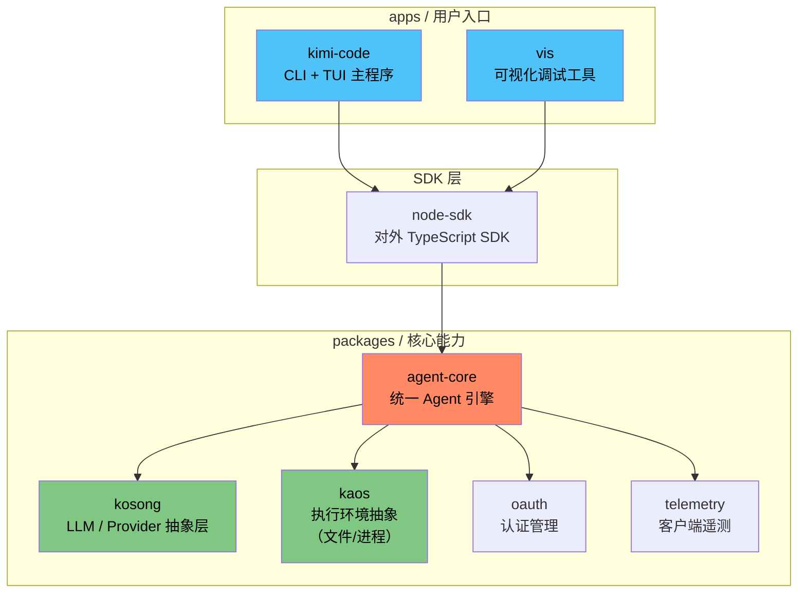

# Kimi Code CLI：Moonshot AI 的终端 AI 编程助手架构解析

2026 年 5 月 22 日，Moonshot AI 悄悄在 GitHub 上创建了一个新仓库：`MoonshotAI/kimi-code`，标题叫"The Starting Point for Next-Gen Agents"。发布第一天就有 134 个 Star——对于一个没有提前预热、没有发布会、只靠社区自发发现的仓库来说，这个起点不算惊艳，但也不小。更值得关注的是它的发布方式：**单二进制命令行工具**，一行 shell 脚本装完直接跑，不需要预装 Node.js，不需要配环境变量。这种分发姿态，针对的不是"玩玩看"的开发者，而是准备把它塞进日常工作流的那批人。

读完它的源码和架构之后，我最大的感受是：Moonshot AI 在这件事上花精力的地方，和市面上多数 AI CLI 工具不太一样。它不是把模型 API 包一层 TUI 壳就交差——它在做一套可以被单独拆出来用的 Agent 引擎。

## Monorepo 架构：一张图看清全局

仓库遵循典型的 monorepo 布局，`apps/` 承载面向用户的程序，`packages/` 承载可复用的底层能力。下面这张图比文字更容易说清楚各模块的职责和依赖关系：



图中最关键的一条边是 `kimi-code → node-sdk → agent-core`。CLI 不能直接依赖 `agent-core`，必须通过 `node-sdk` 这个中间层走。这不是多余的封装——这是在明确告诉所有潜在的二次开发者：如果你要在自己的应用里接入这套 Agent 引擎（比如做一个 VS Code 插件或一个 Web 服务），用 `node-sdk` 就够了，不需要把整个 CLI 的依赖树拖进来。

这种约束在开源项目里并不多见。大多数 monorepo 项目是"先有 CLI，后来发现需要 SDK，于是抽一层出来"，而 Kimi Code CLI 从一开始就把这个边界划好了。这说明团队在架构设计阶段就考虑过一个问题：**这个引擎将来要被别人用在别的地方。**

## 对手是谁：API 包装器 vs. Agent 系统

理解 Kimi Code CLI 的定位，需要先搞清楚一个分野。

市面上你能看到的"AI 编程 CLI"大致分两类。第一类是模型能力的命令行透传——你在终端里发一句话，它调一次 API，把结果打出来。这类工具的核心代码可能不超过 500 行，本质是 HTTP Client + Pretty Printer。

第二类则是端到端的 Agent 系统。它不只是在你和模型之间传话，而是自己管理 session 生命周期、tool use 编排、子任务分发、权限控制、持久化。这类系统的复杂度不在"能不能调通 API"，而在"当多个子系统同时运转时，故障怎么隔离、状态怎么收敛、用户怎么干预"。

Kimi Code CLI 属于第二类。它内部有 **多子 Agent 并行调度**、**会话级生命周期 hooks**、**MCP 协议原生集成**、**可插拔 Provider 抽象层**。这些组件通常只出现在公司内部的基础设施里，不会轻易开源。Moonshot AI 这次选择公开，等于把自家 Agent 基础设施的架构设计摊开给你看。

## 上手：两分钟装完，一个命令跑起来

macOS 或 Linux 下一行搞定：

```sh
curl -fsSL https://code.kimi.com/kimi-code/install.sh | bash
```

Windows PowerShell：

```powershell
irm https://code.kimi.com/kimi-code/install.ps1 | iex
```

装完验证：

```sh
kimi --version
```

然后进入项目目录直接跑：

```sh
cd your-project
kimi
```

TUI 启动后敲 `/login` 选择认证方式：Kimi Code OAuth（浏览器授权，适合个人用户）或 Moonshot AI Open Platform API Key（适合自有 Key 的开发者）。登录后随便丢一个自然语言任务进去就能验证会话是否正常——比如"帮我看看这个项目的目录结构，简单介绍一下每个目录是做什么的"。

## 子 Agent 系统：一个人拆成三个人用

Kimi Code CLI 内置了三个专用子 Agent，各自跑在隔离上下文中，主对话通过消息路由把任务分发过去。这个设计的灵感显然是来自人类团队的协作模式——你不会让同一个人既做调研又写代码还同时做方案评审，你会把任务分给不同的人，让他们并行工作。

三个子 Agent 的分工如下：

| 子 Agent | 职责 | 什么时候用它 |
|----------|------|-------------|
| `coder` | 代码生成与修改 | 需要改文件、写新模块、重构代码 |
| `explore` | 代码探索与解读 | 需要理解项目结构、搜索符号、追踪引用链 |
| `plan` | 任务拆解与规划 | 复杂任务分解、方案设计、步骤编排 |

这里有一个容易被忽略的设计取舍：主 Agent 的上下文窗口是有限的。如果你在一个 session 里同时做探索和编码，很快上下文就会被中间结果塞满，导致后续推理质量下降。子 Agent 的隔离上下文本质上是一个**上下文预算管理策略**——把探索阶段的中间产物隔离在 `explore` 的 session 里，主对话只接收结论，节省了宝贵的窗口空间。

实际使用时，你不需要显式指定"请用 explore 子 Agent"——主 Agent 会自己判断任务性质并路由。但如果你明确知道该用什么，也可以直接指定，跳过主 Agent 的判断环节，减少一次 LLM 调用。

## MCP 配置：从手写 JSON 到对话式管理

MCP（Model Context Protocol）允许 AI Agent 调用外部工具和数据源。传统做法是在某个 JSON 配置文件里声明 MCP 服务器的地址、认证凭据、能力列表。出问题的时候，你需要退出 TUI、打开编辑器、改 JSON、重启服务——整套流程打断感很强。

Kimi Code CLI 的做法是把这套流程搬进 TUI 内部。用 `/mcp-config` 命令可以对话式地添加、编辑和认证 MCP 服务器，全程不需要离开终端，也不需要手动维护 JSON。这是制作终端工具的一个细节但重要的思路：**凡是需要在工具外部完成的配置操作，都值得被搬进工具内部。**

## 视频输入：让 Agent"看"你做了啥

Kimi Code CLI 支持把屏幕录制或演示视频文件拖进对话，Agent 会分析视频内容后再做出响应。这个功能的场景非常明确——有些问题是"说不清楚但看得清楚"的。比如一个 UI 渲染异常的 Bug，你在文字里描述"右上角的按钮在点击后没有按预期弹出下拉菜单"，不如直接录一段屏幕扔进去。

这个能力对远程协作场景尤其有价值。团队成员遇到问题时，录一段视频丢给 Agent，比 Slack 里来回讨论五分钟高效得多。

## 生命周期 Hooks：不是玩具，是能落到流程里的

Hooks 机制是 Kimi Code CLI 从"个人工具"走向"团队工具"的关键设计。它在以下节点提供了钩子点：

- **高风险工具调用前**：在执行 `rm -rf`、文件删除操作、网络请求前触发人工审批流程
- **Agent 决策后**：记录每次决策的上下文和触发条件，用于事后审计
- **任务完成后**：推送桌面通知、触发本地脚本
- **自定义节点**：对接内部 CI/CD 流水线或工单系统

这相当于在 Agent 的自主行为和团队的安全策略之间插了一层可编程的控制面。对于把安全审计当硬性要求的团队来说，这个设计不是加分项，是必选项。

## 实战案例：一次跨文件的 Bug 修复全流程

下面是一个真实场景的完整走查——你会看到上面提到的所有组件是怎么协同工作的。

**背景：** 一个 Express.js 项目中，`POST /api/orders` 接口在高并发场景下偶尔返回 500，日志里只有"Transaction timeout"的错误信息，没有堆栈。

**用户输入：**

```
帮我排查这个接口报 500 的原因，项目里涉及订单相关的代码在 src/orders/ 下，数据库用的是 PostgreSQL。
```

**第一步：`explore` 子 Agent 出场。** 主 Agent 判断这是"理解项目 + 搜索问题"型任务，将请求路由给 `explore`。`explore` 会做三件事：

1. 用 `file_read` 遍历 `src/orders/` 下所有文件，构建模块依赖图
2. 用 `bash` 执行 `grep -r "Transaction" src/orders/` 查找事务相关代码
3. 读取 `package.json` 和 `docker-compose.yml` 确认数据库连接配置

`explore` 的发现被压缩成一段结论返回给主对话：项目使用 `pg` 库管理 PostgreSQL 连接，订单创建逻辑在 `src/orders/service.ts` 的 `createOrder` 函数中，该函数使用了手动事务管理但缺少超时处理。

**第二步：`plan` 子 Agent 制定修复方案。** 主 Agent 把 `explore` 的分析结论交给 `plan`，让它拆解修复步骤：

1. 在 `createOrder` 中为事务添加 `statement_timeout` 设置
2. 在 `db.ts` 中增加连接池级别的 `idleTimeoutMillis` 和 `max` 配置
3. 在事务失败时增加重试逻辑（最多 3 次）
4. 补充结构化日志，记录每次事务的耗时

**第三步：Hooks 介入。** 如果团队配置了 `pre-tool` hook，在 `plan` 的方案涉及文件修改前，TUI 会弹出审批提示，列出即将修改的文件清单。用户确认后，`coder` 子 Agent 才被允许执行修改。

**第四步：`coder` 子 Agent 并行执行。** `plan` 拆出的四个步骤中，第 1、2、4 步没有依赖关系，`coder` 可以并行调度三个实例分别处理。修改完成后，`coder` 会自动运行 `npm test` 验证改动没有引入回归。

**第五步：视频辅助验证（可选）。** 如果用户之前录制过"高并发下接口行为"的屏幕录像，可以在这一步把视频拖进对话，让 Agent 对比修复前后的行为变化。

**整个流程中各组件的参与：**

| 阶段 | 涉及组件 | 作用 |
|------|----------|------|
| 探索代码 | kaos (`file_read`, `bash`) | 文件 I/O 和命令执行 |
| 连接模型 | kosong | 对接 LLM Provider 做推理 |
| 任务拆解 | agent-core (plan sub-agent) | 分析结论 → 方案输出 |
| 安全审批 | Hooks (pre-tool) | 拦截高风险文件修改 |
| 代码修改 | agent-core (coder sub-agent) | 并行执行文件变更 |
| 结果返回 | TUI | 流式展示修改过程和测试结果 |

从用户角度看，整个过程只有三件事：输入问题 → 确认修改 → 看结果。但底层的调度、隔离、审批、验证全部由 Agent 引擎自动完成。

## Provider 抽象层：kosong 的价值

`kosong` 是 Kimi Code CLI 的 LLM Provider 抽象层，名字来自印尼语的"空"，可以理解成"一个空的容器，装上什么模型就是什么模型"。它把 LLM 通信接口做了标准化封装，不绑定任何特定模型厂商。

两件事：

1. **现在**：你可以用 Moonshot 的 Kimi 模型，也可以接入任何兼容 OpenAI Chat Completions API 的第三方模型
2. **将来**：如果出现更好的模型或新的提供商，只需要在 `kosong` 层增加一个 adapter，上层 Agent 逻辑不需要任何改动

`kosong` 被独立成一个 package，而不是塞在 `agent-core` 里，说明 Moonshot AI 在故意保持它的可复用性。一个合理的推测是：未来 Moonshot 可能会单独推广 `kosong`，让它在 Kimi Code CLI 之外也能被使用，就像 AWS 把内部工具开源那样。

## 执行环境抽象：kaos 的双面价值

`kaos` 封装了文件系统和进程相关的底层操作，对外暴露 `execute`、`read_file`、`write_file` 等统一原语。它有两个层面的价值：

**测试层面：** Agent 引擎的单元测试不需要依赖真实文件系统。你可以用 mock 的 `kaos` 实例模拟任意文件状态，测试 Agent 在各种边界条件下的行为。这对于 Agent 系统尤其重要——Agent 的行为高度依赖它所"看到"的环境状态，如果不做环境抽象，你就很难构造稳定的测试用例。

**安全层面：** 所有文件系统的操作必须通过 `kaos`，你可以在这层加全局的权限策略。比如限制 Agent 只能在项目目录内读写文件，不能碰 `/etc`、`~/.ssh` 等敏感路径。这个沙箱机制不是事后打的补丁，而是从底层原语级别嵌入的。

## TUI 选型：不造轮子的智慧

Kimi Code CLI 的终端界面构建在 [PROTECTED_67](https://github.com/earendil-works/pi-mono/tree/main/packages/tui) 之上，没有从 terminal escape codes 开始自己做。这个决策本身不复杂，但值得提是因为**太多开源项目在 UI 层耗费了不成比例的早期工程资源**。

选一个现成的、有人维护的 TUI 基础库，把有限的开发力量集中在 Agent 逻辑、权限控制、Provider 抽象这些事情上——这是务实项目的典型特征。你的用户不会因为你用了一个什么终端渲染库而选择你，他们会因为 Agent 给出的答案质量、可靠性和安全可控性而留下来。

## 适用边界

**这些场景下它会很顺手：**

- 你已经习惯在终端里完成大部分开发工作，不希望切换到 IDE 就能获得 AI 辅助
- 你的团队需要把 AI 引入开发流程，但必须有高风险操作的事前审批机制
- 你想基于现有的 Agent 引擎做二次开发，接入自己的工具链和模型

**这些场景下它可能不是最佳选择：**

- 你需要的是零会话状态的单次 API 调用——弄一个 shell function 封装 `curl` 更轻量
- 你的日常工作流深度绑定 IDE（VS Code、JetBrains），希望 AI 辅助和代码补全、跳转定义等功能无缝融合
- 你主要在 Windows 上开发——目前只有 PowerShell 安装方案，没有原生二进制

## 本地开发

想参与贡献或做二次定制：

```sh
git clone https://github.com/MoonshotAI/kimi-code.git
cd kimi-code
pnpm install
```

前置条件：Node.js ≥ 24.15.0，pnpm ≥ 10.33.0。

常用命令：

```sh
pnpm dev:cli
pnpm test
pnpm typecheck
pnpm lint
pnpm build
```

## 常见问题

### Kimi Code CLI 和 GitHub Copilot CLI 有什么区别？

GitHub Copilot CLI 是一个命令建议工具——你描述想做什么，它给你一条 shell 命令。Kimi Code CLI 是一个完整的 Agent 系统——它能理解项目上下文、调度多个子 Agent 并行工作、管理文件修改的权限审批、持久化 session 状态。两者的定位不在同一层。

### 它支持哪些模型？

默认使用 Moonshot 的 Kimi 模型。通过 `kosong` 的 Provider 抽象层，你可以接入任何兼容 OpenAI Chat Completions API 格式的第三方模型。具体配置方式参考项目文档的 Provider 配置章节。

### 子 Agent 的并行是真正的并行还是时间片轮转？

代理模型的 API 调用天然是异步的，多个子 Agent 可以同时发出请求。但实际并行度取决于两个因素：API 的并发限制和模型服务的吞吐能力。在引擎层面，`agent-core` 使用了基于 Promise 的并发控制，可以同时维持多个活跃的子 Agent 会话。

### 生命周期 Hooks 会在本地执行还是在远端执行？

Hooks 配置在本地文件系统中，脚本也运行在本地。不会把 Hook 逻辑上传到任何远端服务。这对于安全合规来说是一个重要细节——你可以放心地在 Hooks 中放审计脚本和审批逻辑，不用担心代码泄露。

### 如果不安装 Node.js，kimi 命令是怎么跑起来的？

发布流程使用的是 Node.js SEA（Single Executable Application，Node 24 的实验性功能），把整个 Node.js runtime、项目源码和依赖打包成一个独立二进制文件。下载解压后直接可执行，不需要用户自行安装 Node.js 运行时。

### 数据是本地处理的还是会上传到云端？

代码和文件内容在 Agent 工作过程中会被发送给 LLM Provider（默认 Kimi 模型，也就是上传到 Moonshot 的服务器）。但 session 元数据、Hook 配置、本地文件状态等不会自动上传。如果你关心数据隐私，建议配置 Provider 时选择私有部署的模型端点。

### Monorepo 里 `agent-core` 和 `node-sdk` 的分工是什么？

`agent-core` 是纯业务逻辑层，包含了 Agent 的调度、路由、子 Agent 管理、tool use 编排等核心能力。`node-sdk` 是 `agent-core` 之上的包装层，提供了稳定的公共 API 和类型导出。CLI 和 VIS 都只依赖 `node-sdk`，不直接触碰 `agent-core` 的内部实现。这样做的好处是：`agent-core` 可以大胆重构内部实现，只要 `node-sdk` 的 API 不变，上游应用就不受影响。

## 自检清单

读完本文后，你可以在自己的场景下做以下检查，看看 Kimi Code CLI 是否适合你：

1. **环境检查**：你的终端环境是 macOS / Linux 还是 Windows？运行 `uname -s` 确认操作系统。如果是 Windows，确认你的 PowerShell 版本 ≥ 5.1。
2. **认证方式选择**：你有 Kimi 账号（走 OAuth）还是 Moonshot AI Open Platform API Key？前者适合个人用户走浏览器授权，后者适合已有 API Key 的开发者或者想接入自托管模型的场景。
3. **项目规模匹配**：你的项目是否超过 50 个文件？如果是小型项目（10 个文件以内），Agent 的探索和规划能力可能过剩。如果是大型 monorepo（200+ 文件），Agent 的上下文管理策略会发挥实际价值。
4. **高风险操作审计需求**：回顾一下你的团队最近半年是否有过"开发者误删文件"或"误执行危险命令"的事故。如果有，评估一下 Hooks 的 `pre-tool` 拦截机制是否能覆盖这些场景。在纸上列出你团队需要拦截的操作类型（如 `rm -rf`、`DROP TABLE`、`kubectl delete` 等）。
5. **MCP 工具集成需求**：你的团队是否已经在使用 MCP 协议连接的内部工具（如内部文档搜索、私有 API 查询等）？如果有，确认这些 MCP 服务器是否兼容 Kimi Code CLI 的 `/mcp-config` 管理方式。如果没有，评估一下引入 MCP 后"Agent 可以自己查内部文档"这个能力对你的工作效率有多大提升。
6. **IDE 集成度评估**：统计你过去一周的工作时间中，有多少是在终端里完成的（如 git 操作、构建命令、日志查看），有多少是在 IDE 里完成的（如代码编辑、断点调试）。如果终端时间占比超过 60%，Kimi Code CLI 的终端原生体验对你更有意义。
7. **团队 onboarding 成本**：估算一下让团队成员安装和使用 Kimi Code CLI 需要多少时间。安装只需一行命令，但理解子 Agent 概念、配置 Hooks、管理 MCP 服务器需要额外的学习投入。如果团队有 5 人以上，可以先安排一个人做深度试用，产出一份内部使用指南后再推广。
8. **隐私与合规审查**：如果你的项目涉及不能离开本机的敏感代码（如付费算法、加密密钥），请务必确认你使用的 LLM Provider 的数据处理政策。Kimi Code CLI 本身不存储或上传代码，但它依赖的 LLM API 会在推理过程中接收你的代码片段。对于合规要求严格的项目，建议配置自托管模型端点。

## 收尾

Kimi Code CLI 有点像是在一片"包装 API"的喧嚣里，安静地把 Agent 引擎这件事正儿八经做了一遍。它的三个核心包——`agent-core`、`kosong`、`kaos`——单独拿出来就是一套完整的 Agent 基础设施。而 CLI 和 TUI 更像是一个示范性的上层应用，告诉你"这套东西可以组装成这样"。

对想在 AI Coding Agent 方向上做技术选型或二次开发的人来说，比起看功能的丰富程度，更值得关注的是它的分层设计：哪层管什么、哪层不能越界碰什么、哪些东西被刻意保持独立以便复用。一个架构清晰的开源项目，比你读十篇 Agent 架构论文更有参考价值。