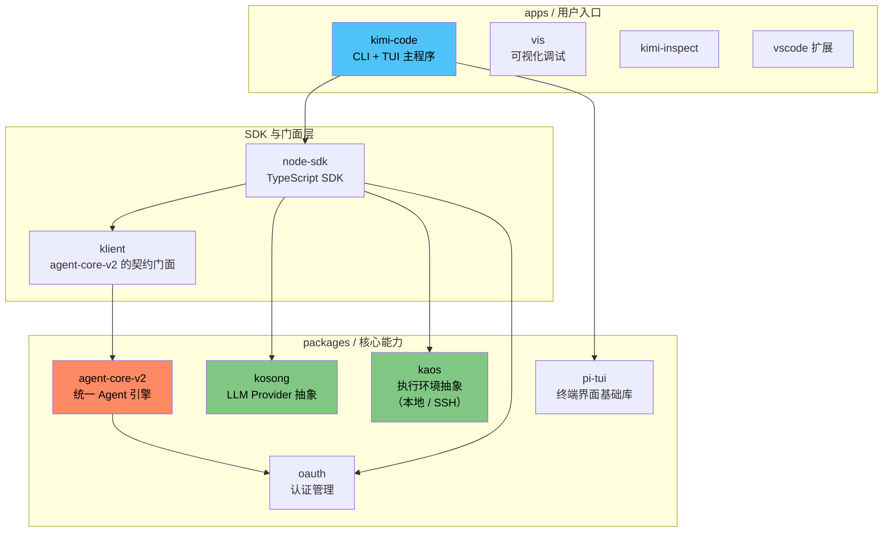

# Kimi Code CLI：Moonshot AI 的终端 AI 编程助手架构解析

## 学习目标

读完本文后，你应该能够：

- 说清楚 Kimi Code CLI 在 AI 编程工具谱里的位置——它不是模型 API 的命令行包装，而是一套端到端的 Agent 系统，CLI 只是它的最上层
- 理解 monorepo 里 `node-sdk`、`agent-core-v2`、`kosong`、`kaos` 几个核心包的分工和依赖方向
- 独立完成安装、登录和第一次会话，知道 OAuth 和 API Key 两种认证方式怎么选
- 会用 `coder`、`explore`、`plan` 三个内置子 Agent，理解上下文隔离为什么值回 token
- 写一条 `PreToolUse` hook 拦截危险命令，并且知道 hooks 的 fail-open 边界在哪里
- 判断它适不适合你的团队：纯终端、IDE 接入（ACP）、基于引擎二次开发，三条路各自怎么走

## 目录

- [一句话定位](#一句话定位)
- [Monorepo 架构：一张图看清全局](#monorepo-架构一张图看清全局)
- [对手是谁：API 包装器 vs. Agent 系统](#对手是谁api-包装器-vs-agent-系统)
- [上手：两分钟装完，一个命令跑起来](#上手两分钟装完一个命令跑起来)
- [子 Agent 系统：一个人拆成三个人用](#子-agent-系统一个人拆成三个人用)
- [MCP 配置：从手写 JSON 到对话式管理](#mcp-配置从手写-json-到对话式管理)
- [视频输入：让 Agent"看"你做了啥](#视频输入让-agent看你做了啥)
- [生命周期 Hooks：不是玩具，是能落到流程里的](#生命周期-hooks不是玩具是能落到流程里的)
- [实战案例：一次跨文件的 Bug 修复全流程](#实战案例一次跨文件的-bug-修复全流程)
- [Provider 抽象层：kosong 的价值](#provider-抽象层kosong-的价值)
- [执行环境抽象：kaos 的双面价值](#执行环境抽象kaos-的双面价值)
- [TUI 选型：不造轮子的智慧](#tui-选型不造轮子的智慧)
- [适用边界](#适用边界)
- [本地开发](#本地开发)
- [常见问题](#常见问题)
- [自检清单](#自检清单)
- [自测题](#自测题)
- [练习](#练习)
- [进阶路径](#进阶路径)
- [资料口径说明](#资料口径说明)

## 一句话定位

2026 年 5 月 22 日，Moonshot AI 在 GitHub 上开放了 kimi-code 仓库，副标题只有一句话：The Starting Point for Next-Gen Agents。没有预热，没有发布会，全靠社区自发传播，到 9 月底已经攒下七千七百多颗 star。比数字更能说明问题的是分发姿态：**单二进制命令行工具**，一行 shell 脚本装完直接跑，不要求预装 Node.js，也不用跟全局模块冲突打交道。这种姿态针对的不是"装来玩玩"的开发者，而是准备把它塞进日常工作流的那批人。

读完源码和官方文档，最明显的感受是：Moonshot 在这件事上花力气的位置，和市面上多数 AI CLI 工具不太一样。它没有把模型 API 包一层 TUI 壳就交差——它做的是一套可以单独拆出来用的 Agent 引擎，CLI 只是架在最上面的示范应用。

## Monorepo 架构：一张图看清全局

仓库遵循典型的 monorepo 布局：`apps/` 放面向用户的程序，`packages/` 放可复用的底层能力。`apps/` 下有四个子应用——CLI 主程序 `kimi-code`、可视化调试工具 `vis`、检查工具 `kimi-inspect` 和一个 VS Code 扩展；本文聚焦 CLI，其余三个不展开。核心包的职责和依赖关系如下：


```mermaid
graph TD
    subgraph Apps["apps / 用户入口"]
        CLI["kimi-code<br/>CLI + TUI 主程序"]
        VIS["vis<br/>可视化调试"]
        INSPECT["kimi-inspect"]
        VSCODE["vscode 扩展"]
    end

    subgraph SDK["SDK 与门面层"]
        NODESDK["node-sdk<br/>TypeScript SDK"]
        KLIENT["klient<br/>agent-core-v2 的契约门面"]
    end

    subgraph Core["packages / 核心能力"]
        AC["agent-core-v2<br/>统一 Agent 引擎"]
        KOSONG["kosong<br/>LLM Provider 抽象"]
        KAOS["kaos<br/>执行环境抽象<br/>（本地 / SSH）"]
        OAUTH["oauth<br/>认证管理"]
        PITUI["pi-tui<br/>终端界面基础库"]
    end

    CLI --> NODESDK
    CLI --> PITUI
    NODESDK --> KLIENT
    NODESDK --> KOSONG
    NODESDK --> KAOS
    NODESDK --> OAUTH
    KLIENT --> AC
    AC --> OAUTH

    style CLI fill:#4fc3f7,color:#000
    style AC fill:#ff8a65,color:#000
    style KOSONG fill:#81c784,color:#000
    style KAOS fill:#81c784,color:#000
```

图中最关键的一条链是 `kimi-code → node-sdk → klient → agent-core-v2`。翻开 `apps/kimi-code` 的源码，98 个文件通过 `@moonshot-ai/kimi-code-sdk` 与引擎打交道，直接 import `agent-core-v2` 的只有 2 处，直接碰 `kosong` 的是 0 处。中间还有一个容易漏看的 `klient` 包，官方对它的定义是"contract-driven facade over agent-core-v2"——一层契约驱动的门面，可以跑在 IPC 或内存通道上。

为什么要把 SDK 这层做得这么厚？因为 `node-sdk` 是整个引擎对外唯一的稳定接口。`agent-core-v2` 在自己包的描述里自称 "v2 — DI Scope architecture"，一个还在大改内部结构的引擎，靠外面这层门面把 API 抖动挡住。想在 VS Code 插件或 Web 服务里接这套引擎，依赖 `node-sdk` 就够，不必拖整个 CLI 的依赖树。这个包目前还没发布到 npm（发布配置已经写好，仓库里标记为 private），但"引擎要被别人用"的意图已经写在架构里了。

## 对手是谁：API 包装器 vs. Agent 系统

理解 Kimi Code CLI 的定位，需要先看清一个分野。

市面上的"AI 编程 CLI"大致分两类。第一类是模型能力的命令行透传——你在终端里发一句话，它调一次 API，把结果打出来。这类工具的核心代码可能不超过 500 行，本质是 HTTP Client + Pretty Printer。

第二类是端到端的 Agent 系统。它不只是在你和模型之间传话，而是自己管理 session 生命周期、tool use 编排、子任务分发、权限控制、持久化。这类系统的复杂度不在"能不能调通 API"，而在"当多个子系统同时运转时，故障怎么隔离、状态怎么收敛、用户怎么干预"。

Kimi Code CLI 属于第二类：多子 Agent 调度、会话级生命周期 hooks、MCP 协议原生集成、可插拔 Provider 抽象层，一样不缺。这些组件一般深藏在公司内部基础设施里，Moonshot 选择把它们连细节一起公开。

## 上手：两分钟装完，一个命令跑起来

macOS 或 Linux 下一行搞定：

```sh
curl -fsSL https://code.kimi.com/kimi-code/install.sh | bash
```

Windows PowerShell：

```powershell
irm https://code.kimi.com/kimi-code/install.ps1 | iex
```

习惯 npm 生态的话，`@moonshot-ai/kimi-code` 也发布在 npm 上，可以走包管理器安装、升级和卸载。

Windows 有一个前置条件：首次启动前需要装 [Git for Windows](https://gitforwindows.org/)，因为 CLI 用它自带的 Git Bash 作为 shell 环境；如果 bash.exe 装在非默认位置，用环境变量 `KIMI_SHELL_PATH` 指定绝对路径。

装完验证：

```sh
kimi --version
```

然后进入项目目录直接跑：

```sh
cd your-project
kimi
```

TUI 启动后敲 `/login` 选择认证方式：Kimi Code OAuth（浏览器授权，适合个人用户）或 Moonshot AI Open Platform API Key（适合已有 Key 的开发者）。登录后丢一个自然语言任务进去验证会话，比如"帮我看看这个项目的目录结构，简单介绍一下每个目录是做什么的"。

## 子 Agent 系统：一个人拆成三个人用

Kimi Code CLI 内置三个专用子 Agent，各自跑在完全隔离的上下文里，由主 Agent 按需派发。这个设计的原型是人类团队的协作方式——你不会让同一个人既做调研又写代码还兼方案评审，你会把任务分给不同的人并行推进。

三个子 Agent 的分工如下：

| 子 Agent | 职责 | 工具边界 |
|----------|------|----------|
| `coder` | 默认子 Agent，通用软件工程 | 与主 Agent 共享大部分工具：读写文件、执行命令、维护待办、调用 Skills |
| `explore` | 代码库探索与解读 | 只读，不修改任何文件 |
| `plan` | 任务拆解与方案设计 | 连 Shell 命令都不提供，专注"想清楚怎么做" |

调度是自动的：主 Agent 根据任务复杂度、上下文消耗和子任务的独立性决定何时派发，你不需要手动指定。当然你可以在对话里直接点名，比如"先用 explore 把相关文件梳理一遍再动手"。每次派发都会在终端以审批请求的形式出现，方便你先看一眼任务描述再放行——除非你提前配置了 allow 规则，或者干脆开了 YOLO 模式。

这里有一个容易被忽略的设计取舍：主 Agent 的上下文窗口是有限的。一个 session 里既做探索又写代码，中间结果很快就会把窗口塞满，拖垮后续推理质量。子 Agent 的隔离上下文实际上是一个**上下文预算管理策略**——探索阶段的中间产物留在 `explore` 自己的会话里，中间思考和工具调用记录不回流，主对话只收结论。官方文档把好处总结为两条：主 Agent 上下文保持精炼；多个子 Agent 可以并行运行，互不干扰。

代价也要说清楚：每个子 Agent 都独立消耗模型 token。简单任务直接让主 Agent 处理更经济。另外三条内置子 Agent 都不能再派发新的子 Agent，委派链到这里必然终止，不存在不受限的递归派发。

子 Agent 还支持后台运行——完成后结果自动回到主 Agent，不用轮询；也可以唤回已有的实例继续推进同一个任务。权限规则继承自主 Agent，主 Agent 通过 `/permission` 或"始终允许"接受的规则，自动覆盖到它派发出的所有子 Agent。

三个内置的之外，你还可以用 Markdown 文件定义自己的 Agent：Frontmatter 声明名称、描述和工具权限，正文就是系统提示词。放在 `~/.kimi-code/agents/`（用户级）或项目的 `.kimi-code/agents/` 目录下，主 Agent 会自动发现，与内置的三个并列使用。

## MCP 配置：从手写 JSON 到对话式管理

MCP（Model Context Protocol）让 AI Agent 能调用外部工具和数据源。传统做法是在某个 JSON 配置文件里声明服务器的地址、认证凭据、能力列表，出了问题就要退出 TUI、打开编辑器、改 JSON、重启——整套流程打断感很强。

Kimi Code CLI 把这套流程搬进了 TUI 内部。`/mcp-config` 是内置的 Skill，可以对话式地添加、编辑 MCP 服务器并处理 MCP OAuth 登录，全程不用离开终端，也不用手动维护 JSON；`/mcp` 则随时列出当前会话里各服务器的连接状态。这是终端工具设计里一个朴素但有效的原则：凡是需要在工具外部完成的配置，都值得搬进工具内部。

MCP 之外还有一层插件生态：可以从官方 marketplace 或任意 GitHub 仓库安装 skills、MCP 服务器和数据源，每次安装的信任级别都会提前展示。

## 视频输入：让 Agent"看"你做了啥

Kimi Code CLI 支持把屏幕录制或演示视频直接拖进对话，Agent 会分析视频内容后响应。README 里给的例子很具体：把参考视频转成 LUT 色彩文件、把长视频剪成短片、把一段屏幕录像变成能跑的代码。

这个功能的场景非常明确——有些问题是"说不清楚但看得清楚"的。比如一个 UI 渲染异常的 Bug，你在文字里描述"右上角的按钮在点击后没有按预期弹出下拉菜单"，不如直接录一段屏幕扔进去。远程协作时也一样：录一段视频丢给 Agent，比在 Slack 里来回讨论五分钟高效得多。

## 生命周期 Hooks：不是玩具，是能落到流程里的

Hooks 的原理一句话能讲完：你预先告诉 CLI"每当发生 X，运行这个脚本"，脚本在你的本机执行，里面可以写任何逻辑。

配置写在 `~/.kimi-code/config.toml` 的 `[[hooks]]` 数组里，每条规则四个字段：

| 字段 | 必填 | 说明 |
|------|------|------|
| `event` | 是 | 触发事件，如 `PreToolUse`、`Notification` |
| `matcher` | 否 | 正则表达式，过滤事件目标；不填匹配全部 |
| `command` | 是 | 触发时运行的 Shell 命令 |
| `timeout` | 否 | 超时秒数，1–600，默认 30 |

触发时，CLI 把事件的详细信息（触发原因、工具名称、命令内容等）打包成 JSON，通过 stdin 传给脚本。脚本的意志由退出码表达：`0` 放行，`2` 阻断，其他值默认放行；标准输出可以附带说明文字，也可以返回一段 JSON 做精细控制（比如 `permissionDecision: "deny"` 加阻断理由）。

可挂的事件有 20 种，覆盖了会话和工具调用的主要节点。常用的几个：

- `PreToolUse`：工具调用前触发，可阻断——危险命令拦截就挂在这里
- `PostToolUse` / `PostToolUseFailure`：工具执行成功或失败后，适合做审计记录
- `Stop` / `StopFailure`：一轮结束时触发，可阻断并追加消息让模型继续
- `SessionStart` / `SessionEnd`：会话启动与关闭，适合挂环境准备和清理脚本
- `SubagentStart` / `SubagentStop`：子 Agent 的启动与完成，可对接内部流水线
- `Notification`：后台任务状态变化，弹出桌面通知

一条真实的拦截规则长这样（示例来自官方文档）：每次 Agent 调用 `Bash` 工具前，检查命令内容，命中 `rm -rf` 就阻断：

```toml
# 写在 ~/.kimi-code/config.toml 里
[[hooks]]
event = "PreToolUse"
matcher = "Bash"
command = "node ~/.kimi-code/hooks/block-dangerous-bash.mjs"
timeout = 5
```

```js
// block-dangerous-bash.mjs：从 stdin 读取事件数据，判断后用退出码表态
let input = '';
process.stdin.on('data', (chunk) => { input += chunk; });
process.stdin.on('end', () => {
  const payload = JSON.parse(input);
  const command = payload.tool_input?.command ?? '';
  if (command.includes('rm -rf')) {
    console.error('检测到危险命令，已阻断');  // stderr 会作为阻断原因展示
    process.exit(2);                          // 退出码 2 = 阻断
  }
  process.exit(0);                            // 放行
});
```

有一个边界必须知道：hooks 是 **fail-open** 的。脚本报错或超时，CLI 默认放行，不会让 hook 异常卡死主流程。官方文档同时明确提醒，正因如此 hooks 适合做提醒和轻量拦截，**不应作为唯一的安全防线**——真正高风险的操作，还是要靠权限审批和人工确认兜底。这相当于在 Agent 的自主行为前面放了一层可编程的轻量控制面，把安全审计脚本、审批联动、桌面通知接到流程里，但控制面的失效模式是"松"，不是"紧"。

## 实战案例：一次跨文件的 Bug 修复全流程

下面用一个真实场景走查——你会看到上面提到的组件怎么协同。

**背景：** 一个 Express.js 项目中，`POST /api/orders` 接口在高并发下偶发 500，日志里只有"Transaction timeout"，没有堆栈。

**用户输入：**

```
帮我排查这个接口报 500 的原因，项目里涉及订单相关的代码在 src/orders/ 下，数据库用的是 PostgreSQL。
```

**第一步：`explore` 出场。** 主 Agent 判断这是"理解项目 + 定位问题"型任务，派发 `explore` 子 Agent（终端会弹出这次派发的审批请求）。`explore` 在自己的只读上下文里做三件事：

1. 遍历 `src/orders/` 下的文件，构建模块依赖关系
2. 执行 `grep -r "Transaction" src/orders/` 查找事务相关代码
3. 读 `package.json` 和 `docker-compose.yml` 确认数据库连接配置

`explore` 的发现被压缩成一段结论返回主对话：项目用 `pg` 库连 PostgreSQL，订单创建逻辑在 `src/orders/service.ts` 的 `createOrder` 函数中，该函数用了手动事务管理但没有超时处理。探索过程产生的全部中间输出，都留在了 `explore` 自己的上下文里。

**第二步：`plan` 制定修复方案。** 主 Agent 把结论交给 `plan`，让它拆解步骤。`plan` 没有 Shell，产出的是纯方案：

1. 在 `createOrder` 中为事务设置 `statement_timeout`
2. 在 `db.ts` 中补连接池的 `idleTimeoutMillis` 和 `max` 配置
3. 事务失败时增加重试（上限 3 次）
4. 补结构化日志，记录每次事务耗时

**第三步：审批与拦截。** 权限模式保持默认时，`coder` 的每次文件修改和命令执行都会先请求批准；如果配置了 `PreToolUse` hook，危险命令会在这里被脚本直接拦下。

**第四步：`coder` 执行。** 方案四步中，第 1、2、4 步互不依赖，可以派给多个 `coder` 并行处理；第 3 步依赖前两步落地后进行。修改完成后，`coder` 利用与主 Agent 共享的工具集运行 `npm test`，确认没有引入回归。

**第五步：视频辅助验证（可选）。** 如果之前录过"高并发下接口行为"的屏幕录像，可以在这一步把视频拖进对话，让 Agent 对比修复前后的行为变化。

**各组件在流程中的位置：**

| 阶段 | 涉及组件 | 作用 |
|------|----------|------|
| 探索代码 | kaos（文件 I/O 与命令执行） | 遍历文件、跑 grep |
| 连接模型 | kosong | 对接 LLM Provider 做推理 |
| 任务拆解 | agent-core-v2（plan 子 Agent） | 分析结论 → 方案输出 |
| 安全拦截 | Hooks + 权限审批 | 拦截危险命令、确认文件修改 |
| 代码修改 | agent-core-v2（coder 子 Agent） | 执行文件变更并跑测试 |
| 结果展示 | TUI | 流式呈现修改过程和测试结果 |

从用户角度看，全程只有三件事：输入问题 → 确认修改 → 看结果。调度、隔离、审批、验证都发生在引擎内部。

## Provider 抽象层：kosong 的价值

`kosong` 是 Kimi Code 的 LLM Provider 抽象层，包描述只有一句："LLM abstraction layer used by Kimi Code"。kosong 在印尼语和马来语里就是"空"，装上什么模型就是什么模型。

它管三件事：

1. **消息与流式类型**：文本、思考（thinking）、工具调用、图像、音频、视频内容统一建模，上游逻辑不必关心各厂商响应格式的差异
2. **Provider 接口与能力矩阵**：定义接入新供应商的标准，每个模型声明自己支持什么能力，内置了 Kimi 的 provider 实现
3. **模型目录（catalog）**：采用 models.dev 风格的元数据，模型清单和接线方式可以按目录解析

落到使用层面：默认走 Kimi 模型，TUI 里的 `/provider` 命令可以交互式添加其他兼容供应商的配置。将来出现更好的模型，在 kosong 层加一个 adapter，上层 Agent 逻辑不用动。

Moonshot 把它做成了 monorepo 里的独立 package，GitHub 上还留着一个同名的 `MoonshotAI/kosong` 仓库（README 已注明开发移入了 monorepo），npm 上暂时搜不到发包。复用是明确的设计意图，只是还没真正对外。

## 执行环境抽象：kaos 的双面价值

`kaos` 封装文件系统和进程操作，包描述同样简洁："Execution environment abstraction used by Kimi Code"。它的 `Kaos` 接口长得很有 Python pathlib 的味道：`readText`、`writeText`、`glob`、`iterdir`、`stat`、`mkdir`、`exec`、`chdir`、`getcwd`——一套统一的文件与进程原语。

它有两个实现值得一提：`LocalKaos` 跑在本地文件系统上；还有一个基于 ssh2 的 SSH 实现，让远程机器上的文件操作和命令执行走同一套原语。也就是说，"Agent 在哪台机器上干活"对这个抽象层是可替换的。

**测试层面：** Agent 引擎的单元测试不需要真实文件系统。用内存实现替换 `kaos`，就能模拟任意文件状态，测试 Agent 在各种边界条件下的行为。这对 Agent 系统尤其重要——Agent 的行为高度依赖它"看到"的环境，不做环境抽象就很难构造稳定的测试用例。

**安全层面：** 把文件和进程操作收口到一层原语，权限策略就有了一个统一的落点——比如限制 Agent 只能在项目目录内读写，碰不到 `/etc`、`~/.ssh` 这类敏感路径。这类约束放在原语层是结构性的，比在每个工具调用处零散打补丁可靠。

## TUI 选型：不造轮子的智慧

Kimi Code CLI 的终端界面没有从 terminal escape codes 写起。官方 README 的致谢一栏写着：TUI 构建在 `pi-tui` 之上——这是 earendil-works/pi（一个 11 万 star 的 AI agent 工具包）里的终端界面库，kimi-code 把它 fork 进了自己的 monorepo（`@moonshot-ai/pi-tui`），在上游之上做定制。README 同时把"启动快"当卖点写明：TUI 毫秒级就绪，开会话没有重量感。

这个决策值得单独一节，因为它对冲的是一个开源项目的常见病：在 UI 层耗费不成比例的早期工程资源。界面库选现成的、有人维护的，甚至直接 fork 过来养，把开发力量集中在 Agent 逻辑、权限控制、Provider 抽象上——用户不会因为你用了哪个终端渲染库而选择你，会因为答案质量、可靠性和安全可控性留下来。

## 适用边界

**这些场景下它会很顺手：**

- 你的工作主战场在终端，不切 IDE 就能拿到完整的 AI 辅助
- 团队要引入 AI 但必须有拦截和审计——hooks 加权限审批正好覆盖
- 你用 Zed 或 JetBrains：`kimi acp` 子命令支持 Agent Client Protocol（ACP），编辑器可以直接驱动一个 Kimi Code 会话，登录一次即可
- 你想基于现成的 Agent 引擎做二次开发——`node-sdk` / `klient` 是预留的接入层

**这些场景下它可能不是最佳选择：**

- 你要的只是零会话状态的单次 API 调用——一个封装了 `curl` 的 shell function 更轻
- 你重度依赖 IDE 原生的补全、跳转定义——ACP 能把会话接进编辑器，但那和编辑器内置的补全体验是两回事
- 你的环境是 Windows 且不方便装 Git for Windows——CLI 的 shell 环境依赖 Git Bash

## 本地开发

想参与贡献或做二次定制：

```sh
git clone https://github.com/MoonshotAI/kimi-code.git
cd kimi-code
pnpm install
```

前置条件：Node.js ≥ 24.15.0，pnpm ≥ 10.33.0。

常用命令：

```sh
pnpm dev:cli    # 以开发模式跑 CLI
pnpm test       # 跑测试
pnpm typecheck  # TypeScript 类型检查
pnpm lint       # oxlint
pnpm build      # 构建所有包
```

## 常见问题

### 它和旧版的 kimi-cli 是什么关系？

MoonshotAI 组织下还有一个 `kimi-cli` 仓库：Python 写的旧版 Kimi CLI，已经归档、不再维护，README 里明确指引新用户改用 Kimi Code CLI。现在说"Kimi CLI"，指的就是本文的 Kimi Code CLI。

### 它支持哪些模型？

默认使用 Moonshot 的 Kimi 模型。通过 `kosong` 的 Provider 抽象层和 `/provider` 命令，可以添加其他兼容供应商的配置；子 Agent 用哪个模型也可以通过 `/secondary-model` 单独指定。

### 子 Agent 的并行是真正的并行吗？

是。每个子 Agent 拥有完全独立的上下文窗口，多个子 Agent 可以并行运行、互不干扰；每个都独立消耗 token，所以简单任务派子 Agent 并不划算。实际并行度还受 API 并发限制和模型服务吞吐的影响。

### 生命周期 Hooks 在本地还是远端执行？

本地。官方文档的原话是"脚本在你的本机执行"——hook 配置和脚本都在本地文件系统里，不会被上传到任何远端服务。审计脚本、审批联动这些逻辑可以放心写在 hook 里。

### 不装 Node.js，kimi 命令是怎么跑起来的？

官方安装脚本下载的是单二进制产物：npm 包 `@moonshot-ai/kimi-code` 的构建流程里有 SEA（Single Executable Applications）打包步骤，把 Node.js runtime 和应用源码打进一个可执行文件。SEA 在 Node.js 里仍是实验性特性，Moonshot 用它解决了"零依赖分发"。习惯 npm 的话也可以直接装 npm 包，两种方式并存。

### 数据是本地处理还是会上传？

Agent 工作过程中，代码和文件内容会作为提示词发送给 LLM Provider——默认就是 Moonshot 的服务器。session 记录、hook 配置等本地产物不会自动上传。对隐私敏感的项目，可以通过 `/provider` 换用自托管或本地端点。

### `agent-core-v2` 和 `node-sdk` 的分工是什么？

`agent-core-v2` 是引擎本体，包描述是"The unified agent engine for Kimi"，调度、路由、子 Agent 管理、tool use 编排都在里面，内部结构仍在快速演进（自称 v2、DI Scope 架构）。`node-sdk` 是它上面的稳定门面，配合 `klient` 这层契约驱动的中间层，把 API 抖动挡在门外——CLI 源码里 98 个文件走 SDK、只有 2 处直接碰引擎，就是这道墙的效果。

## 自检清单

读完本文，可以对照自己的场景过一遍：

1. **环境**：你的日常环境是 macOS、Linux 还是 Windows？Windows 用户确认能装 Git for Windows，并知道 `KIMI_SHELL_PATH` 这个后备选项。
2. **认证方式**：你有 Kimi 账号（走 OAuth 浏览器授权）还是 Moonshot AI Open Platform 的 API Key？前者省事，后者适合已有 Key 或要接自有端点的团队。
3. **项目规模**：十来个文件的小项目，Agent 的探索和规划能力可能过剩；大型 monorepo 里，子 Agent 的上下文隔离才会体现真实价值。
4. **危险操作清单**：写下你团队想拦的操作（`rm -rf`、`DROP TABLE`、`kubectl delete`……），每一条都能对应成一条 `PreToolUse` hook 的 matcher 规则。记得 fail-open 的边界——hooks 是轻量拦截，不是安全防线。
5. **MCP 存量**：团队如果已经在用 MCP 协议接内部工具，确认这些服务器能否通过 `/mcp-config` 接进来；没有的话，评估"Agent 能自己查内部文档"值多少效率。
6. **IDE 依赖度**：如果终端是你的主战场，CLI 原生体验正合适；如果离不开 IDE，先试 `kimi acp` 能不能嵌进 Zed 或 JetBrains 的工作流。
7. **推广成本**：安装只要一行命令，但子 Agent、hooks、MCP 各有一层概念。五人以上团队，先安排一个人深度试用、产出内部指南，再推广。
8. **合规审查**：代码片段会发给 LLM Provider。涉及不能出本机的敏感代码时，先确认 Provider 的数据处理政策，或直接配置自托管端点。

## 自测题

**问题 1**：Kimi Code CLI 和第一类"AI 编程 CLI"（API 包装器）的核心区别是什么？

<details>
<summary>查看答案</summary>
第一类只是命令行透传：发一句话、调一次 API、打印结果，本质是 HTTP Client + Pretty Printer。Kimi Code CLI 是端到端的 Agent 系统：自己管理 session 生命周期、tool use 编排、子任务分发、权限控制和持久化。
</details>

**问题 2**：CLI 源码里 98 个文件通过 `node-sdk` 与引擎交互、只有 2 处直接 import `agent-core-v2`，这道墙的设计意图是什么？

<details>
<summary>查看答案</summary>
`node-sdk`（配合 `klient` 门面）是引擎对外的稳定接口：引擎内部可以大胆重构（它自称 v2、还在演进），只要 SDK 的 API 不变，CLI 和所有二次开发的应用都不受影响。二次开发者也只需依赖 SDK，不必拖整个 CLI 的依赖树。
</details>

**问题 3**：子 Agent 的隔离上下文实际上是一种什么策略？

<details>
<summary>查看答案</summary>
上下文预算管理策略。主 Agent 的窗口有限，探索类的中间产物如果混进主对话，很快会挤占后续推理的空间。子 Agent 把中间思考和工具调用记录隔离在自己的会话里，只把结论交回主对话——主上下文保持精炼，多个子 Agent 还能并行。代价是每个子 Agent 独立消耗 token。
</details>

**问题 4**：`kosong` 这层抽象解决了什么问题？

<details>
<summary>查看答案</summary>
把 LLM 通信标准化：统一消息与流式类型（文本、思考、工具调用、多媒体）、定义 Provider 接口和能力矩阵、维护 models.dev 风格的模型目录。默认接 Kimi 模型，通过 `/provider` 可添加兼容供应商；换模型或新增供应商只在 kosong 层做，上层 Agent 逻辑不动。
</details>

**问题 5**：写一条 hook 拦截危险的 `Bash` 命令，要点有哪些？

<details>
<summary>查看答案</summary>
在 <code>~/.kimi-code/config.toml</code> 的 <code>[[hooks]]</code> 数组里配置：<code>event = "PreToolUse"</code>、<code>matcher = "Bash"</code>、<code>command</code> 指向本地脚本。CLI 把事件 JSON 从 stdin 传给脚本，脚本检查命令内容，命中危险命令时向 stderr 写原因并以退出码 2 结束（阻断），否则退出码 0 放行。注意 hooks 是 fail-open 的——脚本报错或超时默认放行，所以它适合轻量拦截，高风险操作仍要靠权限审批兜底。
</details>

## 练习

### 练习 1：安装与基础验证

**任务**：在本地安装 Kimi Code CLI，完成首次会话。

**步骤**：
1. 运行安装脚本（macOS / Linux）：
   ```sh
   curl -fsSL https://code.kimi.com/kimi-code/install.sh | bash
   ```
2. 验证安装：
   ```sh
   kimi --version
   ```
3. 进入一个现有项目目录，启动 TUI：
   ```sh
   cd your-project
   kimi
   ```
4. 敲 `/login`，选择认证方式（Kimi Code OAuth 或 Moonshot AI Open Platform API Key）
5. 输入一个探索型任务验证会话："帮我看看这个项目的目录结构，简单介绍一下每个目录是做什么的"

**预期结果**：安装成功，TUI 正常启动，Agent 能给出项目结构的概述。

### 练习 2：观察子 Agent 的派发与隔离

**任务**：让主 Agent 自动调度子 Agent，观察审批流程和上下文隔离。

**步骤**：
1. 启动会话：
   ```sh
   cd your-project
   kimi
   ```
2. 输入一个明确的分步指令，用自然语言点名子 Agent：
   ```
   先用 explore 把 src/ 目录的模块依赖梳理一遍，再动手修复 xxx 问题
   ```
3. 观察终端弹出的派发审批请求：查看主 Agent 给 `explore` 的任务描述后放行
4. 留意 `explore` 工作期间主对话保持安静——探索的中间输出不回流
5. 修复阶段观察 `coder` 接手文件修改，以及每次修改前的权限审批

**预期结果**：理解三个环节——派发（带审批）、隔离（中间产物不进主对话）、回收（只返回结论）；简单任务不派子 Agent 更省 token。

### 练习 3：用 hook 拦截危险命令

**任务**：配置一条 `PreToolUse` hook，阻断包含 `rm -rf` 的命令。

**步骤**：
1. 创建 hook 脚本 `~/.kimi-code/hooks/block-dangerous-bash.mjs`（内容见上文 Hooks 一节的示例）
2. 编辑 `~/.kimi-code/config.toml`，添加：
   ```toml
   [[hooks]]
   event = "PreToolUse"
   matcher = "Bash"
   command = "node ~/.kimi-code/hooks/block-dangerous-bash.mjs"
   timeout = 5
   ```
3. 保存配置，重开一个会话（hook 规则在会话启动时加载）
4. 让 Agent 执行一个包含 `rm -rf` 的命令，观察阻断提示；再执行一条普通命令，确认正常放行
5. 故意在脚本里抛一个异常，重复第 4 步——观察 fail-open 行为：脚本出错，命令照常执行

**预期结果**：掌握 hook 的完整回路——配置、stdin 事件、退出码语义，以及 fail-open 这个安全边界的实际表现。

## 进阶路径

### 第一步：理解引擎分层（1–2 周）

- 通读 `packages/` 下四个核心包的源码：`agent-core-v2`（引擎）、`klient`（契约门面）、`kosong`（Provider 抽象）、`kaos`（执行环境抽象）
- 对照 `apps/kimi-code` 源码，验证 98:2 的依赖分布，理解门面层怎么挡住引擎的内部变动

### 第二步：基于 SDK 做二次开发（2–3 周）

- 读 `packages/node-sdk` 的导出：`KimiHarness`、`Session`、配置 RPC 等入口
- 注意该包尚未发布到 npm，跟进仓库的发布状态
- 做一个最小宿主：命令行或 Web 服务，通过 SDK 驱动一次完整会话
- 如果目标是编辑器集成，直接研究 ACP：`kimi acp` 加 agentclientprotocol.com 的协议文档

### 第三步：扩展工具面（1–2 周）

- 用 `/mcp-config` 接入一个外部 MCP 服务器（数据库查询、内部 API 都行）
- 从 marketplace 或 GitHub 仓库安装现成的 skills 和 MCP 服务器，观察信任级别提示
- 学写一个自己的 MCP 服务器，把团队内部工具暴露给 Agent

### 第四步：把 Hooks 接进团队流程（1 周）

- 通读官方 hooks 文档的事件表，按团队流程挑事件：审计挂 `PostToolUse`，通知挂 `Notification`，CI 联动挂 `SubagentStop`
- 为每个高危操作写拦截规则，同时明确 fail-open 之下哪些操作必须改走权限审批
- 用 Markdown Frontmatter 写一两个自定义 Agent（比如只做代码评审的 reviewer），放进 `.kimi-code/agents/` 让团队共享

### 第五步：参与开源社区（持续）

- 从 `CONTRIBUTING.md` 入手，从文档修正、测试补充这类小任务开始
- 关注 `.changeset/` 目录的变更片段，能快速了解项目近期的改动方向
- 基于它做了有趣的东西，通过 issue 或 PR 反馈给社区

## 资料口径说明

本文的事实性内容核对于 2026-09-30，依据如下：

1. **GitHub 仓库与源码**：MoonshotAI/kimi-code（main 分支），包括各包的 `package.json`、`packages/kaos` 与 `packages/kosong` 的接口定义、`apps/kimi-code` 的依赖声明与 import 统计。仓库当时约 7,700 star，CLI 版本 2.1.1。TUI 基础库 pi-tui 的出处见仓库 README 的致谢一栏。
2. **官方文档站**：moonshotai.github.io/kimi-code（仓库 `docs/zh/` 目录），hooks、子 Agent、斜杠命令、配置文件的描述均以此为准。
3. **npm registry**：`@moonshot-ai/kimi-code` 已发布（安装脚本与 npm 两种方式并存）；`@moonshot-ai/kimi-code-sdk` 与 `@moonshot-ai/kosong` 截至核对日未发布。
4. **时效边界**：项目处于活跃开发期，命令、配置格式和包结构可能随版本变化，实际使用以官方文档最新版为准。文中对设计意图的归纳（如"上下文预算管理策略"）是作者基于官方文档的解读，不是官方口径。
5. **术语**：Agent 指 AI Agent（自主理解任务、规划步骤、调用工具、返回结果的智能体）；MCP 指 Model Context Protocol；ACP 指 Agent Client Protocol（编辑器驱动 Agent 会话的协议）；SEA 指 Node.js Single Executable Applications；TUI 指终端用户界面。

## 收尾

Kimi Code CLI 是在一片"包装 API"的喧嚣里，安静地把 Agent 引擎这件事正儿八经做了一遍的样本。`agent-core-v2`、`kosong`、`kaos` 加上中间的 `klient`、`node-sdk`，单独拆出来就是一套完整的 Agent 基础设施；CLI 和 TUI 更像架在上面示范"这套东西能组装成什么"。

对想在 AI Coding Agent 方向做选型或二次开发的人，比起数功能的多少，更值得关注的是它的分层：哪层管什么、哪层不许越界、哪些东西被刻意独立出来以便复用。把一个架构清晰的开源项目读到这个深度，比读十篇 Agent 架构论文得到的都多。
